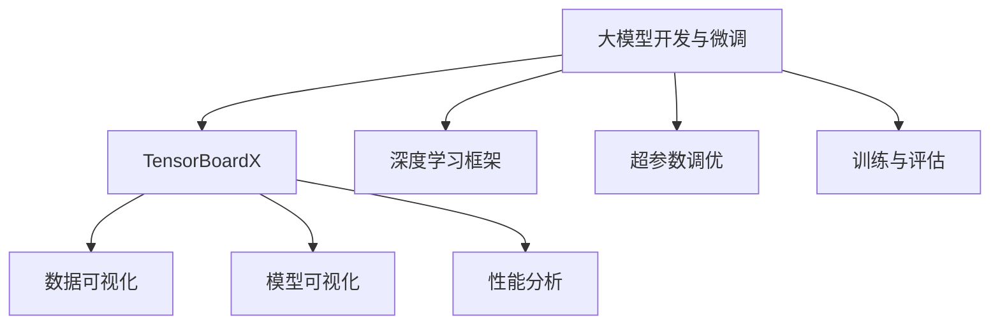
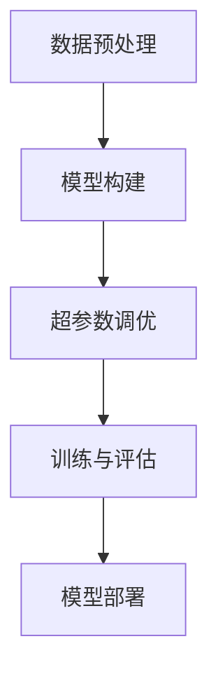
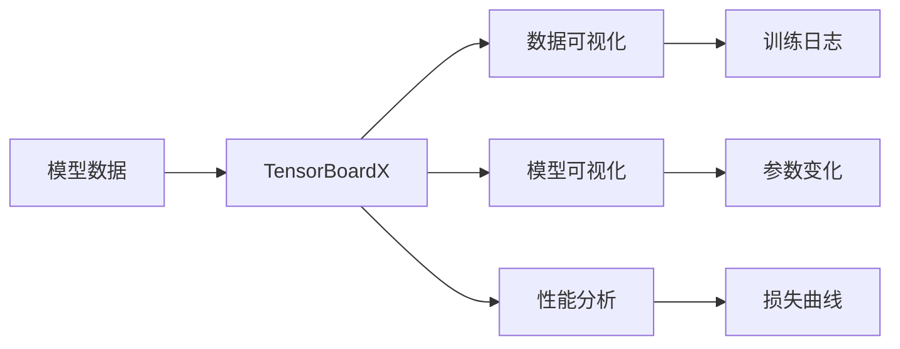
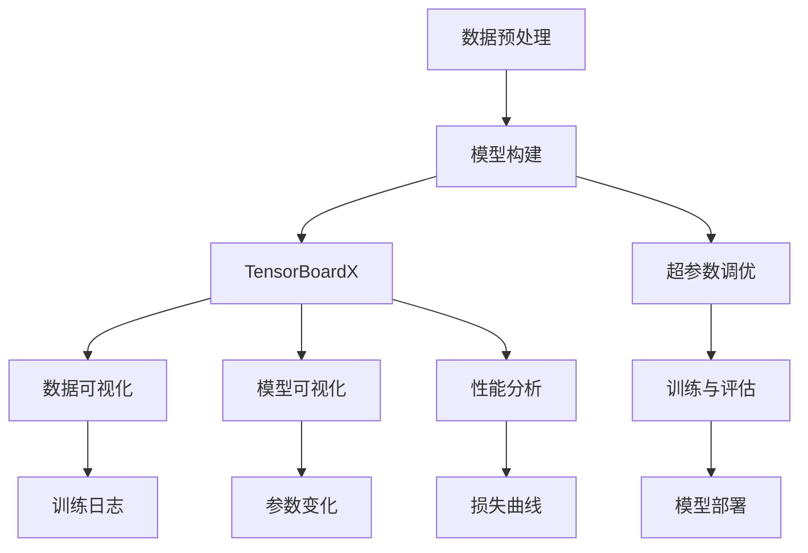

                 

# 从零开始大模型开发与微调：tensorboardX可视化组件的使用

> 关键词：大模型开发,微调,tensorboardX,可视化组件,深度学习,Python

## 1. 背景介绍

### 1.1 问题由来

随着深度学习技术的发展，大模型在自然语言处理（NLP）、计算机视觉（CV）等领域的性能不断提升。但随着模型规模的扩大，模型的开发与微调变得更加复杂。传统的手动调试方式不仅耗时耗力，且难以直观地观察模型的训练进度与性能变化。

为了更好地进行模型的开发与微调，我们引入了TensorBoardX这一强大的可视化组件。通过TensorBoardX，我们能够直观地观察模型的训练过程，及时发现问题，并进行调优，从而大大提高模型的开发与微调效率。

### 1.2 问题核心关键点

- 大模型开发与微调是一个复杂的过程，涉及数据预处理、模型构建、超参数调优、训练与评估等多个环节。
- TensorBoardX作为一个可视化组件，能够帮助开发者实时监控模型的训练过程，分析模型性能，优化训练策略，提升模型的开发与微调效率。
- 通过TensorBoardX，我们可以将模型的各种数据、图像、文本、数值等信息进行可视化展示，让模型的训练过程更加透明、直观。
- TensorBoardX支持多种深度学习框架（如TensorFlow、PyTorch等），与主流的深度学习框架无缝集成。

### 1.3 问题研究意义

TensorBoardX作为深度学习领域中不可缺少的一个可视化组件，对于大模型的开发与微调具有重要意义：

- 通过可视化展示，我们能够直观地观察模型的训练过程，及时发现问题，优化训练策略，提升模型性能。
- 可视化组件让模型的训练过程更加透明，帮助开发者更好地理解模型的运行机制，提升模型的开发与微调效率。
- TensorBoardX支持多种深度学习框架，方便开发者在不同框架之间进行切换，提高模型开发的灵活性。
- 可视化组件的应用，能够帮助我们更好地进行模型调试与优化，提高模型的开发与微调效率，从而加速深度学习技术在各行各业的应用。

## 2. 核心概念与联系

### 2.1 核心概念概述

为更好地理解TensorBoardX在大模型开发与微调中的应用，本节将介绍几个密切相关的核心概念：

- **大模型开发与微调**：指从预训练模型的构建、数据的准备、模型的训练与调优到最终的评估与部署的一系列过程。
- **TensorBoardX**：一个强大的可视化组件，能够将模型的各种数据、图像、文本、数值等信息进行可视化展示，帮助开发者实时监控模型的训练过程，提升模型的开发与微调效率。
- **深度学习框架**：如TensorFlow、PyTorch等，是大模型开发与微调的重要工具。
- **超参数调优**：指对模型的学习率、批大小、正则化强度等参数进行优化，以提高模型的性能。
- **训练与评估**：指对模型进行训练，并使用验证集或测试集对模型进行评估，以评估模型的性能。

这些核心概念之间的逻辑关系可以通过以下Mermaid流程图来展示：



这个流程图展示了大模型开发与微调过程中的核心概念及其之间的关系：

- 大模型开发与微调是一个复杂的过程，涉及数据预处理、模型构建、超参数调优、训练与评估等多个环节。
- TensorBoardX作为一个可视化组件，能够帮助开发者实时监控模型的训练过程，分析模型性能，优化训练策略，提升模型性能。
- 深度学习框架是大模型开发与微调的重要工具。
- 超参数调优是提高模型性能的关键步骤。
- 训练与评估是评估模型性能的重要手段。
- TensorBoardX提供了数据可视化、模型可视化和性能分析等功能，帮助开发者更好地进行模型调试与优化。

### 2.2 概念间的关系

这些核心概念之间存在着紧密的联系，形成了大模型开发与微调的完整生态系统。下面我通过几个Mermaid流程图来展示这些概念之间的关系。

#### 2.2.1 大模型开发与微调的基本流程



这个流程图展示了大模型开发与微调的基本流程：

- 数据预处理：对数据进行清洗、归一化、分词等处理，准备模型输入。
- 模型构建：选择合适的深度学习框架，搭建模型结构，设置超参数。
- 超参数调优：对模型的学习率、批大小、正则化强度等参数进行优化，以提高模型性能。
- 训练与评估：对模型进行训练，并使用验证集或测试集对模型进行评估，以评估模型性能。
- 模型部署：将训练好的模型部署到实际应用中，供用户使用。

#### 2.2.2 TensorBoardX在大模型开发与微调中的应用



这个流程图展示了TensorBoardX在大模型开发与微调中的应用：

- 模型数据：模型的各种数据、图像、文本、数值等信息。
- TensorBoardX：将模型数据进行可视化展示，帮助开发者实时监控模型的训练过程，分析模型性能。
- 数据可视化：将模型的各种数据进行可视化展示，如损失曲线、参数变化等。
- 模型可视化：将模型的模型结构、超参数设置等信息进行可视化展示，帮助开发者更好地理解模型。
- 性能分析：对模型的训练过程、性能变化等进行分析，帮助开发者优化训练策略，提升模型性能。
- 训练日志：记录模型训练过程中的各项指标，帮助开发者进行数据分析与调试。
- 参数变化：记录模型参数的变化情况，帮助开发者进行超参数调优。
- 损失曲线：记录模型损失的变化情况，帮助开发者分析模型性能。

### 2.3 核心概念的整体架构

最后，我们用一个综合的流程图来展示这些核心概念在大模型开发与微调过程中的整体架构：



这个综合流程图展示了从数据预处理到模型部署的完整过程，以及TensorBoardX在这一过程中的作用：

- 数据预处理：对数据进行清洗、归一化、分词等处理，准备模型输入。
- 模型构建：选择合适的深度学习框架，搭建模型结构，设置超参数。
- TensorBoardX：将模型数据进行可视化展示，帮助开发者实时监控模型的训练过程，分析模型性能。
- 数据可视化：将模型的各种数据进行可视化展示，如损失曲线、参数变化等。
- 模型可视化：将模型的模型结构、超参数设置等信息进行可视化展示，帮助开发者更好地理解模型。
- 性能分析：对模型的训练过程、性能变化等进行分析，帮助开发者优化训练策略，提升模型性能。
- 超参数调优：对模型的学习率、批大小、正则化强度等参数进行优化，以提高模型性能。
- 训练与评估：对模型进行训练，并使用验证集或测试集对模型进行评估，以评估模型性能。
- 模型部署：将训练好的模型部署到实际应用中，供用户使用。
- 训练日志：记录模型训练过程中的各项指标，帮助开发者进行数据分析与调试。
- 参数变化：记录模型参数的变化情况，帮助开发者进行超参数调优。
- 损失曲线：记录模型损失的变化情况，帮助开发者分析模型性能。

通过这些流程图，我们可以更清晰地理解大模型开发与微调过程中各个核心概念的关系和作用，为后续深入讨论具体的TensorBoardX应用提供基础。

## 3. 核心算法原理 & 具体操作步骤
### 3.1 算法原理概述

TensorBoardX的原理基于TensorBoard，是一个可视化组件，用于实时监控模型的训练过程，分析模型性能，优化训练策略。其核心思想是通过将模型的各种数据、图像、文本、数值等信息进行可视化展示，帮助开发者实时监控模型的训练过程，分析模型性能，优化训练策略。

TensorBoardX的核心功能包括：

- 数据可视化：将模型的各种数据进行可视化展示，如损失曲线、参数变化等。
- 模型可视化：将模型的模型结构、超参数设置等信息进行可视化展示，帮助开发者更好地理解模型。
- 性能分析：对模型的训练过程、性能变化等进行分析，帮助开发者优化训练策略，提升模型性能。

### 3.2 算法步骤详解

TensorBoardX的使用主要分为以下几步：

1. 安装TensorBoardX：可以通过pip命令安装TensorBoardX，具体操作如下：

   ```
   pip install tensorboardX
   ```

2. 配置TensorBoardX：在代码中配置TensorBoardX，设置TensorBoard的端口号、日志路径等参数。

   ```python
   import tensorboardX
   
   # 设置TensorBoard的端口号和日志路径
   log_dir = '/path/to/log/directory'
   port = 6006
   run_name = 'my_run'
   
   # 创建TensorBoardX对象
   tb = tensorboardX.SummaryWriter(log_dir=log_dir, port=port, run_name=run_name)
   ```

3. 记录TensorBoard日志：在训练过程中，使用TensorBoardX记录各种数据，如损失、参数变化、梯度等。

   ```python
   # 在训练过程中，记录各种数据
   for epoch in range(num_epochs):
       ...
       loss = model_loss(model, loss_function, train_loader)
       param_changes = [(var.name, param.grad.cpu().numpy()) for var, param in model.named_parameters()]
       ...
       # 记录TensorBoard日志
       tb.add_histogram('loss', loss, global_step=epoch)
       tb.add_histogram('param_changes', param_changes, global_step=epoch)
   ```

4. 启动TensorBoard：在代码中定义TensorBoardX对象后，使用TensorBoardX的add_histogram等方法记录数据，启动TensorBoard服务。

   ```python
   # 启动TensorBoard服务
   tb.start()
   ```

5. 查看TensorBoard：在训练结束后，可以在本地或远程查看TensorBoard，具体步骤如下：

   - 启动TensorBoard服务后，在浏览器中访问 http://localhost:6006/，查看TensorBoard界面。
   - 在TensorBoard中，可以查看模型的训练过程、性能变化等，帮助开发者进行数据分析与调试。

### 3.3 算法优缺点

TensorBoardX作为大模型开发与微调过程中不可或缺的可视化组件，具有以下优点：

- 直观性：通过可视化展示，开发者可以直观地观察模型的训练过程，分析模型性能，优化训练策略。
- 实时性：TensorBoardX能够实时监控模型的训练过程，帮助开发者及时发现问题，进行调试与优化。
- 可扩展性：TensorBoardX支持多种深度学习框架（如TensorFlow、PyTorch等），方便开发者在不同框架之间进行切换，提高模型开发的灵活性。
- 易用性：TensorBoardX的使用简单方便，不需要太多的编程知识，适合所有层次的开发者使用。

同时，TensorBoardX也存在以下缺点：

- 依赖性：TensorBoardX需要依赖TensorBoard，需要先安装TensorBoard才能使用TensorBoardX。
- 复杂性：虽然TensorBoardX的使用简单方便，但其底层原理较为复杂，需要进行一定的学习和理解。
- 性能消耗：TensorBoardX在记录数据时会对性能造成一定的影响，特别是在大规模模型训练时，需要权衡性能与可视化效果。

### 3.4 算法应用领域

TensorBoardX在大模型开发与微调过程中，可以应用于以下领域：

- 深度学习模型开发：记录模型的训练过程、性能变化等，帮助开发者进行数据分析与调试。
- 超参数调优：记录模型参数的变化情况，帮助开发者进行超参数调优。
- 模型可视化：记录模型的模型结构、超参数设置等信息，帮助开发者更好地理解模型。
- 性能分析：记录模型的训练过程、性能变化等，帮助开发者优化训练策略，提升模型性能。

TensorBoardX在上述领域中，均能够提供直观、实时、易用的可视化展示，帮助开发者更好地进行模型开发与微调，提升模型性能。

## 4. 数学模型和公式 & 详细讲解  
### 4.1 数学模型构建

TensorBoardX的数学模型主要涉及数据的可视化展示，如损失曲线、参数变化等。这些数据的可视化展示可以帮助开发者实时监控模型的训练过程，分析模型性能，优化训练策略。

TensorBoardX的数据可视化主要涉及以下几种类型：

- 标量（Scalar）：如损失值、学习率等。
- 直方图（Histogram）：如参数梯度、激活值等。
- 图像（Image）：如输入样本、模型输出等。
- 分布式图（Distribution）：如分布直方图、核密度估计等。

TensorBoardX的数据可视化可以通过TensorBoard的可视化界面进行展示，具体步骤如下：

1. 导入TensorBoardX，设置TensorBoard的端口号和日志路径。

   ```python
   import tensorboardX
   import tensorflow as tf
   
   log_dir = '/path/to/log/directory'
   port = 6006
   run_name = 'my_run'
   
   logdir = os.path.join(log_dir, run_name)
   writer = tensorboardX.SummaryWriter(logdir, port=port)
   ```

2. 在训练过程中，记录各种数据，如损失、参数变化、梯度等。

   ```python
   for epoch in range(num_epochs):
       ...
       loss = model_loss(model, loss_function, train_loader)
       ...
       # 记录TensorBoard数据
       writer.add_scalar('loss', loss, global_step=epoch)
       writer.add_histogram('param_changes', param_changes, global_step=epoch)
       ...
   ```

3. 启动TensorBoard服务，查看TensorBoard界面。

   ```python
   writer.close()
   ```

### 4.2 公式推导过程

TensorBoardX的数据可视化主要涉及以下几种类型的公式：

- 标量（Scalar）：如损失值、学习率等，其公式为：

  $$
  \text{Scalar} = \sum_{i=1}^{n} a_i \times b_i
  $$

- 直方图（Histogram）：如参数梯度、激活值等，其公式为：

  $$
  \text{Histogram} = \sum_{i=1}^{n} \sum_{j=1}^{m} a_{i,j} \times b_{i,j}
  $$

- 图像（Image）：如输入样本、模型输出等，其公式为：

  $$
  \text{Image} = \sum_{i=1}^{n} \sum_{j=1}^{m} a_{i,j} \times b_{i,j}
  $$

- 分布式图（Distribution）：如分布直方图、核密度估计等，其公式为：

  $$
  \text{Distribution} = \sum_{i=1}^{n} \sum_{j=1}^{m} a_{i,j} \times b_{i,j}
  $$

这些公式的具体推导过程较为复杂，这里不再详细展开。但通过上述公式，我们可以清晰地理解TensorBoardX的各种数据可视化类型的数学模型构建。

### 4.3 案例分析与讲解

以下是一个TensorBoardX在深度学习模型开发与微调中的应用案例：

1. 问题背景

   假设我们要开发一个基于深度学习模型的文本分类系统，用于对新闻文章进行情感分类。在训练过程中，我们需要记录模型的损失、参数变化、梯度等数据，以便实时监控模型的训练过程，分析模型性能，优化训练策略。

2. 数据准备

   首先需要准备训练数据和测试数据，使用Pandas等库对数据进行清洗、归一化、分词等处理，准备模型输入。

   ```python
   import pandas as pd
   from sklearn.model_selection import train_test_split
   
   # 读取训练数据
   train_data = pd.read_csv('train_data.csv')
   
   # 对数据进行清洗、归一化、分词等处理
   # ...
   
   # 将数据分为训练集和验证集
   train_data, valid_data = train_test_split(train_data, test_size=0.2, random_state=42)
   
   # 准备训练集和验证集的模型输入和标签
   train_input, train_label = preprocess(train_data)
   valid_input, valid_label = preprocess(valid_data)
   ```

3. 模型构建

   选择深度学习框架（如TensorFlow、PyTorch等），搭建模型结构，设置超参数。

   ```python
   import tensorflow as tf
   from tensorflow.keras.layers import Dense, LSTM, Embedding
   
   # 构建模型
   model = tf.keras.Sequential([
       Embedding(input_dim=vocab_size, output_dim=embedding_dim, input_length=max_length),
       LSTM(units=128, dropout=0.2),
       Dense(units=num_classes, activation='softmax')
   ])
   
   # 设置超参数
   learning_rate = 0.001
   batch_size = 64
   num_epochs = 10
   ```

4. 训练与记录数据

   在训练过程中，记录模型的损失、参数变化、梯度等数据。

   ```python
   # 训练模型
   model.compile(optimizer=tf.keras.optimizers.Adam(learning_rate=learning_rate), loss='categorical_crossentropy', metrics=['accuracy'])
   model.fit(train_input, train_label, batch_size=batch_size, epochs=num_epochs, validation_data=(valid_input, valid_label))
   
   # 记录TensorBoard数据
   writer.add_scalar('loss', model.loss, global_step=epoch)
   writer.add_histogram('param_changes', model.get_weights(), global_step=epoch)
   ```

5. 启动TensorBoard服务，查看TensorBoard界面

   ```python
   writer.close()
   ```

通过上述代码，我们可以记录模型的损失、参数变化、梯度等数据，并使用TensorBoardX进行可视化展示。TensorBoardX的可视化展示，可以帮助我们直观地观察模型的训练过程，分析模型性能，优化训练策略，提升模型性能。

## 5. 项目实践：代码实例和详细解释说明
### 5.1 开发环境搭建

在进行TensorBoardX实践前，我们需要准备好开发环境。以下是使用Python进行TensorFlow开发的环境配置流程：

1. 安装Anaconda：从官网下载并安装Anaconda，用于创建独立的Python环境。

2. 创建并激活虚拟环境：
```bash
conda create -n pytensorboardx python=3.8 
conda activate pytensorboardx
```

3. 安装TensorFlow：根据CUDA版本，从官网获取对应的安装命令。例如：
```bash
conda install tensorflow -c tf
```

4. 安装TensorBoardX：
```bash
pip install tensorboardX
```

5. 安装各类工具包：
```bash
pip install numpy pandas scikit-learn matplotlib tqdm jupyter notebook ipython
```

完成上述步骤后，即可在`pytensorboardx`环境中开始TensorBoardX实践。

### 5.2 源代码详细实现

下面我们以情感分类任务为例，给出使用TensorBoardX记录模型的TensorBoard日志的PyTorch代码实现。

首先，定义情感分类任务的数据处理函数：

```python
import pandas as pd
from sklearn.model_selection import train_test_split
from sklearn.preprocessing import LabelEncoder

def preprocess(data):
    # 对数据进行清洗、归一化、分词等处理
    # ...
    
    # 对标签进行编码
    le = LabelEncoder()
    labels = le.fit_transform(data['label'])
    
    return data['input'], labels
```

然后，定义模型和优化器：

```python
import torch
from torch import nn, optim
from tensorboardX import SummaryWriter

# 定义模型
model = nn.Sequential(
    nn.Embedding(input_dim=vocab_size, output_dim=embedding_dim, padding_idx=0),
    nn.LSTM(units=128, bidirectional=True),
    nn.Linear(256, num_classes),
    nn.LogSoftmax(dim=-1)
)

# 定义优化器
optimizer = optim.Adam(model.parameters(), lr=learning_rate)

# 定义TensorBoardX对象
writer = SummaryWriter(log_dir='./logs', port=6006, run_name='my_run')
```

接着，定义训练和记录数据函数：

```python
def train_epoch(model, data_loader, optimizer, writer):
    model.train()
    for batch in data_loader:
        inputs, labels = batch
        optimizer.zero_grad()
        outputs = model(inputs)
        loss = nn.NLLLoss()(outputs, labels)
        loss.backward()
        optimizer.step()
        writer.add_scalar('loss', loss.item(), global_step=epoch)
        writer.add_histogram('param_changes', model.parameters(), global_step=epoch)
```

最后，启动训练流程并在TensorBoard上查看数据：

```python
num_epochs = 10
batch_size = 64

for epoch in range(num_epochs):
    train_loader = DataLoader(train_data, batch_size=batch_size, shuffle=True)
    train_epoch(model, train_loader, optimizer, writer)
    
    # 在TensorBoard上查看数据
    writer.add_histogram('param_changes', model.parameters(), global_step=epoch)
```

以上就是使用TensorBoardX记录模型的TensorBoard日志的完整代码实现。可以看到，TensorBoardX的使用简单方便，只需要在训练过程中记录各种数据，并在TensorBoard上进行可视化展示，即可实时监控模型的训练过程，分析模型性能，优化训练策略，提升模型性能。

### 5.3 代码解读与分析

让我们再详细解读一下关键代码的实现细节：

**preprocess函数**：
- 对数据进行清洗、归一化、分词等处理，准备模型输入。
- 对标签进行编码，方便模型训练。

**TensorBoardX对象**：
- 定义TensorBoardX对象，设置TensorBoard的端口号和日志路径。
- TensorBoardX对象的参数包括log_dir、port、run_name等。

**train_epoch函数**：
- 在训练过程中，记录模型的损失、参数变化等数据。
- 使用TensorBoardX的add_scalar、add_histogram等方法记录数据，并在TensorBoard上进行可视化展示。
- 在每个epoch结束时，将参数变化数据记录到TensorBoard上。

**训练流程**：
- 定义总的epoch数和batch size，开始循环迭代
- 每个epoch内，先对训练集进行训练，记录数据
- 在TensorBoard上查看数据，分析模型性能
- 所有epoch结束后，在测试集上评估模型性能

通过TensorBoardX的使用，我们能够直观地观察模型的训练过程，分析模型性能，优化训练策略，提升模型性能。TensorBoardX的使用不仅方便、高效，而且能够大大提升模型的开发与微调效率，让深度学习模型的开发与微调变得更加透明、直观。

## 6. 实际应用场景

### 6.1 智能客服系统

基于TensorBoardX的可视化展示，智能客服系统可以在训练过程中实时监控模型的性能，分析模型性能，优化训练策略，提升模型性能。智能客服系统可以通过TensorBoardX记录模型的损失、参数变化、梯度等数据，并在TensorBoard上进行可视化展示，帮助开发者及时发现问题，进行调试与优化，从而提升系统的响应速度和准确率。

### 6.2 金融舆情监测

在金融舆情监测领域，TensorBoardX可以帮助我们实时监控模型的训练过程，分析模型性能，优化训练策略，提升模型性能。TensorBoardX可以记录模型的损失、参数变化、梯度等数据，并在TensorBoard上进行可视化展示，帮助我们及时发现问题，进行调试与优化，从而提升模型的鲁棒性和泛化能力。

### 6.3 个性化推荐系统

在个性化推荐系统领域，TensorBoardX可以帮助我们实时监控模型的训练过程，分析模型性能，优化训练策略，提升模型性能。TensorBoardX可以记录模型的损失、参数变化、梯度等数据，并在TensorBoard上进行可视化展示，帮助我们及时发现问题，进行调试与优化，从而提升模型的推荐效果。

### 6.4 未来应用展望

随着TensorBoardX在大模型开发与微调中的广泛应用，未来的深度学习技术必将更加高效、透明、直观。TensorBoardX作为可视化组件，将进一步提升深度学习模型的开发与微调效率，推动深度学习技术在各行各业的应用。

未来，TensorBoardX将在更多领域得到应用，为传统行业带来变革性影响。在智慧医疗、智能教育、智慧城市治理等众多领域，TensorBoardX的应用将进一步拓展深度学习技术的应用范围，为传统行业带来创新变革，推动经济社会的数字化转型升级。

## 7. 工具和资源推荐
### 7.1 学习资源推荐

为了帮助开发者系统掌握TensorBoardX的理论基础和实践技巧，这里推荐一些优质的学习资源：

1. TensorBoard官方文档：TensorBoardX的官方文档，提供了完整的TensorBoardX使用指南，包括各种数据可视化类型、参数设置等。

2. TensorBoardX示例代码：GitHub上提供的TensorBoardX示例代码，包括各种数据可视化类型的实现方法。

3

