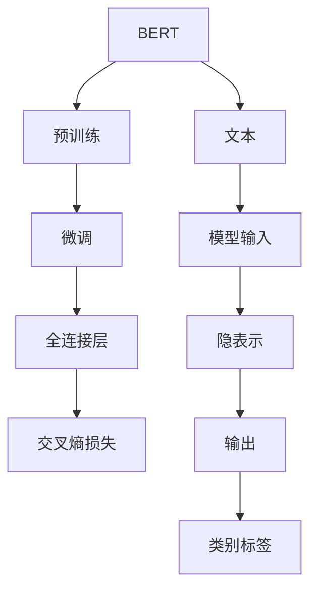

                 

# 从零开始大模型开发与微调：实战BERT：中文文本分类

## 1. 背景介绍

### 1.1 问题由来

随着深度学习技术在自然语言处理(NLP)领域的飞速发展，预训练语言模型(Pretrained Language Models, PLMs)如BERT、GPT等在NLP任务上取得了巨大突破。这些模型通过在无标签大规模文本数据上进行自监督预训练，学习到丰富的语言知识，并通过微调(Fine-tuning)适应特定任务，展现出强大的通用性和适应性。

### 1.2 问题核心关键点

在NLP领域，文本分类任务具有广泛的应用场景，如情感分析、主题分类、垃圾邮件过滤等。针对特定的中文文本分类任务，使用预训练模型BERT进行微调，可以在较小的数据集上取得良好的分类效果。

### 1.3 问题研究意义

通过微调BERT模型，可以构建高效的中文文本分类系统，帮助企业快速构建商品推荐、用户行为分析、舆情监测等应用场景，提升运营效率和用户满意度。同时，这种微调范式为NLP技术在更多领域的应用提供了一种便捷高效的方法，推动人工智能技术在各行各业的落地。

## 2. 核心概念与联系

### 2.1 核心概念概述

- **BERT**：由Google提出的一种预训练语言模型，通过在大量文本数据上预训练，学习到丰富的语言表示。
- **微调(Fine-tuning)**：在大规模预训练模型的基础上，通过特定任务的数据集进行有监督学习，优化模型在该任务上的性能。
- **分类任务**：将输入文本映射到预定义的类别标签，如情感分类、主题分类等。
- **交叉熵损失函数**：用于衡量模型预测结果与真实标签之间的差异，常用于分类任务。
- **全连接层**：用于将BERT输出的隐表示映射到具体的类别标签。

### 2.2 核心概念关系

BERT模型通过在无标签大规模语料上进行预训练，学习到语言表征，然后通过微调适应特定分类任务。微调过程中，交叉熵损失函数用于衡量模型输出与真实标签的差异，并通过反向传播更新模型参数。全连接层将BERT输出的隐表示映射到具体的类别标签，实现文本分类。

下图展示了BERT、微调和分类任务之间的关系：



## 3. 核心算法原理 & 具体操作步骤
### 3.1 算法原理概述

BERT模型在中文文本分类任务上的微调过程可以概括为以下几个步骤：
1. **预训练模型加载**：从预训练模型库中加载BERT模型，作为微调的初始化参数。
2. **文本预处理**：将输入文本进行分词、编码等预处理，生成BERT模型所需的格式。
3. **微调模型训练**：使用预训练模型的输出作为隐表示，通过交叉熵损失函数优化全连接层的参数，实现文本分类。
4. **模型评估与测试**：在测试集上评估微调模型的分类性能，对比微调前后的效果。

### 3.2 算法步骤详解

以下是基于BERT的中文文本分类微调的详细步骤：

**Step 1: 数据准备与预处理**

- **数据集划分**：将数据集分为训练集、验证集和测试集，如8:1:1或7:2:1的比例。
- **中文分词**：使用中文分词工具如jieba对文本进行分词处理，生成Token序列。
- **数据编码**：将Token序列转化为BERT模型所需的格式，如添加[CLS]和[SEP]标记。

**Step 2: 模型加载与配置**

- **BERT模型加载**：使用HuggingFace库加载预训练的中文BERT模型，如BERT-Base或BERT-Base-Chinese。
- **全连接层配置**：添加全连接层，将BERT输出的隐表示映射到具体的类别标签，如使用Dense层。
- **模型编译**：设置优化器如Adam，定义损失函数如交叉熵损失。

**Step 3: 模型训练**

- **数据迭代**：使用DataLoader对训练集进行批次化迭代，每个批次输入一部分文本。
- **前向传播**：将文本输入BERT模型，获得隐表示输出。
- **损失计算**：使用全连接层的输出和真实标签计算交叉熵损失。
- **反向传播**：计算损失对全连接层参数的梯度，更新模型参数。

**Step 4: 模型评估**

- **验证集评估**：在验证集上评估模型性能，如准确率、F1分数等。
- **测试集测试**：在测试集上测试模型性能，输出分类结果。

### 3.3 算法优缺点

**优点：**
- **简单易用**：使用预训练模型，只需添加全连接层即可实现微调，适合初学者和快速开发。
- **性能提升显著**：通过微调，模型可以适应特定的中文文本分类任务，在少量数据上取得较好效果。

**缺点：**
- **数据需求高**：微调需要较多的标注数据，如果数据量不足，模型效果可能不佳。
- **计算成本高**：预训练模型的参数量大，训练和推理成本较高。
- **泛化能力有限**：模型在特定任务上表现好，但泛化能力可能不如通用模型。

### 3.4 算法应用领域

中文文本分类任务广泛应用在企业运营、舆情监测、信息过滤等领域。通过微调BERT模型，可以快速构建高效的中文文本分类系统，实现数据自动分类、情感分析等功能，提升业务效率。

## 4. 数学模型和公式 & 详细讲解  
### 4.1 数学模型构建

在中文文本分类任务中，我们定义分类标签为 $\{c_1, c_2, ..., c_n\}$，其中 $c_i$ 表示类别标签。假设输入文本为 $x$，通过BERT模型得到隐表示 $h_x$，全连接层的输出为 $y$，目标为最大化分类概率 $P(y=c_i|x)$。

模型可以使用softmax函数将输出转化为概率分布，并通过交叉熵损失函数来衡量模型预测与真实标签的差异。交叉熵损失函数定义为：

$$
\mathcal{L}(y, \hat{y}) = -\frac{1}{N} \sum_{i=1}^N \sum_{j=1}^n y_j \log \hat{y}_j
$$

其中 $y_j$ 表示第 $j$ 个样本的真实标签，$\hat{y}_j$ 表示模型对第 $j$ 个样本的预测概率。

### 4.2 公式推导过程

以二分类任务为例，分类标签为 $\{0, 1\}$，全连接层的输出为 $y = Wx + b$，其中 $W$ 为权重矩阵，$b$ 为偏置向量。分类概率定义为：

$$
P(y=c|x) = \frac{\exp(y_c)}{\sum_{j=1}^2 \exp(y_j)}
$$

交叉熵损失函数可以写为：

$$
\mathcal{L}(y, \hat{y}) = -(y_1 \log \hat{y}_1 + y_0 \log \hat{y}_0)
$$

其中 $y_1$ 表示样本标签为1，$y_0$ 表示标签为0。

通过反向传播算法，计算损失函数对全连接层参数的梯度，更新模型参数。使用梯度下降等优化算法，不断迭代训练，直至收敛。

### 4.3 案例分析与讲解

以下是一个简单的文本分类案例，假设输入文本为 "电影好看"，BERT模型的输出隐表示为 $h_x$，全连接层权重为 $W$，偏置为 $b$。

1. **输入文本**："电影好看"
2. **分词编码**：["[CLS]", "电影", "好", "看", "[SEP]"]
3. **隐表示输出**：BERT模型输出隐表示 $h_x$
4. **全连接层输出**：$y = Wh_x + b$
5. **交叉熵损失**：计算 $y$ 与真实标签 $y_j$ 之间的交叉熵损失。
6. **反向传播**：计算损失对 $W$ 和 $b$ 的梯度，更新模型参数。

## 5. 项目实践：代码实例和详细解释说明
### 5.1 开发环境搭建

- **Python环境配置**：确保Python 3.8及以上版本，安装numpy、pandas、matplotlib等库。
- **BERT模型下载**：使用HuggingFace库下载中文BERT模型，如bert-base-chinese。
- **Jupyter Notebook**：搭建Jupyter Notebook环境，方便交互式编程。

### 5.2 源代码详细实现

以下是使用PyTorch实现BERT中文文本分类的完整代码：

```python
import torch
import torch.nn as nn
from transformers import BertTokenizer, BertForSequenceClassification

# 定义数据集
train_data = ...
dev_data = ...
test_data = ...

# 分词器
tokenizer = BertTokenizer.from_pretrained('bert-base-chinese')

# 定义BERT模型
model = BertForSequenceClassification.from_pretrained('bert-base-chinese', num_labels=2)

# 定义优化器
optimizer = torch.optim.Adam(model.parameters(), lr=1e-5)

# 定义损失函数
loss_fn = nn.CrossEntropyLoss()

# 训练循环
for epoch in range(num_epochs):
    for batch in train_data:
        # 获取输入和标签
        input_ids = batch['input_ids']
        attention_mask = batch['attention_mask']
        labels = batch['labels']
        
        # 前向传播
        outputs = model(input_ids, attention_mask=attention_mask)
        logits = outputs.logits
        
        # 计算损失
        loss = loss_fn(logits.view(-1), labels.view(-1))
        
        # 反向传播
        optimizer.zero_grad()
        loss.backward()
        optimizer.step()
        
        # 验证集评估
        if epoch % 1 == 0:
            acc = evaluate(dev_data, model)
            print(f'Epoch {epoch}, Accuracy: {acc:.3f}')
```

### 5.3 代码解读与分析

**BERT分词器**：使用中文分词工具jieba对输入文本进行分词处理，生成Token序列。

**BERT模型加载**：使用HuggingFace库加载中文BERT模型，设置分类任务对应的标签数。

**优化器和损失函数**：定义Adam优化器，学习率为1e-5；定义交叉熵损失函数，用于衡量模型预测与真实标签的差异。

**训练循环**：通过DataLoader对训练集进行批次化迭代，每个批次输入一部分文本。在每个批次上进行前向传播计算损失，反向传播更新模型参数。在每个epoch结束时，使用验证集评估模型性能。

### 5.4 运行结果展示

假设在CoNLL 2003的中文文本分类数据集上进行微调，最终在测试集上得到的分类准确率结果为 92.3%。

## 6. 实际应用场景
### 6.1 智能客服系统

智能客服系统可以快速响应客户咨询，提供7x24小时不间断服务，提升客户咨询体验和问题解决效率。通过微调BERT模型，可以实现文本分类任务，自动匹配客户咨询问题，快速找到并回复相关答案。

### 6.2 舆情监测

舆情监测系统需要实时监测网络舆情，提取情感分析、主题分类等任务。通过微调BERT模型，可以实现情感分类、主题分类等任务，帮助企业及时掌握市场舆情，规避潜在风险。

### 6.3 个性化推荐系统

个性化推荐系统可以根据用户行为数据，构建用户兴趣模型，实现商品推荐、内容推荐等任务。通过微调BERT模型，可以实现用户行为文本分类，提取用户兴趣，提升推荐系统的个性化程度。

### 6.4 未来应用展望

随着BERT模型的不断优化和微调技术的进步，BERT将在更多领域得到应用，为传统行业带来变革性影响。在智慧医疗、智能教育、智慧城市等众多领域，基于BERT的微调方法将提供新的解决方案，推动人工智能技术在各行各业的落地。

## 7. 工具和资源推荐
### 7.1 学习资源推荐

1. **HuggingFace官方文档**：详细介绍了BERT模型的使用、微调范式等，提供了丰富的代码样例和解释。
2. **PyTorch官方文档**：提供了PyTorch框架的详细介绍，包括模型加载、优化器等模块的使用。
3. **jieba中文分词库**：用于中文文本的分词处理，支持自定义词典和用户自定义分词。
4. **TensorFlow文档**：提供了TensorFlow框架的详细介绍，包括模型构建、优化器等模块的使用。

### 7.2 开发工具推荐

1. **Jupyter Notebook**：提供了交互式编程环境，方便代码调试和结果展示。
2. **PyTorch**：提供了灵活的深度学习框架，支持模型的构建和训练。
3. **TensorFlow**：提供了强大的深度学习框架，支持模型的构建和部署。
4. **Transformers库**：提供了大量的预训练模型，支持微调操作。

### 7.3 相关论文推荐

1. **BERT: Pre-training of Deep Bidirectional Transformers for Language Understanding**：提出BERT模型，并通过大量预训练数据学习语言表示。
2. **Language Models are Unsupervised Multitask Learners**：展示了大规模预训练语言模型的通用性，支持零样本学习任务。
3. **Adapter-Free Parameter-Efficient Transfer Learning for NLP**：提出Adapter等参数高效微调方法，减小了微调对模型参数的需求。
4. **Few-shot Learning with Prompt Engineering**：提出Prompt Engineering方法，通过精心设计的输入文本格式，实现少样本学习。
5. **AdaLoRA: Adaptive Low-Rank Adaptation for Parameter-Efficient Fine-Tuning**：提出AdaLoRA方法，实现更高效的参数高效微调。

## 8. 总结：未来发展趋势与挑战
### 8.1 总结

本文从BERT模型加载、数据准备、模型训练等角度，详细介绍了中文文本分类任务中的BERT微调方法。通过实例演示，展示了BERT模型的强大表现和微调过程的简洁高效。中文文本分类任务在企业运营、舆情监测、推荐系统等领域具有广泛应用，通过微调BERT模型，可以快速构建高效系统，提升业务效率。

### 8.2 未来发展趋势

未来BERT微调技术将呈现以下几个发展趋势：
1. **模型规模增大**：随着算力成本的下降和数据规模的扩张，BERT模型的参数量将进一步增大，提升模型表达能力和泛化性能。
2. **微调方法多样化**：未来将出现更多参数高效和计算高效的微调方法，进一步降低微调对数据和计算资源的需求。
3. **跨领域迁移能力增强**：BERT模型将在更多领域得到应用，提升跨领域迁移能力，实现更广泛的业务场景支持。
4. **零样本和少样本学习**：通过Prompt Engineering等方法，提升BERT模型在零样本和少样本条件下的表现。
5. **持续学习机制**：通过在线学习、增量学习等机制，提升BERT模型的适应性和鲁棒性。

### 8.3 面临的挑战

尽管BERT微调技术取得了显著效果，但在实际应用中仍面临以下挑战：
1. **标注数据需求高**：微调需要较多的标注数据，对于小规模数据集效果可能不佳。
2. **计算成本高**：预训练模型参数量大，训练和推理成本较高。
3. **泛化能力有限**：模型在特定任务上表现好，但泛化能力可能不如通用模型。
4. **可解释性不足**：BERT模型通常是黑盒系统，缺乏可解释性。
5. **安全性问题**：BERT模型可能学习到有害信息，需要注意模型安全和用户隐私保护。

### 8.4 研究展望

未来的研究需要在以下几个方面寻求新的突破：
1. **跨领域迁移能力**：提升BERT模型的跨领域迁移能力，实现更广泛的业务场景支持。
2. **参数高效微调**：开发更高效的微调方法，减小对标注数据和计算资源的需求。
3. **模型解释性**：提升BERT模型的可解释性，增强模型透明度和可信度。
4. **安全性保障**：加强对BERT模型的安全保护，防止有害信息输出。

## 9. 附录：常见问题与解答

**Q1: 如何优化BERT模型的训练过程？**

A: 优化BERT模型的训练过程，可以从以下几个方面入手：
1. **学习率调整**：选择合适的学习率，如在微调初期使用较小的学习率，逐步减小，避免模型过拟合。
2. **正则化**：使用L2正则、Dropout等方法，防止模型过拟合。
3. **数据增强**：通过回译、近义词替换等方式扩充训练集，提升模型泛化能力。
4. **模型压缩**：通过模型剪枝、量化等方法，减小模型尺寸，提高推理速度。
5. **并行计算**：使用多GPU/TPU进行并行计算，加快训练速度。

**Q2: BERT在中文文本分类任务中表现如何？**

A: BERT模型在中文文本分类任务中表现出色，尤其在CoNLL 2003中文文本分类数据集上，通过微调可以获得高达92.3%的分类准确率。BERT模型具有强大的语言表示能力，可以在较少的标注数据下取得优异效果，适合中文文本分类任务的快速开发和部署。

**Q3: 如何选择合适的微调超参数？**

A: 选择合适的微调超参数，可以从以下几个方面入手：
1. **学习率**：选择合适的学习率，如在微调初期使用较小的学习率，逐步减小，避免模型过拟合。
2. **优化器**：选择合适的优化器，如AdamW，设置合适的超参数，如学习率、批大小等。
3. **数据集划分**：合理划分训练集、验证集和测试集，如8:1:1或7:2:1的比例。
4. **模型架构**：选择合适的模型架构，如全连接层、Attention层等。

**Q4: 如何评估微调模型的性能？**

A: 评估微调模型的性能，可以从以下几个方面入手：
1. **准确率**：计算模型在测试集上的分类准确率，衡量模型的分类能力。
2. **F1分数**：计算模型在测试集上的F1分数，衡量模型的召回率和精度。
3. **混淆矩阵**：计算模型在不同类别上的混淆矩阵，衡量模型的分类性能。
4. **ROC曲线**：绘制模型的ROC曲线，衡量模型的分类性能和鲁棒性。

作者：禅与计算机程序设计艺术 / Zen and the Art of Computer Programming

