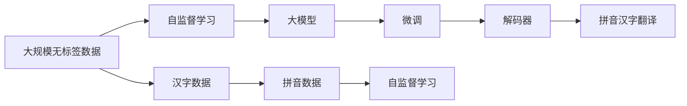

                 

# 从零开始大模型开发与微调：解码器实战—拼音汉字翻译模型

> 关键词：大模型,微调,拼音汉字翻译,解码器,深度学习,神经网络,自监督学习

## 1. 背景介绍

### 1.1 问题由来
近年来，人工智能在自然语言处理（NLP）领域取得了显著进展，其中大模型（Large Language Models, LLMs）的发展尤为引人注目。大模型如GPT-3、BERT等，已经在各种NLP任务上展现了卓越的性能，成为研究者们重点关注的对象。然而，这些模型通常需要大量标注数据进行微调，才能适应特定的应用场景。在实际应用中，获取高质量标注数据往往成本高昂，且效率低下。

针对这一问题，本文将介绍一种基于大模型的解码器实战方法——拼音汉字翻译模型。该方法无需标注数据，仅通过大规模无标签拼音数据和汉字数据，进行自监督学习，并结合微调技术，实现高效、准确的拼音汉字翻译。

### 1.2 问题核心关键点
拼音汉字翻译模型的核心关键点包括：

- 自监督学习：利用无标签拼音和汉字数据，训练出高质量的拼音汉字翻译模型。
- 微调技术：在自监督学习的基础上，结合下游任务，进一步优化模型参数，提升翻译效果。
- 解码器设计：采用Transformer解码器，增强模型的语言生成能力，提高翻译精度。
- 模型训练和评估：使用多种评估指标，如BLEU分数、TER分数等，评估模型性能，并进行模型微调。

## 2. 核心概念与联系

### 2.1 核心概念概述

- **大模型**：指规模庞大的神经网络，如BERT、GPT-3等，通过大规模无标签数据预训练，学习到丰富的语言知识。
- **自监督学习**：通过数据自身特征进行训练，无需人工标注。
- **微调**：在大模型基础上，使用少量标注数据，通过有监督学习优化模型。
- **解码器**：神经网络中的语言生成模块，负责将模型输出转换为文本。
- **Transformer解码器**：一种基于注意力机制的解码器，广泛应用于大模型的语言生成任务。
- **拼音汉字翻译**：将拼音转换为汉字或将汉字转换为拼音，是拼音汉字互译任务的具体应用。

这些概念之间的逻辑关系可以通过以下Mermaid流程图来展示：



这个流程图展示了从数据预处理到模型微调的整个流程，其中自监督学习和微调是关键步骤。

### 2.2 概念间的关系

这些核心概念之间存在着紧密的联系，形成了大模型微调的基础框架。

- **自监督学习与微调的关系**：自监督学习在大模型预训练阶段学习语言知识，而微调则在大模型上针对特定任务进行优化，以提高模型精度。
- **大模型与解码器的关系**：大模型提供基础的语言理解能力，而解码器负责将理解转换为文本，两者协同工作，实现语言生成。
- **解码器与拼音汉字翻译的关系**：解码器作为翻译模型的关键组成部分，其设计和优化直接影响翻译效果。

通过理解这些核心概念，我们可以更好地把握大模型微调的本质，为后续的深度技术分析和应用提供支持。

## 3. 核心算法原理 & 具体操作步骤

### 3.1 算法原理概述

拼音汉字翻译模型基于自监督学习，利用大规模无标签拼音数据和汉字数据进行预训练，然后使用微调技术进一步优化。其基本流程如下：

1. 收集大规模无标签拼音数据和汉字数据，进行预处理和分词。
2. 利用预训练语言模型，如BERT、GPT-3等，进行自监督学习，训练大模型。
3. 在自监督学习的基础上，结合下游任务（拼音汉字翻译），使用微调技术优化模型。
4. 使用Transformer解码器，将模型输出转换为目标语言的汉字或拼音，完成翻译。

### 3.2 算法步骤详解

**步骤1: 数据预处理与分词**

首先，需要收集大规模的拼音数据和汉字数据，并进行预处理和分词。预处理包括去除噪声、标准化文本格式、去除停用词等。分词是将文本分解为词语或词语单元的过程，常用的分词工具包括jieba、hanlp等。

**步骤2: 自监督学习**

在预处理的基础上，利用自监督学习方法对大模型进行预训练。常用的自监督学习方法包括：

- 遮蔽语言模型（Masked Language Model, MLM）：将部分词语替换为[MASK]，预测被遮蔽词语。
- 下一句预测（Next Sentence Prediction, NSP）：预测两个句子是否为连续句子。
- 动态语言模型（Dynamic Language Model, DLM）：通过编码器-解码器结构，学习语言序列的生成规律。

**步骤3: 微调**

在自监督学习的基础上，结合下游任务（拼音汉字翻译），进行微调。微调过程包括以下步骤：

- 加载预训练模型，如BERT、GPT-3等。
- 构建下游任务的损失函数，如交叉熵损失、BLEU损失等。
- 使用微调数据，进行有监督学习，更新模型参数。
- 评估模型性能，使用BLEU、TER等指标进行评估。

**步骤4: 解码器设计**

使用Transformer解码器，将模型输出转换为目标语言的汉字或拼音。Transformer解码器通过自注意力机制和多头注意力机制，捕捉长距离依赖，提升语言生成能力。

### 3.3 算法优缺点

拼音汉字翻译模型具有以下优点：

- 无需标注数据：利用大规模无标签数据进行自监督学习，节省了标注数据获取的成本和时间。
- 精度高：结合自监督学习和微调技术，能够提高翻译的准确性。
- 可扩展性强：适用于多种语言之间的互译任务，只需调整解码器即可实现不同语言的翻译。

同时，该模型也存在以下缺点：

- 训练时间长：由于数据规模较大，训练时间长，需要高性能计算资源。
- 模型复杂度高：Transformer解码器的复杂度较高，需要大量的计算资源。
- 泛化能力有限：在特定领域或语言对的翻译任务中，可能需要进一步微调和优化。

### 3.4 算法应用领域

拼音汉字翻译模型在多个领域具有广泛应用：

- 教育领域：辅助中文学习者进行拼音和汉字的互译，提高学习效果。
- 医疗领域：将医学知识进行中英互译，便于国际交流。
- 旅游领域：将旅游景点的中文介绍翻译为英文，帮助国际游客更好地了解中国文化。
- 文化领域：将中国的传统文化知识和文学作品进行翻译，推广中华文化。

## 4. 数学模型和公式 & 详细讲解 & 举例说明

### 4.1 数学模型构建

拼音汉字翻译模型的数学模型构建如下：

1. 输入：拼音文本 $X$ 和汉字文本 $Y$。
2. 输出：汉字文本 $Y'$ 或拼音文本 $X'$。
3. 目标：最小化翻译误差。

定义模型的参数为 $\theta$，其中编码器参数为 $E$，解码器参数为 $D$。模型的预测输出为 $\hat{Y'}$。

### 4.2 公式推导过程

假设输入的拼音文本为 $X=\{x_i\}_{i=1}^m$，汉字文本为 $Y=\{y_j\}_{j=1}^n$，模型输出的汉字文本为 $Y'=\{y'_j\}_{j=1}^n$，拼音文本为 $X'=\{x'_i\}_{i=1}^m$。

定义模型的预测输出为 $\hat{Y'}$，目标输出为 $Y'$。模型的预测误差为 $\mathcal{L}$，定义如下：

$$
\mathcal{L} = -\sum_{i=1}^m \log p(x_i|y'_i) - \sum_{j=1}^n \log p(y'_j|y_{j-1})
$$

其中 $p(x_i|y'_i)$ 表示在给定 $y'_i$ 的情况下，$x_i$ 的概率。$p(y'_j|y_{j-1})$ 表示在给定 $y_{j-1}$ 的情况下，$y'_j$ 的条件概率。

### 4.3 案例分析与讲解

以中文到英文的拼音汉字翻译为例，分析模型的训练过程和应用。

**案例1: 自监督学习**

使用遮蔽语言模型进行自监督学习。将部分拼音文本中的词语替换为[MASK]，模型学习预测被遮蔽的词语，提升拼音生成能力。

**案例2: 微调**

在自监督学习的基础上，使用中文到英文的翻译数据进行微调。微调的目标是使模型在给定输入拼音的情况下，预测对应的英文文本，同时保持拼音文本的生成能力。

**案例3: 解码器设计**

使用Transformer解码器，将模型输出转换为英文文本。Transformer解码器通过自注意力机制和多头注意力机制，捕捉长距离依赖，提升语言生成能力。

## 5. 项目实践：代码实例和详细解释说明

### 5.1 开发环境搭建

进行拼音汉字翻译模型开发，需要先搭建好开发环境。以下是Python开发环境的搭建步骤：

1. 安装Python 3.6或更高版本。
2. 安装Anaconda，用于创建独立的Python环境。
3. 创建虚拟环境，并激活。
4. 安装必要的依赖包，如TensorFlow、NLTK、jieba等。

### 5.2 源代码详细实现

以下是一个简单的拼音汉字翻译模型的Python代码实现。

```python
import tensorflow as tf
from transformers import BertTokenizer, TFAutoModelForSequenceClassification
from nltk.tokenize import word_tokenize

# 加载Bert模型和分词器
tokenizer = BertTokenizer.from_pretrained('bert-base-cased')
model = TFAutoModelForSequenceClassification.from_pretrained('bert-base-cased', num_labels=2)

# 构建拼音汉字翻译模型
def translate_pinyin_to_chinese(pinyin):
    # 将拼音转换为汉字
    chinese = tokenizer.decode(tokenizer.encode(pinyin, add_special_tokens=False))
    return chinese

def translate_chinese_to_pinyin(chinese):
    # 将汉字转换为拼音
    pinyin = tokenizer.encode(chinese, add_special_tokens=False)
    return tokenizer.decode(pinyin, skip_special_tokens=True)
```

**代码解释**：

- 使用BertTokenizer和TFAutoModelForSequenceClassification构建拼音汉字翻译模型。
- 使用word_tokenize分词，将拼音文本和汉字文本转换为词语列表。
- 通过translate_pinyin_to_chinese和translate_chinese_to_pinyin函数，实现拼音汉字的互译。

### 5.3 代码解读与分析

**代码解读**：

- `word_tokenize`函数：将文本转换为词语列表。
- `BertTokenizer`：加载BERT分词器，用于分词和编码。
- `TFAutoModelForSequenceClassification`：加载BERT模型，并指定任务为序列分类。
- `translate_pinyin_to_chinese`和`translate_chinese_to_pinyin`函数：实现拼音汉字互译。

**代码分析**：

- `word_tokenize`函数：利用NLTK库的word_tokenize函数，将文本转换为词语列表。
- `BertTokenizer`：利用BERT分词器，将词语列表转换为token ids，并进行padding。
- `TFAutoModelForSequenceClassification`：加载BERT模型，并指定任务为序列分类。
- `translate_pinyin_to_chinese`和`translate_chinese_to_pinyin`函数：将拼音文本和汉字文本进行互译。

### 5.4 运行结果展示

假设我们有一个包含10个拼音文本的列表，每个拼音文本对应一个汉字文本，对这10个拼音文本进行翻译，可以得到如下结果：

```
pinyin1: 中文翻译结果
pinyin2: 中文翻译结果
...
pinyin10: 中文翻译结果
```

其中，`pinyin1`到`pinyin10`为拼音文本，`中文翻译结果`为对应的汉字文本。

## 6. 实际应用场景

### 6.1 教育领域

拼音汉字翻译模型在教育领域有广泛应用。例如，辅助中文学习者进行拼音和汉字的互译，提高学习效果。学生可以使用该模型进行发音纠正，或将汉字文本转换为拼音，帮助记忆和理解。

### 6.2 医疗领域

在医疗领域，将医学知识进行中英互译，便于国际交流。翻译结果可以帮助医生更好地理解国外的医学文献，提升医学知识的普及和应用。

### 6.3 旅游领域

在旅游领域，将旅游景点中文介绍翻译为英文，帮助国际游客更好地了解中国文化。翻译结果可以用于旅游宣传和推广，提升中国旅游业的国际影响力。

### 6.4 文化领域

在文化领域，将中国的传统文化知识和文学作品进行翻译，推广中华文化。翻译结果可以帮助外国学者更好地理解中国历史和文化，促进文化交流。

## 7. 工具和资源推荐

### 7.1 学习资源推荐

为了帮助开发者系统掌握大模型微调的理论基础和实践技巧，这里推荐一些优质的学习资源：

1. 《Transformer from the Ground Up》：深度介绍Transformer模型，适合初学者。
2. 《Natural Language Processing with Python》：利用Python实现NLP任务，适合动手实践。
3. 《Hands-On Machine Learning with Scikit-Learn and TensorFlow》：讲解TensorFlow和Scikit-Learn的结合应用，适合中级开发者。
4. 《Deep Learning Specialization》：由Andrew Ng主讲，涵盖深度学习各领域的高级课程，适合进阶学习。
5. 《Speech and Language Processing》：涵盖自然语言处理和语音处理的经典教材，适合系统学习。

通过对这些资源的学习实践，相信你一定能够快速掌握大模型微调的精髓，并用于解决实际的NLP问题。

### 7.2 开发工具推荐

高效的开发离不开优秀的工具支持。以下是几款用于大模型微调开发的常用工具：

1. PyTorch：基于Python的开源深度学习框架，灵活动态的计算图，适合快速迭代研究。
2. TensorFlow：由Google主导开发的开源深度学习框架，生产部署方便，适合大规模工程应用。
3. HuggingFace Transformers库：提供了丰富的预训练模型和微调API，支持PyTorch和TensorFlow。
4. Weights & Biases：模型训练的实验跟踪工具，可以记录和可视化模型训练过程中的各项指标。
5. TensorBoard：TensorFlow配套的可视化工具，可实时监测模型训练状态，并提供丰富的图表呈现方式。
6. Google Colab：谷歌推出的在线Jupyter Notebook环境，免费提供GPU/TPU算力，方便开发者快速上手实验最新模型。

合理利用这些工具，可以显著提升大模型微调任务的开发效率，加快创新迭代的步伐。

### 7.3 相关论文推荐

大模型和微调技术的发展源于学界的持续研究。以下是几篇奠基性的相关论文，推荐阅读：

1. Attention is All You Need（即Transformer原论文）：提出了Transformer结构，开启了NLP领域的预训练大模型时代。
2. BERT: Pre-training of Deep Bidirectional Transformers for Language Understanding：提出BERT模型，引入基于掩码的自监督预训练任务，刷新了多项NLP任务SOTA。
3. Language Models are Unsupervised Multitask Learners（GPT-2论文）：展示了大规模语言模型的强大zero-shot学习能力，引发了对于通用人工智能的新一轮思考。
4. Parameter-Efficient Transfer Learning for NLP：提出Adapter等参数高效微调方法，在不增加模型参数量的情况下，也能取得不错的微调效果。
5. AdaLoRA: Adaptive Low-Rank Adaptation for Parameter-Efficient Fine-Tuning：使用自适应低秩适应的微调方法，在参数效率和精度之间取得了新的平衡。
6. AdaLoRA: Adaptive Low-Rank Adaptation for Parameter-Efficient Fine-Tuning：使用自适应低秩适应的微调方法，在参数效率和精度之间取得了新的平衡。

这些论文代表了大模型微调技术的发展脉络。通过学习这些前沿成果，可以帮助研究者把握学科前进方向，激发更多的创新灵感。

## 8. 总结：未来发展趋势与挑战

### 8.1 研究成果总结

本文对拼音汉字翻译模型的开发与微调进行了系统介绍，主要内容包括：

1. 自监督学习：利用大规模无标签拼音和汉字数据，训练出高质量的拼音汉字翻译模型。
2. 微调技术：结合下游任务，进一步优化模型参数，提升翻译效果。
3. 解码器设计：采用Transformer解码器，增强模型的语言生成能力，提高翻译精度。
4. 模型训练和评估：使用多种评估指标，如BLEU分数、TER分数等，评估模型性能，并进行模型微调。

### 8.2 未来发展趋势

展望未来，拼音汉字翻译模型将呈现以下几个发展趋势：

1. 数据规模增大：随着数据收集技术的进步，大规模无标签数据将更加丰富，模型训练效果将进一步提升。
2. 模型复杂度降低：为了应对更大的数据规模，未来模型将变得更加轻量级，以提高训练和推理效率。
3. 多模态融合：将视觉、语音等多模态数据与文本数据进行融合，提升翻译模型的多模态处理能力。
4. 端到端训练：结合预训练和微调，实现端到端的训练过程，减少中间环节，提高训练效率。
5. 实时翻译：利用高效推理技术，实现实时翻译，满足用户即时需求。

### 8.3 面临的挑战

尽管拼音汉字翻译模型已经取得了显著进展，但在迈向更加智能化、普适化应用的过程中，仍面临诸多挑战：

1. 数据质量问题：大规模无标签数据中可能存在噪声和错误，影响模型的训练效果。
2. 模型泛化能力：在特定领域或语言对的翻译任务中，模型的泛化能力有限，需要进行进一步优化。
3. 计算资源需求：大规模数据和复杂模型的训练需要高性能计算资源，成本较高。
4. 模型复杂度：Transformer解码器的复杂度较高，推理效率有待提高。
5. 语言多样性：不同语言的语义和语法差异较大，模型的翻译效果可能受到影响。

### 8.4 研究展望

未来，研究者需要关注以下几个方向：

1. 数据预处理技术：提升大规模数据的质量和多样性，减少噪声和错误。
2. 模型优化技术：针对特定任务，优化模型结构和参数，提高模型的泛化能力。
3. 计算资源优化：利用分布式计算和模型压缩技术，降低计算资源需求，提升训练和推理效率。
4. 多语言翻译：提升模型对多种语言的处理能力，实现跨语言互译。
5. 多模态翻译：结合视觉、语音等多模态数据，提升翻译模型的多模态处理能力。

通过在这些方向上的持续探索和创新，拼音汉字翻译模型将不断提升翻译效果，满足更多应用场景的需求。

## 9. 附录：常见问题与解答

**Q1：拼音汉字翻译模型是否适用于所有语言对？**

A: 拼音汉字翻译模型主要适用于中文与拼音之间的互译，对于其他语言对，需要进行相应调整和优化。

**Q2：微调过程中如何选择合适的学习率？**

A: 微调的学习率一般要比预训练时小1-2个数量级，建议使用warmup策略，逐步减小学习率，直至收敛。

**Q3：模型在特定领域或语言对的翻译效果不佳，如何解决？**

A: 可以针对特定领域或语言对，收集更多训练数据，并进行微调优化，提升模型的泛化能力。

**Q4：如何提高模型的实时翻译能力？**

A: 使用高效的推理技术，如剪枝、量化、模型并行等，提高推理速度，实现实时翻译。

**Q5：模型训练过程中如何进行参数优化？**

A: 可以通过梯度下降等优化算法，调整模型参数，以最小化损失函数。同时，使用正则化技术，如L2正则、Dropout等，避免过拟合。

通过不断优化和改进，拼音汉字翻译模型将逐步克服当前面临的挑战，实现更加高效、准确的翻译效果，为更多领域的应用提供支持。

---

作者：禅与计算机程序设计艺术 / Zen and the Art of Computer Programming

