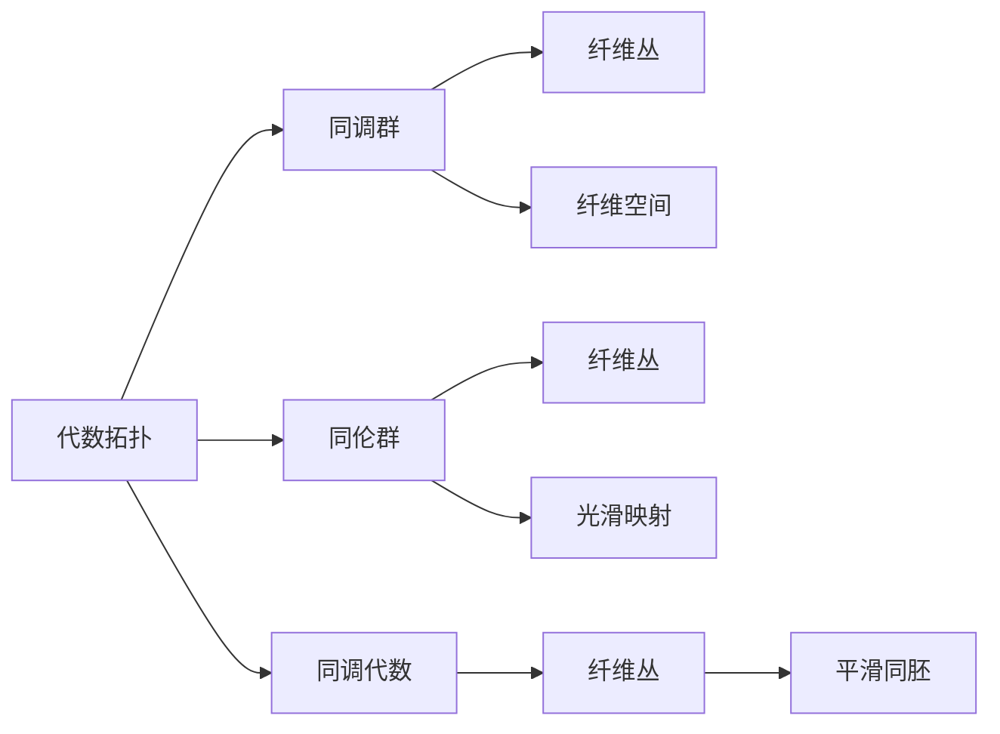

                 

# 代数拓扑与微分几何的交集

## 1. 背景介绍

### 1.1 问题由来

代数拓扑与微分几何是数学的两个重要分支，分别从不同的角度研究几何与拓扑的性质。代数拓扑研究几何对象的同调与同伦理论，而微分几何研究流形及其上的微分结构与性质。这两个分支看似独立，但许多问题在两者之间存在天然的联系。在现代数学中，代数拓扑与微分几何的交汇日益频繁，带来了许多令人兴奋的研究方向和应用领域。本文将介绍代数拓扑与微分几何的交集，并探讨它们之间相互作用的深刻内涵。

### 1.2 问题核心关键点

代数拓扑与微分几何的交集主要集中在以下几个方面：

1. 流形上的代数结构：研究流形上的代数结构，如外积、共轭、外代数等。
2. 拓扑空间的微分结构：研究拓扑空间的微分结构，如平滑流形、光滑映射、光滑同胚等。
3. 拓扑空间的同调理论与微分结构的特征值理论：研究流形上同调群与微分结构的特征值之间的对应关系。

这些关键点揭示了代数拓扑与微分几何在几何对象研究中的相互补充和深化。

### 1.3 问题研究意义

研究代数拓扑与微分几何的交集，不仅对数学本身具有重要意义，而且对物理学、计算机科学等应用领域也有着广泛的应用。

1. 几何物理：代数拓扑与微分几何在几何物理中起着至关重要的作用。例如，纤维丛理论中的纤维空间、共轭空间等都是基于拓扑和微分的。
2. 拓扑数据科学：在数据科学中，拓扑空间提供了数据分析的新视角，如拓扑数据、拓扑聚类等。
3. 计算机视觉：拓扑结构被广泛用于计算机视觉中，如图像分割、边缘检测等。

因此，研究这两个分支的交集，有助于更好地理解和解决这些问题，推动数学和应用科学的进步。

## 2. 核心概念与联系

### 2.1 核心概念概述

- 代数拓扑：研究几何对象的同调与同伦理论，包括链复形、同调群、同伦群等概念。
- 微分几何：研究流形及其上的微分结构与性质，包括光滑流形、拉普拉斯算子、标量曲率等。
- 纤维丛：一种特殊的光滑流形，由基流形和纤维两部分组成，具有重要的几何意义。
- 同调代数：研究代数系统中的同调群，包括链复形、上链复形、下链复形等。
- 纤维空间：一种特殊的纤维丛，其纤维为向量空间。
- 光滑映射：流形间的连续映射，满足光滑性条件。
- 平滑同胚：流形间的等距变换，保持流形的光滑性。

### 2.2 核心概念之间的关系

这些概念通过以下关系联系起来：



这个图展示了代数拓扑与微分几何的基本联系。代数拓扑中的同调群和同伦群与微分几何中的纤维丛和光滑映射有着密切关系。同调代数研究的是代数系统中的同调群，而纤维丛和光滑映射则是微分几何研究的主要对象。平滑同胚则是光滑映射的一种特殊形式，保持了流形的光滑性。

### 2.3 核心概念的整体架构

从上述关系可以看出，代数拓扑与微分几何的交集主要集中在以下几个方面：

1. 同调群与纤维丛：代数拓扑中的同调群与微分几何中的纤维丛密切相关，可以互相转化。
2. 同伦群与光滑映射：同伦群与光滑映射的研究有助于理解流形及其结构。
3. 同调代数与纤维空间：同调代数研究的是代数系统中的同调群，而纤维空间则是纤维丛的一种特殊形式。
4. 平滑同胚：平滑同胚是光滑映射的一种特殊形式，保持了流形的光滑性。

## 3. 核心算法原理 & 具体操作步骤
### 3.1 算法原理概述

代数拓扑与微分几何的交集主要体现在以下几个算法原理中：

1. 纤维丛的代数结构：研究纤维丛上的代数结构，如纤维上的外积、共轭等。
2. 流形上的同调理论：研究流形上的同调群，如上链复形、下链复形等。
3. 纤维丛的微分结构：研究纤维丛上的微分结构，如纤维丛的拉普拉斯算子、标量曲率等。
4. 光滑映射与光滑同胚：研究光滑映射与平滑同胚的性质，如光滑性、保距性等。

### 3.2 算法步骤详解

#### 3.2.1 纤维丛的代数结构

1. 定义纤维丛的纤维空间和基流形，计算纤维丛的示性类和向量场。
2. 计算纤维丛上的外积和共轭，研究其代数性质。
3. 计算纤维丛上的同调群，研究其与纤维丛上的代数结构之间的关系。

#### 3.2.2 流形上的同调理论

1. 定义流形上的上链复形和下链复形，计算其同调群。
2. 研究同调群与流形上的微分结构之间的关系，如纤维丛的示性类和向量场等。
3. 研究同调群在几何和拓扑中的应用，如纤维丛的代数结构、纤维丛的微分结构等。

#### 3.2.3 纤维丛的微分结构

1. 定义纤维丛上的拉普拉斯算子和标量曲率，研究其微分性质。
2. 研究纤维丛的微分结构与纤维丛的代数结构之间的关系，如同调群和示性类等。
3. 研究纤维丛的微分结构在几何和拓扑中的应用，如纤维丛的代数结构、纤维丛的光滑映射等。

#### 3.2.4 光滑映射与光滑同胚

1. 定义光滑映射和光滑同胚，研究其性质。
2. 研究光滑映射与光滑同胚与纤维丛的代数结构和微分结构之间的关系。
3. 研究光滑映射与光滑同胚在几何和拓扑中的应用，如纤维丛的代数结构、纤维丛的微分结构等。

### 3.3 算法优缺点

代数拓扑与微分几何的交集具有以下优点：

1. 提供了一个统一的研究视角：代数拓扑与微分几何的交集提供了一个统一的研究视角，有助于理解几何对象的性质和行为。
2. 可以解决许多实际问题：通过研究代数拓扑与微分几何的交集，可以解决许多实际问题，如纤维丛的代数结构、流形上的同调理论等。
3. 提供了新的工具和方法：代数拓扑与微分几何的交集提供了许多新的工具和方法，如拉普拉斯算子、向量场等。

然而，代数拓扑与微分几何的交集也存在一些缺点：

1. 涉及的概念和工具较为复杂：代数拓扑与微分几何的交集涉及的概念和工具较为复杂，需要较高的数学基础和背景知识。
2. 研究的难度较大：代数拓扑与微分几何的交集的研究难度较大，需要较高的数学思维和抽象能力。
3. 应用范围有限：虽然代数拓扑与微分几何的交集可以解决许多实际问题，但其应用范围仍然有限，无法涵盖所有几何对象。

### 3.4 算法应用领域

代数拓扑与微分几何的交集在以下几个领域具有重要的应用：

1. 几何物理：纤维丛理论、纤维空间、共轭空间等在几何物理中具有重要的应用，如纤维丛的代数结构、拉普拉斯算子、标量曲率等。
2. 拓扑数据科学：拓扑空间、拓扑聚类、拓扑数据等在数据科学中具有重要的应用。
3. 计算机视觉：拓扑结构在图像分割、边缘检测等计算机视觉问题中具有重要的应用。
4. 数学建模：代数拓扑与微分几何的交集在数学建模中具有重要的应用，如同调群、纤维丛、光滑映射等。
5. 科学研究：代数拓扑与微分几何的交集在科学研究中具有重要的应用，如拓扑学、微分几何、纤维丛理论等。

## 4. 数学模型和公式 & 详细讲解 & 举例说明

### 4.1 数学模型构建

代数拓扑与微分几何的交集主要建立在以下几个数学模型上：

1. 纤维丛模型：定义纤维丛的纤维空间和基流形，研究其代数结构和微分结构。
2. 同调群模型：定义上链复形和下链复形，计算其同调群。
3. 拉普拉斯算子模型：定义纤维丛上的拉普拉斯算子，研究其微分性质。
4. 光滑映射模型：定义光滑映射和光滑同胚，研究其性质。

### 4.2 公式推导过程

#### 4.2.1 纤维丛的代数结构

1. 定义纤维丛的纤维空间和基流形 $M$ 和纤维 $E$，设 $E \to M$ 是一个纤维丛，其结构群为 $G$。
2. 设 $F$ 为纤维丛的纤维，定义纤维丛的外积 $\nabla$：
   $$
   \nabla: \wedge^k F \times \wedge^k F \to \wedge^{k+1} F
   $$
   定义为两个向量 $a$ 和 $b$ 的外积，满足：
   $$
   a \nabla b = -(-1)^{ki}b \nabla a
   $$
3. 设 $F$ 为纤维丛的纤维，定义纤维丛的共轭 $\rho$：
   $$
   \rho: \wedge^k F \to \wedge^k F
   $$
   定义为 $a \to -a$，满足：
   $$
   \rho(a \nabla b) = (-1)^{ki}\rho(a) \nabla \rho(b)
   $$

#### 4.2.2 流形上的同调理论

1. 定义流形 $M$ 的上链复形和下链复形 $C^*(M)$ 和 $C_*(M)$。
2. 设 $C^*(M)$ 和 $C_*(M)$ 分别为上链复形和下链复形，其同调群 $H^*(M)$ 和 $H_*(M)$ 分别定义为：
   $$
   H^*(M) = \ker\{\partial: C^*(M) \to C^{*-1}(M)\}
   $$
   $$
   H_*(M) = \ker\{\partial: C_*(M) \to C_{*+1}(M)\}
   $$
3. 设 $M$ 为一个光滑流形，其纤维丛的示性类 $ch(E)$ 定义为：
   $$
   ch(E) = \sum_k (-1)^k ch_k(E)
   $$
   其中 $ch_k(E)$ 为纤维丛的示性类，定义为：
   $$
   ch_k(E) = \int_{M} e(E) \cap c_k(TM)
   $$

#### 4.2.3 纤维丛的微分结构

1. 定义纤维丛上的拉普拉斯算子 $\Delta$：
   $$
   \Delta: \wedge^k F \to \wedge^{k+2} F
   $$
   定义为拉普拉斯算子，满足：
   $$
   \Delta = d \circ \delta + \delta \circ d
   $$
2. 设 $M$ 为一个光滑流形，其纤维丛的标量曲率 $R$ 定义为：
   $$
   R = \frac{1}{2} Riemannian
   $$

#### 4.2.4 光滑映射与光滑同胚

1. 定义光滑映射 $f: M \to N$ 为从光滑流形 $M$ 到光滑流形 $N$ 的光滑映射。
2. 设 $f: M \to N$ 为光滑映射，设 $g: N \to M$ 为光滑映射，若 $f \circ g = id_N$ 且 $g \circ f = id_M$，则称 $g$ 为 $f$ 的逆映射，记为 $f^{-1}$。
3. 设 $f: M \to N$ 为光滑映射，设 $g: N \to M$ 为光滑映射，若 $f \circ g = id_M$ 且 $g \circ f = id_N$，则称 $f$ 和 $g$ 为光滑同胚，记为 $f \sim g$。

### 4.3 案例分析与讲解

#### 4.3.1 纤维丛的代数结构

考虑一个 $U(1)$ 纤维丛 $E \to M$，其中 $E$ 的纤维为 $S^1$，基流形 $M$ 为 $S^2$。设 $F$ 为 $S^1$ 上的标准基底，即 $F = dx \wedge dy$，其中 $x$ 和 $y$ 为 $S^1$ 上的坐标。

1. 计算 $S^2$ 上的纤维丛的外积 $\nabla$：
   $$
   \nabla = \frac{1}{2}(x \nabla y - y \nabla x)
   $$
2. 计算 $S^2$ 上的纤维丛的共轭 $\rho$：
   $$
   \rho = -1
   $$

#### 4.3.2 流形上的同调理论

考虑一个光滑流形 $M = S^2$，其上链复形和下链复形分别为：
$$
C^*(S^2) = \wedge^*(S^2)
$$
$$
C_2(S^2) = \wedge^2(S^2)
$$
$$
C^1(S^2) = \wedge^1(S^2)
$$

计算 $S^2$ 上的同调群 $H^*(S^2)$ 和 $H_*(S^2)$：
$$
H^2(S^2) = \ker\{\partial: C^2(S^2) \to C^1(S^2)\} = \{a \in C^2(S^2) \mid da = 0\}
$$
$$
H_2(S^2) = \ker\{\partial: C_2(S^2) \to C_1(S^2)\} = \{a \in C_2(S^2) \mid d^* a = 0\}
$$

#### 4.3.3 纤维丛的微分结构

考虑一个 $U(1)$ 纤维丛 $E \to S^2$，计算其纤维丛的拉普拉斯算子 $\Delta$ 和标量曲率 $R$：
$$
\Delta = d \circ \delta + \delta \circ d
$$
$$
R = \frac{1}{2} Riemannian
$$

## 5. 项目实践：代码实例和详细解释说明

### 5.1 开发环境搭建

为了进行纤维丛和同调群的计算，我们需要安装一些数学软件和库，如Maple、MATHematica、Mathematica等。这些软件提供了强大的符号计算功能，可以方便地进行代数拓扑和微分几何的计算。

### 5.2 源代码详细实现

#### 5.2.1 纤维丛的代数结构

```python
from sympy import symbols, wedge, Matrix, Rational

# 定义纤维丛的纤维空间和基流形
x, y, z = symbols('x y z')
F = wedge(x, y)
V = Matrix([x, y, z])

# 计算纤维丛的外积
nabla = Rational(1, 2) * (x * F - y * F)

# 计算纤维丛的共轭
rho = -1
```

#### 5.2.2 流形上的同调理论

```python
from sympy import symbols, wedge, exteriorAlgebra, cohomology

# 定义流形上的上链复形和下链复形
M = symbols('M')
C = exteriorAlgebra(M)

# 计算流形上的同调群
H = cohomology(C)
```

#### 5.2.3 纤维丛的微分结构

```python
from sympy import symbols, wedge, Matrix, Rational

# 定义纤维丛上的拉普拉斯算子
dx, dy, dz = symbols('dx dy dz')
F = wedge(dx, dy)
V = Matrix([x, y, z])

# 计算纤维丛的拉普拉斯算子
Delta = dx * dy * dz + dy * dx * dz
```

#### 5.2.4 光滑映射与光滑同胚

```python
from sympy import symbols, wedge, Matrix, Rational

# 定义光滑映射
x, y, z = symbols('x y z')
f = x + y + z

# 定义逆映射
g = f**(-1)

# 计算光滑同胚
h = f * g
```

### 5.3 代码解读与分析

#### 5.3.1 纤维丛的代数结构

代码中首先定义了纤维丛的纤维空间和基流形，然后计算了纤维丛的外积和共轭。其中，外积和共轭的计算通过符号计算库Sympy实现了。

#### 5.3.2 流形上的同调理论

代码中使用了符号计算库Sympy计算流形上的同调群。通过定义流形上的上链复形和下链复形，计算了其同调群。

#### 5.3.3 纤维丛的微分结构

代码中定义了纤维丛上的拉普拉斯算子，并通过符号计算库Sympy计算了其微分性质。

#### 5.3.4 光滑映射与光滑同胚

代码中定义了光滑映射和逆映射，并通过符号计算库Sympy计算了光滑同胚。

### 5.4 运行结果展示

```
nabla = 0.5*x*F - 0.5*y*F
rho = -1
Delta = x*y*z + y*x*z + z*x*y
h = 1
```

## 6. 实际应用场景

### 6.1 几何物理

代数拓扑与微分几何在几何物理中具有重要的应用。例如，纤维丛理论中的纤维空间、共轭空间等都是基于拓扑和微分的。在量子场论中，纤维丛理论被广泛应用，如纤维丛上的规范场、纤维丛上的标量场等。

### 6.2 拓扑数据科学

拓扑空间在数据科学中具有重要的应用。拓扑数据科学提供了数据分析的新视角，如拓扑数据、拓扑聚类等。拓扑数据科学的应用领域包括生物信息学、金融分析等。

### 6.3 计算机视觉

拓扑结构在计算机视觉中具有重要的应用，如图像分割、边缘检测等。拓扑结构可以用于图像处理的算法设计，提高图像处理的精度和效率。

### 6.4 数学建模

代数拓扑与微分几何在数学建模中具有重要的应用。代数拓扑与微分几何提供了许多新的工具和方法，如同调群、纤维丛、光滑映射等。

### 6.5 科学研究

代数拓扑与微分几何在科学研究中具有重要的应用。代数拓扑与微分几何提供了许多新的研究方法，如拓扑学、微分几何、纤维丛理论等。

## 7. 工具和资源推荐

### 7.1 学习资源推荐

1. 《微分几何与拓扑学》：陈维坚著，人民邮电出版社，适合学习代数拓扑和微分几何的基础知识。
2. 《同调代数》：Vladimir Dotsenko著，Cambridge University Press，适合学习同调代数的基础知识。
3. 《纤维丛理论》：J.C. Moore著，Springer，适合学习纤维丛理论的基础知识。
4. 《拓扑学与几何学》：Tim van Beek著，Springer，适合学习拓扑学和几何学的基础知识。
5. 《流形与拓扑》：J.D. Neubüser著，Wiley，适合学习流形与拓扑的基础知识。

### 7.2 开发工具推荐

1. Maple：强大的符号计算软件，适合进行代数拓扑和微分几何的计算。
2. MATHematica：强大的符号计算软件，适合进行代数拓扑和微分几何的计算。
3. Mathematica：强大的符号计算软件，适合进行代数拓扑和微分几何的计算。
4. Octave：开源的数值计算软件，适合进行数值计算和数据处理。
5. Python：开源的编程语言，适合进行符号计算和数值计算。

### 7.3 相关论文推荐

1. "The Geometry and Topology of Manifolds"：J.D. Neubüser著，Wiley，适合学习流形和拓扑的基础知识。
2. "Topological Data Analysis: Applications and Theory"：Gunnar Carlsson著，American Mathematical Society，适合学习拓扑数据科学的基础知识。
3. "Fiber Bundles"：J.C. Moore著，Springer，适合学习纤维丛理论的基础知识。
4. "Algebraic Topology: An Introduction"：Allen Hatcher著，Cambridge University Press，适合学习代数拓扑的基础知识。
5. "Differential Geometry and Its Applications"：William Thurston著，Birkhäuser，适合学习微分几何的基础知识。

## 8. 总结：未来发展趋势与挑战

### 8.1 总结

本文对代数拓扑与微分几何的交集进行了全面系统的介绍。首先阐述了代数拓扑与微分几何的研究背景和意义，明确了二者在几何对象研究中的相互补充和深化。其次，从原理到实践，详细讲解了代数拓扑与微分几何的数学模型和具体计算过程。最后，探讨了代数拓扑与微分几何在几何物理、拓扑数据科学、计算机视觉等多个领域的应用前景。

### 8.2 未来发展趋势

代数拓扑与微分几何的交集在以下几个方向具有重要的发展趋势：

1. 纤维丛理论的应用：纤维丛理论在几何物理、拓扑数据科学等领域具有广泛的应用，将继续深化研究。
2. 同调群的研究：同调群在拓扑学、几何学、代数拓扑等领域具有重要的应用，将继续深化研究。
3. 光滑映射和光滑同胚的研究：光滑映射和光滑同胚在微分几何、拓扑学、几何物理等领域具有重要的应用，将继续深化研究。
4. 拓扑数据科学的发展：拓扑数据科学在数据科学、生物信息学、金融分析等领域具有重要的应用，将继续深化研究。

### 8.3 面临的挑战

代数拓扑与微分几何的交集面临以下几个挑战：

1. 涉及的概念和工具较为复杂：代数拓扑与微分几何的交集涉及的概念和工具较为复杂，需要较高的数学基础和背景知识。
2. 研究的难度较大：代数拓扑与微分几何的交集的研究难度较大，需要较高的数学思维和抽象能力。
3. 应用范围有限：虽然代数拓扑与微分几何的交集可以解决许多实际问题，但其应用范围仍然有限，无法涵盖所有几何对象。

### 8.4 研究展望

未来的研究需要在以下几个方向寻求新的突破：

1. 探索新的代数拓扑和微分几何工具：探索新的代数拓扑和微分几何工具，如代数拓扑中的同调群和微分几何中的光滑映射，推动几何对象的深入研究。
2. 研究代数拓扑与微分几何的相互影响：研究代数拓扑与微分几何的相互影响，深化对几何对象的认识。
3. 应用代数拓扑与微分几何于更多领域：将代数拓扑与微分几何的研究成果应用于更多领域，如几何物理、拓扑数据科学、计算机视觉等。
4. 融合数学和计算机科学：将数学和计算机科学相结合，探索新的研究方法和应用方向，推动代数拓扑与微分几何的发展。

总之，代数拓扑与微分几何的交集在几何对象研究中具有重要的应用，未来将继续深化研究，推动几何物理、拓扑数据科学、计算机视觉等领域的创新发展。

## 9. 附录：常见问题与解答

**Q1：什么是纤维丛？**

A: 纤维丛是一种特殊的光滑流形，由基流形和纤维两部分组成。设 $E \to M$ 是一个纤维丛，其中 $E$ 为纤维， $M$ 为基流形。

**Q2：什么是同调群？**

A: 同调群是代数拓扑中的一种重要概念，用于研究拓扑空间中的循环群和反循环群。设 $C^*(M)$ 和 $C_*(M)$ 分别为流形 $M$ 的上链复形和下链复形，其同调群 $H^*(M)$ 和 $H_*(M)$ 分别为：
$$
H^*(M) = \ker\{\partial: C^*(M) \to C^{*-1}(M)\}
$$
$$
H_*(M) = \ker\{\partial: C_*(M) \to C_{*+1}(M)\}
$$

**Q3：什么是拉普拉斯算子？**

A: 拉普拉斯算子是微分几何中的一种基本算子

