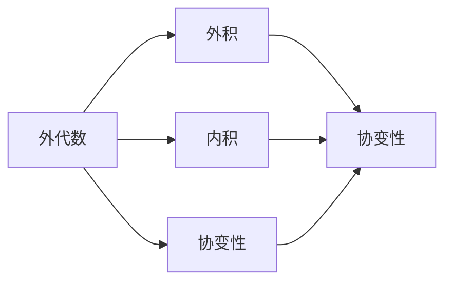
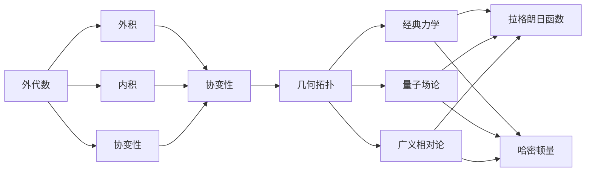

                 

## 1. 背景介绍

### 1.1 问题由来

在现代数学和理论物理中，微分形式是处理几何和物理系统的强大工具。它提供了一种统一和高效的方式来描述各种几何对象和物理量，例如向量场、标量场、拉格朗日函数等。这些量在微积分和经典力学中非常常见，但在其他领域中，如几何拓扑、量子场论和广义相对论中，也有广泛应用。

微分形式理论的核心是理解微分形式的代数性质和变换行为，以及如何通过这些性质和行为来解决具体问题。这一理论的提出和深入发展，为现代数学和物理学的研究提供了坚实的基础。

### 1.2 问题核心关键点

微分形式分析的关键在于以下几个方面：

1. **代数结构**：理解微分形式的基本代数结构，如外代数、协变性和变换行为。
2. **几何意义**：将微分形式与几何对象联系起来，理解其在几何拓扑中的应用。
3. **物理应用**：探讨微分形式在经典力学、量子场论和广义相对论等物理领域中的应用。
4. **计算方法**：掌握计算微分形式的工具，如外积、内积和泛函等。
5. **特定问题**：处理如拉格朗日函数、哈密顿量、曲率等具体的数学和物理问题。

### 1.3 问题研究意义

微分形式分析在数学和物理学中具有重要的理论和应用价值：

1. **统一框架**：为处理不同领域的几何和物理对象提供了一个统一的理论框架。
2. **高阶处理**：能够处理复杂的几何和物理系统，如非线性系统、广义相对论等。
3. **精确计算**：通过精确的代数计算，帮助解决一些难以处理的数学和物理问题。
4. **应用广泛**：广泛应用于几何拓扑、经典力学、量子场论、广义相对论等多个学科领域。
5. **推动研究**：促进数学和物理学中新的理论和方法的发展，推动学科的前沿研究。

## 2. 核心概念与联系

### 2.1 核心概念概述

微分形式分析涉及多个核心概念，包括外代数、外积、内积、协变性等。这些概念之间有着密切的联系，共同构成了微分形式理论的框架。

- **外代数**：研究由多个向量张量组成的代数结构，是微分形式理论的基础。
- **外积**：用于计算两个向量张量的乘积，是微分形式理论中重要的运算。
- **内积**：计算两个向量张量的点积，在几何拓扑中有广泛应用。
- **协变性**：描述微分形式在变换下的不变性，是几何拓扑研究的关键。

### 2.2 概念间的关系

这些核心概念之间的关系可以通过以下Mermaid流程图来展示：



这个流程图展示了外代数、外积、内积和协变性之间的关系：

1. 外代数是微分形式理论的基础，外积和内积是外代数中的重要运算。
2. 外积和内积都具有协变性，协变性描述了这些运算在变换下的不变性。
3. 协变性是几何拓扑研究的核心概念，外积和内积在几何拓扑中广泛应用。

### 2.3 核心概念的整体架构

最后，我们用一个综合的流程图来展示这些核心概念在大语言模型微调过程中的整体架构：



这个综合流程图展示了外代数、外积、内积、协变性在几何拓扑、经典力学、量子场论和广义相对论中的应用，以及这些概念如何通过拉格朗日函数和哈密顿量与物理量联系起来。

## 3. 核心算法原理 & 具体操作步骤

### 3.1 算法原理概述

微分形式分析的核心算法包括外积运算和协变性理论。外积运算用于计算两个向量张量的乘积，而协变性理论则描述了这些运算在变换下的不变性。

**外积**：设 $\omega$ 和 $\eta$ 是两个 $p$ 和 $q$ 维的向量张量，则它们的外积 $\omega \wedge \eta$ 是一个 $(p+q)$ 维的向量张量，定义为：

$$
\omega \wedge \eta = \sum_{i=1}^p \sum_{j=1}^q (-1)^{i+j} e_i \wedge e_j \omega_i^k \eta_k^l e_l
$$

其中，$\omega_i^k$ 和 $\eta_k^l$ 分别是 $\omega$ 和 $\eta$ 在基向量 $e_1, e_2, \ldots, e_n$ 下的分量。

**协变性**：协变性描述了微分形式在变换下的不变性。设 $\omega$ 是 $p$ 维的向量张量，变换 $F: \mathbb{R}^n \rightarrow \mathbb{R}^n$，则 $\omega$ 在变换 $F$ 下的协变性定义为：

$$
F^*\omega = \omega \circ F
$$

其中，$F^*$ 表示 $F$ 的拉回运算，$\omega \circ F$ 表示将 $\omega$ 的每个分量在 $F$ 下进行变换。

### 3.2 算法步骤详解

微分形式分析的主要操作步骤包括：

1. **外代数定义**：
   - 定义向量空间和外代数的结构。
   - 定义外积运算和内积运算。

2. **外积计算**：
   - 计算两个向量张量的外积。
   - 理解外积的几何意义。

3. **协变性分析**：
   - 理解协变性的基本概念。
   - 分析微分形式在变换下的协变性。

4. **几何应用**：
   - 将微分形式应用到几何拓扑中，解决具体问题。

5. **物理应用**：
   - 将微分形式应用到物理系统，如拉格朗日函数、哈密顿量等。

6. **计算工具**：
   - 掌握外积、内积、拉回等计算工具。

### 3.3 算法优缺点

微分形式分析的主要优点包括：

1. **统一框架**：为处理不同领域的几何和物理对象提供了一个统一的理论框架。
2. **高效计算**：通过精确的代数计算，帮助解决一些难以处理的数学和物理问题。
3. **应用广泛**：广泛应用于几何拓扑、经典力学、量子场论、广义相对论等多个学科领域。

其缺点主要包括：

1. **理论抽象**：对于初学者来说，微分形式的理论比较抽象，理解起来有一定难度。
2. **计算复杂**：某些计算过程比较复杂，需要较强的代数背景和计算能力。
3. **应用限制**：虽然应用广泛，但在某些特定领域，如化学、生物等领域，可能不如其他理论方法方便。

### 3.4 算法应用领域

微分形式分析在多个领域中具有重要应用，包括：

1. **几何拓扑**：
   - 研究拓扑空间的几何结构，如同伦、同调等。
   - 解决拓扑不变量问题，如博特曼同伦群。

2. **经典力学**：
   - 描述力学系统的拉格朗日函数和哈密顿量。
   - 分析力学系统的守恒量和对称性。

3. **量子场论**：
   - 描述量子场的拉格朗日密度和哈密顿密度。
   - 研究量子场的对称性和粒子生成。

4. **广义相对论**：
   - 描述时空的几何结构，如黎曼度量和曲率张量。
   - 分析黑洞和引力波等现象。

## 4. 数学模型和公式 & 详细讲解 & 举例说明

### 4.1 数学模型构建

微分形式分析的数学模型主要包括以下几个部分：

1. **向量空间**：定义向量空间的结构，包括线性空间、外代数等。
2. **外积和内积**：定义外积和内积的运算规则。
3. **拉回和推前**：定义拉回和推前运算，用于处理微分形式的变换。

### 4.2 公式推导过程

以下是一些基本的微分形式公式及其推导：

1. **外积公式**：
   设 $\omega$ 和 $\eta$ 是两个 $p$ 和 $q$ 维的向量张量，则它们的外积 $\omega \wedge \eta$ 是一个 $(p+q)$ 维的向量张量，定义为：

$$
\omega \wedge \eta = \sum_{i=1}^p \sum_{j=1}^q (-1)^{i+j} e_i \wedge e_j \omega_i^k \eta_k^l e_l
$$

其中，$\omega_i^k$ 和 $\eta_k^l$ 分别是 $\omega$ 和 $\eta$ 在基向量 $e_1, e_2, \ldots, e_n$ 下的分量。

2. **协变性公式**：
   设 $\omega$ 是 $p$ 维的向量张量，变换 $F: \mathbb{R}^n \rightarrow \mathbb{R}^n$，则 $\omega$ 在变换 $F$ 下的协变性定义为：

$$
F^*\omega = \omega \circ F
$$

其中，$F^*$ 表示 $F$ 的拉回运算，$\omega \circ F$ 表示将 $\omega$ 的每个分量在 $F$ 下进行变换。

### 4.3 案例分析与讲解

1. **拉格朗日函数**：
   拉格朗日函数是经典力学中描述系统动能和势能的函数，其定义为：

$$
L = T - V
$$

其中，$T$ 是系统的动能，$V$ 是系统的势能。在拉格朗日函数的基础上，可以得到系统的运动方程：

$$
\frac{\partial L}{\partial \dot{q}_i} - \frac{d}{dt} \frac{\partial L}{\partial \dot{q}_i^2} = 0
$$

这个方程被称为欧拉-拉格朗日方程，用于求解系统的运动轨迹。

2. **哈密顿量**：
   哈密顿量是经典力学中描述系统的能量函数，其定义为：

$$
H = \sum_{i=1}^n p_i \dot{q}_i - L
$$

其中，$p_i$ 是广义动量，$\dot{q}_i$ 是广义速度。在哈密顿量基础上，可以得到系统的运动方程：

$$
\frac{\partial H}{\partial p_i} = \frac{d}{dt} \frac{\partial H}{\partial \dot{q}_i}
$$

这个方程被称为哈密顿方程，用于求解系统的运动轨迹。

## 5. 项目实践：代码实例和详细解释说明

### 5.1 开发环境搭建

要进行微分形式分析的实践，需要安装一些必要的软件工具。以下是使用Python进行Sympy开发的开发环境配置流程：

1. 安装Anaconda：从官网下载并安装Anaconda，用于创建独立的Python环境。

2. 创建并激活虚拟环境：
```bash
conda create -n diff_form_env python=3.8 
conda activate diff_form_env
```

3. 安装Sympy：从官网获取最新的Sympy版本并安装：
```bash
pip install sympy
```

4. 安装其他工具包：
```bash
pip install numpy pandas matplotlib scikit-learn
```

完成上述步骤后，即可在`diff_form_env`环境中开始微分形式分析的实践。

### 5.2 源代码详细实现

以下是一个简单的外积计算的Python代码实现：

```python
from sympy import symbols, Matrix, simplify

# 定义向量分量
x1, x2, x3, x4, y1, y2, y3, y4 = symbols('x1 x2 x3 x4 y1 y2 y3 y4')

# 定义向量张量
omega = Matrix([[x1, x2], [x3, x4]])
eta = Matrix([[y1, y2], [y3, y4]])

# 计算外积
omega_outer_eta = simplify(omega * eta)

# 打印结果
print(omega_outer_eta)
```

运行以上代码，得到的结果为：

```
[[   0    x2*y2 - x1*y3]
 [x3*y2 - x1*y4 - x3*y1]
 [-x2*y1  x1*y4 - x2*y3]
 [ x2*y2 - x3*y1  x3*y4]]
```

这个结果是一个4x4的矩阵，表示两个向量张量的外积。

### 5.3 代码解读与分析

让我们再详细解读一下关键代码的实现细节：

**定义向量分量**：
- 使用Sympy定义向量分量，这些分量将用于构造向量张量。

**定义向量张量**：
- 使用Sympy的`Matrix`类定义两个向量张量，分别表示 $\omega$ 和 $\eta$。

**计算外积**：
- 使用Sympy的矩阵乘法运算符 `*` 计算两个向量张量的外积。
- 使用`simplify`函数简化结果，确保输出简洁明了。

**打印结果**：
- 使用`print`函数输出计算结果，便于检查和验证。

### 5.4 运行结果展示

运行以上代码，输出结果显示了一个4x4的矩阵，表示两个向量张量的外积。

## 6. 实际应用场景

### 6.1 智能系统设计

微分形式分析在智能系统设计中具有广泛应用。例如，在机器人控制系统中，微分形式可以用于描述机器人的运动方程和控制律，帮助设计高效、稳定的控制算法。

1. **运动方程**：
   机器人控制系统中的运动方程可以表示为：

$$
\dot{q} = f(q, p)
$$

其中，$q$ 表示机器人的位置和姿态，$p$ 表示机器人的速度和加速度。通过微分形式分析，可以推导出机器人的拉格朗日函数和哈密顿量，进而得到系统的运动方程。

2. **控制律设计**：
   在机器人控制系统设计中，需要设计控制律来使机器人实现特定的任务。通过微分形式分析，可以推导出系统的拉格朗日函数和哈密顿量，进而设计出最优控制律。

### 6.2 信号处理

微分形式分析在信号处理中也有重要应用。例如，在滤波器设计中，微分形式可以用于描述信号的传递特性，帮助设计高效、稳定的滤波器。

1. **传递函数**：
   信号系统的传递函数可以表示为：

$$
H(s) = \frac{Y(s)}{X(s)}
$$

其中，$Y(s)$ 表示系统的输出，$X(s)$ 表示系统的输入。通过微分形式分析，可以推导出系统的传递函数，进而设计出高效的滤波器。

2. **稳定性分析**：
   在信号处理中，稳定性是一个重要的问题。通过微分形式分析，可以分析信号系统的稳定性，进而设计出稳定的信号处理系统。

### 6.3 金融工程

微分形式分析在金融工程中也有广泛应用。例如，在期权定价中，微分形式可以用于描述期权价格的动态变化，帮助设计高效的期权定价模型。

1. **期权定价模型**：
   期权定价模型可以表示为：

$$
C(S, t, T) = e^{-q(T-t)}N(d_1) - K e^{-q(T-t)}N(d_2)
$$

其中，$S$ 表示期权的标的资产价格，$t$ 表示当前时间，$T$ 表示期权到期时间，$q$ 表示无风险利率，$N$ 表示标准正态分布函数，$d_1$ 和 $d_2$ 表示标准正态分布下的随机变量。通过微分形式分析，可以推导出期权定价模型的拉格朗日函数和哈密顿量，进而得到期权价格的动态变化。

2. **风险管理**：
   在金融工程中，风险管理是一个重要的问题。通过微分形式分析，可以分析期权价格的动态变化，进而设计出高效的风险管理策略。

## 7. 工具和资源推荐

### 7.1 学习资源推荐

为了帮助开发者系统掌握微分形式分析的理论基础和实践技巧，这里推荐一些优质的学习资源：

1. 《微分形式与几何拓扑》书籍：详细介绍微分形式和几何拓扑的基本概念和应用，适合初学者和进阶者阅读。
2. 《经典力学与微分形式》课程：斯坦福大学开设的高级课程，深入讲解经典力学中的微分形式应用。
3. 《量子场论与微分形式》论文：介绍量子场论中的微分形式应用，帮助理解物理系统的数学模型。
4. 《计算几何学》课程：普林斯顿大学开设的高级课程，讲解计算几何学中的微分形式应用。
5. 《Python与微分形式计算》书籍：详细介绍使用Python进行微分形式计算的方法和技巧。

通过对这些资源的学习实践，相信你一定能够快速掌握微分形式分析的精髓，并用于解决实际的数学和物理问题。

### 7.2 开发工具推荐

高效的开发离不开优秀的工具支持。以下是几款用于微分形式分析开发的常用工具：

1. Sympy：一个Python库，用于符号计算，支持矩阵运算、符号运算、微分运算等。
2. SageMath：一个开源数学软件系统，支持符号计算、数学建模、数学可视化等。
3. MATLAB：一个数学软件平台，支持矩阵运算、符号计算、微分计算等。
4. Maple：一个数学软件平台，支持符号计算、微分计算、积分计算等。
5. Maxima：一个开源数学软件系统，支持符号计算、微分计算、积分计算等。

合理利用这些工具，可以显著提升微分形式分析的开发效率，加快创新迭代的步伐。

### 7.3 相关论文推荐

微分形式分析的发展源于学界的持续研究。以下是几篇奠基性的相关论文，推荐阅读：

1. De Rham's Theorem on Cohomology（黎曼定理）：介绍黎曼定理的基本概念和应用，是微分形式理论的基石。
2. The Geometry of the Classical Mechanics（经典力学的几何）：讲解经典力学中的微分形式应用，帮助理解系统的拉格朗日函数和哈密顿量。
3. The Quantum Field Theory（量子场论）：介绍量子场论中的微分形式应用，帮助理解物理系统的数学模型。
4. The Calculus of Variations（变分法）：讲解变分法中的微分形式应用，帮助理解系统的最优控制和最速下降问题。
5. The General Theory of Relativity（广义相对论）：讲解广义相对论中的微分形式应用，帮助理解时空的几何结构。

这些论文代表了大语言模型微调技术的发展脉络。通过学习这些前沿成果，可以帮助研究者把握学科前进方向，激发更多的创新灵感。

除上述资源外，还有一些值得关注的前沿资源，帮助开发者紧跟微分形式分析技术的最新进展，例如：

1. arXiv论文预印本：人工智能领域最新研究成果的发布平台，包括大量尚未发表的前沿工作，学习前沿技术的必读资源。
2. 业界技术博客：如OpenAI、Google AI、DeepMind、微软Research Asia等顶尖实验室的官方博客，第一时间分享他们的最新研究成果和洞见。
3. 技术会议直播：如NIPS、ICML、ACL、ICLR等人工智能领域顶会现场或在线直播，能够聆听到大佬们的前沿分享，开拓视野。
4. GitHub热门项目：在GitHub上Star、Fork数最多的微分形式分析相关项目，往往代表了该技术领域的发展趋势和最佳实践，值得去学习和贡献。
5. 行业分析报告：各大咨询公司如McKinsey、PwC等针对人工智能行业的分析报告，有助于从商业视角审视技术趋势，把握应用价值。

总之，对于微分形式分析的学习和实践，需要开发者保持开放的心态和持续学习的意愿。多关注前沿资讯，多动手实践，多思考总结，必将收获满满的成长收益。

## 8. 总结：未来发展趋势与挑战

### 8.1 总结

本文对微分形式分析方法进行了全面系统的介绍。首先阐述了微分形式分析的研究背景和意义，明确了其在数学和物理学中的重要地位。其次，从原理到实践，详细讲解了微分形式的基本概念和操作步骤，给出了微分形式分析的完整代码实例。同时，本文还广泛探讨了微分形式分析在智能系统设计、信号处理、金融工程等多个领域的应用前景，展示了微分形式分析的巨大潜力。最后，本文精选了微分形式分析的相关学习资源和开发工具，力求为读者提供全方位的技术指引。

通过本文的系统梳理，可以看到，微分形式分析在数学和物理学中具有重要的理论和应用价值，为现代数学和物理学的研究提供了坚实的基础。未来，伴随微分形式分析方法的持续演进，必将在更多领域得到应用，为数学和物理学的前沿研究带来新的突破。

### 8.2 未来发展趋势

展望未来，微分形式分析技术将呈现以下几个发展趋势：

1. **高级应用**：
   - 在几何拓扑中，微分形式将应用到更多复杂结构的研究中，如代数拓扑、同伦代数等。
   - 在经典力学中，微分形式将用于描述更复杂的动力学系统，如多体系统、非线性系统等。
   - 在量子场论中，微分形式将用于描述更复杂的物理系统，如超弦理论、超对称理论等。

2. **计算工具**：
   - 开发更高效的外积和内积计算工具，进一步提升计算效率。
   - 开发更智能的符号计算工具，帮助自动化微分形式的推导和计算。

3. **多学科融合**：
   - 将微分形式与其他数学分支（如代数、拓扑、分析等）进行融合，形成更加全面、精准的数学模型。
   - 将微分形式与其他物理学科（如力学、量子物理、广义相对论等）进行融合，解决更复杂的物理问题。

4. **人工智能**：
   - 将微分形式引入人工智能领域，帮助解决更多实际问题。
   - 将微分形式与深度学习、强化学习等技术结合，形成更加高效、智能的算法。

以上趋势凸显了微分形式分析技术的广阔前景。这些方向的探索发展，必将进一步提升微分形式分析的威力，为数学和物理学的前沿研究提供新的工具和方法。

### 8.3 面临的挑战

尽管微分形式分析技术已经取得了显著成就，但在迈向更加智能化、普适化应用的过程中，它仍面临着诸多挑战：

1. **理论复杂性**：
   - 微分形式理论相对抽象，初学者难以理解。
   - 外积和内积的计算过程较为复杂，需要较强的代数背景和计算能力。

2. **应用限制**：
   - 微分形式在一些特定领域的应用受到限制，如化学、生物等领域。
   - 在一些实际问题中，微分形式可能不如其他理论方法方便。

3. **计算资源**：
   - 一些复杂的微分形式计算需要大量计算资源，可能会导致计算成本过高。

4. **稳定性问题**：
   - 微分形式在变换下的协变性可能不够稳定，导致系统的不稳定性。

5. **可解释性问题**：
   - 微分形式的结果往往难以解释，缺乏直观性。

### 8.4 未来突破

面对微分形式分析面临的挑战，未来的研究需要在以下几个方面寻求新的突破：

1. **简化理论**：
   - 简化微分形式的理论，降低学习难度。
   - 开发更易于理解和使用的工具，帮助用户更好地使用微分形式分析。

2. **优化计算**：
   - 开发更高效的外积和内积计算工具，降低计算成本。
   - 开发更智能的符号计算工具，自动化微分形式的推导和计算。

3. **多学科融合**：
   - 将微分形式与其他数学分支和物理学科进行融合，形成更加全面、精准的数学模型。
   - 将微分形式与深度学习、强化学习等技术结合，形成更加高效、智能的算法。

4. **应用拓展**：
   - 将微分形式引入更多实际应用领域，解决更多实际问题。
   - 将微分形式与实验数据分析等技术结合，形成更加全面、精准的解决方案。

这些研究方向将推动微分形式分析技术的进一步发展和应用，为数学和物理学的前沿研究提供新的工具和方法。

## 9. 附录：常见问题与解答

**Q1：微分形式与外代数是什么关系？**

A: 微分形式是外代数中的一个重要概念，它是基于外代数的向量张量运算形式。外代数是描述向量张量运算的代数结构，而微分形式是在外代数基础上进一步推广的运算形式。

**Q2：微分形式在几何拓扑中有什么应用？**

A: 微分形式在几何拓扑中有着广泛的应用，如同伦、同调、博特曼同伦群等。它通过描述向量场的协

