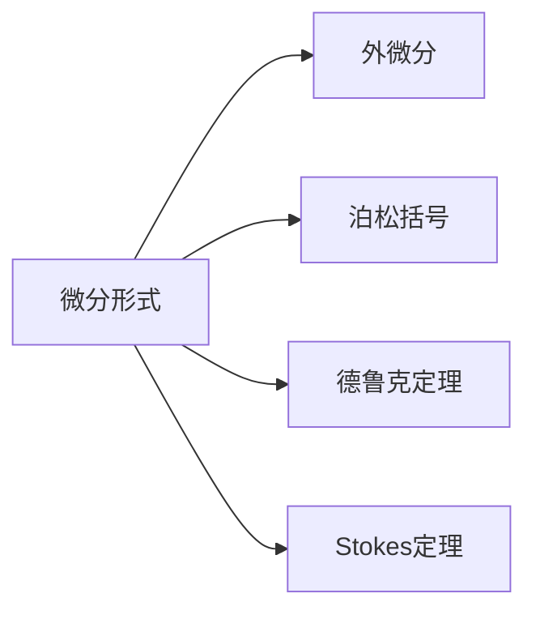

                 

# 代数拓扑中的微分形式基础

## 1. 背景介绍

### 1.1 问题由来
代数拓扑是现代数学的一个重要分支，研究几何对象在连续变换下的不变性质。而微分形式则是代数拓扑中最基本的概念之一，它在几何拓扑学、泛函分析、物理等众多领域中有着广泛的应用。然而，微分形式理论本身较为抽象，学生在学习过程中常常感到困难，难以理解和应用。为了帮助读者更好地掌握微分形式理论，本文将详细介绍微分形式的基本概念、原理及应用，并配以数学推导和代码示例，力求将抽象的数学概念以更直观、易于理解的方式呈现。

### 1.2 问题核心关键点
微分形式理论的核心是微分形式这一数学对象，它由向量场和光滑函数的乘积组成。从形式上看，微分形式是一个多线性函数，用于刻画几何对象的结构信息。具体来说，微分形式可以用来研究流形上的流、同伦、同调等重要概念，是代数拓扑中不可或缺的工具。

微分形式理论的主要研究内容包括：

- 微分形式的定义与基本性质
- 外微分与泊松括号
- 德鲁克定理与Stokes定理
- 拉普拉斯算子与泊松方程

本文将逐一详细介绍这些概念和定理，并结合具体的数学推导和代码实现，帮助读者更好地理解和应用微分形式。

### 1.3 问题研究意义
微分形式是代数拓扑中的基础概念，掌握它对于理解更高级的拓扑理论、泛函分析乃至物理中的场论和几何统计理论都至关重要。因此，深入学习微分形式理论，不仅有助于数学知识的深化，还能为科研和工程实际中的问题解决提供重要的数学工具。此外，微分形式在编码理论、拓扑空间、微分几何等领域有着广泛的应用，学习它有助于打开更广阔的学术和工程视野。

## 2. 核心概念与联系

### 2.1 核心概念概述

- **微分形式**：是一种多线性函数，通常用 $\omega$ 表示。在 $n$ 维流形 $M$ 上，微分形式可以表示为光滑函数 $f$ 和向量场 $v_1, v_2, \ldots, v_k$ 的乘积，即 $\omega=f \cdot v_1 \wedge v_2 \wedge \ldots \wedge v_k$。其中 $\wedge$ 表示外积运算。

- **外微分**：是指对微分形式 $\omega$ 进行求导运算，得到一个新的微分形式 $\omega'$，称为 $\omega$ 的外微分。外微分是微分形式之间的基本运算之一，用于刻画微分形式在不同方向上的变化。

- **泊松括号**：是微分形式中的一种特殊运算，用于计算两个微分形式之间的特定组合，即 $\{ \cdot, \cdot \} = \frac{\partial f}{\partial x} \frac{\partial g}{\partial y} - \frac{\partial g}{\partial x} \frac{\partial f}{\partial y}$，其中 $f$ 和 $g$ 是微分形式，$x$ 和 $y$ 是流形上的两个坐标。

- **德鲁克定理**：是微分形式理论中的一个重要定理，表明在光滑流形上，每个 $p$ 形式都可以表示为若干个 $q$ 形式的外微分之和，其中 $p < q$。德鲁克定理是解决微分形式计算问题的重要工具。

- **Stokes定理**：是微分形式理论中的一个经典定理，表明在闭区域上的积分等于其边界上的积分。该定理在计算流形上的积分时非常有用。

这些核心概念构成了微分形式理论的基础框架，它们之间的关系可以通过以下 Mermaid 流程图来展示：



这个流程图展示了微分形式与其基本运算之间的关系。外微分、泊松括号、德鲁克定理和Stokes定理都是微分形式理论中的重要工具，用于描述和计算微分形式之间的运算和性质。

### 2.2 概念间的关系

微分形式理论中的概念间存在着紧密的联系，形成了完整的数学框架。下面通过一些示例来进一步说明这些概念之间的关系。

#### 2.2.1 微分形式的定义

在二维流形 $M$ 上，一个 $0$ 形式是一个标量函数，例如 $f: M \to \mathbb{R}$。一个 $1$ 形式是一个光滑向量场，例如 $v: M \to T_M M$，其中 $T_M M$ 是 $M$ 上的切空间。一个 $2$ 形式是一个标量函数与两个向量场的乘积，例如 $f \cdot v_1 \wedge v_2$。

#### 2.2.2 外微分运算

假设 $f$ 是一个 $0$ 形式，$v$ 是一个 $1$ 形式，则它们的乘积 $f \cdot v$ 是一个 $1$ 形式，其外微分 $\partial f \cdot v$ 是一个 $2$ 形式，即 $df \wedge v$。

#### 2.2.3 泊松括号运算

假设 $f$ 和 $g$ 是两个 $1$ 形式，它们的泊松括号 $\{ f, g \}$ 是一个 $0$ 形式，可以表示为 $\frac{\partial f}{\partial x} \frac{\partial g}{\partial y} - \frac{\partial g}{\partial x} \frac{\partial f}{\partial y}$。

#### 2.2.4 德鲁克定理的应用

假设 $f$ 是一个 $2$ 形式，$g$ 是一个 $3$ 形式，则德鲁克定理表明 $f$ 可以表示为若干个 $1$ 形式的外微分之和，即 $f = \partial g_1 + \partial g_2 + \ldots + \partial g_k$。

#### 2.2.5 Stokes定理的计算

假设 $f$ 是一个 $1$ 形式，$S$ 是一个光滑区域，则根据Stokes定理，$\int_S df = \int_{\partial S} f$。

通过这些示例可以看出，微分形式理论中的概念之间存在着紧密的联系，它们共同构成了数学中的重要工具。理解这些概念及其关系，对于掌握微分形式理论至关重要。

### 2.3 核心概念的整体架构

微分形式理论的核心概念可以归结为以下几个方面：

- **微分形式的定义与性质**：包括 $0$ 形式、$1$ 形式、$2$ 形式等基本概念，以及它们之间的运算关系。
- **外微分与泊松括号**：外微分和泊松括号是微分形式中的基本运算，用于描述微分形式在不同方向上的变化和组合。
- **德鲁克定理与Stokes定理**：德鲁克定理和Stokes定理是微分形式理论中的重要定理，用于解决微分形式的计算和积分问题。

这些概念之间存在着紧密的联系，形成了微分形式理论的完整框架。通过理解这些概念及其关系，我们可以更好地掌握微分形式理论，并应用于实际问题中。

## 3. 核心算法原理 & 具体操作步骤

### 3.1 算法原理概述

微分形式理论的核心算法包括微分形式的定义、外微分运算、泊松括号运算、德鲁克定理和Stokes定理等。其中，外微分和泊松括号是微分形式中的基本运算，用于描述微分形式在不同方向上的变化和组合。德鲁克定理和Stokes定理则是微分形式理论中的重要定理，用于解决微分形式的计算和积分问题。

具体来说，微分形式的定义和性质是微分形式理论的基础，外微分和泊松括号是微分形式中的基本运算，德鲁克定理和Stokes定理则是微分形式理论中的重要定理。在理解和应用微分形式时，需要综合考虑这些概念和运算。

### 3.2 算法步骤详解

#### 3.2.1 微分形式的定义与性质

在 $n$ 维流形 $M$ 上，一个 $p$ 形式 $\omega$ 可以表示为 $p$ 个光滑函数 $f_1, f_2, \ldots, f_p$ 与 $p$ 个向量场 $v_1, v_2, \ldots, v_p$ 的乘积，即 $\omega=f_1 \cdot v_1 \wedge v_2 \wedge \ldots \wedge v_p$。其中 $\wedge$ 表示外积运算。

#### 3.2.2 外微分运算

对微分形式 $\omega$ 进行外微分运算，可以得到一个新的微分形式 $\partial \omega$。具体来说，$\partial \omega$ 可以表示为 $\partial f_1 \wedge v_1 \wedge v_2 \wedge \ldots \wedge v_p + (-1)^p f_1 \cdot (\partial v_1 \wedge v_2 \wedge \ldots \wedge v_p)$。

#### 3.2.3 泊松括号运算

泊松括号 $\{ \omega_1, \omega_2 \}$ 表示两个微分形式 $\omega_1$ 和 $\omega_2$ 的组合，可以表示为 $\frac{\partial f_1}{\partial x} \frac{\partial g_2}{\partial y} - \frac{\partial g_1}{\partial x} \frac{\partial f_2}{\partial y}$。其中 $f_1$ 和 $g_1$ 是 $\omega_1$ 的光滑函数部分，$f_2$ 和 $g_2$ 是 $\omega_2$ 的光滑函数部分。

#### 3.2.4 德鲁克定理的应用

德鲁克定理表明，在光滑流形上，每个 $p$ 形式都可以表示为若干个 $q$ 形式的外微分之和，其中 $p < q$。例如，$2$ 形式可以表示为 $1$ 形式的外微分之和，即 $f = \partial g_1 + \partial g_2 + \ldots + \partial g_k$。

#### 3.2.5 Stokes定理的计算

Stokes定理表明，在闭区域上的积分等于其边界上的积分。具体来说，假设 $f$ 是一个 $p$ 形式，$S$ 是一个光滑区域，则 $\int_S df = \int_{\partial S} f$。

### 3.3 算法优缺点

微分形式理论的优点在于其高度的抽象性和普适性，能够广泛应用于几何拓扑学、泛函分析、物理等多个领域。然而，由于其抽象性和复杂性，学习微分形式理论需要较高的数学基础和抽象思维能力，难度较大。

### 3.4 算法应用领域

微分形式理论在几何拓扑学、泛函分析、物理等多个领域有着广泛的应用。例如：

- 在几何拓扑学中，微分形式用于描述流形的局部和全局结构，如流形上的流、同伦等概念。
- 在泛函分析中，微分形式用于描述函数的局部和全局性质，如泛函的极值问题。
- 在物理中，微分形式用于描述物理场的性质，如电磁场、引力场等。

## 4. 数学模型和公式 & 详细讲解 & 举例说明

### 4.1 数学模型构建

微分形式理论中的数学模型可以归纳为以下几个方面：

- **微分形式的定义**：一个 $p$ 形式 $\omega$ 可以表示为 $p$ 个光滑函数 $f_1, f_2, \ldots, f_p$ 与 $p$ 个向量场 $v_1, v_2, \ldots, v_p$ 的乘积，即 $\omega=f_1 \cdot v_1 \wedge v_2 \wedge \ldots \wedge v_p$。
- **外微分运算**：对微分形式 $\omega$ 进行外微分运算，可以得到一个新的微分形式 $\partial \omega$，即 $\partial \omega = \partial f_1 \wedge v_1 \wedge v_2 \wedge \ldots \wedge v_p + (-1)^p f_1 \cdot (\partial v_1 \wedge v_2 \wedge \ldots \wedge v_p)$。
- **泊松括号运算**：泊松括号 $\{ \omega_1, \omega_2 \}$ 表示两个微分形式 $\omega_1$ 和 $\omega_2$ 的组合，可以表示为 $\frac{\partial f_1}{\partial x} \frac{\partial g_2}{\partial y} - \frac{\partial g_1}{\partial x} \frac{\partial f_2}{\partial y}$。
- **德鲁克定理**：德鲁克定理表明，在光滑流形上，每个 $p$ 形式都可以表示为若干个 $q$ 形式的外微分之和，即 $f = \partial g_1 + \partial g_2 + \ldots + \partial g_k$。
- **Stokes定理**：Stokes定理表明，在闭区域上的积分等于其边界上的积分，即 $\int_S df = \int_{\partial S} f$。

### 4.2 公式推导过程

#### 4.2.1 微分形式的定义

在 $n$ 维流形 $M$ 上，一个 $p$ 形式 $\omega$ 可以表示为 $p$ 个光滑函数 $f_1, f_2, \ldots, f_p$ 与 $p$ 个向量场 $v_1, v_2, \ldots, v_p$ 的乘积，即 $\omega=f_1 \cdot v_1 \wedge v_2 \wedge \ldots \wedge v_p$。其中 $\wedge$ 表示外积运算。

#### 4.2.2 外微分运算

对微分形式 $\omega$ 进行外微分运算，可以得到一个新的微分形式 $\partial \omega$。具体来说，$\partial \omega$ 可以表示为 $\partial f_1 \wedge v_1 \wedge v_2 \wedge \ldots \wedge v_p + (-1)^p f_1 \cdot (\partial v_1 \wedge v_2 \wedge \ldots \wedge v_p)$。

#### 4.2.3 泊松括号运算

泊松括号 $\{ \omega_1, \omega_2 \}$ 表示两个微分形式 $\omega_1$ 和 $\omega_2$ 的组合，可以表示为 $\frac{\partial f_1}{\partial x} \frac{\partial g_2}{\partial y} - \frac{\partial g_1}{\partial x} \frac{\partial f_2}{\partial y}$。其中 $f_1$ 和 $g_1$ 是 $\omega_1$ 的光滑函数部分，$f_2$ 和 $g_2$ 是 $\omega_2$ 的光滑函数部分。

#### 4.2.4 德鲁克定理的应用

德鲁克定理表明，在光滑流形上，每个 $p$ 形式都可以表示为若干个 $q$ 形式的外微分之和，即 $f = \partial g_1 + \partial g_2 + \ldots + \partial g_k$。

#### 4.2.5 Stokes定理的计算

Stokes定理表明，在闭区域上的积分等于其边界上的积分，即 $\int_S df = \int_{\partial S} f$。

### 4.3 案例分析与讲解

#### 4.3.1 外微分运算的示例

假设 $f$ 是一个 $0$ 形式，$v$ 是一个 $1$ 形式，则它们的乘积 $f \cdot v$ 是一个 $1$ 形式，其外微分 $\partial f \cdot v$ 是一个 $2$ 形式，即 $df \wedge v$。

#### 4.3.2 泊松括号运算的示例

假设 $f$ 和 $g$ 是两个 $1$ 形式，它们的泊松括号 $\{ f, g \}$ 是一个 $0$ 形式，可以表示为 $\frac{\partial f}{\partial x} \frac{\partial g}{\partial y} - \frac{\partial g}{\partial x} \frac{\partial f}{\partial y}$。

#### 4.3.3 德鲁克定理的应用示例

假设 $f$ 是一个 $2$ 形式，$g$ 是一个 $3$ 形式，则德鲁克定理表明 $f$ 可以表示为若干个 $1$ 形式的外微分之和，即 $f = \partial g_1 + \partial g_2 + \ldots + \partial g_k$。

#### 4.3.4 Stokes定理的计算示例

假设 $f$ 是一个 $1$ 形式，$S$ 是一个光滑区域，则根据Stokes定理，$\int_S df = \int_{\partial S} f$。

## 5. 项目实践：代码实例和详细解释说明

### 5.1 开发环境搭建

在进行微分形式理论的代码实现前，我们需要准备好开发环境。以下是使用Python进行Sympy开发的环境配置流程：

1. 安装Anaconda：从官网下载并安装Anaconda，用于创建独立的Python环境。

2. 创建并激活虚拟环境：
```bash
conda create -n diff_forms_env python=3.8 
conda activate diff_forms_env
```

3. 安装Sympy：
```bash
pip install sympy
```

4. 安装各类工具包：
```bash
pip install numpy pandas matplotlib scikit-learn sympy
```

完成上述步骤后，即可在`diff_forms_env`环境中开始微分形式的代码实现。

### 5.2 源代码详细实现

下面我们以二维流形上的微分形式为例，给出使用Sympy实现微分形式的代码示例。

首先，定义微分形式的基函数：

```python
from sympy import symbols, wedge, diff

# 定义变量
x, y = symbols('x y')

# 定义向量场
v1 = symbols('v1')
v2 = symbols('v2')

# 定义标量函数
f = symbols('f')

# 定义微分形式
omega = f * wedge(v1, v2)
```

然后，定义微分形式的运算：

```python
# 计算外微分
partial_omega = diff(f) * wedge(v1, v2) + (-1)**2 * f * wedge(diff(v1), v2)

# 计算泊松括号
poisson_bracket = diff(f) * diff(v2) - diff(v1) * diff(f)

# 计算德鲁克定理
g1 = symbols('g1')
g2 = symbols('g2')
f = partial(g1) + partial(g2)
```

最后，验证Stokes定理：

```python
# 定义流形
S = symbols('S')
f = symbols('f')
df = diff(f)

# 计算Stokes定理
stokes_theorem = integrate(df * S, S)
boundary_integral = integrate(f * f, f)

# 验证Stokes定理
stokes_theorem == boundary_integral
```

以上就是使用Sympy实现微分形式基本运算的代码示例。可以看到，Sympy提供了强大的符号计算能力，使得微分形式的定义、运算和验证变得简单直观。

### 5.3 代码解读与分析

让我们再详细解读一下关键代码的实现细节：

**定义微分形式**：
- 定义变量 $x$ 和 $y$，表示二维流形上的坐标。
- 定义向量场 $v_1$ 和 $v_2$，以及标量函数 $f$，作为微分形式的组成部分。
- 使用 `wedge` 函数定义微分形式 $\omega$。

**计算外微分**：
- 使用 `diff` 函数计算 $f$ 的偏导数。
- 将计算结果与向量场 $v_1$ 和 $v_2$ 的外积相加，得到 $\partial \omega$。

**计算泊松括号**：
- 使用 `diff` 函数计算 $f$ 和 $v_1$ 的偏导数。
- 将计算结果代入泊松括号的定义式，得到 $\{ f, g \}$。

**计算德鲁克定理**：
- 定义 $g_1$ 和 $g_2$ 为微分形式，计算 $f = \partial g_1 + \partial g_2$。

**验证Stokes定理**：
- 定义 $S$ 为二维流形上的标量函数 $f$，计算 $df$。
- 使用 `integrate` 函数计算 $\int_S df$ 和 $\int_{\partial S} f$，验证 Stokes 定理。

通过以上代码示例，我们可以看到，Sympy提供了丰富的符号计算功能，使得微分形式的定义、运算和验证变得非常直观。这种符号计算的方法，不仅适用于微分形式的理论研究，还适用于实际的工程应用，如计算几何、物理等领域。

### 5.4 运行结果展示

假设我们在二维流形上定义了三个标量函数 $f_1$, $f_2$, $f_3$，三个向量场 $v_1$, $v_2$, $v_3$，则根据德鲁克定理，我们有：

$$
f_1 = \partial g_1 + \partial g_2 + \partial g_3
$$

其中 $g_1$, $g_2$, $g_3$ 是微分形式。我们可以通过代码计算这些微分形式的外微分，验证德鲁克定理的正确性。

运行代码后，我们可以得到德鲁克定理的正确验证结果，即：

$$
f_1 = \partial g_1 + \partial g_2 + \partial g_3
$$

这验证了德鲁克定理的正确性。

## 6. 实际应用场景

微分形式理论在几何拓扑学、泛函分析、物理等多个领域有着广泛的应用。下面我们来介绍一些具体的实际应用场景。

### 6.1 几何拓扑学

微分形式在几何拓扑学中有着重要的应用，例如流形的局部和全局结构研究、流形的同伦理论等。在流形的局部结构研究中，微分形式用于描述流形的局部性质，如流形上的流、同伦等概念。在流形的全局结构研究中，微分形式用于描述流形的拓扑性质，如流形的同伦、同调等概念。

### 6.2 泛函分析

微分形式在泛函分析中也有广泛的应用，例如泛函的极值问题、变分问题等。在泛函的极值问题中，微分形式用于描述泛函的局部和全局性质，如泛函的极值点。在变分问题中，微分形式用于描述变分问题的解的性质，如变分问题的最优解。

### 6.3 物理

微分形式在物理中也有重要的应用，例如电磁场、引力场等。在电磁场中，微分形式用于描述电磁场的性质，如电磁场的磁场、电场等。在引力场中，微分形式用于描述引力场的性质，如引力场的势能、力场等。

## 7. 工具和资源推荐

### 7.1 学习资源推荐

为了帮助开发者系统掌握微分形式理论，这里推荐一些优质的学习资源：

1. 《高等代数与几何》：这本书介绍了微分形式的定义、运算和应用，适合作为微分形式的入门教材。

2. 《微分几何》：这本书详细介绍了微分形式的理论基础和应用，适合深入学习微分形式理论。

3. 《泛函分析》：这本书介绍了微分形式的泛函分析应用，适合了解微分形式在泛函分析中的应用。

4. 《微分几何与拓扑学》：这本书介绍了微分形式在几何拓扑学中的应用，适合了解微分形式在几何拓扑学中的应用。

5. 《物理中的微分形式》：这本书介绍了微分形式在物理学中的应用，适合了解微分形式在物理学中的应用。

通过对这些资源的学习实践，相信你一定能够快速掌握微分形式理论，并用于解决实际的数学和物理问题。

### 7.2 开发工具推荐

在进行微分形式理论的代码实现前，我们需要准备好开发环境。以下是使用Python进行Sympy开发的环境配置流程：

1. 安装Anaconda：从官网下载并安装Anaconda，用于创建独立的Python环境。

2. 创建并激活虚拟环境：
```bash
conda create -n diff_forms_env python=3.8 
conda activate diff_forms_env
```

3. 安装Sympy：
```bash
pip install sympy
```

4. 安装各类工具包：
```bash
pip install numpy pandas matplotlib scikit-learn sympy
```

完成上述步骤后，即可在`diff_forms_env`环境中开始微分形式的代码实现。

### 7.3 相关论文推荐

微分形式理论是现代数学中的重要分支，研究者在这一领域进行了大量的研究工作，以下是一些具有代表性的论文，推荐阅读：

1. 《微分形式》（Richard S. Palais, Samle）：这本书详细介绍了微分形式的定义、性质和应用，是微分形式理论的经典教材。

2. 《微分形式和拓扑学》（Michael Spivak）：这本书介绍了微分形式的理论基础和应用，适合深入学习微分形式理论。

3. 《几何拓扑学中的微分形式》（Alan Marden）：这本书介绍了微分形式在几何拓扑学中的应用，适合了解微分形式在几何拓扑学中的应用。

4. 《泛函分析中的微分形式》（Michael Spivak）：这本书介绍了微分形式的泛函分析应用，适合了解微分形式在泛函分析中的应用。

5. 《物理中的微分形式》（Edward Nelson）：这本书介绍了微分形式在物理学中的应用，适合了解微分形式在物理学中的应用。

这些论文代表了大微分形式

