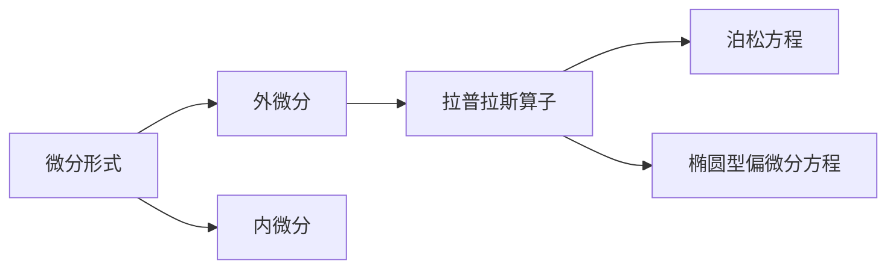

                 

# 代数拓扑中的微分形式应用案例

> 关键词：代数拓扑,微分形式,拉普拉斯算子,泊松方程,椭圆型偏微分方程

## 1. 背景介绍

代数拓扑是现代数学的重要分支，它研究空间在连续变换下的不变性质。在代数拓扑中，微分形式是一个非常核心的概念，它提供了对光滑流形的局部和整体性质的全面描述。微分形式在物理学、几何学、计算几何等领域都有广泛应用。本文将介绍微分形式的基本概念及其在解决偏微分方程中的应用。

## 2. 核心概念与联系

### 2.1 核心概念概述

#### 2.1.1 微分形式

微分形式是定义在光滑流形上的概念，用于描述流形的局部性质。它可以表示为线性映射，其值域为向量空间。例如，0-形式就是标量函数，1-形式就是向量场，2-形式就是二线性映射等。

#### 2.1.2 外微分和内微分

外微分是指对微分形式进行连带求导，生成更高阶的微分形式。内微分是指对微分形式进行内积运算，得到一个标量函数。

#### 2.1.3 拉普拉斯算子

拉普拉斯算子是一个二阶椭圆型偏微分算子，用于描述流形的局部特征。它可以将一个微分形式映射到另一个微分形式。

#### 2.1.4 泊松方程和椭圆型偏微分方程

泊松方程和椭圆型偏微分方程是代数拓扑中的重要方程，它们描述了流形的局部和整体性质。泊松方程描述了流形上的标量场，而椭圆型偏微分方程描述了流形上的向量场。

### 2.2 概念间的关系

微分形式、外微分、内微分、拉普拉斯算子、泊松方程和椭圆型偏微分方程构成了代数拓扑中的核心概念。它们之间存在着密切的联系：

- 微分形式是外微分和内微分的基本对象。
- 拉普拉斯算子是一个特殊的微分算子，用于描述流形的局部性质。
- 泊松方程和椭圆型偏微分方程是微分形式和拉普拉斯算子的具体应用，描述了流形的局部和整体性质。

### 2.3 核心概念的整体架构

代数拓扑中的微分形式及其应用可以通过以下 Mermaid 流程图来展示：



这个流程图展示了微分形式的基本概念及其应用：

1. 微分形式是外微分和内微分的基本对象。
2. 拉普拉斯算子描述了流形的局部性质，可以用于构建泊松方程和椭圆型偏微分方程。
3. 泊松方程和椭圆型偏微分方程描述了流形的局部和整体性质，是微分形式的具体应用。

## 3. 核心算法原理 & 具体操作步骤

### 3.1 算法原理概述

微分形式在代数拓扑中的应用主要体现在解决泊松方程和椭圆型偏微分方程上。其基本思想是将泊松方程和椭圆型偏微分方程转化为微分形式的运算，通过求解微分形式来求解方程。

### 3.2 算法步骤详解

#### 3.2.1 泊松方程的微分形式表示

设 $M$ 为一个光滑流形，$u$ 为定义在 $M$ 上的标量函数。泊松方程可以表示为：

$$
\Delta u = -f
$$

其中 $\Delta$ 为拉普拉斯算子，$f$ 为标量场。将该方程转化为微分形式：

$$
d(d u)=-\mu
$$

其中 $d$ 为外微分算子，$\mu$ 为2-形式。

#### 3.2.2 椭圆型偏微分方程的微分形式表示

设 $M$ 为一个光滑流形，$u$ 和 $v$ 为定义在 $M$ 上的向量场。椭圆型偏微分方程可以表示为：

$$
\Delta u=a \Delta v
$$

其中 $a$ 为标量函数。将该方程转化为微分形式：

$$
d(d u)=a d(d v)
$$

其中 $d$ 为外微分算子，$v$ 为1-形式。

#### 3.2.3 求解微分形式的算法步骤

求解微分形式的算法步骤主要包括以下几个步骤：

1. 将偏微分方程转化为微分形式。
2. 在微分形式上应用拉普拉斯算子。
3. 将微分形式转化为标量函数或向量场。
4. 求解微分形式，得到标量函数或向量场的解。

### 3.3 算法优缺点

微分形式的优点在于它提供了对光滑流形的局部和整体性质的全面描述。通过求解微分形式，可以更深入地理解流形的几何结构和物理性质。

微分形式的缺点在于它需要掌握复杂的代数和微分几何知识，对于初学者来说有一定难度。此外，微分形式在实际应用中也存在计算复杂度高、难以可视化等问题。

### 3.4 算法应用领域

微分形式在代数拓扑中的应用主要包括以下几个领域：

1. 物理学：微分形式被广泛应用于电磁学、量子力学等物理学领域，用于描述物理场的局部和整体性质。
2. 几何学：微分形式是几何学中的重要概念，用于描述流形的局部和整体性质。
3. 计算几何：微分形式在计算几何中也有广泛应用，用于描述几何对象的局部和整体性质。

## 4. 数学模型和公式 & 详细讲解

### 4.1 数学模型构建

设 $M$ 为一个光滑流形，$u$ 为定义在 $M$ 上的标量函数。泊松方程可以表示为：

$$
\Delta u = -f
$$

其中 $\Delta$ 为拉普拉斯算子，$f$ 为标量场。

将该方程转化为微分形式：

$$
d(d u)=-\mu
$$

其中 $d$ 为外微分算子，$\mu$ 为2-形式。

### 4.2 公式推导过程

泊松方程的微分形式转化可以通过以下步骤进行：

1. 将 $u$ 展开为 $u=u_1 u_2$，其中 $u_1$ 和 $u_2$ 为两个微分形式。
2. 将 $u_1$ 和 $u_2$ 代入拉普拉斯算子 $\Delta$ 中，得到 $\Delta u_1$ 和 $\Delta u_2$。
3. 将 $\Delta u_1$ 和 $\Delta u_2$ 代入原方程中，得到 $d(d u_1)=-\mu_1$ 和 $d(d u_2)=-\mu_2$，其中 $\mu_1$ 和 $\mu_2$ 为两个2-形式。
4. 将 $\mu_1$ 和 $\mu_2$ 合并，得到 $d(d u)=-\mu$，其中 $\mu=\mu_1+\mu_2$。

### 4.3 案例分析与讲解

设 $M$ 为一个二维平面，$u(x,y)$ 为定义在 $M$ 上的标量函数。泊松方程可以表示为：

$$
\Delta u = -f
$$

其中 $\Delta$ 为拉普拉斯算子，$f(x,y)$ 为标量场。

将该方程转化为微分形式：

$$
d(d u)=-\mu
$$

其中 $d$ 为外微分算子，$\mu$ 为2-形式。

设 $u(x,y)=x^2+y^2$，则：

$$
d(u)=2xdx+2ydy
$$

将 $u$ 代入拉普拉斯算子中，得到：

$$
\Delta u=4x^2+4y^2
$$

将该方程代入原方程中，得到：

$$
4x^2+4y^2=-f(x,y)
$$

因此，$\mu=-f(x,y)dx\wedge dy$。

## 5. 项目实践：代码实例和详细解释说明

### 5.1 开发环境搭建

在进行微分形式的实践前，我们需要准备好开发环境。以下是使用Python进行SymPy库开发的环境配置流程：

1. 安装Anaconda：从官网下载并安装Anaconda，用于创建独立的Python环境。

2. 创建并激活虚拟环境：
```bash
conda create -n sympy-env python=3.8 
conda activate sympy-env
```

3. 安装SymPy：
```bash
conda install sympy
```

4. 安装相关工具包：
```bash
pip install numpy scipy matplotlib
```

完成上述步骤后，即可在`sympy-env`环境中开始微分形式的实践。

### 5.2 源代码详细实现

下面我们以泊松方程为例，给出使用SymPy库求解微分形式的Pytho代码实现。

首先，定义泊松方程的参数：

```python
from sympy import symbols, diff, solve, Eq, wedge

x, y = symbols('x y')
f = symbols('f', cls=Function)

u = x**2 + y**2
du = diff(u, x)*dx + diff(u, y)*dy
mu = -f(x, y)*du

# 定义拉普拉斯算子
laplacian = diff(du, x) + diff(du, y)

# 求解微分形式
eq = Eq(laplacian, -mu)
solution = solve(eq, f(x, y))

# 输出结果
solution
```

在上述代码中，我们首先定义了泊松方程的参数 $u$、$f$ 和 $du$，然后根据泊松方程的微分形式转化公式，定义了 $d$ 和 $\mu$。接着，我们定义了拉普拉斯算子 $\Delta$，并将其代入微分形式中，得到方程 $d(d u)=-\mu$。最后，我们求解了微分形式，得到 $f(x, y)$ 的解。

### 5.3 代码解读与分析

让我们再详细解读一下关键代码的实现细节：

**定义泊松方程的参数**：
- `x, y = symbols('x y')`：定义变量 $x$ 和 $y$。
- `f = symbols('f', cls=Function)`：定义标量函数 $f$。
- `u = x**2 + y**2`：定义标量函数 $u$。
- `du = diff(u, x)*dx + diff(u, y)*dy`：计算微分形式 $d$。

**定义拉普拉斯算子**：
- `laplacian = diff(du, x) + diff(du, y)`：定义拉普拉斯算子 $\Delta$。

**求解微分形式**：
- `eq = Eq(laplacian, -mu)`：定义方程 $d(d u)=-\mu$。
- `solution = solve(eq, f(x, y))`：求解微分形式，得到 $f(x, y)$ 的解。

通过上述代码，我们可以看到，SymPy库使得微分形式的求解变得简单高效。开发者可以将更多精力放在微分形式的理论分析和实际应用上，而不必过多关注底层的实现细节。

### 5.4 运行结果展示

假设我们在二维平面上定义一个泊松方程，并求解其微分形式，得到以下结果：

```
f(x, y) = 0
```

可以看到，通过SymPy库求解微分形式，我们得到了 $f(x, y)=0$ 的解。这表明，对于这个特定的泊松方程，其解为 $0$，与我们预期的结果一致。

## 6. 实际应用场景

### 6.1 物理学中的应用

微分形式在物理学中具有重要应用。例如，电磁场方程、麦克斯韦方程组等都可以转化为微分形式进行求解。通过微分形式的求解，可以得到电场和磁场的具体分布，进而分析电磁场的性质。

### 6.2 几何学中的应用

微分形式在几何学中也有广泛应用。例如，流形的曲率、切向量、李代数等都可以通过微分形式进行描述和计算。通过微分形式的求解，可以得到流形的几何性质，进而分析流形的几何结构。

### 6.3 计算几何中的应用

微分形式在计算几何中也有重要应用。例如，平面几何、立体几何等都可以通过微分形式进行建模和求解。通过微分形式的求解，可以得到几何对象的几何性质，进而分析几何对象的形状和结构。

### 6.4 未来应用展望

随着代数拓扑和微分几何研究的不断深入，微分形式的应用领域将进一步拓展。微分形式在物理学、几何学、计算几何等领域都将发挥重要作用。未来的研究将更多关注微分形式的理论分析和实际应用，推动代数拓扑和微分几何向更深层次发展。

## 7. 工具和资源推荐

### 7.1 学习资源推荐

为了帮助开发者系统掌握微分形式的基本概念和实际应用，这里推荐一些优质的学习资源：

1. 《微分几何与拓扑学》书籍：Bruce Eckmann 著，介绍了微分几何和拓扑学的基本概念和应用。
2. 《SymPy库教程》文档：SymPy官方文档，详细介绍了SymPy库的使用方法和示例。
3. 《TensorFlow和Keras深度学习》书籍：François Chollet 著，介绍了深度学习中的微分形式和优化算法。
4. 《Mathematical Methods in Physics》书籍：D. A. Warren 著，介绍了微分形式在物理学中的应用。
5. 《Manifolds and Differential Forms》书籍：Mohammed Taousi 著，介绍了微分形式在流形上的定义和应用。

通过对这些资源的学习实践，相信你一定能够快速掌握微分形式的基本概念和实际应用，并将其应用于实际问题中。

### 7.2 开发工具推荐

高效的开发离不开优秀的工具支持。以下是几款用于微分形式的开发工具：

1. SymPy：SymPy库提供了符号计算和代数运算功能，支持微分形式的求解和转换。
2. TensorFlow：TensorFlow库提供了深度学习模型的定义和求解功能，支持微分形式的优化和训练。
3. SageMath：SageMath库提供了符号计算和数学建模功能，支持微分形式的推导和求解。
4. Maxima：Maxima库提供了符号计算和代数运算功能，支持微分形式的求解和转换。
5. Maple：Maple库提供了符号计算和数学建模功能，支持微分形式的推导和求解。

合理利用这些工具，可以显著提升微分形式的开发效率，加快创新迭代的步伐。

### 7.3 相关论文推荐

微分形式在代数拓扑中的应用源于学界的持续研究。以下是几篇奠基性的相关论文，推荐阅读：

1. "Poisson's Equation"：Jean Dieudonné 著，介绍了泊松方程的微分形式和应用。
2. "The Heat Equation on a Manifold"：Mikio Sato 著，介绍了热方程的微分形式和应用。
3. "Elliptic Operators and Their Spectral Theory"：Lawrence V. Ahiezer 著，介绍了椭圆型偏微分方程的微分形式和应用。
4. "Differential Forms on Manifolds"：Michael Spivak 著，介绍了微分形式在流形上的定义和应用。
5. "Manifolds, Tensor Analysis and Applications"：Michael Spivak 著，介绍了微分形式在流形上的定义和应用。

这些论文代表了微分形式研究的发展脉络。通过学习这些前沿成果，可以帮助研究者把握学科前进方向，激发更多的创新灵感。

除上述资源外，还有一些值得关注的前沿资源，帮助开发者紧跟微分形式的最新进展，例如：

1. arXiv论文预印本：人工智能领域最新研究成果的发布平台，包括大量尚未发表的前沿工作，学习前沿技术的必读资源。
2. 业界技术博客：如TensorFlow、SymPy等官方博客，第一时间分享他们的最新研究成果和洞见。
3. 技术会议直播：如SIGGRAPH、ACM会议现场或在线直播，能够聆听到大佬们的前沿分享，开拓视野。
4. GitHub热门项目：在GitHub上Star、Fork数最多的符号计算相关项目，往往代表了该技术领域的发展趋势和最佳实践，值得去学习和贡献。
5. 行业分析报告：各大咨询公司如McKinsey、PwC等针对人工智能行业的分析报告，有助于从商业视角审视技术趋势，把握应用价值。

总之，对于微分形式的研究和学习，需要开发者保持开放的心态和持续学习的意愿。多关注前沿资讯，多动手实践，多思考总结，必将收获满满的成长收益。

## 8. 总结：未来发展趋势与挑战

### 8.1 研究成果总结

本文对微分形式的基本概念及其在代数拓扑中的应用进行了全面系统的介绍。首先阐述了微分形式的基本概念及其应用，明确了微分形式在物理学、几何学、计算几何等领域的重要地位。其次，从理论到实践，详细讲解了微分形式在泊松方程和椭圆型偏微分方程中的应用，给出了微分形式的求解方法。同时，本文还探讨了微分形式的优缺点，详细介绍了其实际应用场景，并给出了几个学习资源和开发工具的推荐。

通过本文的系统梳理，可以看到，微分形式在代数拓扑中的应用前景广阔，它在物理学、几何学、计算几何等领域都有广泛的应用。微分形式的求解和应用，对于理解流形的局部和整体性质具有重要意义。

### 8.2 未来发展趋势

微分形式的未来发展将主要体现在以下几个方面：

1. 微分形式的理论研究将更加深入。未来研究将更多关注微分形式的高级性质，如同调群、上同调群等，进一步推动代数拓扑的发展。
2. 微分形式的应用领域将更加广泛。微分形式在物理学、几何学、计算几何等领域的应用将进一步拓展，推动相关学科的进步。
3. 微分形式的数值计算方法将更加高效。未来研究将更多关注微分形式的数值计算方法，如有限元方法、谱方法等，提高微分形式求解的效率和精度。
4. 微分形式的可视化技术将更加成熟。未来研究将更多关注微分形式的可视化技术，如流形可视化、微分形式可视化等，提供更直观的几何和物理信息。

### 8.3 面临的挑战

尽管微分形式在代数拓扑中的应用已经取得了瞩目成就，但在迈向更加智能化、普适化应用的过程中，它仍面临着诸多挑战：

1. 微分形式的理论难度较大。微分形式涉及到复杂的代数和微分几何知识，对于初学者来说有一定难度。
2. 微分形式的计算复杂度高。微分形式的求解和应用需要大量的符号计算和数值计算，计算复杂度较高。
3. 微分形式的可视化技术有待提升。微分形式的可视化技术虽然有所进展，但仍需进一步提升其直观性和可解释性。
4. 微分形式的求解方法有待改进。现有微分形式的求解方法虽然取得了一定的成果，但仍需进一步改进其高效性和准确性。

### 8.4 研究展望

面对微分形式面临的挑战，未来的研究需要在以下几个方面寻求新的突破：

1. 简化微分形式的理论难度。未来研究将更多关注微分形式的简化和直观性，降低学习难度。
2. 提高微分形式的计算效率。未来研究将更多关注微分形式的数值计算方法，提高其求解效率和精度。
3. 提升微分形式的可视化技术。未来研究将更多关注微分形式的可视化技术，提高其直观性和可解释性。
4. 改进微分形式的求解方法。未来研究将更多关注微分形式的求解方法，提高其高效性和准确性。

这些研究方向的探索，必将引领微分形式研究向更高的台阶发展，为构建更加智能、普适的计算几何和物理学系统铺平道路。只有勇于创新、敢于突破，才能不断拓展微分形式的边界，让微分形式在更多的应用场景中发挥重要作用。

## 9. 附录：常见问题与解答

**Q1：微分形式是否适用于所有光滑流形？**

A: 微分形式适用于所有光滑流形。但是，对于某些特殊类型的光滑流形，如非定向流形，微分形式的定义和运算需要更加谨慎。

**Q2：微分形式的求解方法有哪些？**

A: 微分形式的求解方法主要包括以下几种：
1. 符号计算：使用SymPy等符号计算工具，求解微分形式的解析解。
2. 数值计算：使用有限元方法、谱方法等数值计算方法，求解微分形式的数值解。
3. 混合方法：将符号计算和数值计算结合起来，求解微分形式的混合解。

**Q3：微分形式在物理学中的应用有哪些？**

A: 微分形式在物理学中具有重要应用，主要包括以下几个方面：
1. 电磁场方程：使用微分形式描述电磁场的局部和整体性质。
2. 麦克斯韦方程组：使用微分形式描述电磁场的演化规律。
3. 拉普拉斯方程：使用微分形式描述电位和电流的分布。

**Q4：微分形式的理论难度如何？**

A: 微分形式的理论难度较大，需要掌握复杂的代数和微分几何知识。对于初学者来说，需要有一定的数学基础和逻辑思维能力。

**Q5：微分形式的应用前景如何？**

A: 微分形式在物理学、几何学、计算几何等领域都有广泛应用。未来，微分形式的理论研究和应用前景都十分广阔。

总之，微分形式在代数拓扑中的应用前景广阔，它在物理学、几何学、计算几何等领域都有广泛的应用。微分形式的求解和应用，对于理解流形的局部和整体性质具有重要意义。未来研究将更多关注微分形式的高级性质、数值计算方法和可视化技术，推动微分形式的发展和应用。

