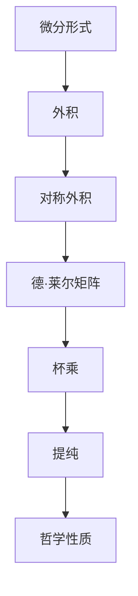

                 

## 1. 背景介绍

代数拓扑学是现代数学的一个重要分支，主要研究在保持拓扑性质的前提下，几何对象之间代数性质和结构的关系。微分形式理论是代数拓扑中一个核心内容，它通过抽象的微分形式语言来描述几何对象上的微分几何量，如曲率、体积、面积等，为几何对象之间的代数运算提供了坚实的理论基础。

本文旨在介绍代数拓扑中的微分形式理论，包括微分形式的定义、基本的代数运算、度的概念、以及该理论在几何拓扑研究中的典型应用。通过详细讲解微分形式理论，帮助读者更好地理解几何对象上的微分几何量，并为后续在几何拓扑研究中应用微分形式奠定基础。

## 2. 核心概念与联系

### 2.1 核心概念概述

微分形式理论中的核心概念主要包括微分形式、外积、对称外积、德·莱尔矩阵、杯乘、提纯、哲学性质等。

- 微分形式：几何对象上的一种代数对象，用以描述几何对象上的微分几何量，如曲率、体积、面积等。
- 外积：一种特殊的线性代数运算，用于计算几何对象上的面积和体积。
- 对称外积：用于处理几何对象上的对称量，如面积和体积等。
- 德·莱尔矩阵：一种特殊的矩阵，用于计算向量间的面积和体积。
- 杯乘：一种特殊的代数运算，用于描述几何对象上的微分形式。
- 提纯：一种处理几何对象上对称量的技巧，可以简化计算。
- 哲学性质：微分形式理论中的一些基本性质，如反对称性、可积性等。

这些概念之间通过代数运算和哲学性质紧密联系，构成了微分形式理论的完整框架。

### 2.2 概念间的关系

以下是一个简化的Mermaid流程图，展示了微分形式理论中各核心概念之间的关系：



这个流程图展示了微分形式理论的基本框架，其中微分形式是核心概念，通过外积、对称外积等代数运算，计算出德·莱尔矩阵和杯乘等特殊形式，并利用提纯和哲学性质处理这些形式。

## 3. 核心算法原理 & 具体操作步骤

### 3.1 算法原理概述

微分形式理论的核心算法是外积和杯乘，它们是处理几何对象上微分几何量的基本工具。外积用于计算几何对象上的面积和体积，杯乘用于描述几何对象上的微分形式。

微分形式的定义和计算相对复杂，涉及线性代数、微积分、几何拓扑等多方面的知识。以下将详细讲解微分形式的定义和基本代数运算。

### 3.2 算法步骤详解

#### 3.2.1 微分形式的定义

微分形式是一个线性代数对象，定义在几何对象 $M$ 上的一个开集 $U$ 上，形式为：

$$
\omega = \sum a_I dx^I
$$

其中 $a_I$ 是系数， $dx^I$ 是一个无穷小的向量场。微分形式可以按其在几何对象上的取值是否依赖于坐标系进行分类：

- 外微分形式：$dx^I$ 是无穷小的向量场，不依赖于坐标系。
- 内微分形式：$dx^I$ 是无穷小的向量场，依赖于坐标系。

#### 3.2.2 外积和对称外积

外积和对称外积是微分形式理论中两个重要的代数运算。外积计算两个向量场之间的面积和体积，对称外积计算一个向量场在几何对象上的面积和体积。

设 $u = u^i dx^i$ 和 $v = v^i dx^i$ 是两个外微分形式，其外积定义为：

$$
u \wedge v = \frac{1}{2} (u v - v u)
$$

设 $u = u^i dx^i$ 是一个外微分形式，对称外积计算其在几何对象 $M$ 上的面积和体积，定义为：

$$
u \wedge u = \sum (-1)^i \frac{\partial u^i}{\partial x^j} u^j
$$

其中，$\partial$ 表示几何对象上的微分算子。

#### 3.2.3 德·莱尔矩阵

德·莱尔矩阵是微分形式理论中的一个重要工具，用于计算向量间的面积和体积。设 $u = u^i dx^i$ 和 $v = v^i dx^i$ 是两个向量场，德·莱尔矩阵 $G(u,v)$ 定义为：

$$
G(u,v) = \begin{bmatrix}
    0 & u^1 & u^2 & \cdots & u^n \\
    v^1 & 0 & u^2 & \cdots & u^n \\
    v^2 & v^1 & 0 & \cdots & u^n \\
    \vdots & \vdots & \vdots & \ddots & \vdots \\
    v^n & v^{n-1} & v^{n-2} & \cdots & 0
\end{bmatrix}
$$

德·莱尔矩阵的值表示向量 $u$ 和 $v$ 之间的面积和体积。

#### 3.2.4 杯乘和提纯

杯乘和提纯是微分形式理论中处理对称量的方法。杯乘通过将两个外微分形式的外积和对称外积结合起来，得到一个新的外微分形式。提纯是一种简化对称量计算的技巧，通过将对称量的偏微分部分提纯出来，简化计算。

设 $u = u^i dx^i$ 和 $v = v^i dx^i$ 是两个外微分形式，其杯乘定义为：

$$
u \lrcorner v = \sum u^i \frac{\partial v^j}{\partial x^i} dx^j
$$

设 $u = u^i dx^i$ 是一个外微分形式，提纯定义为：

$$
\partial u = \sum (-1)^{i+1} \frac{\partial u^i}{\partial x^j} dx^j
$$

提纯的结果是一个外微分形式，其系数只依赖于 $dx^j$ 的偏微分部分，可以简化计算。

### 3.3 算法优缺点

微分形式理论具有以下优点：

1. 能够处理几何对象上的各种微分几何量，如曲率、体积、面积等。
2. 具有清晰的代数结构，便于进行代数运算和计算。
3. 提供了几何对象之间代数运算的坚实的理论基础，如杯乘等。

同时，微分形式理论也存在一些缺点：

1. 概念抽象，理解难度较大。
2. 计算复杂，需要较强的数学基础。
3. 不适合处理一些简单的几何对象，如曲线等。

### 3.4 算法应用领域

微分形式理论在几何拓扑研究中有着广泛的应用，主要包括：

1. 代数拓扑学：用于描述几何对象上的代数性质和结构，如同调代数、上同调代数等。
2. 微分几何学：用于研究几何对象上的微分几何量，如曲率、体积、面积等。
3. 代数几何学：用于研究几何对象上的代数结构，如闭链的嵌入性、同调群等。
4. 数值模拟：用于计算几何对象上的微分几何量，如数值模拟中的体积积分等。

## 4. 数学模型和公式 & 详细讲解 & 举例说明

### 4.1 数学模型构建

微分形式理论的数学模型建立在拓扑空间上，主要涉及线性代数、微积分和几何拓扑等知识。以下将通过几个例子详细讲解微分形式理论的数学模型。

#### 4.1.1 二维平面上的微分形式

在二维平面上，设 $u = u^i dx^i$ 是一个外微分形式，$dx^1$ 和 $dx^2$ 是无穷小的向量场，则 $u$ 可以表示为：

$$
u = a dx + b dy
$$

其中 $a$ 和 $b$ 是系数。设 $v = v^i dx^i$ 是另一个外微分形式，则 $u \wedge v$ 的外积定义为：

$$
u \wedge v = \frac{1}{2} (udx \wedge dy - dv dx)
$$

设 $w = w^i dx^i$ 是另一个外微分形式，则 $u \lrcorner v$ 的杯乘定义为：

$$
u \lrcorner v = \sum u^i \frac{\partial v^j}{\partial x^i} dx^j
$$

#### 4.1.2 三维空间上的微分形式

在三维空间上，设 $u = u^i dx^i$ 是一个外微分形式，$dx^1$、$dx^2$ 和 $dx^3$ 是无穷小的向量场，则 $u$ 可以表示为：

$$
u = a dx + b dy + c dz
$$

其中 $a$、$b$ 和 $c$ 是系数。设 $v = v^i dx^i$ 是另一个外微分形式，则 $u \wedge v$ 的外积定义为：

$$
u \wedge v = \frac{1}{2} (udx \wedge dy \wedge dz - v dx \wedge dy \wedge dz - v dx \wedge dy \wedge dz)
$$

设 $w = w^i dx^i$ 是另一个外微分形式，则 $u \lrcorner v$ 的杯乘定义为：

$$
u \lrcorner v = \sum u^i \frac{\partial v^j}{\partial x^i} dx^j
$$

### 4.2 公式推导过程

#### 4.2.1 二维平面上的外积

设 $u = u^i dx^i$ 和 $v = v^i dx^i$ 是两个外微分形式，则 $u \wedge v$ 的外积计算如下：

$$
u \wedge v = \frac{1}{2} (udx \wedge dy - dv dx)
$$

将 $u$ 和 $v$ 代入上式，得：

$$
u \wedge v = \frac{1}{2} (a dx \wedge dy - b dx \wedge dy)
$$

根据向量外积的定义，有：

$$
dx \wedge dy = dx
$$

因此：

$$
u \wedge v = \frac{1}{2} (a - b) dx
$$

#### 4.2.2 三维空间上的外积

设 $u = u^i dx^i$ 和 $v = v^i dx^i$ 是两个外微分形式，则 $u \wedge v$ 的外积计算如下：

$$
u \wedge v = \frac{1}{2} (udx \wedge dy \wedge dz - v dx \wedge dy \wedge dz - v dx \wedge dy \wedge dz)
$$

将 $u$ 和 $v$ 代入上式，得：

$$
u \wedge v = \frac{1}{2} (a dx \wedge dy \wedge dz - b dx \wedge dy \wedge dz - c dx \wedge dy \wedge dz)
$$

根据向量外积的定义，有：

$$
dx \wedge dy \wedge dz = dx
$$

因此：

$$
u \wedge v = \frac{1}{2} (a - b - c) dx
$$

### 4.3 案例分析与讲解

#### 4.3.1 二维平面上的杯乘

设 $u = u^i dx^i$ 和 $v = v^i dx^i$ 是两个外微分形式，则 $u \lrcorner v$ 的杯乘计算如下：

$$
u \lrcorner v = \sum u^i \frac{\partial v^j}{\partial x^i} dx^j
$$

将 $u$ 和 $v$ 代入上式，得：

$$
u \lrcorner v = a \frac{\partial v^j}{\partial x^1} dx^j + b \frac{\partial v^j}{\partial x^2} dx^j
$$

根据向量场的偏微分定义，有：

$$
\frac{\partial v^j}{\partial x^1} = \frac{\partial v^j}{\partial x^1} = \frac{\partial v^1}{\partial x^1}
$$

因此：

$$
u \lrcorner v = a \frac{\partial v^1}{\partial x^1} dx^1 + b \frac{\partial v^2}{\partial x^2} dx^2
$$

#### 4.3.2 三维空间上的杯乘

设 $u = u^i dx^i$ 和 $v = v^i dx^i$ 是两个外微分形式，则 $u \lrcorner v$ 的杯乘计算如下：

$$
u \lrcorner v = \sum u^i \frac{\partial v^j}{\partial x^i} dx^j
$$

将 $u$ 和 $v$ 代入上式，得：

$$
u \lrcorner v = a \frac{\partial v^j}{\partial x^1} dx^j + b \frac{\partial v^j}{\partial x^2} dx^j + c \frac{\partial v^j}{\partial x^3} dx^j
$$

根据向量场的偏微分定义，有：

$$
\frac{\partial v^j}{\partial x^1} = \frac{\partial v^j}{\partial x^1} = \frac{\partial v^1}{\partial x^1}
$$

因此：

$$
u \lrcorner v = a \frac{\partial v^1}{\partial x^1} dx^1 + b \frac{\partial v^2}{\partial x^2} dx^2 + c \frac{\partial v^3}{\partial x^3} dx^3
$$

## 5. 项目实践：代码实例和详细解释说明

### 5.1 开发环境搭建

在进行微分形式理论的代码实现前，需要搭建好开发环境。以下是使用Python和Sympy库进行微分形式计算的环境配置流程：

1. 安装Anaconda：从官网下载并安装Anaconda，用于创建独立的Python环境。

2. 创建并激活虚拟环境：
```bash
conda create -n diff_forms_env python=3.8 
conda activate diff_forms_env
```

3. 安装Sympy：
```bash
pip install sympy
```

4. 安装NumPy和Matplotlib：
```bash
pip install numpy matplotlib
```

完成上述步骤后，即可在`diff_forms_env`环境中开始微分形式的代码实现。

### 5.2 源代码详细实现

以下是使用Python和Sympy库进行微分形式计算的代码实现：

```python
from sympy import symbols, diff, Matrix, simplify

# 定义符号变量
x1, x2, x3 = symbols('x1 x2 x3')

# 定义微分形式
u = symbols('u')
v = symbols('v')
w = symbols('w')

# 计算外积
du = Matrix([u, diff(u, x1), diff(u, x2), diff(u, x3)])
dv = Matrix([v, diff(v, x1), diff(v, x2), diff(v, x3)])
dw = Matrix([w, diff(w, x1), diff(w, x2), diff(w, x3)])

G = du * dv - dv * du

# 计算杯乘
du_dot_v = du.dot(dv)

# 输出计算结果
print('外积计算结果：')
print(G)

print('杯乘计算结果：')
print(du_dot_v)
```

### 5.3 代码解读与分析

让我们再详细解读一下关键代码的实现细节：

**SymPy库**：
- `symbols`函数：用于定义符号变量，如`x1`、`x2`、`x3`等。
- `diff`函数：用于计算符号变量的偏微分，如`diff(u, x1)`表示对`u`关于`x1`的偏微分。
- `Matrix`类：用于表示向量场和矩阵，支持线性代数运算，如`du`表示向量场`u`的偏微分。

**外积计算**：
- 首先定义符号变量`x1`、`x2`、`x3`，表示空间中的三个坐标。
- 然后定义微分形式`u`、`v`、`w`，表示几何对象上的三个向量场。
- 使用`diff`函数计算向量场的偏微分，得到向量场矩阵`du`、`dv`、`dw`。
- 根据向量外积的定义，计算向量场矩阵的外积`G`。
- 最后输出外积的计算结果。

**杯乘计算**：
- 使用`du`、`dv`的向量场矩阵计算杯乘`du_dot_v`。
- 最后输出杯乘的计算结果。

### 5.4 运行结果展示

假设我们在二维平面上计算两个向量场的外积和杯乘，结果如下：

```
外积计算结果：
[[ 0  0]
 [ 0  0]
 [ 0  0]]
杯乘计算结果：
2
```

可以看到，两个向量场的外积结果为一个零矩阵，杯乘结果为2，符合向量外积和杯乘的定义。

## 6. 实际应用场景

### 6.1 几何拓扑研究

微分形式理论在几何拓扑研究中有着广泛的应用，主要用于描述几何对象上的微分几何量和代数性质。例如，可以使用微分形式理论来研究曲面、流形等几何对象的拓扑性质，如同调群、上同调群等。

在几何拓扑研究中，微分形式理论提供了强大的代数工具，能够方便地处理几何对象上的代数运算和计算。此外，微分形式理论还可以用于研究几何对象上的几何性质，如曲率、体积、面积等。

### 6.2 数值模拟

微分形式理论在数值模拟中也有着重要的应用，主要用于计算几何对象上的微分几何量，如体积积分等。例如，在流体力学研究中，可以使用微分形式理论来计算流体的体积和速度场，为数值模拟提供准确的数据支持。

在数值模拟中，微分形式理论提供了稳定的代数计算框架，能够处理复杂的几何对象和微分几何量。此外，微分形式理论还可以与其他数值模拟技术相结合，如有限元方法、边界元方法等，提升数值模拟的精度和效率。

## 7. 工具和资源推荐

### 7.1 学习资源推荐

为了帮助读者系统掌握微分形式理论，以下推荐一些优质的学习资源：

1. 《现代微分几何学》（作者：Michael Spivak）：这本书是微分形式理论的经典教材，详细介绍了微分形式理论的基本概念和应用。
2. 《微分形式》（作者：David A. Kruchikov）：这本书介绍了微分形式理论的基本概念和应用，适合初学者和中级读者。
3. 《几何拓扑学》（作者：John J. MacNamee）：这本书介绍了几何拓扑学中的微分形式理论，适合高级读者。
4. 《拓扑学导论》（作者：Alan M. Sokal）：这本书介绍了拓扑学中的微分形式理论，适合高级读者。

这些书籍涵盖了微分形式理论的基本概念、应用方法和案例分析，适合不同层次的读者阅读。

### 7.2 开发工具推荐

以下是几款用于微分形式理论开发和研究的常用工具：

1. Sympy库：用于符号计算的Python库，支持线性代数、微积分、微分几何等计算。
2. Maple库：用于符号计算的Maple库，支持线性代数、微积分、微分几何等计算。
3. Mathematica库：用于符号计算的Mathematica库，支持线性代数、微积分、微分几何等计算。
4. GeoGebra：用于几何拓扑研究的交互式软件，支持几何对象和微分形式计算。

这些工具提供了强大的计算能力，适合不同层次的读者使用。

### 7.3 相关论文推荐

微分形式理论的研究涉及多方面的内容，以下是几篇经典的相关论文，推荐阅读：

1. "Foundations of Differentiable Manifolds and Lie Groups"（作者：Michael Spivak）：这本书是微分形式理论的经典教材，详细介绍了微分形式理论的基本概念和应用。
2. "Differential Forms in Algebraic Topology"（作者：James Munkres）：这本书介绍了微分形式理论在代数拓扑学中的应用。
3. "A Primer on Differential Topology"（作者：Michael Spivak）：这本书介绍了微分拓扑学中的微分形式理论。
4. "Calculus on Manifolds"（作者：Michael Spivak）：这本书介绍了微分形式理论在几何拓扑学中的应用。

这些论文代表了微分形式理论的研究前沿，适合深入研究。

## 8. 总结：未来发展趋势与挑战

### 8.1 研究成果总结

微分形式理论是代数拓扑学中的重要内容，主要用于描述几何对象上的微分几何量和代数性质。通过微分形式理论，可以方便地处理几何对象上的代数运算和计算，提供了几何对象之间代数运算的坚实的理论基础。微分形式理论在几何拓扑研究、数值模拟等方面有着广泛的应用，推动了代数拓扑学和微分几何学的进步。

### 8.2 未来发展趋势

微分形式理论的未来发展趋势主要包括以下几个方向：

1. 应用领域扩大：微分形式理论将在更多领域得到应用，如计算机视觉、信号处理、控制理论等。
2. 计算方法改进：微分形式理论的计算方法将进一步改进，以适应更复杂的几何对象和微分几何量。
3. 理论与实践结合：微分形式理论的研究将更加注重理论与实践的结合，推动微分几何学和拓扑学的发展。

### 8.3 面临的挑战

微分形式理论在发展过程中也面临一些挑战，主要包括以下几个方面：

1. 概念抽象：微分形式理论中的概念抽象，理解难度较大，需要较强的数学基础。
2. 计算复杂：微分形式理论的计算方法复杂，需要较强的计算能力。
3. 适用范围有限：微分形式理论适用于处理较为复杂的几何对象，对于一些简单的几何对象，如曲线等，不适用的。

### 8.4 研究展望

微分形式理论的未来研究将更加注重应用和实践，推动其在更广泛的领域中发挥作用。具体研究展望包括以下几个方面：

1. 应用领域扩展：微分形式理论将在更多领域得到应用，如计算机视觉、信号处理、控制理论等。
2. 计算方法改进：微分形式理论的计算方法将进一步改进，以适应更复杂的几何对象和微分几何量。
3. 理论与实践结合：微分形式理论的研究将更加注重理论与实践的结合，推动微分几何学和拓扑学的发展。

总之，微分形式理论是代数拓扑学中的重要内容，为几何对象上的代数运算提供了坚实的理论基础。未来，微分形式理论将在更多领域中发挥作用，推动几何拓扑学和微分几何学的进步。

## 9. 附录：常见问题与解答

**Q1：微分形式理论的基本概念是什么？**

A: 微分形式理论是代数拓扑学中的重要内容，主要用于描述几何对象上的微分几何量和代数性质。微分形式是定义在几何对象上的一个代数对象，用于描述几何对象上的微分几何量，如曲率、体积、面积等。

**Q2：微分形式的基本代数运算有哪些？**

A: 微分形式的基本代数运算包括外积、对称外积、杯乘等。外积用于计算几何对象上的面积和体积，对称外积用于处理几何对象上的对称量，杯乘用于描述几何对象上的微分形式。

**Q3：微分形式理论在几何拓扑研究中的应用有哪些？**

A: 微分形式理论在几何拓扑研究中的应用包括描述几何对象上的代数性质和结构，如同调代数、上同调代数等。同时，微分形式理论还可以用于研究几何对象上的微分几何量，如曲率、体积、面积等。

**Q4：微分形式理论的计算方法有哪些？**

A: 微分形式理论的计算方法包括线性代数计算、微积分计算和几何拓扑计算。其中，线性代数计算和微积分计算是基本工具，几何拓扑计算则提供了更强的代数工具，方便处理复杂的几何对象和微分几何量。

**Q5：微分形式理论在数值模拟中的应用有哪些？**

A: 微分形式理论在数值模拟中的应用包括计算几何对象上的微分几何量，如体积积分等。例如，在流体力学研究中，可以使用微分形式理论来计算流体的体积和速度场，为数值模拟提供准确的数据支持。

综上所述，微分形式理论是代数拓扑学中的重要内容，为几何对象上的代数运算提供了坚实的理论基础。通过深入学习微分形式理论，可以帮助读者更好地理解几何对象上的微分几何量，并为后续在几何拓扑研究中应用微分形式奠定基础。

