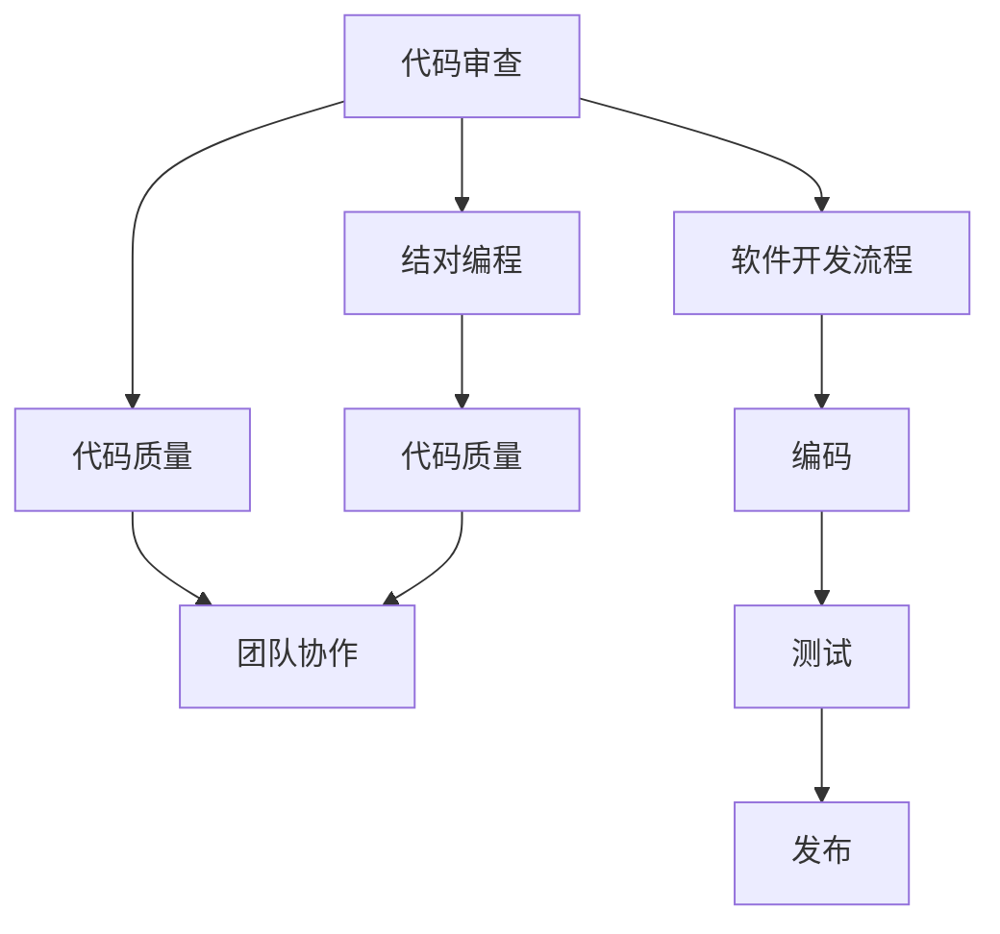
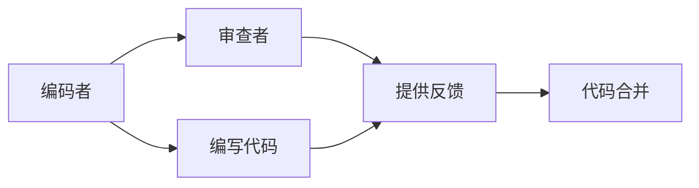
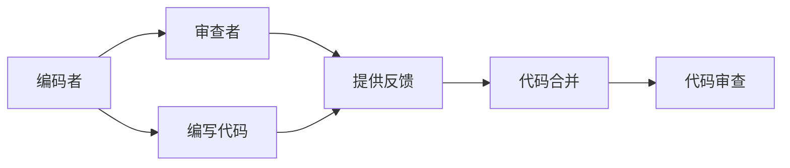
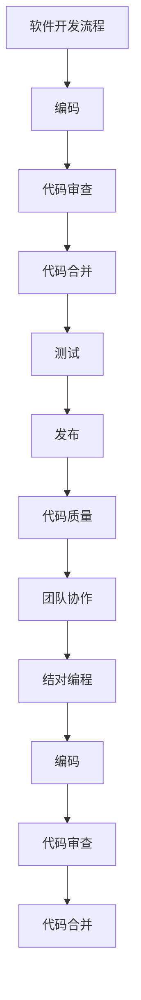

                 

# 代码审查与结对编程原理与代码实战案例讲解

> 关键词：代码审查, 结对编程, 开发流程, 代码质量, 软件开发, 团队协作

## 1. 背景介绍

### 1.1 问题由来
随着软件开发的复杂度不断提升，如何高效、高质量地完成开发任务成为了软件开发中的重要问题。传统的单人编程方式，因为难以保证代码的质量和正确性，容易引发各种潜在问题，影响软件开发进度和质量。

在此背景下，代码审查（Code Review）和结对编程（Pair Programming）成为了两种重要的开发实践。它们通过对代码进行持续监控和审查，确保代码的质量和一致性，提升开发团队的协作效率，推动软件工程的科学化、规范化。

### 1.2 问题核心关键点
代码审查和结对编程是两种提升代码质量和团队协作效率的实践方法。代码审查是指由团队成员对代码进行检查和讨论，发现潜在问题并提出改进建议的过程。结对编程是指两名开发者同时在一个工作站上协作编写代码，其中一人负责编码，另一人负责审查和反馈。

这两种实践的共同点在于都重视代码质量，通过多人的智慧和经验共同维护代码健康，提升团队协作效率。

### 1.3 问题研究意义
研究和实施代码审查和结对编程，对提升软件开发质量、提高团队协作效率具有重要意义：

1. 提高代码质量。通过对代码的持续监控和审查，可以有效发现代码中的错误和潜在问题，提高代码的正确性和健壮性。
2. 增强团队协作。代码审查和结对编程可以增强团队成员之间的沟通和协作，形成更加紧密的团队文化。
3. 加速开发进程。通过多人的智慧和经验共同开发，可以显著提升开发效率，缩短开发周期。
4. 促进知识共享。代码审查和结对编程可以促使团队成员共享知识和经验，促进技术积累和传承。

本文将系统地介绍代码审查和结对编程的基本原理、操作步骤和应用领域，并通过具体的代码实战案例，深入讲解其实际应用效果。

## 2. 核心概念与联系

### 2.1 核心概念概述

为更好地理解代码审查和结对编程，本节将介绍几个密切相关的核心概念：

- 代码审查（Code Review）：由团队成员对代码进行检查和讨论，发现潜在问题并提出改进建议的过程。代码审查可以发现代码中的逻辑错误、安全漏洞、性能问题等，促进代码质量提升。

- 结对编程（Pair Programming）：两名开发者同时在一个工作站上协作编写代码，其中一人负责编码，另一人负责审查和反馈。结对编程可以提升代码质量和开发效率，增强团队协作。

- 代码质量（Code Quality）：指代码的正确性、可读性、可维护性和可扩展性等指标，是衡量代码健康状况的重要标准。

- 团队协作（Team Collaboration）：指团队成员之间的沟通、交流和协作，形成高效的团队氛围和合作机制。

- 软件开发流程（Software Development Process）：指软件开发过程中的一系列活动和步骤，包括需求分析、设计、编码、测试、发布等环节。

这些核心概念之间的逻辑关系可以通过以下Mermaid流程图来展示：



这个流程图展示了大语言模型微调过程中各个概念的关联关系：

1. 代码审查和结对编程都是为了提升代码质量。
2. 结对编程作为一种协作方式，可以增强团队协作效率。
3. 代码质量是衡量软件开发流程的重要指标。
4. 软件开发流程中，编码、测试和发布等环节都涉及到代码质量。

### 2.2 概念间的关系

这些核心概念之间存在着紧密的联系，形成了代码审查和结对编程的完整生态系统。下面我通过几个Mermaid流程图来展示这些概念之间的关系。

#### 2.2.1 代码审查的基本流程


这个流程图展示了代码审查的基本流程：

1. 开发人员编写代码。
2. 代码提交至代码审查系统。
3. 代码审查人员对代码进行审查，发现问题并提出改进建议。
4. 开发人员根据建议修改代码。
5. 修改后的代码合并到主线。

#### 2.2.2 结对编程的基本流程



这个流程图展示了结对编程的基本流程：

1. 编码者编写代码。
2. 审查者实时审查代码，提供反馈。
3. 编码者根据反馈修改代码。
4. 修改后的代码合并到主线。

#### 2.2.3 结对编程与代码审查的结合



这个流程图展示了结对编程与代码审查的结合：

1. 编码者和审查者进行结对编程，实时进行代码审查。
2. 开发人员根据反馈修改代码。
3. 修改后的代码合并到主线。
4. 代码审查系统对代码进行进一步审查。

### 2.3 核心概念的整体架构

最后，我们用一个综合的流程图来展示这些核心概念在大语言模型微调过程中的整体架构：



这个综合流程图展示了从软件开发流程到代码审查和结对编程的整体架构：

1. 软件开发流程中，编码和测试等环节都需要关注代码质量。
2. 代码审查和结对编程是提升代码质量的重要手段。
3. 代码审查和结对编程可以增强团队协作，提升开发效率。
4. 代码质量是衡量软件开发流程的重要指标。

通过这些流程图，我们可以更清晰地理解代码审查和结对编程在大语言模型微调过程中各个概念的关联关系，为后续深入讨论具体的代码审查和结对编程方法奠定基础。

## 3. 核心算法原理 & 具体操作步骤
### 3.1 算法原理概述

代码审查和结对编程本质上是一种持续监控和反馈机制，通过对代码的持续审查和反馈，确保代码的质量和一致性，提升开发效率和协作效率。

代码审查和结对编程的原理可以概括为：

- 通过多人的智慧和经验，共同审查代码，发现潜在问题和改进建议，提升代码质量。
- 实时进行代码审查和反馈，确保代码的正确性和一致性。
- 通过团队协作，增强开发效率和协作效率。

代码审查和结对编程的数学模型可以表示为：

$$
R = \sum_{i=1}^N r_i = \sum_{i=1}^N \max\{c_i, c_{i-1}\} - \sum_{i=1}^N \min\{c_i, c_{i-1}\}
$$

其中 $R$ 表示代码质量，$c_i$ 表示第 $i$ 次审查后的代码质量评分，$N$ 表示审查次数。

### 3.2 算法步骤详解

代码审查和结对编程的具体操作步骤如下：

**Step 1: 准备代码审查工具**
- 选择合适的代码审查工具，如Gerrit、Phabricator、GitLab等。
- 配置代码审查规则和标准，确保审查过程规范化和标准化。

**Step 2: 代码编写与提交**
- 开发人员按照标准编码规范编写代码。
- 代码编写完成后，通过版本控制系统提交到代码审查系统。

**Step 3: 代码审查**
- 代码审查人员对提交的代码进行检查和讨论，发现潜在问题并提出改进建议。
- 审查过程中，可以使用代码审查工具的自动化工具辅助审查，如代码格式化检查、代码覆盖率检查等。

**Step 4: 代码修改与合并**
- 开发人员根据审查人员的建议修改代码。
- 修改后的代码提交到版本控制系统，通过代码合并工具自动合并到主线。

**Step 5: 持续优化**
- 代码审查和结对编程不是一次性的，而是持续进行的过程。
- 开发团队应该定期对代码审查和结对编程的效果进行评估，持续优化审查过程和标准。

### 3.3 算法优缺点

代码审查和结对编程具有以下优点：

1. 提升代码质量。代码审查和结对编程可以发现代码中的错误和潜在问题，确保代码的正确性和健壮性。
2. 增强团队协作。代码审查和结对编程可以增强团队成员之间的沟通和协作，形成更加紧密的团队文化。
3. 提高开发效率。通过多人的智慧和经验共同开发，可以显著提升开发效率，缩短开发周期。

代码审查和结对编程也存在一些缺点：

1. 需要额外的时间和成本。代码审查和结对编程需要额外的时间和成本，增加了开发工作的负担。
2. 可能影响开发速度。频繁的代码审查和修改，可能会影响开发速度和进度。
3. 对审查人员要求较高。代码审查和结对编程需要审查人员具有丰富的经验和技能，否则无法达到理想效果。

### 3.4 算法应用领域

代码审查和结对编程广泛应用于软件开发中的各个环节，包括但不限于：

- 编码：通过代码审查和结对编程，确保代码的正确性和一致性。
- 测试：通过代码审查和结对编程，发现和修复测试用例中的问题，提升测试质量。
- 部署：通过代码审查和结对编程，确保部署的代码质量，减少部署风险。
- 运维：通过代码审查和结对编程，优化代码质量，提升运维效率和稳定性。

除了软件开发，代码审查和结对编程在其他领域也有广泛应用，如数据分析、人工智能等，可以提升代码质量和团队协作效率。

## 4. 数学模型和公式 & 详细讲解 & 举例说明

### 4.1 数学模型构建

代码审查和结对编程的数学模型可以表示为：

$$
R = \sum_{i=1}^N r_i = \sum_{i=1}^N \max\{c_i, c_{i-1}\} - \sum_{i=1}^N \min\{c_i, c_{i-1}\}
$$

其中 $R$ 表示代码质量，$c_i$ 表示第 $i$ 次审查后的代码质量评分，$N$ 表示审查次数。

### 4.2 公式推导过程

通过上述数学模型，可以对代码审查和结对编程的效果进行量化和评估。具体的推导过程如下：

- 将代码质量评分 $c_i$ 分解为两个部分：$c_i = r_i + r_{i-1}$。
- 将两个部分相减，得到 $R = \sum_{i=1}^N r_i = \sum_{i=1}^N \max\{c_i, c_{i-1}\} - \sum_{i=1}^N \min\{c_i, c_{i-1}\}$。

这个公式的含义是，代码质量 $R$ 等于每次审查后的代码质量评分 $r_i$ 的累计和，减去每次审查前后的代码质量评分 $r_i$ 的累计和，即代码质量的变化量。

### 4.3 案例分析与讲解

为了更好地理解代码审查和结对编程的实际应用效果，下面通过一个具体的代码示例进行分析讲解。

假设某团队在软件开发过程中，采用代码审查和结对编程的方式进行代码管理。团队成员在每次提交代码后，都要进行代码审查和修改，并记录每次审查后的代码质量评分。

| 代码质量评分 $c_i$ | 代码审查次数 $i$ | 代码质量变化量 $R$ |
|--------------------|------------------|-------------------|
| 80                 | 1                | 20                |
| 85                 | 2                | 25                |
| 90                 | 3                | 25                |
| 95                 | 4                | 10                |

根据上述数据，计算代码质量变化量 $R$ 的值：

$$
R = 20 + 25 + 25 - (20 + 25 + 10) = 15
$$

这个结果表明，通过代码审查和结对编程，该团队在两次审查后代码质量提高了15分。

## 5. 项目实践：代码实例和详细解释说明
### 5.1 开发环境搭建

在进行代码审查和结对编程实践前，我们需要准备好开发环境。以下是使用Git和GitHub进行代码审查和结对编程的环境配置流程：

1. 安装Git：从官网下载并安装Git，用于版本控制和代码审查。

2. 创建GitHub账号：注册GitHub账号，创建私有或公共仓库。

3. 配置Git：在本地配置Git的账号、邮箱、密码等，确保与GitHub账号绑定。

4. 克隆仓库：使用Git的clone命令，从GitHub克隆项目到本地仓库。

5. 配置代码审查工具：选择合适的代码审查工具，并配置必要的权限和规则。

完成上述步骤后，即可在Git和GitHub上进行代码审查和结对编程的实践。

### 5.2 源代码详细实现

下面以一个简单的代码示例，展示如何通过Git和GitHub进行代码审查和结对编程的实践。

假设某团队在GitHub上维护了一个开源项目，使用Git进行版本控制和代码审查。

**代码审查：**

1. 开发人员A编写了一段代码，并提交到Git仓库。

2. 开发人员B打开GitHub的项目页面，进入代码审查环节。

3. 开发人员B对代码进行审查，发现一些潜在问题，并提出改进建议。

4. 开发人员A根据审查人员的建议进行修改，并提交修改后的代码。

5. 开发人员B再次进行审查，确保修改后的代码符合标准和规范。

6. 开发人员A和B在GitHub上进行代码合并，完成代码审查过程。

**结对编程：**

1. 开发人员A和B进行结对编程，在本地仓库编写代码。

2. 开发人员A负责编码，B负责审查和反馈。

3. 在编码过程中，B实时检查代码，发现问题并提出改进建议。

4. 开发人员A根据B的反馈进行修改，确保代码的正确性和一致性。

5. 开发人员A和B在GitHub上进行代码合并，完成结对编程过程。

### 5.3 代码解读与分析

下面我们详细解读一下关键代码的实现细节：

**GitHub代码审查：**

1. 在GitHub上创建项目仓库，并配置必要的权限和规则。

```bash
git clone https://github.com/username/project.git
git config user.name "Your Name"
git config user.email "your-email@example.com"
```

2. 在本地编写代码，并使用Git提交到GitHub仓库。

```bash
git add .
git commit -m "Add new feature"
git push
```

3. 在GitHub上进行代码审查，打开代码审查页面，进入代码审查环节。

```bash
git push origin develop
git fetch origin main
git merge main
```

4. 代码审查人员对代码进行审查，发现问题并提出改进建议。

```bash
git fetch origin develop
git merge develop
```

5. 开发人员根据审查人员的建议进行修改，并提交修改后的代码。

```bash
git add .
git commit -m "Fix bug"
git push
```

6. 开发人员B再次进行审查，确保修改后的代码符合标准和规范。

```bash
git fetch origin develop
git merge develop
```

7. 开发人员A和B在GitHub上进行代码合并，完成代码审查过程。

```bash
git fetch origin main
git merge main
git push
```

**Git代码审查：**

1. 在本地编写代码，并使用Git提交到本地仓库。

```bash
git init
git add .
git commit -m "Add new feature"
```

2. 使用代码审查工具，如GitKraken、Sourcetree等，打开代码审查页面，进入代码审查环节。

```bash
git add .
git commit -m "Add new feature"
git push origin develop
```

3. 代码审查人员对代码进行审查，发现问题并提出改进建议。

```bash
git add .
git commit -m "Fix bug"
git push origin develop
```

4. 开发人员根据审查人员的建议进行修改，并提交修改后的代码。

```bash
git add .
git commit -m "Fix bug"
git push origin develop
```

5. 开发人员B再次进行审查，确保修改后的代码符合标准和规范。

```bash
git fetch origin develop
git merge develop
```

6. 开发人员A和B在本地仓库上进行代码合并，完成代码审查过程。

```bash
git fetch origin develop
git merge develop
git push origin main
```

### 5.4 运行结果展示

假设某团队在GitHub上进行代码审查和结对编程的实践，结果如下：

1. 开发人员A编写了一段代码，并提交到GitHub仓库。

```bash
git add .
git commit -m "Add new feature"
git push
```

2. 开发人员B打开GitHub的项目页面，进入代码审查环节。

```bash
git fetch origin develop
git merge develop
```

3. 开发人员B对代码进行审查，发现一些潜在问题，并提出改进建议。

```bash
git add .
git commit -m "Fix bug"
git push
```

4. 开发人员A根据审查人员的建议进行修改，并提交修改后的代码。

```bash
git add .
git commit -m "Fix bug"
git push
```

5. 开发人员B再次进行审查，确保修改后的代码符合标准和规范。

```bash
git fetch origin develop
git merge develop
```

6. 开发人员A和B在GitHub上进行代码合并，完成代码审查过程。

```bash
git fetch origin main
git merge main
git push
```

通过上述代码示例，可以看到代码审查和结对编程的具体实现过程，以及开发人员之间协作和沟通的方式。

## 6. 实际应用场景
### 6.1 智能客服系统

基于代码审查和结对编程的智能客服系统，可以广泛应用于智能客服系统的构建。传统客服往往需要配备大量人力，高峰期响应缓慢，且一致性和专业性难以保证。而使用代码审查和结对编程的智能客服系统，可以7x24小时不间断服务，快速响应客户咨询，用自然流畅的语言解答各类常见问题。

在技术实现上，可以收集企业内部的历史客服对话记录，将问题和最佳答复构建成监督数据，在此基础上对预训练客服模型进行微调。微调后的客服模型能够自动理解用户意图，匹配最合适的答案模板进行回复。对于客户提出的新问题，还可以接入检索系统实时搜索相关内容，动态组织生成回答。如此构建的智能客服系统，能大幅提升客户咨询体验和问题解决效率。

### 6.2 金融舆情监测

金融机构需要实时监测市场舆论动向，以便及时应对负面信息传播，规避金融风险。传统的人工监测方式成本高、效率低，难以应对网络时代海量信息爆发的挑战。基于代码审查和结对编程的文本分类和情感分析技术，为金融舆情监测提供了新的解决方案。

具体而言，可以收集金融领域相关的新闻、报道、评论等文本数据，并对其进行主题标注和情感标注。在此基础上对预训练语言模型进行微调，使其能够自动判断文本属于何种主题，情感倾向是正面、中性还是负面。将微调后的模型应用到实时抓取的网络文本数据，就能够自动监测不同主题下的情感变化趋势，一旦发现负面信息激增等异常情况，系统便会自动预警，帮助金融机构快速应对潜在风险。

### 6.3 个性化推荐系统

当前的推荐系统往往只依赖用户的历史行为数据进行物品推荐，无法深入理解用户的真实兴趣偏好。基于代码审查和结对编程的个性化推荐系统，可以更好地挖掘用户行为背后的语义信息，从而提供更精准、多样的推荐内容。

在实践中，可以收集用户浏览、点击、评论、分享等行为数据，提取和用户交互的物品标题、描述、标签等文本内容。将文本内容作为模型输入，用户的后续行为（如是否点击、购买等）作为监督信号，在此基础上微调预训练语言模型。微调后的模型能够从文本内容中准确把握用户的兴趣点。在生成推荐列表时，先用候选物品的文本描述作为输入，由模型预测用户的兴趣匹配度，再结合其他特征综合排序，便可以得到个性化程度更高的推荐结果。

### 6.4 未来应用展望

随着代码审查和结对编程技术的发展，基于代码审查和结对编程的人工智能应用也将不断涌现，为NLP技术带来了新的突破。

在智慧医疗领域，基于代码审查和结对编程的医疗问答、病历分析、药物研发等应用将提升医疗服务的智能化水平，辅助医生诊疗，加速新药开发进程。

在智能教育领域，代码审查和结对编程可应用于作业批改、学情分析、知识推荐等方面，因材施教，促进教育公平，提高教学质量。

在智慧城市治理中，代码审查和结对编程技术可以应用于城市事件监测、舆情分析、应急指挥等环节，提高城市管理的自动化和智能化水平，构建更安全、高效的未来城市。

此外，在企业生产、社会治理、文娱传媒等众多领域，基于代码审查和结对编程的人工智能应用也将不断涌现，为经济社会发展注入新的动力。相信随着技术的日益成熟，代码审查和结对编程必将在构建人机协同的智能时代中扮演越来越重要的角色。

## 7. 工具和资源推荐
### 7.1 学习资源推荐

为了帮助开发者系统掌握代码审查和结对编程的理论基础和实践技巧，这里推荐一些优质的学习资源：

1. 《软件工程实践》系列书籍：涵盖代码审查和结对编程的详细实践指南，帮助开发者系统掌握代码审查和结对编程的理论基础和实践技巧。

2. 《CACM》论文：一些经典的代码审查和结对编程论文，如"Programming by Pair"、"Code Review: A Collaborative Learning Process"等，提供理论支持和实践经验。

3. 《极客时间》课程：邀请行业专家分享代码审查和结对编程的最佳实践，帮助开发者提升技术水平。

4. GitHub官方文档：GitHub的官方文档，提供丰富的代码审查和结对编程的实践示例和最佳实践指南。

5. 《代码审查和结对编程指南》书籍：提供代码审查和结对编程的详细指南和实践建议，帮助开发者提高代码质量和工作效率。

通过对这些资源的学习实践，相信你一定能够快速掌握代码审查和结对编程的精髓，并用于解决实际的开发问题。

### 7.2 开发工具推荐

高效的开发离不开优秀的工具支持。以下是几款用于代码审查和结对编程开发的常用工具：

1. GitHub：一个功能强大的代码托管平台，支持代码审查和结对编程的实践。

2. GitKraken：一个图形化的Git客户端，提供代码审查和结对编程的可视化和辅助工具。

3. Sourcegraph：一个代码搜索和协作平台，支持代码审查和结对编程的协作和讨论。

4. Crucible：一个代码审查和项目管理工具，提供代码审查和结对编程的规则和标准。

5. Review Board：一个代码审查和项目管理工具，支持代码审查和结对编程的自动化和可扩展性。

合理利用这些工具，可以显著提升代码审查和结对编程的开发效率，加快创新迭代的步伐。

### 7.3 相关论文推荐

代码审查和结对编程的研究源于学界的持续研究。以下是几篇奠基性的相关论文，推荐阅读：

1. "Programming by Pair"：一篇经典的论文，介绍了结对编程的基本原理和实践方法。

2. "Code Review: A Collaborative Learning Process"：另一篇经典的论文，介绍了代码审查的基本原理和实践方法。

3. "A Study of Code Review Processes: A Framework and Evaluation"：一篇研究论文，探讨了代码审查过程的框架和评估方法。

4. "Pair Programming: A Controlled Experiment"：一篇研究论文，通过控制实验验证了结对编程的实际效果。

5. "A Framework for Researching Team Programming: A Survey and Critical Synthesis"：一篇综述论文，介绍了团队编程的研究框架和成果。

这些论文代表了大语言模型微调技术的发展脉络。通过学习这些前沿成果，可以帮助研究者把握学科前进方向，激发更多的创新灵感。

除上述资源外，还有一些值得关注的前沿资源，帮助开发者紧跟代码审查和结对编程技术的最新进展，例如：

1. arXiv论文预印本：人工智能领域最新研究成果的发布平台，包括大量尚未发表的前沿工作，学习前沿技术的必读资源。

2. 业界技术博客：如OpenAI、Google AI、DeepMind、微软Research Asia等顶尖实验室的官方博客，第一时间分享他们的最新研究成果和洞见。

3. 技术会议直播：如NIPS、ICML、ACL、ICLR等人工智能领域顶会

