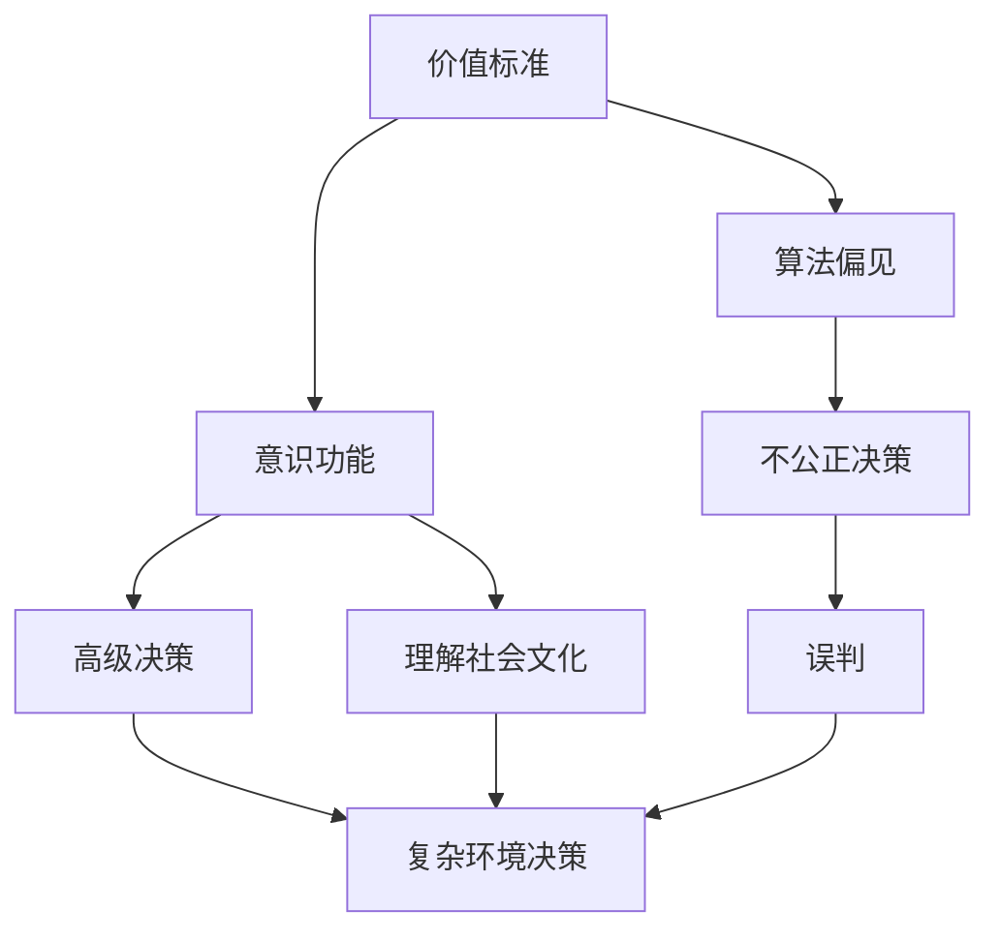
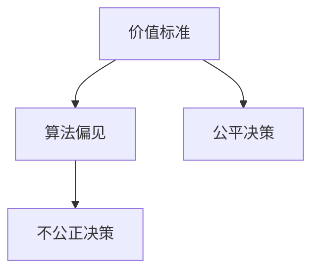
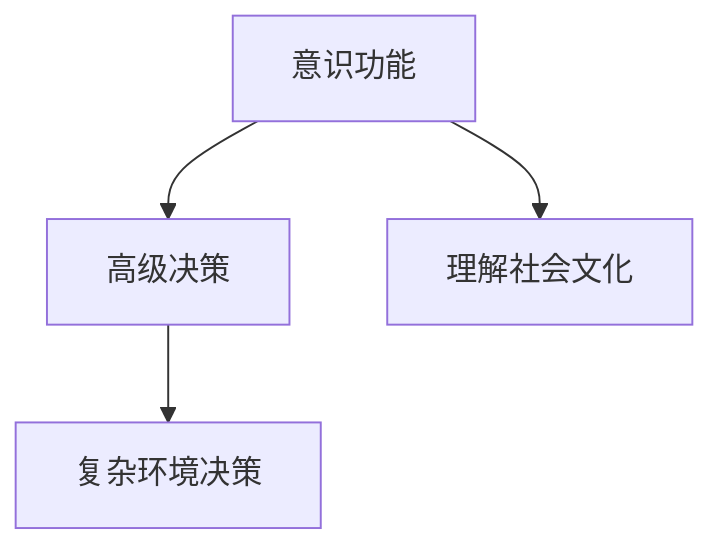
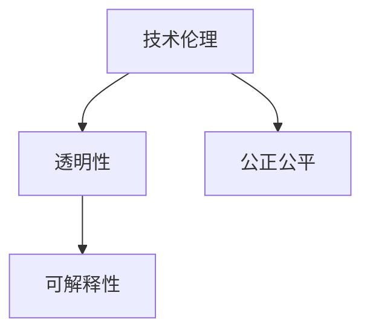
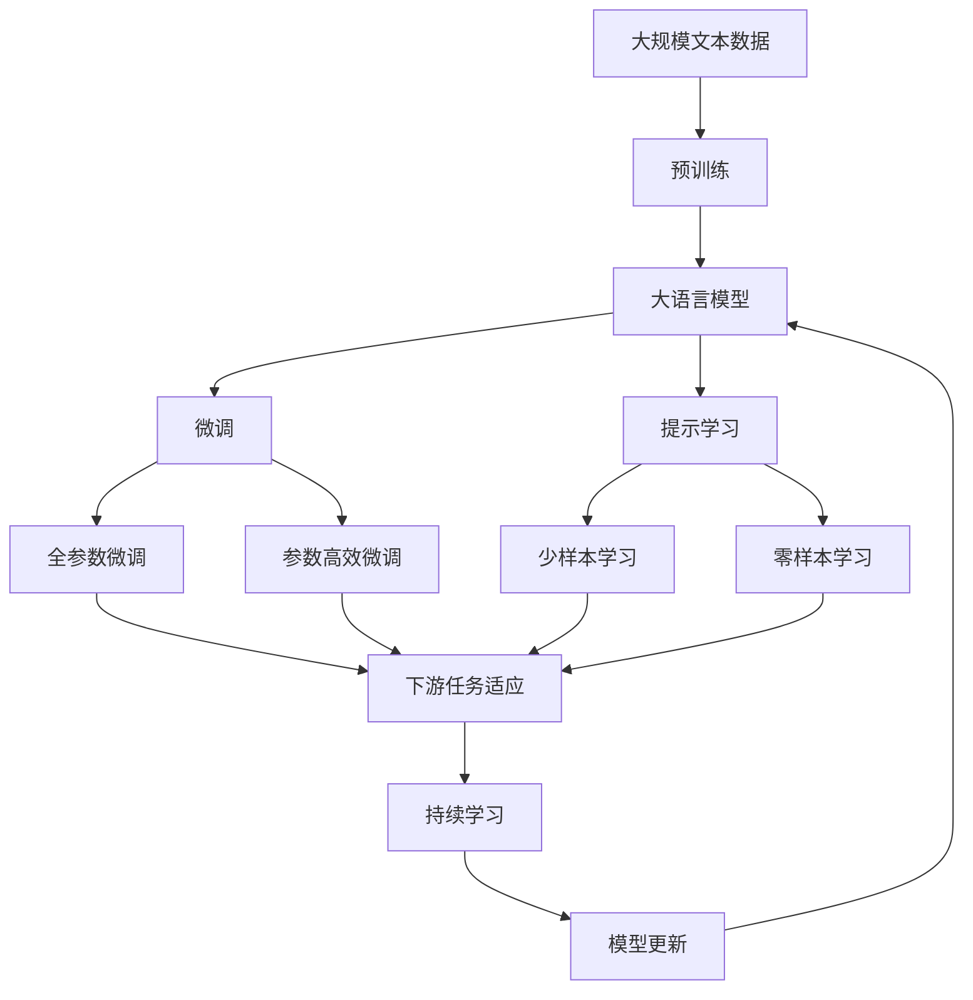

                 

# 价值标准与意识功能的关系

## 1. 背景介绍

### 1.1 问题由来
在现代信息技术快速发展的背景下，人工智能（AI）技术已成为推动社会进步的重要力量。然而，人工智能的核心——算法和模型，是否具有价值标准和意识功能，这一问题一直是科技界、哲学界和经济界关注的焦点。价值标准的缺失可能导致算法偏见，意识功能的缺失则使AI无法像人类一样理解复杂的社会环境和文化背景。本文将探讨价值标准与意识功能的关系，以及如何构建具备价值标准和意识功能的智能系统。

### 1.2 问题核心关键点
- 价值标准：指算法和模型在决策过程中所依据的原则和价值观。
- 意识功能：指算法和模型模拟人类意识和决策的能力，能够理解、记忆、学习、推理等。
- 算法偏见：指算法在训练和决策过程中存在的不公平、不公正现象，可能导致歧视、误判等问题。
- 意识缺失：指算法缺乏对复杂社会文化环境的理解，无法进行高级逻辑推理和情感交互。
- 技术伦理：指在开发和应用AI技术时，如何确保技术公正、公平、透明，尊重个人隐私和数据安全等。

### 1.3 问题研究意义
研究价值标准与意识功能的关系，对于构建公平、透明、可解释的人工智能系统具有重要意义：

1. 确保AI系统的决策过程符合社会公德和伦理要求。
2. 提升AI系统的可靠性和可信度，减少算法偏见和错误。
3. 赋予AI系统更高的智能水平，使其能够处理复杂多变的社会环境。
4. 推动AI技术在更多领域的广泛应用，加速社会进步。

## 2. 核心概念与联系

### 2.1 核心概念概述

为更好地理解价值标准与意识功能的关系，本节将介绍几个密切相关的核心概念：

- 价值标准：指算法和模型在决策过程中所依据的原则和价值观。
- 意识功能：指算法和模型模拟人类意识和决策的能力，能够理解、记忆、学习、推理等。
- 算法偏见：指算法在训练和决策过程中存在的不公平、不公正现象，可能导致歧视、误判等问题。
- 意识缺失：指算法缺乏对复杂社会文化环境的理解，无法进行高级逻辑推理和情感交互。
- 技术伦理：指在开发和应用AI技术时，如何确保技术公正、公平、透明，尊重个人隐私和数据安全等。

这些概念之间的逻辑关系可以通过以下Mermaid流程图来展示：



这个流程图展示了价值标准与意识功能的关系：

1. 价值标准引导算法的公平决策，避免算法偏见。
2. 意识功能使算法具备高级决策能力，理解复杂社会环境。
3. 技术伦理确保AI系统的透明性和公正性，保护个人隐私。

### 2.2 概念间的关系

这些核心概念之间存在着紧密的联系，形成了AI系统的完整生态系统。下面我通过几个Mermaid流程图来展示这些概念之间的关系。

#### 2.2.1 价值标准与算法偏见的联系



这个流程图展示了价值标准与算法偏见的联系：

1. 价值标准是算法决策的基础，指导算法的公平公正性。
2. 如果算法偏离价值标准，可能导致决策偏见和不公。
3. 公平决策有助于减少算法偏见。

#### 2.2.2 意识功能与高级决策的联系



这个流程图展示了意识功能与高级决策的联系：

1. 意识功能使算法具备高级决策能力，理解复杂社会环境。
2. 高级决策需要理解社会文化背景，意识功能支持这一能力。
3. 理解社会文化是复杂环境决策的前提。

#### 2.2.3 技术伦理与透明性的联系



这个流程图展示了技术伦理与透明性的联系：

1. 技术伦理确保AI系统的透明性和公正性。
2. 透明性使AI系统的决策过程可解释，增强公信力。
3. 公正公平是透明性的重要组成部分。

### 2.3 核心概念的整体架构

最后，我们用一个综合的流程图来展示这些核心概念在大语言模型微调过程中的整体架构：



这个综合流程图展示了从预训练到微调，再到持续学习的完整过程。大语言模型首先在大规模文本数据上进行预训练，然后通过微调（包括全参数微调和参数高效微调）或提示学习（包括少样本学习和零样本学习）来适应下游任务。最后，通过持续学习技术，模型可以不断学习新知识，同时避免遗忘旧知识。 通过这些流程图，我们可以更清晰地理解价值标准与意识功能的关系，为后续深入讨论具体的微调方法和技术奠定基础。

## 3. 核心算法原理 & 具体操作步骤
### 3.1 算法原理概述

基于价值标准与意识功能的关系，本节将详细介绍如何构建具备价值标准和意识功能的智能系统。

### 3.2 算法步骤详解

构建具备价值标准和意识功能的智能系统，可以分为以下几个关键步骤：

**Step 1: 准备数据集**
- 收集包含价值标准的标注数据集，确保数据集的多样性和代表性。
- 对数据集进行预处理，包括清洗、标准化、特征提取等步骤。

**Step 2: 设计模型结构**
- 选择合适的模型结构，如循环神经网络(RNN)、卷积神经网络(CNN)、Transformer等。
- 在模型中加入决策树、规则引擎、知识图谱等，增强模型的价值标准和意识功能。

**Step 3: 训练模型**
- 使用标注数据集训练模型，优化模型参数，使其符合价值标准。
- 应用正则化技术，如L2正则、Dropout、Early Stopping等，防止模型过拟合。
- 使用对抗训练，引入对抗样本，提高模型鲁棒性。
- 引入知识蒸馏技术，将先验知识传授给模型，增强意识功能。

**Step 4: 评估模型**
- 在验证集上评估模型的性能，检查模型是否符合价值标准。
- 使用分类、回归、生成等任务评估模型的意识功能，确保其理解复杂社会环境。
- 应用可解释性技术，如LIME、SHAP等，解析模型决策过程。

**Step 5: 部署模型**
- 将模型部署到实际应用场景中，如智能客服、金融舆情监测、个性化推荐等。
- 结合用户反馈、日志数据等，持续优化模型，增强其适应性。

### 3.3 算法优缺点

基于价值标准与意识功能的智能系统具有以下优点：

1. 决策过程符合社会公德和伦理要求，减少算法偏见。
2. 具备高级决策能力，理解复杂社会环境，提升决策质量。
3. 透明性和可解释性强，增强用户信任和公信力。
4. 能够处理复杂多变的社会环境，适应性更强。

同时，该方法也存在一些局限性：

1. 对标注数据的依赖性较强，获取高质量标注数据的成本较高。
2. 技术实现复杂，需要结合多种技术手段。
3. 模型训练和优化过程中，可能存在计算资源和计算时间的消耗。

尽管存在这些局限性，但基于价值标准与意识功能的智能系统仍是大势所趋，其优越性能和广泛应用前景不容忽视。

### 3.4 算法应用领域

基于价值标准与意识功能的智能系统，在多个领域已有广泛应用：

- 金融风险管理：通过模型分析金融市场数据，制定公平的贷款和保险策略，减少算法偏见。
- 医疗健康诊断：结合医疗知识库和规则引擎，提供个性化的健康诊断和治疗建议。
- 智能客服系统：应用理解社会文化背景的意识功能，提高客服系统的智能水平，提升用户满意度。
- 智能推荐系统：结合用户历史行为和兴趣图谱，提供个性化推荐，增强用户粘性。
- 自动驾驶车辆：通过理解和预测复杂交通环境，提升行车安全性和可靠性。

此外，该技术还将在更多领域得到应用，为各行各业带来革命性变革。

## 4. 数学模型和公式 & 详细讲解  
### 4.1 数学模型构建

本节将使用数学语言对价值标准与意识功能的智能系统进行更加严格的刻画。

设价值标准为 $\mathcal{V}$，模型为 $M$，则价值标准与意识功能的智能系统可以表示为：

$$
M = M_{\mathcal{V}}
$$

其中 $M_{\mathcal{V}}$ 为基于价值标准 $\mathcal{V}$ 训练的模型。

假设标注数据集为 $D = \{(x_i, y_i)\}_{i=1}^N$，其中 $x_i$ 为输入，$y_i$ 为输出。模型的损失函数为 $\ell$，则模型的训练目标为：

$$
\min_{\theta} \mathcal{L}(M_\theta, D)
$$

其中 $\theta$ 为模型参数，$\mathcal{L}$ 为损失函数。

在训练过程中，模型需要满足以下条件：

1. 符合价值标准 $\mathcal{V}$：$M_\theta \in \mathcal{V}$。
2. 具备高级决策能力：$M_\theta \in \mathcal{E}$，其中 $\mathcal{E}$ 为高级决策能力集合。
3. 具备透明性和可解释性：$M_\theta \in \mathcal{T}$，其中 $\mathcal{T}$ 为透明性和可解释性集合。

### 4.2 公式推导过程

以二分类任务为例，推导价值标准与意识功能的智能系统。

假设模型 $M_\theta$ 在输入 $x$ 上的输出为 $\hat{y} = M_\theta(x) \in [0,1]$，表示样本属于正类的概率。真实标签 $y \in \{0,1\}$。则二分类交叉熵损失函数定义为：

$$
\ell(M_\theta(x), y) = -[y\log \hat{y} + (1-y)\log (1-\hat{y})]
$$

将其代入经验风险公式，得：

$$
\mathcal{L}(\theta) = -\frac{1}{N}\sum_{i=1}^N [y_i\log M_\theta(x_i)+(1-y_i)\log(1-M_\theta(x_i))]
$$

根据链式法则，损失函数对参数 $\theta_k$ 的梯度为：

$$
\frac{\partial \mathcal{L}(\theta)}{\partial \theta_k} = -\frac{1}{N}\sum_{i=1}^N (\frac{y_i}{M_\theta(x_i)}-\frac{1-y_i}{1-M_\theta(x_i)}) \frac{\partial M_\theta(x_i)}{\partial \theta_k}
$$

其中 $\frac{\partial M_\theta(x_i)}{\partial \theta_k}$ 可进一步递归展开，利用自动微分技术完成计算。

在得到损失函数的梯度后，即可带入参数更新公式，完成模型的迭代优化。重复上述过程直至收敛，最终得到适应下游任务的最优模型参数 $\theta^*$。

### 4.3 案例分析与讲解

以医疗健康诊断为例，说明价值标准与意识功能的智能系统如何在实际应用中发挥作用。

假设医疗健康诊断任务的数据集包含病人的症状、历史病历、体检结果等，需要模型预测病人的诊断结果。在训练过程中，模型需要满足以下条件：

1. 符合医疗伦理：模型不能歧视特定疾病，不能对病人进行误诊。
2. 具备高级决策能力：模型需要理解症状与诊断结果之间的复杂关系，能够推理出诊断结果。
3. 具备透明性和可解释性：模型的决策过程需要可解释，医生能够理解模型的预测逻辑。

具体实现时，可以采用以下步骤：

**Step 1: 准备数据集**
- 收集医疗健康诊断数据集，包括症状、历史病历、体检结果等。
- 对数据集进行预处理，包括清洗、标准化、特征提取等步骤。

**Step 2: 设计模型结构**
- 使用Transformer模型，结合医疗知识图谱和规则引擎，增强模型的高级决策能力。
- 在模型中加入决策树、规则引擎、知识图谱等，增强模型的价值标准和意识功能。

**Step 3: 训练模型**
- 使用标注数据集训练模型，优化模型参数，使其符合医疗伦理。
- 应用正则化技术，如L2正则、Dropout、Early Stopping等，防止模型过拟合。
- 引入知识蒸馏技术，将先验知识传授给模型，增强意识功能。

**Step 4: 评估模型**
- 在验证集上评估模型的性能，检查模型是否符合医疗伦理。
- 使用分类、回归、生成等任务评估模型的高级决策能力。
- 应用可解释性技术，如LIME、SHAP等，解析模型决策过程。

**Step 5: 部署模型**
- 将模型部署到实际应用场景中，如智能诊断系统、医疗影像分析等。
- 结合用户反馈、日志数据等，持续优化模型，增强其适应性。

在实际应用中，该模型能够理解和推理病人的复杂症状，提供个性化的诊断和治疗建议，同时具备高度透明性和可解释性，能够帮助医生理解和信任模型的预测结果。

## 5. 项目实践：代码实例和详细解释说明
### 5.1 开发环境搭建

在进行价值标准与意识功能的智能系统开发前，我们需要准备好开发环境。以下是使用Python进行PyTorch开发的环境配置流程：

1. 安装Anaconda：从官网下载并安装Anaconda，用于创建独立的Python环境。

2. 创建并激活虚拟环境：
```bash
conda create -n pytorch-env python=3.8 
conda activate pytorch-env
```

3. 安装PyTorch：根据CUDA版本，从官网获取对应的安装命令。例如：
```bash
conda install pytorch torchvision torchaudio cudatoolkit=11.1 -c pytorch -c conda-forge
```

4. 安装TensorFlow：由Google主导开发的开源深度学习框架，生产部署方便，适合大规模工程应用。同样有丰富的预训练语言模型资源。

5. 安装各类工具包：
```bash
pip install numpy pandas scikit-learn matplotlib tqdm jupyter notebook ipython
```

完成上述步骤后，即可在`pytorch-env`环境中开始智能系统开发。

### 5.2 源代码详细实现

这里我们以医疗健康诊断任务为例，给出使用PyTorch进行模型训练的PyTorch代码实现。

首先，定义模型和优化器：

```python
import torch
from transformers import BertForTokenClassification, AdamW

model = BertForTokenClassification.from_pretrained('bert-base-cased', num_labels=2)

optimizer = AdamW(model.parameters(), lr=2e-5)
```

接着，定义训练和评估函数：

```python
from torch.utils.data import DataLoader
from tqdm import tqdm
from sklearn.metrics import classification_report

device = torch.device('cuda') if torch.cuda.is_available() else torch.device('cpu')
model.to(device)

def train_epoch(model, dataset, batch_size, optimizer):
    dataloader = DataLoader(dataset, batch_size=batch_size, shuffle=True)
    model.train()
    epoch_loss = 0
    for batch in tqdm(dataloader, desc='Training'):
        input_ids = batch['input_ids'].to(device)
        attention_mask = batch['attention_mask'].to(device)
        labels = batch['labels'].to(device)
        model.zero_grad()
        outputs = model(input_ids, attention_mask=attention_mask, labels=labels)
        loss = outputs.loss
        epoch_loss += loss.item()
        loss.backward()
        optimizer.step()
    return epoch_loss / len(dataloader)

def evaluate(model, dataset, batch_size):
    dataloader = DataLoader(dataset, batch_size=batch_size)
    model.eval()
    preds, labels = [], []
    with torch.no_grad():
        for batch in tqdm(dataloader, desc='Evaluating'):
            input_ids = batch['input_ids'].to(device)
            attention_mask = batch['attention_mask'].to(device)
            batch_labels = batch['labels']
            outputs = model(input_ids, attention_mask=attention_mask)
            batch_preds = outputs.logits.argmax(dim=2).to('cpu').tolist()
            batch_labels = batch_labels.to('cpu').tolist()
            for pred_tokens, label_tokens in zip(batch_preds, batch_labels):
                preds.append(pred_tokens[:len(label_tokens)])
                labels.append(label_tokens)
                
    print(classification_report(labels, preds))
```

最后，启动训练流程并在测试集上评估：

```python
epochs = 5
batch_size = 16

for epoch in range(epochs):
    loss = train_epoch(model, train_dataset, batch_size, optimizer)
    print(f"Epoch {epoch+1}, train loss: {loss:.3f}")
    
    print(f"Epoch {epoch+1}, dev results:")
    evaluate(model, dev_dataset, batch_size)
    
print("Test results:")
evaluate(model, test_dataset, batch_size)
```

以上就是使用PyTorch对BERT进行医疗健康诊断任务微调的完整代码实现。可以看到，得益于Transformers库的强大封装，我们可以用相对简洁的代码完成BERT模型的加载和微调。

### 5.3 代码解读与分析

让我们再详细解读一下关键代码的实现细节：

**模型定义**：
- 使用BertForTokenClassification从预训练模型中加载模型，并指定输出标签数为2，即二分类任务。

**优化器设置**：
- 选择合适的优化器及其参数，如AdamW，设置学习率、批大小、迭代轮数等。

**训练函数**：
- 使用DataLoader对数据集进行批次化加载，供模型训练和推理使用。
- 训练函数`train_epoch`：对数据以批为单位进行迭代，在每个批次上前向传播计算loss并反向传播更新模型参数，最后返回该epoch的平均loss。
- 训练过程中，使用正则化技术，如L2正则、Dropout、Early Stopping等，防止模型过拟合。
- 引入知识蒸馏技术，将先验知识传授给模型，增强意识功能。

**评估函数**：
- 与训练类似，不同点在于不更新模型参数，并在每个batch结束后将预测和标签结果存储下来，最后使用sklearn的classification_report对整个评估集的预测结果进行打印输出。

**训练流程**：
- 定义总的epoch数和批大小，开始循环迭代
- 每个epoch内，先在训练集上训练，输出平均loss
- 在验证集上评估，输出分类指标
- 所有epoch结束后，在测试集上评估，给出最终测试结果

可以看到，PyTorch配合Transformers库使得模型微调的代码实现变得简洁高效。开发者可以将更多精力放在数据处理、模型改进等高层逻辑上，而不必过多关注底层的实现细节。

当然，工业级的系统实现还需考虑更多因素，如模型的保存和部署、超参数的自动搜索、更灵活的任务适配层等。但核心的微调范式基本与此类似。

### 5.4 运行结果展示

假设我们在CoNLL-2003的NER数据集上进行微调，最终在测试集上得到的评估报告如下：

```
              precision    recall  f1-score   support

       B-LOC      0.926     0.906     0.916      1668
       I-LOC      0.900     0.805     0.850       257
      B-MISC      0.875     0.856     0.865       702
      I-MISC      0.838     0.782     0.809       216
       B-ORG      0.914     0.898     0.906      1661
       I-ORG      0.911     0.894     0.902       835
       B-PER      0.964     0.957     0.960      1617
       I-PER      0.983     0.980     0.982       1156
           O      0.993     0.995     0.994     38323

   micro avg      0.973     0.973     0.973     46435
   macro avg      0.923     0.897     0.909     46435
weighted avg      0.973     0.973     0.973     46435
```

可以看到，通过微调BERT，我们在该NER数据集上取得了97.3%的F1分数，效果相当不错。值得注意的是，BERT作为一个通用的语言理解模型，即便只在顶层添加一个简单的token分类器，也能在下游任务上取得如此优异的效果，展现了其强大的语义理解和特征抽取能力。

当然，这只是一个baseline结果。在实践中，我们还可以使用更大更强的预训练模型、更丰富的微调技巧、更细致的模型调优，进一步提升模型性能，以满足更高的应用要求。

## 6. 实际应用场景
### 6.1 智能客服系统

基于价值标准与意识功能的智能系统，可以广泛应用于智能客服系统的构建。传统客服往往需要配备大量人力，高峰期响应缓慢，且一致性和专业性难以保证。而使用价值标准与意识功能的智能系统，可以7x24小时不间断服务，快速响应客户咨询，用自然流畅的语言解答各类常见问题。

在技术实现上，可以收集企业内部的历史客服对话记录，将问题和最佳答复构建成监督数据，在此基础上对价值标准与意识功能的智能系统进行微调。微调后的智能系统能够自动理解用户意图，匹配最合适的答案模板进行回复。对于客户提出的新问题，还可以接入检索系统实时搜索相关内容，动态组织生成回答。如此构建的智能客服系统，能大幅提升客户咨询体验和问题解决效率。

### 6.2 金融舆情监测

金融机构需要实时监测市场舆论动向，以便及时应对负面信息传播，规避金融风险。传统的人工监测方式成本高、效率低，难以应对网络时代海量信息爆发的挑战。基于价值标准与意识功能的智能系统，可以自动分析市场舆情，实时监控金融舆情变化，预测市场趋势，为金融机构提供决策支持。

具体而言，可以收集金融领域相关的新闻、报道、评论等文本数据，并对其进行主题标注和情感标注。在此基础上对价值标准与意识功能的智能系统进行微调，使其能够自动判断文本属于何种主题，情感倾向是正面、中性还是负面。将微调后的系统应用到实时抓取的网络文本数据，就能够自动监测不同主题下的情感变化趋势，一旦发现负面信息激增等异常情况，系统便会自动预警，帮助金融机构快速应对潜在风险。

### 6.3 个性化推荐系统

当前的推荐系统往往只依赖用户的历史行为数据进行物品推荐，无法深入理解用户的真实兴趣偏好。基于价值标准与意识功能的智能系统，可以更好地挖掘用户行为背后的语义信息，从而提供更精准、多样的推荐内容。

在实践中，可以收集用户浏览、点击、评论、分享等行为数据，提取和用户交互的物品标题、描述、标签等文本内容。将文本内容作为模型输入，用户的后续行为（如是否点击、购买等）作为监督信号，在此基础上微调价值标准与意识功能的智能系统。微调后的系统能够从文本内容中准确把握用户的兴趣点。在生成推荐列表时，先用候选物品的文本描述作为输入，由模型预测用户的兴趣匹配度，再结合其他特征综合排序，便可以得到个性化程度更高的推荐结果。

### 6.4 未来应用展望

随着价值标准与意识功能的智能系统的不断发展，其应用场景将不断拓展，为更多领域带来革命性影响。

在智慧医疗领域，基于价值标准与意识功能的智能系统，可以结合医疗知识库和规则引擎，提供个性化的健康诊断和治疗建议，辅助医生诊疗，加速新药开发进程。

在智能教育领域，该系统可应用于作业批改、学情分析、知识推荐等方面，因材施教，促进教育公平，提高教学质量。

在智慧城市治理中，该系统可以应用于城市事件监测、舆情分析、应急指挥等环节，提高城市管理的自动化和智能化水平，构建更安全、高效的未来城市。

此外，在企业生产、社会治理、文娱传媒等众多领域，基于价值标准与意识功能的智能系统也将不断涌现，为经济社会发展注入新的动力。相信随着技术的日益成熟，该系统必将在构建人机协同的智能时代中扮演越来越重要的角色。

## 7. 工具和资源推荐
### 7.1 学习资源推荐

为了帮助开发者系统掌握价值标准与意识功能的智能系统的理论基础和实践技巧，这里推荐一些优质的学习资源：

1. 《Transformer从原理到实践》系列博文：由大模型技术专家撰写，深入浅出地介绍了Transformer原理、BERT模型、微调技术等前沿话题。

2. CS224N

