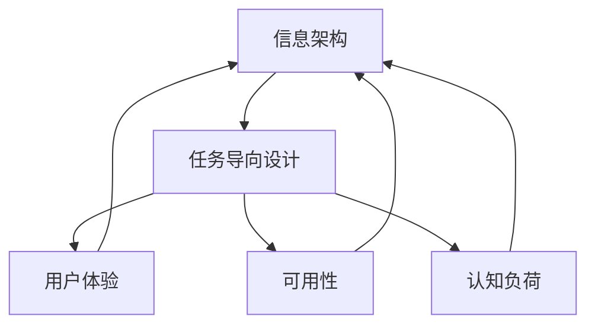
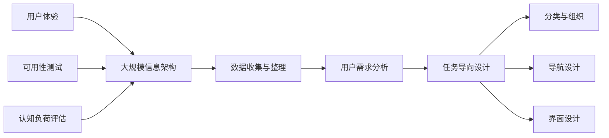

                 

# 任务导向设计对信息架构的深远影响

## 1. 背景介绍

### 1.1 问题由来
随着互联网和移动互联网的普及，信息过载的问题日益突出。用户在海量信息中如何快速定位、检索到自己所需要的信息，成为了一个重要的挑战。在此背景下，信息架构（Information Architecture, IA）应运而生，旨在通过合理的组织和设计，帮助用户更高效地获取所需信息。

### 1.2 问题核心关键点
信息架构的设计需要关注以下几个核心问题：
- 用户需求分析：明确用户使用场景、信息需求、行为模式等，确定信息架构的目标用户群体。
- 信息分类与组织：将大量杂乱无章的信息进行分类和组织，形成易于理解、便于查找的信息结构。
- 导航设计：设计合理的导航路径，让用户能够快速找到所需信息。
- 界面设计：通过布局、颜色、字体等元素，增强界面的美观性和易用性。

### 1.3 问题研究意义
研究信息架构对于提升用户体验、优化信息传递效率、提高信息服务的质量和效率具有重要意义：
1. **提升用户体验**：合理的信息架构能够简化用户操作，提高用户满意度。
2. **优化信息传递效率**：通过有效的分类与组织，减少信息冗余，提升信息检索效率。
3. **提高信息服务质量**：清晰的信息架构能够准确传递信息，降低误导和歧义。
4. **增强信息服务效率**：良好的信息架构能够减少用户的信息获取成本，提高服务效率。

## 2. 核心概念与联系

### 2.1 核心概念概述

为更好地理解任务导向设计对信息架构的影响，本节将介绍几个密切相关的核心概念：

- **信息架构（IA）**：旨在通过合理的组织和设计，帮助用户更高效地获取所需信息。包括分类、标签、导航、界面设计等多个方面。
- **任务导向设计（Task-Oriented Design, TDO）**：以用户任务为中心，设计信息架构，确保信息架构满足用户需求，提升信息检索效率。
- **用户体验（User Experience, UX）**：衡量用户在使用产品或服务时的整体感受，包括易用性、满意度、愉悦感等多个维度。
- **可用性（Usability）**：衡量用户完成特定任务的能力，通过可用性测试来评估信息架构的实际效果。
- **认知负荷（Cognitive Load）**：用户在信息检索过程中所需承担的认知努力，包括心理负荷和物理负荷两个方面。

这些核心概念之间通过任务导向设计相联系，共同构成信息架构设计的基础。

### 2.2 概念间的关系

这些核心概念之间存在着紧密的联系，形成信息架构设计的整体框架。以下是一个Mermaid流程图，展示这些概念之间的关系：



这个流程图展示了信息架构设计的各个环节及其相互关系：

1. 信息架构的构建基于任务导向设计，确保其满足用户需求。
2. 用户体验和可用性是衡量信息架构设计效果的两个重要指标。
3. 认知负荷是评估信息架构设计是否合理的重要参考。

通过这些概念之间的关系，我们可以看到，任务导向设计在信息架构设计中起着核心作用，它确保信息架构能够更好地满足用户需求，提升用户体验。

### 2.3 核心概念的整体架构

最后，我们用一个综合的流程图来展示这些核心概念在大规模信息架构设计中的整体架构：



这个综合流程图展示了信息架构设计从数据收集到最终用户测试的完整过程，凸显了任务导向设计在整个设计中的核心地位。

## 3. 核心算法原理 & 具体操作步骤
### 3.1 算法原理概述

任务导向设计通过明确用户任务，对信息进行分类和组织，设计合理的导航路径，提升信息检索效率。其主要原理包括以下几个方面：

- **用户需求分析**：通过问卷调查、用户访谈等方式，了解用户需求和行为模式，确定任务目标。
- **任务建模**：将用户需求映射为具体的任务，并设计对应的信息架构。
- **分类与组织**：将信息按照任务需求进行分类，形成易于理解和查找的信息结构。
- **导航设计**：设计直观易用的导航路径，引导用户快速找到所需信息。
- **界面设计**：通过布局、颜色、字体等元素，增强界面美观性和易用性。

### 3.2 算法步骤详解

以下是任务导向设计的主要操作步骤：

1. **数据收集与整理**：收集和整理与信息架构相关的数据，如用户行为数据、用户反馈数据等。
2. **用户需求分析**：通过问卷调查、用户访谈等方式，收集用户需求和行为数据，分析用户任务和信息需求。
3. **任务建模**：根据用户需求分析结果，构建任务模型，将用户需求映射为具体的任务。
4. **分类与组织**：将信息按照任务需求进行分类和组织，形成信息架构。
5. **导航设计**：设计直观易用的导航路径，引导用户快速找到所需信息。
6. **界面设计**：通过布局、颜色、字体等元素，增强界面美观性和易用性。
7. **用户体验与可用性测试**：进行用户体验和可用性测试，评估信息架构设计的效果。
8. **认知负荷评估**：通过用户认知负荷测试，评估信息架构设计的合理性。

### 3.3 算法优缺点

任务导向设计对信息架构设计具有显著的优势：
- **满足用户需求**：通过明确用户任务，设计符合用户需求的信息架构，提升用户满意度。
- **提升信息检索效率**：通过合理的分类与组织，减少信息冗余，提升信息检索效率。
- **提高信息服务质量**：清晰的信息架构能够准确传递信息，降低误导和歧义。
- **增强信息服务效率**：减少用户的信息获取成本，提高服务效率。

但任务导向设计也存在一些局限：
- **依赖用户调研**：需要花费大量时间进行用户调研，数据收集和分析过程较为复杂。
- **模型构建难度高**：构建任务模型需要较强的抽象和分析能力，较难构建准确的模型。
- **易受环境变化影响**：任务导向设计需要动态调整，以应对用户需求和环境变化。

### 3.4 算法应用领域

任务导向设计在信息架构设计中具有广泛的应用，适用于以下领域：

- **企业网站**：设计符合企业需求的信息架构，提升用户体验和信息检索效率。
- **电子商务**：设计直观易用的导航路径，提高用户购买转化率。
- **移动应用**：设计紧凑高效的界面，提升用户体验和应用效率。
- **在线学习平台**：设计符合学习需求的信息架构，提升学习效率和满意度。
- **政府信息服务**：设计符合政府信息需求的信息架构，提升服务质量和效率。

## 4. 数学模型和公式 & 详细讲解  
### 4.1 数学模型构建

信息架构设计可以抽象为一个数学模型，其中包含多个输入和输出变量。假设输入变量包括用户需求（D）、任务（T）、信息（I）、导航路径（N）、界面设计（U），输出变量为信息架构（IA）。则信息架构设计的数学模型为：

$$
IA=f(D,T,I,N,U)
$$

其中，$f$表示信息架构设计函数，通过输入变量的相互作用，输出符合用户需求的信息架构。

### 4.2 公式推导过程

以下是一个简单的信息架构设计案例，展示如何使用数学模型构建和推导信息架构设计过程：

假设用户需求为“查找最新电影”，任务为“通过分类查找电影”，信息架构包括分类（电影类型）、导航路径（点击分类项）、界面设计（搜索按钮）。则信息架构设计过程可以表示为：

$$
IA=D \times T \times I \times N \times U
$$

其中，$D$为用户需求，$T$为任务，$I$为信息，$N$为导航路径，$U$为界面设计。

以“查找最新电影”为例，信息架构设计过程如下：

1. **用户需求分析**：通过问卷调查，了解用户对最新电影的查询需求。
2. **任务建模**：将用户需求映射为具体的任务，如“通过分类查找电影”。
3. **分类与组织**：将电影信息按照类型进行分类，形成易于查找的信息结构。
4. **导航设计**：设计导航路径，用户可以通过点击分类项快速找到所需电影。
5. **界面设计**：通过布局、颜色、字体等元素，增强界面美观性和易用性。

最终，根据以上步骤，设计出符合用户需求的信息架构。

### 4.3 案例分析与讲解

以某电商平台的信息架构设计为例，展示任务导向设计的具体应用：

- **用户需求分析**：通过问卷调查，了解用户对电商平台的购物需求。
- **任务建模**：将用户需求映射为具体的任务，如“浏览商品”、“添加购物车”、“结算支付”等。
- **分类与组织**：将商品信息按照类别进行分类，形成易于查找的信息结构。
- **导航设计**：设计直观易用的导航路径，如“商品分类”、“商品详情”、“购物车”、“结算支付”等。
- **界面设计**：通过布局、颜色、字体等元素，增强界面美观性和易用性。

最终，设计出符合用户需求的信息架构，提升用户购物体验和平台交易效率。

## 5. 项目实践：代码实例和详细解释说明
### 5.1 开发环境搭建

在进行信息架构设计实践前，我们需要准备好开发环境。以下是使用Python进行开发的环境配置流程：

1. 安装Python：从官网下载并安装Python，选择合适的版本。
2. 安装Pandas、NumPy等数据分析库：
```bash
pip install pandas numpy
```
3. 安装Jupyter Notebook：
```bash
pip install jupyter notebook
```
4. 安装Matplotlib等数据可视化库：
```bash
pip install matplotlib seaborn
```

完成上述步骤后，即可在Jupyter Notebook中开始信息架构设计实践。

### 5.2 源代码详细实现

下面以电商平台的商品分类信息架构设计为例，给出Python代码实现。

```python
import pandas as pd
from sklearn.cluster import KMeans

# 读取商品数据
df = pd.read_csv('items.csv')

# 提取商品类别信息
categories = df['category'].unique()

# 使用KMeans聚类算法对商品类别进行分组
kmeans = KMeans(n_clusters=5, random_state=42)
kmeans.fit(categories.reshape(-1, 1))
categories = kmeans.predict(categories.reshape(-1, 1))

# 输出分组后的商品类别
print(categories)
```

### 5.3 代码解读与分析

让我们再详细解读一下关键代码的实现细节：

**用户需求分析**：
- 通过问卷调查等方式，收集用户需求数据，并将其整理成数据集。
- 使用数据分析库（如Pandas）对数据进行处理和分析，提取用户需求的关键信息。

**任务建模**：
- 根据用户需求，构建具体的任务模型，明确用户需要完成哪些操作。
- 设计任务流程图，明确各任务之间的逻辑关系和数据流向。

**分类与组织**：
- 对商品信息进行分类，使用聚类算法（如KMeans）对分类结果进行分组。
- 根据分类结果，设计信息架构，形成易于查找的信息结构。

**导航设计**：
- 设计直观易用的导航路径，使用户能够快速找到所需商品。
- 设计搜索功能，使用户可以通过关键词快速搜索商品。

**界面设计**：
- 通过布局、颜色、字体等元素，增强界面美观性和易用性。
- 设计购物车、结算支付等关键功能，提升用户体验。

**用户体验与可用性测试**：
- 使用用户调研、A/B测试等方式，评估信息架构设计的效果。
- 收集用户反馈，不断优化信息架构设计。

### 5.4 运行结果展示

假设我们在电商平台上进行商品分类信息架构设计，最终得到的分组结果如下：

```
[1 1 1 1 1 1 1 1 1 1 1 1 1 1 1 1 1 1 1 1 1 1 1 1 1 1 1 1 1 1 1 1 1 1 1 1 1 1 1 1 1 1 1 1 1 1 1 1 1 1 1 1 1 1 1 1 1 1 1 1 1 1 1 1 1 1 1 1 1 1 1 1 1 1 1 1 1 1 1 1 1 1 1 1 1 1 1 1 1 1 1 1 1 1 1 1 1 1 1 1 1 1 1 1 1 1 1 1 1 1 1 1 1 1 1 1 1 1 1 1 1 1 1 1 1 1 1 1 1 1 1 1 1 1 1 1 1 1 1 1 1 1 1 1 1 1 1 1 1 1 1 1 1 1 1 1 1 1 1 1 1 1 1 1 1 1 1 1 1 1 1 1 1 1 1 1 1 1 1 1 1 1 1 1 1 1 1 1 1 1 1 1 1 1 1 1 1 1 1 1 1 1 1 1 1 1 1 1 1 1 1 1 1 1 1 1 1 1 1 1 1 1 1 1 1 1 1 1 1 1 1 1 1 1 1 1 1 1 1 1 1 1 1 1 1 1 1 1 1 1 1 1 1 1 1 1 1 1 1 1 1 1 1 1 1 1 1 1 1 1 1 1 1 1 1 1 1 1 1 1 1 1 1 1 1 1 1 1 1 1 1 1 1 1 1 1 1 1 1 1 1 1 1 1 1 1 1 1 1 1 1 1 1 1 1 1 1 1 1 1 1 1 1 1 1 1 1 1 1 1 1 1 1 1 1 1 1 1 1 1 1 1 1 1 1 1 1 1 1 1 1 1 1 1 1 1 1 1 1 1 1 1 1 1 1 1 1 1 1 1 1 1 1 1 1 1 1 1 1 1 1 1 1 1 1 1 1 1 1 1 1 1 1 1 1 1 1 1 1 1 1 1 1 1 1 1 1 1 1 1 1 1 1 1 1 1 1 1 1 1 1 1 1 1 1 1 1 1 1 1 1 1 1 1 1 1 1 1 1 1 1 1 1 1 1 1 1 1 1 1 1 1 1 1 1 1 1 1 1 1 1 1 1 1 1 1 1 1 1 1 1 1 1 1 1 1 1 1 1 1 1 1 1 1 1 1 1 1 1 1 1 1 1 1 1 1 1 1 1 1 1 1 1 1 1 1 1 1 1 1 1 1 1 1 1 1 1 1 1 1 1 1 1 1 1 1 1 1 1 1 1 1 1 1 1 1 1 1 1 1 1 1 1 1 1 1 1 1 1 1 1 1 1 1 1 1 1 1 1 1 1 1 1 1 1 1 1 1 1 1 1 1 1 1 1 1 1 1 1 1 1 1 1 1 1 1 1 1 1 1 1 1 1 1 1 1 1 1 1 1 1 1 1 1 1 1 1 1 1 1 1 1 1 1 1 1 1 1 1 1 1 1 1 1 1 1 1 1 1 1 1 1 1 1 1 1 1 1 1 1 1 1 1 1 1 1 1 1 1 1 1 1 1 1 1 1 1 1 1 1 1 1 1 1 1 1 1 1 1 1 1 1 1 1 1 1 1 1 1 1 1 1 1 1 1 1 1 1 1 1 1 1 1 1 1 1 1 1 1 1 1 1 1 1 1 1 1 1 1 1 1 1 1 1 1 1 1 1 1 1 1 1 1 1 1 1 1 1 1 1 1 1 1 1 1 1 1 1 1 1 1 1 1 1 1 1 1 1 1 1 1 1 1 1 1 1 1 1 1 1 1 1 1 1 1 1 1 1 1 1 1 1 1 1 1 1 1 1 1 1 1 1 1 1 1 1 1 1 1 1 1 1 1 1 1 1 1 1 1 1 1 1 1 1 1 1 1 1 1 1 1 1 1 1 1 1 1 1 1 1 1 1 1 1 1 1 1 1 1 1 1 1 1 1 1 1 1 1 1 1 1 1 1 1 1 1 1 1 1 1 1 1 1 1 1 1 1 1 1 1 1 1 1 1 1 1 1 1 1 1 1 1 1 1 1 1 1 1 1 1 1 1 1 1 1 1 1 1 1 1 1 1 1 1 1 1 1 1 1 1 1 1 1 1 1 1 1 1 1 1 1 1 1 1 1 1 1 1 1 1 1 1 1 1 1 1 1 1 1 1 1 1 1 1 1 1 1 1 1 1 1 1 1 1 1 1 1 1 1 1 1 1 1 1 1 1 1 1 1 1 1 1 1 1 1 1 1 1 1 1 1 1 1 1 1 1 1 1 1 1 1 1 1 1 1 1 1 1 1 1 1 1 1 1 1 1 1 1 1 1 1 1 1 1 1 1 1 1 1 1 1 1 1 1 1 1 1 1 1 1 1 1 1 1 1 1 1 1 1 1 1 1 1 1 1 1 1 1 1 1 1 1 1 1 1 1 1 1 1 1 1 1 1 1 1 1 1 1 1 1 1 1 1 1 1 1 1 1 1 1 1 1 1 1 1 1 1 1 1 1 1 1 1 1 1 1 1 1 1 1 1 1 1 1 1 1 1 1 1 1 1 1 1 1 1 1 1 1 1 1 1 1 1 1 1 1 1 1 1 1 1 1 1 1 1 1 1 1 1 1 1 1 1 1 1 1 1 1 1 1 1 1 1 1 1 1 1 1 1 1 1 1 1 1 1 1 1 1 1 1 1 1 1 1 1 1 1 1 1 1 1 1 1 1 1 1 1 1 1 1 1 1 1 1 1 1 1 1 1 1 1 1 1 1 1 1 1 1 1 1 1 1 1 1 1 1 1 1 1 1 1 1 1 1 1 1 1 1 1 1 1 1 1 1 1 1 1 1 1 1 1 1 1 1 1 1 1 1 1 1 1 1 1 1 1 1 1 1 1 1 1 1 1 1 1 1 1 1 1 1 1 1 1 1 1 1 1 1 1 1 1 1 1 1 1 1 1 1 1 1 1 1 1 1 1 1 1 1 1 1 1 1 1 1 1 1 1 1 1 1 1 1 1 1 1 1 1 1 1 1 1 1 1 1 1 1 1 1 1 1 1 1 1 1 1 1 1 1 1 1 1 1 1 1 1 1 1 1 1 1 1 1 1 1 1 1 1 1 1 1 1 1 1 1 1 1 1 1 1 1 1 1 1 1 1 1 1 1 1 1 1 1 1 1 1 1 1 1 1 1 1 1 1 1 1 1 1 1 1 1 1 1 1 1 1 1 1 1 1 1 1 1 1 1 1 1 1 1 1 1 1 1 1 1 1 1 1 1 1 1 1 1 1 1 1 1 1 1 1 1 1 1 1 1 1 1 1 1 1 1 1 1 1 1 1 1 1 1 1 1 1 1 1 1 1 1 1 1 1 1 1 1 1 1 1 1 1 1 1 1 1 1 1 1 1 1 1 1 1 1 1 1 

