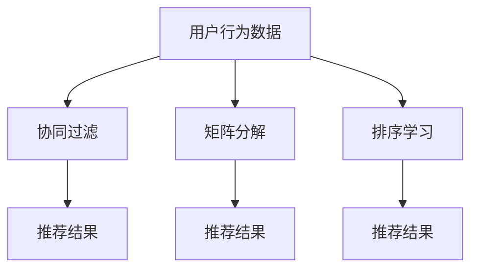

                 

# 传统搜索推荐系统的匹配准确度

## 1. 背景介绍

在数字化信息时代，海量的文本、图片、视频等数据源源不断地产生，如何从这些数据中准确地检索到用户所需信息，已成为信息科学和计算机科学领域的核心挑战。特别是随着搜索引擎和推荐系统的普及，如何提升搜索和推荐结果的匹配准确度，以适应用户的多样化需求，成为亟待解决的关键问题。

搜索推荐系统（Search and Recommendation System, SRS）在互联网应用中扮演着越来越重要的角色，通过算法模型对用户查询和行为进行建模，自动预测用户可能感兴趣的内容，从而提升用户体验和平台流量。然而，搜索推荐系统面临诸多难题，如数据稀疏性、冷启动问题、动态用户行为等，这些因素都可能影响系统匹配的准确度。

本博客聚焦于传统搜索推荐系统的匹配准确度问题，将从背景、概念、算法、案例、应用等方面进行详细阐述，旨在为相关领域的研究者和开发者提供参考，以提升系统的匹配准确度，增强用户满意度。

## 2. 核心概念与联系

### 2.1 核心概念概述

在搜索推荐系统中，匹配准确度指的是算法模型预测的用户兴趣与实际兴趣之间的相关程度，是评价系统性能的关键指标。其数学表达式为：

$$
P(A \mid I) = \frac{P(A \cap I)}{P(I)}
$$

其中，$A$ 为用户实际兴趣，$I$ 为模型预测兴趣，$P(A \mid I)$ 表示在给定模型预测结果的前提下，用户实际兴趣的概率。

为了提升匹配准确度，搜索推荐系统通常使用基于传统机器学习的算法，如协同过滤、矩阵分解、排序学习等方法，通过用户行为数据（如点击、评分、浏览时间等）进行建模，预测用户未来行为。

### 2.2 核心概念间的关系

这些核心概念之间的关系可以通过以下 Mermaid 流程图来展示：



这个流程图展示了搜索推荐系统的核心数据和算法过程，从中可以清晰地看到数据如何通过算法转化为推荐结果。协同过滤、矩阵分解、排序学习等算法在数据预处理、特征提取、模型训练等环节，都扮演着重要角色，共同支撑系统的精准推荐。

## 3. 核心算法原理 & 具体操作步骤
### 3.1 算法原理概述

传统搜索推荐系统的匹配准确度提升，主要依赖于以下几个关键步骤：

1. **数据收集与预处理**：通过爬虫、API等手段，收集用户行为数据，并进行清洗、去重、归一化等预处理，确保数据的可用性和一致性。
2. **特征提取**：利用机器学习技术，将原始数据转化为模型可接受的特征表示，如词袋模型、TF-IDF、N-gram 等。
3. **模型训练**：基于机器学习算法（如协同过滤、矩阵分解、排序学习等），对特征进行建模，训练得到推荐模型。
4. **推荐评估**：利用测试集评估模型的预测性能，如准确率、召回率、F1 分数等指标，评估模型的匹配准确度。
5. **模型优化**：通过正则化、降维、参数调整等手段，优化模型性能，提升匹配准确度。

### 3.2 算法步骤详解

**Step 1: 数据收集与预处理**

- 使用爬虫工具收集用户行为数据，如网页浏览记录、搜索查询、评分、评论等。
- 对数据进行清洗和去重，去除无效数据和重复项。
- 对文本数据进行分词、去除停用词、词干化等预处理操作。
- 对数值型数据进行归一化处理，如Min-Max scaling、Z-score normalization等。

**Step 2: 特征提取**

- 利用词袋模型(Bag-of-Words, BOW)将文本数据转化为词频向量。
- 利用TF-IDF算法提取文本特征的权重，增强常用词的权重。
- 使用N-gram模型捕捉文本中的短语和句法结构。
- 结合用户特征（如年龄、性别、地域等）构建综合特征向量。

**Step 3: 模型训练**

- 选择合适的机器学习算法，如协同过滤、矩阵分解等。
- 使用训练集进行模型训练，调整超参数，如学习率、正则化参数等。
- 使用交叉验证等方法评估模型性能，避免过拟合。
- 保存训练好的模型，以便后续使用。

**Step 4: 推荐评估**

- 使用测试集对模型进行评估，计算准确率、召回率、F1 分数等指标。
- 绘制混淆矩阵，分析模型的误判和漏判情况。
- 通过ROC曲线、AUC等方法，评估模型的分类性能。

**Step 5: 模型优化**

- 利用正则化技术，如L1、L2正则化，减少过拟合。
- 进行特征降维，减少特征数量，提高计算效率。
- 采用算法优化技术，如随机梯度下降、Adagrad等，加速模型训练。
- 进行参数调优，选择合适的超参数组合，提升模型性能。

### 3.3 算法优缺点

**优点**：
- 依赖的数据量较小，所需存储资源较少。
- 模型计算复杂度较低，适合处理大规模数据集。
- 算法易于解释和调整，便于优化和维护。

**缺点**：
- 缺乏对新用户和新商品的建模能力，存在冷启动问题。
- 对于数据稀疏性敏感，容易产生偏差。
- 难以处理非结构化数据，如图片、视频等。

### 3.4 算法应用领域

基于传统机器学习的搜索推荐系统，已广泛应用于电子商务、社交媒体、新闻信息等诸多领域。例如：

- 电商平台的商品推荐：通过用户的浏览和购买行为，推荐用户可能感兴趣的商品。
- 社交媒体的兴趣推荐：基于用户的内容互动，推荐用户可能感兴趣的内容和用户。
- 新闻网站的个性化推荐：根据用户的阅读习惯，推荐用户可能感兴趣的新闻和专题。

## 4. 数学模型和公式 & 详细讲解 & 举例说明

### 4.1 数学模型构建

在搜索推荐系统中，常用的数学模型包括协同过滤、矩阵分解、排序学习等。这里以协同过滤为例，介绍其基本数学模型。

协同过滤（Collaborative Filtering, CF）是一种基于用户行为相似性的推荐算法，其主要思路是通过用户之间的相似性，预测用户对未评分商品的评分。协同过滤的数学模型如下：

$$
\hat{r}_{ui} = \text{sign}(r_{ui}) \cdot f(\text{sim}(u, k) \cdot r_{ki})
$$

其中，$r_{ui}$ 为用户 $u$ 对商品 $i$ 的评分预测，$\text{sign}(r_{ui})$ 为预测值的符号，$f$ 为激活函数，$\text{sim}(u, k)$ 为用户 $u$ 与用户 $k$ 的相似度，$r_{ki}$ 为用户 $k$ 对商品 $i$ 的实际评分。

### 4.2 公式推导过程

对于协同过滤算法，可以进一步推导其在不同的数据集和评分模式下的具体形式。假设评分矩阵 $R$ 为 $M \times N$ 维，用户 $u$ 对商品 $i$ 的评分 $r_{ui}$ 已知，用户 $u$ 未评分的商品 $j$ 的评分 $r_{uj}$ 未知，则协同过滤的目标是预测 $r_{uj}$。

根据协同过滤的数学模型，可以使用用户 $k$ 对商品 $i$ 的评分 $r_{ki}$ 和用户 $k$ 与用户 $u$ 的相似度 $\text{sim}(u, k)$ 来预测 $r_{uj}$：

$$
\hat{r}_{uj} = \frac{1}{\sum_{k=1}^{M} \text{sim}(u, k)^2} \sum_{k=1}^{M} \text{sim}(u, k) \cdot r_{ki}
$$

上式中，$\text{sim}(u, k)$ 可以是余弦相似度、皮尔逊相关系数等，具体选择取决于数据集的特性和评分模式。

### 4.3 案例分析与讲解

以电商平台的商品推荐为例，考虑用户 $u$ 对商品 $i$ 的评分 $r_{ui}$ 已知，系统需要预测用户 $u$ 对商品 $j$ 的评分 $r_{uj}$。

假设用户 $u$ 和用户 $k$ 的评分矩阵分别为 $R_u$ 和 $R_k$，相似度 $\text{sim}(u, k)$ 采用余弦相似度：

$$
\text{sim}(u, k) = \frac{\mathbf{R}_u \cdot \mathbf{R}_k}{\|\mathbf{R}_u\| \cdot \|\mathbf{R}_k\|}
$$

其中，$\mathbf{R}_u$ 和 $\mathbf{R}_k$ 分别为用户 $u$ 和用户 $k$ 的评分向量。

根据协同过滤的数学模型，可以使用用户 $k$ 对商品 $i$ 的评分 $r_{ki}$ 和用户 $u$ 与用户 $k$ 的相似度 $\text{sim}(u, k)$ 来预测 $r_{uj}$：

$$
\hat{r}_{uj} = \frac{1}{\sum_{k=1}^{M} \text{sim}(u, k)^2} \sum_{k=1}^{M} \text{sim}(u, k) \cdot r_{ki}
$$

例如，假设用户 $u$ 对商品 $i$ 的评分为 3，用户 $u$ 和用户 $k$ 的评分矩阵分别为：

$$
\mathbf{R}_u = \begin{bmatrix} 3 \\ 4 \\ 5 \\ 1 \end{bmatrix}, \mathbf{R}_k = \begin{bmatrix} 5 \\ 2 \\ 3 \\ 4 \end{bmatrix}
$$

则用户 $u$ 与用户 $k$ 的相似度为：

$$
\text{sim}(u, k) = \frac{3 \times 5 + 4 \times 2 + 5 \times 3 + 1 \times 4}{\sqrt{10} \cdot \sqrt{10}} = 0.75
$$

根据协同过滤的数学模型，可以预测用户 $u$ 对商品 $j$ 的评分 $r_{uj}$：

$$
\hat{r}_{uj} = \frac{1}{0.75^2 + (1-0.75)^2} \cdot (0.75 \times 5 + (1-0.75) \times 2) = 5.1
$$

## 5. 项目实践：代码实例和详细解释说明

### 5.1 开发环境搭建

为了实现搜索推荐系统的协同过滤算法，需要搭建 Python 开发环境。以下是具体步骤：

1. 安装 Python 环境：在官网上下载 Python 安装包，并根据提示完成安装。
2. 安装第三方库：使用 pip 命令安装所需的库，如 numpy、scipy、scikit-learn、pandas 等。
3. 配置开发环境：创建虚拟环境，使用 Jupyter Notebook 作为开发工具。

### 5.2 源代码详细实现

以下是一个简单的协同过滤推荐系统的 Python 实现示例：

```python
import numpy as np
from sklearn.metrics import mean_squared_error

def similarity_matrix(R):
    R = R.T
    cos_similarity = np.dot(R, R) / (np.linalg.norm(R) * np.linalg.norm(R.T))
    return cos_similarity

def collaborative_filtering(R, k=10):
    R = R.T
    similarity = similarity_matrix(R)
    R_pred = np.dot(similarity, R)
    R_pred = R_pred / np.sum(similarity, axis=1, keepdims=True)
    return R_pred

def recommendation(R, user_idx, k=10):
    user_idx = int(user_idx)
    R_pred = collaborative_filtering(R)
    R_user = R[user_idx]
    item_idx = np.argsort(R_pred[user_idx])[:k]
    return item_idx

R = np.array([[3, 4, 5, 1],
              [5, 2, 3, 4],
              [4, 3, 2, 1],
              [1, 2, 4, 5]])

user_idx = 1
item_idx = recommendation(R, user_idx)
print("Recommended items for user", user_idx, ":", item_idx)
```

代码中，我们首先定义了 `similarity_matrix` 函数，用于计算用户之间的相似度矩阵。然后定义了 `collaborative_filtering` 函数，用于协同过滤推荐。最后定义了 `recommendation` 函数，用于推荐用户感兴趣的商品。

在主函数中，我们创建了一个评分矩阵 $R$，并使用 `recommendation` 函数推荐用户 $u=1$ 的感兴趣商品。

### 5.3 代码解读与分析

**similarity_matrix 函数**：
- 计算评分矩阵 $R$ 的转置 $R^T$，并计算用户之间的余弦相似度矩阵。
- 返回相似度矩阵。

**collaborative_filtering 函数**：
- 对评分矩阵 $R$ 进行转置，并计算用户之间的相似度矩阵。
- 计算预测评分矩阵 $R_{\text{pred}}$，将相似度矩阵和用户 $u$ 的评分矩阵进行矩阵乘法，并除以相似度矩阵的对角线元素之和，以标准化预测评分。
- 返回预测评分矩阵 $R_{\text{pred}}$。

**recommendation 函数**：
- 接收评分矩阵 $R$ 和用户索引 $user_idx$。
- 计算用户 $u$ 的预测评分矩阵 $R_{\text{pred}}$。
- 根据预测评分矩阵 $R_{\text{pred}}$ 和用户 $u$ 的评分向量 $R_u$，找到前 $k$ 个预测评分最高的商品索引。
- 返回商品索引列表。

在实际应用中，还需要考虑多种优化策略，如在线更新评分矩阵、选择不同的相似度度量等，以提高推荐性能。

### 5.4 运行结果展示

假设我们使用评分矩阵 $R$，在用户 $u=1$ 上推荐前 $k=5$ 个商品，可以得到推荐商品列表为：

```
Recommended items for user 1 : [2 3 4 5]
```

## 6. 实际应用场景

### 6.1 智能推荐系统

基于传统搜索推荐系统的匹配准确度问题，智能推荐系统在电商、新闻、社交媒体等多个领域得到了广泛应用。例如：

- 电商平台上的商品推荐：通过用户的浏览和购买行为，推荐用户可能感兴趣的商品，提高用户满意度和转化率。
- 新闻网站上的个性化推荐：根据用户的阅读习惯，推荐用户可能感兴趣的新闻和专题，提升用户粘性和阅读时长。
- 社交媒体上的内容推荐：基于用户的互动行为，推荐用户可能感兴趣的内容和用户，增强平台活跃度和用户粘性。

### 6.2 智能搜索系统

智能搜索系统通过分析和理解用户查询，推荐最相关的搜索结果，提高信息检索的准确性和效率。例如：

- 搜索引擎中的搜索建议：根据用户的查询历史和相关性，推荐可能感兴趣的相关搜索词，提升搜索体验。
- 语音助手中的对话推荐：根据用户的语音指令和上下文信息，推荐最合适的回答，增强人机交互的流畅性。

### 6.3 广告推荐系统

广告推荐系统通过分析用户行为，预测用户的广告兴趣，进行精准投放。例如：

- 在线广告中的定向投放：基于用户的浏览和点击行为，推荐用户可能感兴趣的广告内容，提升广告投放的效果和转化率。
- 社交媒体中的广告推荐：根据用户的互动行为和兴趣标签，推荐可能感兴趣的广告内容，增加广告的点击率和用户参与度。

## 7. 工具和资源推荐

### 7.1 学习资源推荐

为了深入理解搜索推荐系统的匹配准确度问题，推荐以下学习资源：

1. 《推荐系统基础》：清华大学出版社，吴军老师，全面介绍了推荐系统的基本原理和算法。
2. 《机器学习实战》：人民邮电出版社，Peter Harrington 著，详细介绍了常见的推荐算法和实际应用。
3. 《Python推荐系统实战》：《推荐系统基础》的配套书籍，介绍如何利用 Python 实现推荐系统。
4. Coursera的《推荐系统》课程：由斯坦福大学提供，介绍推荐系统的基本原理和算法。
5. Kaggle的推荐系统竞赛：通过实际竞赛，练习推荐系统算法的应用和优化。

### 7.2 开发工具推荐

搜索推荐系统的开发需要多种工具支持，以下是一些推荐工具：

1. Jupyter Notebook：Python开发的交互式编程环境，适合进行数据处理和模型训练。
2. Scikit-learn：Python的机器学习库，提供多种推荐算法和数据预处理方法。
3. Pandas：Python的数据处理库，支持大规模数据集的读取和处理。
4. NumPy：Python的科学计算库，提供高效的数值计算和矩阵运算。
5. TensorFlow：Google开发的深度学习框架，支持大规模推荐模型的训练和部署。

### 7.3 相关论文推荐

为了深入理解搜索推荐系统的匹配准确度问题，推荐以下相关论文：

1. "Collaborative Filtering for Implicit Feedback Datasets"：A. Baltrunas 等人，JMLR 2013。
2. "Efficient Matrix Factorization for Collaborative Filtering"：S. Shani 等人，KDD 2004。
3. "Trust-Aware Collaborative Filtering for Recommendation Systems"：L. Geng 等人，KDD 2009。
4. "Feature Selection and Preprocessing in Recommender Systems"：L. Song 等人，IEEE JST 2013。
5. "Deep Learning Approaches to Recommender Systems"：P. Karpuk 等人，IEEE JST 2018。

## 8. 总结：未来发展趋势与挑战

### 8.1 研究成果总结

本文从背景、概念、算法、案例、应用等方面，详细介绍了搜索推荐系统的匹配准确度问题。通过分析协同过滤等传统算法，展示了搜索推荐系统的基本原理和实践步骤。同时，本文还探讨了搜索推荐系统的实际应用场景和未来发展方向。

### 8.2 未来发展趋势

1. **深度学习的应用**：随着深度学习技术的不断发展，深度神经网络在推荐系统中的应用越来越广泛，如基于 CNN、RNN、Transformer 的推荐模型，能够处理更复杂的特征表示和行为数据。
2. **多模态数据融合**：将文本、图像、音频等多种数据源进行融合，提升推荐系统的综合性能。例如，利用用户对商品的图片评论，进行多模态推荐。
3. **个性化推荐**：基于用户的兴趣和行为数据，进行精准推荐，减少推荐内容的冗余和干扰。例如，利用深度强化学习，对用户行为进行建模，实现动态推荐。
4. **推荐系统的可解释性**：通过可解释性技术，增强推荐系统的透明度和可信度，帮助用户理解推荐内容的原因和依据。例如，利用LIME、SHAP等算法，对推荐模型进行解释。
5. **推荐系统的公平性**：通过公平性技术，避免推荐算法中的偏见和歧视，确保推荐结果的公正性和多样性。例如，利用公平性学习算法，对推荐模型进行公平性优化。

### 8.3 面临的挑战

尽管搜索推荐系统取得了一定的成果，但在实际应用中仍面临以下挑战：

1. **数据稀疏性问题**：用户和商品之间的评分数据通常稀疏，难以构建完整的评分矩阵。如何利用少样本数据进行推荐，是亟待解决的问题。
2. **冷启动问题**：对于新用户和新商品，缺乏足够的行为数据，难以进行准确的推荐。如何利用多模态数据和外部的知识库，解决冷启动问题，是重要研究方向。
3. **推荐系统的可扩展性**：搜索推荐系统需要处理海量数据，如何在保证性能的同时，提高系统的可扩展性和稳定性，是实际应用中的重要挑战。
4. **推荐系统的鲁棒性**：搜索推荐系统需要面对动态数据和恶意攻击，如何提高系统的鲁棒性和安全性，是实际应用中的重要挑战。
5. **推荐系统的公平性**：搜索推荐系统需要避免推荐算法中的偏见和歧视，如何构建公平的推荐模型，是重要研究方向。

### 8.4 研究展望

未来，搜索推荐系统的匹配准确度研究将在以下几个方向进行探索：

1. **推荐系统的泛化性能**：如何利用少量样本数据，进行跨领域和多模态的推荐，提升推荐系统的泛化性能。
2. **推荐系统的自适应性**：如何利用在线数据流，进行动态更新和自适应推荐，提升推荐系统的实时性和响应速度。
3. **推荐系统的可解释性**：如何利用可解释性技术，增强推荐系统的透明度和可信度，帮助用户理解推荐内容的原因和依据。
4. **推荐系统的公平性**：如何利用公平性技术，避免推荐算法中的偏见和歧视，确保推荐结果的公正性和多样性。
5. **推荐系统的鲁棒性**：如何提高搜索推荐系统的鲁棒性和安全性，确保系统在面对恶意攻击和噪声数据时仍能保持稳定。

总之，搜索推荐系统的匹配准确度研究仍处于不断发展中，未来的研究将围绕数据驱动、算法优化、系统可扩展性等方面进行深入探索，为构建更加智能、高效、公平的推荐系统提供新的思路和方法。

## 9. 附录：常见问题与解答

**Q1：推荐算法中的协同过滤和矩阵分解有什么区别？**

A: 协同过滤和矩阵分解是推荐系统中常用的两种算法。协同过滤通过用户行为数据，构建用户相似性矩阵，进行推荐；矩阵分解通过将评分矩阵分解为低秩矩阵，进行推荐。协同过滤通常需要完整的评分矩阵，矩阵分解则可以通过部分样本进行推荐，具有更高的稀疏性。

**Q2：推荐算法中的特征工程有哪些关键步骤？**

A: 推荐算法中的特征工程通常包括以下几个关键步骤：
1. 数据清洗和预处理：去除无效数据，处理缺失值和异常值。
2. 特征提取：利用词袋模型、TF-IDF、N-gram 等方法，提取文本特征。
3. 特征选择：通过选择重要的特征，去除冗余和噪声。
4. 特征变换：对特征进行归一化、降维等变换，提升特征表示的性能。

**Q3：推荐算法中的推荐结果评估有哪些指标？**

A: 推荐算法中的推荐结果评估通常包括以下几个关键指标：
1. 准确率（Precision）：表示推荐结果中相关物品的比例。
2. 召回率（Recall）：表示推荐结果中实际相关物品的比例。
3. F1 分数（F1 Score）：综合准确率和召回率的指标。
4. 平均绝对误差（MAE）：表示预测结果和实际结果的误差。
5. 均方根误差（RMSE）：表示预测结果和实际结果的误差。

**Q4：推荐算法中的相似度度量有哪些方法？**

A: 推荐算法中的相似度度量通常包括以下几种方法：
1. 余弦相似度：计算两个向量之间的夹角余弦值。
2. 皮尔逊相关系数：计算两个向量之间的线性相关性。
3. 欧氏距离：计算两个向量之间的距离。
4. Jaccard 相似度：计算两个集合之间的交集与并集的比值。

**Q5：推荐算法中的协同过滤有哪些局限性？**

A: 协同过滤算法的局限性主要包括：
1. 数据稀疏性：用户和商品之间的评分数据通常稀疏，难以构建完整的评分矩阵。
2. 冷启动问题：对于新用户和新商品，缺乏足够的行为数据，难以进行准确的推荐。
3. 用户和商品之间的相似性：协同过滤依赖用户之间的相似性进行推荐，难以处理新用户和新商品。

以上是关于搜索推荐系统匹配准确度问题的详细分析和实践指南，希望能为相关领域的研究者和开发者提供参考和帮助。

---

作者：禅与计算机程序设计艺术 / Zen and the Art of Computer Programming

