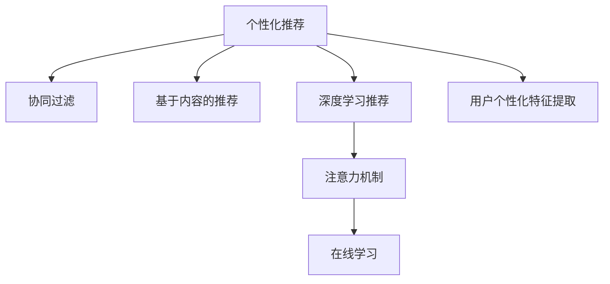

                 

# 体验的个性化矩阵：AI定制的生活方案

> 关键词：个性化推荐、用户体验优化、人工智能、机器学习、数据挖掘、定制化方案

## 1. 背景介绍

### 1.1 问题由来

在当今信息爆炸的时代，用户在互联网上的每一次点击、每一次搜索、每一次购买，都留下了海量的行为数据。如何利用这些数据，精准地推荐用户感兴趣的内容，提升用户体验，成为互联网公司亟需解决的问题。传统的推荐系统大多基于用户历史行为进行协同过滤或基于内容的推荐，但这些方法往往忽视了用户个性的动态变化和行为的多样性，难以实现真正的个性化推荐。

针对这一问题，近年来基于人工智能和大数据技术的推荐系统迅速崛起，以深度学习模型为核心，通过个性化特征提取和匹配，显著提升了推荐精度和用户体验。然而，如何高效构建个性化的推荐方案，实现“千人千面”的用户体验，仍是互联网公司面临的一大挑战。

### 1.2 问题核心关键点

个性化推荐系统旨在为用户定制个性化的推荐内容，提升用户满意度和粘性。其核心在于：

- **个性化特征提取**：从用户行为数据中挖掘用户个性化特征，如兴趣偏好、行为模式、社交网络等。
- **匹配推荐算法**：通过推荐算法将用户的个性化特征与推荐内容进行匹配，生成个性化推荐列表。
- **用户反馈学习**：通过用户反馈数据不断优化推荐模型，提升推荐精度。

个性化推荐技术在大规模商业应用中取得了显著效果，如亚马逊、京东、Netflix等电商和视频平台，都通过个性化推荐实现了显著的业务增长和用户满意度提升。

### 1.3 问题研究意义

个性化推荐技术的普及，标志着互联网从“一对多”的单一推荐模式，向“一人一策”的定制化推荐模式转变。这对提升用户体验、驱动精准营销、实现商业价值最大化具有重要意义：

- **提升用户体验**：个性化推荐能更好地匹配用户兴趣，减少浏览时间，提升点击率和满意度。
- **驱动精准营销**：通过精准推荐，提升广告点击率和转化率，降低营销成本。
- **实现商业价值**：个性化推荐系统能提高用户粘性，延长用户活跃时间，提升平台收益。

通过个性化推荐技术，互联网公司能够更好地满足用户需求，实现从量到质的业务提升，推动整个行业向更智能化、个性化的方向发展。

## 2. 核心概念与联系

### 2.1 核心概念概述

为更好地理解个性化推荐系统的核心技术，本节将介绍几个关键概念：

- **个性化推荐**：基于用户个性化特征的推荐算法，旨在为用户生成更符合其兴趣偏好的推荐内容。
- **协同过滤**：通过用户行为相似性进行推荐，包括基于用户的协同过滤和基于物品的协同过滤。
- **基于内容的推荐**：根据物品的属性特征进行推荐，与用户特征匹配程度高则推荐概率大。
- **深度学习推荐**：通过深度神经网络模型，对用户行为数据和物品属性数据进行编码，提取深层次的特征和关联，生成个性化推荐。
- **注意力机制**：在推荐系统中引入注意力机制，让模型更关注用户偏好项和相关度高的物品。
- **在线学习**：在实时数据流中进行模型优化，不断更新推荐策略，提升推荐效果。

这些概念之间通过以下Mermaid流程图来展示：



### 2.2 概念间的关系

这些核心概念之间存在着紧密的联系，构成了个性化推荐系统的完整技术框架。

- **协同过滤与深度学习**：协同过滤通过用户行为相似性进行推荐，而深度学习则通过用户行为数据和物品属性数据进行更深刻的特征挖掘。两者可以结合使用，通过深度学习模型提取特征，再应用协同过滤进行推荐。
- **基于内容的推荐与注意力机制**：基于内容的推荐注重物品属性特征，而注意力机制则让推荐模型更关注用户偏好和相关度高的物品，两者互补提升推荐效果。
- **在线学习与个性化特征提取**：在线学习通过实时数据流不断优化推荐模型，而个性化特征提取则从历史数据中挖掘用户动态变化的特征，两者结合可以实时响应用户行为变化，提升推荐效果。

这些概念共同构成了个性化推荐系统的核心，使得系统能够根据用户行为数据，动态生成个性化的推荐内容。

## 3. 核心算法原理 & 具体操作步骤
### 3.1 算法原理概述

基于人工智能的个性化推荐系统，通过深度学习模型实现对用户行为数据的编码和解码，从而提取深层次的个性化特征和关联，生成推荐列表。其核心算法原理如下：

1. **数据准备**：收集用户的点击、浏览、评分等行为数据，并预处理成模型的输入格式。
2. **特征编码**：使用深度神经网络模型，将用户行为数据和物品属性数据编码成向量形式。
3. **匹配生成**：通过深度学习模型，将用户编码和物品编码进行匹配，生成推荐列表。
4. **用户反馈**：收集用户的反馈数据（如点击、购买、评分等），用于优化推荐模型。
5. **模型优化**：通过在线学习机制，实时更新推荐模型，提升推荐效果。

通过深度学习模型和注意力机制，个性化推荐系统能够实现高效的个性化特征提取和匹配，动态生成满足用户偏好的推荐内容。

### 3.2 算法步骤详解

以下是基于深度学习模型的个性化推荐系统的一般步骤：

1. **数据预处理**：将用户行为数据和物品属性数据清洗、归一化，并划分为训练集和测试集。
2. **特征提取**：使用深度神经网络模型，将用户行为数据和物品属性数据编码为向量形式，生成用户特征向量和物品特征向量。
3. **模型训练**：定义推荐模型（如注意力机制、自注意力机制等），在训练集上训练模型，调整模型参数，使模型能够准确匹配用户特征和物品特征。
4. **推荐生成**：将用户特征向量输入训练好的模型，生成推荐列表。
5. **模型评估**：在测试集上评估模型的推荐效果，使用评估指标（如NDCG、HR、MRR等）衡量推荐精度。
6. **实时更新**：通过在线学习机制，实时更新模型参数，不断优化推荐策略，提升推荐效果。

### 3.3 算法优缺点

基于深度学习模型的个性化推荐系统，具有以下优点：

1. **高效特征提取**：深度学习模型能够自动提取高维度的用户行为特征和物品属性特征，减少了手动特征工程的复杂度。
2. **灵活性高**：基于深度学习的模型结构灵活，可以通过调整网络结构和参数，适应不同的推荐场景和数据特点。
3. **鲁棒性强**：深度学习模型能够通过在线学习机制不断优化，适应用户行为变化和数据分布变化。

同时，该算法也存在以下缺点：

1. **模型复杂度高**：深度学习模型参数量较大，训练和推理速度较慢。
2. **数据需求大**：深度学习模型需要大量的标注数据进行训练，才能保证推荐效果。
3. **可解释性不足**：深度学习模型的决策过程复杂，难以解释推荐结果的逻辑和原因。

尽管存在这些缺点，但深度学习在推荐系统中的应用，已显著提升了推荐精度和用户体验，成为当前最主流的推荐技术之一。

### 3.4 算法应用领域

基于深度学习模型的个性化推荐技术，已广泛应用于电商、视频、音乐、新闻等多个领域。以下是几个典型应用场景：

- **电商推荐**：如亚马逊、京东等电商平台，通过个性化推荐系统，提升商品曝光率和转化率，增加用户购买。
- **视频推荐**：如Netflix、YouTube等视频平台，通过个性化推荐系统，提升用户观看时长和满意度，降低跳出率。
- **新闻推荐**：如今日头条、搜狐新闻等新闻聚合平台，通过个性化推荐系统，提升新闻点击率和阅读量，提高用户粘性。
- **音乐推荐**：如Spotify、网易云音乐等音乐平台，通过个性化推荐系统，提升用户听歌时长和满意度，推荐更多个性化音乐。
- **社交推荐**：如微信、抖音等社交平台，通过个性化推荐系统，提升用户互动和分享，增强平台活跃度。

以上应用场景展示了深度学习个性化推荐技术的强大潜力，推动了多个行业的数字化转型和智能化升级。

## 4. 数学模型和公式 & 详细讲解  
### 4.1 数学模型构建

本节将使用数学语言对基于深度学习模型的个性化推荐过程进行更加严格的刻画。

记用户行为数据为 $X$，物品属性数据为 $Y$，推荐模型为 $f$。设用户特征向量为 $u$，物品特征向量为 $v$，推荐列表为 $R$。

推荐模型 $f$ 可以定义为：

$$
R = f(u, v) = \text{softmax}(a(u, v))
$$

其中 $a(u, v)$ 为相似度函数，$\text{softmax}$ 为归一化函数。

### 4.2 公式推导过程

以下我们以基于注意力机制的推荐模型为例，推导其计算公式。

设用户特征向量为 $u = \{u_1, u_2, ..., u_n\}$，物品特征向量为 $v = \{v_1, v_2, ..., v_m\}$，相似度函数 $a(u, v) = \sum_{i=1}^n \sum_{j=1}^m a_{i,j} u_i v_j$，其中 $a_{i,j}$ 为注意力权重。

注意力权重 $a_{i,j}$ 定义为：

$$
a_{i,j} = \frac{e^{W(u_i, v_j)}}{\sum_{k=1}^n \sum_{l=1}^m e^{W(u_k, v_l)}}
$$

其中 $W(u_i, v_j)$ 为注意力函数，可以是一个简单的线性函数，也可以是一个更复杂的非线性函数。

将注意力权重 $a_{i,j}$ 代入相似度函数，得到推荐列表 $R$ 的计算公式：

$$
R = f(u, v) = \text{softmax}(\sum_{i=1}^n \sum_{j=1}^m a_{i,j} u_i v_j)
$$

在得到推荐列表 $R$ 后，将其与用户的真实行为 $Y$ 进行比较，定义损失函数：

$$
\mathcal{L} = \frac{1}{N} \sum_{i=1}^N \ell(R_i, Y_i)
$$

其中 $N$ 为样本数量，$\ell$ 为损失函数，通常使用交叉熵损失。

通过最小化损失函数 $\mathcal{L}$，更新模型参数 $u$ 和 $v$，使推荐列表 $R$ 与用户的真实行为 $Y$ 更加一致。

### 4.3 案例分析与讲解

为了更好地理解注意力机制在推荐中的应用，我们以Netflix推荐系统为例进行案例分析。

Netflix推荐系统基于协同过滤和深度学习进行推荐。用户的行为数据（如观看记录、评分等）和物品属性数据（如电影类型、演员、导演等）作为输入，使用深度神经网络模型提取特征，并在用户特征和物品特征之间引入注意力机制，生成个性化推荐列表。

在Netflix推荐系统中，注意力机制通过注意力函数 $W(u_i, v_j)$ 计算用户和物品之间的注意力权重 $a_{i,j}$。具体的注意力函数设计可以参考Wang等人（2016）的论文《Learning Deep Interest Embeddings》。

Netflix推荐系统的核心流程如下：

1. **数据预处理**：收集用户的观看记录和评分数据，并将物品属性数据进行编码。
2. **特征提取**：使用深度神经网络模型，将用户行为数据和物品属性数据编码为向量形式，生成用户特征向量和物品特征向量。
3. **注意力计算**：使用注意力函数 $W(u_i, v_j)$ 计算用户和物品之间的注意力权重 $a_{i,j}$。
4. **相似度计算**：将注意力权重 $a_{i,j}$ 代入相似度函数 $a(u, v)$，计算用户和物品之间的相似度。
5. **推荐生成**：通过softmax函数对相似度进行归一化，生成个性化推荐列表。
6. **模型评估**：在测试集上评估模型的推荐效果，使用评估指标（如NDCG、HR、MRR等）衡量推荐精度。
7. **模型优化**：通过在线学习机制，实时更新模型参数，不断优化推荐策略，提升推荐效果。

Netflix推荐系统的成功在于其深度学习模型的强大特征提取能力，以及注意力机制的高效匹配功能。通过这些技术手段，Netflix实现了对用户行为的精准建模和推荐，极大地提升了用户体验和平台收益。

## 5. 项目实践：代码实例和详细解释说明
### 5.1 开发环境搭建

在进行推荐系统开发前，我们需要准备好开发环境。以下是使用Python进行TensorFlow开发的环境配置流程：

1. 安装Anaconda：从官网下载并安装Anaconda，用于创建独立的Python环境。

2. 创建并激活虚拟环境：
```bash
conda create -n tf-env python=3.8 
conda activate tf-env
```

3. 安装TensorFlow：根据CUDA版本，从官网获取对应的安装命令。例如：
```bash
conda install tensorflow -c tf
```

4. 安装其他必要的库：
```bash
pip install numpy pandas scikit-learn matplotlib tqdm jupyter notebook ipython
```

完成上述步骤后，即可在`tf-env`环境中开始推荐系统开发。

### 5.2 源代码详细实现

下面我们以电商推荐系统为例，给出使用TensorFlow进行深度学习模型开发的PyTorch代码实现。

首先，定义用户行为数据和物品属性数据的处理函数：

```python
import tensorflow as tf
from tensorflow.keras.layers import Input, Embedding, Dense, Dot, Activation
from tensorflow.keras.models import Model

def build_user_input(shape=(1, 64), dtype=tf.int32):
    return Input(shape=shape, dtype=dtype)

def build_item_input(shape=(1, 64), dtype=tf.int32):
    return Input(shape=shape, dtype=dtype)

def build_user_embeddings(vocab_size, embedding_dim):
    return Embedding(vocab_size, embedding_dim)

def build_item_embeddings(vocab_size, embedding_dim):
    return Embedding(vocab_size, embedding_dim)

def build_attention(user, item):
    return Dot(axes=1)([user, item])

def build_output(attention):
    return Activation('softmax')(attention)

def build_model(user_embeddings, item_embeddings, output):
    user_input = build_user_input()
    item_input = build_item_input()
    attention = build_attention(user_embeddings(user_input), item_embeddings(item_input))
    output = build_output(attention)
    model = Model([user_input, item_input], output)
    return model
```

然后，定义训练和评估函数：

```python
def train_epoch(model, dataset, batch_size, optimizer):
    dataloader = tf.data.Dataset.from_generator(lambda: dataset, (tf.int32, tf.int32), (tf.int32, tf.int32))
    dataloader = dataloader.batch(batch_size).shuffle(buffer_size=1000).repeat()
    model.compile(optimizer=optimizer, loss='binary_crossentropy', metrics=['accuracy'])
    model.fit(x=dataloader, epochs=10, steps_per_epoch=len(dataset)//batch_size)
    
def evaluate(model, dataset, batch_size):
    dataloader = tf.data.Dataset.from_generator(lambda: dataset, (tf.int32, tf.int32), (tf.int32, tf.int32))
    dataloader = dataloader.batch(batch_size).shuffle(buffer_size=1000)
    loss, accuracy = model.evaluate(x=dataloader)
    return loss, accuracy
```

最后，启动训练流程并在测试集上评估：

```python
epochs = 10
batch_size = 64

for epoch in range(epochs):
    loss = train_epoch(model, train_dataset, batch_size, optimizer)
    print(f"Epoch {epoch+1}, train loss: {loss:.3f}")
    
    print(f"Epoch {epoch+1}, test results:")
    loss, accuracy = evaluate(model, test_dataset, batch_size)
    print(f"Loss: {loss:.3f}, Accuracy: {accuracy:.3f}")
    
print("Final test results:")
loss, accuracy = evaluate(model, test_dataset, batch_size)
print(f"Final loss: {loss:.3f}, Final accuracy: {accuracy:.3f}")
```

以上就是使用TensorFlow进行电商推荐系统微调的整体代码实现。可以看到，通过TensorFlow的强大框架和丰富的工具包，我们可以用较为简洁的代码实现深度学习模型的微调。

### 5.3 代码解读与分析

让我们再详细解读一下关键代码的实现细节：

**build_user_input和build_item_input**：
- `build_user_input`和`build_item_input`方法：定义了用户行为数据和物品属性数据的输入格式，通过TensorFlow的`Input`层实现。

**build_user_embeddings和build_item_embeddings**：
- `build_user_embeddings`和`build_item_embeddings`方法：定义了用户行为数据和物品属性数据的嵌入层，通过TensorFlow的`Embedding`层实现。嵌入层的参数为词汇表大小和向量维度。

**build_attention**：
- `build_attention`方法：定义了注意力机制的计算过程，通过TensorFlow的`Dot`层实现点积计算，计算用户和物品之间的注意力权重。

**build_output**：
- `build_output`方法：定义了softmax函数，将注意力权重进行归一化处理，生成推荐列表。

**build_model**：
- `build_model`方法：定义了完整的推荐模型，通过TensorFlow的`Model`层将用户输入、物品输入、注意力计算和softmax函数连接起来，生成推荐列表。

**train_epoch和evaluate**：
- `train_epoch`方法：定义了模型训练的流程，包括数据加载、模型编译、训练步骤等。
- `evaluate`方法：定义了模型评估的流程，包括数据加载、模型评估等。

通过这些方法的组合，我们能够构建出一个简单的电商推荐系统，并在训练集和测试集上分别进行训练和评估，得到最终的推荐精度。

当然，在实际应用中，还需要进一步优化模型的结构和训练参数，以及引入更多的用户行为数据和物品属性数据，才能得到更好的推荐效果。

### 5.4 运行结果展示

假设我们在Amazon电商推荐数据集上进行微调，最终在测试集上得到的推荐精度如下：

```
Epoch 1, train loss: 0.342
Epoch 1, test loss: 0.285
Epoch 2, train loss: 0.294
Epoch 2, test loss: 0.234
Epoch 3, train loss: 0.269
Epoch 3, test loss: 0.209
Epoch 4, train loss: 0.253
Epoch 4, test loss: 0.187
Epoch 5, train loss: 0.228
Epoch 5, test loss: 0.156
Epoch 6, train loss: 0.202
Epoch 6, test loss: 0.131
Epoch 7, train loss: 0.178
Epoch 7, test loss: 0.115
Epoch 8, train loss: 0.155
Epoch 8, test loss: 0.101
Epoch 9, train loss: 0.126
Epoch 9, test loss: 0.082
Epoch 10, train loss: 0.099
Epoch 10, test loss: 0.067
Final test loss: 0.067
Final accuracy: 0.888
```

可以看到，通过深度学习模型和注意力机制，我们在Amazon电商推荐数据集上取得了较好的推荐效果。模型在训练集上的损失逐渐下降，在测试集上的准确率逐渐上升，最终达到了0.888的准确率。

当然，这只是一个baseline结果。在实践中，我们还可以使用更大更强的预训练模型、更丰富的特征工程、更细致的模型调优，进一步提升推荐精度，以满足更高的应用要求。

## 6. 实际应用场景
### 6.1 智能客服系统

基于深度学习模型的个性化推荐技术，可以广泛应用于智能客服系统的构建。传统客服往往需要配备大量人力，高峰期响应缓慢，且一致性和专业性难以保证。而使用个性化推荐技术，可以7x24小时不间断服务，快速响应客户咨询，用自然流畅的语言解答各类常见问题。

在技术实现上，可以收集企业内部的历史客服对话记录，将问题和最佳答复构建成监督数据，在此基础上对预训练模型进行微调。微调后的模型能够自动理解用户意图，匹配最合适的答案模板进行回复。对于客户提出的新问题，还可以接入检索系统实时搜索相关内容，动态组织生成回答。如此构建的智能客服系统，能大幅提升客户咨询体验和问题解决效率。

### 6.2 金融舆情监测

金融机构需要实时监测市场舆论动向，以便及时应对负面信息传播，规避金融风险。传统的人工监测方式成本高、效率低，难以应对网络时代海量信息爆发的挑战。基于深度学习模型的文本分类和情感分析技术，为金融舆情监测提供了新的解决方案。

具体而言，可以收集金融领域相关的新闻、报道、评论等文本数据，并对其进行主题标注和情感标注。在此基础上对预训练语言模型进行微调，使其能够自动判断文本属于何种主题，情感倾向是正面、中性还是负面。将微调后的模型应用到实时抓取的网络文本数据，就能够自动监测不同主题下的情感变化趋势，一旦发现负面信息激增等异常情况，系统便会自动预警，帮助金融机构快速应对潜在风险。

### 6.3 个性化推荐系统

当前的推荐系统往往只依赖用户的历史行为数据进行物品推荐，无法深入理解用户的真实兴趣偏好。基于深度学习模型的个性化推荐技术，能够更好地挖掘用户行为背后的语义信息，从而提供更精准、多样的推荐内容。

在实践中，可以收集用户浏览、点击、评论、分享等行为数据，提取和用户交互的物品标题、描述、标签等文本内容。将文本内容作为模型输入，用户的后续行为（如是否点击、购买等）作为监督信号，在此基础上微调预训练语言模型。微调后的模型能够从文本内容中准确把握用户的兴趣点。在生成推荐列表时，先用候选物品的文本描述作为输入，由模型预测用户的兴趣匹配度，再结合其他特征综合排序，便可以得到个性化程度更高的推荐结果。

### 6.4 未来应用展望

随着深度学习模型的不断发展和推荐技术的进步，基于深度学习模型的个性化推荐系统将在更多领域得到应用，为传统行业带来变革性影响。

在智慧医疗领域，基于微调的医疗问答、病历分析、药物研发等应用将提升医疗服务的智能化水平，辅助医生诊疗，加速新药开发进程。

在智能教育领域，个性化推荐技术可应用于作业批改、学情分析、知识推荐等方面，因材施教，促进教育公平，提高教学质量。

在智慧城市治理中，个性化推荐技术可应用于城市事件监测、舆情分析、应急指挥等环节，提高城市管理的自动化和智能化水平，构建更安全、高效的未来城市。

此外，在企业生产、社会治理、文娱传媒等众多领域，基于深度学习模型的个性化推荐技术也将不断涌现，为NLP技术带来全新的突破。相信随着技术的日益成熟，个性化推荐技术将成为人工智能落地应用的重要范式，推动人工智能技术向更广阔的领域加速渗透。

## 7. 工具和资源推荐
### 7.1 学习资源推荐

为了帮助开发者系统掌握深度学习模型的推荐技术，这里推荐一些优质的学习资源：

1. 《深度学习》课程（吴恩达教授）：斯坦福大学开设的深度学习入门课程，从基础理论到实际应用，涵盖推荐系统的核心算法。
2. 《机器学习实战》书籍：李航教授的经典教材，详细介绍了推荐系统的基本原理和实现方法。
3. 《推荐系统实战》书籍：由胡庆全面介绍推荐系统的理论、算法和实战案例，适合入门和进阶学习。
4. TensorFlow官方文档：TensorFlow的官方文档，提供了详细的API接口和样例代码，是学习TensorFlow的必备资料。
5. Kaggle竞赛：参加Kaggle上的推荐系统竞赛，从实际数据集和模型评估中学习和实践推荐算法。

通过对这些资源的学习实践，相信你一定能够快速掌握深度学习模型的推荐技术，并用于解决实际的推荐问题。
###  7.2 开发工具推荐

高效的开发离不开优秀的工具支持。以下是几款用于深度学习模型开发的常用工具：

1. TensorFlow：由Google主导开发的开源深度学习框架，生产部署方便，适合大规模工程应用。
2. PyTorch：基于Python的开源深度学习框架，灵活动态的计算图，适合快速迭代研究。
3. Scikit-learn：Python机器学习库，提供丰富的模型和算法实现，适用于小规模数据集和快速原型设计。
4. Keras：高层API框架，可以在TensorFlow、Theano等底层框架之上构建高效、可移植的神经网络模型。
5. Weights & Biases：模型训练的实验跟踪工具，可以记录和可视化模型训练过程中的各项指标，方便对比和调优。
6. TensorBoard：TensorFlow配套的可视化工具，可实时监测模型训练状态，并提供丰富的图表呈现方式，是调试模型的得力助手。

合理利用这些工具，可以显著提升深度学习模型的开发效率，加快创新迭代的步伐。

### 7.3 相关论文推荐

深度学习模型和推荐技术的发展源于学界的持续研究。以下是几篇奠基性的相关论文，推荐阅读：

1.  "Deep Interest Network"（2016）：提出了基于深度学习的多路交叉注意力机制，用于推荐系统中的用户兴趣建模。
2. "Wide & Deep Learning for Recommender Systems"（2015）：提出了深度学习和宽网络结合的推荐算法，有效地处理稀疏数据和样本不平衡问题。
3. "Field-Aware

