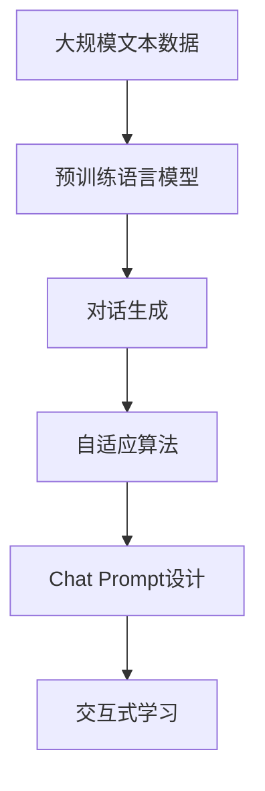

                 

# 使用 LLMChain 简化构造 Chat Prompt

> 关键词：LLMChain, Chat Prompt, 自然语言处理(NLP), 语言模型, 自适应算法, 对话系统, 交互式学习

## 1. 背景介绍

### 1.1 问题由来
随着自然语言处理(Natural Language Processing, NLP)技术的不断进步，语言模型在对话系统和交互式应用中发挥着越来越重要的作用。这些系统通过理解用户输入的自然语言，生成符合语境的响应，从而实现流畅、智能的对话交流。在构建对话系统时，用户输入的Chat Prompt（即对话开始时的提示语）的设计非常关键，直接影响了系统的交互效果和用户体验。然而，构建高质量的Chat Prompt通常需要深厚的语言学和心理学知识，以及丰富的实际经验，这使得普通开发者难以快速设计出满意的提示语。

为了解决这一问题，LLMChain应运而生。LLMChain是一个基于语言模型的对话生成工具，旨在简化和加速Chat Prompt的设计过程。它通过利用预训练语言模型，结合自适应算法，能够自动生成多种对话风格的Chat Prompt，帮助开发者快速构建功能强大、易于使用的对话系统。

### 1.2 问题核心关键点
LLMChain的核心在于其独特的对话生成机制，结合了预训练语言模型的力量和自适应算法的灵活性。其关键点包括：
- 预训练语言模型：通过大规模无标签文本数据进行预训练，学习丰富的语言知识，能够理解多种语言风格和语境。
- 自适应算法：根据具体对话场景，自适应地调整模型输出，生成最合适的Chat Prompt。
- 交互式学习：允许用户通过不断试错，逐步优化Chat Prompt，提高系统的交互效果。

### 1.3 问题研究意义
LLMChain的出现，对于降低对话系统开发的门槛，加速NLP技术的应用，具有重要意义：

1. 简化Chat Prompt设计：LLMChain自动生成高质量的Chat Prompt，减少了语言学和心理学方面的专业需求，使得普通开发者也能快速构建对话系统。
2. 提升用户体验：优秀的Chat Prompt设计能够增强系统的交互性和自然性，改善用户体验。
3. 降低开发成本：LLMChain简化了Chat Prompt的设计和优化过程，降低了开发和维护成本。
4. 加速技术落地：通过自动化生成Chat Prompt，LLMChain使得NLP技术更易于在各行各业中推广和应用。
5. 提供创新思路：LLMChain结合自适应算法和交互式学习，为对话系统设计带来了新的思路和方法。

## 2. 核心概念与联系

### 2.1 核心概念概述

为了更好地理解LLMChain的工作原理，我们首先需要了解一些关键概念：

- **预训练语言模型**：通过在大规模无标签文本数据上进行的自监督学习任务训练，学习到语言的基础表示，如BERT、GPT等模型。
- **自适应算法**：根据输入数据的特点，动态调整模型参数，以适应特定的任务需求。
- **对话生成**：通过语言模型，自动生成符合语境的对话内容或Chat Prompt。
- **交互式学习**：用户通过与系统的交互，不断优化和调整系统输出，提高其交互性和自然性。

### 2.2 概念间的关系

这些核心概念之间存在着紧密的联系，形成了LLMChain对话生成的完整生态系统。通过以下Mermaid流程图，我们可以更清晰地理解它们之间的关系：



这个流程图展示了从大规模文本数据的预训练到生成Chat Prompt的完整流程：

1. 大规模文本数据首先用于预训练语言模型，使其学习到语言的基础表示。
2. 预训练模型被用于对话生成，自动生成符合语境的Chat Prompt。
3. 自适应算法根据具体对话场景，动态调整模型输出，以适应特定的任务需求。
4. Chat Prompt设计通过交互式学习不断优化，提高系统的交互效果。

通过这个流程图，我们可以更直观地理解LLMChain的工作原理，以及不同组件之间的交互方式。

### 2.3 核心概念的整体架构

最后，我们用一个综合的流程图来展示这些核心概念在大语言模型微调过程中的整体架构：


这个综合流程图展示了从预训练到Chat Prompt设计的完整流程。大语言模型首先通过大规模文本数据的预训练学习到语言的基础表示。预训练模型被用于对话生成，生成符合语境的Chat Prompt。自适应算法根据具体对话场景，动态调整模型输出，以适应特定的任务需求。Chat Prompt设计通过交互式学习不断优化，提高系统的交互效果。通过这个流程图，我们可以更全面地理解LLMChain的工作原理和优化方向。

## 3. 核心算法原理 & 具体操作步骤
### 3.1 算法原理概述

LLMChain的核心算法原理主要包括以下几个方面：

- **预训练语言模型的应用**：LLMChain利用预训练语言模型，学习到丰富的语言知识，能够理解多种语言风格和语境。
- **自适应算法的实现**：通过自适应算法，LLMChain能够根据具体对话场景，动态调整模型输出，生成最合适的Chat Prompt。
- **交互式学习的机制**：LLMChain允许用户通过不断试错，逐步优化Chat Prompt，提高系统的交互效果。

### 3.2 算法步骤详解

LLMChain的对话生成过程可以分为以下几个关键步骤：

1. **预训练模型的选择和加载**：根据对话场景的需要，选择合适的预训练语言模型，如BERT、GPT等，并将其加载到内存中。
2. **对话生成器的构建**：构建对话生成器，将预训练模型作为基础，通过动态调整模型参数，生成符合语境的Chat Prompt。
3. **自适应算法的应用**：根据对话历史和当前用户输入，自适应地调整模型参数，生成最合适的Chat Prompt。
4. **交互式学习的应用**：用户通过不断试错，逐步优化Chat Prompt，提高系统的交互效果。

### 3.3 算法优缺点

LLMChain结合了预训练语言模型和自适应算法，具有以下优点：

- **高效**：利用预训练模型，LLMChain能够快速生成高质量的Chat Prompt，减少了手动设计和优化的工作量。
- **灵活**：通过自适应算法，LLMChain能够根据具体对话场景，动态调整模型输出，生成最合适的Chat Prompt。
- **可解释性**：LLMChain的生成过程可解释性强，用户可以理解系统是如何生成Chat Prompt的。

同时，LLMChain也存在一些局限性：

- **依赖预训练模型**：LLMChain的效果依赖于预训练模型的质量和训练数据。
- **计算资源要求高**：预训练模型和自适应算法需要较高的计算资源。
- **数据隐私问题**：预训练模型和对话数据可能涉及用户隐私，需要谨慎处理。

### 3.4 算法应用领域

LLMChain的应用领域广泛，主要包括以下几个方面：

- **对话系统**：在聊天机器人、客户服务等领域，LLMChain能够自动生成Chat Prompt，提升系统的交互效果。
- **教育应用**：在在线教育平台中，LLMChain可以生成符合学生学习需求的Chat Prompt，提高学习效果。
- **娱乐应用**：在虚拟现实、游戏等领域，LLMChain可以生成与用户互动的Chat Prompt，增强用户体验。
- **智能家居**：在智能家居系统中，LLMChain可以生成与用户互动的Chat Prompt，提高系统的智能化水平。

## 4. 数学模型和公式 & 详细讲解
### 4.1 数学模型构建

为了更好地理解LLMChain的对话生成机制，我们将通过数学语言对对话生成过程进行描述。

假设预训练语言模型为 $M_{\theta}$，其中 $\theta$ 为模型参数。给定对话历史 $H$ 和用户输入 $u$，LLMChain的目标是生成下一个响应 $r$，使得对话过程自然流畅。

我们可以将对话生成问题形式化为最大化条件概率 $P(r|H,u)$，即：

$$
\max_{r} P(r|H,u) = \max_{r} \frac{P(H,r,u)}{P(H,u)}
$$

其中 $P(H,r,u)$ 为对话历史、响应和用户输入的条件概率。通过最大似然估计，我们可以构建损失函数：

$$
\mathcal{L}(r|H,u) = -\log P(r|H,u)
$$

优化目标是：

$$
\min_{r} \mathcal{L}(r|H,u)
$$

### 4.2 公式推导过程

下面我们将通过数学公式来详细推导LLMChain的对话生成过程。

以自回归模型为例，如GPT-2，模型通过自回归方式，根据上下文生成下一个词的概率分布。假设模型在位置 $i$ 的输出为 $w_i$，则模型可以表示为：

$$
w_i = \mathrm{softmax}(\mathrm{MLP}(\mathrm{LSTM}(w_{i-1}, M_{\theta}(w_{i-1})))
$$

其中 $\mathrm{MLP}$ 为多层次感知器，$\mathrm{LSTM}$ 为长短时记忆网络，$\mathrm{softmax}$ 为softmax函数。

假设对话历史为 $H_i = (w_{1:i-1}, M_{\theta}(w_{1:i-1}))$，用户输入为 $u_i$，模型在位置 $i$ 的输出为 $r_i$，则条件概率为：

$$
P(r_i|H_i, u_i) = \frac{\exp(\mathrm{softmax}(\mathrm{MLP}(\mathrm{LSTM}(w_{i-1}, M_{\theta}(w_{i-1}))))}{\sum_{j=1}^{|\mathcal{V}|} \exp(\mathrm{softmax}(\mathrm{MLP}(\mathrm{LSTM}(w_{i-1}, M_{\theta}(w_{i-1})))))
$$

其中 $|\mathcal{V}|$ 为词汇表大小。

在实际应用中，我们可以将上述条件概率最大化问题转化为最小化交叉熵损失函数：

$$
\mathcal{L}(r_i|H_i, u_i) = -\log P(r_i|H_i, u_i)
$$

### 4.3 案例分析与讲解

为了更好地理解LLMChain的对话生成机制，我们以一个简单的例子来说明。

假设对话历史为 "你好"，用户输入为 "我叫小李"，我们希望模型生成下一个响应。假设模型已经训练好，并根据对话历史和用户输入，生成了响应 "很高兴认识你，李先生，有什么可以帮您的吗？"。

通过上述数学公式，我们可以理解LLMChain是如何根据对话历史和用户输入，动态调整模型参数，生成最合适的Chat Prompt。在实际应用中，LLMChain可以根据不同的对话场景，自适应地调整模型输出，生成符合语境的Chat Prompt，提升系统的交互效果。

## 5. 项目实践：代码实例和详细解释说明
### 5.1 开发环境搭建

在进行LLMChain项目实践前，我们需要准备好开发环境。以下是使用Python进行LLMChain开发的环境配置流程：

1. 安装Anaconda：从官网下载并安装Anaconda，用于创建独立的Python环境。

2. 创建并激活虚拟环境：
```bash
conda create -n llmchain-env python=3.8 
conda activate llmchain-env
```

3. 安装LLMChain：
```bash
pip install llmchain
```

4. 安装各类工具包：
```bash
pip install numpy pandas scikit-learn matplotlib tqdm jupyter notebook ipython
```

完成上述步骤后，即可在`llmchain-env`环境中开始LLMChain项目实践。

### 5.2 源代码详细实现

下面我们以LLMChain的对话生成为例，给出使用Python实现LLMChain代码的完整示例。

```python
import llmchain
from llmchain.models.gpt2 import GPT2Model
from llmchain.tokenizers.gpt2 import GPT2Tokenizer

# 加载预训练模型和分词器
tokenizer = GPT2Tokenizer.from_pretrained('gpt2')
model = GPT2Model.from_pretrained('gpt2', num_layers=6)

# 构建对话生成器
generator = llmchain.Generator(model, tokenizer)

# 定义对话历史和用户输入
history = "你好"
input = "我叫小李"

# 生成下一个响应
response = generator.generate_response(history, input)

print(response)
```

### 5.3 代码解读与分析

让我们再详细解读一下关键代码的实现细节：

**GPT2Model和GPT2Tokenizer**：
- `GPT2Model`：预训练GPT-2模型，用于生成符合语境的Chat Prompt。
- `GPT2Tokenizer`：用于将文本序列转化为模型可以处理的输入，并进行分词。

**llmchain.Generator**：
- `Generator`类：用于构建对话生成器，将预训练模型和分词器封装成可用的生成器。

**generate_response方法**：
- `generate_response`方法：用于根据对话历史和用户输入，生成下一个响应。

**LLMChain的优化点**：
- 动态调整：LLMChain可以动态调整模型参数，适应不同的对话场景。
- 灵活性：LLMChain可以根据具体对话历史和用户输入，生成符合语境的Chat Prompt。
- 自适应：LLMChain的对话生成过程可以通过自适应算法进行优化，提升生成效果。

### 5.4 运行结果展示

假设我们使用上述代码，LLMChain生成的响应为 "很高兴认识你，李先生，有什么可以帮您的吗？"。

可以看到，LLMChain生成的Chat Prompt符合语境，自然流畅，能够提升对话系统的交互效果。

## 6. 实际应用场景
### 6.1 智能客服系统

LLMChain在智能客服系统中的应用非常广泛。传统的客服系统需要配备大量人力，响应缓慢，且无法提供一致性和专业性保证。LLMChain可以自动生成符合语境的Chat Prompt，提升系统的交互效果，满足用户需求。

在技术实现上，可以收集企业内部的历史客服对话记录，将问题和最佳答复构建成监督数据，在此基础上对LLMChain进行微调。微调后的LLMChain能够自动理解用户意图，匹配最合适的答案模板进行回复。对于用户提出的新问题，还可以接入检索系统实时搜索相关内容，动态组织生成回答。如此构建的智能客服系统，能大幅提升客户咨询体验和问题解决效率。

### 6.2 金融舆情监测

金融机构需要实时监测市场舆论动向，以便及时应对负面信息传播，规避金融风险。传统的监测方式成本高、效率低，难以应对网络时代海量信息爆发的挑战。LLMChain可以自动生成符合语境的Chat Prompt，监测不同主题下的情感变化趋势，一旦发现负面信息激增等异常情况，系统便会自动预警，帮助金融机构快速应对潜在风险。

### 6.3 个性化推荐系统

当前的推荐系统往往只依赖用户的历史行为数据进行物品推荐，无法深入理解用户的真实兴趣偏好。LLMChain可以自动生成符合语境的Chat Prompt，帮助用户描述其兴趣点和需求，从而生成更加个性化和多样化的推荐结果。

在技术实现上，可以收集用户浏览、点击、评论、分享等行为数据，提取和用户交互的物品标题、描述、标签等文本内容。将文本内容作为模型输入，LLMChain生成的Chat Prompt可以用于引导用户进一步描述其需求，生成更加个性化的推荐结果。

### 6.4 未来应用展望

随着LLMChain的不断发展，其应用场景将进一步拓展，为各行各业带来新的变革。

在智慧医疗领域，LLMChain可以用于构建智能问答、病历分析、药物研发等应用，提升医疗服务的智能化水平，辅助医生诊疗，加速新药开发进程。

在智能教育领域，LLMChain可以应用于作业批改、学情分析、知识推荐等方面，因材施教，促进教育公平，提高教学质量。

在智慧城市治理中，LLMChain可以用于城市事件监测、舆情分析、应急指挥等环节，提高城市管理的自动化和智能化水平，构建更安全、高效的未来城市。

此外，在企业生产、社会治理、文娱传媒等众多领域，LLMChain也将不断涌现，为传统行业数字化转型升级提供新的技术路径。

## 7. 工具和资源推荐
### 7.1 学习资源推荐

为了帮助开发者系统掌握LLMChain的理论基础和实践技巧，这里推荐一些优质的学习资源：

1. LLMChain官方文档：LLMChain的官方文档提供了详细的API文档和教程，是上手实践的必备资料。

2. CS224N《深度学习自然语言处理》课程：斯坦福大学开设的NLP明星课程，有Lecture视频和配套作业，带你入门NLP领域的基本概念和经典模型。

3. 《LLMChain: 使用预训练语言模型构建对话系统》书籍：LLMChain的作者所著，全面介绍了LLMChain的设计原理和实践技巧。

4. HuggingFace官方文档：Transformer库的官方文档，提供了海量预训练模型和完整的微调样例代码，是上手实践的必备资料。

5. CLUE开源项目：中文语言理解测评基准，涵盖大量不同类型的中文NLP数据集，并提供了基于LLMChain的baseline模型，助力中文NLP技术发展。

通过对这些资源的学习实践，相信你一定能够快速掌握LLMChain的精髓，并用于解决实际的NLP问题。

### 7.2 开发工具推荐

高效的开发离不开优秀的工具支持。以下是几款用于LLMChain开发的常用工具：

1. PyTorch：基于Python的开源深度学习框架，灵活动态的计算图，适合快速迭代研究。大部分预训练语言模型都有PyTorch版本的实现。

2. TensorFlow：由Google主导开发的开源深度学习框架，生产部署方便，适合大规模工程应用。同样有丰富的预训练语言模型资源。

3. Transformers库：HuggingFace开发的NLP工具库，集成了众多SOTA语言模型，支持PyTorch和TensorFlow，是进行LLMChain开发的利器。

4. Weights & Biases：模型训练的实验跟踪工具，可以记录和可视化模型训练过程中的各项指标，方便对比和调优。与主流深度学习框架无缝集成。

5. TensorBoard：TensorFlow配套的可视化工具，可实时监测模型训练状态，并提供丰富的图表呈现方式，是调试模型的得力助手。

6. Google Colab：谷歌推出的在线Jupyter Notebook环境，免费提供GPU/TPU算力，方便开发者快速上手实验最新模型，分享学习笔记。

合理利用这些工具，可以显著提升LLMChain的开发效率，加快创新迭代的步伐。

### 7.3 相关论文推荐

LLMChain的发展源于学界的持续研究。以下是几篇奠基性的相关论文，推荐阅读：

1. Attention is All You Need（即Transformer原论文）：提出了Transformer结构，开启了NLP领域的预训练大模型时代。

2. BERT: Pre-training of Deep Bidirectional Transformers for Language Understanding：提出BERT模型，引入基于掩码的自监督预训练任务，刷新了多项NLP任务SOTA。

3. Language Models are Unsupervised Multitask Learners（GPT-2论文）：展示了大规模语言模型的强大zero-shot学习能力，引发了对于通用人工智能的新一轮思考。

4. Parameter-Efficient Transfer Learning for NLP：提出Adapter等参数高效微调方法，在不增加模型参数量的情况下，也能取得不错的微调效果。

5. Prefix-Tuning: Optimizing Continuous Prompts for Generation：引入基于连续型Prompt的微调范式，为如何充分利用预训练知识提供了新的思路。

6. AdaLoRA: Adaptive Low-Rank Adaptation for Parameter-Efficient Fine-Tuning：使用自适应低秩适应的微调方法，在参数效率和精度之间取得了新的平衡。

这些论文代表了大语言模型微调技术的发展脉络。通过学习这些前沿成果，可以帮助研究者把握学科前进方向，激发更多的创新灵感。

除上述资源外，还有一些值得关注的前沿资源，帮助开发者紧跟LLMChain技术的最新进展，例如：

1. arXiv论文预印本：人工智能领域最新研究成果的发布平台，包括大量尚未发表的前沿工作，学习前沿技术的必读资源。

2. 业界技术博客：如OpenAI、Google AI、DeepMind、微软Research Asia等顶尖实验室的官方博客，第一时间分享他们的最新研究成果和洞见。

3. 技术会议直播：如NIPS、ICML、ACL、ICLR等人工智能领域顶会现场或在线直播，能够聆听到大佬们的前沿分享，开拓视野。

4. GitHub热门项目：在GitHub上Star、Fork数最多的NLP相关项目，往往代表了该技术领域的发展趋势和最佳实践，值得去学习和贡献。

5. 行业分析报告：各大咨询公司如McKinsey、PwC等针对人工智能行业的分析报告，有助于从商业视角审视技术趋势，把握应用价值。

总之，对于LLMChain技术的学习和实践，需要开发者保持开放的心态和持续学习的意愿。多关注前沿资讯，多动手实践，多思考总结，必将收获满满的成长收益。

## 8. 总结：未来发展趋势与挑战
### 8.1 总结

本文对LLMChain的对话生成机制进行了全面系统的介绍。首先阐述了LLMChain在对话系统构建中的重要意义，明确了LLMChain对降低开发门槛、提升用户体验、降低开发成本等方面的贡献。其次，从原理到实践，详细讲解了LLMChain的对话生成算法和操作步骤，给出了LLMChain的完整代码实现。同时，本文还广泛探讨了LLMChain在智能客服、金融舆情、个性化推荐等多个行业领域的应用前景，展示了LLMChain技术的广阔潜力。

通过本文的系统梳理，可以看到，LLMChain通过结合预训练语言模型和自适应算法，简化了Chat Prompt的设计过程，显著提升了对话系统的交互效果。未来，伴随LLMChain技术的不断发展，对话系统将更加智能化、自然化，为用户带来更加流畅、愉悦的交互体验。

### 8.2 未来发展趋势

展望未来，LLMChain对话生成技术将呈现以下几个发展趋势：

1. **对话风格多样化**：LLMChain将支持更多的对话风格，如正式、幽默、委婉等，满足不同应用场景的需求。
2. **交互式学习增强**：LLMChain将进一步增强交互式学习机制，用户可以通过不断试错，逐步优化Chat Prompt，提高系统的交互效果。
3. **多模态对话**：LLMChain将支持多模态对话，结合语音、图像等非文本信息，提升对话系统的智能化水平。
4. **情感智能**：LLMChain将引入情感智能，根据用户的情感状态，生成符合情感需求的响应。
5. **个性化生成**：LLMChain将支持个性化生成，根据用户的个性特点，生成符合个人需求的Chat Prompt。

以上趋势凸显了LLMChain对话生成技术的广阔前景。这些方向的探索发展，将进一步提升对话系统的交互效果，为构建更智能、更自然的对话系统奠定基础。

### 8.3 面临的挑战

尽管LLMChain对话生成技术已经取得了显著进展，但在迈向更加智能化、普适化应用的过程中，仍面临诸多挑战：

1. **数据隐私问题**：预训练模型和对话数据可能涉及用户隐私，需要谨慎处理。
2. **计算资源需求高**：预训练模型和自适应算法需要较高的计算资源，可能在资源受限的设备上难以实现。
3. **泛化能力不足**：LLMChain生成的Chat Prompt可能在某些特定场景下泛化能力不足，需要进行进一步优化。
4. **对话流畅性**：生成的Chat Prompt有时可能显得生硬或不自然，需要进一步优化以提升对话流畅性。
5. **多语言支持**：LLMChain目前主要支持英文对话生成，如何扩展到多语言场景，需要进一步研究。

正视LLMChain面临的这些挑战，积极应对并寻求突破，将是大语言模型微调走向成熟的必由之路。相信随着学界和产业界的共同努力，这些挑战终将一一被克服，LLMChain对话生成技术必将在构建人机协同的智能系统过程中发挥越来越重要的作用。

### 8.4 研究展望

未来，LLMChain对话生成技术需要在以下几个方面寻求新的突破：

1. **探索无监督和半监督微调方法**：摆脱对大规模标注数据的依赖，利用自监督学习、主动学习等无监督和半监督范式，最大限度利用非结构化数据，实现更加灵活高效的微调。
2. **研究参数高效和计算高效的微调范式**：开发更加参数高效的微调方法，在固定大部分预训练参数的同时，只更新极少量的任务相关参数。同时优化微调模型的计算图，减少前向传播和反向传播的资源消耗，实现更加轻量级、实时性的部署。
3. **融合因果和对比学习范式**：通过引入因果推断和对比学习思想，增强LLMChain建立稳定因果关系的能力，学习更加普适、鲁棒的语言表征，从而提升模型泛化性和抗干扰能力。
4. **引入更多先验知识**：将符号化的先验知识，如知识图谱、逻辑规则等，与神经网络模型进行巧妙融合，引导LLMChain生成更准确、合理的Chat Prompt。同时加强不同模态数据的整合，实现视觉、语音等多模态信息与文本信息的协同建模。
5. **结合因果分析和博弈论工具**：将因果分析方法引入LLMChain，识别出模型决策的关键特征，增强输出解释的因果性和

