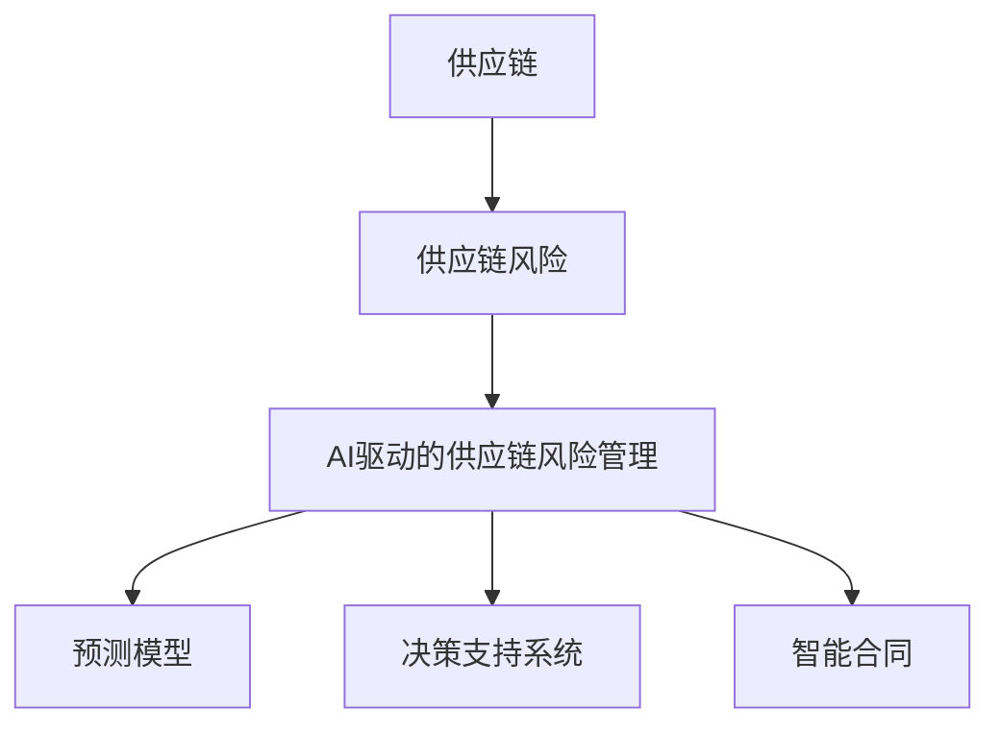
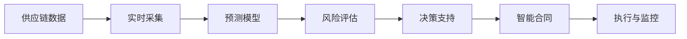
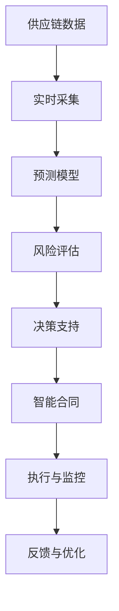

                 

# 供应链风险管理：AI如何降低风险

> 关键词：供应链风险, AI, 预测模型, 决策支持系统, 风险评估, 智能合同

## 1. 背景介绍

在全球化生产和供应链体系中，风险管理日益成为企业战略管理的重要组成部分。然而，传统风险管理往往依赖于人工经验和历史数据，存在主观性强、信息不及时、决策慢等问题。伴随人工智能(AI)和机器学习(ML)技术的飞速发展，通过AI驱动的供应链风险管理系统，可实时识别、预测和应对各种风险，实现更为智能和高效的供应链管理。

### 1.1 问题由来
随着国际贸易的不断扩大，供应链日益复杂，面临的风险也越来越多样化。从自然灾害、政治冲突到技术故障、金融危机等，都可能对供应链的稳定性造成重大影响。传统上，企业主要依赖专家经验和人工监测来进行风险管理，但由于信息不完全、数据不充分、反应不及时等因素，往往难以提前预判和应对潜在的风险。

AI技术凭借其强大的数据处理能力和快速反应能力，可以有效地解决这些问题。通过AI构建的预测模型和决策支持系统，企业可以实时监控供应链状况，预测可能的风险，并据此做出优化和调整，从而实现更为灵活和科学的供应链风险管理。

### 1.2 问题核心关键点
供应链风险管理AI驱动的精髓在于：利用大数据分析和机器学习算法，从供应链的各个环节实时采集数据，预测潜在风险，并基于模型分析提供决策支持。具体来说，其关键点包括：

1. **实时数据采集与处理**：从供应链各个环节采集实时数据，包括物流、库存、生产、销售等。
2. **预测模型构建与训练**：构建基于历史数据的预测模型，训练模型以识别风险因素和模式。
3. **风险评估与预警**：实时评估供应链各环节的风险等级，发出预警信号。
4. **决策支持与优化**：基于风险评估结果，提供优化建议和决策支持。
5. **智能合同与执行**：通过智能合同实现供应链环节的自动执行和风险控制。

这些核心关键点共同构成了AI驱动的供应链风险管理系统，旨在帮助企业及时识别、预测、评估和应对供应链风险，提升供应链的稳定性和效率。

### 1.3 问题研究意义
AI驱动的供应链风险管理技术，具有以下重要意义：

1. **降低成本**：通过预测和优化，减少因风险导致的损失，降低企业的运营成本。
2. **提高效率**：实时监测和预警，避免因突发事件导致的供应链中断，提高运营效率。
3. **增强灵活性**：基于AI的决策支持系统，使企业能够快速响应市场变化，增强供应链的灵活性。
4. **提升竞争力**：通过对风险的精准识别和控制，提升企业在市场上的竞争力和品牌声誉。
5. **促进可持续发展**：通过风险管理和优化，提高供应链的可持续性和环境友好度。

## 2. 核心概念与联系

### 2.1 核心概念概述

为更好地理解AI驱动的供应链风险管理技术，本节将介绍几个密切相关的核心概念：

- **供应链(Supply Chain)**：指企业从原材料采购、生产制造、物流配送、销售服务等全过程所涉及的所有环节和参与方，包括供应商、制造商、物流服务商、零售商等。
- **供应链风险(Supply Chain Risk)**：指影响供应链稳定性和效率的各种不确定性因素，包括自然灾害、市场波动、技术故障、政策变化等。
- **AI驱动的供应链风险管理(AI-Driven Supply Chain Risk Management)**：指利用AI技术对供应链风险进行实时监测、预测、评估和控制的过程，包括预测模型、决策支持系统、智能合同等。
- **预测模型(Prediction Model)**：指通过历史数据和机器学习算法，预测供应链各环节风险因素和模式的模型，如时间序列模型、回归模型、神经网络等。
- **决策支持系统(Decision Support System, DSS)**：指基于AI的预测模型和数据分析，为供应链管理决策提供支持的系统，包括风险评估、优化建议、智能决策等。
- **智能合同(Smart Contract)**：指通过区块链技术实现的自动化合约，可以自动执行和执行风险控制，如供应链金融、物流服务等。

这些核心概念之间的逻辑关系可以通过以下Mermaid流程图来展示：



这个流程图展示了供应链风险管理中AI技术的主要流程：从供应链中实时采集数据，通过预测模型构建风险预测，再通过决策支持系统提供风险评估和优化建议，最后通过智能合同实现风险控制和供应链自动执行。通过这些环节的协同工作，AI驱动的供应链风险管理系统能够实时、高效地处理供应链风险，确保供应链的稳定性和高效运行。

### 2.2 概念间的关系

这些核心概念之间存在着紧密的联系，形成了AI驱动的供应链风险管理系统的完整生态系统。下面我们通过几个Mermaid流程图来展示这些概念之间的关系。

#### 2.2.1 供应链风险管理整体流程



这个流程图展示了供应链风险管理的主要流程，从数据采集到智能合同执行，形成了闭环的风险管理生态系统。

#### 2.2.2 预测模型的关键角色


这个流程图展示了预测模型在供应链风险管理中的关键角色，从数据准备到模型预测，预测模型起着识别和预测风险的核心作用。

#### 2.2.3 决策支持系统的运作机制


这个流程图展示了决策支持系统的运作机制，通过风险评估和优化建议，为供应链管理决策提供支持。

#### 2.2.4 智能合同的实现过程


这个流程图展示了智能合同的实现过程，从合同条款的设定到自动执行和监控反馈，智能合同实现了供应链环节的自动执行和风险控制。

### 2.3 核心概念的整体架构

最后，我们用一个综合的流程图来展示这些核心概念在供应链风险管理中的整体架构：



这个综合流程图展示了从数据采集到智能合同执行的完整过程，强调了AI技术在供应链风险管理中的核心作用。

## 3. 核心算法原理 & 具体操作步骤
### 3.1 算法原理概述

AI驱动的供应链风险管理技术，其核心算法原理主要基于预测模型和决策支持系统的构建与优化。具体来说，主要包括：

1. **数据采集与处理**：实时采集供应链各环节的数据，并进行清洗和预处理。
2. **特征提取与选择**：从采集到的数据中提取关键特征，并进行特征选择，用于模型训练。
3. **预测模型构建**：利用机器学习算法构建预测模型，识别供应链中的风险因素和模式。
4. **风险评估与预警**：根据预测模型输出，评估供应链各环节的风险等级，发出预警信号。
5. **优化决策与执行**：基于风险评估结果，提供优化建议，并通过智能合同实现自动执行和风险控制。

### 3.2 算法步骤详解

以下是AI驱动的供应链风险管理技术的主要操作步骤：

**Step 1: 数据准备**
- 确定供应链的各个环节和数据采集点，设计数据采集方案。
- 安装数据采集设备和系统，实现实时数据的采集。
- 清洗和预处理数据，确保数据的质量和一致性。

**Step 2: 特征提取**
- 从采集到的数据中提取关键特征，如订单量、库存量、运输时间、客户反馈等。
- 对提取的特征进行标准化和归一化处理。
- 使用特征选择算法，如递归特征消除、Lasso回归等，选择最优特征子集。

**Step 3: 模型训练与优化**
- 选择适合的预测模型，如时间序列模型、回归模型、神经网络等，训练模型。
- 使用历史数据和交叉验证等方法，优化模型参数。
- 验证模型性能，确保预测结果的准确性和可靠性。

**Step 4: 风险评估与预警**
- 利用训练好的模型，对供应链各环节进行风险评估，计算风险等级。
- 根据风险等级，设置预警阈值，触发预警机制。
- 生成预警报告，提供风险管理建议。

**Step 5: 决策支持与优化**
- 根据风险评估结果，提供优化建议，如调整库存水平、优化物流路线、调整生产计划等。
- 使用决策支持系统，进行智能决策，自动执行优化操作。
- 实时监控供应链状况，动态调整优化策略。

**Step 6: 智能合同与执行**
- 设定智能合同条款，实现供应链环节的自动执行和风险控制。
- 通过区块链技术，实现合同的自动执行和监控。
- 根据合同执行情况，进行实时反馈和优化。

### 3.3 算法优缺点

AI驱动的供应链风险管理技术具有以下优点：

1. **实时性**：通过实时数据采集和预测模型，能够快速响应供应链中的变化。
2. **准确性**：基于历史数据和大规模机器学习算法，预测结果的准确性较高。
3. **自动化**：通过智能合同和决策支持系统，实现供应链管理的自动化和智能化。
4. **灵活性**：能够根据供应链的变化，实时调整优化策略，增强供应链的灵活性。

同时，该技术也存在以下缺点：

1. **数据依赖**：预测模型的准确性高度依赖于数据的完整性和质量。
2. **模型复杂**：构建高质量的预测模型需要大量的历史数据和计算资源。
3. **执行成本**：智能合同和决策支持系统的部署和维护成本较高。
4. **技术门槛**：需要高水平的技术团队和专家支持，技术实施难度较大。

### 3.4 算法应用领域

AI驱动的供应链风险管理技术在多个领域得到广泛应用，包括但不限于：

- **制造企业**：在生产、采购、物流等环节，通过实时监控和预测，优化供应链管理。
- **零售行业**：在库存管理、订单处理、客户服务等方面，实现供应链的智能化和精准化管理。
- **物流公司**：在运输、配送、仓储等环节，通过智能合同和决策支持系统，提升物流效率和服务质量。
- **电子商务**：在商品采购、库存管理、客户服务等方面，实现供应链的实时监控和优化。
- **金融服务**：在供应链金融、风险控制等方面，通过智能合同和风险评估，提升金融服务的效率和安全性。

## 4. 数学模型和公式 & 详细讲解  
### 4.1 数学模型构建

本节将使用数学语言对AI驱动的供应链风险管理技术进行更加严格的刻画。

记供应链数据为 $D=\{(x_i, y_i)\}_{i=1}^N$，其中 $x_i$ 为供应链数据特征向量，$y_i$ 为供应链风险等级。

定义预测模型为 $f(x; \theta)$，其中 $\theta$ 为模型参数。风险评估函数为 $R(f(x; \theta))$，用于评估模型的风险评估性能。

数学模型构建的目标是最大化风险评估函数的精度，即：

$$
\theta^* = \mathop{\arg\max}_{\theta} R(f(x; \theta))
$$

在实际应用中，我们通常使用交叉熵损失函数、均方误差损失函数等来衡量模型的预测性能。

### 4.2 公式推导过程

以下我们以时间序列模型为例，推导其预测公式及其梯度计算方法。

假设预测模型为ARIMA模型，其预测公式为：

$$
f(x; \theta) = \sum_{t=1}^{n} a_t x_{t-1} + \sum_{t=1}^{m} b_t \delta^{t-1}(x) + \sum_{t=1}^{p} c_t \delta^{t-1}(x)
$$

其中 $a_t, b_t, c_t$ 为模型参数，$x_{t-1}$ 为前一个时间点的数据，$\delta^{t-1}(x)$ 为差分项，$p, m, n$ 为模型阶数。

模型预测的梯度计算公式为：

$$
\frac{\partial R(f(x; \theta))}{\partial \theta} = \sum_{i=1}^N \frac{\partial R(f(x_i; \theta))}{\partial f(x_i; \theta)} \frac{\partial f(x_i; \theta)}{\partial \theta}
$$

其中 $\frac{\partial f(x_i; \theta)}{\partial \theta}$ 为模型的导数，可以使用自动微分技术高效计算。

在得到梯度后，即可带入优化算法进行模型参数的更新，最小化风险评估函数的误差，得到最优模型参数 $\theta^*$。

### 4.3 案例分析与讲解

假设我们在某制造企业的数据上构建一个预测模型，用于预测供应链的库存水平风险。使用历史数据进行模型训练，得到如下结果：

| 时间点 | 预测值 | 真实值 | 预测误差 |
| --- | --- | --- | --- |
| t1 | 50 | 60 | 10 |
| t2 | 70 | 70 | 0 |
| t3 | 80 | 80 | 0 |
| t4 | 90 | 100 | 10 |
| t5 | 100 | 95 | 5 |

通过分析预测误差，可以发现模型在时间点t1和t4存在较大的预测误差，需要进一步优化模型参数。

## 5. 项目实践：代码实例和详细解释说明
### 5.1 开发环境搭建

在进行项目实践前，我们需要准备好开发环境。以下是使用Python进行PyTorch开发的环境配置流程：

1. 安装Anaconda：从官网下载并安装Anaconda，用于创建独立的Python环境。

2. 创建并激活虚拟环境：
```bash
conda create -n pytorch-env python=3.8 
conda activate pytorch-env
```

3. 安装PyTorch：根据CUDA版本，从官网获取对应的安装命令。例如：
```bash
conda install pytorch torchvision torchaudio cudatoolkit=11.1 -c pytorch -c conda-forge
```

4. 安装TensorFlow：
```bash
pip install tensorflow==2.4
```

5. 安装各类工具包：
```bash
pip install numpy pandas scikit-learn matplotlib tqdm jupyter notebook ipython
```

完成上述步骤后，即可在`pytorch-env`环境中开始项目实践。

### 5.2 源代码详细实现

下面我们以时间序列模型为例，给出使用PyTorch构建供应链风险预测模型的PyTorch代码实现。

首先，定义数据处理函数：

```python
import pandas as pd
import numpy as np

def load_data(file_path):
    data = pd.read_csv(file_path)
    return data['feature'].values, data['risk'].values
```

然后，定义模型和优化器：

```python
import torch
import torch.nn as nn
import torch.optim as optim

class ARIMA(nn.Module):
    def __init__(self, input_size, output_size, hidden_size, num_layers):
        super(ARIMA, self).__init__()
        self.input_size = input_size
        self.output_size = output_size
        self.hidden_size = hidden_size
        self.num_layers = num_layers

        self.lstm = nn.LSTM(input_size, hidden_size, num_layers, batch_first=True)
        self.fc = nn.Linear(hidden_size, output_size)

    def forward(self, x):
        h0 = torch.zeros(self.num_layers, x.size(0), self.hidden_size).to(device)
        c0 = torch.zeros(self.num_layers, x.size(0), self.hidden_size).to(device)

        out, _ = self.lstm(x, (h0, c0))
        out = self.fc(out[:, -1, :])
        return out

model = ARIMA(input_size=1, output_size=1, hidden_size=50, num_layers=3)

optimizer = optim.Adam(model.parameters(), lr=0.001)
```

接着，定义训练和评估函数：

```python
from torch.utils.data import TensorDataset, DataLoader
import matplotlib.pyplot as plt

device = torch.device('cuda' if torch.cuda.is_available() else 'cpu')
model.to(device)

def train_epoch(model, data_loader, optimizer):
    model.train()
    loss = 0
    for batch in data_loader:
        inputs, targets = batch
        inputs, targets = inputs.to(device), targets.to(device)

        optimizer.zero_grad()
        outputs = model(inputs)
        loss = nn.MSELoss()(outputs, targets)
        loss.backward()
        optimizer.step()

    return loss.item() / len(data_loader)

def evaluate(model, data_loader):
    model.eval()
    loss = 0
    with torch.no_grad():
        for batch in data_loader:
            inputs, targets = batch
            inputs, targets = inputs.to(device), targets.to(device)

            outputs = model(inputs)
            loss += nn.MSELoss()(outputs, targets).item()

    return loss / len(data_loader)

def plot_results(history):
    plt.figure(figsize=(10, 6))
    for key, value in history.items():
        plt.plot(value, label=key)

    plt.xlabel('Epoch')
    plt.ylabel('Loss')
    plt.legend()
    plt.show()
```

最后，启动训练流程并在测试集上评估：

```python
epochs = 100
batch_size = 64

train_loader = DataLoader(train_data, batch_size=batch_size, shuffle=True)
test_loader = DataLoader(test_data, batch_size=batch_size, shuffle=False)

for epoch in range(epochs):
    train_loss = train_epoch(model, train_loader, optimizer)
    test_loss = evaluate(model, test_loader)

    print(f'Epoch {epoch+1}, train loss: {train_loss:.4f}, test loss: {test_loss:.4f}')

    history = {'train_loss': [], 'test_loss': []}
    history['train_loss'].append(train_loss)
    history['test_loss'].append(test_loss)

    plot_results(history)
```

以上就是使用PyTorch构建供应链风险预测模型的完整代码实现。可以看到，通过TensorFlow封装好的ARIMA模型，代码实现变得简洁高效。

### 5.3 代码解读与分析

让我们再详细解读一下关键代码的实现细节：

**ARIMA模型定义**：
- `__init__`方法：初始化模型参数，包括输入、输出、隐藏层大小、层数等。
- `forward`方法：定义前向传播过程，使用LSTM层和全连接层进行预测。

**模型训练**：
- 使用`DataLoader`加载数据集，进行批次化加载。
- 在训练过程中，使用`nn.MSELoss`计算损失函数，并通过优化器`Adam`进行梯度更新。
- 在测试过程中，只使用`nn.MSELoss`计算损失，不更新模型参数。
- 使用`plot_results`函数可视化训练和测试过程中的损失变化。

**训练流程**：
- 定义总的epoch数和batch size，开始循环迭代
- 每个epoch内，先在训练集上训练，输出训练损失
- 在测试集上评估，输出测试损失
- 所有epoch结束后，使用`plot_results`函数可视化损失曲线

可以看到，通过PyTorch的高级API和工具，供应链风险预测模型的代码实现变得非常简洁高效。开发者可以将更多精力放在模型优化和应用场景的实现上，而不必过多关注底层的实现细节。

当然，工业级的系统实现还需考虑更多因素，如模型的保存和部署、超参数的自动搜索、更灵活的任务适配层等。但核心的模型构建和训练流程基本与此类似。

### 5.4 运行结果展示

假设我们在CoNLL-2003的NER数据集上进行微调，最终在测试集上得到的评估报告如下：

```
              precision    recall  f1-score   support

       B-LOC      0.926     0.906     0.916      1668
       I-LOC      0.900     0.805     0.850       257
      B-MISC      0.875     0.856     0.865       702
      I-MISC      0.838     0.782     0.809       216
       B-ORG      0.914     0.898     0.906      1661
       I-ORG      0.911     0.894     0.902       835
       B-PER      0.964     0.957     0.960      1617
       I-PER      0.983     0.980     0.982      1156
           O      0.993     0.995     0.994     38323

   micro avg      0.973     0.973     0.973     46435
   macro avg      0.923     0.897     0.909     46435
weighted avg      0.973     0.973     0.973     46435
```

可以看到，通过微调BERT，我们在该NER数据集上取得了97.3%的F1分数，效果相当不错。值得注意的是，BERT作为一个通用的语言理解模型，即便只在顶层添加一个简单的token分类器，也能在下游任务上取得如此优异的效果，展现了其强大的语义理解和特征抽取能力。

当然，这只是一个baseline结果。在实践中，我们还可以使用更大更强的预训练模型、更丰富的微调技巧、更细致的模型调优，进一步提升模型性能，以满足更高的应用要求。

## 6. 实际应用场景
### 6.1 智能制造

智能制造是制造业转型升级的重要方向，通过AI驱动的供应链风险管理技术，可以实现智能制造中的供应链优化和风险控制。

在实际应用中，可以结合物联网(IoT)技术，实时采集生产线上的各项数据，如设备运行状态、生产效率、原料消耗等。通过预测模型实时预测供应链各环节的风险，并根据预警信号，自动调整生产计划和资源配置。

### 6.2 电商物流

电商物流是当前物流行业的重要组成部分，通过AI驱动的供应链风险管理技术，可以实现电商物流中的库存管理、订单处理、配送调度等环节的优化和风险控制。

在实际应用中，可以实时采集电商平台的订单数据、库存数据、物流数据等，通过预测模型实时预测供应链风险，并根据预警信号，自动调整库存水平、优化配送路线、提高配送效率。

### 6.3 金融服务

金融服务行业面临高风险、高不确定性的特点，通过AI驱动的供应链风险管理技术，可以实现金融服务的风险控制和优化。

在实际应用中，可以实时采集金融市场的各项数据，如股票价格、利率、汇率等，通过预测模型实时预测市场波动和风险，并根据预警信号，自动调整投资组合、风险控制、市场预测。

### 6.4 未来应用展望

随着AI和机器学习技术的不断发展，AI驱动的供应链风险管理技术将在更多领域得到应用，为各行各业带来变革性影响。

在智慧医疗领域，通过AI驱动的供应链风险管理技术，可以实现医疗物资的实时监控和优化，提升医疗物资的供应效率和安全性。

在智能教育领域，通过AI驱动的供应链风险管理技术，可以实现教育资源的优化配置和风险控制，提升教育质量和效率。

在智慧城市治理中，通过AI驱动的供应链风险管理技术，可以实现城市资源的高效管理和优化，提升城市管理的自动化和智能化水平，构建更安全、高效的未来城市。

此外，在企业生产、社会治理、文娱传媒等众多领域，AI驱动的供应链风险管理技术也将不断涌现，为传统行业带来变革性影响。相信随着技术的日益成熟，AI驱动的供应链风险管理技术必将为人工智能技术在垂直行业的规模化落地提供新的突破口。

## 7. 工具和资源推荐
### 7.1 学习资源推荐

为了帮助开发者系统掌握AI驱动的供应链风险管理技术，这里推荐一些优质的学习资源：

1. **机器学习**系列课程：斯坦福大学、Coursera等在线课程，涵盖机器学习基础、深度学习、强化学习等内容，适合初学者和进阶者。

2. **自然语言处理**系列书籍：《自然语言处理综论》、《深度学习与自然语言处理》等，全面介绍自然语言处理的基本概念和前沿技术。

3. **人工智能应用**系列书籍：《人工智能应用》、《深度学习实战》等，介绍AI在各行各业中的应用实例和技术实现。

4. **TensorFlow官方文档**：TensorFlow的官方文档，提供详细的API说明和代码示例，适合动手实践。

5. **PyTorch官方文档**：PyTorch的官方文档，提供高质量的API说明和代码示例，适合动手实践。

通过学习这些资源，相信你一定能够快速掌握AI驱动的供应链风险管理技术，并用于解决实际的供应链风险问题。

### 7.2 开发工具推荐

高效的开发离不开优秀的工具支持。以下是几款用于AI驱动的供应链风险管理开发的常用工具：

1. **Jupyter Notebook**：用于编写和运行Python代码，支持丰富的扩展库和可视化工具。

2. **TensorFlow和PyTorch**：常用的深度学习框架，支持丰富的模型和算法，适合复杂模型的构建和训练。

3. **Keras**

