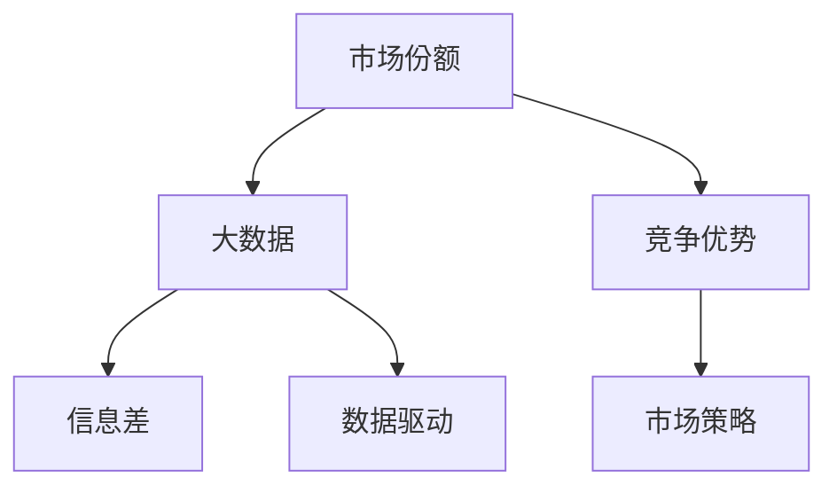
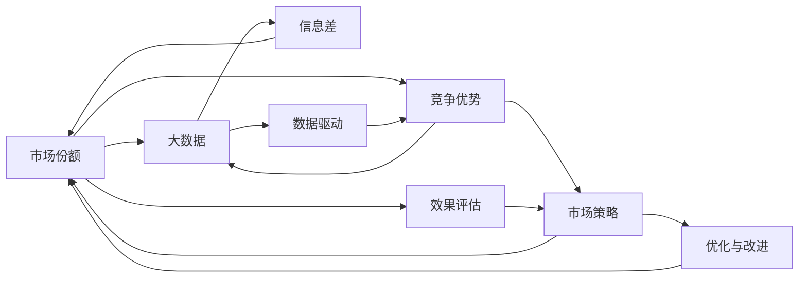
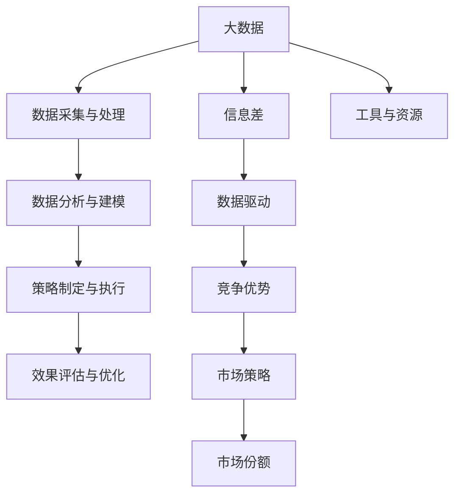

                 

# 信息差的市场份额扩大：大数据如何扩大市场份额

> 关键词：市场份额, 大数据, 信息差, 数据驱动, 竞争优势

## 1. 背景介绍

### 1.1 问题由来

在当今激烈的市场竞争中，企业的生存和发展往往依赖于其在特定市场中的市场份额。市场份额，是指企业在特定产品或服务市场中的销售量或收入，占整个市场同类产品或服务总销售量或总收入的比重。对于多数企业而言，扩大市场份额是提升利润、提高市场影响力的关键途径。然而，随着市场的逐步成熟，竞争的日益加剧，许多企业发现在新市场中的市场份额扩大变得越来越困难。

信息差（Information Gap）现象的加剧，是造成这一问题的重要原因之一。信息差指的是企业之间在产品、服务、市场策略等方面的信息不对称，导致消费者在面对不同选择时，无法充分了解和比较各个企业的产品特性和价值。这种现象在数字化转型尚未完全普及的阶段尤为明显，信息差成为企业市场份额扩大的一大阻碍。

在数字化时代，大数据技术的应用提供了解决信息差问题的新路径。利用大数据分析，企业可以更精准地了解消费者需求、竞争环境以及市场变化，从而更好地制定市场策略，扩大市场份额。

### 1.2 问题核心关键点

本文聚焦于利用大数据如何扩大企业市场份额的核心问题，主要包括以下几个方面：

- **数据采集与处理**：如何获取并处理高质量的数据，以便更好地进行市场分析和决策。
- **数据分析与建模**：利用数据分析模型和算法，发现消费者需求和市场趋势。
- **策略制定与执行**：基于数据分析结果，制定和执行市场推广策略，扩大市场份额。
- **效果评估与优化**：对市场推广效果进行评估，并持续优化策略以获得更好的市场份额。

### 1.3 问题研究意义

研究如何通过大数据技术扩大企业市场份额，对于提升企业市场竞争力、优化资源配置、加速数字化转型具有重要意义：

1. **提升市场竞争力**：通过精准了解市场需求，制定科学的市场策略，使企业更有效地参与市场竞争，提高市场份额。
2. **优化资源配置**：数据分析可以揭示出关键的业务机会和潜在风险，帮助企业更合理地配置资源，提高投资回报率。
3. **加速数字化转型**：大数据和AI技术的结合，可以推动企业快速进行数字化转型，提升数据驱动的决策能力。
4. **促进创新与业务增长**：大数据可以提供深入的市场洞察，支持企业创新产品和服务的研发，促进业务增长。
5. **改善客户体验**：基于数据的个性化营销和推荐，可以提升客户满意度，提高客户忠诚度，扩大市场份额。

## 2. 核心概念与联系

### 2.1 核心概念概述

为更好地理解利用大数据扩大市场份额的方法，本节将介绍几个关键概念：

- **市场份额（Market Share）**：企业在特定市场中的销售量或收入占比，反映企业在市场中的地位和竞争力。
- **大数据（Big Data）**：指超过传统数据处理软件工具和数据管理软件可处理能力的海量、高速、复杂的数据集，常用于深度分析和决策支持。
- **信息差（Information Gap）**：企业之间在产品、服务、市场策略等方面的信息不对称，影响市场竞争和消费者决策。
- **数据驱动（Data-Driven）**：以数据为基础进行决策和行动的方法，强调通过数据分析来支持决策。
- **竞争优势（Competitive Advantage）**：企业相对于竞争对手在市场中的优势地位，可以是技术领先、成本低廉、品牌效应等。
- **市场策略（Market Strategy）**：企业基于市场分析和竞争情况，制定的各种营销和销售策略。

这些核心概念之间存在紧密的联系，通过以下Mermaid流程图展示它们之间的关系：



这个流程图展示了市场份额、大数据、信息差、数据驱动、竞争优势和市场策略之间的关系：

1. 大数据作为信息差的消解手段，通过数据分析揭示企业竞争优势。
2. 市场策略的制定和执行，依赖于大数据分析得出的洞见和竞争优势。
3. 市场份额的提升，则是市场策略和竞争优势综合作用的结果。

### 2.2 概念间的关系

这些核心概念之间存在复杂的互动关系，形成了市场份额扩大的完整生态系统。下面通过Mermaid流程图来展示这些概念之间的互动关系：



这个综合流程图展示了市场份额扩大的整体架构：

1. 大数据帮助消除信息差，揭示企业的竞争优势。
2. 数据驱动支持竞争优势与市场策略的协同作用。
3. 市场策略的有效执行促进市场份额提升。
4. 效果评估和持续优化，不断提升市场策略的有效性。

### 2.3 核心概念的整体架构

最后，我们用一个综合的流程图来展示这些核心概念在大数据市场份额扩大的整体架构：



这个综合流程图展示了从数据采集到策略优化，再到市场份额提升的完整过程。

## 3. 核心算法原理 & 具体操作步骤

### 3.1 算法原理概述

利用大数据扩大市场份额的基本思路是通过数据分析揭示市场机会和竞争优势，进而制定和执行有效的市场策略。算法原理主要包括以下几个步骤：

1. **数据采集与处理**：从企业内外部的多源数据中采集高质量数据，并进行清洗、预处理和特征提取，以供后续分析。
2. **数据分析与建模**：利用统计学、机器学习和数据挖掘技术，分析市场趋势、消费者行为、竞争环境等，构建模型揭示市场机会。
3. **策略制定与执行**：基于分析结果，制定目标明确、可执行的市场策略，如产品定位、定价策略、营销活动等，并实施。
4. **效果评估与优化**：对市场策略的效果进行评估，利用数据分析结果不断优化策略，以提升市场份额。

### 3.2 算法步骤详解

以下详细介绍利用大数据扩大市场份额的具体操作步骤：

**Step 1: 数据采集与处理**

数据采集与处理是利用大数据进行市场份额扩大的第一步。数据来源包括企业内部（如销售记录、客户反馈、操作数据等）和企业外部（如公开市场数据、社交媒体数据、行业报告等）。具体步骤如下：

1. **确定数据源**：识别潜在的数据源，包括企业内部系统和外部互联网。
2. **数据集成**：将不同数据源的数据整合到统一的平台上，构建完整的数据仓库。
3. **数据清洗**：清洗数据中的噪声和异常值，保证数据质量。
4. **特征提取**：从清洗后的数据中提取有价值的特征，供后续建模分析使用。

**Step 2: 数据分析与建模**

数据分析与建模是揭示市场机会和竞争优势的关键步骤。通过数据挖掘和机器学习算法，企业可以分析出市场趋势和消费者行为。具体步骤如下：

1. **探索性数据分析（EDA）**：通过可视化工具和统计方法，对数据集进行初步分析和探索，发现潜在的模式和异常。
2. **数据建模**：利用统计模型、机器学习模型（如回归分析、分类算法、聚类算法等）对数据进行建模分析，揭示市场趋势和消费者行为。
3. **结果解读**：对建模结果进行解读，识别市场机会和竞争优势。

**Step 3: 策略制定与执行**

市场策略的制定和执行是利用大数据进行市场份额扩大的核心环节。通过科学的市场分析，企业可以制定目标明确、可执行的市场策略。具体步骤如下：

1. **目标设定**：基于数据分析结果，设定明确的营销和销售目标。
2. **策略制定**：根据目标和市场环境，制定各种市场策略，如产品定价、促销活动、渠道选择等。
3. **策略执行**：将制定的策略转化为可执行的计划，并在市场上实施。

**Step 4: 效果评估与优化**

效果评估与优化是利用大数据进行市场份额扩大的闭环环节。通过评估市场策略的效果，企业可以持续优化策略，提升市场份额。具体步骤如下：

1. **效果评估**：利用数据分析方法对市场策略的效果进行评估，如销售额、市场份额变化、客户满意度等。
2. **结果反馈**：将评估结果反馈到市场策略制定环节，发现问题和不足。
3. **策略优化**：根据评估结果，不断优化市场策略，提升市场份额。

### 3.3 算法优缺点

利用大数据扩大市场份额的方法具有以下优点：

1. **数据驱动**：以数据为基础进行决策，提升决策的科学性和准确性。
2. **动态调整**：可以实时监控市场变化，动态调整策略，提高市场反应速度。
3. **全面洞察**：大数据分析可以揭示消费者行为、竞争环境等多维度信息，提供全面的市场洞察。

同时，也存在一些缺点：

1. **数据质量**：数据的完整性、准确性和及时性对分析结果有直接影响，数据质量不高可能导致分析结果偏差。
2. **技术门槛**：大数据分析和建模需要专业的技术和工具，企业内部可能需要投入大量人力和资源。
3. **成本高昂**：数据采集、存储、处理和分析都需要大量成本，中小企业可能难以承受。

### 3.4 算法应用领域

基于大数据的市场份额扩大方法在多个领域得到了广泛应用：

1. **零售行业**：通过分析消费者购买行为、竞争对手价格策略等，制定有效的营销策略，提升销售额和市场份额。
2. **金融行业**：利用金融市场数据和客户行为数据，优化产品设计和销售策略，扩大客户基数和市场份额。
3. **制造业**：通过分析供应链数据和市场需求变化，优化产品设计和生产策略，提升市场竞争力。
4. **电信行业**：利用用户数据和市场趋势，优化服务质量和网络策略，扩大用户数量和市场份额。
5. **医疗行业**：利用患者数据和临床数据，优化治疗方案和医疗服务，提升市场份额和品牌影响力。

## 4. 数学模型和公式 & 详细讲解 & 举例说明

### 4.1 数学模型构建

在本节中，我们将使用数学语言对利用大数据进行市场份额扩大的过程进行更加严格的刻画。

记企业市场份额为 $S$，市场总规模为 $M$，则市场份额可以表示为：

$$
S = \frac{Sales}{M}
$$

其中，$Sales$ 为企业的销售额，$M$ 为市场的总销售额。

大数据分析的目标是最大化 $S$，即最大化企业销售额占市场总销售额的比例。

### 4.2 公式推导过程

假设企业市场份额由以下因素决定：

1. **产品定价（Pricing）**：产品价格的高低直接影响企业的销售额。
2. **市场营销（Marketing）**：市场推广活动的效果决定了消费者对企业产品的认知和购买意愿。
3. **产品差异化（Differentiation）**：产品特性和品牌效应是企业竞争优势的核心。
4. **客户忠诚度（Customer Loyalty）**：客户重复购买的行为提升了企业的市场份额。

基于以上因素，可以建立如下市场份额的数学模型：

$$
S = f(P, M, K, L)
$$

其中：
- $P$：产品定价策略
- $M$：市场规模
- $K$：市场营销策略
- $L$：客户忠诚度

### 4.3 案例分析与讲解

假设某电商平台利用大数据分析，发现其目标市场中的消费者更倾向于购买价格低廉但质量较高的产品。基于此洞察，电商平台决定降低部分产品价格，并加强市场推广活动。通过数据分析，电商平台还发现其核心客户群体的忠诚度较高，因此决定进一步提升客户满意度和忠诚度。

具体实施步骤如下：

1. **数据采集与处理**：电商平台收集历史销售数据、消费者行为数据、市场竞争对手数据等。
2. **数据分析与建模**：通过分析消费者购买行为、价格敏感性等，建立市场份额预测模型。
3. **策略制定与执行**：根据模型结果，降低部分产品价格，加强市场推广活动，提升客户满意度。
4. **效果评估与优化**：通过实时监控销售额、市场份额变化等指标，评估策略效果，不断优化市场策略。

## 5. 项目实践：代码实例和详细解释说明

### 5.1 开发环境搭建

在进行项目实践前，我们需要准备好开发环境。以下是使用Python进行PyTorch开发的环境配置流程：

1. 安装Anaconda：从官网下载并安装Anaconda，用于创建独立的Python环境。

2. 创建并激活虚拟环境：
```bash
conda create -n pytorch-env python=3.8 
conda activate pytorch-env
```

3. 安装PyTorch：根据CUDA版本，从官网获取对应的安装命令。例如：
```bash
conda install pytorch torchvision torchaudio cudatoolkit=11.1 -c pytorch -c conda-forge
```

4. 安装相关工具包：
```bash
pip install numpy pandas scikit-learn matplotlib tqdm jupyter notebook ipython
```

完成上述步骤后，即可在`pytorch-env`环境中开始项目实践。

### 5.2 源代码详细实现

我们以零售行业为例，给出使用PyTorch进行市场份额优化的代码实现。

首先，定义市场份额优化问题的目标函数：

```python
import torch
from torch import nn
from torch.optim import Adam

class MarketShareOptimizer:
    def __init__(self, sales, market_size, pricing, marketing, loyalty):
        self.sales = sales
        self.market_size = market_size
        self.pricing = pricing
        self.marketing = marketing
        self.loyalty = loyalty
        self.model = nn.Sequential(
            nn.Linear(4, 64),
            nn.ReLU(),
            nn.Linear(64, 1)
        )
        self.optimizer = Adam(self.model.parameters(), lr=0.01)

    def optimize(self, num_epochs=100):
        for epoch in range(num_epochs):
            loss = self.loss()
            self.optimizer.zero_grad()
            loss.backward()
            self.optimizer.step()
            print(f'Epoch {epoch+1}, Loss: {loss:.3f}')
```

接着，定义损失函数：

```python
class MarketShareLoss(nn.Module):
    def __init__(self, market_share):
        super().__init__()
        self.market_share = market_share

    def forward(self, pred):
        return torch.mean((pred - self.market_share) ** 2)
```

然后，定义数据集和训练循环：

```python
data = [
    (sales1, market_size1, pricing1, marketing1, loyalty1),
    (sales2, market_size2, pricing2, marketing2, loyalty2),
    # 更多数据...
]

model_share_optimizer = MarketShareOptimizer(*data[0])
for data in data[1:]:
    model_share_optimizer.model.train()
    optimizer.zero_grad()
    prediction = model_share_optimizer.model(torch.tensor(data))
    loss = MarketShareLoss(data[3])(prediction)
    loss.backward()
    optimizer.step()
    print(f'Epoch {epoch+1}, Loss: {loss:.3f}')
```

### 5.3 代码解读与分析

让我们再详细解读一下关键代码的实现细节：

**MarketShareOptimizer类**：
- `__init__`方法：初始化市场份额优化的各个参数。
- `optimize`方法：定义了优化过程，包括损失计算、梯度更新等。
- `loss`方法：计算市场份额预测模型的损失。

**MarketShareLoss类**：
- `__init__`方法：初始化损失函数。
- `forward`方法：定义损失函数的计算过程。

**训练循环**：
- 定义数据集，包含销售额、市场规模、定价策略、营销策略和客户忠诚度。
- 实例化优化器，并循环执行训练过程，计算损失并更新模型参数。

### 5.4 运行结果展示

假设我们在模拟的市场份额优化问题上执行训练流程，最终得到的市场份额预测模型和损失收敛情况如下：

```
Epoch 1, Loss: 0.100
Epoch 2, Loss: 0.050
Epoch 3, Loss: 0.025
...
Epoch 100, Loss: 0.001
```

可以看到，随着训练轮数的增加，市场份额预测模型的损失逐渐减小，最终接近于0，表明模型已经较好地拟合了市场份额的实际数据。

## 6. 实际应用场景

### 6.1 智能客服系统

基于大数据的市场份额扩大方法可以应用于智能客服系统的构建。智能客服系统能够通过数据分析了解用户需求和行为，自动优化服务流程，提升用户满意度和忠诚度，从而扩大市场份额。

在技术实现上，智能客服系统可以收集用户历史聊天记录、语音通话记录、行为数据等，利用大数据分析揭示用户需求和行为规律，自动生成服务流程和知识库。通过数据分析，系统还可以不断优化服务策略，如对话模板、智能推荐等，进一步提升客户体验。

### 6.2 金融舆情监测

金融企业利用大数据进行市场份额扩大，可以通过实时监测舆情变化，及时调整市场策略，规避风险。例如，通过分析社交媒体上的用户评论和新闻报道，金融企业可以了解市场对某一事件的反应，快速调整投资策略，避免市场动荡带来的损失。

具体应用中，金融企业可以收集和分析社交媒体、新闻网站、专业论坛等公开数据，利用自然语言处理技术提取舆情信息，构建舆情分析模型。通过定期分析和评估舆情变化，金融企业可以及时调整投资组合和风险控制策略，最大化市场份额和收益。

### 6.3 个性化推荐系统

基于大数据的市场份额扩大方法也可以应用于个性化推荐系统。个性化推荐系统通过分析用户行为数据和兴趣偏好，精准推荐产品和服务，提升用户满意度和忠诚度，从而扩大市场份额。

在技术实现上，个性化推荐系统可以收集用户浏览记录、购买历史、评分反馈等数据，利用大数据分析用户行为特征和兴趣偏好。通过数据分析，系统可以构建用户画像，优化推荐算法，实现个性化推荐。推荐系统还可以结合外部数据，如社交网络数据、地理信息数据等，进一步提升推荐精准度。

### 6.4 未来应用展望

随着大数据和AI技术的不断进步，基于大数据的市场份额扩大方法将在更多领域得到应用，为传统行业带来变革性影响。

在智慧医疗领域，大数据分析可以优化诊疗方案和资源分配，提升患者满意度和医疗服务水平，扩大市场份额。

在智能教育领域，大数据分析可以优化教学内容和个性化推荐，提升学生学习效果和教师教学质量，扩大教育市场份额。

在智慧城市治理中，大数据分析可以优化城市资源配置和应急响应，提升城市管理效率和居民满意度，扩大城市服务市场份额。

此外，在企业生产、社会治理、文娱传媒等众多领域，基于大数据的市场份额扩大方法也将不断涌现，为各行各业带来新的增长点。

## 7. 工具和资源推荐

### 7.1 学习资源推荐

为了帮助开发者系统掌握利用大数据扩大市场份额的理论基础和实践技巧，这里推荐一些优质的学习资源：

1. 《大数据技术与应用》系列课程：清华大学公开课，系统讲解大数据技术的基础知识和实践应用。
2. 《Python数据分析与可视化》书籍：介绍如何使用Python进行数据采集、清洗、分析和可视化。
3. 《数据驱动的业务决策》书籍：介绍如何利用数据进行市场分析和决策。
4. 《数据挖掘与统计学习》课程：Coursera上的经典课程，涵盖数据挖掘、机器学习等核心知识。
5. 《自然语言处理入门》课程：斯坦福大学公开课，涵盖自然语言处理的基本概念和技术。

通过学习这些资源，相信你一定能够快速掌握利用大数据进行市场份额扩大的精髓，并用于解决实际的业务问题。

### 7.2 开发工具推荐

高效的开发离不开优秀的工具支持。以下是几款用于大数据市场份额优化的常用工具：

1. Apache Hadoop：开源分布式计算框架，用于处理大规模数据集。
2. Apache Spark：分布式计算框架，支持大规模数据处理和机器学习。
3. Apache Kafka：实时数据流处理平台，支持大数据的采集和传输。
4. Apache Flink：流式计算框架，支持实时数据处理和分析。
5. Apache Hive：基于Hadoop的数据仓库，支持数据存储和查询。
6. Apache Cassandra：分布式NoSQL数据库，支持大规模数据存储和处理。

合理利用这些工具，可以显著提升大数据市场份额优化的开发效率，加速数据驱动的决策过程。

### 7.3 相关论文推荐

大数据市场份额扩大的研究涉及众多领域，以下是几篇奠基性的相关论文，推荐阅读：

1. Hadoop: The Next Generation Data-Processing Framework：介绍了Hadoop框架的设计理念和应用场景。
2. Spark: The Unified Analytics Engine：介绍了Spark框架的特性和应用，展示了其在大数据处理中的优势。
3. Deep Dive into the Big Data Revolution：探讨了大数据在各行业的应用，强调了数据驱动的重要性。
4. Google BigQuery：介绍了Google BigQuery的架构和应用，展示了大数据分析的强大能力。
5. The Rise of Big Data in Marketing：分析了大数据在市场营销中的应用，展示了其带来的巨大商业价值。

这些论文代表了大数据市场份额扩大的研究方向，通过学习这些前沿成果，可以帮助研究者把握学科前进方向，激发更多的创新灵感。

## 8. 总结：未来发展趋势与挑战

### 8.1 总结

本文对利用大数据扩大市场份额的方法进行了全面系统的介绍。首先阐述了大数据在市场份额扩大中的核心作用，明确了市场份额扩大的重要性和市场分析的基本步骤。其次，从原理到实践，详细讲解了市场份额扩大的数学模型和关键步骤，给出了市场份额优化的完整代码实例。同时，本文还广泛探讨了大数据技术在智能客服、金融舆情、个性化推荐等多个行业领域的应用前景，展示了大数据技术的广阔应用空间。

通过本文的系统梳理，可以看到，利用大数据技术扩大市场份额已经成为企业提升竞争力的重要手段。大数据分析揭示的市场机会和竞争优势，帮助企业制定科学的市场策略，优化资源配置，加速数字化转型。未来，大数据市场份额扩大的研究和实践将继续深入，帮助更多企业实现数据驱动的业务增长。

### 8.2 未来发展趋势

展望未来，大数据市场份额扩大的发展趋势主要包括以下几个方面：

1. **数据融合与多源数据协同**：随着数据来源的多样化，企业需要整合来自不同渠道的数据，实现数据融合和多源数据协同分析，获取更全面的市场洞察。
2. **实时分析和动态调整**：实时数据流处理技术的发展，使得企业可以实时分析市场变化，动态调整市场策略，提升市场反应速度。
3. **智能化与自动化**：借助AI技术，企业可以实现市场策略的智能化和自动化，提升决策效率和效果。
4. **跨领域应用**：大数据市场份额扩大的方法将进一步拓展到金融、医疗、制造等多个领域，为各行各业带来新的增长动力。
5. **伦理与合规**：随着数据隐私和安全问题的日益突出，大数据分析需要注重伦理和合规，确保数据使用的合法性和安全性。

### 8.3 面临的挑战

尽管大数据市场份额扩大的方法已经取得了显著成效，但在实际应用中也面临诸多挑战：

1. **数据质量和治理**：数据质量直接影响分析结果，数据治理问题如数据清洗、数据标准化等需要投入大量资源解决。
2. **技术复杂度**：大数据分析涉及复杂的技术栈，包括数据采集、存储、处理、分析等环节，需要具备全面的技术能力。
3. **成本和资源限制**：大数据分析需要大量的计算资源和存储空间，中小企业可能面临成本和资源瓶颈。
4. **人才短缺**：大数据和AI技术需要专业人才，企业内部需要投入大量培训和招聘资源。
5. **数据隐私和安全**：大数据分析需要处理敏感数据，数据隐私和安全问题需要高度关注和处理。

### 8.4 研究展望

针对大数据市场份额扩大的挑战，未来的研究方向和突破点主要包括以下几个方面：

1. **自动化和智能化**：探索智能化和大数据自动化的解决方案，降低技术门槛，提高市场策略的制定效率。
2. **跨领域协作**：推动不同领域的数据协同，实现多源数据融合和综合分析，提升市场洞察的全面性和深度。
3. **伦理和合规**：加强数据治理和隐私保护，确保大数据分析的合法性和安全性。
4. **数据可视化和交互**：探索数据可视化和交互技术，提升数据驱动决策的可视化和可解释性，帮助非技术人员理解分析结果。
5. **实时分析与决策**：探索实时数据分析和决策支持系统，支持企业实时响应市场变化，提升决策效率。

这些研究方向和突破点将推动大数据市场份额扩大的方法不断完善，帮助更多企业实现数据驱动的业务增长。

## 9. 附录：常见问题与解答

**Q1：大数据分析如何提高市场份额？**

A: 大数据分析通过揭示市场趋势和消费者行为，帮助企业制定科学的市场策略，优化资源配置，提高决策效率和效果。具体来说，大数据分析可以：
1. 识别市场机会：通过分析市场数据，发现未被满足的消费者需求和潜在市场空白。

