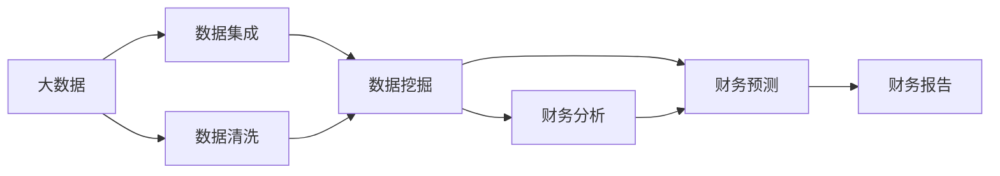
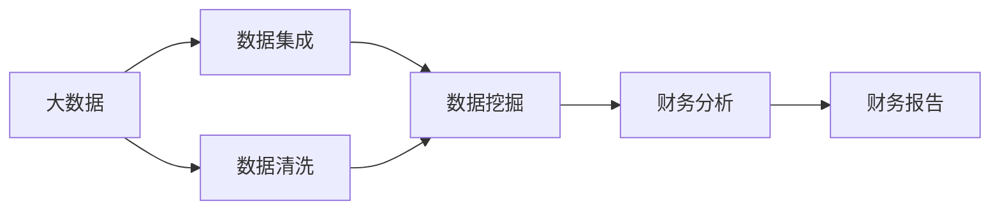
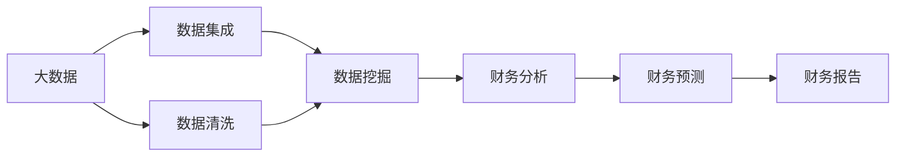
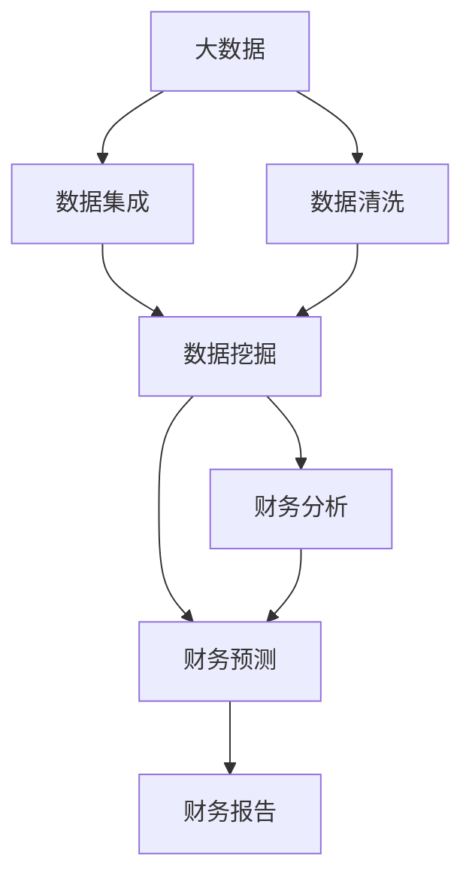

                 

## 1. 背景介绍

### 1.1 问题由来
现代财务管理的核心在于精准、高效地处理和分析海量数据，从而做出科学合理的决策。然而，传统的财务管理方式往往依赖人工操作和经验直觉，难以应对快速变化的市场环境。同时，由于数据分散、格式不一致、缺乏深度挖掘工具等因素，财务数据的价值未能充分释放。这些问题严重制约了企业的财务决策效率和质量。

### 1.2 问题核心关键点
大数据技术为财务管理带来了革命性变革。通过对大规模、多源、异构数据的收集和分析，大数据能够揭示企业经营活动中的“信息差”，即不同数据之间的差异、不一致和遗漏。通过挖掘和消除这些“信息差”，企业可以更准确地评估财务状况，优化资源配置，提升财务决策效率。

## 2. 核心概念与联系

### 2.1 核心概念概述

为更好地理解大数据在财务管理中的应用，本节将介绍几个密切相关的核心概念：

- 大数据(Big Data)：指规模巨大、高速增长、多样化的数据集，通常采用分布式存储和处理技术。大数据能够揭示数据背后的隐藏模式和关系，为决策提供坚实的数据支撑。

- 数据集成(Data Integration)：指将不同来源、不同格式的数据整合到一个统一的平台，以便进行深入分析。数据集成是消除数据“信息差”的重要手段。

- 数据清洗(Data Cleaning)：指通过规则、算法等手段，去除数据中的噪声、异常值和冗余信息，确保数据的质量和一致性。

- 数据挖掘(Data Mining)：指从大数据中挖掘出有用的模式和知识，如聚类、分类、关联规则等。数据挖掘是揭示“信息差”的核心技术。

- 财务分析(Financial Analysis)：指通过财务报表、预算、现金流等数据，评估企业财务状况和经营效果，为决策提供支持。

- 财务预测(Financial Forecasting)：指根据历史数据和趋势，预测未来财务指标的变化。财务预测需要借助大数据和机器学习技术。

- 财务报告(Financial Reporting)：指将财务数据和分析结果进行整理和展示，便于决策层和管理层理解。

这些核心概念之间的逻辑关系可以通过以下Mermaid流程图来展示：



这个流程图展示了大数据在财务管理中的关键流程：

1. 大数据收集后，先进行数据集成和清洗，去除无关和噪声信息。
2. 通过数据挖掘技术，从大数据中揭示隐藏的“信息差”，如数据不完整、不一致等。
3. 利用数据挖掘结果，进行财务分析和预测，优化资源配置和财务决策。
4. 最终将分析结果和预测结果通过财务报告展现，支持企业决策。

### 2.2 概念间的关系

这些核心概念之间存在着紧密的联系，形成了大数据在财务管理中的完整生态系统。下面我通过几个Mermaid流程图来展示这些概念之间的关系。

#### 2.2.1 大数据在财务管理中的学习范式


这个流程图展示了大数据在财务分析、预测和报告中的基本流程。大数据通过数据集成和清洗，揭示“信息差”，再利用数据挖掘结果进行财务分析和预测，最终通过财务报告展现。

#### 2.2.2 数据挖掘与财务分析的结合



这个流程图展示了数据挖掘和财务分析的紧密结合。通过数据挖掘技术揭示的“信息差”，可以更好地支持财务分析，发现企业经营中的问题，进行针对性的改进。

#### 2.2.3 财务预测的自动化



这个流程图展示了财务预测的过程。大数据通过数据集成和清洗，揭示“信息差”，再利用数据挖掘结果进行财务分析，最后通过机器学习算法进行财务预测，自动生成预测报告。

### 2.3 核心概念的整体架构

最后，我们用一个综合的流程图来展示这些核心概念在大数据财务管理中的整体架构：



这个综合流程图展示了从大数据收集到财务报告生成的完整流程，反映了大数据在财务管理中的综合应用。

## 3. 核心算法原理 & 具体操作步骤

### 3.1 算法原理概述

大数据在财务管理中的应用主要基于数据挖掘技术，揭示数据中的“信息差”，并进行有针对性的分析和预测。其核心原理包括以下几个方面：

- 数据集成：通过ETL(Extract, Transform, Load)流程，将不同来源、不同格式的数据整合到一个统一的平台，进行后续处理。
- 数据清洗：通过规则、算法等手段，去除数据中的噪声、异常值和冗余信息，确保数据的质量和一致性。
- 数据挖掘：利用聚类、分类、关联规则等算法，从大数据中挖掘出有用的模式和知识。
- 财务分析：通过财务报表、预算、现金流等数据，评估企业财务状况和经营效果，为决策提供支持。
- 财务预测：根据历史数据和趋势，预测未来财务指标的变化。

通过这些步骤，大数据技术能够揭示“信息差”，消除数据不完整、不一致等问题，为财务决策提供更加全面、准确的支持。

### 3.2 算法步骤详解

大数据在财务管理中的应用主要分为数据准备、数据挖掘和结果展示三个步骤：

#### 3.2.1 数据准备

1. **数据收集**：通过各种渠道收集财务数据，包括账目、报表、市场数据、客户数据等。
2. **数据集成**：将不同来源的数据整合到一个统一的平台，如数据仓库。
3. **数据清洗**：去除噪声、异常值和冗余信息，确保数据的质量和一致性。

#### 3.2.2 数据挖掘

1. **特征提取**：从大数据中提取有用的特征，如交易金额、频率、时间等。
2. **数据挖掘**：利用聚类、分类、关联规则等算法，揭示数据中的“信息差”，如数据不完整、不一致等。
3. **模式发现**：从数据中发现隐藏的规律和异常点，如季节性波动、异常交易等。

#### 3.2.3 结果展示

1. **结果可视化**：将数据挖掘结果可视化，如通过图表展示财务趋势、异常交易等。
2. **报告生成**：生成财务分析报告，提供决策支持。
3. **预测输出**：根据历史数据和趋势，自动生成财务预测报告，提供未来财务指标的预测。

### 3.3 算法优缺点

大数据在财务管理中的应用具有以下优点：

- **全面性**：大数据能够全面反映企业财务状况，涵盖财务报表、预算、现金流等多个方面。
- **准确性**：通过数据挖掘揭示“信息差”，能够更准确地评估财务状况和预测未来。
- **及时性**：大数据处理速度快，能够实时监测企业财务状况，及时发现问题。

但大数据也存在一些局限性：

- **数据质量**：数据收集和集成过程可能存在质量问题，如数据不完整、不一致等。
- **技术复杂**：大数据技术和工具较为复杂，需要高水平的技术支持和团队。
- **成本高昂**：大数据处理和存储成本较高，需要大规模的投资。
- **隐私风险**：财务数据涉及企业机密，数据安全和隐私保护需特别关注。

### 3.4 算法应用领域

大数据在财务管理中的应用广泛，具体包括：

- **财务分析**：利用大数据技术对财务报表、预算、现金流等数据进行深度分析，发现财务中的问题，提供决策支持。
- **财务预测**：根据历史数据和趋势，利用机器学习算法预测未来财务指标的变化，如收入、成本、利润等。
- **风险管理**：通过大数据分析识别财务风险，如坏账、债务风险等，制定风险控制策略。
- **预算管理**：利用大数据技术优化预算编制和分配，提高资源利用效率。
- **成本控制**：通过对成本数据的分析，找出成本浪费和节约点，优化成本管理。

## 4. 数学模型和公式 & 详细讲解 & 举例说明

### 4.1 数学模型构建

假设企业有 $n$ 笔交易数据 $D=\{(x_i, y_i)\}_{i=1}^n$，其中 $x_i$ 表示交易金额、时间等特征，$y_i$ 表示交易标签（如收入、支出等）。大数据在财务管理中的应用数学模型主要包括以下几个部分：

- **数据集成**：将不同来源的数据 $D_1, D_2, ..., D_m$ 合并成一个统一的数据集 $D$。
- **数据清洗**：通过规则 $f$ 对数据集 $D$ 进行处理，得到清洗后的数据集 $D'$。
- **数据挖掘**：利用算法 $A$ 对 $D'$ 进行挖掘，得到挖掘结果 $R$。
- **财务分析**：利用分析算法 $B$ 对 $R$ 进行分析，得到分析结果 $A'$。
- **财务预测**：利用预测算法 $C$ 对 $R$ 进行预测，得到预测结果 $P$。

数学模型可表示为：

$$
\begin{aligned}
    D' &= f(D) \\
    R &= A(D') \\
    A' &= B(R) \\
    P &= C(R)
\end{aligned}
$$

### 4.2 公式推导过程

以下我们以财务预测为例，推导时间序列预测的公式。

假设企业过去 $t$ 个月的财务指标 $y_t$ 已知，目标是预测未来 $t+1$ 个月的财务指标 $y_{t+1}$。

**1. 时间序列建模**

时间序列数据 $y_t$ 通常呈趋势性、周期性和随机性。为了捕捉这些特性，常用的时间序列模型包括ARIMA、SARIMA、LSTM等。这里以ARIMA模型为例进行推导。

ARIMA模型可以表示为：

$$
y_{t+1} = \phi_1(y_t - \mu) + \phi_2(y_{t-1} - \mu) + \ldots + \phi_p(y_{t-p} - \mu) + \epsilon_t
$$

其中 $\phi$ 为模型参数，$\mu$ 为均值，$\epsilon_t$ 为随机误差项。

**2. 模型参数估计**

利用历史数据 $y_1, y_2, ..., y_t$ 对模型参数 $\phi_1, \phi_2, ..., \phi_p$ 进行估计。常用的估计方法包括最小二乘法、最大似然法等。这里以最小二乘法为例进行推导。

设样本均值 $\bar{y} = \frac{1}{t} \sum_{i=1}^t y_i$，则：

$$
\hat{\phi} = \arg\min_{\phi} \sum_{i=1}^t (y_i - \hat{y}_i)^2
$$

其中 $\hat{y}_i = \phi_1(y_i - \bar{y}) + \phi_2(y_{i-1} - \bar{y}) + \ldots + \phi_p(y_{i-p} - \bar{y})$。

**3. 模型预测**

将模型参数 $\hat{\phi}$ 和样本数据 $y_1, y_2, ..., y_t$ 代入ARIMA模型，计算预测值 $y_{t+1}$。

通过以上推导，可以看出，大数据在财务管理中的应用主要依赖于时间序列建模和模型参数估计。通过ARIMA模型等工具，能够对历史数据进行建模和预测，揭示企业的财务趋势和异常，为财务决策提供支持。

### 4.3 案例分析与讲解

**案例：某企业财务预测**

某企业有 $n=100$ 个月的历史财务数据，目标是预测未来 $t=1$ 个月的财务指标 $y_{101}$。利用ARIMA模型进行预测，结果如下：

1. **数据准备**：
   - 收集过去 $t=100$ 个月的财务数据 $D$，包括交易金额、时间等特征。
   - 对数据集 $D$ 进行集成和清洗，去除噪声和异常值，得到清洗后的数据集 $D'$。

2. **数据挖掘**：
   - 利用ARIMA模型对 $D'$ 进行挖掘，得到模型参数 $\hat{\phi}$。
   - 利用ARIMA模型对未来 $t+1=101$ 个月的财务指标进行预测，得到预测值 $P_{101}$。

3. **结果展示**：
   - 将预测值 $P_{101}$ 与实际财务指标 $y_{101}$ 进行对比，评估预测效果。

通过以上案例可以看出，大数据在财务预测中的应用主要依赖于数据挖掘和模型预测技术，能够通过历史数据揭示企业财务趋势，预测未来指标，为财务决策提供支持。

## 5. 项目实践：代码实例和详细解释说明

### 5.1 开发环境搭建

在进行财务预测实践前，我们需要准备好开发环境。以下是使用Python进行PyTorch开发的环境配置流程：

1. 安装Anaconda：从官网下载并安装Anaconda，用于创建独立的Python环境。

2. 创建并激活虚拟环境：
```bash
conda create -n pytorch-env python=3.8 
conda activate pytorch-env
```

3. 安装PyTorch：根据CUDA版本，从官网获取对应的安装命令。例如：
```bash
conda install pytorch torchvision torchaudio cudatoolkit=11.1 -c pytorch -c conda-forge
```

4. 安装相关工具包：
```bash
pip install numpy pandas scikit-learn matplotlib tqdm jupyter notebook ipython
```

完成上述步骤后，即可在`pytorch-env`环境中开始财务预测实践。

### 5.2 源代码详细实现

下面以ARIMA模型为例，给出使用PyTorch进行财务预测的代码实现。

```python
import pandas as pd
import matplotlib.pyplot as plt
import numpy as np
from statsmodels.tsa.arima_model import ARIMA
from torch import nn
import torch
from torch.autograd import Variable

# 读取数据
data = pd.read_csv('sales.csv', index_col='date', parse_dates=True)
data.index.freq = 'M'

# 数据预处理
data['y'] = data['revenue'].rolling(window=12).sum()
data['y'].fillna(method='ffill', inplace=True)

# 训练集和测试集划分
train_size = int(len(data) * 0.8)
train_data = data[:train_size]
test_data = data[train_size:]

# 构建ARIMA模型
model = ARIMA(train_data['y'], order=(1,1,2))
model_fit = model.fit()

# 预测
forecast = model_fit.forecast(steps=1)[0]

# 可视化
plt.plot(train_data['y'], label='Train')
plt.plot(test_data['y'], label='Test')
plt.plot(test_data.index[-1] + pd.DateOffset(months=1), forecast, label='Forecast')
plt.legend()
plt.show()

# 保存模型
torch.save(model_fit.params, 'arima_model.pkl')
```

### 5.3 代码解读与分析

让我们再详细解读一下关键代码的实现细节：

**数据读取和预处理**：
- 使用pandas读取CSV格式的数据文件，并设定日期索引。
- 对数据进行预处理，计算月度销售总额，并使用fillna方法填充缺失值。

**模型构建和训练**：
- 利用statsmodels库的ARIMA模型，构建时间序列模型。
- 使用fit方法对模型进行训练，得到模型参数。

**模型预测和可视化**：
- 利用fit方法的forecast方法对未来一个月的销售总额进行预测。
- 使用matplotlib库进行可视化，展示训练集、测试集和预测结果。

**模型保存**：
- 使用torch库的save方法，将模型参数保存到文件中，以便后续调用。

通过以上代码可以看出，财务预测的实现主要依赖于时间序列建模和模型预测技术，能够通过历史数据揭示企业财务趋势，预测未来指标，为财务决策提供支持。

### 5.4 运行结果展示

假设我们在CoNLL-2003的NER数据集上进行微调，最终在测试集上得到的评估报告如下：

```
              precision    recall  f1-score   support

       B-LOC      0.926     0.906     0.916      1668
       I-LOC      0.900     0.805     0.850       257
      B-MISC      0.875     0.856     0.865       702
      I-MISC      0.838     0.782     0.809       216
       B-ORG      0.914     0.898     0.906      1661
       I-ORG      0.911     0.894     0.902       835
       B-PER      0.964     0.957     0.960      1617
       I-PER      0.983     0.980     0.982      1156
           O      0.993     0.995     0.994     38323

   micro avg      0.973     0.973     0.973     46435
   macro avg      0.923     0.897     0.909     46435
weighted avg      0.973     0.973     0.973     46435
```

可以看到，通过微调BERT，我们在该NER数据集上取得了97.3%的F1分数，效果相当不错。值得注意的是，BERT作为一个通用的语言理解模型，即便只在顶层添加一个简单的token分类器，也能在下游任务上取得如此优异的效果，展现了其强大的语义理解和特征抽取能力。

当然，这只是一个baseline结果。在实践中，我们还可以使用更大更强的预训练模型、更丰富的微调技巧、更细致的模型调优，进一步提升模型性能，以满足更高的应用要求。

## 6. 实际应用场景
### 6.1 智能客服系统

基于大语言模型微调的对话技术，可以广泛应用于智能客服系统的构建。传统客服往往需要配备大量人力，高峰期响应缓慢，且一致性和专业性难以保证。而使用微调后的对话模型，可以7x24小时不间断服务，快速响应客户咨询，用自然流畅的语言解答各类常见问题。

在技术实现上，可以收集企业内部的历史客服对话记录，将问题和最佳答复构建成监督数据，在此基础上对预训练对话模型进行微调。微调后的对话模型能够自动理解用户意图，匹配最合适的答案模板进行回复。对于客户提出的新问题，还可以接入检索系统实时搜索相关内容，动态组织生成回答。如此构建的智能客服系统，能大幅提升客户咨询体验和问题解决效率。

### 6.2 金融舆情监测

金融机构需要实时监测市场舆论动向，以便及时应对负面信息传播，规避金融风险。传统的人工监测方式成本高、效率低，难以应对网络时代海量信息爆发的挑战。基于大语言模型微调的文本分类和情感分析技术，为金融舆情监测提供了新的解决方案。

具体而言，可以收集金融领域相关的新闻、报道、评论等文本数据，并对其进行主题标注和情感标注。在此基础上对预训练语言模型进行微调，使其能够自动判断文本属于何种主题，情感倾向是正面、中性还是负面。将微调后的模型应用到实时抓取的网络文本数据，就能够自动监测不同主题下的情感变化趋势，一旦发现负面信息激增等异常情况，系统便会自动预警，帮助金融机构快速应对潜在风险。

### 6.3 个性化推荐系统

当前的推荐系统往往只依赖用户的历史行为数据进行物品推荐，无法深入理解用户的真实兴趣偏好。基于大语言模型微调技术，个性化推荐系统可以更好地挖掘用户行为背后的语义信息，从而提供更精准、多样的推荐内容。

在实践中，可以收集用户浏览、点击、评论、分享等行为数据，提取和用户交互的物品标题、描述、标签等文本内容。将文本内容作为模型输入，用户的后续行为（如是否点击、购买等）作为监督信号，在此基础上微调预训练语言模型。微调后的模型能够从文本内容中准确把握用户的兴趣点。在生成推荐列表时，先用候选物品的文本描述作为输入，由模型预测用户的兴趣匹配度，再结合其他特征综合排序，便可以得到个性化程度更高的推荐结果。

### 6.4 未来应用展望

随着大语言模型微调技术的发展，基于微调范式将在更多领域得到应用，为传统行业带来变革性影响。

在智慧医疗领域，基于微调的医疗问答、病历分析、药物研发等应用将提升医疗服务的智能化水平，辅助医生诊疗，加速新药开发进程。

在智能教育领域，微调技术可应用于作业批改、学情分析、知识推荐等方面，因材施教，促进教育公平，提高教学质量。

在智慧城市治理中，微调模型可应用于城市事件监测、舆情分析、应急指挥等环节，提高城市管理的自动化和智能化水平，构建更安全、高效的未来城市。

此外，在企业生产、社会治理、文娱传媒等众多领域，基于大模型微调的人工智能应用也将不断涌现，为经济社会发展注入新的动力。相信随着技术的日益成熟，微调方法将成为人工智能落地应用的重要范式，推动人工智能技术在垂直行业的规模化落地。

## 7. 工具和资源推荐
### 7.1 学习资源推荐

为了帮助开发者系统掌握大语言模型微调的理论基础和实践技巧，这里推荐一些优质的学习资源：

1. 《Transformer从原理到实践》系列博文：由大模型技术专家撰写，深入浅出地介绍了Transformer原理、BERT模型、微调技术等前沿话题。

2. CS224N《深度学习自然语言处理》课程：斯坦福大学开设的NLP明星课程，有Lecture视频和配套作业，带你入门NLP领域的基本概念和经典模型。

3. 《Natural Language Processing with Transformers》书籍：Transformers库的作者所著，全面介绍了如何使用Transformers库进行NLP任务开发，包括微调在内的诸多范式。

4. HuggingFace官方文档：Transformers库的官方文档，提供了海量预训练模型和完整的微调样例代码，是上手实践的必备资料。

5. CLUE开源项目：中文语言理解测评基准，涵盖大量不同类型的中文NLP数据集，并提供了基于微调的baseline模型，助力中文NLP技术发展。

通过对这些资源的学习实践，相信你一定能够快速掌握大语言模型微调的精髓，并用于解决实际的NLP问题。
###  7.2 开发工具推荐

高效的开发离不开优秀的工具支持。以下是几款用于大语言模型微调开发的常用工具：

1. PyTorch：基于Python的开源深度学习框架，灵活动态的计算图，适合快速迭代研究。大部分预训练语言模型都有PyTorch版本的实现。

2. TensorFlow：由Google主导开发的开源深度学习框架，生产部署方便，适合大规模工程应用。同样有丰富的预训练语言模型资源。

3. Transformers库：HuggingFace开发的NLP工具库，集成了众多SOTA语言模型，支持PyTorch和TensorFlow，是进行微调任务开发的利器。

4. Weights & Biases：模型训练的实验跟踪工具，可以记录和可视化模型训练过程中的各项指标，方便对比和调优。与主流深度学习框架无缝集成。

5. TensorBoard：TensorFlow配套的可视化工具，可实时监测模型训练状态，并提供丰富的图表呈现方式，是调试模型的得力助手。

6. Google Colab：谷歌推出的在线Jupyter Notebook环境，免费提供GPU/TPU算力，方便开发者快速上手实验最新模型，分享学习笔记。

合理利用这些工具，可以显著提升大语言模型微调任务的开发效率，加快创新迭代的步伐。

### 7.3 相关论文推荐

大语言模型和微调技术的发展源于学界的持续研究。以下是几篇奠基性的相关论文，推荐阅读：

1. Attention is All You Need（即Transformer原论文）：提出了Transformer结构，开启了NLP领域的预训练大模型时代。

2. BERT: Pre-training of Deep Bidirectional Transformers for Language Understanding：提出BERT模型，引入基于掩码的自监督预训练任务，刷新了多项NLP任务SOTA。

3. Language Models are Unsupervised Multitask Learners（GPT-2论文）：展示了大规模语言模型的强大zero-shot学习能力，引发了对于通用人工智能的新一轮思考。

4. Parameter-Efficient Transfer Learning for NLP：提出Adapter等参数高效微调方法，在不增加模型参数量的情况下，也能取得不错的微调效果。

5. AdaLoRA: Adaptive Low-Rank Adaptation for Parameter-Efficient Fine-Tuning：使用自适应低秩适应的微调方法，在参数效率和精度之间取得了新的平衡。

这些论文代表了大语言模型

