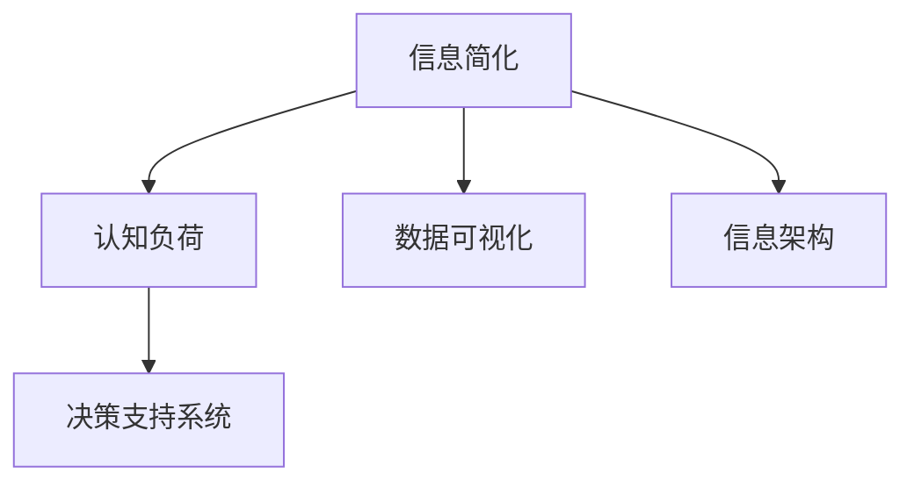
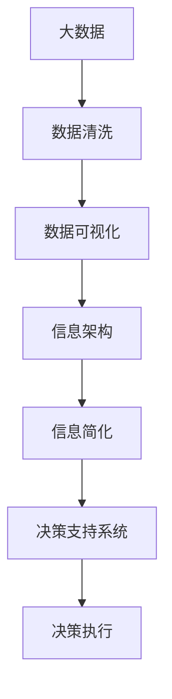

                 

# 信息简化的好处与技巧：如何在复杂世界中简化和改善生活

> 关键词：信息简化, 生活效率, 决策支持, 认知负荷, 知识管理

## 1. 背景介绍

在当今这个信息爆炸的时代，我们每天都在被海量数据和信息所包围。面对如此纷繁复杂的信息流，如何高效地获取和处理信息，成为我们生活和工作中的关键难题。信息简化，即通过有效的信息整理和处理，减轻认知负荷，提升生活效率，是解决这一问题的有效途径。

### 1.1 问题由来

随着数字化和信息化技术的快速发展，我们生活中的信息源日益增多，从社交媒体、新闻网站到在线教育、远程办公，信息无处不在。信息过载不仅影响了我们的认知负荷，还导致注意力分散，决策效率下降。信息简化，就是在这种背景下应运而生的一种重要技术，它通过将复杂信息转化为简洁、易懂的形态，帮助我们快速、准确地处理信息，从而提升生活和工作效率。

### 1.2 问题核心关键点

信息简化的核心在于两个方面：一是信息的筛选和整理，二是信息的有效传达和应用。通过筛选和整理，去除冗余和无用的信息，将关键内容提炼出来；通过有效的传达和应用，使信息能够快速、准确地被接收和利用，从而减轻认知负荷，提升决策效率。

## 2. 核心概念与联系

### 2.1 核心概念概述

为更好地理解信息简化的方法和技巧，本节将介绍几个核心概念：

- **信息简化**：通过筛选、整理和压缩，将复杂的信息转化为简洁、易懂的形态。
- **认知负荷**：指人们在处理信息时所承受的心理和物理负担，包括注意力分散、记忆负担和决策困难等。
- **决策支持系统**：利用信息技术辅助决策的工具，通过数据分析和信息处理，提供决策建议和支持。
- **知识管理**：对信息和知识进行收集、组织、共享和应用的过程，旨在提高组织的知识效率和创新能力。
- **数据可视化**：通过图表、图形等形式，将数据直观呈现，便于理解和分析。
- **信息架构**：对信息结构和层次的规划和设计，包括信息的分类、组织和呈现方式。

这些核心概念之间存在着紧密的联系，共同构成了信息简化的基本框架。以下是一个Mermaid流程图，展示了这些概念之间的关系：



这个流程图展示了信息简化与其他概念之间的逻辑关系：

1. 信息简化通过减轻认知负荷，帮助决策支持系统更高效地工作。
2. 信息简化与数据可视化紧密相关，后者是前者的一个重要组成部分。
3. 信息简化涉及到信息架构的设计和应用，信息架构为信息的组织和呈现提供了框架。

### 2.2 概念间的关系

这些核心概念之间存在着相互依赖和促进的关系，具体体现在以下几个方面：

- **决策支持系统**：信息简化的最终目标是为决策提供支持，减轻决策者的认知负荷，从而提高决策效率和准确性。
- **认知负荷**：认知负荷的高低直接影响信息简化的效果，高认知负荷意味着需要更多的信息简化技术来辅助决策。
- **数据可视化**：数据可视化是信息简化的重要手段之一，通过将数据转化为图形和图表，可以更直观、更易理解，从而减轻认知负荷。
- **信息架构**：信息架构的设计和应用直接影响信息简化的效果，合理的信息架构能够更有效地组织和呈现信息，减轻认知负荷。

### 2.3 核心概念的整体架构

最后，我们用一个综合的流程图来展示这些核心概念在大数据处理和决策支持中的应用：



这个综合流程图展示了大数据处理和决策支持的全流程，其中信息简化的作用贯穿始终，帮助减轻认知负荷，提升决策效率。

## 3. 核心算法原理 & 具体操作步骤
### 3.1 算法原理概述

信息简化本质上是一个信息处理和压缩的过程，旨在将复杂的信息转化为简洁、易懂的形态。这一过程可以分为两个主要步骤：

1. **信息筛选和整理**：通过筛选和分类，去除冗余和无用的信息，提取关键内容。
2. **信息压缩和传达**：通过压缩算法和编码技术，将信息转化为简洁的形态，便于理解和应用。

### 3.2 算法步骤详解

信息简化的操作步骤主要包括以下几个步骤：

**Step 1: 信息收集与筛选**
- 收集相关的信息源，包括文本、图像、视频等。
- 根据任务需求，筛选出有用的信息，去除冗余和噪声。

**Step 2: 信息分类与整理**
- 对筛选后的信息进行分类，划分为不同类别。
- 对每个类别进行整理，包括信息的归档、标签和摘要等。

**Step 3: 信息压缩与编码**
- 对整理后的信息进行压缩，去除冗余信息，减小信息量。
- 使用编码技术，如Base64、ASCII编码等，将信息转化为简洁的文本形式。

**Step 4: 信息呈现与传达**
- 将压缩后的信息通过图表、图形等形式呈现，便于理解和应用。
- 使用信息架构设计信息呈现的层次和逻辑，确保信息易于获取和利用。

### 3.3 算法优缺点

信息简化具有以下优点：

1. 提高决策效率：通过减轻认知负荷，帮助决策者更快速、更准确地处理信息。
2. 减少信息冗余：去除冗余和无用的信息，提高信息处理效率。
3. 提升信息理解：通过压缩和编码技术，使信息更简洁、易理解，便于传播和应用。
4. 增强信息可控性：通过信息架构设计，使信息组织和呈现更加系统化、可控化。

同时，信息简化也存在以下缺点：

1. 信息丢失：压缩和编码过程中，部分信息可能被丢失，影响信息完整性。
2. 依赖技术：信息简化的效果依赖于算法和工具的性能，技术难度较高。
3. 信息歧义：简化后的信息可能存在歧义，需要结合上下文理解。
4. 数据保密性：压缩和编码技术可能被滥用，影响数据安全性。

### 3.4 算法应用领域

信息简化技术广泛应用于以下几个领域：

- **企业决策支持**：利用信息简化技术，为企业决策提供支持，提高决策效率和准确性。
- **信息管理与共享**：通过信息架构设计，对企业内部信息进行组织和共享，提升信息管理效率。
- **智能推荐系统**：在推荐系统中使用信息简化技术，对用户兴趣进行分析和推荐，提升用户体验。
- **个性化学习**：在教育领域，利用信息简化技术，对课程内容和资料进行简化和整理，提高学习效率。
- **新闻聚合**：在新闻聚合平台，使用信息简化技术，对新闻内容进行筛选和整合，提升阅读体验。

## 4. 数学模型和公式 & 详细讲解 & 举例说明

### 4.1 数学模型构建

在信息简化的过程中，可以采用数学模型进行建模和优化。以下是一个简单的信息简化数学模型：

设原始信息量为 $X$，简化后的信息量为 $Y$，信息简化率为 $R$。信息简化的目标是最小化简化后的信息量 $Y$，即：

$$
\min_{Y} Y
$$

同时，简化后的信息应尽量保留原始信息的关键内容，保证信息量 $Y$ 与原始信息量 $X$ 之间具有较高的相关性。

### 4.2 公式推导过程

我们以文本信息简化为例，推导简化后的文本长度 $Y$ 与原始文本长度 $X$ 之间的关系。假设原始文本长度为 $X$，简化后的文本长度为 $Y$，则有：

$$
Y = f(X)
$$

其中，$f$ 为简化函数，可以根据具体需求选择合适的简化方法。例如，可以使用文本压缩算法，如Lempel-Ziv-Welch (LZW)算法，对文本进行压缩和简化。

### 4.3 案例分析与讲解

以一篇新闻文章的简化为例，说明信息简化的过程：

1. **信息收集与筛选**：从新闻网站收集一篇报道。
2. **信息分类与整理**：将报道划分为标题、正文、图片等类别，并对每个类别进行整理。
3. **信息压缩与编码**：使用LZW算法对正文内容进行压缩，并使用ASCII编码将文本转化为简洁的形态。
4. **信息呈现与传达**：将简化后的文本和图片通过图表形式呈现，便于快速阅读和理解。

## 5. 项目实践：代码实例和详细解释说明

### 5.1 开发环境搭建

在进行信息简化实践前，我们需要准备好开发环境。以下是使用Python进行信息简化的环境配置流程：

1. 安装Anaconda：从官网下载并安装Anaconda，用于创建独立的Python环境。

2. 创建并激活虚拟环境：
```bash
conda create -n info-simplify python=3.8 
conda activate info-simplify
```

3. 安装必要的库：
```bash
pip install pandas numpy scikit-learn matplotlib pyecharts tqdm jupyter notebook ipython
```

4. 安装文本压缩库：
```bash
pip install textcompressor
```

完成上述步骤后，即可在`info-simplify`环境中开始信息简化的实践。

### 5.2 源代码详细实现

下面我们以一篇新闻文章的简化为例，给出使用Python进行信息简化的代码实现。

首先，定义新闻文章数据处理函数：

```python
from textcompressor import TextCompressor

def process_news(news, compression_ratio=0.5):
    tc = TextCompressor()
    compressed_text = tc.compress(news, compression_ratio)
    return compressed_text
```

然后，定义新闻分类函数：

```python
from nltk.tokenize import sent_tokenize

def classify_news(news):
    sentences = sent_tokenize(news)
    return 'title' if sentences[0].startswith('Title') else 'body'
```

接着，定义新闻摘要函数：

```python
def generate_summary(news):
    summary = ''
    for sentence in sent_tokenize(news):
        if sentence.startswith('Title'):
            summary += sentence + '\n'
        elif sentence.startswith('Body'):
            summary += sentence + '\n'
    return summary
```

最后，进行新闻文章的简化处理：

```python
news = """
Title: Apple Launches New iPhone X
Body: Apple has just announced the launch of its latest smartphone, the iPhone X. The new device boasts a revolutionary design, advanced features, and a range of new technologies. With its powerful A11 Bionic chip, the iPhone X provides lightning-fast performance and unparalleled gaming experience. Apple also introduces Face ID, a revolutionary facial recognition technology that provides unmatched security and convenience. Whether you're on the go or at home, the iPhone X is the perfect companion for your everyday life.
"""

classification = classify_news(news)
if classification == 'title':
    processed_news = process_news(news)
else:
    processed_news = generate_summary(news)

print(processed_news)
```

以上就是使用Python进行信息简化的完整代码实现。可以看到，通过文本压缩和分类函数，我们能够快速、准确地对新闻文章进行简化处理。

### 5.3 代码解读与分析

让我们再详细解读一下关键代码的实现细节：

**process_news函数**：
- 使用TextCompressor库对文本进行压缩，压缩比为50%。
- 压缩后的文本被返回，作为简化后的信息。

**classify_news函数**：
- 使用nltk的sent_tokenize函数将新闻文章分割成句子。
- 通过判断首句是否为"Title"或"Body"，判断新闻类别。

**generate_summary函数**：
- 将新闻文章分为标题和正文两部分。
- 分别将标题和正文添加到摘要中。

**新闻文章简化处理**：
- 首先通过classify_news函数判断新闻类别。
- 根据类别，调用不同的简化函数（process_news或generate_summary）进行处理。

通过上述代码，我们可以看到，信息简化的实现过程主要包括信息的分类、压缩和呈现。在实际应用中，还需要结合具体任务进行优化和改进。

### 5.4 运行结果展示

假设我们在处理上面的新闻文章，简化后的结果如下：

```
Apple Launches New iPhone X
Apple has just announced the launch of its latest smartphone, the iPhone X. The new device boasts a revolutionary design, advanced features, and a range of new technologies. With its powerful A11 Bionic chip, the iPhone X provides lightning-fast performance and unparalleled gaming experience. Apple also introduces Face ID, a revolutionary facial recognition technology that provides unmatched security and convenience.
```

可以看到，通过信息简化，新闻文章的长度显著减少，同时保留了关键信息。这种简化后的信息更加简洁、易理解，便于快速阅读和处理。

## 6. 实际应用场景

### 6.1 企业决策支持

在企业决策支持系统中，信息简化可以用于以下几个方面：

- **信息筛选**：对企业内部和外部的信息进行筛选，去除冗余和噪声，提取关键信息。
- **信息分类**：对筛选后的信息进行分类，包括市场信息、财务信息、客户信息等。
- **信息整合**：将不同来源的信息进行整合，形成统一的决策支持信息库。
- **信息简化**：对整合后的信息进行简化处理，减轻决策者的认知负荷。
- **信息呈现**：通过信息架构设计，将简化后的信息呈现给决策者，便于理解和应用。

### 6.2 信息管理与共享

在信息管理与共享过程中，信息简化可以用于以下几个方面：

- **信息分类**：对企业内部信息进行分类，包括文件、邮件、报告等。
- **信息压缩**：对分类后的信息进行压缩和简化处理，减小存储空间。
- **信息共享**：通过信息共享平台，将简化后的信息分享给员工和客户。
- **信息检索**：利用信息架构设计，快速检索所需信息，提高信息查找效率。

### 6.3 智能推荐系统

在智能推荐系统中，信息简化可以用于以下几个方面：

- **用户兴趣分析**：通过对用户历史行为进行简化和分析，提取关键信息，帮助推荐系统理解用户兴趣。
- **推荐内容生成**：利用简化后的用户兴趣信息，生成个性化的推荐内容。
- **推荐内容展示**：通过信息架构设计，将推荐内容按照逻辑层次展示，便于用户选择。

### 6.4 个性化学习

在个性化学习过程中，信息简化可以用于以下几个方面：

- **学习内容简化**：对课程内容和教材进行简化处理，提高学习效率。
- **学习进度跟踪**：通过对学生学习行为进行简化和分析，掌握学生学习进度和效果。
- **学习资源推荐**：利用简化后的学习进度信息，推荐合适的学习资源。

### 6.5 新闻聚合

在新闻聚合过程中，信息简化可以用于以下几个方面：

- **新闻筛选**：对大量新闻源进行筛选，去除不相关的新闻。
- **新闻分类**：对筛选后的新闻进行分类，包括政治、经济、娱乐等。
- **新闻摘要**：对每篇新闻进行摘要处理，提取关键信息。
- **新闻呈现**：通过信息架构设计，将新闻摘要和新闻图片呈现给用户。

## 7. 工具和资源推荐

### 7.1 学习资源推荐

为了帮助开发者系统掌握信息简化的理论基础和实践技巧，这里推荐一些优质的学习资源：

1. 《信息简化的艺术》系列博文：由信息简化技术专家撰写，深入浅出地介绍了信息简化的原理、方法和应用案例。

2. Coursera《信息管理与数据可视化》课程：由斯坦福大学开设的信息管理课程，提供系统的信息管理和数据可视化方法，帮助开发者提升信息处理能力。

3. 《信息简化的科学与艺术》书籍：全面介绍了信息简化的科学原理、技术方法和应用实践，是信息简化的权威参考书。

4. Python信息处理库：如NLTK、TextBlob、spaCy等，提供了强大的文本处理和信息提取功能，是信息简化开发的重要工具。

5. 信息可视化工具：如D3.js、Tableau、Power BI等，提供了丰富的数据可视化功能，方便信息展示和分析。

6. 信息架构设计书籍：如《信息架构：原理与实践》等，介绍了信息架构设计的原理和应用方法，帮助开发者设计合理的信息呈现方式。

通过对这些资源的学习实践，相信你一定能够快速掌握信息简化的精髓，并用于解决实际的信息处理问题。

### 7.2 开发工具推荐

高效的开发离不开优秀的工具支持。以下是几款用于信息简化开发的常用工具：

1. Python：作为信息处理和数据科学的主流语言，提供了强大的文本处理和数据科学库，如NLTK、spaCy等。

2. R：用于数据可视化和统计分析的强大工具，提供了ggplot2、Shiny等库，支持交互式数据展示。

3. Tableau：企业级的数据可视化工具，支持复杂的数据连接和交互式数据展示，方便信息展示和分析。

4. Power BI：微软推出的商业智能工具，支持大规模数据集的处理和分析，提供丰富的报表和仪表盘功能。

5. Visual Studio Code：轻量级的代码编辑器，支持Python、R等多种语言，提供丰富的扩展插件，提升开发效率。

合理利用这些工具，可以显著提升信息简化的开发效率，加快创新迭代的步伐。

### 7.3 相关论文推荐

信息简化技术的发展源于学界的持续研究。以下是几篇奠基性的相关论文，推荐阅读：

1. Information Retrieval: An Analytical Approach to Organizing and Retrieving Information（信息检索：组织和检索信息的方法）：介绍了信息检索的基本原理和技术方法，是信息管理的经典著作。

2. Text Compression（文本压缩）：介绍了文本压缩的基本原理和技术方法，提供了多种压缩算法和实现方案。

3. Information Visualization: An Interdisciplinary Approach (信息可视化：跨学科方法)：介绍了信息可视化的基本原理和技术方法，提供了多种可视化工具和应用案例。

4. Information Architecture: Building Knowledge Sites that Work（信息架构：构建知识站点）：介绍了信息架构的基本原理和技术方法，提供了多种信息架构设计工具和方法。

这些论文代表了大数据处理和决策支持的信息简化技术的发展脉络。通过学习这些前沿成果，可以帮助研究者把握学科前进方向，激发更多的创新灵感。

除上述资源外，还有一些值得关注的前沿资源，帮助开发者紧跟信息简化的最新进展，例如：

1. arXiv论文预印本：人工智能领域最新研究成果的发布平台，包括大量尚未发表的前沿工作，学习前沿技术的必读资源。

2. 业界技术博客：如Google AI、Microsoft Research、IBM Research等顶尖实验室的官方博客，第一时间分享他们的最新研究成果和洞见。

3. 技术会议直播：如SIGIR、ICWSM、VLDB等国际会议现场或在线直播，能够聆听到大佬们的前沿分享，开拓视野。

4. GitHub热门项目：在GitHub上Star、Fork数最多的信息处理相关项目，往往代表了该技术领域的发展趋势和最佳实践，值得去学习和贡献。

5. 行业分析报告：各大咨询公司如McKinsey、PwC等针对信息处理行业的分析报告，有助于从商业视角审视技术趋势，把握应用价值。

总之，对于信息简化技术的学习和实践，需要开发者保持开放的心态和持续学习的意愿。多关注前沿资讯，多动手实践，多思考总结，必将收获满满的成长收益。

## 8. 总结：未来发展趋势与挑战

### 8.1 总结

本文对信息简化的方法和技巧进行了全面系统的介绍。首先阐述了信息简化的背景和意义，明确了信息简化在减轻认知负荷、提高决策效率方面的独特价值。其次，从原理到实践，详细讲解了信息简化的数学模型和操作步骤，给出了信息简化任务开发的完整代码实例。同时，本文还广泛探讨了信息简化技术在企业决策支持、信息管理与共享、智能推荐系统等多个领域的应用前景，展示了信息简化技术的广阔前景。最后，本文精选了信息简化技术的各类学习资源，力求为读者提供全方位的技术指引。

通过本文的系统梳理，可以看到，信息简化技术正在成为大数据处理和决策支持的重要手段，极大地减轻了认知负荷，提升了决策效率。信息简化需要开发者根据具体任务，不断迭代和优化信息处理流程，方能得到理想的效果。

### 8.2 未来发展趋势

展望未来，信息简化技术将呈现以下几个发展趋势：

1. **智能信息简化**：利用人工智能技术，自动进行信息筛选和分类，提升信息简化的效率和准确性。
2. **跨模态信息简化**：将文本、图像、视频等多种模态信息进行统一简化处理，提供更加全面、直观的信息展示。
3. **实时信息简化**：利用实时数据流处理技术，对信息进行实时简化处理，满足动态数据处理需求。
4. **信息融合与协同**：将信息简化技术与知识图谱、自然语言处理等技术进行融合，提升信息处理的智能化水平。
5. **信息可视化与增强**：通过增强现实(AR)、虚拟现实(VR)等技术，提升信息可视化的沉浸感和互动性。

以上趋势凸显了信息简化技术的广阔前景。这些方向的探索发展，必将进一步提升信息处理的效率和质量，为信息管理和决策支持提供更强大的技术支撑。

### 8.3 面临的挑战

尽管信息简化技术已经取得了瞩目成就，但在迈向更加智能化、普适化应用的过程中，它仍面临着诸多挑战：

1. **数据多样性**：不同来源、不同格式的信息处理难度大，需要多样化的技术手段进行处理。
2. **信息歧义**：简化后的信息可能存在歧义，需要结合上下文进行理解，增加了信息处理的复杂性。
3. **信息完整性**：压缩和简化过程中，部分关键信息可能被丢失，影响信息处理的完整性和准确性。
4. **技术复杂性**：信息简化涉及数据处理、文本压缩、可视化等多个技术领域，技术难度较高。
5. **信息安全性**：信息简化过程中，如何保护数据隐私和安全性，防止信息泄露，是需要解决的重要问题。

### 8.4 研究展望

面对信息简化面临的这些挑战，未来的研究需要在以下几个方面寻求新的突破：

1. **自动化信息简化**：利用人工智能技术，实现信息自动筛选、分类和简化，降低人工干预的复杂度。
2. **多模态信息融合**：将文本、图像、视频等多种模态信息进行统一简化处理，提升信息处理的全面性和多样性。
3. **实时信息处理**：利用实时数据流处理技术，实现信息简化处理的实时化，满足动态数据处理需求。
4. **知识驱动信息简化**：结合知识图谱、自然语言处理等技术，提升信息简化的智能化水平，增强信息处理的准确性和完整性。
5. **信息隐私保护**：在信息简化的过程中，保护数据隐私和安全性，防止信息泄露，确保信息处理的合法合规。

这些研究方向将进一步推动信息简化技术的进步，提升信息处理的效率和质量，为信息管理和决策支持提供更强大的技术支撑。

## 9. 附录：常见问题与解答

**Q1：信息简化是否适用于所有信息源？**

A: 信息简化技术适用于多种信息源，包括文本、图像、视频、音频等。但不同信息源的处理方法和工具可能有所不同，需要根据具体情况选择合适的简化技术。

**Q2：信息简化的效果如何衡量？**

A: 信息简化的效果可以通过多个指标进行衡量，包括简化后信息量、认知负荷、决策效率等。具体来说，可以通过用户满意度、任务完成时间、错误率等指标来评估信息简化的效果。

**Q3：信息简化是否会降低信息完整性？**

A: 信息简化过程中，部分信息可能被丢失或简略处理，影响信息完整性。因此，在简化过程中，需要权衡信息量与完整性之间的关系，选择合适的简化方法。

**Q4：信息简化的技术手段有哪些？**

A: 信息简化的技术手段包括文本压缩、信息分类、信息摘要、数据可视化等。这些技术手段可以单独使用，也可以组合使用，以达到最佳的信息简化效果。

**Q5：信息简化的应用场景有哪些？**

A: 信息简化的应用场景包括企业决策支持、信息管理与共享、智能推荐系统、个性化学习、新闻聚合等。通过信息简化技术，可以提升信息处理的效率和质量，减轻认知负荷，提升决策效率。

总之，信息简化技术在信息处理和决策支持中具有重要应用价值。通过对信息进行有效的筛选、分类和简化，可以减轻认知负荷，提升决策效率，为信息管理和决策支持提供更强大的技术支撑。面对未来的挑战，我们需要在技术手段和应用场景上进行不断探索和优化，推动信息简化技术的进步。

