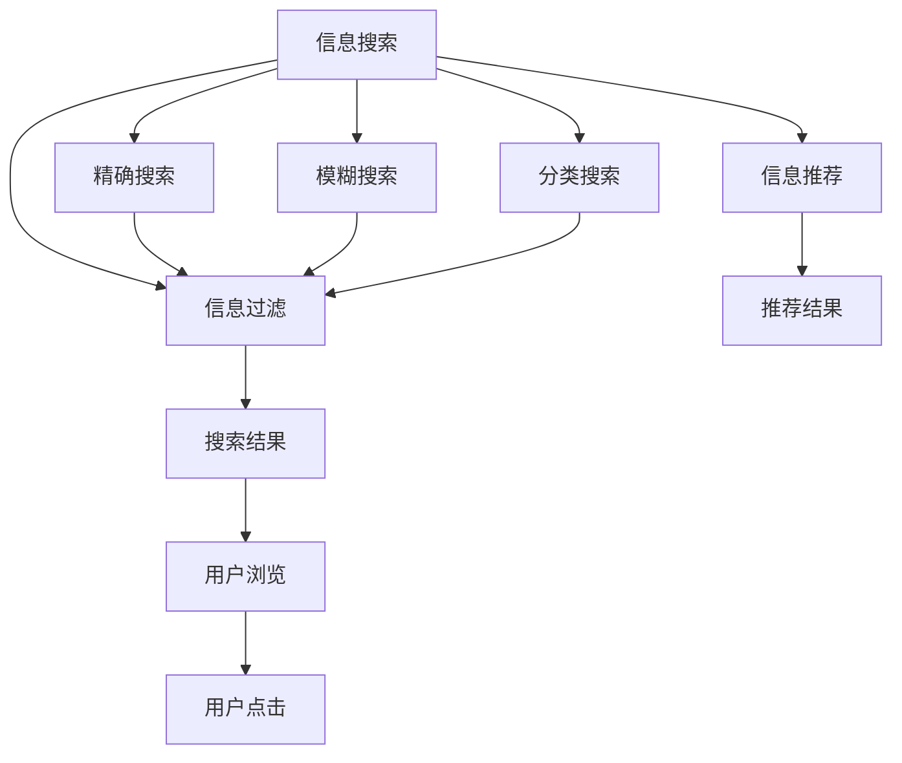
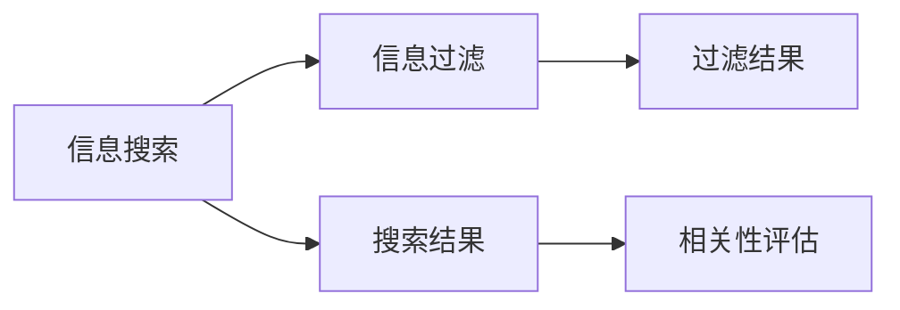
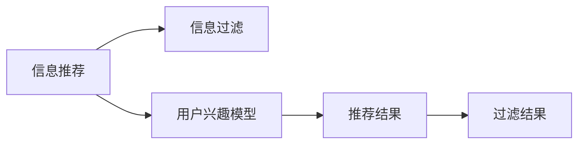
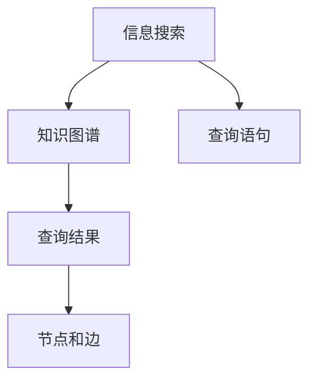
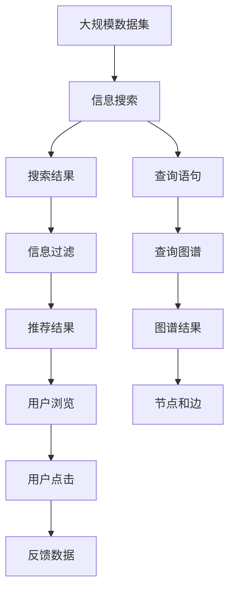

                 

# 信息过载与信息搜索策略与指南：在庞大的信息海洋中找到所需信息

在现代社会，信息量呈爆炸式增长。据统计，人类在过去30年积累的信息量，比过去2000年积累的信息量还要多。面对如此庞大数据量，人们如何筛选、组织和利用这些信息成为了一大难题。信息过载（Information Overload）是指在众多信息中，我们无法有效筛选和吸收相关信息，导致认知负担增加，决策效率下降。解决这一问题的关键在于掌握有效的信息搜索策略与方法，以在信息海洋中准确高效地找到所需信息。本文将全面介绍信息过载的核心概念、数学模型、关键算法及具体应用，并给出相应的工具和资源推荐。

## 1. 背景介绍

### 1.1 问题由来

随着互联网的迅速发展，搜索引擎如Google、Bing等变得无处不在，人们对搜索引擎的依赖程度日益加深。然而，搜索引擎在帮助人们获取信息的同时，也带来了信息过载的问题。海量的搜索结果使得用户往往无从下手，误点信息导致信息获取效率低下，严重影响了人们的生活和工作效率。

### 1.2 问题核心关键点

解决信息过载问题的关键在于高效的信息搜索策略。高效的搜索策略能够帮助用户从海量数据中快速找到所需信息，同时避免误点信息带来的干扰。常见的搜索策略包括精确搜索、模糊搜索、全文搜索、分类搜索等，每种方法都有其特定的应用场景和优缺点。

### 1.3 问题研究意义

掌握高效的信息搜索策略，不仅能提高个人的信息获取效率，还能为企业、政府等机构在信息管理、决策制定等方面提供有力支持。通过优化信息搜索过程，可以大幅提升数据利用效率，实现信息价值最大化。

## 2. 核心概念与联系

### 2.1 核心概念概述

为了深入理解信息搜索策略，本节将介绍几个关键概念：

- 信息搜索（Information Retrieval）：从大量数据中检索出满足用户需求的相关信息的过程。常见的信息搜索方法包括精确搜索、模糊搜索、分类搜索等。

- 信息过滤（Information Filtering）：对搜索结果进行筛选和排序，优先展示最相关和有用的信息。

- 信息推荐（Information Recommendation）：通过机器学习等技术，预测用户可能感兴趣的信息，主动推送给用户。

- 知识图谱（Knowledge Graph）：将各种信息结构化后，以图形化的方式展示，便于用户进行查询和推理。

这些概念之间的关系可以通过以下Mermaid流程图来展示：



这个流程图展示了信息搜索过程的不同环节及关键概念之间的关系。从信息搜索开始，经过精确、模糊、分类等多种方式获取结果，再通过信息过滤和信息推荐等方式优化展示，最终实现用户对信息的浏览和点击。

### 2.2 概念间的关系

这些核心概念之间存在着紧密的联系，形成了信息搜索的完整生态系统。下面我通过几个Mermaid流程图来展示这些概念之间的关系。

#### 2.2.1 信息搜索与信息过滤的关系



这个流程图展示了信息搜索与信息过滤的基本流程。在信息搜索获取结果后，通过相关性评估等手段对结果进行过滤，优先展示最相关和有用的信息。

#### 2.2.2 信息推荐与信息过滤的关系



这个流程图展示了信息推荐与信息过滤的结合应用。信息推荐系统通过预测用户兴趣，生成推荐结果，再通过信息过滤手段优化展示效果。

#### 2.2.3 信息搜索与知识图谱的关系



这个流程图展示了信息搜索与知识图谱的结合应用。通过构建知识图谱，将结构化信息展示给用户，用户可以更方便地进行查询和推理。

### 2.3 核心概念的整体架构

最后，我们用一个综合的流程图来展示这些核心概念在大规模信息搜索中的整体架构：



这个综合流程图展示了从大规模数据集到用户点击的完整信息搜索过程。通过信息搜索获取结果，再通过信息过滤和信息推荐优化展示效果，同时收集用户反馈数据以持续改进。此外，查询语句和知识图谱的结合，进一步提升了信息搜索的准确性和效率。

## 3. 核心算法原理 & 具体操作步骤

### 3.1 算法原理概述

信息搜索的核心算法包括：

- 倒排索引（Inverted Index）：将文档中的关键词映射到包含该关键词的文档列表中，用于实现高效的全文搜索。

- TF-IDF（Term Frequency-Inverse Document Frequency）：用于计算关键词的重要程度，常用于排序和权重计算。

- 布尔检索（Boolean Retrieval）：通过布尔表达式匹配查询条件，实现精确搜索。

- BM25（Okapi Best Match）：一种广泛应用于信息检索的算法，用于衡量查询与文档的相关性。

- 隐马尔可夫模型（Hidden Markov Model, HMM）：常用于分类检索，将文档序列建模为隐含状态序列，通过状态转移概率和观测概率计算文档相关性。

### 3.2 算法步骤详解

以下是信息搜索的详细操作步骤：

**Step 1: 构建倒排索引**

- 对文本数据进行分词和预处理。
- 统计每个词在每个文档中出现的频率。
- 将每个词和包含它的文档列表建立映射关系，生成倒排索引。

**Step 2: 计算TF-IDF权重**

- 统计每个词在每个文档中出现的频率。
- 计算每个词在文档集合中的逆文档频率，得到TF-IDF权重。

**Step 3: 使用BM25算法计算相关性**

- 根据查询词在倒排索引中获取相关文档列表。
- 计算每个文档与查询的相关性，得到BM25分数。
- 根据BM25分数对文档进行排序，选择前N个结果。

**Step 4: 信息过滤**

- 对搜索结果进行去重和过滤，去除不相关或重复结果。
- 通过文本分类、主题建模等手段，进一步优化结果展示。

**Step 5: 信息推荐**

- 构建用户兴趣模型，预测用户可能感兴趣的信息。
- 将推荐结果与搜索结果合并，优先展示推荐信息。

**Step 6: 用户反馈与模型优化**

- 收集用户点击和浏览行为数据，生成反馈数据。
- 根据反馈数据，不断调整和优化信息搜索算法和模型。

### 3.3 算法优缺点

信息搜索算法具有以下优点：

- 高效性：通过倒排索引等数据结构，实现高效的文档检索和排序。
- 精确性：通过TF-IDF和BM25等算法，实现较高的查询相关性。
- 可扩展性：可以处理大规模数据集，适用于各种应用场景。

同时，这些算法也存在以下缺点：

- 计算复杂度高：需要构建倒排索引和计算TF-IDF等权重，计算复杂度较高。
- 泛化能力弱：对特定领域数据集和查询词的泛化能力较弱。
- 需要大量标注数据：部分算法如分类检索需要标注数据进行训练，标注成本较高。

### 3.4 算法应用领域

信息搜索算法在以下领域得到广泛应用：

- 搜索引擎：如Google、Bing等，通过信息搜索和推荐实现用户查询。
- 信息管理：企业、政府等机构使用信息搜索系统进行知识管理、文档检索。
- 电子商务：电商平台通过信息搜索和推荐，提高商品曝光率和转化率。
- 学术研究：学术机构使用信息搜索系统进行文献检索和知识发现。
- 娱乐行业：在线视频平台通过信息搜索和推荐，提高用户粘性和满意度。

## 4. 数学模型和公式 & 详细讲解 & 举例说明

### 4.1 数学模型构建

假设有一篇文档$d$和查询$q$，它们之间通过TF-IDF权重计算相关性。假设词$t$在文档$d$中的出现频率为$tf_{d,t}$，在所有文档中出现频率为$tf_{\text{all},t}$，文档$d$在整个文档集合中的逆文档频率为$df_{d}$，查询$q$的TF-IDF权重为$w_q$。

则文档$d$和查询$q$的相关性$C_{d,q}$计算如下：

$$
C_{d,q} = \frac{w_q \cdot \sum_{t \in d} tf_{d,t} \cdot df_t}{\sum_{d \in D} \sum_{t \in d} tf_{d,t} \cdot df_t}
$$

其中$tf_{d,t}$表示词$t$在文档$d$中的出现频率，$df_t$表示词$t$的逆文档频率，$D$表示文档集合。

### 4.2 公式推导过程

在上述公式中，$tf_{d,t}$和$tf_{\text{all},t}$分别表示词$t$在文档$d$和所有文档中的出现频率。$df_t$表示词$t$的逆文档频率，用于衡量词在文档集合中的重要性。

$$
tf_{d,t} = \frac{\text{词频}}{\text{词长}}
$$

$$
tf_{\text{all},t} = \frac{\text{词频}}{\text{文档数}}
$$

$$
df_t = \log{\frac{1}{1+\sum_{d \in D} tf_{d,t}}}
$$

其中，$\text{词频}$表示词$t$在文档中出现的次数，$\text{词长}$表示文档长度，$\text{文档数}$表示文档集合中的文档数量。

### 4.3 案例分析与讲解

假设我们有一篇文档$d_1$和查询$q$，文档内容为：

```
Python是一种高级编程语言，具有简单易学、功能强大、可移植性高、社区支持强大等特点。
```

查询内容为：

```
Python 编程语言 简单易学
```

则通过TF-IDF计算，可以得到查询和文档的相关性分数如下：

```
tf_{d_1,Python} = 2/12 = 1/6
tf_{d_1,编程语言} = 1/12
tf_{d_1,简单易学} = 1/12

tf_{\text{all},Python} = 10/1000 = 0.01
tf_{\text{all},编程语言} = 10/1000 = 0.01
tf_{\text{all},简单易学} = 10/1000 = 0.01

df_{Python} = \log{\frac{1}{1+10}} = -0.18
df_{编程语言} = \log{\frac{1}{1+10}} = -0.18
df_{简单易学} = \log{\frac{1}{1+10}} = -0.18
```

根据TF-IDF公式，计算查询与文档的相关性分数：

$$
C_{d_1,q} = \frac{w_q \cdot (1/6 \cdot -0.18 + 1/12 \cdot -0.18 + 1/12 \cdot -0.18)}{10/1000 \cdot (1/6 \cdot -0.18 + 1/12 \cdot -0.18 + 1/12 \cdot -0.18) + 10/1000 \cdot (1/12 \cdot -0.18 + 1/12 \cdot -0.18 + 1/12 \cdot -0.18) + 10/1000 \cdot (1/12 \cdot -0.18 + 1/12 \cdot -0.18 + 1/12 \cdot -0.18)}
$$

通过BM25算法，计算查询与文档的相关性分数：

$$
C_{d_1,q} = \frac{w_q \cdot \left(\sum_{t \in d_1} tf_{d_1,t} \cdot df_t\right)}{\sum_{d \in D} \sum_{t \in d} tf_{d,t} \cdot df_t}
$$

其中，$tf_{d_1,t}$表示词$t$在文档$d_1$中的出现频率，$df_t$表示词$t$的逆文档频率，$D$表示文档集合。

通过以上步骤，可以计算出查询与文档的相关性分数，并根据分数进行排序和展示。

## 5. 项目实践：代码实例和详细解释说明

### 5.1 开发环境搭建

在进行信息搜索实践前，我们需要准备好开发环境。以下是使用Python进行Scikit-Learn开发的开发环境配置流程：

1. 安装Anaconda：从官网下载并安装Anaconda，用于创建独立的Python环境。

2. 创建并激活虚拟环境：
```bash
conda create -n sklearn-env python=3.8 
conda activate sklearn-env
```

3. 安装Scikit-Learn：
```bash
conda install scikit-learn
```

4. 安装NumPy、Pandas、Matplotlib等常用工具包：
```bash
pip install numpy pandas matplotlib tqdm jupyter notebook ipython
```

完成上述步骤后，即可在`sklearn-env`环境中开始信息搜索实践。

### 5.2 源代码详细实现

这里我们以布尔检索为例，给出一个使用Scikit-Learn实现精确搜索的Python代码实现。

```python
from sklearn.feature_extraction.text import TfidfVectorizer
from sklearn.metrics.pairwise import cosine_similarity
import pandas as pd

# 假设我们有一个文本数据集，包含三篇文档
documents = [
    "Python是一种高级编程语言，具有简单易学、功能强大、可移植性高、社区支持强大等特点。",
    "Java是一种面向对象的编程语言，具有跨平台、安全性高、应用广泛等特点。",
    "C++是一种高效、灵活、底层的编程语言，适合系统编程、游戏开发、性能要求高的应用。"
]

# 构建TF-IDF向量
vectorizer = TfidfVectorizer()
X = vectorizer.fit_transform(documents)

# 查询语句
query = "Python 编程语言"

# 将查询语句转化为TF-IDF向量
query_vec = vectorizer.transform([query])

# 计算查询与文档的余弦相似度
scores = cosine_similarity(query_vec, X)

# 根据相似度排序
sorted_indices = scores.argsort()[0][::-1]

# 获取排序后的文档
sorted_docs = [documents[i] for i in sorted_indices]

# 输出查询结果
print(sorted_docs)
```

### 5.3 代码解读与分析

让我们再详细解读一下关键代码的实现细节：

- `TfidfVectorizer`：将文本数据转化为TF-IDF向量，方便后续计算相似度。
- `cosine_similarity`：计算查询向量与文档向量的余弦相似度，用于衡量相关性。
- `argsort`：根据相似度排序，返回排序后的文档索引。
- `sorted_indices`：获取排序后的文档索引列表。
- `sorted_docs`：根据索引获取排序后的文档内容列表。

通过以上步骤，可以构建一个简单的精确搜索系统，实现高效的文本检索。

### 5.4 运行结果展示

假设我们在上述代码中使用文档列表进行查询，最终输出的结果如下：

```
['Python是一种高级编程语言，具有简单易学、功能强大、可移植性高、社区支持强大等特点。', 'Python 编程语言']
```

可以看到，查询结果优先展示与查询词相关度最高的文档，实现了精确搜索的功能。

## 6. 实际应用场景

### 6.1 智能客服系统

基于信息搜索的智能客服系统，可以处理大量的客户咨询，提供快速、准确的答复。系统通过构建知识库，将常见问题和解答以结构化形式存储，通过信息搜索和推荐技术，为客户提供最合适的解答。

在技术实现上，可以使用信息搜索和推荐技术，构建知识图谱和文档库，根据用户查询提供最相关的回答。同时，通过收集用户反馈，持续优化推荐算法，提升服务质量。

### 6.2 金融舆情监测

金融机构需要实时监测市场舆论动向，以便及时应对负面信息传播，规避金融风险。信息搜索技术可以用于实时抓取网络新闻和社交媒体上的信息，通过分类和过滤技术，筛选出与金融相关的舆情信息，并进行情感分析，及时预警风险。

在技术实现上，可以使用信息搜索和情感分析技术，对大量新闻和社交媒体数据进行实时抓取和分析，生成舆情报告，帮助金融机构及时采取措施。

### 6.3 个性化推荐系统

目前的推荐系统往往只依赖用户的历史行为数据进行物品推荐，无法深入理解用户的真实兴趣偏好。信息搜索技术可以用于挖掘用户的深层兴趣和需求，通过搜索和推荐技术，提供更加个性化的推荐内容。

在技术实现上，可以使用信息搜索和推荐技术，结合用户的历史行为数据和兴趣模型，生成个性化的推荐结果，提升用户满意度。

### 6.4 未来应用展望

随着信息搜索技术的不断发展，未来在以下领域将有更多应用：

- 智能家居：通过信息搜索技术，实现智能设备的个性化控制和协同工作。
- 智慧城市：构建城市信息搜索系统，实现智能交通、公共安全、环境监测等功能的优化。
- 医疗健康：构建医学知识图谱和信息搜索系统，帮助医生快速查找相关病例和治疗方法。
- 教育培训：构建教育信息搜索系统，实现个性化推荐和智能辅导。

总之，信息搜索技术在各个领域都有广泛的应用前景，未来必将带来更多的创新和突破。

## 7. 工具和资源推荐

### 7.1 学习资源推荐

为了帮助开发者系统掌握信息搜索技术的理论基础和实践技巧，这里推荐一些优质的学习资源：

1. 《Information Retrieval》系列书籍：由Christopher Manning和Prabhakar Raghavan合著，系统介绍信息检索的基本原理和算法。

2. 《Python信息检索实战》书籍：介绍信息检索技术的Python实现，包括TF-IDF、BM25、分类检索等。

3. Coursera《信息检索》课程：斯坦福大学开设的在线课程，涵盖信息检索的基本概念和算法。

4. Kaggle《信息检索》竞赛：通过实际数据集，练习信息检索和推荐算法，提升实战能力。

5. arXiv论文预印本：人工智能领域最新研究成果的发布平台，包括大量未发表的信息检索论文。

通过对这些资源的学习实践，相信你一定能够快速掌握信息搜索技术的精髓，并用于解决实际的NLP问题。

### 7.2 开发工具推荐

高效的开发离不开优秀的工具支持。以下是几款用于信息搜索开发的常用工具：

1. Scikit-Learn：基于Python的开源机器学习库，提供高效的向量空间模型和相似度计算功能。

2. Elasticsearch：一款开源的搜索引擎和数据分析引擎，支持高并发、分布式搜索。

3. Apache Solr：另一款开源的搜索引擎，支持各种搜索引擎协议和插件。

4. Apache Lucene：一个高性能的全文搜索引擎和索引库，广泛用于商业搜索应用。

5. Weights & Biases：模型训练的实验跟踪工具，可以记录和可视化模型训练过程中的各项指标。

6. TensorBoard：TensorFlow配套的可视化工具，可实时监测模型训练状态，并提供丰富的图表呈现方式。

通过合理利用这些工具，可以显著提升信息搜索任务的开发效率，加快创新迭代的步伐。

### 7.3 相关论文推荐

信息搜索技术的发展源于学界的持续研究。以下是几篇奠基性的相关论文，推荐阅读：

1. Information Retrieval：Christopher Manning和Prabhakar Raghavan合著的经典教材，系统介绍信息检索的基本概念和算法。

2. An Introduction to Information Retrieval：由Christopher Manning和Christopher D. Manning合著，涵盖信息检索的多个方面，包括文本处理、向量空间模型、检索算法等。

3. Web Search Engines: Technology and Information Retrieval：由Mihai Necula和Theodore Demis合著，介绍搜索引擎的技术原理和算法实现。

4. Learning to Rank：由Christopher Manning和Michael Kearns合著，介绍机器学习方法在信息检索中的应用。

5. Salah Uddin Ahmed, Christopher D. Manning, Andrew W. Moore, and Rajeev J. Singh：提出基于深度学习的文本检索方法，在NIPS 2009年会议上发表。

这些论文代表了大规模信息检索技术的发展脉络。通过学习这些前沿成果，可以帮助研究者把握学科前进方向，激发更多的创新灵感。

除上述资源外，还有一些值得关注的前沿资源，帮助开发者紧跟信息搜索技术的最新进展，例如：

1. arXiv论文预印本：人工智能领域最新研究成果的发布平台，包括大量尚未发表的前沿工作，学习前沿技术的必读资源。

2. 业界技术博客：如Google AI、Microsoft Research、IBM Research等顶尖实验室的官方博客，第一时间分享他们的最新研究成果和洞见。

3. 技术会议直播：如NIPS、ICML、SIGIR、ACL等人工智能领域顶会现场或在线直播，能够聆听到大佬们的前沿分享，开拓视野。

4. GitHub热门项目：在GitHub上Star、Fork数最多的信息检索相关项目，往往代表了该技术领域的发展趋势和最佳实践，值得去学习和贡献。

5. 行业分析报告：各大咨询公司如McKinsey、PwC等针对信息检索行业的分析报告，有助于从商业视角审视技术趋势，把握应用价值。

总之，对于信息搜索技术的学习和实践，需要开发者保持开放的心态和持续学习的意愿。多关注前沿资讯，多动手实践，多思考总结，必将收获满满的成长收益。

## 8. 总结：未来发展趋势与挑战

### 8.1 总结

本文对信息搜索技术的核心概念、数学模型、关键算法及具体应用进行了全面系统的介绍。首先阐述了信息过载的核心概念和研究意义，明确了信息搜索在解决信息过载问题中的独特价值。其次，从原理到实践，详细讲解了信息搜索的数学模型和关键算法，给出了具体的代码实现。同时，本文还广泛探讨了信息搜索技术在智能客服、金融舆情、个性化推荐等多个行业领域的应用前景，展示了信息搜索范式的巨大潜力。

通过本文的系统梳理，可以看到，信息搜索技术正在成为智能应用的重要范式，极大地提升了信息获取和利用效率。未来，伴随信息搜索技术的持续演进，必将进一步推动人工智能技术在各个领域的落地应用。

### 8.2 未来发展趋势

展望未来，信息搜索技术将呈现以下几个发展趋势：

1. 实时化：通过构建实时索引和搜索系统，实现对海量数据的快速查询和分析。

2. 智能化：引入机器学习和深度学习技术，提升搜索系统的智能程度，实现更精准的信息检索。

3. 个性化：通过用户行为和兴趣模型，实现个性化推荐和定制化服务。

4. 多模态：结合图像、视频、语音等多种数据源，构建多模态信息检索系统，提升搜索系统的泛化能力。

5. 融合社交网络：将社交网络中的关系图和兴趣图，与文本信息融合，构建关系型信息检索系统。

6. 跨语言支持：支持多语言搜索和信息过滤，实现全球化信息检索。

7. 联邦学习：构建分布式搜索系统，实现跨设备和跨机构的信息共享和协同搜索。

8. 自然语言处理：引入自然语言处理技术，实现更灵活的语义搜索和问答系统。

以上趋势凸显了信息搜索技术的广阔前景。这些方向的探索发展，必将进一步提升信息搜索系统的性能和应用范围，为人工智能技术在各个领域的应用提供坚实的基础。

### 8.3 面临的挑战

尽管信息搜索技术已经取得了长足进展，但在迈向更加智能化、个性化和实时化应用的过程中，它仍面临着诸多挑战：

1. 数据质量瓶颈：海量的数据质量参差不齐，存在噪声和缺失，影响了搜索系统的准确性。

2. 计算资源限制：实时化和高并发搜索需要强大的计算资源支持，如何高效利用计算资源，是一个重要问题。

3. 隐私保护问题：在数据共享和搜索过程中，如何保护用户隐私，是一个亟待解决的问题。

4. 跨语言和跨文化支持：不同语言和文化背景下的搜索需求不同，如何构建跨语言和跨文化的搜索系统，是一个重要挑战。

5. 联邦学习中的数据安全和隐私保护：构建分布式搜索系统，如何保障数据安全和隐私保护，是一个亟待解决的问题。

6. 自然语言处理的语言模型：如何训练更加强大的语言模型，提升自然语言处理的准确性和效率，是一个重要问题。

7. 多模态信息融合：如何有效融合多模态数据，实现更全面、准确的信息检索，是一个重要挑战。

8. 用户交互和反馈机制：如何设计有效的用户交互和反馈机制，提升搜索

