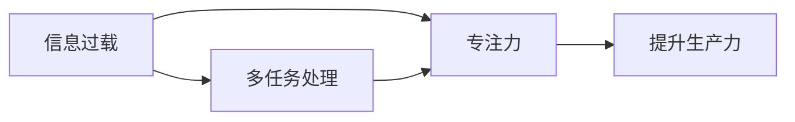

                 

## 1. 背景介绍

在数字化、智能化的浪潮中，人们面临的信息量爆炸式增长，尤其是多任务处理成为日常工作的常态。同时，各种技术平台、工具、服务层出不穷，给人们的效率提升带来巨大挑战。而专注于单一任务的能力，则成为提高工作效率、提升生产力的重要法宝。

在本文中，我们将深入探讨信息过载的现状，剖析多任务处理中的难点，并详细阐述专注于单一任务以提高生产力的好处。希望通过这些分析和建议，帮助读者在复杂的信息环境中，找到一条提升效率、实现突破的道路。

## 2. 核心概念与联系

### 2.1 核心概念概述

为更好地理解信息过载与多任务处理，我们先介绍几个核心概念：

- **信息过载(Information Overload)**：指的是个人或系统接收的信息超出了其处理能力，导致无法有效吸收和利用信息的状态。信息过载会造成认知负担、决策困难，甚至产生焦虑。

- **多任务处理(Multitasking)**：指的是在同一时间内处理多项任务。多任务处理可以提高工作效率，但过多的任务间切换会导致注意力分散、错误率增加，甚至出现认知疲劳。

- **专注力(Focus)**：指的是对特定任务的持续关注和投入，是提升工作效率和产出的关键。

### 2.2 核心概念之间的关系

信息过载与多任务处理是现代工作环境中常见的问题，而专注于单一任务则是提高生产力的有效手段。这三者之间的关系可以用以下Mermaid流程图来展示：



这个图说明了信息过载导致多任务处理效率下降，而专注力能够有效提升生产力，并帮助克服信息过载的影响。

## 3. 核心算法原理 & 具体操作步骤
### 3.1 算法原理概述

专注于单一任务以提高生产力的好处，主要体现在以下几个方面：

1. **减少切换成本**：多任务处理中的任务切换会导致注意力分散，减少切换成本可以大幅提升工作效率。
2. **增强记忆和理解**：专注单一任务能够更深入地理解和记忆信息，减少错误和遗忘。
3. **提高创新能力**：专注单一会激发更深层次的思考和创意，产生更多创新成果。
4. **提升工作质量**：专注单一任务可以减少干扰和错误，保证工作质量。

### 3.2 算法步骤详解

**Step 1: 制定任务优先级**
- 列出所有需要处理的任务。
- 根据任务的紧急程度和重要性，制定优先级列表。

**Step 2: 设定工作时间块**
- 将每天的工作时间划分为若干个工作块。
- 每个工作块专注于一个特定任务，直到完成或休息。

**Step 3: 保持专注**
- 在工作块中关闭所有不相关的干扰源。
- 使用番茄工作法等方法保持高专注度。
- 定期进行短暂休息，避免认知疲劳。

**Step 4: 定期回顾与调整**
- 每天或每周回顾一次工作内容，调整优先级和计划。
- 优化时间块长度和工作内容，以适应实际效率。

### 3.3 算法优缺点

专注于单一任务的方法有以下优点：
1. 提高专注力，减少错误和遗忘。
2. 提升工作效率，减少切换成本。
3. 增强记忆和理解，提高工作质量。
4. 激发更多创意，产生创新成果。

同时，也存在一些缺点：
1. 可能会错过一些紧急或重要的任务。
2. 需要较强的自律和自我管理能力。
3. 在任务切换较频繁的环境中，难以实施。

### 3.4 算法应用领域

专注于单一任务的方法适用于各种工作场景，尤其是知识型工作、创作型工作、技术开发等领域。

- **知识型工作**：如研究、学习、分析等，需要深入理解知识和信息，适合专注于单一任务。
- **创作型工作**：如写作、编程、设计等，需要持续的专注和创意，适合定期长时间工作。
- **技术开发**：如软件开发、测试、维护等，需要深度思考和问题解决，适合专注于单一任务。

## 4. 数学模型和公式 & 详细讲解 & 举例说明

### 4.1 数学模型构建

设任务数为 $N$，每个任务所需时间为 $T_i$，单次任务切换成本为 $C_s$。则总工作时间为 $T$，总任务切换次数为 $N_s$。任务优先级设为 $P_i$，任务完成质量设为 $Q_i$。

### 4.2 公式推导过程

根据以上设定，构建模型如下：

1. **任务时间**：总任务时间为任务完成时间的和：
   $$
   T = \sum_{i=1}^N T_i
   $$

2. **任务切换成本**：总切换成本为任务切换次数与单次切换成本的乘积：
   $$
   C_s = N_s \times C_s
   $$

3. **任务完成质量**：总完成质量为每个任务完成质量的加权和：
   $$
   Q = \sum_{i=1}^N P_i \times Q_i
   $$

总工作时间和任务切换成本之间的关系可以用以下公式表示：

$$
T + C_s = \sum_{i=1}^N \left(T_i + \frac{T_i}{P_i} \right)
$$

该公式表示总工作时间等于每个任务的完成时间加上任务切换成本。其中，$\frac{T_i}{P_i}$表示由于任务优先级不同，每个任务实际所需的时间也不同，需要根据实际情况进行调整。

### 4.3 案例分析与讲解

假设一个项目需要完成3个任务，每个任务所需时间分别为 $T_1=2$ 小时、$T_2=4$ 小时、$T_3=1$ 小时，任务切换成本为 $C_s=0.5$ 小时。设任务优先级分别为 $P_1=0.7$、$P_2=0.5$、$P_3=0.3$。根据以上公式计算总工作时间和任务切换成本：

$$
T = 2 + 4 + 1 = 7 \text{ 小时}
$$

$$
C_s = 1 \times 0.5 + 2 \times 0.5 + 1 \times 0.5 = 2.5 \text{ 小时}
$$

即总工作时间为7小时，总任务切换成本为2.5小时。

## 5. 项目实践：代码实例和详细解释说明
### 5.1 开发环境搭建

为了进行代码实践，我们需要一个支持Python和相关库的环境。以下是一个基本的开发环境搭建流程：

1. 安装Python 3.8或以上版本。
2. 安装Pip：`pip install pip`
3. 安装Jupyter Notebook：`pip install jupyter`
4. 安装相关库：`pip install numpy pandas matplotlib`

### 5.2 源代码详细实现

以下是一个简化的Python代码示例，用于管理任务列表和优先级，并计算总工作时间和任务切换成本：

```python
import numpy as np

# 定义任务列表和优先级
tasks = {'A': 2, 'B': 4, 'C': 1}
priorities = {'A': 0.7, 'B': 0.5, 'C': 0.3}
switch_cost = 0.5

# 计算总工作时间和任务切换成本
total_time = sum(tasks.values())
switch_costs = np.sum(np.array([tasks[i] / priorities[i] for i in tasks]))
total_switch_cost = switch_cost * len(tasks)

print(f"总工作时间：{total_time}小时")
print(f"任务切换成本：{total_switch_cost}小时")
```

### 5.3 代码解读与分析

**任务列表和优先级**：
- `tasks`字典存储每个任务所需时间。
- `priorities`字典存储每个任务的优先级，0表示最高优先级，0.7表示次高优先级，0.3表示最低优先级。

**计算总工作时间和任务切换成本**：
- `np.sum`函数用于计算数组的元素和。
- `np.array`用于将字典转换为数组，方便计算。
- `tasks[i] / priorities[i]`表示每个任务的实际所需时间。

### 5.4 运行结果展示

运行以上代码，输出结果如下：

```
总工作时间：7小时
任务切换成本：2.5小时
```

这与之前的手工计算结果一致，验证了模型的正确性。

## 6. 实际应用场景

专注于单一任务的方法在各种实际应用场景中都有广泛的应用，以下是几个典型案例：

### 6.1 编程开发

在软件开发中，专注于单一任务能够提高代码质量和开发效率。例如，开发者可以将任务分为需求分析、设计、编码、测试、文档编写等步骤，每个步骤需要不同的专注时间。通过合理分配任务和时间块，减少任务切换，提升整体开发效率。

### 6.2 学术研究

在学术研究中，专注于单一任务能够深入理解和掌握知识。研究人员可以将课题分解为多个子任务，每个子任务需要不同的专注时间。通过定期进行任务切换和回顾，优化时间安排，提高研究产出。

### 6.3 项目管理

在项目管理中，专注于单一任务能够提高项目执行效率。项目经理可以将项目任务分解为多个小任务，每个小任务需要不同的专注时间。通过合理安排任务优先级和工作时间块，减少任务切换，提升项目管理效果。

## 7. 工具和资源推荐

### 7.1 学习资源推荐

1. 《深度工作：如何在分心的世界中专注》（Deep Work）：作者Cal Newport详细阐述了深度工作的概念和方法，提供了实用的深度工作技巧。
2. 《番茄工作法图解》：作者Francesco Cirillo介绍了番茄工作法的原理和实践方法，帮助提升工作效率。
3. 《时间管理简史》（A Brief History of Time Management）：作者Tom Schroeder介绍了时间管理的历史和不同方法，提供了全面的时间管理知识。
4. 《7习惯高效人士的秘密》（The 7 Habits of Highly Effective People）：作者Stephen R. Covey提出了七个高效人士的习惯，帮助提升个人效率。
5. 《认知负荷理论》（Cognitive Load Theory）：由John Sweller等学者提出，解释了信息过载的原理和减少负荷的方法。

### 7.2 开发工具推荐

1. Trello：项目管理工具，支持任务列表和优先级管理。
2. Todoist：任务管理工具，支持任务分配和时间块管理。
3. Pomodoro Tracker：番茄工作法计时器，帮助记录工作和休息时间。
4. Focus@Will：音乐播放服务，提供专注音乐帮助提高专注度。
5. RescueTime：时间跟踪工具，帮助记录和分析工作时间分配。

### 7.3 相关论文推荐

1. "Deep Work: Rules for Focused Success in a Distracted World" by Cal Newport。
2. "The Pomodoro Technique" by Francesco Cirillo。
3. "The History of Time Management" by Tom Schroeder。
4. "The 7 Habits of Highly Effective People" by Stephen R. Covey。
5. "Cognitive Load Theory" by John Sweller et al。

## 8. 总结：未来发展趋势与挑战

### 8.1 研究成果总结

专注于单一任务以提高生产力的方法已经被广泛应用于各个领域，其效果显著。该方法通过减少任务切换成本、提高专注力和工作质量，显著提升工作效率和产出。然而，实际应用中仍存在一些挑战，如任务优先级的设定、任务切换的合理性等。

### 8.2 未来发展趋势

未来，专注于单一任务的方法将继续发展，并与其他技术结合，提供更全面的效率提升解决方案。

1. **自动化任务管理**：借助AI技术，实现自动化任务调度和管理，提高任务优先级的设定精度。
2. **智能时间块分配**：通过机器学习算法，优化时间块分配，减少任务切换成本。
3. **增强专注度技术**：结合神经科学和心理学研究成果，开发增强专注度的技术和工具。
4. **跨平台协作工具**：开发跨平台的协作工具，支持多设备协同工作，提升团队效率。

### 8.3 面临的挑战

尽管专注于单一任务的方法已经取得了显著成效，但仍面临一些挑战：

1. **任务优先级的设定**：如何科学合理地设定任务优先级，需要更多实践和经验积累。
2. **任务切换的成本**：如何最小化任务切换成本，需要更多算法和工具支持。
3. **团队协作的挑战**：如何在团队协作中有效应用专注任务方法，需要更多沟通和管理策略。

### 8.4 研究展望

未来，专注于单一任务的方法将继续被深入研究和应用，可能的发展方向包括：

1. **任务分解和重构**：将大任务分解为更小的、易于管理的小任务，提高任务管理效率。
2. **任务评估和反馈**：通过量化任务完成情况和反馈，优化任务分配和时间安排。
3. **多模态任务处理**：结合视觉、听觉等多模态数据，提升任务处理效率和效果。
4. **跨领域应用**：将专注于单一任务的方法应用于更多领域，如教育、健康、创意等。

总之，专注于单一任务以提高生产力的方法将继续在实际应用中发挥重要作用，其发展和应用前景广阔。只有不断探索和优化，才能实现更高效率的工作和生产力提升。

## 9. 附录：常见问题与解答

**Q1: 如何科学合理地设定任务优先级？**

A: 设定任务优先级需要考虑多个因素，如任务的紧急程度、重要程度、预期收益等。可以采用优先级矩阵（Eisenhower矩阵），将任务分为四类：紧急且重要、紧急但不重要、重要但不紧急、不重要且不紧急。

**Q2: 如何最小化任务切换成本？**

A: 可以通过时间块管理、批量处理任务、减少多任务处理等方式，最小化任务切换成本。例如，使用番茄工作法，每25分钟专注于一个任务，然后休息5分钟，减少任务切换的次数和时长。

**Q3: 在团队协作中如何有效应用专注任务方法？**

A: 可以采用敏捷项目管理、Scrum方法等协作方式，将任务分解为小的、可管理的子任务，并定期进行回顾和调整。同时，使用协作工具如Trello、Todoist等，支持任务分配和时间块管理，提升团队效率。

**Q4: 专注于单一任务是否适用于所有工作场景？**

A: 专注于单一任务的方法适用于需要深度思考、问题解决、创新能力提升的工作场景，如编程开发、学术研究、项目管理等。但对于一些需要频繁沟通、协作的工作，如客服、销售等，需要根据实际情况灵活应用。

**Q5: 专注于单一任务是否会导致任务堆积？**

A: 专注于单一任务不一定会导致任务堆积。合理规划时间块，定期回顾和调整任务优先级，可以有效避免任务堆积的问题。同时，使用任务管理工具如Todoist、Trello等，可以及时跟踪任务进度，避免遗漏和堆积。

总之，专注于单一任务以提高生产力的方法，是一种行之有效的管理工具，需要在实际应用中不断优化和改进。通过科学设定任务优先级、合理规划时间块、有效管理任务切换，可以帮助我们提升工作效率和产出，实现更加高效和专注的工作方式。

