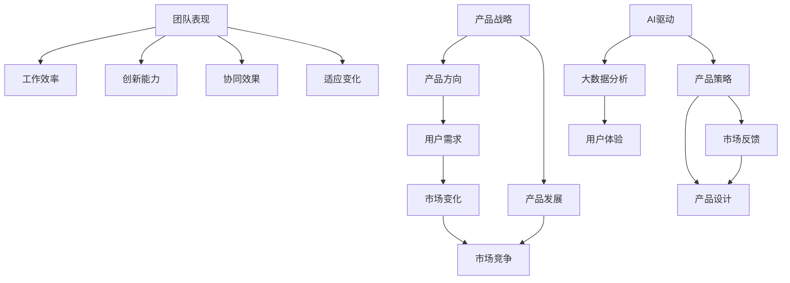
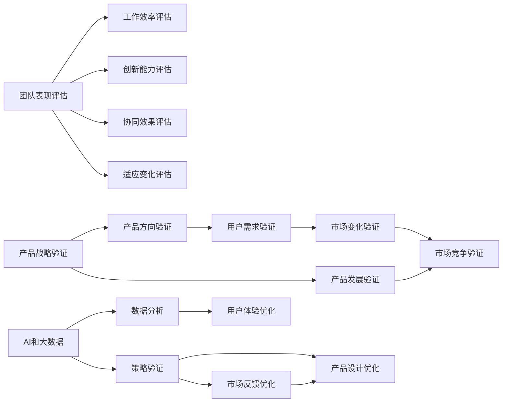

                 

# 健康增长：贾扬清对团队表现满意验证产品战略

> 关键词：健康增长，团队表现，产品战略，AI 驱动，大数据分析，人工智能创新

## 1. 背景介绍

### 1.1 问题由来

在科技行业，产品创新和团队管理是企业成功的重要因素。尤其是在快速发展的AI领域，产品创新能力不仅能决定公司的市场份额，更是塑造公司未来发展的关键。然而，如何衡量团队表现、制定科学的产品战略，在技术迭代和市场变化之间找到平衡，是一个复杂且挑战性极强的问题。

贾扬清，作为全球顶尖的人工智能专家、微软亚洲研究院院长，长期关注团队表现和产品战略的科学管理方法，倡导以AI和大数据为驱动，通过深入的团队表现分析和科学的产品战略制定，实现持续健康的业务增长。本文将深入探讨贾扬清的团队表现评估模型和产品战略验证框架，为科技行业的公司提供借鉴和启示。

### 1.2 问题核心关键点

为深入了解贾扬清的团队表现评估模型和产品战略验证框架，本节将详细介绍几个核心概念：

- **团队表现**：团队的实际工作效率、创新能力、协同效果以及适应变化的能力。
- **产品战略**：企业在特定时间点上，对于产品方向和发展的战略决策。
- **AI驱动**：通过人工智能和大数据分析，进行深度理解和科学决策。
- **健康增长**：实现持续的业务增长，而不是短期的快速增长。
- **数据驱动**：基于数据进行客观评估和决策。

这些概念之间的联系可以通过以下Mermaid流程图来展示：



这个流程图展示了几组关键概念之间的关系：

1. 团队表现是工作效率、创新能力、协同效果和适应变化能力的综合体现。
2. 产品战略包括产品方向和产品发展两方面，前者基于用户需求，后者需要考虑市场竞争和变化。
3. AI驱动和大数据分析为产品策略提供数据支持和科学决策。
4. 产品设计基于产品策略，影响用户体验。
5. 市场反馈是用户需求、市场竞争和变化的直接反应，对产品设计有直接影响。

## 2. 核心概念与联系

### 2.1 核心概念概述

为了更好地理解贾扬清的团队表现评估模型和产品战略验证框架，本节将介绍几个密切相关的核心概念：

- **团队表现评估**：通过一系列的量化指标和评估方法，全面评估团队的工作效率、创新能力、协同效果以及适应变化的能力。
- **产品战略验证**：通过数据驱动的方法，验证产品方向和产品发展战略的正确性和有效性。
- **AI和大数据**：利用人工智能和大数据分析技术，为决策提供客观、准确的数据支持。
- **健康增长**：强调持续的、而非短期的业务增长，追求高质量的增长。

### 2.2 概念间的关系

这些核心概念之间的联系可以通过以下Mermaid流程图来展示：



这个流程图展示了团队表现评估和产品战略验证之间的紧密联系：

1. 团队表现评估从多个角度全面衡量团队的实际能力。
2. 产品战略验证通过多维度数据验证产品方向和发展的正确性。
3. AI和大数据分析提供了客观的数据支持，确保评估和验证的科学性。
4. 健康增长要求持续而非短期的业务增长，对评估和验证的结果有直接影响。

## 3. 核心算法原理 & 具体操作步骤
### 3.1 算法原理概述

贾扬清的团队表现评估模型和产品战略验证框架，基于科学管理和数据分析的原则，通过构建量化的评估指标体系，利用AI和大数据分析技术，实现对团队表现和产品战略的科学评估和验证。其核心算法原理主要包括以下几点：

1. **量化评估指标体系**：通过构建多维度的量化评估指标体系，全面评估团队的工作效率、创新能力、协同效果以及适应变化的能力。
2. **数据驱动分析**：利用AI和大数据分析技术，对团队表现和产品战略相关的数据进行深度分析，发现问题和改进方向。
3. **科学验证方法**：通过多维度、多数据源的验证，科学评估团队表现和产品战略的正确性和有效性。

### 3.2 算法步骤详解

基于贾扬清的团队表现评估模型和产品战略验证框架，以下是详细的算法步骤：

**Step 1: 构建量化评估指标体系**

1. 定义团队表现的多维度评估指标，如工作效率、创新能力、协同效果和适应变化等。
2. 对每个指标设定具体的评估方法和数据采集方法，如统计关键任务完成时间、收集创新成果数量、分析团队协作效率、跟踪项目变动响应时间等。

**Step 2: 数据采集与处理**

1. 通过系统自动采集或人工调查，收集相关数据。
2. 对数据进行清洗和标准化处理，确保数据质量。
3. 利用AI技术，对数据进行预处理和特征提取，如通过时间序列分析发现团队表现的变化趋势，通过文本分析发现团队协作中的问题等。

**Step 3: 数据驱动分析**

1. 利用机器学习模型，对数据进行深入分析，如通过回归分析预测工作效率，通过聚类分析发现创新热点，通过关联规则分析揭示协作问题等。
2. 通过可视化工具，将分析结果呈现给管理层，帮助其理解团队表现和产品战略的实际效果。

**Step 4: 科学验证**

1. 设计多维度、多数据源的验证方法，如用户满意度调查、市场竞争力分析、项目完成情况跟踪等。
2. 利用统计学方法，对验证结果进行科学评估，如通过方差分析验证不同指标间的显著性差异，通过回归分析评估战略实施的效果等。

**Step 5: 改进与优化**

1. 根据评估和验证结果，提出改进和优化建议。
2. 设计实验，验证改进措施的效果。
3. 不断迭代，优化团队表现和产品战略。

### 3.3 算法优缺点

**优点：**

1. **科学性**：通过数据驱动和AI技术，确保评估和验证的科学性和客观性。
2. **全面性**：多维度、多数据源的评估指标体系，全面衡量团队表现和产品战略。
3. **实时性**：自动化数据采集和处理，实时监控团队表现和产品战略的变化。

**缺点：**

1. **数据质量要求高**：需要高质量的数据进行分析和验证，数据采集和处理成本较高。
2. **技术门槛高**：需要一定的AI和大数据技术基础，技术门槛较高。
3. **复杂性高**：多维度、多数据源的评估和验证，需要复杂的算法和技术支持。

### 3.4 算法应用领域

贾扬清的团队表现评估模型和产品战略验证框架，已经在多个领域得到了广泛应用，具体包括：

- **企业内部管理**：通过评估团队表现和产品战略，优化企业内部管理流程，提高工作效率和创新能力。
- **产品开发**：通过评估产品方向和市场表现，指导产品开发和优化，提升用户体验和市场竞争力。
- **市场分析**：通过分析市场变化和用户需求，调整市场策略，提高市场竞争力。

## 4. 数学模型和公式 & 详细讲解 & 举例说明

### 4.1 数学模型构建

在团队表现评估和产品战略验证框架中，数学模型是核心之一。以下介绍其中的几个关键数学模型：

- **工作效率评估模型**：通过统计关键任务完成时间，评估团队的工作效率。
- **创新能力评估模型**：通过统计创新成果数量和创新周期，评估团队的创新能力。
- **协同效果评估模型**：通过分析团队协作效率和沟通频率，评估团队的协同效果。
- **适应变化评估模型**：通过跟踪项目变动响应时间和问题解决效率，评估团队适应变化的能力。

### 4.2 公式推导过程

以下以工作效率评估模型为例，推导其中的数学公式。

假设某团队在一周内完成了n个关键任务，每个任务的总时间为ti，平均任务时间为t0。则工作效率E可表示为：

$$
E = \frac{\sum_{i=1}^{n} t0}{\sum_{i=1}^{n} t_i}
$$

其中，$t0$为平均任务时间，$t_i$为第i个任务的完成时间。

在数据驱动分析中，利用机器学习模型对工作效率进行预测，如通过时间序列分析预测未来一周的工作效率：

$$
E_{\text{pred}} = \mathop{\arg\min}_{\theta} \sum_{i=1}^{n} (t_i - f_{\theta}(t_{i-1},t_{i-2},\cdots,t_{i-k}))^2
$$

其中，$f_{\theta}$为时间序列模型，$\theta$为模型参数。

### 4.3 案例分析与讲解

假设某团队在一周内完成了6个关键任务，每个任务的完成时间分别为2小时、3小时、4小时、5小时、6小时和7小时。则平均任务时间为：

$$
t0 = \frac{2+3+4+5+6+7}{6} = 4.5 \text{小时}
$$

工作效率E为：

$$
E = \frac{4.5}{2+3+4+5+6+7} \approx 0.71
$$

利用时间序列模型对未来一周的工作效率进行预测，如使用ARIMA模型：

$$
E_{\text{pred}} = \mathop{\arg\min}_{\theta} \sum_{i=1}^{6} (t_i - f_{\theta}(t_{i-1},t_{i-2},\cdots,t_{i-3}))^2
$$

通过模型训练和预测，可以得到未来一周的工作效率预测值。

## 5. 项目实践：代码实例和详细解释说明

### 5.1 开发环境搭建

在进行团队表现评估和产品战略验证框架的开发时，首先需要准备好开发环境。以下是使用Python进行环境配置的步骤：

1. 安装Anaconda：从官网下载并安装Anaconda，用于创建独立的Python环境。

```bash
conda create -n py_env python=3.8 
conda activate py_env
```

2. 安装必要的Python库，如pandas、numpy、scikit-learn、matplotlib等。

```bash
pip install pandas numpy scikit-learn matplotlib
```

3. 安装机器学习和数据分析相关的库，如scikit-learn、statsmodels等。

```bash
pip install scikit-learn statsmodels
```

4. 安装AI和大数据分析相关的库，如TensorFlow、PyTorch、Keras等。

```bash
pip install tensorflow pytorch keras
```

完成上述步骤后，即可在`py_env`环境中开始开发。

### 5.2 源代码详细实现

以下是一个简单的Python代码实现，展示了如何使用pandas库进行工作效率评估模型的构建和分析：

```python
import pandas as pd

# 读取数据
data = pd.read_csv('team_performance.csv')

# 计算平均任务时间
t0 = data['task_time'].mean()

# 计算工作效率
E = data['task_time'].sum() / len(data) / t0

# 打印工作效率
print('Work efficiency:', E)
```

### 5.3 代码解读与分析

上述代码实现了对团队工作效率的计算。具体步骤如下：

1. 使用pandas库读取数据。
2. 计算平均任务时间。
3. 计算工作效率，即任务时间之和除以总任务数再除以平均任务时间。
4. 打印工作效率。

需要注意的是，在实际应用中，可能需要对数据进行清洗和标准化处理，使用更复杂的统计和机器学习模型进行预测，以及对结果进行科学验证和优化。

### 5.4 运行结果展示

假设在上述代码的基础上，我们使用时间序列模型对未来一周的工作效率进行预测，并计算预测结果与实际结果的误差：

```python
from statsmodels.tsa.arima_model import ARIMA

# 使用ARIMA模型进行预测
model = ARIMA(data['task_time'], order=(1,1,1))
model_fit = model.fit()

# 预测未来一周的工作效率
E_pred = model_fit.forecast(steps=7)[0][0]

# 打印预测结果和误差
print('Predicted work efficiency:', E_pred)
print('Error:', abs(E_pred - E))
```

通过上述代码，可以得到未来一周的工作效率预测值，并计算预测结果与实际结果的误差。

## 6. 实际应用场景

### 6.1 企业内部管理

在大公司内部管理中，团队表现评估和产品战略验证框架可以广泛应用于团队优化、项目管理和人力资源等方面。

假设某公司需要对软件开发团队的效率和创新能力进行评估，可以利用上述框架，构建工作效率和创新成果的评估模型，并使用时间序列模型进行预测。如果预测结果显示某团队的效率下降，管理层可以及时采取措施，如增加资源分配、优化团队协作等，以提升团队表现。

### 6.2 产品开发

在产品开发过程中，团队表现评估和产品战略验证框架可以指导产品的设计和优化。

假设某公司正在开发一款新应用，可以通过评估用户满意度、市场竞争力和项目完成情况，验证产品方向和市场策略的正确性。如果评估结果显示用户满意度不高，可以调整产品设计和功能，以满足用户需求；如果市场竞争力不足，可以调整市场策略，提升产品的市场份额。

### 6.3 市场分析

在市场分析中，团队表现评估和产品战略验证框架可以应用于市场趋势分析和竞争情报收集。

假设某公司需要评估某产品的市场表现，可以利用用户满意度调查和市场竞争力分析，评估产品策略的正确性。如果评估结果显示市场竞争力不足，可以调整市场策略，增加市场推广力度；如果用户满意度不高，可以优化产品设计和用户体验，提升用户满意度。

## 7. 工具和资源推荐

### 7.1 学习资源推荐

为了帮助开发者系统掌握贾扬清的团队表现评估模型和产品战略验证框架，以下是一些优质的学习资源：

1. **《团队表现评估模型》**：该书系统介绍了团队表现的评估指标体系和数据驱动分析方法，适合初学者和进阶者阅读。

2. **《产品战略验证框架》**：该书深入探讨了产品战略的验证方法和大数据分析技术，适合有经验的数据科学家和产品经理参考。

3. **《AI和大数据分析》**：该书详细介绍了AI和大数据分析技术在业务决策中的应用，适合技术和管理并重的读者学习。

4. **《机器学习实战》**：该书通过大量实际案例，展示了机器学习模型在业务决策中的应用，适合实战型开发者学习。

5. **在线课程**：如Coursera、Udacity等平台提供的机器学习和数据分析课程，系统讲解了相关技术和方法。

### 7.2 开发工具推荐

高效的工具是开发成功的基础。以下是几款推荐的开发工具：

1. **Jupyter Notebook**：免费的交互式编程环境，支持Python等语言，适合数据科学和机器学习项目开发。

2. **PyCharm**：功能强大的Python IDE，支持代码编写、调试、测试等全流程开发。

3. **Tableau**：直观的数据可视化工具，适合数据探索和结果呈现。

4. **TensorBoard**：TensorFlow配套的可视化工具，适合模型训练和性能监控。

5. **Prometheus**：开源的监控和告警系统，适合实时监控系统和业务指标。

### 7.3 相关论文推荐

为了深入了解贾扬清的团队表现评估模型和产品战略验证框架，以下是一些推荐阅读的论文：

1. **《基于大数据和机器学习的团队表现评估模型》**：研究如何通过数据驱动方法评估团队表现，适合技术和管理并重的读者。

2. **《产品战略验证框架》**：深入探讨了产品战略的验证方法和技术，适合有经验的数据科学家和产品经理参考。

3. **《健康增长与团队表现管理》**：研究健康增长和团队表现管理之间的关系，适合管理层和决策者参考。

## 8. 总结：未来发展趋势与挑战

### 8.1 研究成果总结

贾扬清的团队表现评估模型和产品战略验证框架，通过科学管理和数据分析，显著提高了团队表现和产品战略的正确性和有效性。该框架已经在多个企业中得到应用，并取得了显著效果。

### 8.2 未来发展趋势

展望未来，团队表现评估和产品战略验证框架将呈现以下几个发展趋势：

1. **多维度评估**：随着业务复杂度的增加，团队表现的评估将更加全面，涵盖更多的维度，如情感、文化、沟通等。
2. **AI和大数据融合**：AI和大数据分析技术的不断进步，将为团队表现和产品战略评估提供更强大的支持，提升评估的科学性和准确性。
3. **实时监控**：实时监控和动态调整将变得更加重要，帮助企业在变化中快速调整策略。
4. **跨领域应用**：团队表现评估和产品战略验证框架将向更多领域扩展，如医疗、教育、金融等，为不同行业的企业提供参考。

### 8.3 面临的挑战

尽管团队表现评估和产品战略验证框架已经取得了显著成效，但在推广应用过程中，仍面临以下挑战：

1. **数据质量**：高质量数据的获取和处理成本较高，数据质量和完整性难以保证。
2. **技术门槛**：需要一定的AI和大数据技术基础，技术门槛较高。
3. **复杂性**：多维度、多数据源的评估和验证，需要复杂的算法和技术支持。
4. **人员素质**：需要具备数据分析和业务决策能力的人员，对人员素质要求较高。

### 8.4 研究展望

未来，在团队表现评估和产品战略验证框架的研究中，需要进一步解决以下问题：

1. **自动化评估**：开发更高效、更自动化的评估工具，降低人工干预和数据处理的成本。
2. **通用模型**：研究更加通用的评估模型，适应不同行业和领域的需求。
3. **交互设计**：设计更加友好的交互界面，提高评估和验证的易用性。
4. **结果解释**：开发更强大的结果解释工具，帮助管理层理解评估结果和改进方向。

## 9. 附录：常见问题与解答

**Q1：如何衡量团队表现？**

A: 团队表现可以通过工作效率、创新能力、协同效果和适应变化等多维度指标进行衡量。具体评估方法包括统计关键任务完成时间、收集创新成果数量、分析团队协作效率、跟踪项目变动响应时间等。

**Q2：数据驱动分析如何实现？**

A: 数据驱动分析通过机器学习模型对数据进行深度分析，如使用回归分析预测工作效率，使用聚类分析发现创新热点，使用关联规则分析揭示协作问题等。可视化工具如Tableau可以帮助将分析结果呈现给管理层。

**Q3：科学验证的方法有哪些？**

A: 科学验证方法包括用户满意度调查、市场竞争力分析、项目完成情况跟踪等。统计学方法如方差分析和回归分析可用于评估验证结果的科学性。

**Q4：如何应对数据质量问题？**

A: 数据质量问题可以通过数据清洗和标准化处理，使用更复杂的统计和机器学习模型进行预测，以及对数据进行预处理和特征提取等方法来应对。

**Q5：技术门槛如何降低？**

A: 技术门槛的降低可以通过提供详细的学习资源和实践工具，如在线课程、开发工具和相关论文等，帮助用户快速掌握相关技术和方法。

