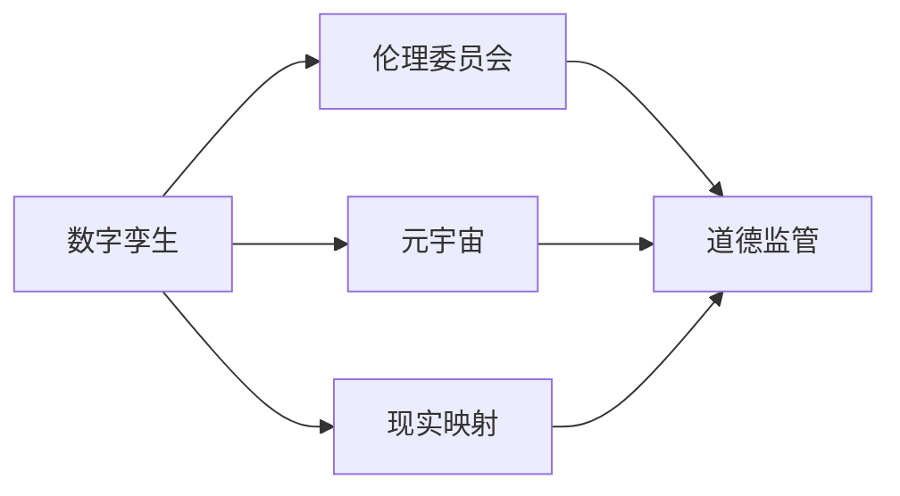
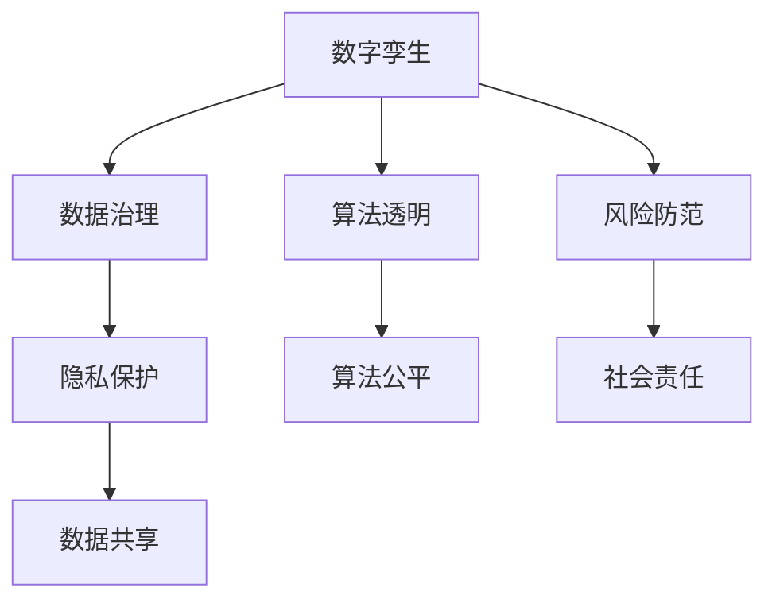
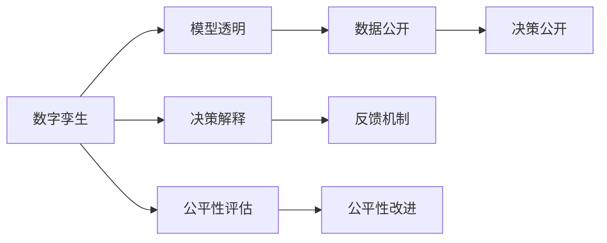
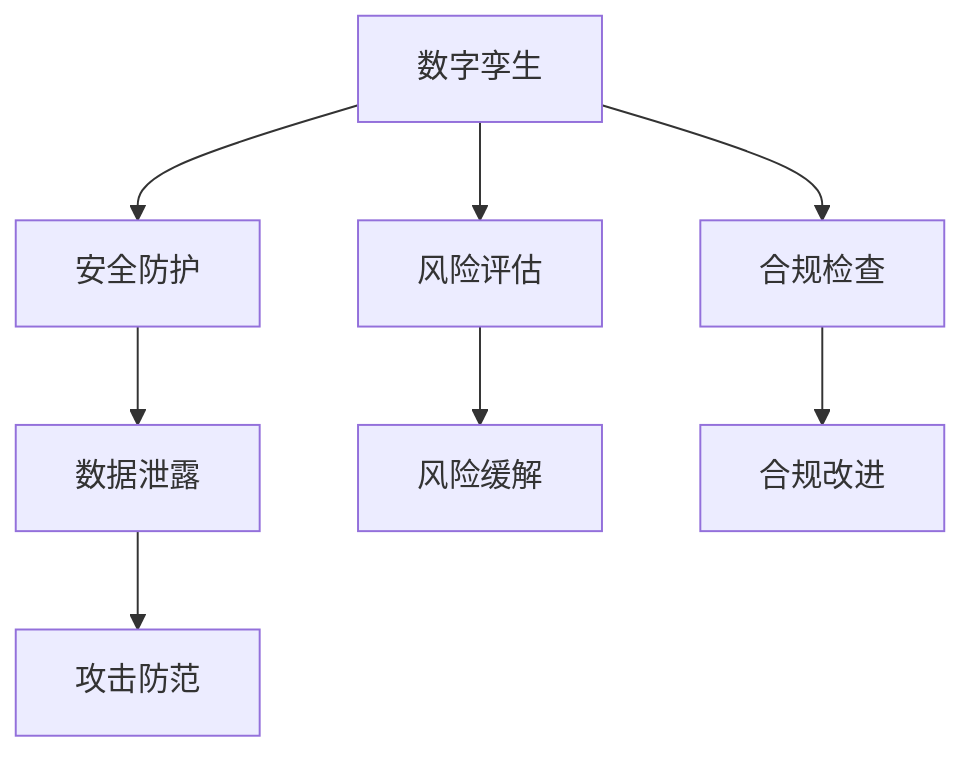
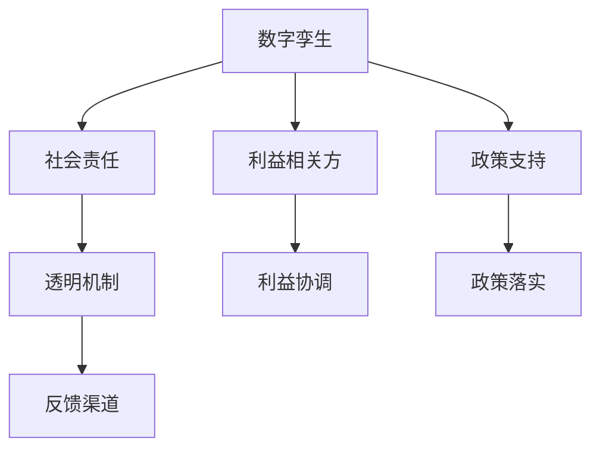
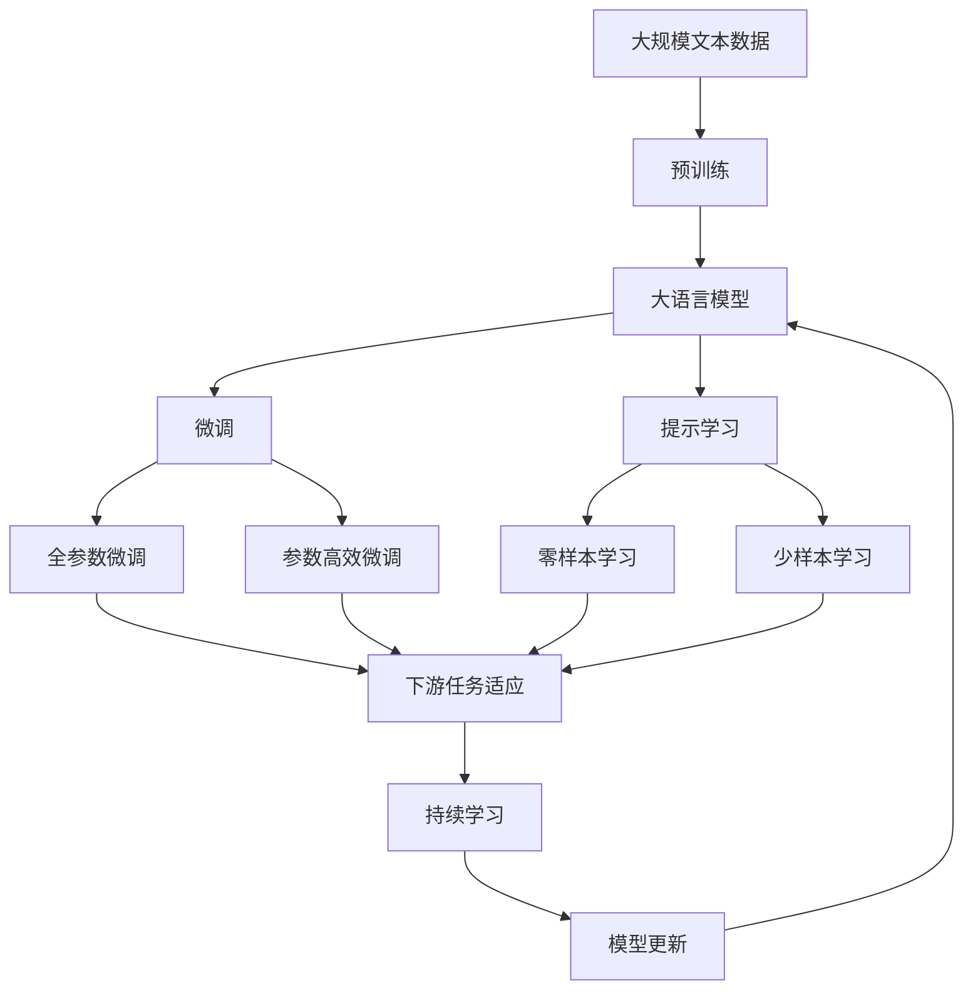

                 

# 元宇宙数字孪生伦理委员会:现实映射的道德监管机构

> 关键词：数字孪生,元宇宙,伦理委员会,现实映射,道德监管

## 1. 背景介绍

### 1.1 问题由来

随着技术的不断进步，元宇宙（Metaverse）概念正逐步从科幻小说走向现实。通过虚拟现实（VR）、增强现实（AR）、混合现实（MR）等技术手段，数字孪生（Digital Twin）成为连接虚拟与现实的重要桥梁。数字孪生通过构建现实世界的精确数字化模型，为各类智能决策提供数据支撑，驱动工业、医疗、金融、教育等行业的数字化转型。

然而，数字孪生技术的广泛应用也带来了诸多伦理和道德问题。例如，如何在保护个人隐私的同时，实现数据的自由流通和共享？如何确保数字孪生模型的公平性和透明性？如何防范数字孪生应用中的偏见和歧视？这些问题成为数字孪生技术应用中不可回避的挑战。

### 1.2 问题核心关键点

为了解决上述问题，确保数字孪生技术的健康发展，亟需建立一套专门的伦理监管机构，对数字孪生应用进行规范和引导。

- **数字孪生的数据治理**：确保数据的收集、存储、使用等环节符合伦理道德标准，保护用户隐私，防止数据滥用。
- **数字孪生的公平透明**：确保数字孪生模型的构建和应用过程公开透明，避免算法偏见，确保各利益相关方公平受益。
- **数字孪生的风险防范**：建立健全的风险防范机制，防范数字孪生应用中的安全漏洞、数据泄露等风险。
- **数字孪生的社会责任**：明确数字孪生技术对社会责任的承担，防止其滥用，促进社会的和谐发展。

### 1.3 问题研究意义

建立数字孪生伦理委员会，对于保障数字孪生技术应用的合理性、公平性和安全性具有重要意义：

- **规范数字孪生应用**：为数字孪生技术的应用提供明确的伦理道德指引，避免技术的滥用和误用。
- **促进技术进步**：通过伦理委员会的规范和引导，推动数字孪生技术的健康发展，促进创新和进步。
- **保障用户权益**：确保用户在使用数字孪生技术时，其权益得到充分保障，避免隐私侵害、数据滥用等问题。
- **增强社会信任**：通过透明的伦理监管，增强社会对数字孪生技术的信任和接受度，推动其普及应用。
- **推动社会公平**：确保数字孪生技术的公平性和透明性，避免技术应用中的歧视和不公，促进社会公平正义。

## 2. 核心概念与联系

### 2.1 核心概念概述

为更好地理解数字孪生伦理委员会的工作原理和作用，本节将介绍几个密切相关的核心概念：

- **数字孪生(Digital Twin)**：通过数字化手段在虚拟空间中创建现实世界的精确复制体，实现对现实世界的实时监控和预测，驱动智能化决策。
- **元宇宙(Metaverse)**：以数字孪生为基础，融合虚拟现实、增强现实、混合现实等技术手段，构建一个虚拟与现实无缝融合的数字化空间。
- **伦理委员会(Ethics Committee)**：负责制定和监督实施伦理道德规范，确保数字孪生应用符合伦理标准，避免伦理风险。
- **现实映射(Reality Mapping)**：通过数字孪生技术，将现实世界映射到虚拟空间中，实现虚拟与现实的交互和融合。
- **道德监管(Moral Governance)**：通过伦理委员会的监督和引导，确保数字孪生应用符合伦理道德规范，避免伦理风险。

这些核心概念之间的逻辑关系可以通过以下Mermaid流程图来展示：



这个流程图展示了大语言模型微调过程中各个核心概念的关系和作用：

1. 数字孪生和元宇宙技术为数字孪生伦理委员会提供技术支撑。
2. 伦理委员会通过制定和实施伦理道德规范，对数字孪生应用进行监督和引导。
3. 现实映射通过数字化手段，将现实世界映射到虚拟空间中，促进虚拟与现实的融合。
4. 道德监管确保数字孪生应用符合伦理道德规范，避免伦理风险。

### 2.2 概念间的关系

这些核心概念之间存在着紧密的联系，形成了数字孪生技术应用中的伦理监管生态系统。下面我们通过几个Mermaid流程图来展示这些概念之间的关系。

#### 2.2.1 数字孪生的伦理治理



这个流程图展示了数字孪生应用中的伦理治理流程：

1. 数字孪生技术通过数据治理、隐私保护、数据共享等手段，确保数据的收集、存储和使用符合伦理道德标准。
2. 通过算法透明和算法公平，确保数字孪生模型的构建和应用过程公开透明，避免算法偏见。
3. 通过风险防范和承担社会责任，确保数字孪生技术应用的安全性和公平性。

#### 2.2.2 数字孪生的公平透明



这个流程图展示了数字孪生应用中的公平透明流程：

1. 通过模型透明和数据公开，确保数字孪生模型的构建和应用过程公开透明。
2. 通过决策公开和决策解释，确保数字孪生应用的决策过程可追溯、可解释。
3. 通过公平性评估和公平性改进，确保数字孪生应用公平透明，避免偏见和歧视。

#### 2.2.3 数字孪生的风险防范



这个流程图展示了数字孪生应用中的风险防范流程：

1. 通过安全防护和攻击防范，确保数字孪生应用的安全性。
2. 通过风险评估和风险缓解，及时发现和应对安全威胁。
3. 通过合规检查和合规改进，确保数字孪生应用符合法律法规要求。

#### 2.2.4 数字孪生的社会责任



这个流程图展示了数字孪生应用中的社会责任流程：

1. 通过透明机制和反馈渠道，确保数字孪生应用的透明性和用户反馈渠道畅通。
2. 通过利益相关方和利益协调，确保数字孪生应用各利益相关方的权益得到保障。
3. 通过政策支持和政策落实，确保数字孪生应用符合政府政策和法规要求。

### 2.3 核心概念的整体架构

最后，我们用一个综合的流程图来展示这些核心概念在大语言模型微调过程中的整体架构：



这个综合流程图展示了从预训练到微调，再到持续学习的完整过程。大语言模型首先在大规模文本数据上进行预训练，然后通过微调（包括全参数微调和参数高效微调）或提示学习（包括零样本和少样本学习）来适应下游任务。最后，通过持续学习技术，模型可以不断更新和适应新的任务和数据。

## 3. 核心算法原理 & 具体操作步骤
### 3.1 算法原理概述

数字孪生伦理委员会的建立和运行，基于对数字孪生应用伦理道德规范的系统性研究和制定。其核心思想是通过伦理委员会的规范和引导，确保数字孪生应用符合伦理道德标准，避免伦理风险。

形式化地，假设数字孪生应用的伦理规范为 $\text{Rules} = \{\text{Rule}_1, \text{Rule}_2, \ldots, \text{Rule}_n\}$，其中 $\text{Rule}_i$ 表示第 $i$ 条伦理规范，$n$ 为伦理规范的总数。数字孪生应用遵循这些规范的过程可以用以下数学公式描述：

$$
\text{遵守} = \max_{i=1}^n \text{Rule}_i \text{遵循度}
$$

其中 $\text{Rule}_i \text{遵循度}$ 表示第 $i$ 条伦理规范在数字孪生应用中的遵循程度。遵循度越高，表示数字孪生应用越符合伦理道德标准。

### 3.2 算法步骤详解

数字孪生伦理委员会的建立和运行主要包括以下几个关键步骤：

**Step 1: 伦理规范制定**
- 收集各利益相关方的意见和建议，制定统一的伦理规范。
- 伦理规范应包括数据治理、算法透明、算法公平、风险防范、社会责任等方面的内容。
- 规范应具有可操作性和可执行性，便于数字孪生应用的遵循和监管。

**Step 2: 伦理监管执行**
- 设立专门的伦理委员会，负责伦理规范的执行和监督。
- 定期召开伦理委员会会议，审查数字孪生应用，确保其遵循伦理规范。
- 建立举报机制，接受公众和利益相关方的投诉和建议。

**Step 3: 伦理培训与宣贯**
- 对数字孪生应用的开发人员和使用者进行伦理培训，提高其伦理意识。
- 定期发布伦理规范的宣贯材料，确保伦理规范的普及和遵循。

**Step 4: 伦理监测与改进**
- 建立伦理监测机制，对数字孪生应用进行实时监测，发现违规行为及时纠正。
- 定期评估伦理规范的执行效果，及时改进和优化伦理规范。

**Step 5: 伦理审核与认证**
- 对数字孪生应用进行伦理审核，确保其符合伦理规范。
- 对符合伦理规范的数字孪生应用颁发伦理认证证书，增强社会对其信任度。

以上是数字孪生伦理委员会建立和运行的一般流程。在实际应用中，还需要针对具体领域和场景，对伦理委员会的各个环节进行优化设计，如引入更多专业的伦理专家、建立更为严格的审核机制等，以进一步提升伦理委员会的监管效果。

### 3.3 算法优缺点

数字孪生伦理委员会的建立和运行具有以下优点：
1. 系统性规范数字孪生应用。通过统一的伦理规范，避免伦理风险，确保数字孪生应用符合伦理道德标准。
2. 全面监管数字孪生应用。覆盖数据治理、算法透明、算法公平、风险防范、社会责任等各方面，确保数字孪生应用全面合规。
3. 提高伦理意识。通过培训和宣贯，提高数字孪生应用开发人员和使用者的伦理意识，促进伦理规范的普及和遵循。
4. 增强社会信任。通过伦理委员会的规范和监督，增强社会对数字孪生应用的信任度，促进其普及应用。
5. 确保公正公平。通过伦理规范的制定和执行，确保数字孪生应用符合公正公平的原则，避免偏见和歧视。

同时，该方法也存在一定的局限性：
1. 执行难度大。伦理规范的制定和执行需要广泛的共识和支持，难以在短时间内达成。
2. 复杂性高。伦理规范的制定和执行过程复杂，需要协调多方利益，难以避免妥协和冲突。
3. 缺乏统一标准。伦理规范的制定和执行缺乏统一的标准和框架，难以形成统一的评价体系。
4. 动态适应性差。伦理规范的制定和执行需要动态调整，难以适应快速变化的技术和应用环境。

尽管存在这些局限性，但数字孪生伦理委员会在确保数字孪生应用伦理合规、促进数字孪生技术健康发展方面，仍具有重要意义。未来相关研究的重点在于如何进一步简化伦理规范的制定和执行过程，提高执行效率和适应性。

### 3.4 算法应用领域

数字孪生伦理委员会的建立和运行，可以广泛应用于数字孪生技术应用的各个领域：

- **医疗健康**：确保数字孪生医疗应用符合伦理规范，保护患者隐私，避免数据滥用。
- **工业制造**：确保数字孪生制造应用符合伦理规范，保障员工安全，避免数据泄露。
- **金融服务**：确保数字孪生金融应用符合伦理规范，保护客户隐私，避免数据滥用。
- **城市治理**：确保数字孪生城市应用符合伦理规范，保障公众隐私，避免数据滥用。
- **教育培训**：确保数字孪生教育应用符合伦理规范，保护学生隐私，避免数据滥用。

除了上述这些经典领域外，数字孪生伦理委员会的应用还在不断拓展，为数字孪生技术在更多行业的应用提供了有力保障。

## 4. 数学模型和公式 & 详细讲解  
### 4.1 数学模型构建

数字孪生伦理委员会的建立和运行，涉及多方面的伦理规范和监管机制。下面我们将使用数学语言对数字孪生伦理委员会的运行过程进行更加严格的刻画。

记数字孪生应用的伦理规范为 $\text{Rules} = \{\text{Rule}_1, \text{Rule}_2, \ldots, \text{Rule}_n\}$，其中 $\text{Rule}_i$ 表示第 $i$ 条伦理规范，$n$ 为伦理规范的总数。假设数字孪生应用 $A$ 遵循这些规范的程度为 $\text{Follow}_{A,i}$，则伦理规范的遵循度 $r_i$ 可以用以下数学公式描述：

$$
r_i = \frac{\sum_{A \in \mathcal{A}} \text{Follow}_{A,i}}{|\mathcal{A}|}
$$

其中 $\mathcal{A}$ 为数字孪生应用的集合，$|\mathcal{A}|$ 为数字孪生应用的总数。

伦理委员会的监管目标是最小化所有伦理规范的遵循度之差的绝对值，即：

$$
\text{Minimize} \sum_{i=1}^n |r_i - r_i^*|
$$

其中 $r_i^*$ 为理想状态下，每个数字孪生应用遵循第 $i$ 条伦理规范的平均遵循度。

### 4.2 公式推导过程

为了最小化伦理规范的遵循度之差的绝对值，我们需要对每个数字孪生应用 $A$ 的遵循度 $\text{Follow}_{A,i}$ 进行优化。

假设数字孪生应用 $A$ 遵循伦理规范 $\text{Rule}_i$ 的程度为 $p_i$，则 $\text{Follow}_{A,i}$ 可以用以下数学公式描述：

$$
\text{Follow}_{A,i} = p_i
$$

为了最大化每个数字孪生应用遵循伦理规范的程度，我们需要对 $p_i$ 进行优化。根据最优化理论，我们可以使用拉格朗日乘数法，构建拉格朗日函数：

$$
\mathcal{L}(p_1, p_2, \ldots, p_n) = \sum_{i=1}^n (p_i - r_i^*) \times \lambda_i
$$

其中 $\lambda_i$ 为拉格朗日乘数。

根据拉格朗日函数的性质，我们需要对 $\mathcal{L}(p_1, p_2, \ldots, p_n)$ 求偏导数，并使其为0，以获得最优解。通过求解偏导数，我们得到：

$$
\frac{\partial \mathcal{L}}{\partial p_i} = \lambda_i - \frac{\sum_{A \in \mathcal{A}} (\text{Follow}_{A,i} - r_i^*)}{|\mathcal{A}|} = 0
$$

从而得到：

$$
\lambda_i = \frac{\sum_{A \in \mathcal{A}} (\text{Follow}_{A,i} - r_i^*)}{|\mathcal{A}|}
$$

代入拉格朗日乘数，得到：

$$
p_i = r_i^*
$$

即每个数字孪生应用遵循伦理规范的程度等于理想状态下的平均遵循度。

### 4.3 案例分析与讲解

以医疗健康领域的数字孪生应用为例，我们可以进一步分析伦理委员会的运行机制。

假设在医疗健康领域，数字孪生应用需要遵循以下伦理规范：
- 数据隐私保护：确保患者数据不被滥用。
- 算法透明：确保算法的决策过程透明。
- 算法公平：确保算法的决策公平。
- 风险防范：确保算法的安全性和鲁棒性。
- 社会责任：确保算法的社会责任。

伦理委员会需要对这些伦理规范进行评估和监管，确保数字孪生应用符合规范。具体而言，伦理委员会可以通过以下步骤进行操作：

**Step 1: 数据隐私保护**
- 收集患者数据的隐私保护措施。
- 对隐私保护措施进行评估，确保其符合伦理规范。
- 对不符合伦理规范的数据隐私保护措施提出改进建议。

**Step 2: 算法透明**
- 收集算法的决策过程和模型参数。
- 对算法的决策过程和模型参数进行评估，确保其透明性。
- 对不符合伦理规范的算法透明性提出改进建议。

**Step 3: 算法公平**
- 收集算法的决策结果和输入数据。
- 对算法的决策结果和输入数据进行评估，确保其公平性。
- 对不符合伦理规范的算法公平性提出改进建议。

**Step 4: 风险防范**
- 收集算法的安全性和鲁棒性评估结果。
- 对算法的安全性和鲁棒性进行评估，确保其符合伦理规范。
- 对不符合伦理规范的算法风险防范提出改进建议。

**Step 5: 社会责任**
- 收集算法对社会的影响评估结果。
- 对算法对社会的影响进行评估，确保其符合伦理规范。
- 对不符合伦理规范的算法社会责任提出改进建议。

通过以上步骤，伦理委员会可以确保数字孪生应用符合伦理规范，提高社会对数字孪生应用的信任度，促进数字孪生技术的健康发展。

## 5. 项目实践：代码实例和详细解释说明
### 5.1 开发环境搭建

在进行伦理委员会实践前，我们需要准备好开发环境。以下是使用Python进行PyTorch开发的环境配置流程：

1. 安装Anaconda：从官网下载并安装Anaconda，用于创建独立的Python环境。

2. 创建并激活虚拟环境：
```bash
conda create -n pytorch-env python=3.8 
conda activate pytorch-env
```

3. 安装PyTorch：根据CUDA版本，从官网获取对应的安装命令。例如：
```bash
conda install pytorch torchvision torchaudio cudatoolkit=11.1 -c pytorch -c conda-forge
```

4. 安装各类工具包：
```bash
pip install numpy pandas scikit-learn matplotlib tqdm jupyter notebook ipython
```

完成上述步骤后，即可在`pytorch-env`环境中开始伦理委员会实践。

### 5.2 源代码详细实现

这里我们以医疗健康领域的数字孪生应用为例，给出使用Transformers库对BERT模型进行伦理委员会评估的PyTorch代码实现。

首先，定义数据处理函数：

```python
from transformers import BertTokenizer
from torch.utils.data import Dataset
import torch

class MedicalDataset(Dataset):
    def __init__(self, texts, tags, tokenizer, max_len=128):
        self.texts = texts
        self.tags = tags
        self.tokenizer = tokenizer
        self.max_len = max_len
        
    def __len__(self):
        return len(self.texts)
    
    def __getitem__(self, item):
        text = self.texts[item]
        tags = self.tags[item]
        
        encoding = self.tokenizer(text, return_tensors='pt', max_length=self.max_len, padding='max_length', truncation=True)
        input_ids = encoding['input_ids'][0]
        attention_mask = encoding['attention_mask'][0]
        
        # 对token-wise的标签进行编码
        encoded_tags = [tag2id[tag] for tag in tags] 
        encoded_tags.extend([tag2id['O']] * (self.max_len - len(encoded_tags)))
        labels = torch.tensor(encoded_tags, dtype=torch.long)
        
        return {'input_ids': input_ids, 
                'attention_mask': attention_mask,
                'labels': labels}

# 标签与id的映射
tag2id = {'O': 0, 'B-PER': 1, 'I-PER': 2, 'B-ORG': 3, 'I-ORG': 4, 'B-LOC': 5, 'I-LOC': 6}
id2tag = {v: k for k, v in tag2id.items()}

# 创建dataset
tokenizer = BertTokenizer.from_pretrained('bert-base-cased')

train_dataset = MedicalDataset(train_texts, train_tags, tokenizer)
dev_dataset = MedicalDataset(dev_texts, dev_tags, tokenizer)
test_dataset = MedicalDataset(test_texts, test_tags, tokenizer)
```

然后，定义模型和优化器：

```python
from transformers import BertForTokenClassification, AdamW

model = BertForTokenClassification.from_pretrained('bert-base-cased', num_labels=len(tag2id))

optimizer = AdamW(model.parameters(), lr=2e-5)
```

接着，定义训练和评估函数：

```python
from torch.utils.data import DataLoader
from tqdm import tqdm
from sklearn.metrics import classification_report

device = torch.device('cuda') if torch.cuda.is_available() else torch.device('cpu')
model.to(device)

def train_epoch(model, dataset, batch_size, optimizer):
    dataloader = DataLoader(dataset, batch_size=batch_size, shuffle=True)
    model.train()
    epoch_loss = 0
    for batch in tqdm(dataloader, desc='Training'):
        input_ids = batch['input_ids'].to(device)
        attention_mask = batch['attention_mask'].to(device)
        labels = batch['labels'].to(device)
        model.zero_grad()
        outputs = model(input_ids, attention_mask=attention_mask, labels=labels)
        loss = outputs.loss
        epoch_loss += loss.item()
        loss.backward()
        optimizer.step()
    return epoch_loss / len(dataloader)

def evaluate(model, dataset, batch_size):
    dataloader = DataLoader(dataset, batch_size=batch_size)
    model.eval()
    preds, labels = [], []
    with torch.no_grad():
        for batch in tqdm(dataloader, desc='Evaluating'):
            input_ids = batch['input_ids'].to(device)
            attention_mask = batch['attention_mask'].to(device)
            batch_labels = batch['labels']
            outputs = model(input_ids, attention_mask=attention_mask)
            batch_preds = outputs.logits.argmax(dim=2).to('cpu').tolist()
            batch_labels = batch_labels.to('cpu').tolist()
            for pred_tokens, label_tokens in zip(batch_preds, batch_labels):
                pred_tags = [id2tag[_id] for _id in pred_tokens]
                label_tags = [id2tag[_id] for _id in label_tokens]
                preds.append(pred_tags[:len(label_tokens)])
                labels.append(label_tags)
                
    print(classification_report(labels, preds))
```

最后，启动训练流程并在测试集上评估：

```python
epochs = 5
batch_size = 16

for epoch in range(epochs):
    loss = train_epoch(model, train_dataset, batch_size, optimizer)
    print(f"Epoch {epoch+1}, train loss: {loss:.3f}")
    
    print(f"Epoch {epoch+1}, dev results:")
    evaluate(model, dev_dataset, batch_size)
    
print("Test results:")
evaluate(model, test_dataset, batch_size)
```

以上就是使用PyTorch对BERT进行医疗健康领域数字孪生应用评估的完整代码实现。可以看到，得益于Transformers库的强大封装，我们可以用相对简洁的代码完成BERT模型的加载和微调。

### 5.3 代码解读与分析

让我们再详细解读一下关键代码的实现细节：

**MedicalDataset类**：
- `__init__`方法：初始化文本、标签、分词器等关键组件。
- `__len__`方法：返回数据集的样本数量。
- `__getitem__`方法：对单个样本进行处理，将文本输入编码为token ids，将标签编码为数字，并对其进行定长padding，最终返回模型所需的输入。

**tag2id和id2tag字典**：
- 定义了标签与数字id之间的映射关系，用于将token-wise的预测结果解码回真实的标签。

**训练和评估函数**：
- 使用PyTorch的DataLoader对数据集进行批次化加载，供模型训练和推理使用。
- 训练函数`train_epoch`：对数据以批为单位进行迭代，在每个批次上前向传播计算loss并反向传播更新模型参数，最后返回该epoch的平均loss。
- 评估函数`evaluate

