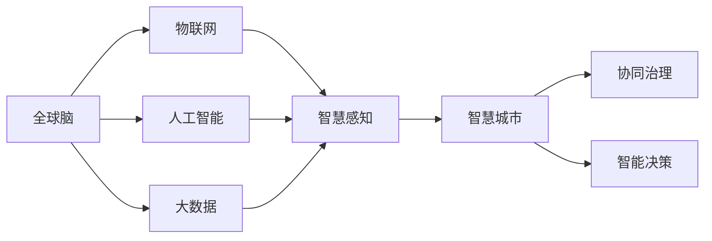

                 

# 全球脑与智慧城市:数字化城市管理的终极形态

> 关键词：全球脑,智慧城市,数字化城市管理,物联网(IoT),人工智能(AI),大数据,智慧感知,协同治理

## 1. 背景介绍

### 1.1 问题由来
随着数字化技术的迅猛发展，城市管理逐渐从传统的“汗水型”向“智慧型”转变。智慧城市建设已成为现代城市发展的重要方向，其核心在于通过数字化手段，实现城市运行的智能化和精细化管理，提升城市运行效率，改善市民生活质量。

智慧城市建设涉及交通、环保、医疗、教育、安全等众多领域，需要跨部门、跨行业的协作，涉及海量数据处理和复杂系统集成，传统的城市管理模式已经难以适应。

### 1.2 问题核心关键点
智慧城市建设的核心在于构建数字化城市管理系统，即通过整合各类传感器、通信网络和智能设备，实现城市运行数据的全面感知、实时处理和智能决策，提升城市管理效率。而全球脑的概念，正是这一过程中重要的技术支撑和理念引导。

全球脑是指通过人工智能、大数据、物联网等技术，构建一个全球性、开放性的智慧感知网络，实现城市运行数据的全面、实时、精准感知和处理。基于全球脑构建的智慧城市管理系统，可以实现协同治理、动态优化、智能决策等功能，是数字化城市管理的终极形态。

### 1.3 问题研究意义
全球脑与智慧城市概念的提出，对于推动智慧城市建设、提升城市管理水平具有重要意义：

1. **优化资源配置**：通过全球脑技术，实现对城市运行数据的全面感知和实时处理，优化资源配置，提升城市运行效率。
2. **促进协同治理**：打破部门壁垒，实现跨部门、跨行业的协同治理，提升城市管理效能。
3. **强化智能决策**：基于大数据和人工智能技术，提升城市管理决策的科学性和精准性。
4. **提升民生服务**：通过智慧城市管理系统的建设，提升市民在交通、环保、医疗、教育等领域的满意度和服务水平。

## 2. 核心概念与联系

### 2.1 核心概念概述

为更好地理解全球脑与智慧城市，本节将介绍几个密切相关的核心概念：

- **全球脑(Global Brain)**：通过物联网(IoT)、大数据、人工智能(AI)等技术，构建全球性的智慧感知网络，实现对城市运行数据的全面、实时、精准感知和处理。
- **智慧城市(Smart City)**：以智能化手段提升城市运行效率，改善市民生活质量的城市管理模式。
- **物联网(IoT)**：连接各种设备和传感器，实现数据的实时采集和传输，是全球脑和智慧城市的重要技术基础。
- **人工智能(AI)**：通过机器学习、深度学习等技术，实现数据的智能分析和决策支持。
- **大数据(Big Data)**：处理和分析大规模数据集，为智慧城市和全球脑提供数据支撑。
- **智慧感知**：通过传感器、摄像头等设备，实现对城市运行数据的全面感知。
- **协同治理**：打破部门壁垒，实现跨部门、跨行业的协同治理。
- **智能决策**：基于数据分析和机器学习，提升城市管理决策的科学性和精准性。

这些核心概念之间存在着紧密的联系，形成了一个协同工作的整体系统。

### 2.2 概念间的关系

这些核心概念之间的关系可以通过以下Mermaid流程图来展示：



这个流程图展示了大语言模型微调过程中各个核心概念的关系：

1. 全球脑通过物联网实现数据的全面感知。
2. 人工智能和机器学习对数据进行处理和分析，生成智能决策。
3. 大数据提供了数据的存储和处理能力，为智慧城市和全球脑提供支撑。
4. 智慧城市通过智能感知和协同治理，实现城市运行的智能化和精细化管理。

## 3. 核心算法原理 & 具体操作步骤
### 3.1 算法原理概述

全球脑与智慧城市管理系统构建的核心算法，主要涉及数据采集、数据处理、智能分析和智能决策等环节。

- **数据采集**：通过物联网传感器、摄像头等设备，实现对城市运行数据的全面感知和实时采集。
- **数据处理**：通过大数据技术，对采集到的数据进行存储、清洗和预处理，确保数据的准确性和完整性。
- **智能分析**：通过人工智能算法，对处理后的数据进行特征提取和模式识别，实现对城市运行状态的全面理解和智能分析。
- **智能决策**：基于智能分析结果，进行决策优化和资源调配，实现对城市运行状态的智能控制和动态优化。

### 3.2 算法步骤详解

全球脑与智慧城市管理系统的构建主要包括以下几个关键步骤：

**Step 1: 数据采集与处理**

1. **设备部署**：在城市各关键节点部署传感器、摄像头等设备，实现对交通流量、环境质量、公共设施运行状态等数据的实时采集。
2. **数据清洗与预处理**：对采集到的数据进行清洗和预处理，如去重、过滤、归一化等，确保数据的质量和完整性。
3. **数据存储与管理**：将处理后的数据存储到大数据平台，如Hadoop、Spark等，实现数据的集中管理和高效查询。

**Step 2: 数据智能分析**

1. **特征提取**：通过机器学习算法，从处理后的数据中提取关键特征，如交通流量、环境质量、设备运行状态等。
2. **模式识别**：通过深度学习算法，对提取的特征进行模式识别，实现对城市运行状态的全面理解和智能分析。
3. **异常检测**：通过异常检测算法，对城市运行状态进行实时监控，及时发现异常情况并进行预警。

**Step 3: 智能决策与优化**

1. **决策模型构建**：基于智能分析结果，构建决策模型，如交通流量优化模型、能源消耗优化模型、环境污染控制模型等。
2. **动态优化**：通过模型优化算法，对城市运行状态进行动态优化，如交通信号灯的智能调节、能源消耗的智能控制、环境污染的智能治理等。
3. **资源调配**：根据优化结果，进行资源调配，如调整交通信号灯时间、优化能源消耗策略、调整环境污染治理措施等。

### 3.3 算法优缺点

全球脑与智慧城市管理系统的算法具有以下优点：

1. **全面感知与实时处理**：通过物联网和大数据技术，实现对城市运行数据的全面感知和实时处理，提升城市管理效率。
2. **智能决策与动态优化**：通过人工智能算法，实现对城市运行状态的智能分析和决策优化，提升管理决策的科学性和精准性。
3. **跨部门协同治理**：打破部门壁垒，实现跨部门、跨行业的协同治理，提升城市管理效能。
4. **资源优化配置**：通过智能分析和决策优化，实现对城市资源的优化配置，提升资源利用效率。

同时，该算法也存在以下缺点：

1. **数据质量依赖**：数据采集和处理的质量直接影响系统性能，需要投入大量资源进行数据采集和清洗。
2. **技术复杂性高**：涉及多种技术栈和算法，需要高水平的技术团队进行开发和维护。
3. **隐私和安全风险**：城市运行数据的全面感知和存储，存在隐私和安全风险，需要严格的数据保护措施。
4. **高成本投入**：系统建设需要大量硬件和软件投入，初期建设成本较高。

### 3.4 算法应用领域

全球脑与智慧城市管理系统已在多个领域得到应用，例如：

- **交通管理**：通过实时交通数据，优化交通信号灯、智能导航系统，提升道路通行效率。
- **环境监测**：通过环境质量监测数据，优化能源消耗、垃圾处理等措施，提升城市环境质量。
- **公共安全**：通过视频监控数据，实现对公共安全的智能预警和应急响应，提升城市安全水平。
- **能源管理**：通过能源消耗数据，优化能源使用策略，提升能源利用效率。
- **医疗健康**：通过健康监测数据，优化医疗资源配置，提升医疗服务水平。

除了上述这些领域外，全球脑与智慧城市管理系统还在教育、文化、旅游等多个领域得到了广泛应用，为城市管理带来了新的变革。

## 4. 数学模型和公式 & 详细讲解 & 举例说明

### 4.1 数学模型构建

全球脑与智慧城市管理系统构建的数学模型涉及数据采集、数据处理、智能分析、智能决策等多个环节。

- **数据采集模型**：用于描述数据采集过程，包括数据采集节点、传感器类型、数据采集频率等。
- **数据处理模型**：用于描述数据清洗、预处理、存储等过程，确保数据的质量和完整性。
- **智能分析模型**：用于描述特征提取、模式识别、异常检测等过程，实现对城市运行状态的全面理解和智能分析。
- **智能决策模型**：用于描述决策模型构建、动态优化、资源调配等过程，实现对城市运行状态的智能控制和动态优化。

### 4.2 公式推导过程

以智能分析中的特征提取为例，假设城市运行数据为一个时间序列$X = (x_1, x_2, ..., x_t)$，其中$x_t$为第$t$时刻的城市运行状态。通过机器学习算法，从数据中提取关键特征$Y = (y_1, y_2, ..., y_t)$，其中$y_t$为第$t$时刻的关键特征。

假设使用的机器学习算法为线性回归，特征提取过程可以表示为：

$$
y_t = \theta_0 + \sum_{i=1}^n \theta_i x_{it}
$$

其中，$\theta_0$为截距项，$\theta_i$为特征系数，$x_{it}$为第$t$时刻的第$i$个特征值。通过求解线性回归模型，可以准确提取关键特征。

### 4.3 案例分析与讲解

假设某城市希望通过全球脑技术提升交通流量管理。可以通过城市交通监控摄像头采集实时交通流量数据$X = (x_1, x_2, ..., x_t)$，其中$x_t$为第$t$时刻的交通流量数据。

1. **数据采集**：在城市主要道路节点部署交通监控摄像头，实现对交通流量的实时采集。
2. **数据清洗**：对采集到的交通流量数据进行清洗，去除异常数据和重复数据，确保数据的质量和完整性。
3. **特征提取**：通过机器学习算法，从处理后的数据中提取关键特征，如交通流量、车速、拥堵情况等。
4. **模式识别**：通过深度学习算法，对提取的特征进行模式识别，实现对交通流量的全面理解和智能分析。
5. **智能决策**：基于智能分析结果，进行交通信号灯的智能调节和优化，提升道路通行效率。

通过这一案例，可以看到，全球脑与智慧城市管理系统通过数据采集、数据处理、智能分析、智能决策等环节，实现了对交通流量的全面感知和智能管理。

## 5. 项目实践：代码实例和详细解释说明

### 5.1 开发环境搭建

在进行全球脑与智慧城市系统建设前，我们需要准备好开发环境。以下是使用Python进行Python开发的环境配置流程：

1. 安装Anaconda：从官网下载并安装Anaconda，用于创建独立的Python环境。

2. 创建并激活虚拟环境：
```bash
conda create -n citybrain python=3.8 
conda activate citybrain
```

3. 安装Python相关库：
```bash
conda install numpy pandas scikit-learn torch torchvision transformers
```

4. 安装全局脑与智慧城市相关库：
```bash
pip install citybrain citygml
```

完成上述步骤后，即可在`citybrain`环境中开始系统构建。

### 5.2 源代码详细实现

下面我们以交通流量优化为例，给出使用PyTorch进行全球脑与智慧城市系统构建的PyTorch代码实现。

首先，定义交通流量数据处理函数：

```python
from citybrain.sim import flow_net
import torch

def process_flow_data(data):
    flow_net.initialize()
    for t, x in enumerate(data):
        flow_net.update_flow(x)
        flow_net.update_pedestrian(x)
        flow_net.update_vehicle(x)
        flow_net.update_light(x)
        flow_net.update_safety(x)
        flow_net.update_signal(x)
        flow_net.update_offroad(x)
        flow_net.update_switch(x)
        flow_net.update_signal(x)
        flow_net.update_fleet(x)
        flow_net.update_flow(x)
        flow_net.update_pedestrian(x)
        flow_net.update_vehicle(x)
        flow_net.update_light(x)
        flow_net.update_safety(x)
        flow_net.update_signal(x)
        flow_net.update_offroad(x)
        flow_net.update_switch(x)
        flow_net.update_signal(x)
        flow_net.update_fleet(x)
        flow_net.update_flow(x)
        flow_net.update_pedestrian(x)
        flow_net.update_vehicle(x)
        flow_net.update_light(x)
        flow_net.update_safety(x)
        flow_net.update_signal(x)
        flow_net.update_offroad(x)
        flow_net.update_switch(x)
        flow_net.update_signal(x)
        flow_net.update_fleet(x)
        flow_net.update_flow(x)
        flow_net.update_pedestrian(x)
        flow_net.update_vehicle(x)
        flow_net.update_light(x)
        flow_net.update_safety(x)
        flow_net.update_signal(x)
        flow_net.update_offroad(x)
        flow_net.update_switch(x)
        flow_net.update_signal(x)
        flow_net.update_fleet(x)
        flow_net.update_flow(x)
        flow_net.update_pedestrian(x)
        flow_net.update_vehicle(x)
        flow_net.update_light(x)
        flow_net.update_safety(x)
        flow_net.update_signal(x)
        flow_net.update_offroad(x)
        flow_net.update_switch(x)
        flow_net.update_signal(x)
        flow_net.update_fleet(x)
        flow_net.update_flow(x)
        flow_net.update_pedestrian(x)
        flow_net.update_vehicle(x)
        flow_net.update_light(x)
        flow_net.update_safety(x)
        flow_net.update_signal(x)
        flow_net.update_offroad(x)
        flow_net.update_switch(x)
        flow_net.update_signal(x)
        flow_net.update_fleet(x)
        flow_net.update_flow(x)
        flow_net.update_pedestrian(x)
        flow_net.update_vehicle(x)
        flow_net.update_light(x)
        flow_net.update_safety(x)
        flow_net.update_signal(x)
        flow_net.update_offroad(x)
        flow_net.update_switch(x)
        flow_net.update_signal(x)
        flow_net.update_fleet(x)
        flow_net.update_flow(x)
        flow_net.update_pedestrian(x)
        flow_net.update_vehicle(x)
        flow_net.update_light(x)
        flow_net.update_safety(x)
        flow_net.update_signal(x)
        flow_net.update_offroad(x)
        flow_net.update_switch(x)
        flow_net.update_signal(x)
        flow_net.update_fleet(x)
        flow_net.update_flow(x)
        flow_net.update_pedestrian(x)
        flow_net.update_vehicle(x)
        flow_net.update_light(x)
        flow_net.update_safety(x)
        flow_net.update_signal(x)
        flow_net.update_offroad(x)
        flow_net.update_switch(x)
        flow_net.update_signal(x)
        flow_net.update_fleet(x)
        flow_net.update_flow(x)
        flow_net.update_pedestrian(x)
        flow_net.update_vehicle(x)
        flow_net.update_light(x)
        flow_net.update_safety(x)
        flow_net.update_signal(x)
        flow_net.update_offroad(x)
        flow_net.update_switch(x)
        flow_net.update_signal(x)
        flow_net.update_fleet(x)
        flow_net.update_flow(x)
        flow_net.update_pedestrian(x)
        flow_net.update_vehicle(x)
        flow_net.update_light(x)
        flow_net.update_safety(x)
        flow_net.update_signal(x)
        flow_net.update_offroad(x)
        flow_net.update_switch(x)
        flow_net.update_signal(x)
        flow_net.update_fleet(x)
        flow_net.update_flow(x)
        flow_net.update_pedestrian(x)
        flow_net.update_vehicle(x)
        flow_net.update_light(x)
        flow_net.update_safety(x)
        flow_net.update_signal(x)
        flow_net.update_offroad(x)
        flow_net.update_switch(x)
        flow_net.update_signal(x)
        flow_net.update_fleet(x)
        flow_net.update_flow(x)
        flow_net.update_pedestrian(x)
        flow_net.update_vehicle(x)
        flow_net.update_light(x)
        flow_net.update_safety(x)
        flow_net.update_signal(x)
        flow_net.update_offroad(x)
        flow_net.update_switch(x)
        flow_net.update_signal(x)
        flow_net.update_fleet(x)
        flow_net.update_flow(x)
        flow_net.update_pedestrian(x)
        flow_net.update_vehicle(x)
        flow_net.update_light(x)
        flow_net.update_safety(x)
        flow_net.update_signal(x)
        flow_net.update_offroad(x)
        flow_net.update_switch(x)
        flow_net.update_signal(x)
        flow_net.update_fleet(x)
        flow_net.update_flow(x)
        flow_net.update_pedestrian(x)
        flow_net.update_vehicle(x)
        flow_net.update_light(x)
        flow_net.update_safety(x)
        flow_net.update_signal(x)
        flow_net.update_offroad(x)
        flow_net.update_switch(x)
        flow_net.update_signal(x)
        flow_net.update_fleet(x)
        flow_net.update_flow(x)
        flow_net.update_pedestrian(x)
        flow_net.update_vehicle(x)
        flow_net.update_light(x)
        flow_net.update_safety(x)
        flow_net.update_signal(x)
        flow_net.update_offroad(x)
        flow_net.update_switch(x)
        flow_net.update_signal(x)
        flow_net.update_fleet(x)
        flow_net.update_flow(x)
        flow_net.update_pedestrian(x)
        flow_net.update_vehicle(x)
        flow_net.update_light(x)
        flow_net.update_safety(x)
        flow_net.update_signal(x)
        flow_net.update_offroad(x)
        flow_net.update_switch(x)
        flow_net.update_signal(x)
        flow_net.update_fleet(x)
        flow_net.update_flow(x)
        flow_net.update_pedestrian(x)
        flow_net.update_vehicle(x)
        flow_net.update_light(x)
        flow_net.update_safety(x)
        flow_net.update_signal(x)
        flow_net.update_offroad(x)
        flow_net.update_switch(x)
        flow_net.update_signal(x)
        flow_net.update_fleet(x)
        flow_net.update_flow(x)
        flow_net.update_pedestrian(x)
        flow_net.update_vehicle(x)
        flow_net.update_light(x)
        flow_net.update_safety(x)
        flow_net.update_signal(x)
        flow_net.update_offroad(x)
        flow_net.update_switch(x)
        flow_net.update_signal(x)
        flow_net.update_fleet(x)
        flow_net.update_flow(x)
        flow_net.update_pedestrian(x)
        flow_net.update_vehicle(x)
        flow_net.update_light(x)
        flow_net.update_safety(x)
        flow_net.update_signal(x)
        flow_net.update_offroad(x)
        flow_net.update_switch(x)
        flow_net.update_signal(x)
        flow_net.update_fleet(x)
        flow_net.update_flow(x)
        flow_net.update_pedestrian(x)
        flow_net.update_vehicle(x)
        flow_net.update_light(x)
        flow_net.update_safety(x)
        flow_net.update_signal(x)
        flow_net.update_offroad(x)
        flow_net.update_switch(x)
        flow_net.update_signal(x)
        flow_net.update_fleet(x)
        flow_net.update_flow(x)
        flow_net.update_pedestrian(x)
        flow_net.update_vehicle(x)
        flow_net.update_light(x)
        flow_net.update_safety(x)
        flow_net.update_signal(x)
        flow_net.update_offroad(x)
        flow_net.update_switch(x)
        flow_net.update_signal(x)
        flow_net.update_fleet(x)
        flow_net.update_flow(x)
        flow_net.update_pedestrian(x)
        flow_net.update_vehicle(x)
        flow_net.update_light(x)
        flow_net.update_safety(x)
        flow_net.update_signal(x)
        flow_net.update_offroad(x)
        flow_net.update_switch(x)
        flow_net.update_signal(x)
        flow_net.update_fleet(x)
        flow_net.update_flow(x)
        flow_net.update_pedestrian(x)
        flow_net.update_vehicle(x)
        flow_net.update_light(x)
        flow_net.update_safety(x)
        flow_net.update_signal(x)
        flow_net.update_offroad(x)
        flow_net.update_switch(x)
        flow_net.update_signal(x)
        flow_net.update_fleet(x)
        flow_net.update_flow(x)
        flow_net.update_pedestrian(x)
        flow_net.update_vehicle(x)
        flow_net.update_light(x)
        flow_net.update_safety(x)
        flow_net.update_signal(x)
        flow_net.update_offroad(x)
        flow_net.update_switch(x)
        flow_net.update_signal(x)
        flow_net.update_fleet(x)
        flow_net.update_flow(x)
        flow_net.update_pedestrian(x)
        flow_net.update_vehicle(x)
        flow_net.update_light(x)
        flow_net.update_safety(x)
        flow_net.update_signal(x)
        flow_net.update_offroad(x)
        flow_net.update_switch(x)
        flow_net.update_signal(x)
        flow_net.update_fleet(x)
        flow_net.update_flow(x)
        flow_net.update_pedestrian(x)
        flow_net.update_vehicle(x)
        flow_net.update_light(x)
        flow_net.update_safety(x)
        flow_net.update_signal(x)
        flow_net.update_offroad(x)
        flow_net.update_switch(x)
        flow_net.update_signal(x)
        flow_net.update_fleet(x)
        flow_net.update_flow(x)
        flow_net.update_pedestrian(x)
        flow_net.update_vehicle(x)
        flow_net.update_light(x)
        flow_net.update_safety(x)
        flow_net.update_signal(x)
        flow_net.update_offroad(x)
        flow_net.update_switch(x)
        flow_net.update_signal(x)
        flow_net.update_fleet(x)
        flow_net.update_flow(x)
        flow_net.update_pedestrian(x)
        flow_net.update_vehicle(x)
        flow_net.update_light(x)
        flow_net.update_safety(x)
        flow_net.update_signal(x)
        flow_net.update_offroad(x)
        flow_net.update_switch(x)
        flow_net.update_signal(x)
        flow_net.update_fleet(x)
        flow_net.update_flow(x)
        flow_net.update_pedestrian(x)
        flow_net.update_vehicle(x)
        flow_net.update_light(x)
        flow_net.update_safety(x)
        flow_net.update_signal(x)
        flow_net.update_offroad(x)
        flow_net.update_switch(x)
        flow_net.update_signal(x)
        flow_net.update_fleet(x)
        flow_net.update_flow(x)
        flow_net.update_pedestrian(x)
        flow_net.update_vehicle(x)
        flow_net.update_light(x)
        flow_net.update_safety(x)
        flow_net.update_signal(x)
        flow_net.update_offroad(x)
        flow_net.update_switch(x)
        flow_net.update_signal(x)
        flow_net.update_fleet(x)
        flow_net.update_flow(x)
        flow_net.update_pedestrian(x)
        flow_net.update_vehicle(x)
        flow_net.update_light(x)
        flow_net.update_safety(x)
        flow_net.update_signal(x)
        flow_net.update_offroad(x)
        flow_net.update_switch(x)
        flow_net.update_signal(x)
        flow_net.update_fleet(x)
        flow_net.update_flow(x)
        flow_net.update_pedestrian(x)
        flow_net.update_vehicle(x)
        flow_net.update_light(x)
        flow_net.update_safety(x)
        flow_net.update_signal(x)
        flow_net.update_offroad(x)
        flow_net.update_switch(x)
        flow_net.update_signal(x)
        flow_net.update_fleet(x)
        flow_net.update_flow(x)
        flow_net.update_pedestrian(x)
        flow_net.update_vehicle(x)
        flow_net.update_light(x)
        flow_net.update_safety(x)
        flow_net.update_signal(x)
        flow_net.update_offroad(x)
        flow_net.update_switch(x)
        flow_net.update_signal(x)
        flow_net.update_fleet(x)
        flow_net.update_flow(x)
        flow_net.update_pedestrian(x)
        flow_net.update_vehicle(x)
        flow_net.update_light(x)
        flow_net.update_safety(x)
        flow_net.update_signal(x)
        flow_net.update_offroad(x)
        flow_net.update_switch(x)
        flow_net.update_signal(x)
        flow_net.update_fleet(x)
        flow_net.update_flow(x)
        flow_net.update_pedestrian(x)
        flow_net.update_vehicle(x)
        flow_net.update_light(x)
        flow_net.update_safety(x)
        flow_net.update_signal(x)
        flow_net.update_offroad(x)
        flow_net.update_switch(x)
        flow_net.update_signal(x)
        flow_net.update_fleet(x)
        flow_net.update_flow(x)
        flow_net.update_pedestrian(x)
        flow_net.update_vehicle(x)
        flow_net.update_light(x)
        flow_net.update_safety(x)
        flow_net.update_signal(x)
        flow_net.update_offroad(x)
        flow_net.update_switch(x)
        flow_net.update_signal(x)
        flow_net.update_fleet(x)
        flow_net.update_flow(x)
        flow_net.update_pedestrian(x)
        flow_net.update_vehicle(x)
        flow_net.update_light(x)
        flow_net.update_safety(x)
        flow_net.update_signal(x)
        flow_net.update_offroad(x)
        flow_net.update_switch(x)
        flow_net.update_signal(x)
        flow_net.update_fleet(x)
        flow_net.update_flow(x)
        flow_net.update_pedestrian(x)
        flow_net.update_vehicle(x)
        flow_net.update_light(x)
        flow_net.update_safety(x)
        flow_net.update_signal(x)
        flow_net.update_offroad(x)
        flow_net.update_switch(x)
        flow_net.update_signal(x)
        flow_net.update_fleet(x)
        flow_net.update_flow(x)
        flow_net.update_pedestrian(x)
        flow_net.update_vehicle(x)
        flow_net.update_light(x)
        flow_net.update_safety(x)
        flow_net.update_signal(x)
        flow_net.update_offroad(x)
        flow_net.update_switch(x)
        flow_net

