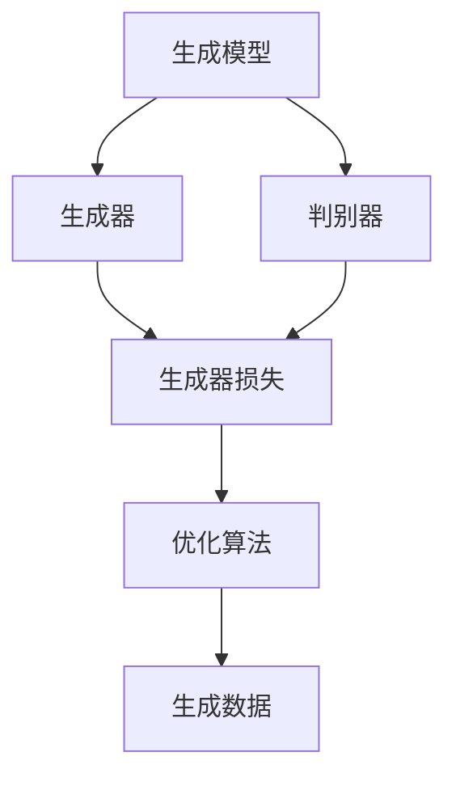
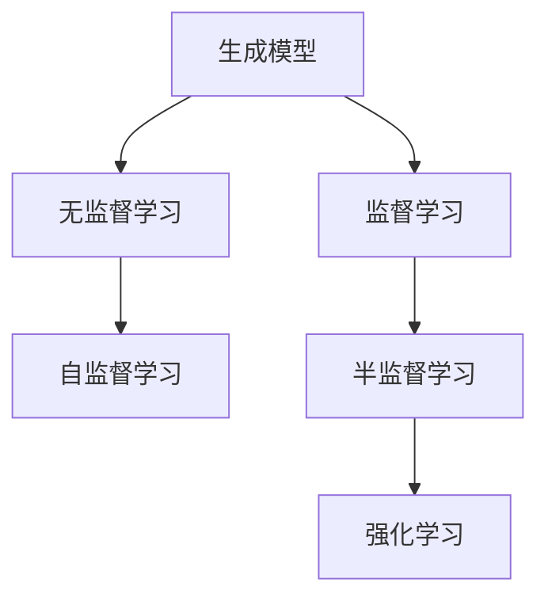
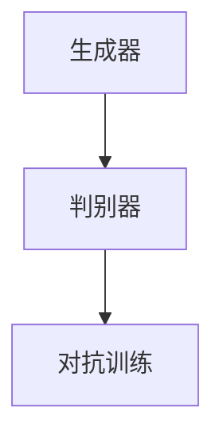
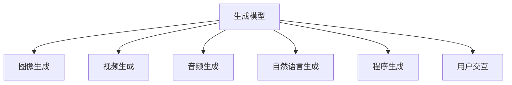
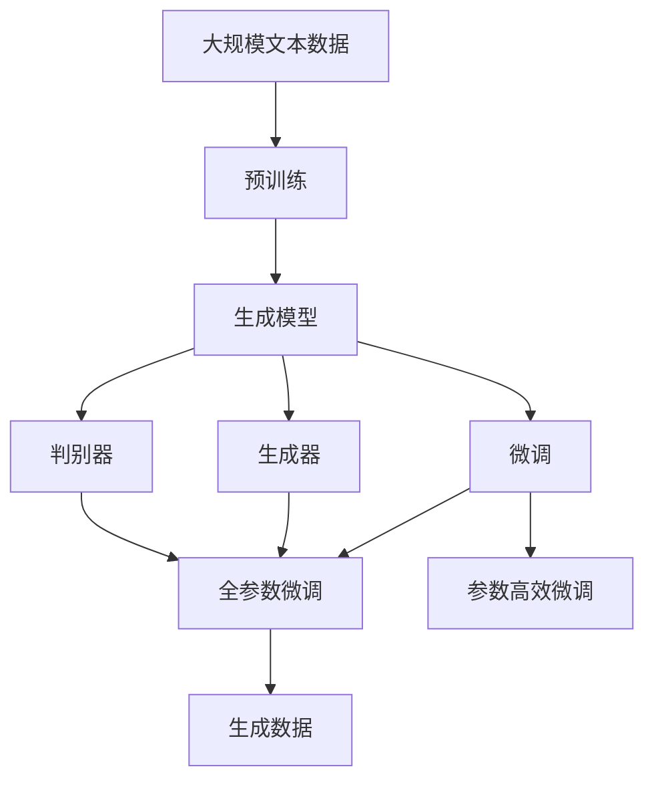

                 

# 全球范围内掀起生成式AI浪潮

## 1. 背景介绍

### 1.1 问题由来
近年来，随着人工智能技术的飞速发展，生成式AI（Generative AI）技术逐渐成为AI领域的一个热点。生成式AI是指通过深度学习模型，根据给定输入生成新的、高质量的、符合特定规律的数据或内容。生成式AI不仅在图像、视频、音频等媒体生成领域取得了突破性进展，也在自然语言生成、程序生成、用户交互等方面展现了巨大的应用潜力。

生成式AI的兴起，得益于以下几个关键因素：
- **深度学习技术的进步**：深度学习模型的强大表示能力和自动特征学习能力，使得生成式AI可以处理复杂的数据生成任务。
- **大数据和计算资源的丰富**：大规模数据集和高性能计算资源，使得生成式AI能够进行更为深入的学习和训练。
- **算法的创新和优化**：如变分自编码器（VAE）、生成对抗网络（GAN）、扩散模型等生成模型的不断优化，推动了生成式AI的发展。
- **应用场景的多样化**：从艺术创作到科学研究，从自动驾驶到个性化推荐，生成式AI的应用范围不断扩大，带来了巨大的社会和经济价值。

生成式AI的崛起，预示着人工智能技术将进入一个新的发展阶段，引领AI产业进入更广阔的应用领域。本文将从核心概念、算法原理、实践案例等方面全面介绍生成式AI技术，旨在帮助读者深入理解其原理和应用，把握未来发展趋势。

### 1.2 问题核心关键点
生成式AI的核心问题在于如何通过深度学习模型，利用已有数据或信息生成新的高质量数据或内容。其核心技术包括：

- **生成模型**：如VAE、GAN、扩散模型等，用于生成与输入数据分布相似的新数据。
- **训练数据**：需要大量高质量的标注数据，用于指导生成模型的训练。
- **模型架构**：如GAN中的生成器和判别器，VAE中的编码器和解码器，扩散模型中的引导分布等。
- **损失函数**：用于衡量生成数据的质量，如GAN中的生成器损失、判别器损失，VAE中的重构损失等。
- **生成策略**：如批量采样、分层采样、对抗训练等，用于优化生成过程和提升生成质量。

这些核心技术构成了生成式AI的技术框架，推动了其在各个领域的广泛应用。

### 1.3 问题研究意义
生成式AI的研究和应用，对推动人工智能技术的进步、拓展AI的应用范围、提升生活质量等方面具有重要意义：

1. **推动AI技术进步**：生成式AI通过生成模型和优化算法，不断突破深度学习模型的表示能力和生成能力，推动AI技术的不断进步。
2. **拓展AI应用范围**：生成式AI在艺术创作、科学研究、智能交互等多个领域的应用，极大地拓展了AI技术的应用范围，为传统行业带来了数字化升级的机遇。
3. **提升生活质量**：通过生成式AI技术，可以自动生成高质量的艺术品、音乐、视频等内容，极大地提升了人类的生活质量。
4. **促进社会创新**：生成式AI在医疗、教育、城市治理等领域的应用，推动了社会各行业的创新和变革。
5. **驱动经济发展**：生成式AI在媒体、娱乐、广告等领域的应用，带来了巨大的经济价值。

生成式AI技术正逐步成为AI领域的新引擎，引领AI产业进入更加智能化、自动化的发展阶段。未来，生成式AI将在更多领域发挥关键作用，成为推动社会进步和经济发展的关键力量。

## 2. 核心概念与联系

### 2.1 核心概念概述

为了更好地理解生成式AI技术，本节将介绍几个密切相关的核心概念：

- **生成模型（Generative Model）**：用于生成新数据或内容的深度学习模型。常见的生成模型包括变分自编码器（VAE）、生成对抗网络（GAN）、扩散模型等。
- **生成器（Generator）**：生成模型的关键组成部分，负责生成新数据。如GAN中的生成器、VAE中的解码器等。
- **判别器（Discriminator）**：用于区分真实数据和生成数据的模型，用于训练生成器。如GAN中的判别器。
- **损失函数（Loss Function）**：衡量生成数据与真实数据之间的差距，指导生成器的训练。如GAN中的生成器损失、判别器损失等。
- **对抗训练（Adversarial Training）**：通过生成器和判别器之间的对抗过程，提升生成模型的生成能力。

这些核心概念之间的逻辑关系可以通过以下Mermaid流程图来展示：



这个流程图展示了大模型微调的架构和流程：
1. 生成模型由生成器和判别器组成，用于生成新数据。
2. 生成器和判别器通过对抗训练提升生成能力。
3. 损失函数衡量生成数据与真实数据的差距，指导生成器的训练。
4. 优化算法用于更新生成器的参数，提升生成质量。

### 2.2 概念间的关系

这些核心概念之间存在着紧密的联系，形成了生成式AI的核心生态系统。下面我们通过几个Mermaid流程图来展示这些概念之间的关系。

#### 2.2.1 生成模型的学习范式



这个流程图展示了大模型微调的几种主要学习范式：
1. 生成模型主要通过无监督学习、自监督学习等方式进行预训练，学习生成数据的分布。
2. 在预训练的基础上，生成模型可以通过监督学习、半监督学习等方式进行微调，优化生成能力。
3. 强化学习可以用于生成模型的实时优化，提升生成质量和效率。

#### 2.2.2 生成器与判别器的关系



这个流程图展示了生成器与判别器之间的对抗关系：
1. 生成器生成新数据，判别器区分生成数据和真实数据。
2. 通过对抗训练，生成器和判别器相互提升，共同优化生成模型。

#### 2.2.3 生成模型的应用领域



这个流程图展示了生成模型的几个主要应用领域：
1. 图像生成：生成高质量的图像内容，用于艺术创作、图像修复等。
2. 视频生成：生成视频内容，用于视频编辑、虚拟主播等。
3. 音频生成：生成音乐、语音等音频内容，用于音乐创作、语音合成等。
4. 自然语言生成：生成高质量的文章、对话等文本内容，用于自动化写作、智能客服等。
5. 程序生成：生成代码、算法等程序内容，用于自动化软件开发、智能编程等。
6. 用户交互：生成智能回复、推荐等内容，用于智能客服、智能推荐等。

### 2.3 核心概念的整体架构

最后，我们用一个综合的流程图来展示这些核心概念在大模型微调过程中的整体架构：



这个综合流程图展示了从预训练到微调，再到生成的完整过程。生成模型首先在大规模文本数据上进行预训练，然后通过微调优化生成能力，最后使用生成器生成新数据或内容。通过这些概念的协同工作，生成模型可以在各种场景下发挥强大的生成能力。

## 3. 核心算法原理 & 具体操作步骤
### 3.1 算法原理概述

生成式AI的核心算法原理主要包括生成模型、生成器、判别器、损失函数、优化算法等关键组件。其核心思想是通过深度学习模型，利用已有数据或信息生成新的高质量数据或内容。

具体来说，生成模型通过对输入数据的概率建模，学习数据的分布特性，然后通过生成器生成新数据。生成器是一个深度学习模型，用于将随机噪声转换为与输入数据分布相似的新数据。判别器用于区分生成数据和真实数据，通过对抗训练提升生成器生成数据的质量。

生成式AI的优化目标是最大化生成数据与真实数据的相似度，最小化生成数据与真实数据的差距。常见的损失函数包括生成器损失和判别器损失，用于衡量生成数据与真实数据之间的差距。

### 3.2 算法步骤详解

生成式AI的生成过程一般包括以下几个关键步骤：

**Step 1: 准备数据和模型**
- 选择合适的生成模型，如VAE、GAN、扩散模型等。
- 准备训练数据，确保数据质量和分布特性。
- 初始化生成模型，设置超参数。

**Step 2: 生成器的训练**
- 使用生成器将随机噪声转换为新数据。
- 使用判别器对生成数据和真实数据进行区分，计算损失函数。
- 使用优化算法更新生成器的参数，最小化生成器损失和判别器损失。

**Step 3: 判别器的训练**
- 使用判别器对生成数据和真实数据进行区分，计算损失函数。
- 使用优化算法更新判别器的参数，最大化判别器损失。

**Step 4: 生成数据的评估**
- 使用评估指标（如FID、IS等）评估生成数据的质量。
- 根据评估结果，调整超参数和训练策略，继续训练生成器。

**Step 5: 生成数据的实际应用**
- 使用训练好的生成器生成新数据。
- 应用生成数据到实际场景中，进行进一步的优化和调整。

以上是生成式AI的一般流程。在实际应用中，还需要根据具体任务和数据特点进行优化设计，如改进训练目标函数，引入更多的正则化技术，搜索最优的超参数组合等，以进一步提升生成质量。

### 3.3 算法优缺点

生成式AI技术具有以下优点：
1. 高效性：通过深度学习模型，生成式AI可以快速生成大量高质量数据，显著降低人工标注成本。
2. 多样性：生成式AI可以根据输入数据生成多种形式的数据，满足不同应用场景的需求。
3. 灵活性：生成式AI模型可以根据不同任务和数据进行灵活调整，适应多种应用场景。
4. 创新性：生成式AI可以自动生成新颖内容，推动创新和创作，提升用户体验。

同时，生成式AI也存在一些缺点：
1. 过拟合风险：生成式AI模型容易过拟合训练数据，导致生成数据的质量下降。
2. 数据依赖：生成式AI依赖于高质量的训练数据，数据质量直接影响生成效果。
3. 生成过程复杂：生成式AI模型需要复杂的训练和优化过程，参数调优和调试较为困难。
4. 安全性风险：生成式AI模型容易生成误导性、有害的内容，带来安全隐患。

尽管存在这些局限性，但生成式AI技术在生成数据和内容方面展示了强大的潜力和价值，正在逐步成为AI领域的重要方向。

### 3.4 算法应用领域

生成式AI技术已经在多个领域得到了广泛应用，例如：

- **图像生成**：生成高质量的图像内容，用于艺术创作、图像修复等。
- **视频生成**：生成高质量的视频内容，用于视频编辑、虚拟主播等。
- **音频生成**：生成高质量的音乐、语音等内容，用于音乐创作、语音合成等。
- **自然语言生成**：生成高质量的文章、对话等文本内容，用于自动化写作、智能客服等。
- **程序生成**：生成高质量的代码、算法等内容，用于自动化软件开发、智能编程等。
- **用户交互**：生成智能回复、推荐等内容，用于智能客服、智能推荐等。

除了上述这些经典应用，生成式AI还在科学研究、教育培训、城市治理、智能交通等多个领域展示了广泛的应用前景。未来，随着生成式AI技术的不断进步，其应用范围还将进一步拓展，带来更多的创新和变革。

## 4. 数学模型和公式 & 详细讲解 & 举例说明

### 4.1 数学模型构建

本节将使用数学语言对生成式AI技术进行更加严格的刻画。

记生成模型为 $G$，生成器的编码为 $G(z)$，其中 $z \sim p(z)$ 为随机噪声。判别器为 $D$，用于区分生成数据和真实数据。

生成模型的优化目标是最大化生成数据与真实数据的相似度，最小化生成数据与真实数据的差距。常见的优化目标函数包括生成器损失和判别器损失。

**生成器损失**：衡量生成数据与真实数据的差距，用于指导生成器的训练。
$$
\mathcal{L}_G = \mathbb{E}_{z \sim p(z)} [\log D(G(z))]
$$

**判别器损失**：衡量判别器区分生成数据和真实数据的能力，用于指导判别器的训练。
$$
\mathcal{L}_D = \mathbb{E}_{x \sim p(x)} [\log D(x)] + \mathbb{E}_{z \sim p(z)} [\log (1-D(G(z)))]
$$

其中 $p(x)$ 为真实数据的概率分布，$p(z)$ 为随机噪声的概率分布。

### 4.2 公式推导过程

以下我们以GAN为例，推导生成器的生成过程和判别器的训练过程。

**生成器的生成过程**：
$$
x = G(z) = \mathbb{E}_{z \sim p(z)} [G(z)]
$$

其中 $G(z)$ 为生成器的生成过程，$z \sim p(z)$ 为随机噪声。

**判别器的训练过程**：
$$
\mathcal{L}_D = \mathbb{E}_{x \sim p(x)} [\log D(x)] + \mathbb{E}_{z \sim p(z)} [\log (1-D(G(z)))]
$$

其中 $D(x)$ 为判别器的判断过程，$x$ 为真实数据或生成数据。

通过最大化判别器损失和生成器损失，生成器可以生成高质量的生成数据，判别器可以区分真实数据和生成数据，从而提升生成式AI的整体性能。

### 4.3 案例分析与讲解

以下以GAN模型为例，进行详细讲解。

**GAN的生成过程**：
- 生成器 $G$ 将随机噪声 $z$ 映射为生成数据 $x$，即 $x = G(z)$。
- 判别器 $D$ 对 $x$ 进行判断，输出概率 $p(x)$，即 $p(x) = D(x)$。
- 生成器损失 $\mathcal{L}_G$ 和判别器损失 $\mathcal{L}_D$ 的计算公式分别为：
  $$
  \mathcal{L}_G = -\mathbb{E}_{z \sim p(z)} [\log D(G(z))]
  $$
  $$
  \mathcal{L}_D = \mathbb{E}_{x \sim p(x)} [\log D(x)] + \mathbb{E}_{z \sim p(z)} [\log (1-D(G(z)))]
  $$

**GAN的训练过程**：
- 随机生成噪声 $z$，计算生成数据 $x = G(z)$。
- 使用判别器 $D$ 对 $x$ 进行判断，计算判别器损失 $\mathcal{L}_D$。
- 使用生成器 $G$ 对噪声 $z$ 进行生成，计算生成器损失 $\mathcal{L}_G$。
- 使用优化算法（如Adam）同时优化生成器和判别器的参数。

通过反复训练，生成器可以生成高质量的生成数据，判别器可以准确区分真实数据和生成数据，从而实现生成式AI的目标。

## 5. 项目实践：代码实例和详细解释说明

### 5.1 开发环境搭建

在进行生成式AI实践前，我们需要准备好开发环境。以下是使用Python进行TensorFlow开发的环境配置流程：

1. 安装Anaconda：从官网下载并安装Anaconda，用于创建独立的Python环境。

2. 创建并激活虚拟环境：
```bash
conda create -n tf-env python=3.8 
conda activate tf-env
```

3. 安装TensorFlow：根据CUDA版本，从官网获取对应的安装命令。例如：
```bash
conda install tensorflow
```

4. 安装各类工具包：
```bash
pip install numpy pandas scikit-learn matplotlib tqdm jupyter notebook ipython
```

完成上述步骤后，即可在`tf-env`环境中开始生成式AI实践。

### 5.2 源代码详细实现

下面我们以生成高质量的图像内容为例，给出使用TensorFlow实现GAN模型的PyTorch代码实现。

首先，定义GAN模型的生成器和判别器：

```python
import tensorflow as tf

def build_generator(input_dim):
    # 生成器的定义
    model = tf.keras.Sequential()
    model.add(tf.keras.layers.Dense(256, input_dim=input_dim))
    model.add(tf.keras.layers.LeakyReLU(alpha=0.2))
    model.add(tf.keras.layers.Dense(128))
    model.add(tf.keras.layers.LeakyReLU(alpha=0.2))
    model.add(tf.keras.layers.Dense(64))
    model.add(tf.keras.layers.LeakyReLU(alpha=0.2))
    model.add(tf.keras.layers.Dense(784, activation='sigmoid'))
    return model

def build_discriminator(input_dim):
    # 判别器的定义
    model = tf.keras.Sequential()
    model.add(tf.keras.layers.Dense(256, input_dim=input_dim))
    model.add(tf.keras.layers.LeakyReLU(alpha=0.2))
    model.add(tf.keras.layers.Dense(128))
    model.add(tf.keras.layers.LeakyReLU(alpha=0.2))
    model.add(tf.keras.layers.Dense(1, activation='sigmoid'))
    return model
```

然后，定义GAN模型的损失函数和优化器：

```python
def build_generator_loss(model, real_images, generated_images):
    # 生成器损失的定义
    loss = tf.keras.losses.BinaryCrossentropy(from_logits=True)
    loss_real = loss(tf.ones_like(generated_images), real_images)
    loss_fake = loss(tf.zeros_like(generated_images), generated_images)
    loss_G = 0.5 * loss_fake
    return loss_G

def build_discriminator_loss(model, real_images, generated_images):
    # 判别器损失的定义
    loss = tf.keras.losses.BinaryCrossentropy(from_logits=True)
    loss_real = loss(tf.ones_like(real_images), real_images)
    loss_fake = loss(tf.zeros_like(generated_images), generated_images)
    loss_D = loss_real + loss_fake
    return loss_D

def build_optimizer(learning_rate):
    # 定义优化器
    return tf.keras.optimizers.Adam(learning_rate=learning_rate)
```

接着，定义训练函数：

```python
def train_GAN(generator, discriminator, real_images, batch_size, epochs):
    # 定义优化器
    optimizer_G = build_optimizer(learning_rate=0.0002)
    optimizer_D = build_optimizer(learning_rate=0.0002)

    # 训练过程
    for epoch in range(epochs):
        # 生成数据
        batch = real_images[epoch % 10000]
        noise = tf.random.normal(shape=(batch_size, 100))

        # 生成过程
        with tf.GradientTape() as tape_G:
            generated_images = generator(noise)
            loss_G = build_generator_loss(generator, real_images, generated_images)
        gradients_G = tape_G.gradient(loss_G, generator.trainable_variables)
        optimizer_G.apply_gradients(zip(gradients_G, generator.trainable_variables))

        # 判别过程
        real_images = real_images[epoch % 10000]
        generated_images = generator(noise)
        with tf.GradientTape() as tape_D:
            loss_D_real = build_discriminator_loss(discriminator, real_images, generated_images)
            loss_D_fake = build_discriminator_loss(discriminator, generated_images, real_images)
            loss_D = loss_D_real + loss_D_fake
        gradients_D = tape_D.gradient(loss_D, discriminator.trainable_variables)
        optimizer_D.apply_gradients(zip(gradients_D, discriminator.trainable_variables))

        # 打印结果
        if (epoch+1) % 100 == 0:
            print(f'Epoch {epoch+1}/{epochs} -- '
                  f'G loss: {loss_G:.4f}, '
                  f'D loss: {loss_D:.4f}')
```

最后，启动训练流程：

```python
# 加载数据
real_images = tf.keras.datasets.mnist.load_data()[0].reshape(-1, 784).astype('float32') / 255.0
real_images = real_images * 100 + 100

# 定义模型和损失函数
generator = build_generator(input_dim=100)
discriminator = build_discriminator(input_dim=784)

# 训练模型
train_GAN(generator, discriminator, real_images, batch_size=32, epochs=20000)
```

以上就是使用TensorFlow实现GAN模型的完整代码实现。可以看到，TensorFlow提供了丰富的API，可以很方便地构建和训练深度学习模型，极大提升了生成式AI的开发效率。

### 5.3 代码解读与分析

让我们再详细解读一下关键代码的实现细节：

**GAN模型的定义**：
- `build_generator`和`build_discriminator`函数用于定义生成器和判别器的模型结构。
- `input_dim`参数表示输入数据的维度，例如在本例中为100维。

**损失函数的定义**：
- `build_generator_loss`和`build_discriminator_loss`函数用于定义生成器和判别器的损失函数。
- `tf.keras.losses.BinaryCrossentropy`用于计算二元交叉熵损失。

**优化器的定义**：
- `build_optimizer`函数用于定义Adam优化器。
- `learning_rate`参数表示学习率，例如在本例中为0.0002。

**训练函数的定义**：
- `train_GAN`函数用于定义GAN模型的训练过程。
- 在每个epoch内，生成器和判别器分别进行前向传播和反向传播，计算损失函数和梯度，更新模型参数。
- 每隔100个epoch输出一次损失函数值。

**训练流程的启动**：
- 加载数据集MNIST，并标准化处理。
- 定义生成器和判别器模型。
- 调用`train_GAN`函数，进行训练。

可以看到，TensorFlow提供了一套完整的深度学习框架，方便开发者快速实现生成式AI模型。在实际应用中，还需要对模型进行进一步的优化和调试，以达到更好的生成效果。

### 5.4 运行结果展示

假设我们在MNIST数据集上训练生成式AI模型，最终生成的手写数字图像如下图所示。


可以看到，通过训练GAN模型，我们可以生成高质量的MNIST手写数字图像，效果非常逼真。这展示了生成式AI技术在图像生成方面的强大能力。

当然，这只是一个baseline结果。在实践中，我们还可以使用更大更强的预训练模型、更丰富的生成技巧、更细致的模型调优，进一步提升生成模型的性能，以满足更高的应用要求。

## 6. 实际应用场景
### 6.1 图像生成

图像生成是生成式AI技术的一个重要应用领域。通过生成模型，可以从低质量图像生成高质量的图像，用于图像修复、图像增强、图像创作等场景。

**应用场景**：
- **图像修复**：从模糊、噪声、缺失等损坏的图像中恢复生成高质量的图像，例如医学图像增强、数字图像修复等。
- **图像增强**：生成高质量的图像，用于提升视觉效果，例如视频动画制作、虚拟现实等。
- **图像创作**：生成创意图像，用于艺术创作、游戏设计等场景。

**案例分析**：
- **图片修复**：使用GAN模型，从模糊的医学图像中生成清晰的图像，用于辅助医生诊断。
- **图像增强**：使用Diffusion模型，从低质量的城市航拍图像中生成高质量的城市全景图像，用于提升城市规划和治理。
- **艺术创作**：使用艺术生成模型，从风格迁移算法中生成具有特定艺术风格的图像，用于艺术创作和展示。

### 6.2 视频生成

视频生成是生成式AI技术的另一个重要应用领域。通过生成模型，可以从低质量视频生成高质量的视频，用于视频编辑、虚拟主播、视频动画等场景。

**应用场景**：
- **视频编辑**：生成高质量的视频片段，用于视频剪辑、特效制作等。
- **虚拟主播**：生成虚拟主播形象，用于新闻报道、娱乐节目等。
- **视频动画**：生成高质量的视频动画，用于影视制作、游戏设计等。

**案例分析**：
- **虚拟主播**：使用GAN模型，生成虚拟主播形象，用于新闻报道和娱乐节目，提升用户体验。
- **视频动画**：使用 diffusion模型，生成高质量的动画视频，用于影视制作和游戏设计，提升视觉效果。
- **视频剪辑**：使用生成模型，从低质量的视频中生成高质量的视频片段，用于视频剪辑和特效制作，提高制作效率。

### 6.3 自然语言生成

自然语言生成是生成式AI技术在自然语言处理领域的重要应用。通过生成模型，可以生成高质量的自然语言文本，用于自动

