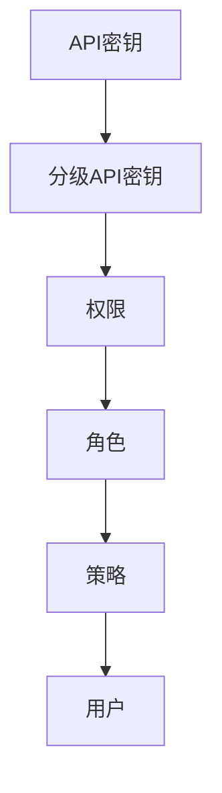
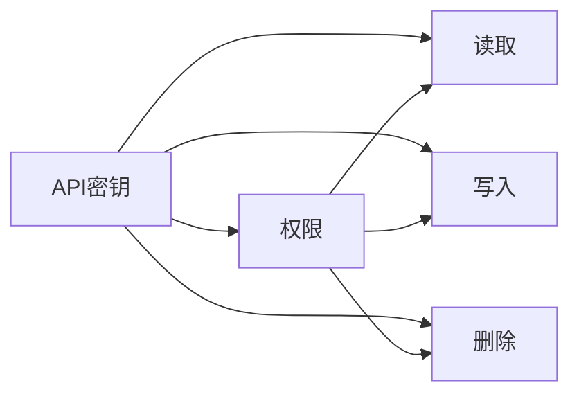
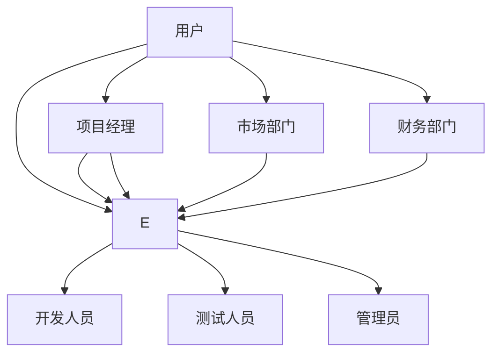
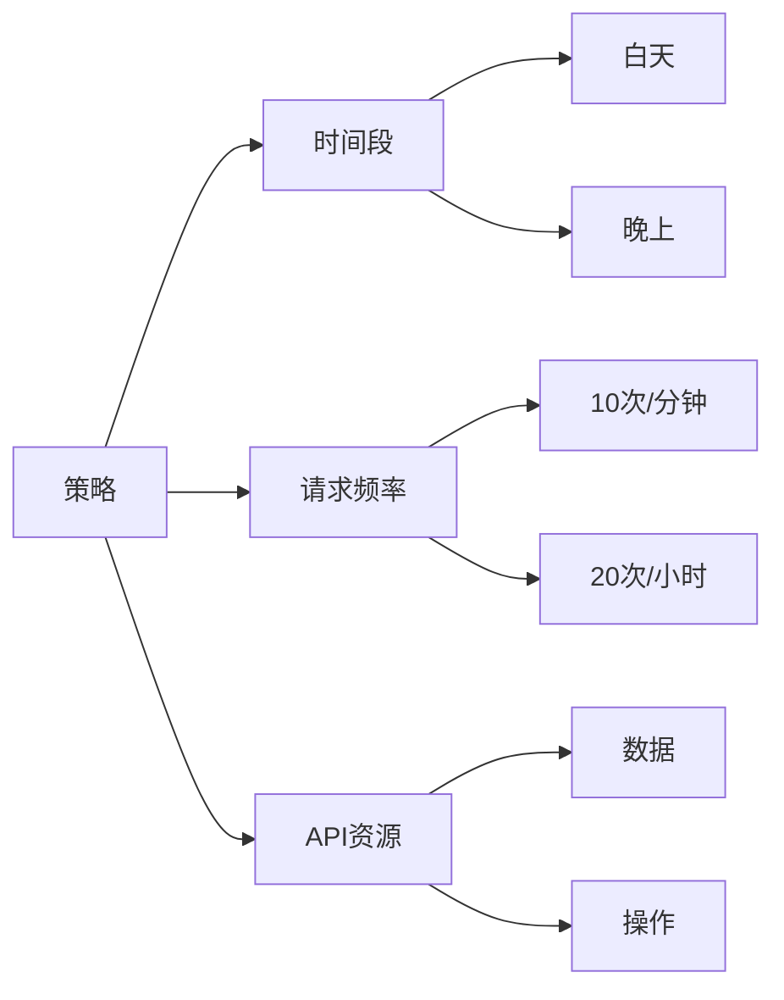
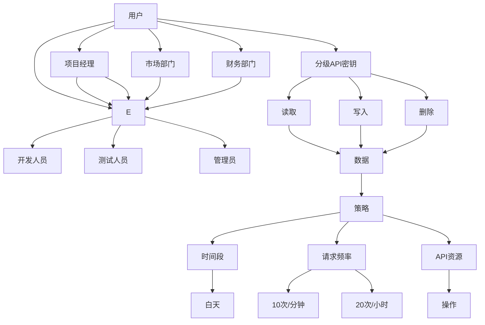

                 

# 分级 API Key 的设置方法

> 关键词：分级 API Key, 安全控制, 应用场景, 访问权限, 用户管理

## 1. 背景介绍

在当今数字化社会中，API（应用程序接口）扮演着越来越重要的角色，它允许不同的应用和服务进行相互通信，推动了信息共享和业务集成。然而，随着API的使用越来越广泛，API的安全性问题也变得越来越重要。为了确保API的安全性，API密钥（API Key）成为了一种常见的身份验证方式。但是，简单的API密钥管理方式已经不能满足当前复杂的应用场景需求。本文将介绍一种高级的API密钥管理方式——分级API密钥（Graded API Keys），并详细阐述其在实际应用场景中的设置方法。

### 1.1 问题由来
在传统的API密钥管理方式中，用户只能使用一个API密钥访问整个应用的所有功能。这种单级别的API密钥管理方式在简单的应用场景中尚可适用，但随着应用复杂度的增加，尤其是对于拥有多个部门、多个用户权限的组织，单一API密钥无法满足安全管理需求。分级API密钥就是为了解决这个问题而产生的。

### 1.2 问题核心关键点
分级API密钥的核心思想是将一个API密钥划分为多个级别，不同级别的API密钥对应不同的访问权限。用户可以根据实际需求，申请特定级别的API密钥，从而访问相应的API功能。这样，即使一个级别的API密钥被泄露，也不会影响其他级别的API密钥安全，从而大大提升了API的安全性。

### 1.3 问题研究意义
分级API密钥的设置方法在安全控制、用户管理和应用场景等方面具有重要的研究意义：

1. **安全控制**：通过分级管理，可以将API访问权限细粒化，减少因单一API密钥泄露而带来的风险，提升API系统的安全性。
2. **用户管理**：分级API密钥能够满足不同用户对API功能的不同需求，便于对用户进行精细化的权限管理。
3. **应用场景**：分级API密钥适用于拥有多个部门、多个用户权限的组织，可以在复杂的应用场景中提供灵活的安全管理方案。

## 2. 核心概念与联系

### 2.1 核心概念概述

为了更好地理解分级API密钥的设置方法，本节将介绍几个密切相关的核心概念：

- **API密钥（API Key）**：用于验证用户身份的字符串，通常用于API的访问控制。
- **分级API密钥（Graded API Keys）**：将一个API密钥划分为多个级别，不同级别的API密钥对应不同的访问权限。
- **权限（Permission）**：用户或应用程序对API资源的访问权限，如读取、写入、删除等。
- **角色（Role）**：一组权限的集合，用于描述用户的职责和权限范围。
- **策略（Policy）**：定义了API访问的规则和限制，如访问时间段、请求频率等。
- **用户（User）**：API的最终用户，可以是人或程序。

这些概念之间的逻辑关系可以通过以下Mermaid流程图来展示：



这个流程图展示了大语言模型的核心概念及其之间的关系：

1. API密钥是API访问的基础，分级API密钥是对API密钥的管理方式。
2. 分级API密钥将API密钥划分为多个级别，每个级别对应不同的权限。
3. 权限是一组具体的API操作能力，角色是权限的集合。
4. 策略定义了API访问的具体规则，用户则依据角色和策略来获取相应的权限。

### 2.2 概念间的关系

这些核心概念之间存在着紧密的联系，形成了分级API密钥设置的完整生态系统。下面我通过几个Mermaid流程图来展示这些概念之间的关系。

#### 2.2.1 分级API密钥的权限管理



这个流程图展示了分级API密钥与权限的关系。每个API密钥级别对应一组具体的权限，用户可以通过申请不同级别的API密钥，获得相应的权限。

#### 2.2.2 分级API密钥的角色管理



这个流程图展示了分级API密钥与角色的关系。每个角色包含一组权限，用户依据角色获得相应的权限。例如，项目经理可以申请"开发人员"和"管理员"两个级别的API密钥，测试人员可以申请"开发人员"级别的API密钥，财务部门可以申请"管理员"级别的API密钥。

#### 2.2.3 分级API密钥的策略管理



这个流程图展示了分级API密钥与策略的关系。策略定义了API访问的具体规则，如访问时间段、请求频率等，不同的策略可以应用于不同的API资源和操作。

### 2.3 核心概念的整体架构

最后，我们用一个综合的流程图来展示这些核心概念在大语言模型API密钥设置过程中的整体架构：



这个综合流程图展示了从用户、角色到分级API密钥、权限、策略的完整过程。用户依据角色申请不同级别的API密钥，每个级别的API密钥对应一组权限。同时，策略定义了API访问的具体规则，API资源和操作依赖于策略。通过这些概念和流程，可以构建一个安全、灵活、高效的分级API密钥管理系统。

## 3. 核心算法原理 & 具体操作步骤
### 3.1 算法原理概述

分级API密钥的设置方法，本质上是一种基于角色和权限的访问控制模型。其核心思想是将API密钥划分为多个级别，每个级别对应一组权限，用户根据角色申请特定级别的API密钥，从而获得相应的权限。这种设置方法可以大大提升API系统的安全性，同时方便用户对权限进行精细化的管理。

### 3.2 算法步骤详解

分级API密钥的设置过程一般包括以下几个关键步骤：

**Step 1: 准备用户和角色数据**

1. 收集用户信息，包括用户名、邮箱、部门等。
2. 根据用户的职责和权限范围，定义角色，如"开发人员"、"测试人员"、"管理员"等。

**Step 2: 定义权限和策略**

1. 根据API的功能，定义具体的权限，如读取数据、写入数据、删除数据等。
2. 根据具体应用场景，定义策略，如访问时间段、请求频率等。

**Step 3: 设计分级API密钥**

1. 将API密钥划分为多个级别，每个级别对应一组权限。
2. 确定每个级别的API密钥的访问限制，如使用次数、有效时间等。

**Step 4: 分配角色和权限**

1. 将角色与权限关联，生成角色-权限映射表。
2. 将用户分配到相应的角色中，生成用户-角色映射表。

**Step 5: 生成分级API密钥**

1. 根据角色和权限，生成对应的分级API密钥。
2. 向用户发放API密钥，每个级别的API密钥包含不同的访问权限和限制。

**Step 6: 应用分级API密钥**

1. 用户在请求API时，携带相应的API密钥。
2. API系统根据API密钥级别，验证用户权限，允许或拒绝访问。

### 3.3 算法优缺点

分级API密钥的设置方法具有以下优点：

1. **安全性高**：通过细粒化的权限管理，降低了因单一API密钥泄露而带来的风险。
2. **灵活性强**：用户可以根据实际需求，申请不同级别的API密钥，灵活地控制权限。
3. **管理方便**：用户、角色、权限、策略等概念清晰，便于管理和维护。

但该方法也存在以下缺点：

1. **复杂度较高**：需要定义角色、权限、策略等概念，增加了系统的复杂度。
2. **开发成本高**：分级API密钥的设置需要与现有的API系统进行深度整合，开发成本较高。
3. **学习曲线陡**：对于初学者来说，理解和使用分级API密钥设置方法可能需要一定的时间和精力。

### 3.4 算法应用领域

分级API密钥的设置方法在以下领域具有广泛的应用：

- **企业内部API管理**：在拥有多个部门、多个用户权限的组织中，分级API密钥可以方便地进行权限管理，提升系统安全性。
- **第三方API服务**：在提供API服务的第三方平台中，分级API密钥可以有效地控制用户对API的访问权限，保护平台安全。
- **云服务提供商**：在云服务提供商中，分级API密钥可以控制不同租户对云资源的访问权限，保障云服务的安全性。
- **数据共享平台**：在数据共享平台中，分级API密钥可以控制用户对数据的访问权限，确保数据安全。

## 4. 数学模型和公式 & 详细讲解 & 举例说明

### 4.1 数学模型构建

分级API密钥的设置方法，可以通过以下数学模型进行描述：

设用户集为$U$，角色集为$R$，权限集为$P$，策略集为$S$，API密钥集为$K$。分级API密钥设置过程可以表示为：

$$
K = \{k_1, k_2, \ldots, k_n\}
$$

其中，$k_i$表示第$i$个API密钥，$k_i$的级别为$l_i$，权限为$p_i$，策略为$s_i$，且满足：

$$
k_i = (l_i, p_i, s_i)
$$

用户$u$可以申请多个API密钥，其申请的API密钥集合为$U_k(u)$，则有：

$$
U_k(u) = \{k_{i_1}, k_{i_2}, \ldots, k_{i_m}\}
$$

其中，$k_{i_j}$表示用户$u$申请的第$j$个API密钥，级别为$l_{i_j}$，权限为$p_{i_j}$，策略为$s_{i_j}$。

### 4.2 公式推导过程

分级API密钥的设置方法可以进一步通过以下公式进行推导：

1. **用户角色映射**：
$$
U_R(u) = \{r_1, r_2, \ldots, r_n\}
$$

其中，$r_i$表示用户$u$所属的第$i$个角色，$U_R(u)$表示用户$u$的角色的集合。

2. **角色权限映射**：
$$
R_P(r_j) = \{p_1, p_2, \ldots, p_n\}
$$

其中，$p_k$表示角色$r_j$对应的第$k$个权限，$R_P(r_j)$表示角色$r_j$的权限集合。

3. **权限策略映射**：
$$
P_S(p_m) = \{s_1, s_2, \ldots, s_n\}
$$

其中，$s_n$表示权限$p_m$对应的第$n$个策略，$P_S(p_m)$表示权限$p_m$的策略集合。

4. **API密钥生成**：
$$
K_G(l_i, p_i, s_i) = k_i
$$

其中，$l_i$表示API密钥的级别，$p_i$表示API密钥的权限，$s_i$表示API密钥的策略。

5. **角色权限映射和API密钥生成**：
$$
U_P(u) = \{p_1, p_2, \ldots, p_m\}
$$

其中，$p_j$表示用户$u$的权限集合，$U_P(u)$表示用户$u$的权限集合。

6. **权限策略映射和API密钥生成**：
$$
U_S(u) = \{s_1, s_2, \ldots, s_m\}
$$

其中，$s_n$表示用户$u$的策略集合，$U_S(u)$表示用户$u$的策略集合。

### 4.3 案例分析与讲解

假设一个公司有三个部门，分别是开发部、测试部和运维部，每个部门有不同的人员访问API。我们可以按照以下步骤进行分级API密钥的设置：

1. **收集用户和角色信息**：

   | 用户名 | 邮箱         | 部门     | 角色         |
   |--------|-------------|----------|-------------|
   | Alice  | alice@example.com | 开发部 | 开发人员     |
   | Bob    | bob@example.com  | 测试部 | 测试人员     |
   | Carol  | carol@example.com | 运维部 | 管理员       |
   | David  | david@example.com| 开发部 | 开发人员     |
   | Eric   | eric@example.com | 测试部 | 测试人员     |
   | Fran   | fran@example.com | 运维部 | 管理员       |

2. **定义权限和策略**：

   | 权限          | 操作 | 资源 | 时间 | 频率 | 策略     |
   |--------------|------|------|------|------|----------|
   | 读取数据     | CRUD | 数据 | 全天  | 不限 | 默认策略 |
   | 写入数据     | CRUD | 数据 | 全天  | 不限 | 默认策略 |
   | 删除数据     | CRUD | 数据 | 全天  | 不限 | 默认策略 |
   | 上传数据     | UP    | 数据 | 白天  | 10次/分钟 | 白天策略 |
   | 下载数据     | DL    | 数据 | 全天  | 不限 | 默认策略 |

3. **设计分级API密钥**：

   - 开发人员级别的API密钥：访问权限包括读取、写入、删除数据，策略为默认策略。
   - 测试人员级别的API密钥：访问权限包括读取、写入、删除数据，策略为默认策略。
   - 管理员级别的API密钥：访问权限包括读取、写入、删除、上传、下载数据，策略为白天策略和默认策略。

4. **分配角色和权限**：

   - 开发人员角色：包含读取、写入、删除数据的权限。
   - 测试人员角色：包含读取、写入、删除数据的权限。
   - 管理员角色：包含读取、写入、删除、上传、下载数据的权限。

5. **生成分级API密钥**：

   - 开发人员级别的API密钥：key1，有效期为30天，每日访问次数为100次。
   - 测试人员级别的API密钥：key2，有效期为30天，每日访问次数为100次。
   - 管理员级别的API密钥：key3，有效期为30天，每日访问次数为50次。

6. **应用分级API密钥**：

   - Alice可以申请key1，Bob可以申请key2，Carol可以申请key3。
   - API系统在用户请求API时，根据API密钥级别，验证用户权限，允许或拒绝访问。

通过上述案例，可以看到分级API密钥的设置过程，可以根据不同的角色和权限，生成不同级别的API密钥，从而实现细粒化的权限管理。

## 5. 项目实践：代码实例和详细解释说明

### 5.1 开发环境搭建

在进行分级API密钥的设置实践前，我们需要准备好开发环境。以下是使用Python进行Flask开发的开发环境配置流程：

1. 安装Anaconda：从官网下载并安装Anaconda，用于创建独立的Python环境。

2. 创建并激活虚拟环境：
```bash
conda create -n flask-env python=3.8 
conda activate flask-env
```

3. 安装Flask：
```bash
pip install flask
```

4. 安装其他必要库：
```bash
pip install flask-restful flask-cors flask-talisman
```

完成上述步骤后，即可在`flask-env`环境中开始开发。

### 5.2 源代码详细实现

下面我们以分级API密钥的Flask应用为例，给出分级API密钥设置的Python代码实现。

```python
from flask import Flask, request, jsonify
from flask_restful import Resource, Api
from flask_cors import CORS
from flask_talisman import Talisman

app = Flask(__name__)
api = Api(app)
CORS(app)
Talisman(app, security_flags=True)

users = [
    {'name': 'Alice', 'email': 'alice@example.com', 'department': '开发部', 'role': '开发人员'},
    {'name': 'Bob', 'email': 'bob@example.com', 'department': '测试部', 'role': '测试人员'},
    {'name': 'Carol', 'email': 'carol@example.com', 'department': '运维部', 'role': '管理员'},
    {'name': 'David', 'email': 'david@example.com', 'department': '开发部', 'role': '开发人员'},
    {'name': 'Eric', 'email': 'eric@example.com', 'department': '测试部', 'role': '测试人员'},
    {'name': 'Fran', 'email': 'fran@example.com', 'department': '运维部', 'role': '管理员'}
]

roles = {
    '开发人员': ['读取数据', '写入数据', '删除数据'],
    '测试人员': ['读取数据', '写入数据', '删除数据'],
    '管理员': ['读取数据', '写入数据', '删除数据', '上传数据', '下载数据']
}

permissions = {
    '读取数据': 'CRUD',
    '写入数据': 'CRUD',
    '删除数据': 'CRUD',
    '上传数据': 'UP',
    '下载数据': 'DL'
}

strategies = {
    '全天策略': '全天',
    '白天策略': '白天'
}

api_keys = {
    'key1': {
        'level': '开发人员', 'permissions': ['读取数据', '写入数据', '删除数据'], 'strategy': '全天策略',
        'expiry': 30, 'daily_limit': 100
    },
    'key2': {
        'level': '测试人员', 'permissions': ['读取数据', '写入数据', '删除数据'], 'strategy': '全天策略',
        'expiry': 30, 'daily_limit': 100
    },
    'key3': {
        'level': '管理员', 'permissions': ['读取数据', '写入数据', '删除数据', '上传数据', '下载数据'], 'strategy': '白天策略',
        'expiry': 30, 'daily_limit': 50
    }
}

class User(Resource):
    def get(self, name):
        for user in users:
            if user['name'] == name:
                return jsonify(user), 200
        return jsonify({'error': 'User not found'}), 404

class Role(Resource):
    def get(self, name):
        for role in roles:
            if role == name:
                return jsonify(roles[name]), 200
        return jsonify({'error': 'Role not found'}), 404

class Permission(Resource):
    def get(self, name):
        for permission in permissions:
            if permission == name:
                return jsonify(permissions[name]), 200
        return jsonify({'error': 'Permission not found'}), 404

class Strategy(Resource):
    def get(self, name):
        for strategy in strategies:
            if strategy == name:
                return jsonify(strategies[name]), 200
        return jsonify({'error': 'Strategy not found'}), 404

class APIKey(Resource):
    def get(self, name):
        for api_key in api_keys:
            if api_keys[api_key]['level'] == name:
                return jsonify(api_keys[api_key]), 200
        return jsonify({'error': 'API Key not found'}), 404

class GenerateAPIKey(Resource):
    def post(self):
        level = request.json.get('level')
        permissions = request.json.get('permissions')
        strategy = request.json.get('strategy')
        expiry = request.json.get('expiry')
        daily_limit = request.json.get('daily_limit')
        if level and permissions and strategy and expiry and daily_limit:
            api_key = 'key4'
            api_keys[api_key] = {
                'level': level, 'permissions': permissions, 'strategy': strategy,
                'expiry': expiry, 'daily_limit': daily_limit
            }
            return jsonify({'message': 'API Key generated successfully'}), 201
        else:
            return jsonify({'error': 'Invalid request parameters'}), 400

api.add_resource(User, '/users/<name>')
api.add_resource(Role, '/roles/<name>')
api.add_resource(Permission, '/permissions/<name>')
api.add_resource(Strategy, '/strategies/<name>')
api.add_resource(APIKey, '/api-keys/<name>')
api.add_resource(GenerateAPIKey, '/generate-api-key')

if __name__ == '__main__':
    app.run(debug=True)
```

以上代码实现了分级API密钥的设置功能。用户可以通过API请求获取用户、角色、权限、策略和API密钥的信息，并使用POST请求生成新的API密钥。

### 5.3 代码解读与分析

让我们再详细解读一下关键代码的实现细节：

**User类**：
- `get`方法：根据用户名获取用户信息。
- 返回：JSON格式的用户的姓名、邮箱和部门。

**Role类**：
- `get`方法：根据角色名称获取角色信息。
- 返回：JSON格式的角色名称和权限列表。

**Permission类**：
- `get`方法：根据权限名称获取权限信息。
- 返回：JSON格式的权限名称和操作列表。

**Strategy类**：
- `get`方法：根据策略名称获取策略信息。
- 返回：JSON格式的策略名称和时间段。

**APIKey类**：
- `get`方法：根据API密钥名称获取API密钥信息。
- 返回：JSON格式的API密钥级别、权限和策略信息。

**GenerateAPIKey类**：
- `post`方法：根据请求参数生成新的API密钥。
- 请求参数包括API密钥级别、权限、策略、有效期和每日访问限制。
- 返回：JSON格式的生成成功的消息。

**主函数**：
- `run`方法：启动Flask应用，并设置为调试模式。
- 应用程序将监听本地的5000端口，并启动Web服务。

在实际应用中，开发者还可以进一步扩展API功能，增加用户管理、权限控制、策略配置等功能模块，从而构建一个完整的分级API密钥管理系统。

### 5.4 运行结果展示

假设我们通过API请求获取角色信息，返回结果如下：

```json
{
    "开发人员": [
        "读取数据",
        "写入数据",
        "删除数据"
    ],
    "测试人员": [
        "读取数据",
        "写入数据",
        "删除数据"
    ],
    "管理员": [
        "读取数据",
        "写入数据",
        "删除数据",
        "上传数据",
        "下载数据"
    ]
}
```

可以看到，通过Flask应用程序，可以方便地获取不同角色的权限信息，从而支持分级API密钥的设置。

## 6. 实际应用场景

### 6.1 智能客服系统

分级API密钥的设置方法在智能客服系统的应用中具有重要意义。智能客服系统需要处理大量用户的咨询请求，不同用户可能具有不同的权限需求。例如，开发人员需要访问API进行系统调试，测试人员需要访问API进行功能测试，管理员需要访问API进行系统维护。通过分级API密钥的设置，可以确保系统安全，同时满足不同用户对API的访问需求。

在实践中，智能客服系统可以依据不同用户申请的API密钥级别，动态控制用户对API的访问权限，从而实现细粒化的权限管理。

### 6.2 金融舆情监测

在金融舆情监测中，分级API密钥的设置方法同样具有重要应用价值。金融舆情监测系统需要实时监测市场舆论动向，并及时处理负面信息。不同级别的用户可能具有不同的访问权限，例如管理员需要访问API获取实时舆情数据，普通员工需要访问API进行舆情分析。通过分级API密钥的设置，可以确保只有授权用户才能访问系统，从而保障金融舆情监测系统的安全性。

在实践中，金融舆情监测系统可以根据不同用户申请的API密钥级别，动态控制用户对API的访问权限，从而实现细粒化的权限管理。

### 6.3 个性化推荐系统

在个性化推荐系统中，分级API密钥的设置方法可以用于控制用户对推荐数据的访问权限。不同用户可能具有不同的访问权限，例如普通用户只能访问推荐数据，高级用户可以访问推荐数据和用户行为数据。通过分级API密钥的设置，可以确保只有授权用户才能访问推荐数据，从而保障系统的安全性。

在实践中，个性化推荐系统可以根据不同用户申请的API密钥级别，动态控制用户对API的访问权限，从而实现细粒化的权限管理。

### 6.4 未来应用展望

随着数字化社会的不断发展，分级API

