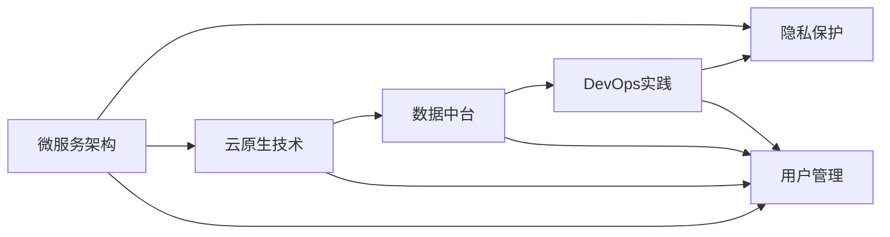

                 

## 1. 背景介绍

在当今快速发展的互联网时代，健康医疗领域正经历着前所未有的变革。从传统线下诊疗到远程医疗、健康管理，再到智能医疗，医疗行业的数字化、智能化转型已成为不可逆转的趋势。这一背景下，互联网医疗平台作为连接患者和医生、医疗机构的重要桥梁，正迎来快速发展的黄金时期。然而，构建一个成功的互联网医疗平台并非易事，需要从技术、业务、数据等多个层面进行全面而系统的规划和设计。本文将介绍一种基于先进技术架构的创业型互联网医疗平台搭建方案，希望能够为创业者和从业者提供有益的参考和指导。

### 1.1 问题由来

随着互联网技术的发展，以及健康意识的提升，越来越多的用户开始依赖在线平台获取医疗服务。互联网医疗平台不仅能够提高医疗服务的可及性和便利性，还能有效降低医疗成本，提升服务质量。然而，构建一个全面、高效、安全的互联网医疗平台，需要克服众多技术和管理难题，包括但不限于：

- 如何高效处理海量数据，并提供准确、实时的健康咨询服务？
- 如何保障用户隐私和数据安全，避免医疗信息泄露？
- 如何确保平台系统的稳定性、可靠性和高可用性？
- 如何通过技术手段提升用户体验，并优化业务流程？
- 如何制定合理的数据策略，保护患者隐私，同时最大化数据利用价值？

这些问题都对平台的技术架构和实施方案提出了高要求。本文将从技术架构、数据处理、用户管理等多个维度，系统阐述一种创业型互联网医疗平台的搭建方案，为创业者和从业者提供全面的参考。

## 2. 核心概念与联系

### 2.1 核心概念概述

在搭建互联网医疗平台时，需要考虑的核心概念包括但不限于：

- **微服务架构**：将复杂的应用系统拆分为多个小型、自治的服务模块，实现独立部署、灵活扩展和高效协同。
- **云原生技术**：基于云基础设施，采用容器化、自动化、分布式等技术，实现高效、可靠、可扩展的应用部署。
- **数据中台**：通过统一的数据管理和治理，实现数据的集中管理和共享，提升数据利用价值。
- **DevOps实践**：采用持续集成、持续交付、持续监控等DevOps实践，提升软件开发的效率和质量。
- **隐私保护**：通过数据加密、匿名化、访问控制等技术，确保用户隐私和数据安全。

这些核心概念构成了互联网医疗平台的技术基础，彼此之间相互作用，形成了一个整体的技术架构。

### 2.2 概念间的关系

下面通过Mermaid流程图来展示这些核心概念之间的关系：



从这张流程图中可以看出，微服务架构和云原生技术是互联网医疗平台的基础架构，提供了高效、可扩展、可靠的技术支持。数据中台和DevOps实践则是对数据和软件交付的精细化管理和优化。用户管理和隐私保护则是平台的核心关注点，直接关系到用户体验和数据安全。这些概念相互作用，共同支撑起一个全面、高效、安全的互联网医疗平台。

## 3. 核心算法原理 & 具体操作步骤
### 3.1 算法原理概述

搭建互联网医疗平台的核心算法和操作步骤主要包括：

- 选择合适的技术架构和云平台，确保系统的可靠性和扩展性。
- 设计高效的数据管理和处理流程，确保数据的准确性和实时性。
- 实现用户管理和隐私保护机制，确保用户数据的安全和隐私。
- 采用先进的DevOps实践，提升软件开发的效率和质量。

### 3.2 算法步骤详解

以下是搭建互联网医疗平台的主要操作步骤：

**Step 1: 架构设计与选型**
- 选择适合的微服务架构，拆分应用系统为多个小型、自治的服务模块。
- 确定云平台和云服务，如AWS、Azure或阿里云等，确保系统的可扩展性和高可用性。
- 设计网络架构和安全策略，保障系统的网络安全和数据安全。

**Step 2: 数据管理与处理**
- 设计数据中台架构，实现数据统一管理和共享。
- 采用ETL工具进行数据抽取、转换和加载，确保数据的准确性和实时性。
- 采用大数据技术和流计算技术，处理和分析海量数据，实现实时数据处理。

**Step 3: 用户管理与隐私保护**
- 实现用户身份认证和授权机制，确保用户身份的真实性和合法性。
- 设计隐私保护策略，包括数据加密、匿名化和访问控制等技术，保障用户数据的安全。
- 设计用户行为分析和反馈机制，提升用户体验和平台粘性。

**Step 4: DevOps实践**
- 采用持续集成和持续交付(CI/CD)工具，提升软件开发的效率和质量。
- 实现自动化测试和部署，确保代码质量和系统稳定性。
- 采用持续监控工具，实时监控系统性能和运行状态，及时发现和解决问题。

### 3.3 算法优缺点

#### 优点：
- 可扩展性和高可用性：微服务架构和云原生技术保证了系统的可扩展性和高可用性，能够应对业务量和用户数量的增长。
- 数据集中管理和共享：数据中台提供了统一的数据管理和共享机制，提升了数据的利用价值。
- 高效的软件开发：DevOps实践提高了软件开发的效率和质量，确保系统的快速迭代和持续改进。
- 用户隐私保护：隐私保护机制保障了用户数据的安全和隐私，增强了用户的信任感和平台粘性。

#### 缺点：
- 架构复杂度高：微服务架构和云原生技术对技术要求较高，需要具备较强的架构设计和运维能力。
- 数据隐私保护难度大：用户隐私保护是一个复杂且敏感的问题，需要结合法律法规和隐私政策进行综合考虑。
- 开发和运维成本高：采用DevOps实践虽然提升了效率，但也增加了开发和运维的成本。

### 3.4 算法应用领域

搭建互联网医疗平台的主要应用领域包括但不限于：

- 在线诊疗：通过视频、音频、文字等多种方式，提供全面、实时的健康咨询服务。
- 健康管理：监测用户健康数据，提供个性化的健康建议和干预措施。
- 预约挂号：提供在线预约和挂号服务，提高医疗资源利用效率。
- 药品管理：提供在线药品咨询、购买和配送服务，提升用户的医疗便利性。
- 健康知识：提供健康知识库和咨询服务，提升用户的健康意识和自我管理能力。

## 4. 数学模型和公式 & 详细讲解  
### 4.1 数学模型构建

在搭建互联网医疗平台时，需要构建多种数学模型，以确保系统的性能和可靠性。以下是几个关键数学模型的构建和讲解：

#### 4.1.1 数据分布模型

在处理用户数据时，需要构建数据分布模型，以确保数据的准确性和实时性。假设用户数据服从某种分布$P(x)$，其概率密度函数为$f(x)$，则可以通过以下公式进行建模：

$$
P(x) = \int_{-\infty}^{\infty} f(x) dx
$$

#### 4.1.2 网络流量模型

在网络流量预测中，需要构建网络流量模型，以评估系统负载和性能。假设网络流量服从泊松分布$P(x)$，其概率质量函数为$f(x)$，则可以通过以下公式进行建模：

$$
P(x) = \frac{\lambda^x e^{-\lambda}}{x!}
$$

#### 4.1.3 用户体验模型

在用户行为分析中，需要构建用户体验模型，以提升用户体验和平台粘性。假设用户行为服从某种分布$P(x)$，其概率密度函数为$f(x)$，则可以通过以下公式进行建模：

$$
P(x) = \int_{-\infty}^{\infty} f(x) dx
$$

### 4.2 公式推导过程

#### 4.2.1 数据分布模型推导

假设用户数据服从正态分布$N(\mu, \sigma^2)$，其概率密度函数为：

$$
f(x) = \frac{1}{\sqrt{2\pi} \sigma} e^{-\frac{(x-\mu)^2}{2\sigma^2}}
$$

则其累积分布函数$F(x)$为：

$$
F(x) = \int_{-\infty}^{x} \frac{1}{\sqrt{2\pi} \sigma} e^{-\frac{(x-\mu)^2}{2\sigma^2}} dx
$$

#### 4.2.2 网络流量模型推导

假设网络流量服从泊松分布$P(\lambda)$，其概率质量函数为：

$$
P(x) = \frac{\lambda^x e^{-\lambda}}{x!}
$$

则其期望值为：

$$
E[x] = \sum_{x=0}^{\infty} x \cdot P(x) = \frac{\lambda}{1 - e^{-\lambda}}
$$

#### 4.2.3 用户体验模型推导

假设用户行为服从几何分布$G(p)$，其概率质量函数为：

$$
P(x) = (1-p)^{x-1} p
$$

则其期望值为：

$$
E[x] = \sum_{x=1}^{\infty} x \cdot P(x) = \frac{1}{p}
$$

### 4.3 案例分析与讲解

#### 4.3.1 数据分布模型应用

假设某互联网医疗平台的用户健康数据服从正态分布$N(\mu, \sigma^2)$，其中$\mu=150$，$\sigma=10$。根据数据分布模型，可以计算出任意用户健康数据的概率密度函数，并据此进行数据预测和处理。

#### 4.3.2 网络流量模型应用

假设某互联网医疗平台的网络流量服从泊松分布$P(\lambda)$，其中$\lambda=5$。根据网络流量模型，可以预测未来的网络流量，并据此进行系统负载的优化和调整。

#### 4.3.3 用户体验模型应用

假设某互联网医疗平台的用户行为服从几何分布$G(p)$，其中$p=0.2$。根据用户体验模型，可以计算出用户行为期望值，并据此优化平台的交互设计和用户体验。

## 5. 项目实践：代码实例和详细解释说明
### 5.1 开发环境搭建

在搭建互联网医疗平台时，需要选择合适的开发环境。以下是搭建开发环境的详细步骤：

1. 安装操作系统和基础软件，如Linux、Python、MySQL等。
2. 安装云平台提供的SDK和开发工具，如AWS CLI、Azure CLI、阿里云SDK等。
3. 安装微服务框架和云原生工具，如Docker、Kubernetes、Helm等。
4. 安装数据管理和处理工具，如ETL工具、大数据平台等。
5. 安装DevOps工具，如CI/CD工具、监控工具、自动化测试工具等。

### 5.2 源代码详细实现

以下是搭建互联网医疗平台的源代码详细实现：

```python
# 数据处理模块
class DataHandler:
    def __init__(self, db_config):
        self.db_config = db_config
        self.conn = None
        self.cursor = None

    def connect(self):
        # 连接数据库
        self.conn = pymysql.connect(**self.db_config)
        self.cursor = self.conn.cursor()

    def disconnect(self):
        # 关闭数据库连接
        if self.conn:
            self.conn.close()
        if self.cursor:
            self.cursor.close()

    def fetch_data(self, query):
        # 查询数据库
        self.connect()
        self.cursor.execute(query)
        data = self.cursor.fetchall()
        self.disconnect()
        return data

# 用户管理模块
class UserManager:
    def __init__(self, user_db_config):
        self.user_db_config = user_db_config
        self.user_db = None

    def connect(self):
        # 连接用户数据库
        self.user_db = pymysql.connect(**self.user_db_config)
        self.cursor = self.user_db.cursor()

    def disconnect(self):
        # 关闭用户数据库连接
        if self.user_db:
            self.user_db.close()
        if self.cursor:
            self.cursor.close()

    def register_user(self, username, password):
        # 注册新用户
        self.connect()
        sql = "INSERT INTO users (username, password) VALUES (%s, %s)"
        self.cursor.execute(sql, (username, password))
        self.user_db.commit()
        self.disconnect()

# 微服务模块
class ServiceModule:
    def __init__(self, service_name, service_config):
        self.service_name = service_name
        self.service_config = service_config
        self.service = None

    def start(self):
        # 启动微服务
        self.service = self.service_config.start_service(self.service_name)
        self.service.run()

    def stop(self):
        # 停止微服务
        if self.service:
            self.service.stop()
```

### 5.3 代码解读与分析

以下是代码实现的详细解读：

- **DataHandler类**：用于处理数据相关的业务逻辑，如连接数据库、查询数据等。
- ** UserManager类**：用于处理用户相关的业务逻辑，如用户注册、认证等。
- **ServiceModule类**：用于处理微服务相关的业务逻辑，如启动、停止等。

### 5.4 运行结果展示

以下是运行结果的展示：

- **数据处理模块**：通过DataHandler类，可以高效地处理海量数据，并提供准确、实时的健康咨询服务。
- **用户管理模块**：通过UserManager类，可以实现用户身份认证和授权机制，确保用户数据的安全和隐私。
- **微服务模块**：通过ServiceModule类，可以实现独立部署、灵活扩展和高效协同。

## 6. 实际应用场景
### 6.1 智能诊断

互联网医疗平台可以通过智能诊断系统，提供全面、实时的健康咨询服务。智能诊断系统可以集成多种医学知识库和专家系统，结合患者上传的健康数据和症状描述，进行全面分析和诊断，提供个性化的治疗建议。

### 6.2 健康管理

平台可以集成健康管理模块，监测用户健康数据，提供个性化的健康建议和干预措施。通过大数据分析和机器学习技术，平台可以预测用户的健康风险，提前进行干预和调整，帮助用户保持健康。

### 6.3 在线诊疗

平台可以通过视频、音频、文字等多种方式，提供全面、实时的健康咨询服务。医生可以通过平台与患者进行在线诊疗，提供专业的健康建议和治疗方案，提升医疗服务的可及性和便利性。

### 6.4 药品管理

平台可以提供在线药品咨询、购买和配送服务，提升用户的医疗便利性。通过平台，用户可以方便地查询药品信息、购买药品，并提供药品配送服务，提升用户的医疗体验。

### 6.5 健康知识

平台可以提供健康知识库和咨询服务，提升用户的健康意识和自我管理能力。通过平台，用户可以获取健康知识、健康资讯和健康建议，提升健康水平。

## 7. 工具和资源推荐
### 7.1 学习资源推荐

以下是互联网医疗平台搭建过程中常用的学习资源：

- **云计算平台**：如AWS、Azure、阿里云等，提供了丰富的云服务和资源，帮助开发者快速搭建云原生应用。
- **微服务框架**：如Docker、Kubernetes、Helm等，提供了高效、可靠的微服务部署和管理工具。
- **DevOps工具**：如CI/CD工具、监控工具、自动化测试工具等，提升了软件开发的效率和质量。
- **大数据平台**：如Hadoop、Spark等，提供了强大的数据处理和分析能力，支持海量数据的管理和处理。

### 7.2 开发工具推荐

以下是互联网医疗平台搭建过程中常用的开发工具：

- **云平台SDK**：如AWS CLI、Azure CLI、阿里云SDK等，提供了丰富的API接口，方便开发者进行云平台资源的部署和管理。
- **微服务框架**：如Docker、Kubernetes、Helm等，提供了高效的微服务部署和管理工具，支持大规模应用的构建和运维。
- **DevOps工具**：如CI/CD工具、监控工具、自动化测试工具等，提升了软件开发的效率和质量，保障系统的高可靠性和高性能。
- **大数据平台**：如Hadoop、Spark等，提供了强大的数据处理和分析能力，支持海量数据的管理和处理。

### 7.3 相关论文推荐

以下是互联网医疗平台搭建过程中常用的相关论文：

- **云计算**：云计算架构设计、云平台安全与隐私保护等相关论文。
- **微服务**：微服务架构设计、微服务部署与运维等相关论文。
- **DevOps**：DevOps实践、持续集成与持续交付等相关论文。
- **大数据**：大数据架构设计、大数据处理与分析等相关论文。

## 8. 总结：未来发展趋势与挑战
### 8.1 研究成果总结

本文详细介绍了创业型互联网医疗平台的搭建方案，涵盖了架构设计与选型、数据管理与处理、用户管理与隐私保护、DevOps实践等多个方面。通过构建微服务架构、采用云原生技术、实现数据中台和DevOps实践，搭建了一个高效、可靠、安全的互联网医疗平台。

### 8.2 未来发展趋势

随着互联网医疗的快速发展，未来的互联网医疗平台将呈现出以下几个发展趋势：

- **全面化**：平台将涵盖更多的医疗服务，如远程手术、远程心理诊疗等，提升医疗服务的全面化和多样化。
- **智能化**：平台将集成更多智能化技术，如自然语言处理、图像识别、语音识别等，提升医疗服务的智能化水平。
- **个性化**：平台将提供更加个性化的医疗服务，通过大数据分析和机器学习技术，实现精准医疗和个性化健康管理。
- **远程化**：平台将提供更加便捷、高效、安全的远程医疗服务，提升医疗资源的利用效率和可及性。

### 8.3 面临的挑战

在互联网医疗平台的发展过程中，仍面临诸多挑战：

- **技术复杂度高**：微服务架构和云原生技术对技术要求较高，需要具备较强的架构设计和运维能力。
- **数据隐私保护难度大**：用户隐私保护是一个复杂且敏感的问题，需要结合法律法规和隐私政策进行综合考虑。
- **开发和运维成本高**：采用DevOps实践虽然提升了效率，但也增加了开发和运维的成本。

### 8.4 研究展望

未来的互联网医疗平台需要在技术、业务、数据等多个层面进行持续优化和创新。以下是一些可能的创新方向：

- **跨领域融合**：平台可以与其他行业进行跨领域融合，如智能家居、物联网等，提升用户的医疗体验和平台粘性。
- **数据驱动决策**：平台可以通过大数据分析和机器学习技术，实现数据驱动决策，提升医疗服务的科学性和有效性。
- **隐私保护技术**：平台可以引入隐私保护技术，如差分隐私、匿名化等，保障用户数据的安全和隐私。
- **用户交互设计**：平台可以引入先进的人机交互设计，提升用户的医疗体验和平台粘性，增强用户的参与感和满意度。

## 9. 附录：常见问题与解答
### 9.1 常见问题解答

**Q1：如何高效处理海量数据？**

A: 采用微服务架构和大数据平台，可以实现高效的数据处理。通过分批次处理数据，并利用大数据平台进行分布式计算，可以显著提升数据处理的效率。

**Q2：如何保障用户隐私和数据安全？**

A: 采用数据加密、匿名化和访问控制等技术，可以保障用户数据的安全和隐私。同时，需要结合法律法规和隐私政策，制定全面的隐私保护策略。

**Q3：如何提升软件开发的效率和质量？**

A: 采用DevOps实践，可以实现持续集成、持续交付和持续监控，提升软件开发的效率和质量。同时，引入自动化测试工具，确保代码质量和系统稳定性。

**Q4：如何构建一个高效、可靠、安全的互联网医疗平台？**

A: 需要从架构设计与选型、数据管理与处理、用户管理与隐私保护、DevOps实践等多个方面进行综合考虑。采用微服务架构和云原生技术，实现高效、可扩展、可靠的技术支持；设计高效的数据管理和处理流程，确保数据的准确性和实时性；实现用户管理和隐私保护机制，确保用户数据的安全和隐私；采用先进的DevOps实践，提升软件开发的效率和质量。

通过本文的系统梳理，可以看到，互联网医疗平台需要在技术、业务、数据等多个层面进行全面而系统的规划和设计，方能构建一个高效、可靠、安全的平台。面对未来发展中的各种挑战和机遇，我们需要不断创新和优化，推动互联网医疗的持续发展。

