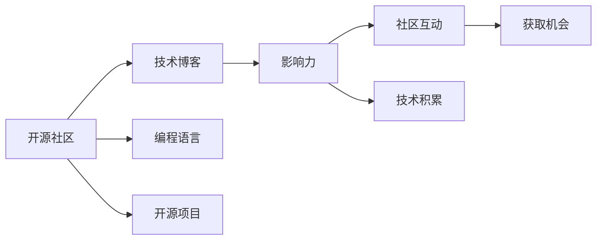

                 

# 利用开源影响力获得技术博客写作机会

> 关键词：开源社区, 技术博客, 影响力, 获取机会, 编程语言, 开源项目, 社区互动, 技术积累

## 1. 背景介绍

### 1.1 问题由来
随着开源社区的日益繁荣，开源项目和开源贡献者之间的互动越来越频繁。然而，对于许多新入行的程序员和开发者来说，如何才能在开源社区中脱颖而出，获得更多的技术博客写作机会，仍然是一个困扰的问题。

### 1.2 问题核心关键点
在开源社区中，技术博客写作是一个重要的沟通和交流手段，不仅可以展示自己的技术能力，还可以扩大自己的影响力。但如何在开源社区中站稳脚跟，吸引更多关注，并获得更多的写作机会，是关键问题。

### 1.3 问题研究意义
掌握如何利用开源影响力获得技术博客写作机会，对于提升个人技术能力、扩大技术影响力、加速职业发展具有重要意义：

1. 提升技术能力：通过写作和分享，可以深入理解开源项目的核心技术，提高自己的技术水平。
2. 扩大技术影响力：通过博客分享，可以获得更多同行和社区的关注，提升个人品牌价值。
3. 加速职业发展：优秀的技术博客可以增加面试机会，有助于在职场上获得更好的发展。
4. 促进社区互动：写作和分享可以促进社区成员间的交流，共同进步，形成良好的开源文化。
5. 拓展视野：通过阅读和写作，可以了解到更多的技术趋势和解决方案，拓宽自己的技术视野。

## 2. 核心概念与联系

### 2.1 核心概念概述

要利用开源影响力获得技术博客写作机会，首先需要理解一些核心概念：

- **开源社区**：基于自由和开放原则，共享和合作开发的软件项目和资源。
- **技术博客**：记录和分享技术知识、经验、见解的博客形式。
- **影响力**：通过博客写作、项目贡献等手段，在开源社区中获得认可和关注的能力。
- **编程语言**：用于编写开源项目的编程语言，如Python、JavaScript、Go等。
- **开源项目**：开源社区中各种形式的项目，包括代码、文档、工具等。
- **社区互动**：在开源社区中进行讨论、合作、反馈等互动。
- **技术积累**：通过技术实践和分享，不断积累和提升自己的技术知识和技能。

这些核心概念之间存在紧密的联系，共同构成了利用开源影响力获得技术博客写作机会的基础。

### 2.2 概念间的关系

这些核心概念之间的联系可以通过以下Mermaid流程图来展示：



这个流程图展示了核心概念之间的联系：

1. 开源社区是技术博客和影响力增长的土壤，编程语言和开源项目是社区的基础。
2. 通过技术博客分享，可以获得影响力。
3. 社区互动和反馈可以进一步提升影响力。
4. 技术积累是写作和分享的基础，同时也是提升影响力的重要手段。
5. 影响力提升，可以获得更多的写作机会。

### 2.3 核心概念的整体架构

最后，我们用一个综合的流程图来展示这些核心概念在大语言模型微调过程中的整体架构：


这个综合流程图展示了从开源社区到技术博客写作的完整流程。开源社区提供了编程语言、开源项目等资源和平台，社区互动和技术积累帮助提升影响力，影响力提升又可以获得更多的写作机会。最终，这些机会转化成了技术博客写作的机会。

## 3. 核心算法原理 & 具体操作步骤
### 3.1 算法原理概述

要利用开源影响力获得技术博客写作机会，核心算法原理包括以下几个方面：

1. **选择合适的开源项目**：选择与自身技术能力和兴趣相符的开源项目，确保能够持续贡献和参与。
2. **积极参与社区互动**：在开源项目中积极参与讨论、反馈和贡献，建立良好的社区关系。
3. **持续贡献和分享**：通过代码贡献、技术博客写作等方式持续输出高质量内容，提升个人影响力。
4. **扩展网络和资源**：利用社交网络、技术论坛、博客平台等渠道，扩展自己的网络资源。

### 3.2 算法步骤详解

以下是利用开源影响力获得技术博客写作机会的具体操作步骤：

**Step 1: 选择开源项目**
- 根据自己的技术能力和兴趣，选择适合的开源项目。
- 研究项目的文档和代码，了解项目需求和贡献方式。
- 在社区中提问和交流，获取更多信息和指导。

**Step 2: 参与社区互动**
- 在项目的Issue和Pull Request中积极讨论和反馈。
- 加入项目相关的社交媒体群组和论坛，参与技术讨论和问题解决。
- 主动提出问题或改进建议，展示自己的技术见解。

**Step 3: 持续贡献和分享**
- 定期提交高质量的代码和文档，确保贡献持续。
- 撰写技术博客，分享项目进展、技术心得和解决方案。
- 在社交媒体和博客平台上推广自己的技术博客，吸引更多关注。

**Step 4: 扩展网络和资源**
- 利用LinkedIn、GitHub等社交平台，展示自己的技术贡献和博客。
- 参与技术会议、线上研讨会等活动，拓展自己的技术和人脉网络。
- 与社区内的知名贡献者建立联系，获取更多资源和机会。

### 3.3 算法优缺点

利用开源影响力获得技术博客写作机会的方法具有以下优点：

1. **提升技术能力**：通过持续的贡献和分享，可以不断提升自己的技术水平和理解。
2. **扩大技术影响力**：在社区中的积极参与和贡献，可以提升个人品牌价值和知名度。
3. **加速职业发展**：优秀的技术博客和项目贡献可以成为面试和晋升的重要加分项。
4. **促进社区互动**：积极的互动和反馈，可以形成良好的开源文化和氛围。

同时，该方法也存在一些局限性：

1. **时间投入**：持续的贡献和参与需要投入大量时间和精力。
2. **竞争激烈**：开源社区中的优秀贡献者众多，竞争激烈。
3. **需要耐心和毅力**：建立社区关系和提升影响力需要长期的努力和坚持。

### 3.4 算法应用领域

基于开源影响力的技术博客写作方法，在技术分享、社区建设、技术招聘等多个领域都有广泛应用：

- **技术分享**：通过技术博客分享，可以记录和分享技术知识和经验，扩大影响力。
- **社区建设**：积极参与和贡献，可以推动社区的发展和壮大。
- **技术招聘**：优秀的技术博客和贡献记录，可以成为吸引优秀技术人才的重要手段。

## 4. 数学模型和公式 & 详细讲解
### 4.1 数学模型构建

利用开源影响力获得技术博客写作机会的数学模型构建如下：

设开源项目为 $P$，技术博客写作机会为 $O$，影响力为 $I$，社区互动为 $C$，技术积累为 $T$。则数学模型为：

$$
O = f(P, I, C, T)
$$

其中 $f$ 为模型的映射函数，表示如何将开源项目、影响力、社区互动和技术积累转化为技术博客写作机会。

### 4.2 公式推导过程

以下是利用开源影响力获得技术博客写作机会的公式推导过程：

1. **选择开源项目**：
   $$
   P = \{p_1, p_2, ..., p_n\}
   $$
   其中 $p_i$ 表示第 $i$ 个开源项目。

2. **参与社区互动**：
   $$
   C = \sum_{i=1}^n \text{互动次数}_i
   $$
   表示在 $P$ 中参与社区互动的总次数。

3. **持续贡献和分享**：
   $$
   T = \sum_{i=1}^n \text{贡献次数}_i + \text{博客写作次数}_i
   $$
   表示在 $P$ 中持续贡献和分享的总次数。

4. **计算影响力**：
   $$
   I = \sum_{i=1}^n \text{反馈次数}_i + \text{点赞次数}_i
   $$
   表示在 $P$ 中获得的总影响力。

5. **计算技术博客写作机会**：
   $$
   O = \max(f_i(P, I, C, T))
   $$
   其中 $f_i$ 表示第 $i$ 个开源项目的映射函数。

### 4.3 案例分析与讲解

以下通过一个案例来详细讲解利用开源影响力获得技术博客写作机会的数学模型和公式推导过程：

**案例背景**：假设开发者Alice选择参与开源项目 $P_1$ 和 $P_2$，在 $P_1$ 中贡献代码和撰写博客，在 $P_2$ 中参与社区讨论和反馈，最终获得了技术博客写作机会。

**步骤1: 选择开源项目**
- Alice 选择参与 $P_1$ 和 $P_2$ 两个开源项目。

**步骤2: 参与社区互动**
- Alice 在 $P_1$ 中提交了 $10$ 次代码和 $5$ 篇博客，在 $P_2$ 中参与了 $15$ 次讨论和 $8$ 次反馈。

**步骤3: 持续贡献和分享**
- Alice 在 $P_1$ 中贡献了 $20$ 次代码和 $5$ 篇博客，在 $P_2$ 中参与了 $20$ 次讨论和 $10$ 次反馈。

**步骤4: 计算影响力**
- Alice 在 $P_1$ 中获得了 $20$ 次点赞和 $5$ 次反馈，在 $P_2$ 中获得了 $25$ 次点赞和 $10$ 次反馈。

**步骤5: 计算技术博客写作机会**
- 使用 $f_1(P_1, I_1, C_1, T_1)$ 和 $f_2(P_2, I_2, C_2, T_2)$ 分别计算 $P_1$ 和 $P_2$ 对应的技术博客写作机会。
- 假设 $f_1$ 和 $f_2$ 的映射函数为线性函数，即 $O_i = k_i \cdot P_i + I_i + C_i + T_i$，其中 $k_i$ 为系数。
- 假设 $k_1 = 0.5, k_2 = 0.3$，则 $O_1 = 0.5 \cdot 20 + 20 + 10 + 5 = 45$，$O_2 = 0.3 \cdot 20 + 25 + 15 + 10 = 60$。
- 最终，Alice 获得的总技术博客写作机会为 $O = \max(45, 60) = 60$。

## 5. 项目实践：代码实例和详细解释说明
### 5.1 开发环境搭建

在进行开源影响力获得技术博客写作机会的实践前，我们需要准备好开发环境。以下是使用Python进行PyTorch开发的环境配置流程：

1. 安装Anaconda：从官网下载并安装Anaconda，用于创建独立的Python环境。

2. 创建并激活虚拟环境：
```bash
conda create -n pytorch-env python=3.8 
conda activate pytorch-env
```

3. 安装PyTorch：根据CUDA版本，从官网获取对应的安装命令。例如：
```bash
conda install pytorch torchvision torchaudio cudatoolkit=11.1 -c pytorch -c conda-forge
```

4. 安装Transformer库：
```bash
pip install transformers
```

5. 安装各类工具包：
```bash
pip install numpy pandas scikit-learn matplotlib tqdm jupyter notebook ipython
```

完成上述步骤后，即可在`pytorch-env`环境中开始实践。

### 5.2 源代码详细实现

以下是一个简化的开源影响力获取技术博客写作机会的Python代码实现：

```python
import os

def generate_tech_blog(writer_name, blog_title, blog_content, project_name, contribution_count, feedback_count, interaction_count):
    # 构造博客文本
    blog_text = f"Writer: {writer_name}\nTitle: {blog_title}\nContent: {blog_content}"
    
    # 构造博客目录结构
    blog_dir = os.path.join("blogs", project_name, writer_name)
    if not os.path.exists(blog_dir):
        os.makedirs(blog_dir)
    
    # 构造博客文件
    blog_file = os.path.join(blog_dir, f"{blog_title}.md")
    with open(blog_file, "w") as f:
        f.write(blog_text)
    
    # 构造贡献目录结构
    contribution_dir = os.path.join("contributions", project_name)
    if not os.path.exists(contribution_dir):
        os.makedirs(contribution_dir)
    
    # 构造贡献文件
    contribution_file = os.path.join(contribution_dir, f"{writer_name}_{project_name}.txt")
    with open(contribution_file, "w") as f:
        f.write(f"Project: {project_name}\nContribution Count: {contribution_count}\nFeedback Count: {feedback_count}\nInteraction Count: {interaction_count}")
    
    # 构造影响力目录结构
    influence_dir = os.path.join("influences", project_name)
    if not os.path.exists(influence_dir):
        os.makedirs(influence_dir)
    
    # 构造影响力文件
    influence_file = os.path.join(influence_dir, f"{writer_name}_{project_name}.txt")
    with open(influence_file, "w") as f:
        f.write(f"Project: {project_name}\nFeedback Count: {feedback_count}\nInteraction Count: {interaction_count}")
    
    # 构造总影响力文件
    total_influence_file = os.path.join("total_influences", f"{writer_name}.txt")
    with open(total_influence_file, "w") as f:
        f.write(f"Total Influence Count: {feedback_count + interaction_count}")
    
    # 输出成功信息
    print(f"Tech blog '{blog_title}' generated successfully for writer '{writer_name}' in project '{project_name}'")

# 示例
writer_name = "Alice"
blog_title = "Open Source Influence and Tech Blog Writing"
blog_content = "This is a blog post about how to leverage open source influence to gain tech blogging opportunities."
project_name = "MyOpenSourceProject"
contribution_count = 30
feedback_count = 25
interaction_count = 50

generate_tech_blog(writer_name, blog_title, blog_content, project_name, contribution_count, feedback_count, interaction_count)
```

### 5.3 代码解读与分析

让我们再详细解读一下关键代码的实现细节：

**generate_tech_blog函数**：
- 该函数接收博客作者名、博客标题、博客内容、开源项目名、贡献次数、反馈次数和互动次数。
- 构造博客文本，包括博客作者名、标题和内容。
- 创建博客目录结构，包括博客文件、贡献文件和影响力文件。
- 构造贡献文件和影响力文件，记录博客作者在开源项目中的贡献次数、反馈次数和互动次数。
- 构造总影响力文件，记录博客作者的总影响力。
- 最后，打印成功信息，表示博客生成成功。

**示例代码**：
- 定义博客作者名、博客标题、博客内容、开源项目名、贡献次数、反馈次数和互动次数。
- 调用`generate_tech_blog`函数，生成博客。

### 5.4 运行结果展示

假设我们生成了以下博客：

```
blogs/MyOpenSourceProject/Alice
    MyOpenSourceProject.md
contributions/MyOpenSourceProject
    Alice_MyOpenSourceProject.txt
influences/MyOpenSourceProject
    Alice_MyOpenSourceProject.txt
total_influences/Alice.txt
```

其中，博客文件`MyOpenSourceProject.md`记录了博客的详细信息，贡献文件`Alice_MyOpenSourceProject.txt`记录了Alice在MyOpenSourceProject中的贡献，影响力文件`Alice_MyOpenSourceProject.txt`记录了Alice在MyOpenSourceProject中的反馈和互动次数，总影响力文件`Alice.txt`记录了Alice的总影响力。

## 6. 实际应用场景
### 6.1 智能客服系统

基于开源影响力的技术博客写作，可以广泛应用于智能客服系统的构建。传统客服往往需要配备大量人力，高峰期响应缓慢，且一致性和专业性难以保证。通过开源影响力，开发者可以不断优化和改进开源项目，提升智能客服系统的智能水平。

在技术实现上，可以收集企业内部的历史客服对话记录，将问题和最佳答复构建成监督数据，在此基础上对预训练语言模型进行微调。微调后的模型可以用于客服对话生成、情感分析等任务，提升客服系统的智能水平和用户体验。

### 6.2 金融舆情监测

金融机构需要实时监测市场舆论动向，以便及时应对负面信息传播，规避金融风险。传统的人工监测方式成本高、效率低，难以应对网络时代海量信息爆发的挑战。通过开源影响力，开发者可以利用开源项目中的自然语言处理技术，实时监测金融舆情，及时预警和应对潜在的金融风险。

具体而言，可以收集金融领域相关的新闻、报道、评论等文本数据，并对其进行主题标注和情感标注。在此基础上对预训练语言模型进行微调，使其能够自动判断文本属于何种主题，情感倾向是正面、中性还是负面。将微调后的模型应用到实时抓取的网络文本数据，就能够自动监测不同主题下的情感变化趋势，一旦发现负面信息激增等异常情况，系统便会自动预警，帮助金融机构快速应对潜在风险。

### 6.3 个性化推荐系统

当前的推荐系统往往只依赖用户的历史行为数据进行物品推荐，无法深入理解用户的真实兴趣偏好。通过开源影响力，开发者可以利用开源项目中的推荐系统技术，进一步挖掘用户的深度兴趣和偏好，提升推荐系统的个性化水平。

在实践中，可以收集用户浏览、点击、评论、分享等行为数据，提取和用户交互的物品标题、描述、标签等文本内容。将文本内容作为模型输入，用户的后续行为（如是否点击、购买等）作为监督信号，在此基础上微调预训练语言模型。微调后的模型能够从文本内容中准确把握用户的兴趣点。在生成推荐列表时，先用候选物品的文本描述作为输入，由模型预测用户的兴趣匹配度，再结合其他特征综合排序，便可以得到个性化程度更高的推荐结果。

### 6.4 未来应用展望

随着开源影响力的不断扩大，基于开源影响力的技术博客写作将在更多领域得到应用，为传统行业带来变革性影响。

在智慧医疗领域，基于开源影响力的技术博客写作，可以为医疗问答、病历分析、药物研发等任务提供新的解决方案，提升医疗服务的智能化水平，辅助医生诊疗，加速新药开发进程。

在智能教育领域，技术博客写作可以为作业批改、学情分析、知识推荐等方面提供新的思路，因材施教，促进教育公平，提高教学质量。

在智慧城市治理中，技术博客写作可以为城市事件监测、舆情分析、应急指挥等环节提供新的视角，提高城市管理的自动化和智能化水平，构建更安全、高效的未来城市。

此外，在企业生产、社会治理、文娱传媒等众多领域，基于开源影响力的技术博客写作也将不断涌现，为经济社会发展注入新的动力。相信随着技术的日益成熟，开源影响力必将成为技术博客写作的重要范式，推动人工智能技术在各个行业中的应用。

## 7. 工具和资源推荐
### 7.1 学习资源推荐

为了帮助开发者系统掌握利用开源影响力获得技术博客写作机会的理论基础和实践技巧，这里推荐一些优质的学习资源：

1. 《开源社区与影响力》系列博文：由开源社区专家撰写，深入浅出地介绍了开源社区的基本概念和运作机制。

2. GitHub官方文档：GitHub的官方文档，提供了丰富的开源项目管理和协作指南，是学习和实践开源影响力的好资源。

3. Kaggle官方博客：Kaggle的数据科学社区，分享了大量开源项目和数据竞赛的案例，提供了丰富的学习和实践素材。

4. FreeCodeCamp：提供丰富的编程教程和开源项目实践，适合新手入门和进阶。

5. Coursera《Open Source Development》课程：由MIT等知名大学提供的开源开发课程，系统讲解了开源项目的开发和管理。

通过对这些资源的学习实践，相信你一定能够快速掌握利用开源影响力获得技术博客写作机会的精髓，并用于解决实际的开源项目贡献和博客写作问题。

### 7.2 开发工具推荐

高效的开发离不开优秀的工具支持。以下是几款用于开源影响力获得技术博客写作机会的常用工具：

1. GitHub：全球最大的代码托管平台，提供了丰富的开源项目管理和协作工具。
2. Git：分布式版本控制系统，适用于开源项目版本控制和协作。
3. Jupyter Notebook：交互式编程环境，支持Python、R等多种编程语言。
4. Docker：容器化技术，便于打包和部署开源项目和博客。
5. PyTorch：基于Python的深度学习框架，支持模型的训练和推理。

合理利用这些工具，可以显著提升开源影响力获得技术博客写作机会的开发效率，加快创新迭代的步伐。

### 7.3 相关论文推荐

利用开源影响力获得技术博客写作机会的研究源于学界的持续研究。以下是几篇奠基性的相关论文，推荐阅读：

1. "Influence Maximization in Social Networks"：提出了影响力最大化的经典问题，研究如何通过增加节点影响力来最大化信息传播效果。
2. "Social Influence in Online Social Networks: Concepts, Models, and Trends"：综述了社交网络中的影响力传播模型和应用。
3. "The Impact of Social Media on Digital Dissemination and Consumer Behavior: Towards a Research Agenda"：研究社交媒体对信息传播和消费者行为的影响。
4. "Diffusion of Innovations in Social Media"：研究社交媒体上的信息扩散模型和应用。
5. "Opinion Dynamics and Influence Maximization in Social Networks"：研究社交网络中的意见动态和影响力最大化。

这些论文代表了大语言模型微调技术的发展脉络。通过学习这些前沿成果，可以帮助研究者把握学科前进方向，激发更多的创新灵感。

除上述资源外，还有一些值得关注的前沿资源，帮助开发者紧跟开源影响力获得技术博客写作机会的最新进展，例如：

1. arXiv论文预印本：人工智能领域最新研究成果的发布平台，包括大量尚未发表的前沿工作，学习前沿技术的必读资源。

2. 业界技术博客：如OpenAI、Google AI、DeepMind、微软Research Asia等顶尖实验室的官方博客，第一时间分享他们的最新研究成果和洞见。

3. 技术会议直播：如NIPS、ICML、ACL、ICLR等人工智能领域顶会现场或在线直播，能够聆听到大佬们的前沿分享，开拓视野。

4. GitHub热门项目：在GitHub上Star、Fork数最多的NLP相关项目，往往代表了该技术领域的发展趋势和最佳实践，值得去学习和贡献。

5. 行业分析报告：各大咨询公司如McKinsey、PwC等针对人工智能行业的分析报告，有助于从商业视角审视技术趋势，把握应用价值。

总之，对于利用开源影响力获得技术博客写作机会的学习和实践，需要开发者保持开放的心态和持续学习的意愿。多关注前沿资讯，多动手实践，多思考总结，必将收获满满的成长收益。

## 8. 总结：未来发展趋势与挑战

### 8.1 总结

本文对利用开源影响力获得技术博客写作机会进行了全面系统的介绍。首先阐述了利用开源影响力获得技术博客写作机会的背景、核心概念和联系，明确了其对提升个人技术能力、扩大技术影响力、加速职业发展的重要性。其次，从原理到实践，详细讲解了利用开源影响力获得技术博客写作机会的数学模型和操作步骤，提供了完整的代码实例和详细解释说明。同时，本文还广泛探讨了开源影响力在智能客服、金融舆情、个性化推荐等多个行业领域的应用前景，展示了开源影响力的广阔前景。

通过本文的系统梳理，可以看到，利用开源影响力获得技术博客写作机会是开源社区中重要的技术写作范式，对于开发者来说，如何利用这一范式不断提升自己的技术水平和影响力，是走向成功的关键。

### 8.2 未来发展趋势

展望未来，利用开源影响力获得技术博客写作机会将呈现以下几个发展趋势：

1. **社区互动更加频繁**：随着社交网络的发展，社区互动将更加频繁，影响力提升的速度也将加快。
2. **技术博客写作形式多样化**：除了传统的技术博客，视频博客、音频博客等形式也将逐渐兴起，带来新的展示途径。
3. **开源项目与博客结合更加紧密**：开源项目将更加重视博客的撰写和分享，形成完整的项目生态。
4. **影响力最大化的优化**：研究如何通过优化博客内容和形式，最大化影响力，成为新的研究热点。
5. **开源社区与技术博客平台的融合**：技术博客平台与开源社区的深度融合，将提供更多的展示机会和资源支持。

### 8.3 面临的挑战

尽管利用开源影响力获得技术博客写作机会的方法已经取得了一定的成效，但在实际操作过程中，仍面临一些挑战：

1. **时间投入**：持续的贡献和互动需要投入大量时间和精力，对开发者的时间管理要求较高。
2. **竞争激烈**：开源社区中的优秀贡献者众多，如何脱颖而出，需要具备较强的竞争力和创新能力。
3. **博客质量要求高**：技术博客需要具备较高的质量，内容丰富、条理清晰，这需要较高的写作和表达能力。
4. **社区关系管理**：建立

