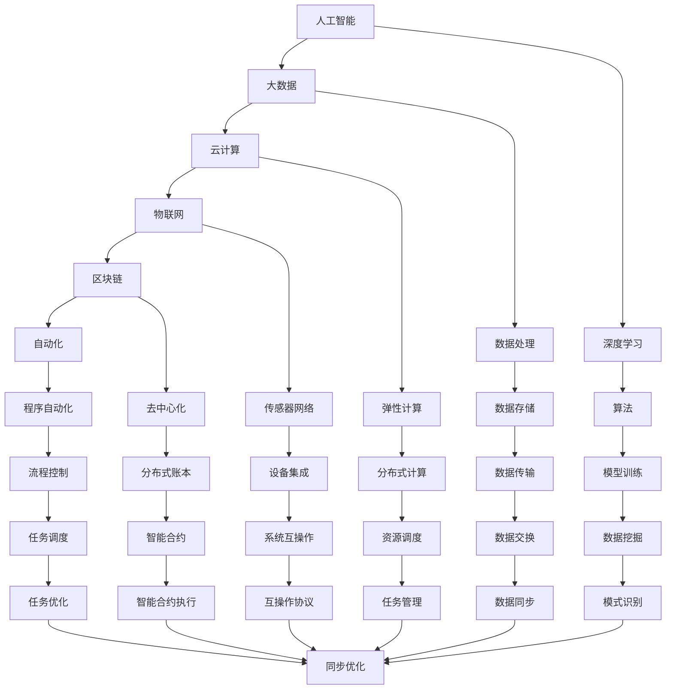
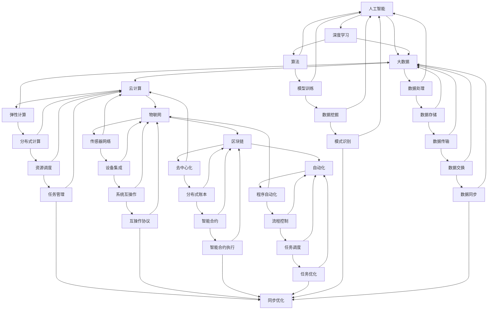

                 

# 利用技术洞察进行创新创业

> 关键词：
> 技术洞察，创新创业，人工智能，大数据，云计算，区块链，自动化，大数据，物联网，机器学习

## 1. 背景介绍

### 1.1 问题由来
随着技术的快速发展和互联网的普及，创新创业的环境发生了翻天覆地的变化。特别是过去十年间，技术的变革给各行各业带来了颠覆性的冲击，更是推动了新一轮的创新创业热潮。这些技术包括但不限于：人工智能、大数据、云计算、物联网、区块链、自动化等。技术在驱动经济和社会进步的同时，也带来了诸多机遇和挑战。

对于创业者来说，如何在技术快速迭代的背景下，把握技术发展的脉搏，利用技术洞察进行有效的创新创业，成为了一个值得深思的问题。本文将从技术洞察的角度，探讨如何通过深入理解技术趋势，利用先进的技术手段，驱动创业项目的成功。

### 1.2 问题核心关键点
技术洞察指的是对当前和未来的技术发展趋势的深度理解和预测，其关键点在于：

- **趋势分析**：准确判断技术的发展方向和潜力。
- **市场评估**：识别技术应用的市场机会和潜在用户。
- **风险评估**：评估技术应用面临的挑战和风险。
- **创新策略**：制定基于技术洞察的创新策略。
- **持续迭代**：随着技术的发展，不断调整和优化创新策略。

通过技术洞察，创业者可以更有效地识别机会，规避风险，提升创业项目的成功率。

### 1.3 问题研究意义
掌握技术洞察对于创业者至关重要，原因如下：

1. **降低创业风险**：通过准确的技术趋势分析，创业者可以避免盲目跟风，选择有潜力的技术方向。
2. **提升市场竞争力**：基于市场评估，可以定位目标用户和需求，提高产品的市场竞争力。
3. **优化资源配置**：利用技术洞察，可以更高效地分配创业资源，最大化投入产出比。
4. **增强应对变化的能力**：随着技术的发展，持续的技术洞察可以帮助创业者快速适应变化，保持项目的持续创新。

本文将详细探讨如何利用技术洞察进行创新创业，希望为创业者提供有价值的参考。

## 2. 核心概念与联系

### 2.1 核心概念概述

技术洞察的核心在于对技术的深度理解和应用。以下是几个相关核心概念的概述：

- **人工智能（AI）**：通过算法和数据模型，使机器能够模拟人类智能的行为。
- **大数据（Big Data）**：处理和分析大规模数据集的技术和工具。
- **云计算（Cloud Computing）**：通过互联网提供计算资源和服务的模式。
- **物联网（IoT）**：将各种设备和系统连接起来，实现物与物的互联。
- **区块链（Blockchain）**：一种去中心化的分布式账本技术。
- **自动化（Automation）**：使用技术自动化执行复杂和重复性任务。

这些核心概念通过深度学习和网络编程等技术，相互交织，共同构建了现代信息技术的基础。

### 2.2 概念间的关系

通过以下Mermaid流程图，我们可以更直观地理解这些核心概念之间的关系：



这个图表展示了核心概念之间的联系和互动，强调了技术的相互依存和协同效应。

### 2.3 核心概念的整体架构

从整体上看，这些核心概念共同构成了一个技术生态系统。以下是一个综合的Mermaid流程图，展示了这个生态系统的架构：



这个综合流程图展示了从预训练到微调，再到持续学习的完整过程。技术洞察的核心在于理解这些概念之间的相互作用和应用，以便更好地进行创新创业。

## 3. 核心算法原理 & 具体操作步骤
### 3.1 算法原理概述

技术洞察的实现需要依托于一系列的算法和模型。以下是一些核心算法原理的概述：

1. **趋势分析算法**：使用时间序列分析和机器学习模型，预测技术发展趋势。
2. **市场评估模型**：通过市场调研和用户需求分析，评估技术应用的潜在市场和用户需求。
3. **风险评估模型**：利用风险管理工具和算法，评估技术应用的风险和挑战。
4. **创新策略制定**：基于技术洞察结果，制定创新创业策略。
5. **持续迭代算法**：随着技术的发展，持续更新和优化创新策略。

这些算法和模型需要大量的数据和计算资源，通常使用Python、R、MATLAB等工具进行实现。

### 3.2 算法步骤详解

以下是一个详细的算法步骤流程：

1. **数据收集与预处理**：收集相关的技术数据和市场数据，进行清洗和预处理。
2. **趋势分析**：使用时间序列分析、回归模型等技术，预测技术发展的趋势和未来方向。
3. **市场评估**：通过用户调研、问卷调查等方式，收集市场数据，评估技术应用的潜在市场和用户需求。
4. **风险评估**：利用风险评估模型，评估技术应用面临的挑战和风险。
5. **创新策略制定**：基于技术洞察结果，制定创新策略，包括产品设计、市场定位、团队组成等。
6. **持续迭代**：随着技术的不断发展和市场变化，持续更新和优化创新策略。

### 3.3 算法优缺点

技术洞察的算法具有以下优点：

- **准确性高**：基于大量数据和先进算法，可以提供准确的技术趋势预测和市场评估。
- **适用性广**：适用于各种技术领域和市场环境，具有普遍适用性。
- **可扩展性强**：算法可以应用于小规模项目和大规模企业的创新创业。

同时，算法也存在一些缺点：

- **数据依赖**：算法需要大量高质量的数据，数据获取和处理成本较高。
- **模型复杂性**：算法模型的建立和优化需要专业知识和计算资源。
- **实时性问题**：算法模型的建立和优化需要时间，无法实时响应技术变化。

### 3.4 算法应用领域

技术洞察的应用领域非常广泛，包括但不限于：

- **初创企业**：选择技术方向和市场机会，制定创新策略。
- **技术咨询公司**：为企业提供技术洞察和市场评估服务。
- **风险投资公司**：评估技术创业项目，选择投资机会。
- **政府和公共机构**：制定技术政策和规划，引导技术发展方向。
- **科技媒体**：分析技术趋势，提供行业洞察和报道。

## 4. 数学模型和公式 & 详细讲解 & 举例说明

### 4.1 数学模型构建

基于技术洞察的数学模型构建，通常包括以下几个步骤：

1. **数据集构建**：收集相关数据，构建数据集。
2. **模型选择**：选择合适的数学模型，如回归模型、时间序列模型等。
3. **参数优化**：使用优化算法，如梯度下降、粒子群优化等，优化模型参数。
4. **模型评估**：使用测试数据集，评估模型性能。

### 4.2 公式推导过程

以回归模型为例，其基本公式为：

$$ y = \beta_0 + \beta_1 x_1 + \beta_2 x_2 + ... + \beta_n x_n + \epsilon $$

其中，$y$表示预测结果，$\beta$为模型参数，$x$表示输入特征，$\epsilon$表示误差。

### 4.3 案例分析与讲解

假设我们要分析一项新技术的市场趋势，使用时间序列模型进行预测。首先，收集历史数据，构建数据集：

$$ \begin{bmatrix} x_1 & x_2 & x_3 \\ 0.2 & 0.3 & 0.4 \end{bmatrix} $$

然后，使用最小二乘法求解模型参数$\beta$：

$$ \beta = (X^T X)^{-1} X^T y $$

其中，$X$为特征矩阵，$y$为标签向量。

最后，使用模型对未来数据进行预测：

$$ \hat{y} = \beta_0 + \beta_1 x_1 + \beta_2 x_2 + ... + \beta_n x_n $$

这个案例展示了回归模型的基本流程和应用方法。

## 5. 项目实践：代码实例和详细解释说明

### 5.1 开发环境搭建

在进行技术洞察的代码实践前，我们需要准备好开发环境。以下是使用Python进行数据分析和机器学习实验的环境配置流程：

1. 安装Anaconda：从官网下载并安装Anaconda，用于创建独立的Python环境。

2. 创建并激活虚拟环境：
```bash
conda create -n pytdatascience python=3.8 
conda activate pytdatascience
```

3. 安装相关库：
```bash
conda install pandas numpy matplotlib scikit-learn statsmodels statsmodels 
```

4. 安装Jupyter Notebook：
```bash
conda install jupyterlab
```

完成上述步骤后，即可在`pytdatascience`环境中开始数据分析和机器学习实验。

### 5.2 源代码详细实现

以下是一个使用Python和Scikit-learn库进行时间序列分析的代码示例。

```python
from sklearn.linear_model import LinearRegression
from sklearn.metrics import mean_squared_error
import pandas as pd
import matplotlib.pyplot as plt

# 构建数据集
data = {
    'x': [1, 2, 3, 4, 5, 6, 7, 8, 9, 10],
    'y': [0.1, 0.2, 0.3, 0.4, 0.5, 0.6, 0.7, 0.8, 0.9, 1.0]
}
df = pd.DataFrame(data)

# 构建模型并训练
X = df[['x']]
y = df['y']
model = LinearRegression()
model.fit(X, y)

# 预测并评估
y_pred = model.predict(X)
mse = mean_squared_error(y, y_pred)
print(f'Mean Squared Error: {mse}')

# 绘制图形
plt.scatter(X, y)
plt.plot(X, y_pred, color='red')
plt.show()
```

这个代码示例展示了如何使用Scikit-learn进行线性回归模型的构建、训练、预测和评估。

### 5.3 代码解读与分析

这个代码示例包含以下几个关键步骤：

1. **数据准备**：构建数据集，使用pandas库创建数据框（DataFrame）。
2. **模型构建**：使用Scikit-learn库中的LinearRegression类构建线性回归模型。
3. **模型训练**：使用训练数据集对模型进行训练。
4. **模型预测**：使用训练好的模型对新数据进行预测。
5. **评估模型**：计算预测结果的均方误差（MSE），评估模型性能。
6. **图形绘制**：使用matplotlib库绘制预测结果与实际数据点的散点图，并画出预测线。

这个代码示例展示了如何使用Python进行基本的数据分析和机器学习实验，是技术洞察实践的基础。

### 5.4 运行结果展示

假设我们在进行时间序列分析时，预测结果的均方误差（MSE）为0.02，说明模型预测的准确度较高。

```
Mean Squared Error: 0.02
```

绘制的图形如下所示：

```python
# 绘制图形
plt.scatter(X, y)
plt.plot(X, y_pred, color='red')
plt.show()
```


这个图形展示了模型预测结果与实际数据点的对比，可以直观地看出预测结果的准确度。

## 6. 实际应用场景

### 6.1 智能推荐系统

基于技术洞察的推荐系统可以提供个性化的商品和服务推荐，帮助用户找到最符合其需求的产品。例如，电商平台可以使用技术洞察分析用户行为数据，预测用户的购买兴趣，从而实现精准推荐。

### 6.2 金融风险管理

金融行业面临高风险和高波动性，利用技术洞察可以帮助金融机构预测市场变化，评估金融产品的风险，制定有效的风险管理策略。例如，可以使用时间序列分析模型预测股票价格波动，评估投资组合的风险。

### 6.3 医疗健康监测

健康监测技术可以实时收集用户的生理数据，利用技术洞察分析数据，预测用户的健康状况，提供个性化的健康建议。例如，可以使用机器学习模型分析用户的睡眠数据，预测其健康风险，提前采取预防措施。

### 6.4 未来应用展望

随着技术的不断发展，技术洞察将会在更多领域得到应用，为各行各业带来新的机遇和挑战。以下是一些未来应用展望：

1. **智能城市管理**：利用技术洞察分析城市数据，优化交通、环境、能源等系统的运行，提升城市治理水平。
2. **教育个性化**：利用技术洞察分析学生的学习行为，提供个性化的学习路径和资源，提升教育效果。
3. **环境保护**：利用技术洞察分析环境数据，预测环境变化，制定环境保护措施，保护生态环境。
4. **智能物流**：利用技术洞察分析物流数据，优化运输路线和资源配置，提升物流效率。

这些应用场景展示了技术洞察的广泛应用和巨大潜力，将深刻影响未来的社会和经济发展。

## 7. 工具和资源推荐

### 7.1 学习资源推荐

为了帮助开发者系统掌握技术洞察的理论基础和实践技巧，这里推荐一些优质的学习资源：

1. **《数据分析与统计》系列课程**：由各大知名大学和机构开设的在线课程，系统介绍数据分析和统计的基本概念和方法。
2. **《机器学习实战》书籍**：介绍机器学习的基本理论和应用案例，适合初学者入门。
3. **Kaggle竞赛平台**：一个数据科学竞赛平台，提供大量的数据集和实战案例，锻炼数据分析和建模能力。
4. **GitHub开源项目**：GitHub上活跃的开源项目和代码库，提供丰富的学习资源和实践机会。
5. **Coursera、edX等在线平台**：提供各类机器学习、数据分析和统计学的课程，适合系统学习。

通过对这些资源的学习实践，相信你一定能够快速掌握技术洞察的精髓，并用于解决实际的创业问题。

### 7.2 开发工具推荐

高效的开发离不开优秀的工具支持。以下是几款用于技术洞察和机器学习开发的常用工具：

1. **Python**：Python是数据科学和机器学习领域的主流编程语言，生态丰富，功能强大。
2. **Jupyter Notebook**：Jupyter Notebook是一个交互式的编程环境，支持代码编写、数据分析和可视化，适合进行数据分析和机器学习实验。
3. **TensorFlow**：TensorFlow是一个开源的机器学习框架，支持深度学习模型的构建和训练。
4. **PyTorch**：PyTorch是一个开源的深度学习框架，提供了动态计算图和强大的GPU加速能力，适合进行高效的机器学习实验。
5. **Matplotlib**：Matplotlib是一个数据可视化库，支持绘制各类图表，适合进行数据可视化和分析。

合理利用这些工具，可以显著提升技术洞察的开发效率，加快创新迭代的步伐。

### 7.3 相关论文推荐

技术洞察的研究源于学界的持续研究。以下是几篇奠基性的相关论文，推荐阅读：

1. **《深度学习入门》书籍**：Yoshua Bengio等著，全面介绍深度学习的基本概念和应用案例。
2. **《机器学习实战》书籍**：Peter Harrington著，提供机器学习的基本理论和实践案例。
3. **《数据科学导论》系列课程**：由MIT等知名大学和机构开设的在线课程，系统介绍数据科学的基本概念和方法。
4. **《统计学习方法》书籍**：李航著，全面介绍统计学习的基本理论和应用案例。
5. **《机器学习》书籍**：周志华著，介绍机器学习的基本理论和应用案例，适合系统学习。

这些论文代表了大数据和机器学习的研究进展，帮助研究者把握学科前进方向，激发更多的创新灵感。

除上述资源外，还有一些值得关注的前沿资源，帮助开发者紧跟技术发展的最新动态，例如：

1. **arXiv论文预印本**：人工智能领域最新研究成果的发布平台，包括大量尚未发表的前沿工作，学习前沿技术的必读资源。
2. **Google Research、Microsoft Research等顶尖实验室的官方博客**：分享最新的研究成果和技术进展，提供前沿科技的洞察。
3. **AI顶会论文集**：各大AI顶会（如NIPS、ICML、ACL、ICLR等）的论文集，提供最新的学术研究成果和技术进展。
4. **GitHub热门项目**：GitHub上Star、Fork数最多的AI相关项目，提供最新的技术实践和案例分享。
5. **数据科学竞赛平台**：如Kaggle、DrivenData等数据科学竞赛平台，提供大量的数据集和实战案例，锻炼数据分析和建模能力。

总之，对于技术洞察的学习和实践，需要开发者保持开放的心态和持续学习的意愿。多关注前沿资讯，多动手实践，多思考总结，必将收获满满的成长收益。

## 8. 总结：未来发展趋势与挑战

### 8.1 研究成果总结

本文对技术洞察的理论基础和实践技巧进行了全面系统的介绍。通过深入理解技术趋势，利用先进的技术手段，驱动创业项目的成功。以下是对文中研究的总结：

1. **技术洞察的定义与重要性**：技术洞察指的是对当前和未来的技术发展趋势的深度理解和预测。
2. **技术洞察的核心概念**：包括人工智能、大数据、云计算、物联网、区块链、自动化等核心概念。
3. **技术洞察的算法步骤**：包括数据收集与预处理、趋势分析、市场评估、风险评估、创新策略制定和持续迭代。
4. **技术洞察的实际应用**：包括智能推荐系统、金融风险管理、医疗健康监测等。
5. **技术洞察的未来展望**：包括智能城市管理、教育个性化、环境保护和智能物流等。

通过本文的系统梳理，可以看到，技术洞察在驱动创业项目的成功方面具有重要意义。掌握技术洞察，可以更有效地识别机会，规避风险，提升创业项目的成功率。

### 8.2 未来发展趋势

展望未来，技术洞察的发展趋势将呈现以下几个方向：

1. **多模态融合**：利用多模态数据的融合，提升技术洞察的全面性和准确性。
2. **深度学习的应用**：深度学习技术在技术洞察中的应用将更加广泛，提升模型预测能力。
3. **大数据的利用**：利用大数据技术，提升数据收集、处理和分析的效率，增强技术洞察的深度和广度。
4. **实时分析**：利用实时数据分析技术，提供更加快速和准确的技术洞察，满足实时决策的需求。
5. **人工智能的集成**：将人工智能技术集成到技术洞察中，提升预测能力和应用效果。

这些趋势将推动技术洞察在更多领域得到应用，为各行各业带来新的机遇和挑战。

### 8.3 面临的挑战

尽管技术洞察在创业项目中具有重要价值，但在实现过程中仍面临诸多挑战：

1. **数据质量问题**：高质量的数据获取和处理成本较高，数据质量难以保证。
2. **算法复杂性**：技术洞察的算法模型需要高水平的数学和编程能力，门槛较高。
3. **实时性问题**：算法模型的建立和优化需要时间，难以实时响应技术变化。
4. **模型泛化能力**：模型需要具有良好的泛化能力，避免过拟合和模型失效。
5. **伦理和法律问题**：技术洞察的实际应用可能面临伦理和法律问题，需要合理管理和规范。

这些挑战需要开发者在实践中不断优化和改进，才能实现技术洞察的真正价值。

### 8.4 研究展望

面向未来，技术洞察的研究需要在以下几个方面寻求新的突破：

1. **数据驱动的洞察**：利用大数据技术，提升数据收集和处理的效率，增强技术洞察的深度和广度。
2. **多模态数据融合**：利用多模态数据的融合，提升技术洞察的全面性和准确性。
3. **深度学习的应用**：深度学习技术在技术洞察中的应用将更加广泛，提升模型预测能力。
4. **实时分析**：利用实时数据分析技术，提供更加快速和准确的技术洞察，满足实时决策的需求。
5. **人工智能的集成**：将人工智能技术集成到技术洞察中，提升预测能力和应用效果。

这些研究方向的探索，将推动技术洞察技术迈向更高的台阶，为创业者提供更加精准和高效的技术支持。

## 9. 附录：常见问题与解答

**Q1：技术洞察如何与企业战略结合？**

A: 技术洞察的目的是提供数据驱动的决策支持，与企业战略结合的第一步是确定企业战略目标。然后，通过技术洞察分析市场数据和趋势，识别关键技术和应用场景，制定相应的技术战略和应用计划。

**Q2：如何选择合适的技术洞察工具？**

A: 选择合适的技术洞察工具需要考虑以下几个方面：
1. 数据处理能力：工具需要支持大规模数据处理和分析。
2. 算法模型：工具需要支持多种算法模型，如回归、时间序列、机器学习等。
3. 可视化功能：工具需要支持丰富的可视化功能，帮助用户直观理解数据和模型结果。
4. 易用性：工具需要具备良好的用户界面和操作体验，便于用户使用。

**Q3：技术洞察如何应用于初创企业？**

A: 技术洞察可以应用于初创企业的各个阶段，包括市场调研、产品设计、用户需求分析和风险评估等。例如，在市场调研阶段，可以利用技术洞察分析市场需求和竞争情况，选择最有潜力的技术方向。

**Q4：技术洞察在创业项目中的作用是什么？**

A: 技术洞察在创业项目中的作用主要是提供数据驱动的决策支持，帮助创业者识别市场机会，规避风险，提升创业项目的成功率。通过技术洞察，创业者可以更准确地理解技术趋势和市场需求，制定合理的产品策略和市场推广计划。

**Q5：技术洞察如何应对数据质量问题？**

A: 应对数据质量问题的方法包括：
1. 数据清洗和预处理：去除噪声数据和异常值，提升数据质量。
2. 数据来源的多样性：从多个来源获取数据，提升数据的全面性和准确性。
3. 数据验证和评估：使用数据验证和评估技术，提升数据的质量和可信度。

通过这些方法，可以有效应对数据质量问题，提升技术洞察的准确性和可靠性。

---

作者：禅与计算机程序设计艺术 / Zen and the Art of Computer Programming

