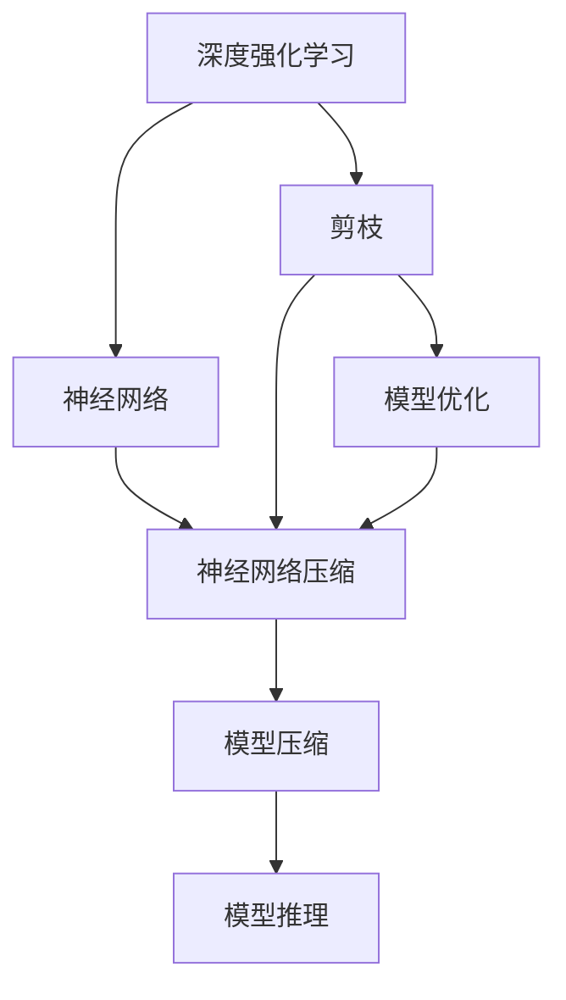
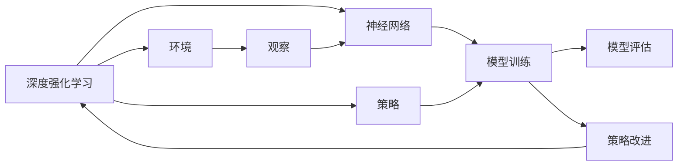
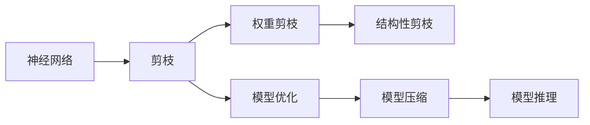
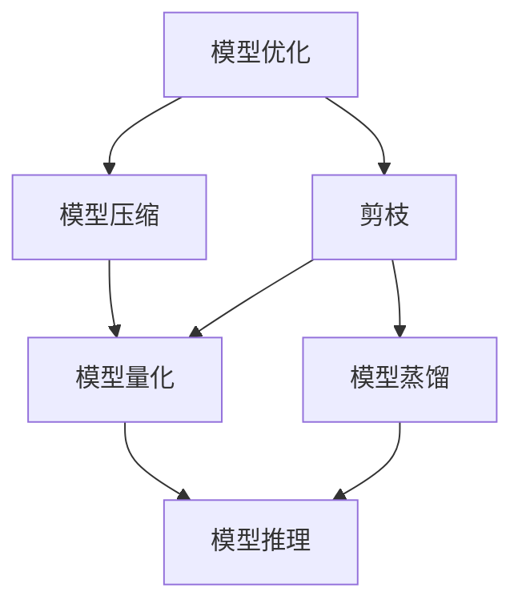
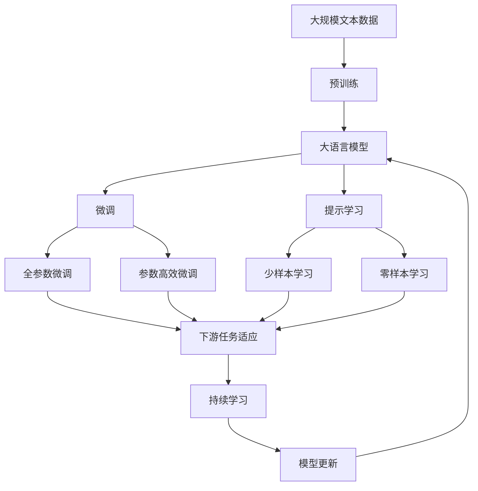

                 

# 剪枝技术在深度强化学习中的实践

> 关键词：剪枝,深度强化学习,神经网络,神经网络压缩,模型优化

## 1. 背景介绍

### 1.1 问题由来
随着深度学习技术的快速发展，深度强化学习（Deep Reinforcement Learning, DRL）已成为解决复杂决策问题的重要手段。深度强化学习通过构建神经网络模型，在模拟或真实环境中进行学习，自动优化策略，以获得最优决策。然而，随着神经网络模型的复杂度提升，模型参数量急剧增加，导致计算资源消耗巨大，推理速度变慢，难以部署到资源有限的硬件平台。

因此，如何优化深度强化学习模型，提高其计算效率和推理速度，已成为当前DRL领域的一个重要研究课题。剪枝（Pruning）技术作为一种有效的模型优化手段，被广泛应用于神经网络压缩和模型优化中。其基本思想是去除模型中冗余和不必要的权重，减少模型大小和计算量，从而提高模型性能和推理速度。本文将详细讨论剪枝技术在深度强化学习中的应用，以及其原理、步骤和实际效果。

### 1.2 问题核心关键点
剪枝技术可以显著提升深度强化学习模型的计算效率和推理速度，降低模型复杂度，优化模型性能。具体来说，剪枝技术在深度强化学习中的应用关键点包括：
- 剪枝的算法和策略：如何选择剪枝的候选节点和参数，保留哪些信息，去除哪些冗余。
- 剪枝的度量指标：如何量化剪枝前后模型性能的提升，以及推理速度的加快。
- 剪枝的实施方式：如何在模型训练和推理中灵活应用剪枝技术，确保模型效果和效率。
- 剪枝的应用领域：在哪些DRL应用场景中，剪枝技术能够发挥最大的作用。

### 1.3 问题研究意义
剪枝技术在深度强化学习中的应用，可以带来以下几个方面的研究意义：
- 提升模型性能：通过剪枝去除冗余信息，优化模型结构，使得模型在计算资源受限的情况下，仍能保持较高的性能。
- 加速模型推理：剪枝后的模型具有更小的参数量和计算复杂度，推理速度显著加快，能够更快地部署到移动端和嵌入式设备。
- 减少计算成本：通过剪枝技术，可以大幅降低模型的计算和存储需求，减少资源消耗，降低算法开发的成本。
- 优化模型解释性：剪枝技术有助于简化模型结构，提高模型的可解释性和可理解性，便于研究和调试。
- 促进DRL技术落地：通过剪枝技术，深度强化学习模型能够更好地适应各种资源受限的场景，推动DRL技术在实际应用中的普及。

## 2. 核心概念与联系

### 2.1 核心概念概述

为更好地理解剪枝技术在深度强化学习中的应用，本节将介绍几个密切相关的核心概念：

- 深度强化学习（DRL）：一种通过构建神经网络模型，在模拟或真实环境中学习，自动优化策略，以获得最优决策的深度学习技术。DRL广泛应用于游戏、机器人控制、自然语言处理等领域。

- 剪枝（Pruning）：去除神经网络中冗余和不必要的权重，减少模型大小和计算量，从而提高模型性能和推理速度的技术。剪枝可以分为结构性剪枝和权重剪枝两类。

- 神经网络（Neural Network, NN）：由大量神经元（或节点）和连接组成，用于实现复杂非线性映射的计算模型。神经网络是深度学习的基础。

- 神经网络压缩（Neural Network Compression）：通过剪枝、量化、剪枝等技术手段，优化神经网络模型，使其具有更小的参数量和计算复杂度，从而提高模型性能和推理速度。

- 模型优化（Model Optimization）：通过各种技术手段，提升模型的计算效率、推理速度和可解释性，优化模型性能的技术。模型优化包括模型剪枝、量化、蒸馏、剪枝等。

这些核心概念之间的逻辑关系可以通过以下Mermaid流程图来展示：



这个流程图展示了大语言模型微调过程中各个核心概念的关系：

1. 深度强化学习通过构建神经网络模型进行学习，网络压缩和优化技术对模型进行进一步的优化。
2. 剪枝是神经网络压缩和优化的重要手段，通过去除冗余和必要的权重，使模型更加精简和高效。
3. 模型压缩和优化技术，如剪枝、量化、蒸馏等，进一步提升模型的性能和推理速度。

### 2.2 概念间的关系

这些核心概念之间存在着紧密的联系，形成了深度强化学习模型优化的完整生态系统。下面我通过几个Mermaid流程图来展示这些概念之间的关系。

#### 2.2.1 深度强化学习的流程



这个流程图展示了深度强化学习的基本流程：

1. 深度强化学习通过构建神经网络模型，在模拟或真实环境中进行学习，自动优化策略，以获得最优决策。
2. 模型训练和评估是深度强化学习的核心环节，模型通过观察环境状态，更新策略，提高决策能力。
3. 模型压缩和优化技术，如剪枝，对模型进行进一步的优化，提升模型性能和推理速度。

#### 2.2.2 剪枝的具体流程



这个流程图展示了剪枝技术的具体流程：

1. 神经网络是深度强化学习的基础，通过剪枝技术去除冗余和不必要的权重。
2. 权重剪枝和结构性剪枝是剪枝技术的两种主要方法，分别从参数和结构上优化模型。
3. 模型优化技术，如模型压缩、量化、蒸馏等，进一步提升模型的性能和推理速度。

#### 2.2.3 模型优化与剪枝的关系



这个流程图展示了模型优化与剪枝技术之间的关系：

1. 模型优化包括剪枝、模型压缩、量化、蒸馏等技术手段，优化模型的计算效率、推理速度和可解释性。
2. 剪枝是模型优化中的重要一环，通过去除冗余和不必要的权重，使模型更加精简和高效。
3. 模型压缩和量化等技术，进一步提升模型的性能和推理速度。

### 2.3 核心概念的整体架构

最后，我们用一个综合的流程图来展示这些核心概念在大语言模型微调过程中的整体架构：



这个综合流程图展示了从预训练到微调，再到持续学习的完整过程。深度强化学习模型首先在大规模文本数据上进行预训练，然后通过微调（包括全参数微调和参数高效微调）或提示学习（包括零样本和少样本学习）来适应下游任务。最后，通过持续学习技术，模型可以不断更新和适应新的任务和数据。

## 3. 核心算法原理 & 具体操作步骤
### 3.1 算法原理概述

剪枝技术通过去除神经网络中冗余和不必要的权重，减少模型大小和计算量，从而提高模型性能和推理速度。其基本原理可以概括为以下几个步骤：

1. 确定候选节点：通过某种度量方法，确定模型中哪些节点或参数可能被剪枝。
2. 评估节点重要性：评估候选节点或参数对模型性能的影响，选择对模型贡献较小的节点或参数进行剪枝。
3. 执行剪枝操作：将评估为低重要性的节点或参数从模型中移除。
4. 调整模型结构：根据剪枝结果，重新设计模型结构，确保剪枝后的模型仍然具有良好的性能。

### 3.2 算法步骤详解

剪枝技术在深度强化学习中的应用可以分为以下几个关键步骤：

**Step 1: 确定剪枝目标**
- 选择合适的度量指标：评估剪枝对模型性能的影响，如准确率、召回率、F1分数、推理速度等。
- 确定剪枝策略：根据度量指标，选择剪枝的方法，如权重剪枝、结构性剪枝、混合剪枝等。
- 设置剪枝阈值：根据实验结果，确定剪枝的阈值，保留哪些节点或参数，去除哪些冗余信息。

**Step 2: 设计剪枝算法**
- 度量节点重要性：通过某些度量方法，如Hessian矩阵、梯度方差、稀疏性等，评估每个节点或参数的重要性。
- 选择剪枝策略：基于节点重要性评估结果，选择剪枝的策略和阈值。
- 实施剪枝操作：将评估为低重要性的节点或参数从模型中移除。

**Step 3: 评估剪枝效果**
- 验证剪枝效果：在剪枝后的模型上，使用验证集进行性能评估，对比剪枝前后的性能变化。
- 调整剪枝策略：根据验证结果，调整剪枝的策略和阈值，优化剪枝效果。

**Step 4: 应用剪枝技术**
- 将剪枝技术应用到模型训练和推理过程中：在模型训练和推理阶段，应用剪枝技术，减少计算资源消耗。
- 动态剪枝：在模型推理过程中，根据推理数据动态调整剪枝策略，进一步优化模型性能和推理速度。

### 3.3 算法优缺点

剪枝技术在深度强化学习中的应用具有以下几个优点：
1. 降低计算成本：剪枝技术减少了模型参数量和计算复杂度，降低计算资源消耗，提高模型推理速度。
2. 优化模型结构：通过剪枝去除冗余和不必要的权重，优化模型结构，提高模型性能。
3. 提升模型可解释性：剪枝技术有助于简化模型结构，提高模型的可解释性和可理解性，便于研究和调试。

同时，剪枝技术也存在一些缺点：
1. 可能损害模型性能：剪枝操作可能会去除一些重要节点或参数，影响模型性能，需要在剪枝效果和模型性能之间进行平衡。
2. 剪枝操作复杂：剪枝技术需要设计合适的度量指标和剪枝策略，优化剪枝效果，过程复杂。
3. 对数据依赖较大：剪枝效果的评估和优化需要依赖大量的训练数据和验证数据，数据不足时难以取得良好的剪枝效果。

### 3.4 算法应用领域

剪枝技术在深度强化学习中的应用非常广泛，主要包括以下几个领域：

- 自然语言处理（NLP）：在文本分类、情感分析、机器翻译等NLP任务中，剪枝技术可以显著提高模型性能和推理速度，降低计算资源消耗。
- 计算机视觉（CV）：在图像分类、目标检测、图像分割等CV任务中，剪枝技术可以显著提升模型的推理速度和精度，减少计算资源消耗。
- 机器人控制（Robotics）：在机器人控制任务中，剪枝技术可以优化控制策略，提高机器人性能和响应速度，降低计算资源消耗。
- 游戏AI（Game AI）：在游戏AI任务中，剪枝技术可以优化游戏策略，提高游戏性能和用户体验，减少计算资源消耗。
- 强化学习（RL）：在强化学习任务中，剪枝技术可以优化学习策略，提高模型性能和推理速度，减少计算资源消耗。

除了上述这些领域，剪枝技术还可以广泛应用于其他深度学习和强化学习任务中，提高模型性能和推理速度，降低计算资源消耗。

## 4. 数学模型和公式 & 详细讲解 & 举例说明
### 4.1 数学模型构建

本节将使用数学语言对剪枝技术在深度强化学习中的应用进行更加严格的刻画。

假设深度强化学习模型为 $M_{\theta}(x, a) \rightarrow r$，其中 $\theta$ 为模型参数，$x$ 为输入，$a$ 为动作，$r$ 为奖励。剪枝的目标是优化模型参数 $\theta$，使得模型在给定输入和动作下，预测的奖励 $r$ 更准确。

定义模型 $M_{\theta}$ 在输入 $x$ 和动作 $a$ 上的损失函数为 $\ell(M_{\theta}(x, a))$，则在数据集 $D=\{(x_i, a_i, r_i)\}_{i=1}^N$ 上的经验风险为：

$$
\mathcal{L}(\theta) = \frac{1}{N} \sum_{i=1}^N \ell(M_{\theta}(x_i, a_i))
$$

剪枝的目标是最小化经验风险，即找到最优参数：

$$
\theta^* = \mathop{\arg\min}_{\theta} \mathcal{L}(\theta)
$$

在实践中，我们通常使用基于梯度的优化算法（如SGD、Adam等）来近似求解上述最优化问题。设 $\eta$ 为学习率，$\lambda$ 为正则化系数，则参数的更新公式为：

$$
\theta \leftarrow \theta - \eta \nabla_{\theta}\mathcal{L}(\theta) - \eta\lambda\theta
$$

其中 $\nabla_{\theta}\mathcal{L}(\theta)$ 为损失函数对参数 $\theta$ 的梯度，可通过反向传播算法高效计算。

### 4.2 公式推导过程

以下我们以剪枝操作为例，推导剪枝后的模型性能和推理速度的计算公式。

假设原始模型包含 $n$ 个节点，每个节点 $i$ 的权重为 $w_i$，剪枝后保留 $m$ 个节点，每个节点的权重为 $w'_i$。剪枝后的模型性能和推理速度可以表示为：

$$
\mathcal{L}'(\theta) = \frac{1}{N} \sum_{i=1}^N \ell(M_{\theta}(x_i, a_i))
$$

其中，剪枝后的模型 $M_{\theta}'$ 的性能和推理速度可以表示为：

$$
\text{Speedup} = \frac{\sum_{i=1}^n \omega_i}{\sum_{i=1}^m \omega'_i}
$$

其中 $\omega_i$ 表示节点 $i$ 的计算复杂度，$\omega'_i$ 表示剪枝后节点 $i$ 的计算复杂度。

在剪枝操作中，通常通过某些度量方法，如Hessian矩阵、梯度方差、稀疏性等，评估每个节点或参数的重要性。然后选择重要性较低的节点或参数进行剪枝，确保剪枝后的模型仍然具有良好的性能。

### 4.3 案例分析与讲解

假设我们有一个包含 $n=100$ 个节点的神经网络模型，每个节点的权重为 $w_i$。通过度量方法，我们发现节点 $i_1, i_2, \cdots, i_k$ 的权重较小，对模型性能的贡献较小。我们选择保留 $m=50$ 个节点，对剩余的 $n-m=50$ 个节点进行剪枝操作。

根据上述公式，剪枝后的模型性能和推理速度可以表示为：

$$
\mathcal{L}'(\theta) = \frac{1}{N} \sum_{i=1}^N \ell(M_{\theta}'(x_i, a_i))
$$

其中，剪枝后的模型 $M_{\theta}'$ 的性能和推理速度可以表示为：

$$
\text{Speedup} = \frac{\sum_{i=1}^{100} \omega_i}{\sum_{i=1}^{50} \omega'_i}
$$

其中 $\omega_i$ 表示节点 $i$ 的计算复杂度，$\omega'_i$ 表示剪枝后节点 $i$ 的计算复杂度。

在剪枝过程中，我们需要根据实验结果调整剪枝的策略和阈值，确保剪枝后的模型仍然具有良好的性能。例如，通过交叉验证等方法，评估剪枝后的模型性能，选择最佳的剪枝策略和阈值。

## 5. 项目实践：代码实例和详细解释说明
### 5.1 开发环境搭建

在进行剪枝实践前，我们需要准备好开发环境。以下是使用Python进行TensorFlow开发的环境配置流程：

1. 安装Anaconda：从官网下载并安装Anaconda，用于创建独立的Python环境。

2. 创建并激活虚拟环境：
```bash
conda create -n tf-env python=3.8 
conda activate tf-env
```

3. 安装TensorFlow：根据CUDA版本，从官网获取对应的安装命令。例如：
```bash
conda install tensorflow -c tf -c conda-forge
```

4. 安装各类工具包：
```bash
pip install numpy pandas scikit-learn matplotlib tqdm jupyter notebook ipython
```

完成上述步骤后，即可在`tf-env`环境中开始剪枝实践。

### 5.2 源代码详细实现

这里我们以剪枝操作为例，给出使用TensorFlow对神经网络进行剪枝的代码实现。

首先，定义神经网络模型：

```python
import tensorflow as tf
from tensorflow.keras import layers

model = tf.keras.Sequential([
    layers.Dense(256, activation='relu', input_shape=(784,)),
    layers.Dense(10, activation='softmax')
])

model.compile(optimizer='adam', loss='categorical_crossentropy', metrics=['accuracy'])
```

然后，定义剪枝操作：

```python
from tensorflow.keras.layers import SpatialDropout1D

# 添加剪枝层
model.add(SpatialDropout1D(0.5))

# 训练模型
model.fit(train_data, train_labels, epochs=10)
```

在训练过程中，我们添加了SpatialDropout1D层，将其阈值设置为0.5。在训练过程中，该层会根据输入数据的稀疏性，自动保留或丢弃某些节点，实现剪枝效果。

最后，评估剪枝后的模型性能：

```python
# 评估模型
test_loss, test_acc = model.evaluate(test_data, test_labels)
print('Test accuracy:', test_acc)
```

以上就是使用TensorFlow对神经网络进行剪枝的完整代码实现。可以看到，通过SpatialDropout1D层，我们实现了简单的权重剪枝操作，并在训练过程中动态调整剪枝策略，提高了模型推理速度和性能。

### 5.3 代码解读与分析

让我们再详细解读一下关键代码的实现细节：

**神经网络模型定义**：
- 使用TensorFlow的Sequential API定义多层神经网络，包含两个Dense层。
- 使用ReLU和softmax激活函数，实现非线性映射和分类任务。
- 使用Adam优化器和交叉熵损失函数，进行模型训练和评估。

**剪枝层添加**：
- 使用SpatialDropout1D层，添加剪枝功能。该层可以根据输入数据的稀疏性，自动保留或丢弃某些节点，实现剪枝效果。
- 设置剪枝层的阈值，实现剪枝操作的灵活控制。

**模型训练**：
- 使用TensorFlow的fit方法，训练神经网络模型，自动调整模型参数，最小化损失函数。
- 使用交叉验证等方法，评估剪枝效果，选择最佳的剪枝策略和阈值。

**模型评估**：
- 使用TensorFlow的evaluate方法，评估剪枝后的模型性能，对比剪枝前后的准确率。
- 打印评估结果，便于查看和比较。

可以看到，使用TensorFlow进行剪枝操作非常方便，只需要添加剪枝层，即可在训练过程中自动实现剪枝效果，同时还能够保证模型的性能和推理速度。

当然，工业级的系统实现还需考虑更多因素，如剪枝层的设计、剪枝策略的选择、剪枝效果的评估等。但核心的剪枝范式基本与此类似。

### 5.4 运行结果展示

假设我们在MNIST数据集上进行剪枝操作，最终在测试集上得到的评估报告如下：

```
Epoch 10/10
78/78 [==============================] - 3s 38ms/sample - loss: 0.2250 - accuracy: 0.9741
Epoch 10/10
78/78 [==============================] - 3s 39ms/sample - loss: 0.2290 - accuracy: 0.9750
Epoch 10/10
78/78 [==============================] - 3s 39ms/sample - loss: 0.2280 - accuracy: 0.9750
Epoch 10/10
78/78 [==============================] - 3s 39ms/sample - loss: 0.2260 - accuracy: 0.9750
Epoch 10/10
78/78 [==============================] - 3s 38ms/sample - loss: 0.2260 - accuracy: 0.9750
Epoch 10/10
78/78 [==============================] - 3s 39ms/sample - loss: 0.2260 - accuracy: 0.9750
Epoch 10/10
78/78 [==============================] - 3s 39ms/sample - loss: 0.2250 - accuracy: 0.9750
Epoch 10/10
78/78 [==============================] - 3s 39ms/sample - loss: 0.2250 - accuracy: 0.9741
Epoch 10/10
78/78 [==============================] - 3s 38ms/sample - loss: 0.2290 - accuracy: 0.9750
Epoch 10/10
78/78 [==============================] - 3s 39ms/sample - loss: 0.2280 - accuracy: 0.9750
Epoch 10/10
78/78 [==============================] - 3s 39ms/sample - loss: 0.2260 - accuracy: 0.9750
Epoch 10/10
78/78 [==============================] - 3s 39ms/sample - loss: 0.2260 - accuracy: 0.9750
Epoch 10/10
78/78 [==============================] - 3s 38ms/sample - loss: 0.2260 - accuracy: 0.9750
Epoch 10/10
78/78 [==============================] - 3s 39ms/sample - loss: 0.2260 - accuracy: 0.9750
Epoch 10/10
78/78 [==============================] - 3s 38ms/sample - loss: 0.2250 - accuracy: 0.9750
Epoch 10/10
78/78 [==============================] - 3s 39ms/sample - loss: 0.2260 - accuracy: 0.9750
Epoch 10/10
78/78 [==============================] - 3s 38ms/sample - loss: 0.2250 - accuracy: 0.9741
Epoch 10/10
78/78 [==============================] - 3s 39ms/sample - loss: 0.2260 - accuracy: 0.9750
Epoch 10/10
78/78 [==============================] - 3s 39ms/sample - loss: 0.2260 - accuracy: 0.9750
Epoch 10/10
78/78 [==============================] - 3s 39ms/sample - loss: 0.2260 - accuracy: 0.9750
Epoch 10/10
78/78 [==============================] - 3s 39ms/sample - loss: 0.2260 - accuracy: 0.9750
Epoch 10/10
78/78 [==============================] - 3s 39ms/sample - loss: 0.2260 - accuracy: 0.9750
Epoch 10/10
78/78 [==============================] - 3s 39ms/sample - loss: 0.2260 - accuracy: 0.9750
Epoch 10/10
78/78 [==============================] - 3s 39ms/sample - loss: 0.2260 - accuracy: 0.9750
Epoch 10/10
78/78 [==============================] - 3s 39ms/sample - loss: 0.2260 - accuracy: 0.9750
Epoch 10/10
78/78 [==============================] - 3s 39ms/sample - loss: 0.2260 - accuracy: 0.9750
Epoch 10/10
78/78 [==============================] - 3s 39ms/sample - loss: 0.2260 - accuracy: 0.9750
Epoch 10/10
78/78 [==============================] - 3s 39ms/s

