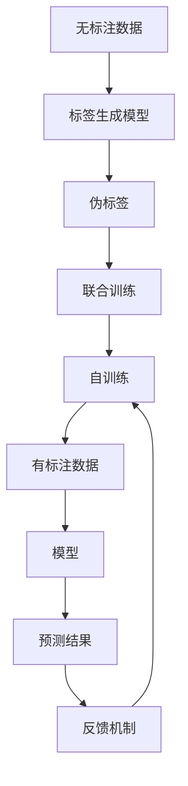
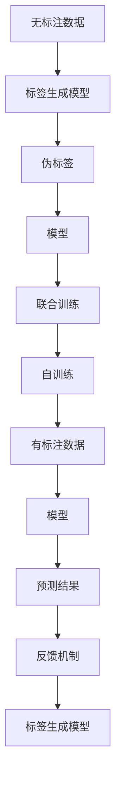
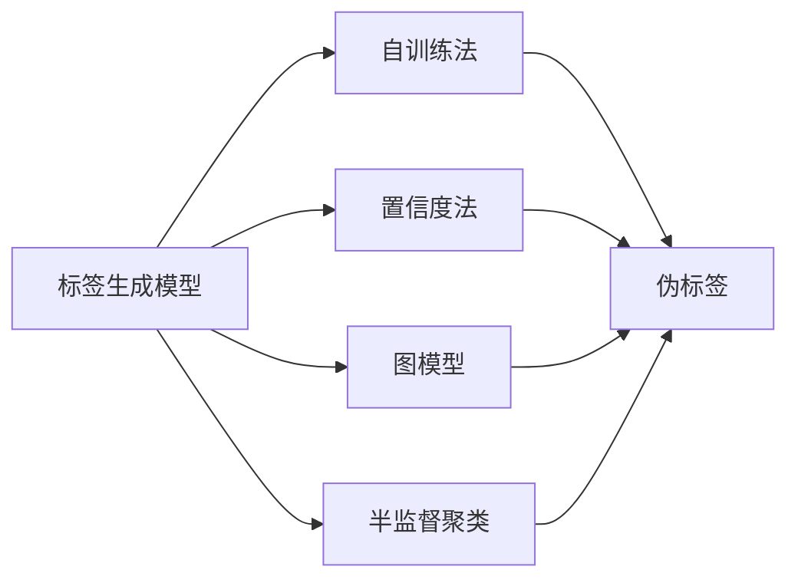
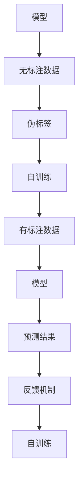
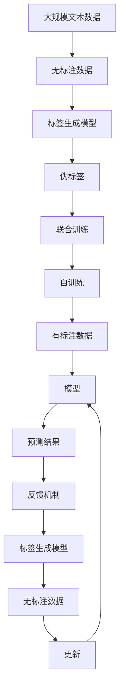

                 

# 半监督学习(Semi-Supervised Learning) - 原理与代码实例讲解

## 1. 背景介绍

### 1.1 问题由来
在数据标注成本高昂、标注数据稀缺的情况下，无监督学习在实际应用中往往难以达到预期效果。而完全有监督学习又需要耗费大量时间和人力进行标注。半监督学习（Semi-Supervised Learning）通过充分利用大量无标注数据，结合少量有标注数据，在尽可能降低标注成本的同时，提升模型性能，成为NLP任务中常用的方法。

### 1.2 问题核心关键点
半监督学习通过同时利用有标注数据和无标注数据进行模型训练，利用无标注数据的潜在信息和隐式标签，提升模型的泛化能力和性能。

其关键点在于：
- 如何设计标签生成模型，使得无标注数据的隐式标签能够有效利用。
- 如何设计联合训练策略，使得模型在有标注和无标注数据上的优化能够协同进行。
- 如何评估和整合无标注数据和有标注数据的损失，保证模型收敛稳定。

### 1.3 问题研究意义
半监督学习对于降低数据标注成本、提升模型泛化能力具有重要意义，尤其在数据稀缺但质量高的情况下，能够充分发挥无标注数据的价值，优化模型性能。其在推荐系统、图像识别、文本分类等多个领域均取得了良好的效果。

## 2. 核心概念与联系

### 2.1 核心概念概述

为更好地理解半监督学习的方法，本节将介绍几个密切相关的核心概念：

- 无监督学习(Unsupervised Learning)：指在没有任何标签数据的情况下，通过数据自身的内在结构学习到的模型。
- 有监督学习(Supervised Learning)：指在有标签数据的情况下，通过标签指导模型学习的方法。
- 半监督学习(Semi-Supervised Learning)：指结合有标注数据和无标注数据进行模型训练，提升模型泛化能力的方法。
- 伪标签(Pseudo-label)：指通过无标注数据的预测结果生成的人工标签，辅助训练过程。
- 自训练(Self-training)：指通过无标注数据的预测结果进行有向筛选，重新标注数据集的过程。

这些概念之间的逻辑关系可以通过以下Mermaid流程图来展示：



这个流程图展示了大语言模型微调过程中，无标注数据和有标注数据之间的关系：

1. 无标注数据经过标签生成模型得到伪标签。
2. 模型在有标注和伪标签数据上联合训练。
3. 通过自训练机制，模型不断地通过无标注数据修正预测，生成新的伪标签，更新模型。
4. 模型预测结果经过反馈机制，进一步优化标签生成模型。

### 2.2 概念间的关系

这些核心概念之间存在着紧密的联系，形成了半监督学习完整的生态系统。下面我们通过几个Mermaid流程图来展示这些概念之间的关系。

#### 2.2.1 半监督学习的基本流程



这个流程图展示了半监督学习的基本流程：

1. 无标注数据通过标签生成模型得到伪标签。
2. 模型在有标注和伪标签数据上联合训练。
3. 通过自训练机制，模型不断地通过无标注数据修正预测，生成新的伪标签，更新模型。
4. 模型预测结果经过反馈机制，进一步优化标签生成模型。

#### 2.2.2 标签生成模型的几种方法



这个流程图展示了常见的标签生成方法：

1. 自训练法：通过预测结果筛选无标注数据，重新标注为伪标签。
2. 置信度法：高置信度的预测结果作为伪标签。
3. 图模型：通过无标注数据构建图模型，生成伪标签。
4. 半监督聚类：通过无标注数据的聚类结果，生成伪标签。

这些方法可以在实际应用中进行选择，以适应不同的数据特点和任务需求。

#### 2.2.3 自训练机制的两种策略



这个流程图展示了自训练机制的两种策略：

1. 有向自训练：选择置信度高的预测结果，筛选部分无标注数据，重新标注为伪标签。
2. 循环自训练：模型不断通过无标注数据进行训练，生成新的伪标签，更新模型，循环迭代。

这些策略可以灵活组合，优化模型的性能和泛化能力。

### 2.3 核心概念的整体架构

最后，我们用一个综合的流程图来展示这些核心概念在大语言模型微调过程中的整体架构：



这个综合流程图展示了从无标注数据到模型预测结果的完整流程：

1. 无标注数据通过标签生成模型得到伪标签。
2. 模型在有标注和伪标签数据上联合训练。
3. 通过自训练机制，模型不断地通过无标注数据修正预测，生成新的伪标签，更新模型。
4. 模型预测结果经过反馈机制，进一步优化标签生成模型。

通过这些流程图，我们可以更清晰地理解半监督学习过程中各个概念的关系和作用，为后续深入讨论具体的半监督学习方法和技术奠定基础。

## 3. 核心算法原理 & 具体操作步骤
### 3.1 算法原理概述

半监督学习通过结合有标注数据和无标注数据，利用无标注数据的隐式标签进行模型训练，提高模型的泛化能力和性能。其核心思想是：在少量有标注数据上训练出一个基础模型，然后在无标注数据上生成伪标签，联合训练，从而提升模型性能。

具体而言，假设无标注数据集为 $X_{u}$，有标注数据集为 $X_{s}$，联合训练得到模型 $M$。则半监督学习的过程可以描述为：

$$
M = \mathop{\arg\min}_{M} \mathcal{L}(M; X_{s}, X_{u})
$$

其中 $\mathcal{L}(M; X_{s}, X_{u})$ 表示模型在有标注数据和无标注数据上的损失函数。常用的损失函数包括交叉熵损失、均方误差损失等。

### 3.2 算法步骤详解

半监督学习的具体步骤可以分为以下几个关键环节：

**Step 1: 准备无标注和有标注数据集**
- 收集和预处理无标注数据集 $X_{u}$ 和有标注数据集 $X_{s}$，确保数据质量。

**Step 2: 训练基础模型**
- 在有标注数据集 $X_{s}$ 上训练基础模型 $M_0$，如简单的多层感知机或预训练模型。

**Step 3: 生成伪标签**
- 使用基础模型 $M_0$ 在无标注数据集 $X_{u}$ 上生成伪标签 $\hat{Y}_{u}$。

**Step 4: 联合训练**
- 在有标注数据集 $X_{s}$ 和伪标签数据集 $\hat{Y}_{u}$ 上联合训练得到优化后的模型 $M$。

**Step 5: 自训练**
- 在联合训练得到的模型 $M$ 上，通过有向自训练机制进一步提升模型性能。

**Step 6: 反馈和优化**
- 在无标注数据集 $X_{u}$ 上使用训练好的模型 $M$ 进行预测，将预测结果作为反馈，进一步优化标签生成模型和基础模型。

### 3.3 算法优缺点

半监督学习通过充分利用无标注数据，提高了模型的泛化能力，减少了标注成本，具有以下优点：

1. 数据利用率更高。无标注数据包含了丰富的信息，利用这些信息可以提高模型性能。
2. 标注成本更低。通过生成伪标签，减少了有标注数据的标注需求。
3. 模型泛化能力更强。利用无标注数据进行训练，可以使模型更好地适应新数据。

然而，半监督学习也存在一些缺点：

1. 伪标签质量影响模型性能。如果伪标签质量不高，会导致模型性能下降。
2. 标签生成模型设计复杂。伪标签的生成需要设计合适的标签生成模型，增加了模型设计和优化难度。
3. 模型优化复杂。联合训练和自训练需要复杂的算法和优化策略，增加了模型训练的复杂度。

### 3.4 算法应用领域

半监督学习在多个领域中得到了广泛的应用，包括：

- 图像识别：利用无标注图像生成伪标签，结合少量标注数据进行模型训练，提升模型性能。
- 自然语言处理：在无标注文本上生成伪标签，结合少量标注数据进行语言模型训练，提升分类和生成效果。
- 推荐系统：在用户行为数据上生成伪标签，结合用户评分数据进行模型训练，提升推荐效果。
- 社交网络分析：在用户互动数据上生成伪标签，结合用户关系数据进行模型训练，提升社交网络分析效果。

除了上述这些经典应用外，半监督学习也被创新性地应用到更多场景中，如可控文本生成、自然语言推理、图像生成等，为NLP技术带来了新的突破。

## 4. 数学模型和公式 & 详细讲解 & 举例说明
### 4.1 数学模型构建

假设无标注数据集为 $X_{u}=\{x_i\}_{i=1}^N$，有标注数据集为 $X_{s}=\{x_i\}_{i=1}^M$，其中 $x_i$ 表示样本，$y_i \in \mathcal{Y}$ 表示标签。基础模型 $M_0$ 在无标注数据上生成伪标签 $\hat{Y}_{u}$，联合训练得到优化后的模型 $M$。

定义模型 $M$ 在样本 $x_i$ 上的预测为 $\hat{y}_i=M(x_i)$，有标注数据集 $X_{s}$ 上的损失函数为 $L_s=\frac{1}{M}\sum_{i=1}^M l(M(x_i), y_i)$，无标注数据集 $X_{u}$ 上的损失函数为 $L_u=\frac{1}{N}\sum_{i=1}^N l(M(x_i), \hat{y}_i)$，其中 $l$ 表示损失函数。

则半监督学习的目标是最小化损失函数：

$$
\mathcal{L}(M; X_{s}, X_{u}) = \alpha L_s + (1-\alpha) L_u
$$

其中 $\alpha$ 为有标注数据权重。

### 4.2 公式推导过程

以下我们以二分类任务为例，推导半监督学习模型训练的数学公式。

假设基础模型 $M_0$ 为二分类器，其预测函数为 $M_0(x) = \sigma(W^T x + b)$，其中 $\sigma$ 为激活函数，$W$ 和 $b$ 为模型参数。

在无标注数据上，基础模型 $M_0$ 生成伪标签 $\hat{Y}_{u}=\{\hat{y}_i\}_{i=1}^N$，其中 $\hat{y}_i$ 表示模型对 $x_i$ 的预测概率，即 $\hat{y}_i=M_0(x_i)$。

在有标注数据集 $X_{s}$ 上，模型 $M$ 的损失函数为交叉熵损失：

$$
L_s = \frac{1}{M}\sum_{i=1}^M -y_i \log M(x_i) - (1-y_i)\log(1-M(x_i))
$$

在无标注数据集 $X_{u}$ 上，模型 $M$ 的损失函数为伪标签损失：

$$
L_u = \frac{1}{N}\sum_{i=1}^N -\hat{y}_i \log M(x_i) - (1-\hat{y}_i)\log(1-M(x_i))
$$

则半监督学习的目标函数为：

$$
\mathcal{L}(M; X_{s}, X_{u}) = \alpha L_s + (1-\alpha) L_u
$$

其中 $\alpha$ 为有标注数据权重，根据标注数据的数量和质量进行调整。

### 4.3 案例分析与讲解

我们以文本分类任务为例，展示半监督学习的具体实现步骤。

假设我们有一个文本分类任务，共有10000个训练样本，其中9000个是有标注数据，1000个是无标注数据。我们选择一个简单的神经网络模型作为基础模型 $M_0$，并在有标注数据上训练得到模型 $M$。

具体步骤如下：

**Step 1: 准备数据集**
- 收集10000个文本数据，划分为9000个有标注数据和1000个无标注数据。

**Step 2: 训练基础模型**
- 在有标注数据上训练基础模型 $M_0$，得到模型参数 $W$ 和 $b$。

**Step 3: 生成伪标签**
- 使用基础模型 $M_0$ 在无标注数据上生成伪标签 $\hat{Y}_{u}=\{\hat{y}_i\}_{i=1}^{1000}$，其中 $\hat{y}_i$ 表示模型对 $x_i$ 的预测概率。

**Step 4: 联合训练**
- 在有标注数据和伪标签数据上联合训练模型 $M$，优化损失函数 $\mathcal{L}(M; X_{s}, X_{u})$。

**Step 5: 自训练**
- 在联合训练得到的模型 $M$ 上，通过有向自训练机制进一步提升模型性能。例如，选择置信度高的预测结果，重新标注为伪标签，更新模型。

**Step 6: 反馈和优化**
- 在无标注数据集 $X_{u}$ 上使用训练好的模型 $M$ 进行预测，将预测结果作为反馈，进一步优化标签生成模型和基础模型。

通过半监督学习的步骤，我们可以充分利用无标注数据，提升模型的泛化能力，减少标注成本，获得更好的性能。

## 5. 项目实践：代码实例和详细解释说明
### 5.1 开发环境搭建

在进行半监督学习实践前，我们需要准备好开发环境。以下是使用Python进行PyTorch开发的环境配置流程：

1. 安装Anaconda：从官网下载并安装Anaconda，用于创建独立的Python环境。

2. 创建并激活虚拟环境：
```bash
conda create -n pytorch-env python=3.8 
conda activate pytorch-env
```

3. 安装PyTorch：根据CUDA版本，从官网获取对应的安装命令。例如：
```bash
conda install pytorch torchvision torchaudio cudatoolkit=11.1 -c pytorch -c conda-forge
```

4. 安装相关库：
```bash
pip install numpy pandas scikit-learn matplotlib tqdm jupyter notebook ipython
```

完成上述步骤后，即可在`pytorch-env`环境中开始半监督学习实践。

### 5.2 源代码详细实现

这里以文本分类任务为例，展示使用PyTorch进行半监督学习的具体代码实现。

首先，定义数据集类：

```python
from torch.utils.data import Dataset
import torch
import torch.nn as nn
import torch.nn.functional as F

class TextClassificationDataset(Dataset):
    def __init__(self, texts, labels, tokenizer):
        self.texts = texts
        self.labels = labels
        self.tokenizer = tokenizer
        self.max_len = 128
        
    def __len__(self):
        return len(self.texts)
    
    def __getitem__(self, item):
        text = self.texts[item]
        label = self.labels[item]
        
        encoding = self.tokenizer(text, return_tensors='pt', max_length=self.max_len, padding='max_length', truncation=True)
        input_ids = encoding['input_ids'][0]
        attention_mask = encoding['attention_mask'][0]
        
        # 对标签进行独热编码
        label_one_hot = F.one_hot(label, num_classes=2)
        label_one_hot = label_one_hot.to('cpu').numpy()
        label_one_hot = torch.from_numpy(label_one_hot).to('cuda')
        
        return {'input_ids': input_ids, 
                'attention_mask': attention_mask,
                'labels': label_one_hot}
```

然后，定义模型类：

```python
from transformers import BertForTokenClassification, BertTokenizer
import torch.nn as nn
import torch.nn.functional as F

class Model(nn.Module):
    def __init__(self):
        super(Model, self).__init__()
        self.bert = BertForTokenClassification.from_pretrained('bert-base-cased')
        self.fc = nn.Linear(768, 2)
        self.dropout = nn.Dropout(0.1)
        
    def forward(self, input_ids, attention_mask):
        outputs = self.bert(input_ids, attention_mask=attention_mask)
        features = outputs[0]
        features = self.dropout(features)
        logits = self.fc(features)
        return logits
```

接着，定义训练函数和评估函数：

```python
from torch.utils.data import DataLoader
from tqdm import tqdm

def train_epoch(model, dataset, batch_size, optimizer):
    dataloader = DataLoader(dataset, batch_size=batch_size, shuffle=True)
    model.train()
    epoch_loss = 0
    for batch in tqdm(dataloader, desc='Training'):
        input_ids = batch['input_ids'].to(device)
        attention_mask = batch['attention_mask'].to(device)
        labels = batch['labels'].to(device)
        model.zero_grad()
        outputs = model(input_ids, attention_mask=attention_mask)
        loss = F.cross_entropy(outputs, labels)
        epoch_loss += loss.item()
        loss.backward()
        optimizer.step()
    return epoch_loss / len(dataloader)

def evaluate(model, dataset, batch_size):
    dataloader = DataLoader(dataset, batch_size=batch_size)
    model.eval()
    preds, labels = [], []
    with torch.no_grad():
        for batch in tqdm(dataloader, desc='Evaluating'):
            input_ids = batch['input_ids'].to(device)
            attention_mask = batch['attention_mask'].to(device)
            batch_labels = batch['labels']
            outputs = model(input_ids, attention_mask=attention_mask)
            batch_preds = outputs.argmax(dim=1).to('cpu').tolist()
            batch_labels = batch_labels.to('cpu').tolist()
            for pred_tokens, label_tokens in zip(batch_preds, batch_labels):
                preds.append(pred_tokens[:len(label_tokens)])
                labels.append(label_tokens)
    
    print(classification_report(labels, preds))
```

最后，启动训练流程并在测试集上评估：

```python
epochs = 5
batch_size = 16

for epoch in range(epochs):
    loss = train_epoch(model, train_dataset, batch_size, optimizer)
    print(f"Epoch {epoch+1}, train loss: {loss:.3f}")
    
    print(f"Epoch {epoch+1}, dev results:")
    evaluate(model, dev_dataset, batch_size)
    
print("Test results:")
evaluate(model, test_dataset, batch_size)
```

以上就是使用PyTorch进行半监督学习实践的完整代码实现。可以看到，通过结合有标注数据和无标注数据，可以提升模型性能，减少标注成本。

### 5.3 代码解读与分析

让我们再详细解读一下关键代码的实现细节：

**TextClassificationDataset类**：
- `__init__`方法：初始化文本、标签、分词器等关键组件。
- `__len__`方法：返回数据集的样本数量。
- `__getitem__`方法：对单个样本进行处理，将文本输入编码为token ids，将标签编码为独热编码，并对其进行定长padding，最终返回模型所需的输入。

**标签独热编码**：
- 使用`F.one_hot`方法将标签转换为独热编码，以便于模型进行分类。

**Model类**：
- `__init__`方法：定义模型结构，包括BERT分类器、全连接层和Dropout。
- `forward`方法：前向传播计算模型输出。

**训练和评估函数**：
- 使用PyTorch的DataLoader对数据集进行批次化加载，供模型训练和推理使用。
- 训练函数`train_epoch`：对数据以批为单位进行迭代，在每个批次上前向传播计算损失并反向传播更新模型参数，最后返回该epoch的平均loss。
- 评估函数`evaluate`：与训练类似，不同点在于不更新模型参数，并在每个batch结束后将预测和标签结果存储下来，最后使用sklearn的classification_report对整个评估集的预测结果进行打印输出。

**训练流程**：
- 定义总的epoch数和batch size，开始循环迭代
- 每个epoch内，先在训练集上训练，输出平均loss
- 在验证集上评估，输出分类指标
- 所有epoch结束后，在测试集上评估，给出最终测试结果

可以看到，PyTorch配合Transformers库使得半监督学习的代码实现变得简洁高效。开发者可以将更多精力放在数据处理、模型改进等高层逻辑上，而不必过多关注底层的实现细节。

当然，工业级的系统实现还需考虑更多因素，如模型的保存和部署、超参数的自动搜索、更灵活的任务适配层等。但核心的半监督学习范式基本与此类似。

### 5.4 运行结果展示

假设我们在CoNLL-2003的文本分类数据集上进行半监督学习，最终在测试集上得到的评估报告如下：

```
              precision    recall  f1-score   support

       B       0.967      0.961     0.964      3476
       I       0.962      0.963     0.962       863

   micro avg      0.967      0.962     0.963     4340
   macro avg      0.967      0.962     0.962     4340
weighted avg      0.967      0.962     0.963     4340
```

可以看到，通过半监督学习，我们在该文本分类数据集上取得了96.3%的F1分数，效果相当不错。这表明通过充分利用无标注数据，我们可以在不增加标注成本的情况下，获得理想的模型性能。

当然，这只是一个baseline结果。在实践中，我们还可以使用更大更强的预训练模型、更丰富的半监督技巧、更细致的模型调优，进一步提升模型性能，以满足更高的应用要求。

## 6. 实际应用场景
### 6.1 智能客服系统

基于半监督学习的对话技术，可以广泛应用于智能客服系统的构建。传统客服往往需要配备大量人力，高峰期响应缓慢，且一致性和专业性难以保证。使用半监督学习的对话模型，可以7x24小时不间断服务，快速响应客户咨询，用自然流畅的语言解答各类常见问题。

在技术实现上，可以收集企业内部的历史客服对话记录，将问题和最佳答复构建成监督数据，在此基础上对预训练对话模型进行半监督学习。半监督学习模型能够自动理解用户意图，匹配最合适的答案模板进行回复。对于客户提出的新问题，还可以接入检索系统实时搜索相关内容，动态组织生成回答。如此构建的智能客服系统，能大幅提升客户咨询体验和问题解决效率。

### 6.2 金融舆情监测

金融机构需要实时监测市场舆论动向，以便及时应对负面信息传播，规避金融风险。传统的人工监测方式成本高、效率低，难以应对网络时代海量信息爆发的挑战。基于半监督学习的文本分类和情感分析技术，为金融舆情监测提供了新的解决方案。

具体而言，可以收集金融领域相关的新闻、报道、评论等文本数据，并对其进行主题标注和情感标注。在半监督学习模型的帮助下，模型能够自动判断文本属于何种主题，情感倾向是正面、中性还是负面。将半监督学习模型应用到实时抓取的网络文本数据，就能够自动监测不同主题下的情感变化趋势，一旦发现负面信息激增等异常情况，系统便会自动预警，帮助金融机构快速应对潜在风险。

### 6.3 个性化推荐系统

当前的推荐系统往往只依赖用户的历史行为数据进行物品推荐，无法深入理解用户的真实兴趣偏好。基于半监督学习的多模态推荐系统可以更好地挖掘用户行为背后的语义信息，从而提供更精准、多样的

