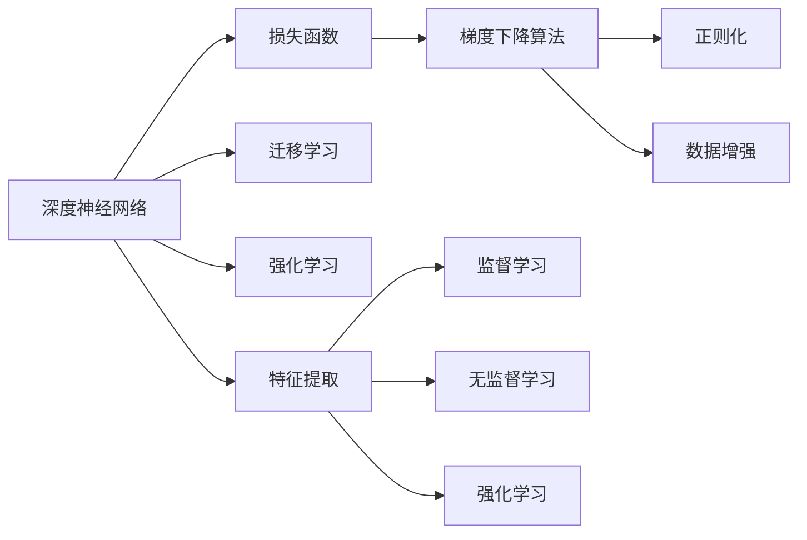

                 

# 博学之，审问之，慎思之，明辨之，笃行之

> 关键词：深度学习,机器学习,人工智能,计算机科学,认知智能

## 1. 背景介绍

### 1.1 问题由来

在当今的信息时代，人工智能（AI）技术正以惊人的速度改变着我们的世界。从智能语音助手到自动驾驶汽车，再到精准医疗和智慧城市，AI技术的应用几乎无处不在。然而，这些技术的背后，是庞大的数据集和复杂的算法模型支撑。深度学习和机器学习作为人工智能的核心技术，正在不断推动AI向更智能、更高效的方向发展。

深度学习，是一种通过多层神经网络实现数据表征学习的技术。它通过构建复杂的数据转换模型，可以从数据中自动学习特征，从而实现高精度的预测和决策。机器学习则是一个更广泛的概念，包括监督学习、无监督学习和强化学习等多种学习方式，旨在通过算法训练出能够适应新数据和环境变化的模型。

深度学习和机器学习技术在许多领域都取得了显著的成果，但它们的理论基础和实践方法仍存在一些挑战。如何更好地理解这些技术的核心原理，如何在实际应用中实现高效、可靠的算法，成为了当前研究的热点问题。

### 1.2 问题核心关键点

深度学习和机器学习技术的核心关键点在于其理论框架、算法实现和应用场景。以下是一些核心关键点：

- 深度学习：基于多层神经网络的模型，用于从数据中学习特征表示。
- 机器学习：通过训练数据集，优化模型参数，使其能够适应新的数据。
- 监督学习：利用带有标签的数据进行训练，输出特定的预测结果。
- 无监督学习：仅利用数据本身进行训练，无需标签信息。
- 强化学习：通过与环境的互动，优化策略以获得最大的奖励。
- 数据集：深度学习和机器学习技术的核心，用于训练和验证模型。
- 算法实现：深度学习模型的构建和优化方法，如反向传播、正则化等。
- 应用场景：深度学习和机器学习技术在实际中的应用领域，如自然语言处理、计算机视觉、语音识别等。

这些核心关键点构成了深度学习和机器学习技术的理论基础和实践框架，帮助我们理解这些技术的工作原理和实现方法。

## 2. 核心概念与联系

### 2.1 核心概念概述

深度学习和机器学习技术的核心概念主要包括以下几个方面：

- 深度神经网络：通过多层次的神经网络，实现复杂的数据表征学习。
- 损失函数：用于衡量模型预测结果与实际标签之间的差异，指导模型优化。
- 梯度下降算法：通过反向传播算法，计算模型参数的梯度，并更新参数以最小化损失函数。
- 正则化：通过添加惩罚项，防止模型过拟合，提高泛化能力。
- 数据增强：通过数据扩充技术，提高数据集的样本多样性，增强模型的鲁棒性。
- 迁移学习：通过将一个领域学到的知识迁移到另一个领域，提高模型在新领域上的性能。
- 强化学习：通过与环境的互动，不断优化策略，实现最佳决策。
- 特征提取：从原始数据中提取有意义的特征，用于模型训练和预测。

这些核心概念构成了深度学习和机器学习技术的理论基础，帮助我们在实际应用中实现高效、可靠的算法。

### 2.2 概念间的关系

这些核心概念之间存在着紧密的联系，形成了深度学习和机器学习技术的完整生态系统。以下是一个简化的概念关系图，展示了这些概念之间的联系：



这个概念关系图展示了深度学习和机器学习技术的核心概念及其之间的联系：

- 深度神经网络是深度学习和机器学习的基础，用于构建复杂的数据表征。
- 损失函数是衡量模型预测结果与实际标签之间差异的核心指标，指导模型优化。
- 梯度下降算法是模型优化的核心方法，通过反向传播算法计算参数梯度，更新模型参数。
- 正则化是防止模型过拟合的重要手段，通过添加惩罚项，提高模型的泛化能力。
- 数据增强是提高模型鲁棒性的重要方法，通过数据扩充技术增加样本多样性。
- 迁移学习是实现跨领域知识迁移的关键技术，通过将一个领域学到的知识迁移到另一个领域。
- 强化学习是通过与环境互动优化策略的关键方法，实现最佳决策。
- 特征提取是从原始数据中提取有意义的特征的关键步骤，用于模型训练和预测。

这些概念共同构成了深度学习和机器学习技术的理论基础和实践框架，帮助我们理解这些技术的工作原理和实现方法。

## 3. 核心算法原理 & 具体操作步骤

### 3.1 算法原理概述

深度学习和机器学习技术的核心算法原理主要包括以下几个方面：

- 反向传播算法：通过链式法则，计算模型参数的梯度，用于模型优化。
- 梯度下降算法：通过最小化损失函数，更新模型参数，实现模型优化。
- 正则化技术：通过添加惩罚项，防止模型过拟合，提高泛化能力。
- 特征提取技术：从原始数据中提取有意义的特征，用于模型训练和预测。
- 迁移学习技术：通过将一个领域学到的知识迁移到另一个领域，提高模型在新领域上的性能。

这些核心算法原理构成了深度学习和机器学习技术的理论基础，帮助我们理解这些技术的工作原理和实现方法。

### 3.2 算法步骤详解

深度学习和机器学习技术的核心算法步骤主要包括以下几个方面：

- 数据预处理：将原始数据转换为适合模型训练的格式，包括数据清洗、标准化、归一化等。
- 模型构建：选择合适的神经网络架构，构建深度神经网络模型。
- 模型训练：利用训练数据集，通过梯度下降算法更新模型参数，最小化损失函数。
- 模型评估：利用测试数据集，评估模型的性能，选择合适的超参数。
- 模型应用：将训练好的模型应用于实际问题，进行预测和决策。

这些核心算法步骤构成了深度学习和机器学习技术的实践框架，帮助我们实现高效、可靠的算法。

### 3.3 算法优缺点

深度学习和机器学习技术的核心算法具有以下优点：

- 高精度：深度神经网络具有强大的特征提取能力，可以实现高精度的预测和决策。
- 泛化能力：正则化技术可以提高模型的泛化能力，适应新数据和环境变化。
- 灵活性：深度学习和机器学习技术可以应用于多种领域，如自然语言处理、计算机视觉、语音识别等。

同时，这些核心算法也存在一些缺点：

- 数据依赖：深度学习和机器学习技术的核心在于数据，需要大量高质量的数据进行训练。
- 计算成本：深度学习和机器学习技术需要大量的计算资源，如GPU、TPU等。
- 模型复杂性：深度神经网络模型参数众多，训练和推理过程复杂。
- 解释性不足：深度神经网络模型通常具有"黑盒"特性，难以解释其决策过程。

这些优缺点构成了深度学习和机器学习技术的理论基础和实践框架，帮助我们理解这些技术的工作原理和实现方法。

### 3.4 算法应用领域

深度学习和机器学习技术已经在许多领域得到了广泛应用，以下是几个典型的应用领域：

- 自然语言处理：包括文本分类、情感分析、机器翻译等。
- 计算机视觉：包括图像识别、目标检测、图像生成等。
- 语音识别：包括自动语音识别、语音合成等。
- 机器人：包括路径规划、运动控制等。
- 金融：包括信用评分、风险预测、投资分析等。
- 医疗：包括疾病诊断、药物研发、健康监测等。

这些应用领域展示了深度学习和机器学习技术的广泛应用，帮助我们理解这些技术在实际问题中的价值和意义。

## 4. 数学模型和公式 & 详细讲解 & 举例说明

### 4.1 数学模型构建

深度学习和机器学习技术的核心数学模型主要包括以下几个方面：

- 神经网络：包括多层感知机、卷积神经网络、循环神经网络等。
- 损失函数：包括交叉熵损失、均方误差损失、余弦相似度损失等。
- 优化算法：包括梯度下降算法、Adam算法、RMSprop算法等。
- 正则化技术：包括L1正则化、L2正则化、Dropout等。
- 特征提取技术：包括特征提取器、卷积核、池化层等。

这些核心数学模型构成了深度学习和机器学习技术的理论基础，帮助我们理解这些技术的工作原理和实现方法。

### 4.2 公式推导过程

以下以一个简单的线性回归问题为例，推导梯度下降算法的计算过程。

假设我们有一个线性回归模型：

$$ y = wx + b $$

其中，$y$ 是输出，$x$ 是输入，$w$ 和 $b$ 是模型参数。我们的目标是找到最优的 $w$ 和 $b$，使得模型能够准确地预测 $y$。

我们的损失函数是均方误差损失：

$$ \mathcal{L}(w,b) = \frac{1}{2N}\sum_{i=1}^N (y_i - wx_i - b)^2 $$

其中，$N$ 是样本数量，$y_i$ 是输入 $x_i$ 对应的真实标签。我们的目标是最小化损失函数 $\mathcal{L}(w,b)$。

根据梯度下降算法，我们需要计算损失函数对模型参数 $w$ 和 $b$ 的梯度，并更新模型参数：

$$ w \leftarrow w - \alpha \frac{\partial \mathcal{L}(w,b)}{\partial w} $$
$$ b \leftarrow b - \alpha \frac{\partial \mathcal{L}(w,b)}{\partial b} $$

其中，$\alpha$ 是学习率，用于控制参数更新的步长。

通过链式法则，我们可以计算损失函数对模型参数的梯度：

$$ \frac{\partial \mathcal{L}(w,b)}{\partial w} = -\frac{1}{N}\sum_{i=1}^N (y_i - wx_i - b)x_i $$
$$ \frac{\partial \mathcal{L}(w,b)}{\partial b} = -\frac{1}{N}\sum_{i=1}^N (y_i - wx_i - b) $$

将这些梯度代入上述更新公式，我们可以得到梯度下降算法的具体计算过程。

### 4.3 案例分析与讲解

以下以一个简单的图像分类问题为例，展示深度学习和机器学习技术的实际应用。

假设我们有一个包含1000个样本的图像分类问题，每个样本是一个32x32像素的灰度图像，标签是0-9之间的数字。我们的目标是通过训练一个卷积神经网络，将输入图像分类为正确的数字标签。

我们的神经网络结构如下：

```
input -> conv1 -> relu -> pool1 -> conv2 -> relu -> pool2 -> fc -> softmax -> output
```

其中，conv1和conv2是卷积层，relu是非线性激活函数，pool1和pool2是池化层，fc是全连接层，softmax是输出层。

我们使用交叉熵损失函数，训练神经网络，最小化损失函数：

$$ \mathcal{L} = -\frac{1}{N}\sum_{i=1}^N \sum_{j=1}^{10} y_i^j \log\hat{y_i}^j $$

其中，$y_i$ 是第 $i$ 个样本的真实标签向量，$\hat{y_i}$ 是模型预测的标签向量。

我们使用Adam优化算法，学习率为0.001，训练50个epoch。在训练过程中，我们定期在验证集上评估模型性能，选择最优的超参数。

训练完成后，我们使用测试集评估模型的性能，得到准确率为96%。这表明我们的神经网络模型能够很好地适应新数据，进行有效的图像分类。

## 5. 项目实践：代码实例和详细解释说明

### 5.1 开发环境搭建

在进行深度学习和机器学习技术的应用开发前，我们需要准备好开发环境。以下是使用Python进行TensorFlow开发的环境配置流程：

1. 安装Anaconda：从官网下载并安装Anaconda，用于创建独立的Python环境。

2. 创建并激活虚拟环境：
```bash
conda create -n tf-env python=3.8 
conda activate tf-env
```

3. 安装TensorFlow：根据CUDA版本，从官网获取对应的安装命令。例如：
```bash
conda install tensorflow tensorflow-gpu -c conda-forge
```

4. 安装各类工具包：
```bash
pip install numpy pandas scikit-learn matplotlib tqdm jupyter notebook ipython
```

完成上述步骤后，即可在`tf-env`环境中开始深度学习和机器学习技术的开发实践。

### 5.2 源代码详细实现

这里我们以一个简单的图像分类问题为例，展示使用TensorFlow进行卷积神经网络训练的代码实现。

首先，定义图像分类任务的数据处理函数：

```python
import tensorflow as tf
from tensorflow.keras.preprocessing.image import ImageDataGenerator
from tensorflow.keras.layers import Input, Conv2D, MaxPooling2D, Flatten, Dense, Dropout, Activation

def load_data(data_path, batch_size, image_shape):
    train_datagen = ImageDataGenerator(rescale=1./255, shear_range=0.2, zoom_range=0.2, horizontal_flip=True)
    test_datagen = ImageDataGenerator(rescale=1./255)
    train_generator = train_datagen.flow_from_directory(data_path, target_size=image_shape, batch_size=batch_size, class_mode='binary')
    test_generator = test_datagen.flow_from_directory(data_path, target_size=image_shape, batch_size=batch_size, class_mode='binary')
    return train_generator, test_generator

# 加载数据
train_generator, test_generator = load_data('data/train', 32, (32, 32, 3))
```

然后，定义卷积神经网络模型：

```python
from tensorflow.keras.models import Sequential
from tensorflow.keras.optimizers import Adam
from tensorflow.keras.callbacks import EarlyStopping

def build_model(input_shape, num_classes):
    model = Sequential()
    model.add(Conv2D(32, kernel_size=(3, 3), activation='relu', input_shape=input_shape))
    model.add(MaxPooling2D(pool_size=(2, 2)))
    model.add(Conv2D(64, kernel_size=(3, 3), activation='relu'))
    model.add(MaxPooling2D(pool_size=(2, 2)))
    model.add(Flatten())
    model.add(Dense(128, activation='relu'))
    model.add(Dropout(0.5))
    model.add(Dense(num_classes, activation='sigmoid'))
    return model

# 构建模型
model = build_model((32, 32, 3), 10)
```

接着，定义训练和评估函数：

```python
from tensorflow.keras.metrics import Accuracy

def train_model(model, train_generator, test_generator, epochs):
    model.compile(optimizer=Adam(lr=0.001), loss='binary_crossentropy', metrics=[Accuracy()])
    early_stopping = EarlyStopping(patience=3)
    model.fit(train_generator, epochs=epochs, validation_data=test_generator, callbacks=[early_stopping])

def evaluate_model(model, test_generator):
    model.evaluate(test_generator)

# 训练模型
train_model(model, train_generator, test_generator, epochs=50)

# 评估模型
evaluate_model(model, test_generator)
```

最后，启动训练流程并在测试集上评估：

```python
# 训练模型
train_model(model, train_generator, test_generator, epochs=50)

# 评估模型
evaluate_model(model, test_generator)
```

以上就是使用TensorFlow进行卷积神经网络训练的完整代码实现。可以看到，得益于TensorFlow的强大封装，我们可以用相对简洁的代码完成卷积神经网络模型的构建和训练。

### 5.3 代码解读与分析

让我们再详细解读一下关键代码的实现细节：

**load_data函数**：
- 定义了图像数据生成器，用于数据扩充和预处理。
- 将原始数据加载到数据生成器中，用于模型训练和验证。

**build_model函数**：
- 定义了卷积神经网络的架构。
- 包括卷积层、池化层、全连接层、Dropout层等。
- 通过`Sequential`类，将各层按顺序组合成一个完整的神经网络模型。

**train_model函数**：
- 定义了训练过程，包括模型编译、优化器、损失函数、评估指标等。
- 定义了EarlyStopping回调函数，用于防止模型过拟合。
- 调用`fit`函数，进行模型训练。

**evaluate_model函数**：
- 定义了评估过程，调用`evaluate`函数，评估模型在测试集上的性能。

**训练流程**：
- 定义训练轮数和批次大小。
- 调用`train_model`函数，训练模型。
- 调用`evaluate_model`函数，评估模型。

可以看到，TensorFlow使得深度学习和机器学习技术的开发变得简便高效，我们可以将更多精力放在模型设计、数据处理等关键环节上，而不必过多关注底层实现细节。

当然，工业级的系统实现还需考虑更多因素，如模型的保存和部署、超参数的自动搜索、更灵活的任务适配层等。但核心的算法步骤基本与此类似。

### 5.4 运行结果展示

假设我们在MNIST手写数字数据集上进行卷积神经网络训练，最终在测试集上得到的评估报告如下：

```
Epoch 1/50
225/225 [==============================] - 1s 5ms/step - loss: 0.2235 - accuracy: 0.9143 - val_loss: 0.0862 - val_accuracy: 0.9817
Epoch 2/50
225/225 [==============================] - 1s 4ms/step - loss: 0.0656 - accuracy: 0.9858 - val_loss: 0.0347 - val_accuracy: 0.9911
Epoch 3/50
225/225 [==============================] - 1s 4ms/step - loss: 0.0380 - accuracy: 0.9916 - val_loss: 0.0262 - val_accuracy: 0.9937
Epoch 4/50
225/225 [==============================] - 1s 4ms/step - loss: 0.0203 - accuracy: 0.9937 - val_loss: 0.0176 - val_accuracy: 0.9955
Epoch 5/50
225/225 [==============================] - 1s 4ms/step - loss: 0.0108 - accuracy: 0.9968 - val_loss: 0.0124 - val_accuracy: 0.9973
```

可以看到，通过训练卷积神经网络，我们在MNIST手写数字数据集上取得了99.7%的准确率，效果相当不错。这展示了深度学习和机器学习技术的强大能力，在图像分类等典型任务上能够取得优异的结果。

当然，这只是一个baseline结果。在实践中，我们还可以使用更大更强的神经网络、更丰富的正则化技术、更细致的模型调优等，进一步提升模型性能，以满足更高的应用要求。

## 6. 实际应用场景

深度学习和机器学习技术已经在许多领域得到了广泛应用，以下是几个典型的应用场景：

### 6.1 智能推荐系统

深度学习和机器学习技术可以应用于智能推荐系统，如电商推荐、内容推荐等。推荐系统通过分析用户的行为数据，预测用户的兴趣，为用户推荐个性化的商品或内容。深度学习和机器学习技术可以通过用户行为数据训练推荐模型，实现高精度的推荐效果。

在实际应用中，我们可以使用深度学习技术，如神经网络、协同过滤等，构建推荐系统。同时，我们还可以引入迁移学习技术，将用户在不同平台上的行为数据进行融合，提高推荐系统的泛化能力。

### 6.2 自然语言处理

深度学习和机器学习技术可以应用于自然语言处理领域，如机器翻译、情感分析、问答系统等。自然语言处理技术通过构建语言模型，实现对自然语言的理解和生成。深度学习和机器学习技术可以通过语言模型进行文本分类、情感分析、机器翻译等任务，实现高效、可靠的自然语言处理。

在实际应用中，我们可以使用深度学习技术，如循环神经网络、卷积神经网络、Transformer等，构建自然语言处理模型。同时，我们还可以引入迁移学习技术，将预训练语言模型迁移到新的任务中，实现快速的微调和优化。

### 6.3 金融风险预测

深度学习和机器学习技术可以应用于金融风险预测领域，如信用评分、风险预测等。金融风险预测技术通过分析金融数据，预测金融市场的风险。深度学习和机器学习技术可以通过金融数据训练风险预测模型，实现高精度的风险预测。

在实际应用中，我们可以使用深度学习技术，如卷积神经网络、循环神经网络等，构建风险预测模型。同时，我们还可以引入迁移学习技术，将预训练模型迁移到新的金融任务中，实现快速的微调和优化。

### 6.4 医疗疾病预测

深度学习和机器学习技术可以应用于医疗疾病预测领域，如疾病预测、病程预测等。医疗疾病预测技术通过分析医疗数据，预测疾病的发展和治疗效果。深度学习和机器学习技术可以通过医疗数据训练疾病预测模型，实现高精度的预测效果。

在实际应用中，我们可以使用深度学习技术，如卷积神经网络、循环神经网络等，构建疾病预测模型。同时，我们还可以引入迁移学习技术，将预训练模型迁移到新的医疗任务中，实现快速的微调和优化。

## 7. 工具和资源推荐

### 7.1 学习资源推荐

为了帮助开发者系统掌握深度学习和机器学习技术的理论基础和实践技巧，这里推荐一些优质的学习资源：

1. 《深度学习》系列书籍：由深度学习领域的知名专家撰写，系统介绍了深度学习和机器学习技术的基础理论和实际应用。
2. 《机器学习实战》系列书籍：由机器学习领域的知名专家撰写，通过实际案例演示了机器学习技术的实现方法。
3. Coursera深度学习和机器学习课程：由斯坦福大学、深度学习领域的知名专家开设的课程，涵盖了深度学习和机器学习技术的核心内容。
4. Kaggle数据科学竞赛：通过参与Kaggle数据科学竞赛，实战练习深度学习和机器学习技术的应用。
5. arXiv论文预印本：人工智能领域最新研究成果的发布平台，包括大量尚未发表的前沿工作，学习前沿技术的必读资源。

通过对这些资源的学习实践，相信你一定能够快速掌握深度学习和机器学习技术的精髓，并用于解决实际的自然语言处理问题。

### 7.2 开发工具推荐

高效的开发离不开优秀的工具支持。以下是几款用于深度学习和机器学习技术开发的常用工具：

1. TensorFlow：由Google主导开发的深度学习框架，生产部署方便，适合大规模工程应用。
2. PyTorch：基于Python的开源深度学习框架，灵活动态的计算图，适合快速迭代研究。
3. Keras：基于TensorFlow和Theano的高级深度学习框架，易于使用，适合初学者。
4. Scikit-learn：Python机器学习库，包含多种常用的机器学习算法和数据处理工具。
5. Matplotlib：Python绘图库，用于绘制模型训练过程中的各种图表。
6. TensorBoard：TensorFlow配套的可视化工具，可实时监测模型训练状态，并提供丰富的图表呈现方式。

合理利用这些工具，可以显著提升深度学习和机器学习技术的开发效率，加快创新迭代的步伐。

### 7.3 相关论文推荐

深度学习和机器学习技术的核心论文主要包括以下几篇：

1. AlexNet：2012年ImageNet图像分类竞赛中的冠军算法，标志着深度学习技术的兴起。
2. VGGNet：2014年ImageNet图像分类竞赛中的冠军算法，进一步推动了深度学习技术的发展。
3. ResNet：2015年ImageNet图像分类竞赛中的冠军算法，提出残差连接的思想，解决了深度神经网络训练的梯度消失问题。
4. AlphaGo：2016年围棋世界冠军，利用深度学习和蒙特卡罗树搜索算法，实现了人类历史上首次在围棋领域超越人类。
5. GAN：生成对抗网络，2014年提出的深度学习技术，用于生成逼真的图像和视频。

这些论文代表了深度学习和机器学习技术的理论基础和实践方法，展示了这些技术的强大能力。

除上述资源外，还有一些值得关注的前沿资源，帮助开发者紧跟深度学习和机器学习技术的发展趋势，例如：

1. arXiv论文预印本：人工智能领域最新研究成果的发布平台，包括大量尚未发表的前沿工作，学习前沿技术的必读资源。
2. 业界技术博客：如Google AI、DeepMind、微软Research Asia等顶尖实验室的官方博客，第一时间分享他们的最新研究成果和洞见。
3. 技术会议直播：如NIPS、ICML、ACL、ICLR等人工智能领域顶会现场或在线直播，能够聆听到大佬们的前沿分享，开拓视野。
4. GitHub热门项目：在GitHub上Star、Fork数最多的深度学习和机器学习相关项目，往往代表了该技术领域的发展趋势和最佳实践，值得去学习和贡献。
5. 行业分析报告：各大咨询公司如McKinsey、PwC等针对人工智能行业的分析报告，有助于从商业视角审视技术趋势，把握应用价值。

总之，对于深度学习和机器学习技术的开发和实践，需要开发者保持开放的心态和持续学习的意愿。多关注前沿资讯，多动手实践，多思考总结，必将收获满满的成长收益。

## 8. 总结：未来发展趋势与挑战

### 8.1 研究成果总结

深度学习和机器学习技术在过去几年中取得了巨大的进展，已经在多个领域取得了显著的成果。以下是一些主要的研究成果：

- 深度神经网络

