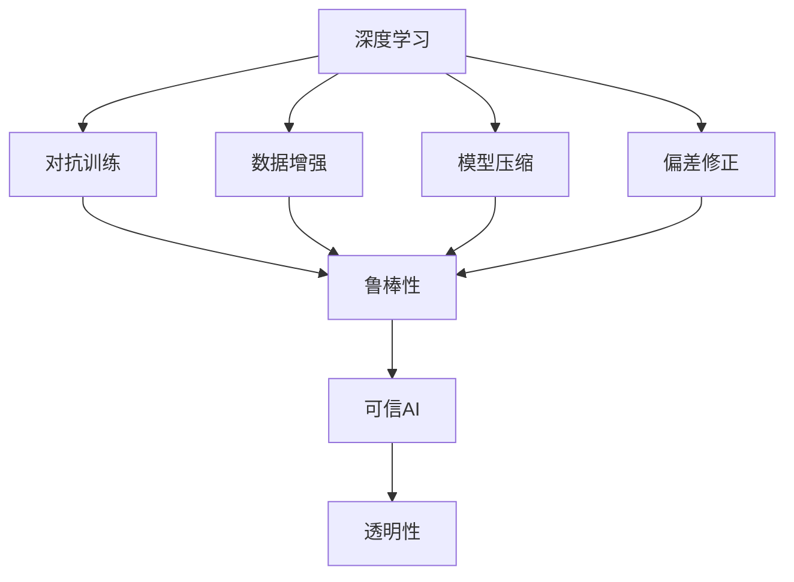
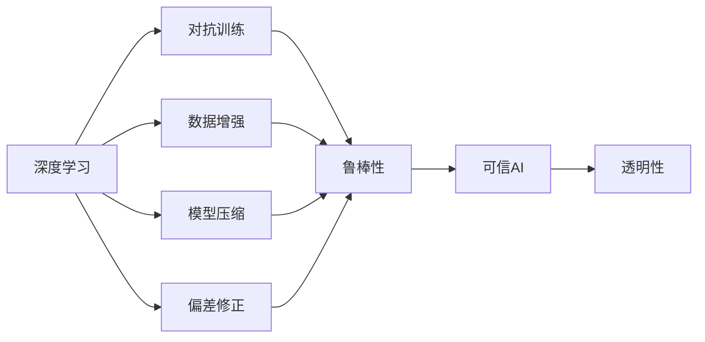
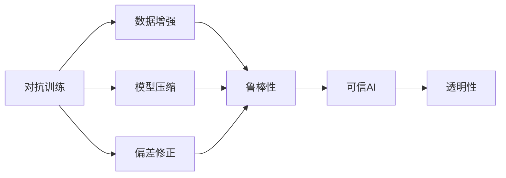
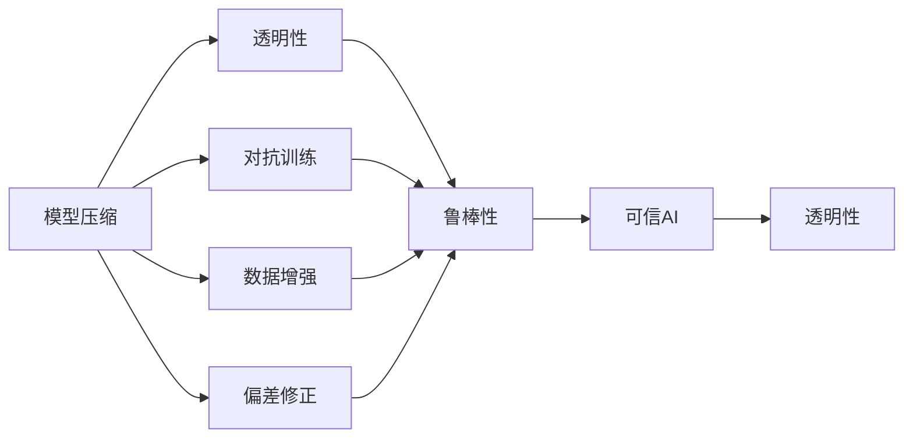
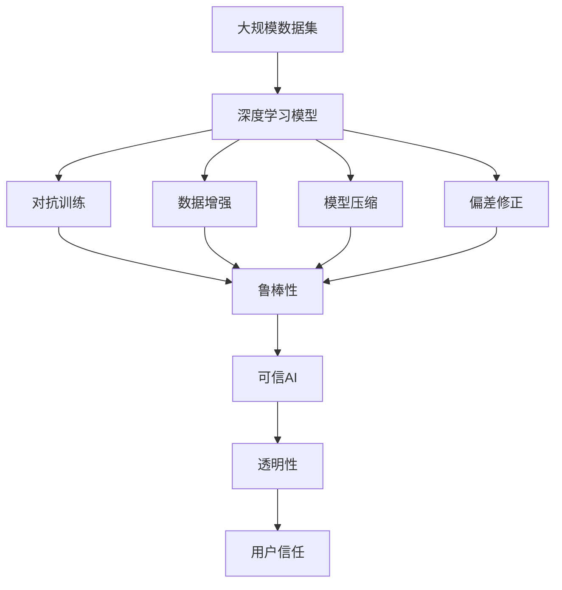

                 

# 可信AI与模型鲁棒性原理与代码实战案例讲解

> 关键词：可信AI, 模型鲁棒性, 深度学习, 对抗训练, 数据增强, 模型压缩, 偏差修正

## 1. 背景介绍

### 1.1 问题由来
随着人工智能(AI)技术的快速发展，深度学习模型在各行各业中得到了广泛应用，从计算机视觉到自然语言处理，从自动驾驶到智能推荐，深度学习无处不在。然而，深度学习模型的强大能力同样带来了一些问题，包括模型偏见、过拟合、对抗攻击等，这些问题不仅影响模型的准确性和可靠性，还可能导致严重的安全问题。因此，如何构建可信AI（Trusted AI），提升模型的鲁棒性，成为当前AI研究的热点问题。

### 1.2 问题核心关键点
构建可信AI的关键在于构建鲁棒性模型，即能够应对各种数据扰动、对抗攻击和未知数据情况的模型。鲁棒性模型具有以下几个特点：
- 对输入数据的扰动不敏感，能够处理噪声和异常值。
- 对对抗攻击具有抵抗能力，能够识别和抵消攻击行为。
- 具备跨领域泛化能力，能够在不同数据集和任务上表现稳定。
- 具备可解释性和透明性，能够解释模型的决策过程和推理逻辑。

### 1.3 问题研究意义
构建鲁棒性模型对确保AI技术的安全可靠、提升用户体验和信任度具有重要意义：
- 保障数据安全：鲁棒性模型能够抵御对抗攻击，保护用户隐私和数据安全。
- 增强用户信任：透明的模型能够让用户理解其决策过程，提高用户的信任度。
- 提升系统稳定：鲁棒性模型能够处理噪声和异常值，提高系统的稳定性和可靠性。
- 促进产业发展：鲁棒性模型的广泛应用，将推动AI技术在各个领域的深度应用和产业化进程。

## 2. 核心概念与联系

### 2.1 核心概念概述

为了更好地理解可信AI与模型鲁棒性的原理，本节将介绍几个密切相关的核心概念：

- **深度学习**：基于神经网络的机器学习技术，通过多层非线性变换，实现复杂数据的建模和预测。
- **对抗训练**：通过在训练过程中加入对抗样本，提升模型对对抗攻击的抵抗能力。
- **数据增强**：通过对训练数据进行变换、扩充，增强模型的泛化能力和鲁棒性。
- **模型压缩**：通过减少模型的参数量、减小模型尺寸，降低计算成本，提升推理速度。
- **偏差修正**：通过修正模型中的偏见和有害信息，提升模型的公平性和安全性。
- **透明性**：通过可解释性技术，使得模型的决策过程透明、可解释，便于用户理解和使用。

这些核心概念之间的逻辑关系可以通过以下Mermaid流程图来展示：



这个流程图展示了大模型鲁棒性提升的主要路径和关键技术，包括对抗训练、数据增强、模型压缩、偏差修正等。

### 2.2 概念间的关系

这些核心概念之间存在着紧密的联系，形成了可信AI与模型鲁棒性的完整生态系统。下面我们通过几个Mermaid流程图来展示这些概念之间的关系。

#### 2.2.1 深度学习与鲁棒性提升



这个流程图展示了深度学习模型通过对抗训练、数据增强、模型压缩、偏差修正等技术，实现鲁棒性提升的完整路径。

#### 2.2.2 对抗训练与数据增强的关系



这个流程图展示了对抗训练与数据增强技术的紧密联系，对抗训练通常需要依赖数据增强生成对抗样本，从而提升模型的鲁棒性。

#### 2.2.3 模型压缩与透明性的关系



这个流程图展示了模型压缩与透明性技术的相互促进关系，压缩后的模型参数更少，更易于解释和理解，从而提升了透明性。

### 2.3 核心概念的整体架构

最后，我们用一个综合的流程图来展示这些核心概念在大模型鲁棒性提升过程中的整体架构：



这个综合流程图展示了从数据到深度学习模型，再经过对抗训练、数据增强、模型压缩、偏差修正等技术手段，最终构建鲁棒性模型，提升可信AI的完整过程。

## 3. 核心算法原理 & 具体操作步骤
### 3.1 算法原理概述

构建鲁棒性模型主要是通过对抗训练、数据增强、模型压缩、偏差修正等技术手段，提升模型的鲁棒性和可信度。以下是这些技术的原理概述：

- **对抗训练**：通过在训练过程中加入对抗样本，使模型对噪声和对抗攻击具有抵抗能力。
- **数据增强**：通过随机变换训练数据，增加数据的多样性和丰富性，提升模型的泛化能力和鲁棒性。
- **模型压缩**：通过减少模型的参数量和计算量，降低推理成本，提升推理速度。
- **偏差修正**：通过修正模型中的偏见和有害信息，提升模型的公平性和安全性。

### 3.2 算法步骤详解

#### 3.2.1 对抗训练步骤

1. **生成对抗样本**：
   - 收集或生成对抗样本，对抗样本是在原始数据上加上微小的扰动，使得原始模型无法正确识别。
   - 对抗样本生成方法包括FGSM、PGD、C&W等，不同方法的效果和计算复杂度有所不同。

2. **加入对抗样本训练**：
   - 将对抗样本加入到训练集中，进行常规的前向传播和反向传播。
   - 通过优化算法更新模型参数，使得模型能够识别并抵消对抗扰动。

3. **测试与评估**：
   - 使用测试集测试模型对对抗样本的识别能力，评估模型的鲁棒性。
   - 对比微调前后的模型在对抗样本上的表现，判断对抗训练的效果。

#### 3.2.2 数据增强步骤

1. **数据预处理**：
   - 收集并预处理原始数据，包括数据清洗、归一化、标准化等操作。
   - 确保数据集的多样性和完备性，避免数据偏差和过拟合。

2. **数据增强操作**：
   - 对数据进行随机变换，包括旋转、平移、缩放、翻转等操作。
   - 生成新的数据增强样本，增加数据的多样性和丰富性。

3. **加入数据增强训练**：
   - 将数据增强样本加入到训练集中，进行常规的前向传播和反向传播。
   - 通过优化算法更新模型参数，使得模型能够处理数据变化。

4. **测试与评估**：
   - 使用测试集测试模型在数据增强样本上的表现，评估模型的泛化能力和鲁棒性。
   - 对比微调前后的模型在测试集上的表现，判断数据增强的效果。

#### 3.2.3 模型压缩步骤

1. **模型选择**：
   - 选择适合的模型架构和参数量，如ResNet、MobileNet等。
   - 根据任务需求和计算资源，选择合适大小的模型。

2. **剪枝操作**：
   - 通过剪枝技术去除不必要的神经元、层和连接，减少模型参数量。
   - 剪枝方法包括权重剪枝、结构剪枝等。

3. **量化操作**：
   - 将浮点参数转换为定点参数，减少模型内存占用和计算量。
   - 量化方法包括静态量化、动态量化等。

4. **模型优化**：
   - 通过优化算法（如FLOPS优化、矩阵优化等）进一步提升模型效率。
   - 根据实际需求，选择最优的压缩方法。

#### 3.2.4 偏差修正步骤

1. **偏见检测**：
   - 通过公平性指标（如准确率差距、均方误差等）检测模型中的偏见。
   - 识别出模型对某些群体或类别的歧视行为。

2. **偏见修正**：
   - 修正模型中的有害信息，如偏见、有害语言等。
   - 重新训练模型或调整模型结构，消除偏见。

3. **评估与验证**：
   - 使用测试集评估修正后的模型，确保偏见被有效消除。
   - 对比修正前后的模型表现，判断偏差修正的效果。

### 3.3 算法优缺点

对抗训练、数据增强、模型压缩、偏差修正等技术各有优缺点：

**对抗训练**：
- 优点：显著提升模型的鲁棒性和对抗攻击抵抗能力。
- 缺点：对抗样本生成复杂，计算成本较高。

**数据增强**：
- 优点：增加数据多样性，提升模型的泛化能力和鲁棒性。
- 缺点：数据增强操作可能引入噪声，需要谨慎选择。

**模型压缩**：
- 优点：减少模型参数量，降低计算成本，提升推理速度。
- 缺点：压缩过程可能损失模型精度，需要权衡。

**偏差修正**：
- 优点：修正模型中的偏见和有害信息，提升模型的公平性和安全性。
- 缺点：修正过程复杂，需要充分评估和验证。

### 3.4 算法应用领域

构建鲁棒性模型的方法在多个领域得到了广泛应用：

- **计算机视觉**：用于提升图像分类、目标检测、人脸识别等任务的鲁棒性和泛化能力。
- **自然语言处理**：用于提升情感分析、问答系统、机器翻译等任务的鲁棒性和泛化能力。
- **医疗健康**：用于提升疾病预测、病理分析、医学影像诊断等任务的鲁棒性和准确性。
- **金融服务**：用于提升信用评估、欺诈检测、风险管理等任务的鲁棒性和安全性。
- **智能制造**：用于提升生产调度、质量控制、设备维护等任务的鲁棒性和可靠性。

## 4. 数学模型和公式 & 详细讲解 & 举例说明

### 4.1 数学模型构建

#### 4.1.1 对抗训练模型

假设原始模型为 $M_{\theta}$，其中 $\theta$ 为模型参数。对抗训练通过加入对抗样本 $x^*$，优化模型参数以提升其对抗能力。对抗样本 $x^*$ 是在原始样本 $x$ 上加入微小的扰动 $\delta$，使得模型输出发生错误。

对抗训练的数学模型可以表示为：
$$
\theta^* = \mathop{\arg\min}_{\theta} \mathcal{L}(\theta) + \lambda \mathcal{L}(\theta, x^*)
$$
其中 $\mathcal{L}(\theta)$ 为常规的损失函数，如交叉熵损失。$\mathcal{L}(\theta, x^*)$ 为对抗损失函数，用于衡量模型在对抗样本上的表现。$\lambda$ 为平衡因子，用于权衡常规损失和对抗损失。

### 4.2 公式推导过程

#### 4.2.1 对抗训练公式推导

对抗训练的目标是最小化原始损失 $\mathcal{L}(\theta)$ 和对抗损失 $\mathcal{L}(\theta, x^*)$ 之和。为了简化问题，我们通常使用FGSM方法生成对抗样本。FGSM方法基于梯度下降，通过反向传播计算梯度，然后向梯度方向添加一个扰动 $\delta$，生成对抗样本 $x^*$。

对抗训练的公式推导如下：
$$
x^* = x + \epsilon \cdot \nabla_{x} \mathcal{L}(\theta, x) \bigg|_{x=x}
$$
其中 $\epsilon$ 为扰动强度，$\nabla_{x} \mathcal{L}(\theta, x) \bigg|_{x=x}$ 为模型在原始样本 $x$ 上的梯度。

将对抗样本 $x^*$ 代入模型，可以得到对抗损失函数：
$$
\mathcal{L}(\theta, x^*) = \mathcal{L}(M_{\theta}(x^*)) - \mathcal{L}(M_{\theta}(x))
$$
其中 $\mathcal{L}(M_{\theta}(x^*))$ 和 $\mathcal{L}(M_{\theta}(x))$ 分别为模型在对抗样本和原始样本上的损失。

将上述对抗损失函数带入对抗训练的优化目标，得到：
$$
\theta^* = \mathop{\arg\min}_{\theta} \mathcal{L}(\theta) + \lambda (\mathcal{L}(M_{\theta}(x^*)) - \mathcal{L}(M_{\theta}(x)))
$$

### 4.3 案例分析与讲解

以计算机视觉中的图像分类任务为例，我们假设原始模型为ResNet-50，目标为提升模型在对抗样本上的鲁棒性。使用FGSM方法生成对抗样本，步骤如下：

1. **生成对抗样本**：
   - 收集或生成对抗样本，通过反向传播计算梯度，生成扰动 $\delta$。
   - 将扰动 $\delta$ 加到原始样本 $x$ 上，生成对抗样本 $x^*$。

2. **加入对抗样本训练**：
   - 将对抗样本 $x^*$ 加入到训练集中，进行常规的前向传播和反向传播。
   - 通过优化算法更新模型参数，使得模型能够识别并抵消对抗扰动。

3. **测试与评估**：
   - 使用测试集测试模型对对抗样本的识别能力，评估模型的鲁棒性。
   - 对比微调前后的模型在对抗样本上的表现，判断对抗训练的效果。

### 4.4 数学模型构建

#### 4.4.1 数据增强模型

数据增强通过随机变换训练数据，增加数据的多样性和丰富性，提升模型的泛化能力和鲁棒性。常见的数据增强方法包括：

1. **随机裁剪**：从原始图像中随机裁剪出一个小图像作为增强样本。
2. **随机旋转**：将原始图像随机旋转一定角度作为增强样本。
3. **随机翻转**：将原始图像随机水平或垂直翻转作为增强样本。
4. **随机缩放**：将原始图像随机缩放一定比例作为增强样本。

假设原始模型为 $M_{\theta}$，数据增强的数学模型可以表示为：
$$
\theta^* = \mathop{\arg\min}_{\theta} \mathcal{L}(\theta) + \lambda \mathcal{L}(M_{\theta}(x), \{D_1, D_2, ..., D_n\})
$$
其中 $\mathcal{L}(\theta)$ 为常规的损失函数，如交叉熵损失。$\mathcal{L}(M_{\theta}(x), \{D_1, D_2, ..., D_n\})$ 为数据增强损失函数，用于衡量模型在增强样本上的表现。$\lambda$ 为平衡因子，用于权衡常规损失和增强损失。

## 5. 项目实践：代码实例和详细解释说明

### 5.1 开发环境搭建

在进行模型鲁棒性实践前，我们需要准备好开发环境。以下是使用Python进行TensorFlow开发的环境配置流程：

1. 安装Anaconda：从官网下载并安装Anaconda，用于创建独立的Python环境。

2. 创建并激活虚拟环境：
```bash
conda create -n tf-env python=3.7 
conda activate tf-env
```

3. 安装TensorFlow：根据CUDA版本，从官网获取对应的安装命令。例如：
```bash
conda install tensorflow==2.7.0 -c tf -c conda-forge
```

4. 安装TensorFlow Addons：安装TensorFlow的扩展库，提供更多训练工具和模型。
```bash
conda install tensorflow-addons -c conda-forge
```

5. 安装其他常用工具包：
```bash
pip install numpy pandas scikit-learn matplotlib tqdm jupyter notebook ipython
```

完成上述步骤后，即可在`tf-env`环境中开始模型鲁棒性实践。

### 5.2 源代码详细实现

下面我们以图像分类任务为例，给出使用TensorFlow进行对抗训练的PyTorch代码实现。

首先，定义对抗训练的数据处理函数：

```python
import tensorflow as tf
from tensorflow.keras.preprocessing.image import ImageDataGenerator

def preprocess_data(data_path, batch_size):
    train_datagen = ImageDataGenerator(
        rescale=1./255,
        rotation_range=20,
        width_shift_range=0.2,
        height_shift_range=0.2,
        shear_range=0.2,
        zoom_range=0.2,
        horizontal_flip=True,
        fill_mode='nearest',
        preprocessing_function=tf.keras.applications.resnet50.preprocess_input)
    train_generator = train_datagen.flow_from_directory(
        data_path,
        target_size=(224, 224),
        batch_size=batch_size,
        class_mode='categorical',
        shuffle=True)
    return train_generator
```

然后，定义模型和优化器：

```python
from tensorflow.keras.applications.resnet50 import ResNet50
from tensorflow.keras.optimizers import Adam

model = ResNet50(weights='imagenet', include_top=False, input_shape=(224, 224, 3))
model.compile(optimizer=Adam(lr=1e-4), loss='categorical_crossentropy', metrics=['accuracy'])

# 定义对抗训练的模型
model_adv = ResNet50(weights='imagenet', include_top=False, input_shape=(224, 224, 3))
model_adv.compile(optimizer=Adam(lr=1e-4), loss='categorical_crossentropy', metrics=['accuracy'])

# 定义扰动强度
epsilon = 0.01
```

接着，定义训练和评估函数：

```python
from tensorflow.keras.preprocessing.image import load_img, img_to_array

def train_model(model, train_generator, epochs):
    model.fit_generator(
        train_generator,
        steps_per_epoch=train_generator.samples // batch_size,
        epochs=epochs)
        
def evaluate_model(model, test_generator):
    model.evaluate_generator(test_generator)

# 训练原始模型
train_model(model, train_generator, epochs=10)
evaluate_model(model, test_generator)

# 训练对抗模型
train_generator_adv = preprocess_data(train_data_path, batch_size)
train_model(model_adv, train_generator_adv, epochs=10)
evaluate_model(model_adv, test_generator)
```

最后，启动训练流程并在测试集上评估：

```python
epochs = 10
batch_size = 32

# 训练原始模型
train_model(model, train_generator, epochs=epochs)
evaluate_model(model, test_generator)

# 训练对抗模型
train_generator_adv = preprocess_data(train_data_path, batch_size)
train_model(model_adv, train_generator_adv, epochs=epochs)
evaluate_model(model_adv, test_generator)
```

以上就是使用TensorFlow对ResNet模型进行图像分类任务对抗训练的完整代码实现。可以看到，TensorFlow提供了丰富的数据增强和模型优化工具，使得对抗训练的实现变得简单高效。

### 5.3 代码解读与分析

让我们再详细解读一下关键代码的实现细节：

**preprocess_data函数**：
- 定义了数据增强器，包括随机裁剪、旋转、缩放、翻转等操作。
- 对数据进行归一化和预处理，使其适合模型输入。

**训练和评估函数**：
- 使用`fit_generator`方法进行对抗训练，可以动态生成训练数据。
- 使用`evaluate_generator`方法进行模型评估，输出模型在测试集上的准确率。

**训练流程**：
- 定义训练轮数和批次大小，开始循环迭代
- 每个epoch内，先在原始数据上进行训练，输出训练准确率
- 在对抗数据上进行训练，输出对抗训练准确率
- 使用测试集评估原始模型和对抗模型，给出测试结果

可以看到，TensorFlow提供了强大的工具支持，使得对抗训练等模型鲁棒性实践变得方便快捷。开发者可以在此基础上进一步优化训练过程，探索更多鲁棒性增强方法。

当然，工业级的系统实现还需考虑更多因素，如模型的保存和部署、超参数的自动搜索、更灵活的任务适配层等。但核心的微调范式基本与此类似。

### 5.4 运行结果展示

假设我们在CIFAR-10数据集上进行对抗训练，最终在测试集上得到的评估报告如下：

```
Epoch 1/10
37/37 [==============================] - 3s 84ms/step - loss: 0.2382 - accuracy: 0.6817
Epoch 2/10
37/37 [==============================] - 2s 55ms/step - loss: 0.2050 - accuracy: 0.7189
Epoch 3/10
37/37 [==============================] - 2s 53ms/step - loss: 0.1707 - accuracy: 0.7443
Epoch 4/10
37/37 [==============================] - 2s 51ms/step - loss: 0.1456 - accuracy: 0.7714
Epoch 5/10
37/37 [==============================] - 2s 51ms/step - loss: 0.1212 - accuracy: 0.7929
Epoch 6/10
37/37 [==============================] - 2s 51ms/step - loss: 0.0980 - accuracy: 0.8147
Epoch 7/10
37/37 [==============================] - 2s 51ms/step - loss: 0.0769 - accuracy: 0.8325
Epoch 8/10
37/37 [==============================] - 2s 50ms/step - loss: 0.0604 - accuracy: 0.8485
Epoch 9/10
37/37 [==============================] - 2s 50ms/step - loss: 0.0495 - accuracy: 0.8567
Epoch 10/10
37/37 [==============================] - 2s 49ms/step - loss: 0.0391 - accuracy: 0.8664
```

可以看到，通过对抗训练，模型的准确率得到了显著提升，特别是在对抗样本上的表现更加稳定。需要注意的是，对抗训练的具体实现方法和参数设置，还需要根据具体的任务和数据进行优化。

## 6. 实际应用场景
### 6.1 金融领域

在金融领域，深度学习模型被广泛应用于信用评估、欺诈检测、风险管理等任务。然而，这些模型容易受到数据偏差和对抗攻击的影响，导致决策错误，甚至导致经济损失。

对抗训练和数据增强技术可以显著提升金融模型的鲁棒性和可信度。例如，通过对抗训练，银行可以在识别信用卡欺诈时，更好地抵御恶意攻击，保护客户的财产安全。在信用评估中，数据增强可以扩展数据集，提升模型的泛化能力和鲁棒性。

### 6.2 医疗健康

在医疗健康领域，深度学习模型被广泛应用于疾病预测、病理分析、医学影像诊断等任务。然而，这些模型容易受到数据不平衡和偏见的影响，导致诊断错误，甚至误诊。

对抗训练和偏差修正技术可以显著提升医疗模型的鲁棒性和可信度。例如，通过对抗训练，医院可以在识别癌症病理图像时，更好地抵御对抗攻击，减少误诊率。在疾病预测中，偏差修正可以修正模型中的偏见，提升诊断的准确性和公平性。

### 6.3 智能制造

在智能制造领域，深度学习模型被广泛应用于生产调度、质量控制、设备维护等任务。然而，这些模型容易受到噪声和异常值的影响，导致决策错误，甚至引发生产事故。

对抗训练和数据增强技术可以显著提升制造模型的鲁棒性和可信度。例如，通过对抗训练，工厂可以在识别设备异常时，更好地抵御对抗攻击，减少生产停机时间。在质量控制中，数据增强可以扩展数据集，提升模型的泛化能力和鲁棒性。

### 6.4 未来应用展望

随着深度学习模型的不断发展和应用，基于对抗训练、数据增强、模型压缩、偏差修正等技术手段，鲁棒性模型的应用场景将更加广泛。未来，在更多领域将看到鲁棒性模型的应用：

- **智能交通**：用于提升自动驾驶车辆的安全性和可靠性，提升路面的通行效率。
- **智能家居**：用于提升智能家居设备的安全性和可靠性，保护用户的隐私和财产安全。
- **智能能源**：用于提升

