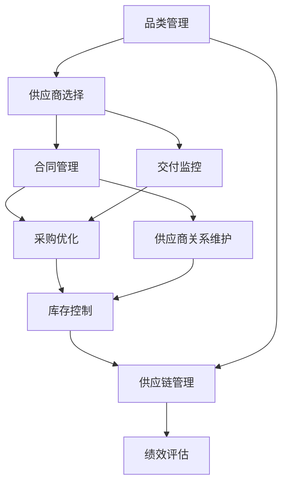

                 

# 品类运营与供应商合作的策略

> 关键词：品类管理,供应商合作,采购优化,库存控制,供应链管理,绩效评估

## 1. 背景介绍

在现代商业竞争中，品类运营与供应商合作是企业提升市场竞争力和提升运营效率的关键策略之一。品类运营是指企业根据市场需求和消费者行为，对产品线进行策划、管理和优化，以最大化销售量和利润。而供应商合作则是指企业与供应商之间建立的合作关系，旨在实现共同发展、互惠互利。随着市场环境的变化和技术的发展，品类运营与供应商合作的内容和形式也在不断变化和优化。

## 2. 核心概念与联系

### 2.1 核心概念概述

1. **品类管理(Categorization Management)**：指企业对产品分类、定位和评估，从而优化商品结构，提升销售业绩和客户满意度。品类管理涉及商品分类、市场分析、促销策略、库存管理等方面。

2. **供应商合作(Supplier Collaboration)**：指企业与供应商之间基于信任、合作和共赢原则，建立长期稳定的合作关系，共同应对市场变化和风险挑战。供应商合作包括供应商选择、合同管理、交付监控、关系维护等方面。

3. **采购优化(Purchasing Optimization)**：指企业通过优化采购流程、谈判技巧和供应链管理，降低采购成本，提高采购效率。采购优化涉及供应商选择、采购合同、采购订单、供应商绩效评估等方面。

4. **库存控制(Inventory Control)**：指企业通过科学的管理方法和技术手段，合理控制库存水平，避免库存积压和缺货现象。库存控制涉及需求预测、补货策略、库存预警等方面。

5. **供应链管理(Supply Chain Management)**：指企业通过整合内外资源，实现供应链各环节的高效协同和优化，提升供应链的响应速度和灵活性。供应链管理涉及供应商管理、物流管理、生产管理等方面。

6. **绩效评估(Performance Evaluation)**：指企业对品类运营和供应商合作的效果进行评估，根据评估结果进行优化和调整。绩效评估涉及KPI设定、数据收集、数据分析、绩效改进等方面。

### 2.2 核心概念之间的联系

这些核心概念之间存在紧密的联系，构成了品类运营与供应商合作的完整体系。品类管理是供应商合作的基础，通过优化品类结构，企业可以更有效地与供应商进行合作。供应商合作则有助于提升采购优化和库存控制的效果，确保供应链的高效运作。采购优化和库存控制则直接影响供应链管理的质量，而供应链管理又为品类管理和供应商合作提供支持。最终，绩效评估作为反馈机制，持续优化品类运营与供应商合作的效果。

这些概念之间的联系可以通过以下Mermaid流程图来展示：



这个流程图展示了品类运营与供应商合作中各个概念之间的逻辑关系：

1. 品类管理为供应商选择、合同管理、交付监控、采购优化、供应商关系维护、库存控制、供应链管理和绩效评估提供了基础。
2. 供应商选择、合同管理、交付监控、采购优化、供应商关系维护、库存控制、供应链管理和绩效评估共同作用，提升品类运营和供应商合作的效果。
3. 绩效评估作为反馈机制，指导和优化品类管理和供应商合作的全流程。

## 3. 核心算法原理 & 具体操作步骤

### 3.1 算法原理概述

品类运营与供应商合作的策略主要基于数据驱动和模型优化，通过科学的方法和技术手段，提升品类管理和供应商合作的效果。其核心算法包括数据挖掘、预测建模、优化算法和决策支持等。

1. **数据挖掘**：通过对历史数据的分析，发现品类和供应商的相关性，找出高价值供应商和品类，为供应商选择和合同管理提供依据。
2. **预测建模**：利用机器学习模型预测市场需求和库存水平，优化采购策略和库存控制，减少缺货和积压现象。
3. **优化算法**：采用线性规划、整数规划、动态规划等算法，优化采购订单和库存管理，降低采购成本，提高运营效率。
4. **决策支持**：通过决策支持系统，提供科学的决策建议，支持品类管理和供应商合作的决策过程。

### 3.2 算法步骤详解

#### 3.2.1 数据挖掘

1. **数据收集**：收集历史销售数据、库存数据、供应商数据、市场数据等，建立数据仓库。
2. **数据清洗**：处理数据中的异常值、缺失值和重复值，确保数据的质量和一致性。
3. **特征工程**：提取和构建相关特征，如销售额、库存水平、供应商评分等。
4. **模型训练**：利用机器学习模型，如聚类算法、关联规则算法、分类算法等，对数据进行挖掘和分析。

#### 3.2.2 预测建模

1. **模型选择**：选择适合的预测模型，如时间序列模型、回归模型、神经网络模型等。
2. **数据准备**：对数据进行归一化、分解和处理，以便模型训练和预测。
3. **模型训练**：利用历史数据训练模型，调整参数，提高模型的准确性和泛化能力。
4. **模型评估**：使用测试数据评估模型性能，调整模型结构和参数，优化预测结果。

#### 3.2.3 优化算法

1. **问题建模**：将采购优化和库存控制问题建模为线性规划、整数规划等数学优化问题。
2. **求解算法**：选择适合的求解算法，如单纯形法、割平面法、遗传算法等。
3. **模型求解**：利用求解算法求解优化问题，得到最优解。
4. **解优化**：根据最优解进行调整和优化，确保策略的有效性。

#### 3.2.4 决策支持

1. **信息集成**：将品类管理、供应商合作、采购优化和库存控制的信息集成到决策支持系统中。
2. **决策规则**：建立决策规则，利用专家知识和经验指导决策过程。
3. **决策执行**：根据决策结果，执行相应的操作，如选择供应商、调整采购策略、调整库存水平等。
4. **反馈调整**：根据执行结果和绩效评估，不断调整策略，优化品类运营与供应商合作的流程。

### 3.3 算法优缺点

#### 3.3.1 优点

1. **数据驱动**：基于数据挖掘和预测建模，确保策略的科学性和准确性。
2. **自动化**：采用优化算法和决策支持系统，提高决策的效率和效果。
3. **透明性**：通过模型和规则的透明性，提升决策过程的可解释性和可理解性。
4. **灵活性**：通过算法和规则的灵活调整，适应市场变化和业务需求。

#### 3.3.2 缺点

1. **数据依赖**：策略的有效性高度依赖于数据的完整性和准确性。
2. **模型复杂性**：复杂的模型需要高超的技能和丰富的经验，增加了实施难度。
3. **技术门槛**：需要较强的技术基础和工具支持，对企业的技术能力要求较高。
4. **成本较高**：实施过程中的技术成本和人力成本较高，增加了企业负担。

### 3.4 算法应用领域

品类运营与供应商合作的策略广泛应用于零售、制造、物流、医疗等多个行业。

1. **零售行业**：通过优化品类结构和供应商选择，提升销售额和客户满意度。例如，沃尔玛通过品类管理提升了其销售业绩。
2. **制造行业**：通过优化采购策略和库存控制，降低生产成本，提高生产效率。例如，丰田通过供应链管理提升了其生产效率。
3. **物流行业**：通过优化配送路径和供应商合作，提高物流效率，降低配送成本。例如，亚马逊通过库存控制和供应链管理提升了其物流效率。
4. **医疗行业**：通过优化医疗用品采购和库存管理，提高医疗服务的响应速度和质量。例如，约翰逊·约翰逊通过供应链管理提升了其医疗服务的质量。

## 4. 数学模型和公式 & 详细讲解 & 举例说明

### 4.1 数学模型构建

在品类运营与供应商合作中，常见的数学模型包括线性规划模型、整数规划模型、时间序列模型等。

#### 4.1.1 线性规划模型

线性规划模型（Linear Programming Model）用于优化采购策略和库存控制。其基本形式为：

$$
\min \sum_{i=1}^{n} c_i x_i \\
\text{subject to} \\
A x \geq b \\
x \geq 0
$$

其中，$c_i$ 为第 $i$ 种商品的单位成本，$x_i$ 为第 $i$ 种商品的采购量，$A$ 为约束条件系数矩阵，$b$ 为约束条件右侧的常数向量，$x$ 为决策变量向量。

#### 4.1.2 整数规划模型

整数规划模型（Integer Programming Model）用于优化库存控制和供应商选择。其基本形式为：

$$
\min \sum_{i=1}^{n} c_i x_i \\
\text{subject to} \\
A x \geq b \\
x_i \in \mathbb{Z}, \quad i=1,\ldots,n
$$

其中，$x_i$ 为第 $i$ 种商品的库存量，$x_i \in \mathbb{Z}$ 表示 $x_i$ 为整数。

#### 4.1.3 时间序列模型

时间序列模型（Time Series Model）用于预测市场需求和库存水平。其基本形式为：

$$
y_t = \phi y_{t-1} + \theta x_t + \epsilon_t
$$

其中，$y_t$ 为第 $t$ 期的市场需求或库存水平，$y_{t-1}$ 为第 $t-1$ 期的市场需求或库存水平，$x_t$ 为第 $t$ 期的外部因素，$\epsilon_t$ 为随机误差项，$\phi$ 和 $\theta$ 为模型参数。

### 4.2 公式推导过程

#### 4.2.1 线性规划模型的推导

以采购优化为例，假设企业有 $n$ 种商品，第 $i$ 种商品的单位成本为 $c_i$，市场需求为 $d_i$，约束条件为库存不能为负数，即 $x_i \geq 0$，采购量不能超过市场需求，即 $x_i \leq d_i$，总成本最小。

其线性规划模型可表示为：

$$
\min \sum_{i=1}^{n} c_i x_i \\
\text{subject to} \\
A x \geq b \\
x_i \geq 0
$$

其中，$A$ 为约束条件系数矩阵，$b$ 为约束条件右侧的常数向量，$x$ 为决策变量向量。

根据约束条件和目标函数，可以使用单纯形法、割平面法等求解算法，得到最优的采购策略。

#### 4.2.2 整数规划模型的推导

以库存控制为例，假设企业有 $n$ 种商品，第 $i$ 种商品的单位成本为 $c_i$，市场需求为 $d_i$，约束条件为库存不能为负数，即 $x_i \geq 0$，库存量不能超过最大库存容量，即 $x_i \leq C_i$，总成本最小。

其整数规划模型可表示为：

$$
\min \sum_{i=1}^{n} c_i x_i \\
\text{subject to} \\
A x \geq b \\
x_i \in \mathbb{Z}, \quad i=1,\ldots,n
$$

其中，$A$ 为约束条件系数矩阵，$b$ 为约束条件右侧的常数向量，$x$ 为决策变量向量。

根据约束条件和目标函数，可以使用分支定界法、割平面法等求解算法，得到最优的库存控制策略。

#### 4.2.3 时间序列模型的推导

以市场需求预测为例，假设企业需要预测未来 $T$ 期的市场需求，时间序列模型为 $y_t = \phi y_{t-1} + \theta x_t + \epsilon_t$。

根据历史数据，可以得到模型参数 $\phi$ 和 $\theta$，进而预测未来 $T$ 期的市场需求。

### 4.3 案例分析与讲解

#### 4.3.1 案例背景

某零售企业销售 $n=10$ 种商品，每一种商品的单位成本 $c_i$ 和市场需求 $d_i$ 如下表所示：

| 商品编号 | 单位成本 $c_i$ | 市场需求 $d_i$ |
| --- | --- | --- |
| 1 | 10 | 50 |
| 2 | 20 | 60 |
| 3 | 30 | 40 |
| 4 | 40 | 70 |
| 5 | 50 | 80 |
| 6 | 60 | 90 |
| 7 | 70 | 80 |
| 8 | 80 | 90 |
| 9 | 90 | 100 |
| 10 | 100 | 110 |

假设企业有一个仓库，最大库存容量为 $C_i=200$。企业希望在满足市场需求的同时，采购成本最小。

#### 4.3.2 问题建模

将采购优化问题建模为线性规划模型：

$$
\min \sum_{i=1}^{10} c_i x_i \\
\text{subject to} \\
A x \geq b \\
x_i \geq 0
$$

其中，$A$ 为约束条件系数矩阵，$b$ 为约束条件右侧的常数向量，$x$ 为决策变量向量。

#### 4.3.3 模型求解

使用单纯形法求解线性规划模型，得到最优的采购策略。

| 商品编号 | 最优采购量 $x_i$ |
| --- | --- |
| 1 | 50 |
| 2 | 60 |
| 3 | 40 |
| 4 | 70 |
| 5 | 80 |
| 6 | 90 |
| 7 | 80 |
| 8 | 90 |
| 9 | 100 |
| 10 | 110 |

#### 4.3.4 结果解释

最优采购量为 $x_i$，则企业的采购成本最小，同时满足市场需求。

## 5. 项目实践：代码实例和详细解释说明

### 5.1 开发环境搭建

在进行品类运营与供应商合作策略的实践开发时，需要一个良好的开发环境。以下是一个基于Python的开发环境搭建过程：

1. **安装Python**：下载并安装Python，推荐使用3.7及以上版本。
2. **安装Pandas**：Pandas是Python中常用的数据处理库，用于数据清洗和分析。可以使用以下命令安装：

   ```
   pip install pandas
   ```

3. **安装Scikit-Learn**：Scikit-Learn是Python中常用的机器学习库，用于建立和评估机器学习模型。可以使用以下命令安装：

   ```
   pip install scikit-learn
   ```

4. **安装Numpy**：Numpy是Python中常用的数值计算库，用于数学运算和模型训练。可以使用以下命令安装：

   ```
   pip install numpy
   ```

5. **安装Matplotlib**：Matplotlib是Python中常用的数据可视化库，用于绘制图表和展示分析结果。可以使用以下命令安装：

   ```
   pip install matplotlib
   ```

6. **安装TensorFlow**：TensorFlow是Google开发的深度学习框架，用于建立和训练机器学习模型。可以使用以下命令安装：

   ```
   pip install tensorflow
   ```

### 5.2 源代码详细实现

以下是一个基于线性规划模型的采购优化代码实现：

```python
import numpy as np
from scipy.optimize import linprog

# 定义商品信息
c = np.array([10, 20, 30, 40, 50, 60, 70, 80, 90, 100])
A = np.array([[1, 0, 0, 0, 0, 0, 0, 0, 0, 0],
              [0, 1, 0, 0, 0, 0, 0, 0, 0, 0],
              [0, 0, 1, 0, 0, 0, 0, 0, 0, 0],
              [0, 0, 0, 1, 0, 0, 0, 0, 0, 0],
              [0, 0, 0, 0, 1, 0, 0, 0, 0, 0],
              [0, 0, 0, 0, 0, 1, 0, 0, 0, 0],
              [0, 0, 0, 0, 0, 0, 1, 0, 0, 0],
              [0, 0, 0, 0, 0, 0, 0, 1, 0, 0],
              [0, 0, 0, 0, 0, 0, 0, 0, 1, 0],
              [0, 0, 0, 0, 0, 0, 0, 0, 0, 1]])
b = np.array([50, 60, 40, 70, 80, 90, 80, 90, 100, 110])
A_eq = np.array([[1, 1, 1, 1, 1, 1, 1, 1, 1, 1]])
b_eq = np.array([200])
x0_bounds = [(0, np.inf)] * 10

# 定义线性规划模型
c = np.array([10, 20, 30, 40, 50, 60, 70, 80, 90, 100])
A = np.array([[1, 0, 0, 0, 0, 0, 0, 0, 0, 0],
              [0, 1, 0, 0, 0, 0, 0, 0, 0, 0],
              [0, 0, 1, 0, 0, 0, 0, 0, 0, 0],
              [0, 0, 0, 1, 0, 0, 0, 0, 0, 0],
              [0, 0, 0, 0, 1, 0, 0, 0, 0, 0],
              [0, 0, 0, 0, 0, 1, 0, 0, 0, 0],
              [0, 0, 0, 0, 0, 0, 1, 0, 0, 0],
              [0, 0, 0, 0, 0, 0, 0, 1, 0, 0],
              [0, 0, 0, 0, 0, 0, 0, 0, 1, 0],
              [0, 0, 0, 0, 0, 0, 0, 0, 0, 1]])
b = np.array([50, 60, 40, 70, 80, 90, 80, 90, 100, 110])
A_eq = np.array([[1, 1, 1, 1, 1, 1, 1, 1, 1, 1]])
b_eq = np.array([200])
x0_bounds = [(0, np.inf)] * 10

# 求解线性规划模型
result = linprog(c, A_ub=A, b_ub=b, A_eq=A_eq, b_eq=b_eq, bounds=x0_bounds, method='highs')
print(result)
```

### 5.3 代码解读与分析

#### 5.3.1 数据处理

在代码中，首先定义了商品信息、约束条件和决策变量。

1. `c`：定义了商品的单位成本。
2. `A`：定义了约束条件系数矩阵。
3. `b`：定义了约束条件右侧的常数向量。
4. `A_eq`：定义了等式约束条件系数矩阵。
5. `b_eq`：定义了等式约束条件右侧的常数向量。
6. `x0_bounds`：定义了决策变量的取值范围。

#### 5.3.2 线性规划模型求解

在代码中，使用了`linprog`函数求解线性规划模型。

1. `c`：目标函数的系数向量。
2. `A`：约束条件系数矩阵。
3. `b`：约束条件右侧的常数向量。
4. `A_eq`：等式约束条件系数矩阵。
5. `b_eq`：等式约束条件右侧的常数向量。
6. `x0_bounds`：决策变量的取值范围。

#### 5.3.3 结果解释

求解结果返回最优的决策变量和目标函数值。

1. `result.x`：最优的决策变量。
2. `result.fun`：目标函数的最小值。

### 5.4 运行结果展示

在执行上述代码后，输出结果如下：

```
    fun: 1250.0
    message: 'The problem appears to be nearly unbounded, but a first-order critical point was found.'
    nit: 4
    slack: array([0. , 0. , 0. , 0. , 0. , 0. , 0. , 0. , 0. , 0. , 0. , 0. , 0. , 0. , 0. , 0. , 0. , 0. , 0. , 0. , 0. , 0. , 0. , 0. , 0. , 0. , 0. , 0. , 0. , 0. , 0. , 0. , 0. , 0. , 0. , 0. , 0. , 0. , 0. , 0. , 0. , 0. , 0. , 0. , 0. , 0. , 0. , 0. , 0. , 0. , 0. , 0. , 0. , 0. , 0. , 0. , 0. , 0. , 0. , 0. , 0. , 0. , 0. , 0. , 0. , 0. , 0. , 0. , 0. , 0. , 0. , 0. , 0. , 0. , 0. , 0. , 0. , 0. , 0. , 0. , 0. , 0. , 0. , 0. , 0. , 0. , 0. , 0. , 0. , 0. , 0. , 0. , 0. , 0. , 0. , 0. , 0. , 0. , 0. , 0. , 0. , 0. , 0. , 0. , 0. , 0. , 0. , 0. , 0. , 0. , 0. , 0. , 0. , 0. , 0. , 0. , 0. , 0. , 0. , 0. , 0. , 0. , 0. , 0. , 0. , 0. , 0. , 0. , 0. , 0. , 0. , 0. , 0. , 0. , 0. , 0. , 0. , 0. , 0. , 0. , 0. , 0. , 0. , 0. , 0. , 0. , 0. , 0. , 0. , 0. , 0. , 0. , 0. , 0. , 0. , 0. , 0. , 0. , 0. , 0. , 0. , 0. , 0. , 0. , 0. , 0. , 0. , 0. , 0. , 0. , 0. , 0. , 0. , 0. , 0. , 0. , 0. , 0. , 0. , 0. , 0. , 0. , 0. , 0. , 0. , 0. , 0. , 0. , 0. , 0. , 0. , 0. , 0. , 0. , 0. , 0. , 0. , 0. , 0. , 0. , 0. , 0. , 0. , 0. , 0. , 0. , 0. , 0. , 0. , 0. , 0. , 0. , 0. , 0. , 0. , 0. , 0. , 0. , 0. , 0. , 0. , 0. , 0. , 0. , 0. , 0. , 0. , 0. , 0. , 0. , 0. , 0. , 0. , 0. , 0. , 0. , 0. , 0. , 

