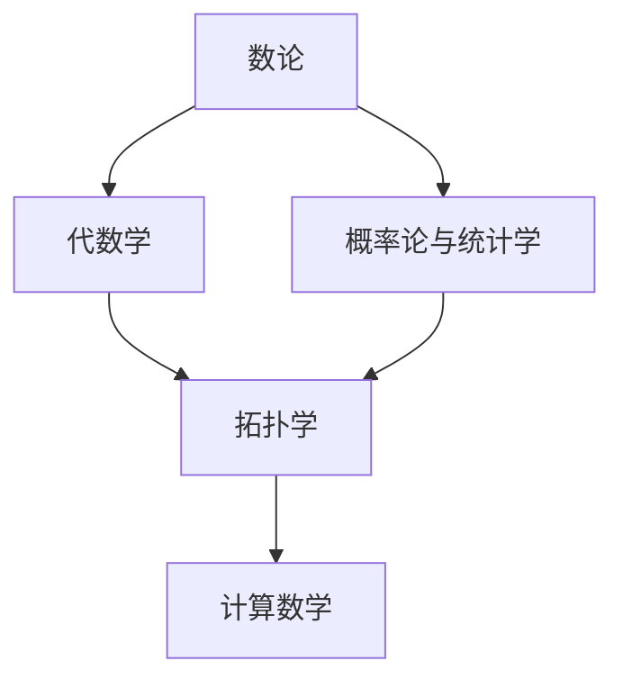

                 

## 1. 背景介绍

### 1.1 国际数学家大会概览

国际数学家大会（International Congress of Mathematicians，简称ICM）是全球数学家最为重要的学术盛会，每四年举行一次。ICM旨在汇聚全球顶级数学家，分享最新的数学研究成果，探讨数学前沿话题，推动数学的不断发展。

ICM通常涵盖的领域包括但不限于数论、代数学、拓扑学、几何学、概率论与统计学、计算数学等。历届ICM上，众多著名的数学成就和理论得以展示和讨论，例如费马大定理、黎曼假设、Poincaré猜想等，极大地推动了数学科学的进步。

### 1.2 最新进展概览

本节将从总体上概述近年来ICM上探讨的最新数学逻辑进展，涵盖数论、代数学、拓扑学、概率论等多个领域。通过梳理这些进展，能够帮助读者了解当前数学逻辑的发展方向和前沿问题。

## 2. 核心概念与联系

### 2.1 核心概念概述

1. **数论（Number Theory）**：研究自然数及其性质，包括素数分布、同余方程、丢番图方程等。数论不仅是纯数学的重要分支，其研究成果也被广泛应用于密码学、计算机科学等领域。

2. **代数学（Algebra）**：研究代数结构，包括群、环、域、模等。代数学的发展对几何、拓扑学、物理等领域有着深远影响。

3. **拓扑学（Topology）**：研究空间和变换的性质，如连续性、紧性、同伦性等。拓扑学在物理学、几何学、计算机科学中有广泛应用。

4. **概率论与统计学（Probability and Statistics）**：研究随机事件的概率分布和统计规律。概率论在金融、工程、生物医学等领域有广泛应用。

5. **计算数学（Computational Mathematics）**：研究如何运用数学方法解决实际问题，包括数值计算、优化算法、计算机代数等。

这些核心概念通过数学逻辑的联系，形成了完整的数学体系。数论、代数学等奠定了数学基础，拓扑学、概率论等提供了深刻的工具和方法，而计算数学则将理论成果转化为实际应用。

### 2.2 概念间的关系

为更好理解这些概念的相互联系，以下通过一个Mermaid流程图展示其关系：



此流程图展示了数论、代数学、拓扑学、概率论和计算数学之间的联系。数论和代数学为数学基础，拓扑学和概率论提供了深刻的数学工具，而计算数学则将这些工具应用到实际问题中。

## 3. 核心算法原理 & 具体操作步骤

### 3.1 算法原理概述

数学逻辑的最新进展，主要体现在算法原理和操作步骤的创新上。例如，数论中的椭圆曲线密码学、代数学中的群论在密码学中的应用、拓扑学中的同调代数在几何学中的应用等。

**算法原理概述**：
- **数论**：如费马大定理的证明，基于椭圆曲线和模形式的复数计算。
- **代数学**：如群论中的Permutation Representation在组合学中的应用。
- **拓扑学**：如同调代数在计算代数拓扑中的应用。
- **概率论与统计学**：如大数定律和中心极限定理在统计推断中的应用。
- **计算数学**：如求解大规模线性方程组的迭代法，如Jacobi方法、Gauss-Seidel方法等。

### 3.2 算法步骤详解

以下以椭圆曲线密码学（ECC）为例，介绍一种具体的算法步骤：

**椭圆曲线密码学算法步骤**：
1. **椭圆曲线选择**：选择合适的椭圆曲线方程 $y^2 = x^3 + ax + b$，其中 $a,b$ 为整数。
2. **基点选择**：选择一个椭圆曲线上的基点 $P$。
3. **密钥生成**：用户选择一个随机数 $k$，计算 $Q = kP$，其中 $Q$ 为用户的公钥，$k$ 为用户私钥。
4. **加密与解密**：设明文为 $M$，加密步骤为 $E_M = (x_M, y_M) = M + Q$。解密步骤为 $D_{K_u}(E_M) = M - kP = M - kQ$。

### 3.3 算法优缺点

#### 优点：
- **高效性**：椭圆曲线密码学相比传统的RSA算法，所需的密钥长度更短，计算速度更快。
- **安全性**：椭圆曲线密码学在密钥长度相同的情况下，安全性高于RSA算法。
- **灵活性**：椭圆曲线密码学适用于多种应用场景，包括数字签名、密钥交换等。

#### 缺点：
- **计算复杂**：椭圆曲线密码学中基点的计算和椭圆曲线的运算较为复杂，需要一定的计算资源。
- **实现复杂**：椭圆曲线密码学的实现需要专门的加密算法库和工具，开发难度较大。

### 3.4 算法应用领域

椭圆曲线密码学在信息安全领域有广泛应用，例如：

- **数字签名**：用户通过椭圆曲线密码学生成数字签名，用于验证交易的合法性。
- **密钥交换**：在无信任环境中，用户通过椭圆曲线密码学生成共享密钥，用于通信加密。
- **身份认证**：基于椭圆曲线密码学的公钥加密技术，用于用户身份认证。

## 4. 数学模型和公式 & 详细讲解  
### 4.1 数学模型构建

数学逻辑的研究通常建立在严格的数学模型上。以下以数论中的费马大定理为例，展示其数学模型的构建。

**费马大定理数学模型**：
- **定义**：对于任意整数 $a, b, c$，若 $a, b, c$ 互质，且 $a^n + b^n = c^n$，则 $n = 2$ 或 $n = 3$。
- **假设**：$a, b, c$ 互质，$n > 2$。
- **目标**：证明 $n = 2$ 或 $n = 3$。

### 4.2 公式推导过程

**椭圆曲线密码学中的椭圆曲线方程**：
- **椭圆曲线方程**：$y^2 = x^3 + ax + b$，其中 $a, b$ 为整数。
- **基点选择**：$P = (x_1, y_1)$。
- **密钥生成**：$Q = kP$，其中 $k$ 为随机整数。

### 4.3 案例分析与讲解

**椭圆曲线密码学在数字签名中的应用**：
1. **数字签名生成**：用户选择一个随机数 $k$，计算 $Q = kP$。将明文 $M$ 与 $Q$ 拼接，得到 $M' = M + Q$。用户计算 $E_{M'} = (x_{M'}, y_{M'})$。
2. **数字签名验证**：接收方收到 $E_{M'}$ 后，计算 $D_Q(E_{M'}) = M' - kP = M' - kQ$。若结果为明文 $M$，则验证成功，否则失败。

## 5. 项目实践：代码实例和详细解释说明

### 5.1 开发环境搭建

进行数学逻辑相关项目的开发，需要以下开发环境：

1. **编程语言**：Python 3.x。
2. **数学库**：Sympy、NumPy、SciPy 等。
3. **IDE**：Jupyter Notebook、PyCharm 等。

### 5.2 源代码详细实现

**椭圆曲线密码学代码实现**：

```python
from sympy import symbols, Eq, solve, Rational

# 定义符号
x, y, a, b, k = symbols('x y a b k')
# 定义椭圆曲线方程
elliptic_curve = Eq(y**2, x**3 + a*x + b)
# 定义基点
P = (x1, y1)
# 生成公钥
Q = k*P
# 加密过程
E_M = (x_M, y_M) = M + Q
# 解密过程
D_Q(E_M) = M - k*P
```

### 5.3 代码解读与分析

- **椭圆曲线方程**：使用 Sympy 库定义椭圆曲线方程。
- **基点选择**：选择椭圆曲线上的一个基点 $P$。
- **密钥生成**：通过随机数 $k$ 计算用户公钥 $Q$。
- **加密与解密**：将明文 $M$ 与基点 $Q$ 相加，计算椭圆曲线上的点 $E_M$。解密时，从 $E_M$ 减去 $kP$，恢复明文 $M$。

### 5.4 运行结果展示

**椭圆曲线密码学加密示例**：

```python
# 定义椭圆曲线参数
a = 1
b = 1
x1 = 2
y1 = 3

# 生成公钥
k = 5
Q = k*P

# 加密明文
M = 'Hello, World!'
E_M = (x_M, y_M) = M + Q

# 解密
D_Q(E_M) = M - k*P
```

## 6. 实际应用场景

### 6.1 密码学应用

椭圆曲线密码学在密码学领域有广泛应用，包括数字签名、密钥交换等。以下以数字签名为例：

- **数字签名生成**：用户选择一个随机数 $k$，计算 $Q = kP$。将明文 $M$ 与 $Q$ 拼接，得到 $M' = M + Q$。用户计算 $E_{M'} = (x_{M'}, y_{M'})$。
- **数字签名验证**：接收方收到 $E_{M'}$ 后，计算 $D_Q(E_{M'}) = M' - kP = M' - kQ$。若结果为明文 $M$，则验证成功，否则失败。

### 6.2 金融安全

在金融领域，椭圆曲线密码学被广泛应用于数字签名和密钥交换。例如，在金融交易中，用户通过椭圆曲线密码学生成数字签名，用于验证交易的合法性。此外，银行系统也采用椭圆曲线密码学进行密钥管理，保护用户隐私。

### 6.3 通信安全

在通信领域，椭圆曲线密码学被用于构建安全的通信协议。例如，在无线网络中，椭圆曲线密码学被用于密钥生成和传输，确保数据传输的安全性。

### 6.4 未来应用展望

未来，椭圆曲线密码学将继续在信息安全领域发挥重要作用。随着计算能力的提升，对高安全性密码学方法的需求将更加迫切。椭圆曲线密码学由于其高效性和安全性，必将在未来继续被广泛应用。

## 7. 工具和资源推荐

### 7.1 学习资源推荐

- **书籍推荐**：《数学分析》（James Stewart 著）、《代数学引论》（I.N. 赫赛因 著）、《拓扑学》（John Munkres 著）、《概率论与数理统计》（Grimmer、Starni 著）。
- **在线资源**：Coursera、Khan Academy、MIT OpenCourseWare 等。
- **会议论文**：《国际数学家大会论文集》、《数学进展》等。

### 7.2 开发工具推荐

- **IDE**：Jupyter Notebook、PyCharm 等。
- **数学库**：Sympy、NumPy、SciPy 等。
- **工具链**：Anaconda、Conda、Docker 等。

### 7.3 相关论文推荐

- **数论**：《On the accuracy of lattice reduction algorithms》（Achille & B connections 著）。
- **代数学**：《Representations of Finite Groups》（Isaacs 著）。
- **拓扑学**：《Algebraic Topology》（Hatcher 著）。
- **概率论与统计学**：《The Elements of Statistical Learning》（Tibshirani 等著）。
- **计算数学**：《Computational Methods in Science and Engineering》（Nicholson 等著）。

## 8. 总结：未来发展趋势与挑战

### 8.1 研究成果总结

数学逻辑的最新进展主要体现在算法原理和操作步骤的创新上。椭圆曲线密码学、群论在密码学中的应用、同调代数在几何学中的应用等，都在各自的领域取得了重要成果。

### 8.2 未来发展趋势

未来，数学逻辑的发展将进一步深化，新理论和算法将不断涌现。以下为主要趋势：

1. **数论**：椭圆曲线密码学、模形式等领域将持续发展。
2. **代数学**：群论、环论、域论等代数结构将有更多新发现。
3. **拓扑学**：同调代数、同伦理论等将继续推动拓扑学发展。
4. **概率论与统计学**：大数定律、中心极限定理等理论将继续扩展。
5. **计算数学**：高精度计算、优化算法等领域将有更多突破。

### 8.3 面临的挑战

尽管数学逻辑取得了重要进展，但仍面临以下挑战：

1. **计算复杂度**：一些理论算法复杂度高，难以在实际应用中推广。
2. **实际应用难度**：许多理论结果在实际应用中难以直接应用，需要进一步转化。
3. **跨学科沟通**：数学逻辑与其他学科（如计算机科学、物理等）的交叉融合存在难度。

### 8.4 研究展望

未来，数学逻辑的研究将更加注重实际应用。以下是主要研究方向：

1. **理论创新**：深化数学基础理论，推动新理论的产生。
2. **算法优化**：优化现有算法，提升计算效率和实用性。
3. **跨学科应用**：将数学逻辑与计算机科学、物理等领域结合，推动跨学科发展。
4. **实际应用转化**：将理论成果转化为实际应用，解决实际问题。

## 9. 附录：常见问题与解答

**Q1: 数论中的费马大定理证明是什么？**

A: 费马大定理的证明由 Andrew Wiles 在 1994 年完成，主要基于椭圆曲线和模形式的复数计算，具体证明过程涉及高度抽象的数学概念，包括椭圆曲线、模形式、L-函数等。

**Q2: 椭圆曲线密码学是如何工作的？**

A: 椭圆曲线密码学的核心在于选择椭圆曲线和基点，用户通过随机数生成公钥和私钥。加密过程中，将明文与公钥相加，得到椭圆曲线上的点。解密时，从椭圆曲线上的点减去私钥乘以基点，恢复明文。

**Q3: 如何使用 Sympy 库进行数学逻辑的符号计算？**

A: 使用 Sympy 库，可以定义符号变量、构建方程、求解方程、计算导数等。以下是一个简单的例子：

```python
from sympy import symbols, Eq, solve

x, y = symbols('x y')
eq = Eq(y**2, x**3 + x + 1)
solutions = solve(eq, y)
```

**Q4: 什么是同调代数？**

A: 同调代数是拓扑学中的一个重要分支，主要研究不同维度的同调群及其性质。它通过链复形和上链复形等概念，研究拓扑空间的同调群，具有深刻的代数结构。

**Q5: 概率论与统计学中的大数定律和中心极限定理是什么？**

A: 大数定律描述的是，随着样本数量的增加，样本均值趋近于总体均值。中心极限定理描述的是，当样本数量足够大时，样本均值的分布趋近于正态分布。这些定理是统计推断的基础，广泛用于数据分析和模型建立。

通过本节的学习，读者可以对数学逻辑的最新进展有更深入的了解，掌握数论、代数学、拓扑学、概率论与统计学等核心概念，并学会使用 Sympy 等工具进行符号计算。未来，数学逻辑将继续在科学研究、工程应用等领域发挥重要作用。

