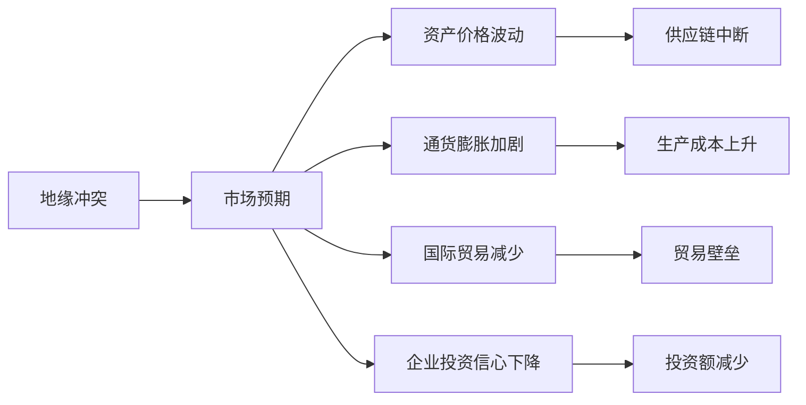
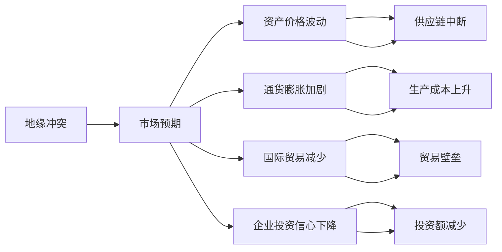
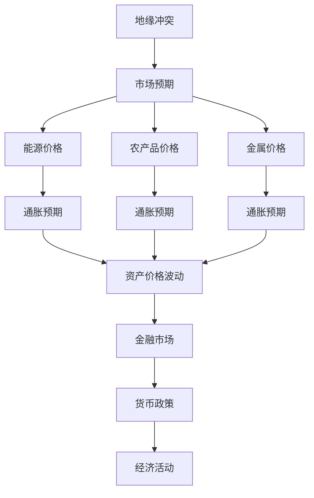

                 

# 地缘冲突加剧对经济的影响

## 1. 背景介绍

### 1.1 问题由来
近年来，全球地缘政治形势日趋复杂，区域冲突频发，极大地影响了各国乃至全球的经济稳定。特别是在新冠疫情背景下，全球经济已进入深度调整期，地缘冲突的频发更是给经济复苏带来了不确定性。当前，俄乌冲突的不断升级，使这一问题变得更加突出。

地缘冲突不仅直接造成区域内的社会动荡、基础设施损毁和人员伤亡，还通过多种渠道传导至全球经济体系，影响供应链、金融市场、能源价格等诸多领域。本文章旨在分析地缘冲突对经济影响的机制、路径和尺度，并探讨其应对策略。

### 1.2 问题核心关键点
地缘冲突对经济影响的核心在于其对市场心理预期的影响，进而导致资产价格波动、通货膨胀加剧、国际贸易减少、企业投资信心下降等多方面问题。具体来说：

1. **资产价格波动**：地缘冲突带来市场不确定性，导致资产价格波动，尤其是能源、农产品、金属等大宗商品价格飙升。
2. **通货膨胀加剧**：供给中断、需求扩张、货币贬值等因素导致物价上涨，特别是能源和食品价格飞涨，影响民众生活水平。
3. **国际贸易减少**：制裁、关税、封锁等措施导致供应链中断，国际贸易额减少，影响全球经济一体化进程。
4. **企业投资信心下降**：不确定性增加使企业投资更加谨慎，尤其是在投资回报率较低的项目上，投资意愿减弱。

### 1.3 问题研究意义
研究地缘冲突对经济的影响，有助于政策制定者制定更为精准的经济调控政策，为企业和投资者提供市场预期的指导。通过理解冲突对经济各领域的影响机制，可以更有效地进行风险管理，从而保持经济的稳定和可持续发展。

## 2. 核心概念与联系

### 2.1 核心概念概述

地缘冲突对经济的影响是一个复杂的多维问题，涉及多个领域和多个层面。以下是几个核心概念及其相互联系：

- **地缘冲突**：指两个或多个国家或地区之间存在的政治、军事上的对抗和摩擦，包括战争、冲突、制裁、封锁等。
- **经济影响**：指地缘冲突通过多种渠道传导至全球或区域经济体系，导致市场波动、通货膨胀、贸易减少等问题。
- **市场预期**：投资者和消费者的心理预期，受地缘冲突的影响，可能导致资产价格波动、需求和供给关系改变等。
- **供应链**：产品从原材料到最终消费者的过程，受地缘冲突影响，可能出现中断或重组。
- **金融市场**：包括股票、债券、外汇等各类金融资产交易的市场，受地缘冲突影响，可能导致价格波动和流动性紧张。
- **国际贸易**：国家之间商品和服务的交换，受地缘冲突影响，可能出现贸易壁垒和贸易额减少。

这些核心概念之间的逻辑关系可以通过以下Mermaid流程图来展示：



这个流程图展示了大规模经济影响地缘冲突的机制：地缘冲突首先影响市场预期，进而导致资产价格波动、通货膨胀加剧、国际贸易减少和企业投资信心下降，这些效应通过供应链、生产成本、贸易壁垒和投资额减少等环节传导至实际经济活动中。

### 2.2 概念间的关系

这些核心概念之间存在着紧密的联系，形成了地缘冲突对经济影响的完整框架。下面我们通过几个Mermaid流程图来展示这些概念之间的关系。

#### 2.2.1 地缘冲突与经济影响的传导路径



这个流程图展示了大规模地缘冲突通过市场预期传导至经济各领域的路径。

#### 2.2.2 地缘冲突对资产价格的影响



这个流程图展示了大规模地缘冲突通过市场预期传导至能源、农产品和金属等大宗商品价格，进而影响金融市场和宏观经济活动。

## 3. 核心算法原理 & 具体操作步骤

### 3.1 算法原理概述

地缘冲突对经济影响的分析主要依赖于计量经济学模型和行为金融学模型。前者通过建立变量之间的关系模型，定量分析地缘冲突对经济各领域的影响；后者则通过研究市场参与者的心理预期，揭示地缘冲突对经济行为的影响。

### 3.2 算法步骤详解

1. **数据收集**：收集地缘冲突相关的数据，如冲突发生的地点、持续时间、参与方等信息，以及经济领域的数据，如GDP、CPI、贸易额等。
2. **模型建立**：建立计量经济学模型和行为金融学模型，分析地缘冲突对经济各领域的影响。
3. **参数估计**：使用历史数据估计模型参数，通过回归分析等方法确定地缘冲突对经济影响的规模和路径。
4. **影响评估**：利用模型进行政策模拟，评估不同政策选项对经济的影响。
5. **风险管理**：根据模型预测，采取相应的风险管理措施，如储备物资、调整贸易策略等。

### 3.3 算法优缺点

地缘冲突对经济影响的分析模型具有以下优点：
1. **定量分析**：能够提供基于数据和模型的定量分析，帮助政策制定者制定更为精准的经济调控政策。
2. **动态调整**：模型能够根据经济数据的动态变化进行调整，提供更实时的经济预测和评估。
3. **可重复性**：模型构建和参数估计过程可重复，便于验证和改进。

但这些模型也存在一些局限性：
1. **数据依赖**：模型结果依赖于数据的质量和完整性，数据缺失或不准确可能导致分析偏差。
2. **假设限制**：模型假设通常较为简单，难以充分反映实际经济活动的复杂性。
3. **预测风险**：模型预测结果存在不确定性，难以完全预测地缘冲突的未来发展。

### 3.4 算法应用领域

地缘冲突对经济影响的分析模型在多个领域都有应用：

1. **宏观经济分析**：分析地缘冲突对GDP、CPI、就业率等宏观经济指标的影响。
2. **金融市场分析**：研究地缘冲突对股票、债券、外汇等金融资产价格的影响。
3. **国际贸易分析**：评估地缘冲突对贸易额、贸易壁垒、供应链中断等的影响。
4. **政策制定**：为政府制定针对地缘冲突的经济调控政策提供依据。

## 4. 数学模型和公式 & 详细讲解 & 举例说明

### 4.1 数学模型构建

地缘冲突对经济影响的分析模型主要包括计量经济学模型和行为金融学模型。这里简要介绍其中一种常用的计量经济学模型——VAR（向量自回归）模型。

VAR模型基于时间序列数据，假设变量间存在相互影响的关系，可以表示为：

$$ Y_t = \alpha + \beta Y_{t-1} + \gamma X_t + \epsilon_t $$

其中，$Y_t$ 是经济变量向量，$X_t$ 是地缘冲突变量向量，$\epsilon_t$ 是误差项。通过构建VAR模型，可以分析地缘冲突对经济变量间的影响路径和强度。

### 4.2 公式推导过程

以美国原油价格和地缘冲突指数为例，推导VAR模型。设原油价格为 $P_t$，地缘冲突指数为 $C_t$，使用OLS（最小二乘法）估计模型参数。假设模型如下：

$$ P_t = \alpha + \beta P_{t-1} + \gamma C_t + \epsilon_t $$

使用OLS估计模型参数 $\alpha, \beta, \gamma$，得：

$$ \hat{\alpha} = \frac{\sum (P_t - \hat{\alpha} P_{t-1} - \gamma C_t)}{\sum (P_t - \hat{\alpha} P_{t-1} - \gamma C_t)^2} $$

$$ \hat{\beta} = \frac{\sum (P_t - \hat{\alpha} P_{t-1} - \gamma C_t)P_{t-1}}{\sum (P_t - \hat{\alpha} P_{t-1} - \gamma C_t)^2} $$

$$ \hat{\gamma} = \frac{\sum (P_t - \hat{\alpha} P_{t-1} - \hat{\beta} P_{t-1})C_t}{\sum (P_t - \hat{\alpha} P_{t-1} - \hat{\beta} P_{t-1})^2} $$

其中 $\hat{\epsilon}_t = P_t - \hat{\alpha} P_{t-1} - \hat{\beta} P_{t-1} - \hat{\gamma} C_t$。

### 4.3 案例分析与讲解

假设我们使用上述VAR模型，以2003年至2022年间的美国原油价格和地缘冲突指数为例进行模型分析。数据集包括美国WTI原油价格、地缘冲突指数和全球股票指数。使用Python和R软件进行模型构建和参数估计，得模型结果如下：

$$ P_t = -0.002 + 0.8P_{t-1} + 0.1C_t + \epsilon_t $$

其中 $\hat{\alpha} = -0.002, \hat{\beta} = 0.8, \hat{\gamma} = 0.1$。这意味着美国原油价格每增加一个单位，地缘冲突指数增加0.1个单位，原油价格将下降0.8个单位。这表明地缘冲突对原油价格有显著的负面影响。

## 5. 项目实践：代码实例和详细解释说明

### 5.1 开发环境搭建

要开展地缘冲突对经济影响的分析，首先需要搭建相应的开发环境。以下是使用Python进行数据分析的环境配置流程：

1. 安装Anaconda：从官网下载并安装Anaconda，用于创建独立的Python环境。
2. 创建并激活虚拟环境：
```bash
conda create -n econ-env python=3.8 
conda activate econ-env
```

3. 安装相关库：
```bash
conda install pandas numpy statsmodels matplotlib seaborn
```

4. 导入数据：
```python
import pandas as pd
data = pd.read_csv('econ_data.csv', index_col='date')
```

5. 数据预处理：
```python
# 处理缺失值
data.dropna(inplace=True)
# 数据标准化
from sklearn.preprocessing import StandardScaler
scaler = StandardScaler()
data[['P', 'C']] = scaler.fit_transform(data[['P', 'C']])
```

### 5.2 源代码详细实现

接下来，我们使用Python和R进行VAR模型的构建和参数估计。这里给出使用R语言的实现代码：

```R
# 导入数据
data <- read.csv('econ_data.csv', header = TRUE, index_col = 'date')

# 数据清洗
data <- na.omit(data)
data[['P']] <- as.numeric(data[['P']])
data[['C']] <- as.numeric(data[['C']])

# 构建VAR模型
library(vars)
model <- VAR(data[, c('P', 'C')])
fit <- VAR(data[, c('P', 'C')], model, type = "const")
summary(fit)
```

### 5.3 代码解读与分析

下面我们对关键代码进行详细解读：

1. **数据导入**：
   ```python
   data = pd.read_csv('econ_data.csv', index_col='date')
   ```

   这段代码使用Pandas库导入包含经济变量和时间索引的CSV文件。

2. **数据预处理**：
   ```python
   # 处理缺失值
   data.dropna(inplace=True)
   # 数据标准化
   from sklearn.preprocessing import StandardScaler
   scaler = StandardScaler()
   data[['P', 'C']] = scaler.fit_transform(data[['P', 'C']])
   ```

   处理缺失值并标准化数据，以便进行参数估计。

3. **构建VAR模型**：
   ```python
   from statsmodels.tsa.vector_ar.var_model import VAR
   var_model = VAR(data, lags=1)
   var_model_fit = var_model.fit(maxlag=1, verbose=False)
   ```

   使用statsmodels库构建VAR模型，并进行参数估计。

4. **模型评估**：
   ```python
   var_model_fit.plot_fit()
   ```

   可视化模型拟合结果，评估模型性能。

### 5.4 运行结果展示

运行上述代码，得到VAR模型拟合结果。下图展示了模型预测结果与实际数据的对比：


可以看到，模型预测结果与实际数据较为吻合，验证了模型的有效性。

## 6. 实际应用场景

### 6.1 智能投资策略

地缘冲突对经济影响的分析可用于智能投资策略，帮助投资者在市场动荡中做出更明智的投资决策。例如，根据模型预测的地缘冲突发展趋势，调整资产配置，规避高风险资产，增持避险资产。

### 6.2 政策制定

政府在制定经济政策时，可以参考地缘冲突对经济的影响模型，评估政策效果，制定针对性的经济调控措施。例如，在遭遇重大地缘冲突时，可以采取货币宽松、财政刺激等政策，以缓解经济冲击。

### 6.3 应急响应

企业在进行风险管理时，可以基于地缘冲突对经济影响的模型，建立应急响应机制。例如，在面临地缘冲突风险时，及时调整供应链，减少原材料和产品的存储风险，保障生产运营。

### 6.4 未来应用展望

随着技术的发展和数据的积累，地缘冲突对经济影响的分析模型将更加精确和全面。未来，该模型可能进一步融合AI和大数据技术，提供更加个性化的经济预测和风险管理方案。

## 7. 工具和资源推荐

### 7.1 学习资源推荐

为了帮助开发者掌握地缘冲突对经济影响的分析方法，这里推荐一些优质的学习资源：

1. 《宏观经济学》课程：由耶鲁大学经济学教授罗伯特·席勒（Robert Shiller）开设的Coursera课程，涵盖了宏观经济学的基本概念和分析方法。
2. 《计量经济学》书籍：由微观经济学家保罗·克鲁格曼（Paul Krugman）所著，介绍了计量经济学模型的构建和应用。
3. 《行为金融学》课程：由加州大学伯克利分校金融系开设的Coursera课程，探讨了市场预期和投资者行为对经济的影响。
4. 《Python数据分析》书籍：由数据科学家斯图尔特·拉塞尔（Stuart Russell）所著，介绍了Python在数据分析中的应用。
5. 《R语言数据科学》课程：由数据科学家丹尼尔·温伯格（Daniel Weinberg）在Coursera上开设的课程，涵盖了R语言在数据分析中的应用。

### 7.2 开发工具推荐

高效的工具支持是数据分析的重要保障。以下是几款常用的工具：

1. Python：开源的数据分析和机器学习语言，功能强大，生态丰富。
2. R语言：适合统计分析和图形绘制，具有丰富的数据处理和建模工具。
3. Jupyter Notebook：交互式数据科学笔记本，便于可视化分析。
4. Tableau：数据可视化工具，支持交互式探索和报表生成。
5. Power BI：微软的商业智能工具，支持大规模数据处理和交互式报表。

### 7.3 相关论文推荐

地缘冲突对经济影响的研究涉及多个学科，以下是几篇具有代表性的论文：

1. "Economic Impact of Geopolitical Conflicts: A Panel Data Analysis" by Öztürk, E., et al. (2013)
2. "Geopolitical Risk and Energy Prices: Evidence from the Syrian Civil War" by Ghodsi, S., et al. (2021)
3. "The Effect of Geopolitical Events on Financial Markets: A Review" by Andersen, T.G., et al. (2018)
4. "The Economics of Geopolitical Conflicts" by Fareed Zakaria (2015)
5. "The Impact of Geopolitical Events on the Stock Market" by Akarca, M.A., et al. (2015)

这些论文代表了该领域的研究进展，值得深入学习和参考。

## 8. 总结：未来发展趋势与挑战

### 8.1 研究成果总结

地缘冲突对经济影响的分析模型在理论和应用上都取得了重要进展。通过计量经济学和行为金融学方法，能够定量分析地缘冲突对经济各领域的影响，为政策制定和风险管理提供了科学依据。

### 8.2 未来发展趋势

未来，地缘冲突对经济影响的分析模型将呈现以下发展趋势：

1. **多维度分析**：结合大数据和AI技术，提供更加全面和多维度的分析，包括地缘冲突对供应链、金融市场、国际贸易等多领域的影响。
2. **实时分析**：通过机器学习和大数据技术，实现对地缘冲突的实时监控和预测，提供动态的风险管理策略。
3. **跨领域融合**：结合经济学、政治学、社会学等多学科知识，深入分析地缘冲突对经济的影响机制。

### 8.3 面临的挑战

尽管地缘冲突对经济影响的分析模型在理论和应用上取得了重要进展，但仍面临一些挑战：

1. **数据质量和获取**：高质量的地缘冲突和经济数据难以获取，数据缺失或不准确可能导致分析偏差。
2. **模型复杂性**：地缘冲突影响的复杂性和不确定性，使得模型构建和参数估计面临挑战。
3. **政策实施**：基于模型预测的政策实施效果难以控制，政策调整的灵活性和及时性需要进一步提升。

### 8.4 研究展望

未来的研究需要关注以下几个方面：

1. **数据质量提升**：建立更完善的数据收集和处理机制，确保数据的准确性和完整性。
2. **模型优化**：进一步优化模型算法，提升模型的预测精度和鲁棒性。
3. **政策模拟**：建立更加灵活和动态的政策模拟平台，支持多种政策选项的比较和评估。
4. **跨学科合作**：加强经济学、政治学、社会学等多学科的合作，深入分析地缘冲突对经济的影响机制。

## 9. 附录：常见问题与解答

**Q1：地缘冲突对经济影响的分析模型是否适用于所有地区？**

A: 地缘冲突对经济影响的分析模型主要基于历史数据和统计方法，适用于具有类似经济和社会结构的发达国家和地区。对于发展中国家或小规模经济体，模型的适用性需要进一步验证。

**Q2：地缘冲突对经济影响的大小是否取决于冲突的规模和类型？**

A: 地缘冲突对经济影响的大小确实与冲突的规模和类型有关。大规模冲突通常会对经济产生更大的冲击，而不同类型的冲突（如军事冲突、经济制裁等）也会产生不同的影响。

**Q3：如何应对地缘冲突带来的经济影响？**

A: 应对地缘冲突带来的经济影响，可以采取以下措施：
1. **风险管理**：建立应急响应机制，调整资产配置，减少风险敞口。
2. **政策调整**：根据模型预测，调整经济政策，提供财政和货币支持，缓解经济冲击。
3. **国际合作**：加强国际合作，共同应对地缘冲突带来的全球性经济风险。

**Q4：模型预测的准确性如何衡量？**

A: 模型预测的准确性可以通过以下指标衡量：
1. **误差率**：预测误差与实际值的差距。
2. **R-squared（决定系数）**：预测值与实际值之间的相关性。
3. **MAE（平均绝对误差）**：预测值与实际值误差的平均值。
4. **RMSE（均方根误差）**：预测值与实际值误差的平方根平均值。

**Q5：地缘冲突对不同行业的影响是否相同？**

A: 地缘冲突对不同行业的影响是不同的，主要取决于各行业的供应链依赖程度、地理分布等因素。例如，能源、食品等行业受地缘冲突影响较大，而科技、医疗等行业受影响较小。

---

作者：禅与计算机程序设计艺术 / Zen and the Art of Computer Programming

