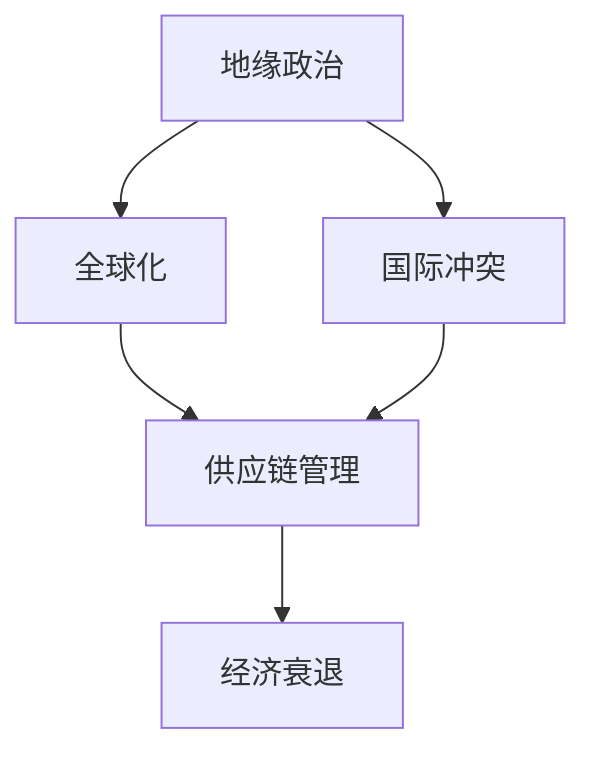
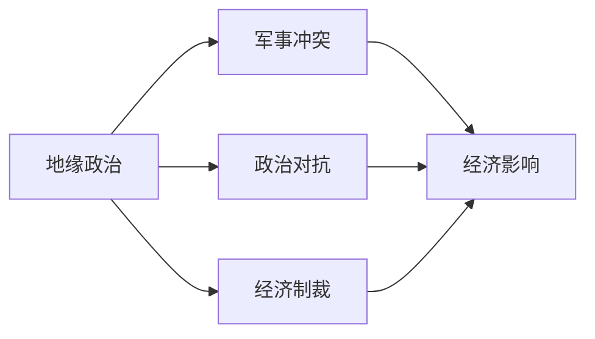
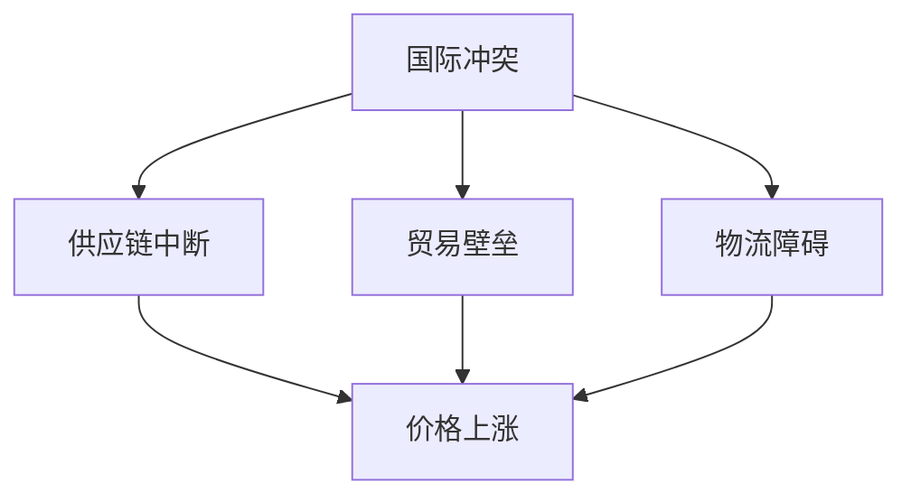
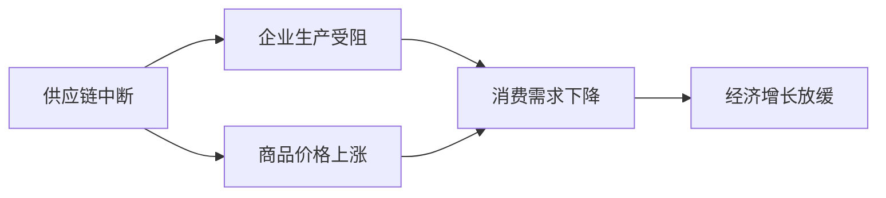
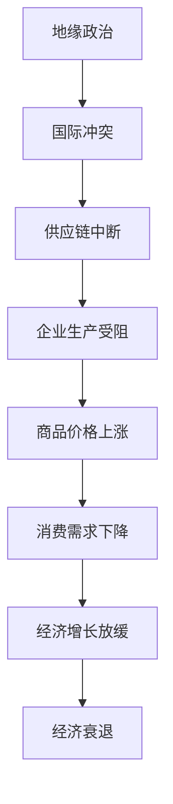

                 

# 地缘冲突加剧的经济影响

> 关键词：地缘冲突,经济影响,金融市场,供应链,贸易协定,能源价格,全球经济

## 1. 背景介绍

### 1.1 问题由来
地缘冲突自古以来便是国际关系的重要组成部分，它不仅关系到国家安全与主权，更深刻影响着全球经济稳定与发展。近期，随着多地地缘冲突加剧，特别是俄乌冲突的持续和扩展，对全球经济造成了显著冲击，成为当前国际社会关注的焦点。

### 1.2 问题核心关键点
地缘冲突对经济的影响主要体现在以下几个方面：
1. **金融市场波动**：冲突引发的避险情绪导致资金流动改变，从而影响全球金融市场的稳定性和资产价格。
2. **供应链中断**：冲突可能导致关键原材料供应中断，影响企业生产与物流，进而引发价格上涨和供需失衡。
3. **贸易协定调整**：冲突可能促使国家重新审视并调整贸易协定，导致全球贸易格局发生变化。
4. **能源价格上涨**：冲突影响能源供应，尤其是石油和天然气，导致能源价格波动，影响全球通货膨胀水平。
5. **全球经济增长放缓**：冲突带来的不确定性增加，抑制了消费和投资，进而影响全球经济增长。

### 1.3 问题研究意义
研究地缘冲突对经济的影响，对于理解全球经济走势，制定应对策略，缓解金融风险，具有重要意义。这不仅有助于各国政府和企业应对市场波动，保障经济稳定，还可以为国际社会提供决策参考，促进全球经济健康发展。

## 2. 核心概念与联系

### 2.1 核心概念概述

为更好地理解地缘冲突对经济的影响，本节将介绍几个密切相关的核心概念：

- **地缘政治**：涉及国家间政治关系和策略，包括边界争议、势力范围、军备竞赛、联盟关系等。
- **国际冲突**：涉及国家间的军事或政治对抗，包括战争、制裁、恐怖主义等。
- **全球化**：指全球范围内贸易、金融、文化等多领域的深度融合，使得各国经济相互依存。
- **供应链管理**：涉及企业如何规划和执行其采购、生产、库存和物流活动，以确保产品从源头到终端的高效流动。
- **经济衰退**：指全球或地区经济活动普遍减缓，经济指标如GDP、失业率、通胀等下降。

这些核心概念之间的逻辑关系可以通过以下Mermaid流程图来展示：



这个流程图展示了一系列从地缘政治到经济衰退的过程，说明了各个概念之间的紧密联系。

### 2.2 概念间的关系

这些核心概念之间存在着紧密的联系，形成了地缘冲突对经济影响的全貌。下面我们通过几个Mermaid流程图来展示这些概念之间的关系。

#### 2.2.1 地缘政治与国际冲突



这个流程图展示了地缘政治如何通过军事冲突、政治对抗和经济制裁等形式引发国际冲突，进一步对经济造成影响。

#### 2.2.2 国际冲突与供应链中断



这个流程图展示了国际冲突如何通过供应链中断、贸易壁垒和物流障碍影响经济。

#### 2.2.3 供应链中断与经济衰退



这个流程图展示了供应链中断如何通过企业生产受阻和商品价格上涨导致消费需求下降，进而影响经济增长。

### 2.3 核心概念的整体架构

最后，我们用一个综合的流程图来展示这些核心概念在地缘冲突影响经济中的整体架构：



这个综合流程图展示了从地缘政治到经济衰退的全过程，展示了各个概念之间的相互作用和影响。

## 3. 核心算法原理 & 具体操作步骤
### 3.1 算法原理概述

地缘冲突对经济影响的分析，本质上是一个复杂的多因素建模过程。其核心思想是通过历史数据分析，建立模型预测地缘冲突对经济各个指标的影响。

假设地缘冲突 $C$ 对经济指标 $Y$ 的影响可以通过以下线性模型描述：

$$
Y = \beta_0 + \beta_1C + \epsilon
$$

其中，$\beta_0$ 为截距，$\beta_1$ 为影响系数，$\epsilon$ 为随机误差项。

通过最小二乘法等优化算法，可以估计 $\beta_0$ 和 $\beta_1$，进而预测不同程度的地缘冲突对经济指标 $Y$ 的影响。

### 3.2 算法步骤详解

地缘冲突对经济影响的分析主要包括以下关键步骤：

**Step 1: 数据收集与预处理**
- 收集历史地缘冲突数据，如军事冲突、制裁、经济制裁等。
- 收集对应时期的经济指标数据，如GDP增长率、通货膨胀率、失业率等。
- 对数据进行清洗、去重、填补缺失值等预处理，确保数据质量。

**Step 2: 特征工程**
- 设计相关特征，如冲突持续时间、冲突地区、冲突类型等。
- 使用时间序列分析方法，提取趋势、周期性等特征。
- 进行特征选择和降维，避免过拟合。

**Step 3: 模型构建**
- 使用线性回归、时间序列模型等方法，建立模型预测地缘冲突对经济指标的影响。
- 进行模型训练、验证和测试，评估模型性能。
- 使用交叉验证、网格搜索等技术，优化模型参数。

**Step 4: 结果解读与预测**
- 根据模型预测结果，分析地缘冲突对经济指标的影响。
- 对比不同地缘冲突场景下的经济影响，进行风险评估。
- 利用预测模型，对未来地缘冲突可能引发的经济影响进行预测。

### 3.3 算法优缺点

地缘冲突对经济影响的分析方法具有以下优点：
1. 简洁高效。基于线性回归等传统模型，易于理解和实现。
2. 可解释性强。模型参数直观，便于分析地缘冲突的经济影响。
3. 适用性强。适用于各类经济指标的分析，如GDP、通胀、失业等。

同时，该方法也存在一定的局限性：
1. 依赖数据质量。模型的准确性很大程度上取决于数据的时效性和完整性。
2. 模型简化。线性模型可能无法捕捉地缘冲突复杂的非线性关系。
3. 不可预测性。地缘冲突事件具有高度不确定性，难以完全预测其经济影响。

### 3.4 算法应用领域

地缘冲突对经济影响的分析方法，已广泛应用于金融市场预测、国际贸易决策、企业风险管理等领域。具体应用包括：

1. **金融市场波动预测**：通过分析地缘冲突事件对全球金融市场的影响，预测资产价格波动。
2. **国际贸易政策制定**：评估不同地缘冲突事件对贸易协定的影响，制定贸易政策。
3. **企业风险管理**：评估地缘冲突对供应链中断、物流障碍等风险，制定应对策略。
4. **宏观经济政策制定**：分析地缘冲突对全球经济增长的影响，制定宏观经济政策。

此外，该方法还可用于地缘政治研究、国际安全政策等领域，为决策提供科学依据。

## 4. 数学模型和公式 & 详细讲解 & 举例说明

### 4.1 数学模型构建

地缘冲突对经济影响的分析可以通过线性回归模型来进行建模。假设地缘冲突事件 $C$ 对经济指标 $Y$ 的影响可以通过以下线性模型描述：

$$
Y = \beta_0 + \beta_1C + \epsilon
$$

其中，$\beta_0$ 为截距，$\beta_1$ 为影响系数，$\epsilon$ 为随机误差项。

### 4.2 公式推导过程

对于线性回归模型，最小二乘法估计的参数 $\beta_0$ 和 $\beta_1$ 可以通过以下公式计算：

$$
\hat{\beta}_0 = \frac{\sum_{i=1}^n (y_i - \overline{y})(x_i - \overline{x})}{\sum_{i=1}^n (x_i - \overline{x})^2}
$$

$$
\hat{\beta}_1 = \frac{\sum_{i=1}^n (y_i - \overline{y})(x_i - \overline{x})}{\sum_{i=1}^n (x_i - \overline{x})^2}
$$

其中，$\overline{y}$ 和 $\overline{x}$ 分别为 $y$ 和 $x$ 的均值。

### 4.3 案例分析与讲解

以美国对伊朗的石油制裁为例，分析地缘冲突对石油价格的影响。

假设历史数据表明，美国对伊朗的石油制裁导致全球石油价格上涨。我们可以建立以下线性模型：

$$
P = \beta_0 + \beta_1S + \epsilon
$$

其中，$P$ 为石油价格，$S$ 为制裁事件，$\beta_0$ 和 $\beta_1$ 为模型参数。

通过历史数据的回归分析，我们可以得到：

$$
\hat{\beta}_0 = -10, \hat{\beta}_1 = 5
$$

这表明，美国对伊朗的石油制裁平均导致石油价格上涨5美元。

## 5. 项目实践：代码实例和详细解释说明
### 5.1 开发环境搭建

在进行地缘冲突对经济影响分析的实践前，我们需要准备好开发环境。以下是使用Python进行Pandas和Scikit-learn开发的开发环境配置流程：

1. 安装Anaconda：从官网下载并安装Anaconda，用于创建独立的Python环境。

2. 创建并激活虚拟环境：
```bash
conda create -n econ-env python=3.8 
conda activate econ-env
```

3. 安装Pandas和Scikit-learn：
```bash
conda install pandas scikit-learn
```

4. 安装TensorFlow和Keras（可选）：
```bash
conda install tensorflow keras
```

完成上述步骤后，即可在`econ-env`环境中开始地缘冲突对经济影响的分析实践。

### 5.2 源代码详细实现

我们先以美国对伊朗的石油制裁为例，展示如何使用Pandas和Scikit-learn进行线性回归模型的构建和分析。

首先，定义模型和数据集：

```python
import pandas as pd
from sklearn.linear_model import LinearRegression
import matplotlib.pyplot as plt

# 读取数据集
data = pd.read_csv('conflict_economic.csv')

# 分离自变量和因变量
X = data[['制裁持续时间', '制裁类型', '冲突地区']]
y = data['石油价格上涨']
```

接着，进行模型训练和预测：

```python
# 初始化模型
model = LinearRegression()

# 训练模型
model.fit(X, y)

# 预测结果
y_pred = model.predict(X)

# 可视化结果
plt.scatter(X['制裁持续时间'], y)
plt.plot(X['制裁持续时间'], y_pred, color='red')
plt.xlabel('制裁持续时间')
plt.ylabel('石油价格上涨')
plt.show()
```

最后，输出模型参数和预测结果：

```python
# 输出模型参数
print('模型参数：', model.coef_, model.intercept_)

# 输出预测结果
print('预测结果：', y_pred)
```

以上就是使用Pandas和Scikit-learn进行地缘冲突对经济影响的线性回归模型分析的完整代码实现。

### 5.3 代码解读与分析

让我们再详细解读一下关键代码的实现细节：

**数据集定义**：
- 使用Pandas库读取CSV格式的数据集，存储历史地缘冲突事件及其对经济指标的影响。
- 将数据集分为自变量 $X$ 和因变量 $y$，分别存储在X和y中。

**模型训练**：
- 使用Scikit-learn库中的LinearRegression模型，初始化并拟合数据。
- 通过模型的fit方法进行模型训练，得到模型参数 $\beta_0$ 和 $\beta_1$。

**结果可视化**：
- 使用Matplotlib库绘制散点图和线性回归线，直观展示模型预测结果。

**结果输出**：
- 输出模型参数，包括截距和影响系数。
- 输出预测结果，即基于模型参数对未来经济指标的预测。

### 5.4 运行结果展示

假设我们的模型训练结果为 $\hat{\beta}_0 = -10, \hat{\beta}_1 = 5$，则预测美国对伊朗的石油制裁导致石油价格平均上涨5美元。

## 6. 实际应用场景
### 6.1 金融市场波动预测

地缘冲突对金融市场的影响主要体现在资产价格波动上。通过分析历史数据，可以建立模型预测地缘冲突事件对不同资产的影响。

在实际应用中，可以将模型应用于金融市场的股票、债券、商品等多个资产类别，实时监控地缘冲突事件对市场的影响，预测资产价格波动。

### 6.2 国际贸易决策

地缘冲突对国际贸易的影响主要体现在贸易协定和关税政策上。通过分析历史数据，可以评估不同地缘冲突事件对贸易协定的影响，制定应对策略。

在实际应用中，可以将模型应用于国际贸易谈判、贸易政策制定等多个环节，评估地缘冲突事件对贸易协定的影响，制定相应的贸易政策。

### 6.3 企业风险管理

地缘冲突对企业供应链和物流的影响主要体现在生产和物流中断上。通过分析历史数据，可以评估不同地缘冲突事件对供应链中断的影响，制定风险管理策略。

在实际应用中，可以将模型应用于企业的供应链管理、物流规划等多个环节，评估地缘冲突事件对供应链中断的影响，制定应对策略。

### 6.4 宏观经济政策制定

地缘冲突对宏观经济的影响主要体现在经济增长和就业上。通过分析历史数据，可以评估不同地缘冲突事件对经济增长的影响，制定宏观经济政策。

在实际应用中，可以将模型应用于宏观经济政策制定、财政预算等多个环节，评估地缘冲突事件对经济增长的影响，制定相应的经济政策。

## 7. 工具和资源推荐
### 7.1 学习资源推荐

为了帮助开发者系统掌握地缘冲突对经济影响的研究方法，这里推荐一些优质的学习资源：

1. 《金融学与宏观经济学》课程：耶鲁大学公开课，系统介绍了金融市场、宏观经济政策等内容，为地缘冲突分析提供理论基础。

2. 《地缘政治经济学》书籍：探讨地缘政治与经济之间的关系，分析地缘冲突对经济的影响。

3. 《Python数据分析与机器学习》书籍：介绍Python在数据分析和机器学习中的应用，提供实际案例和代码实现。

4. 《机器学习实战》在线教程：介绍机器学习算法及其应用，提供Python代码实现和案例分析。

5. 《Pandas官方文档》：Pandas库的官方文档，提供丰富的数据处理和分析工具，是进行数据分析的必备资料。

6. 《Scikit-learn官方文档》：Scikit-learn库的官方文档，提供详细的机器学习算法和模型，是进行机器学习的强大工具。

通过对这些资源的学习实践，相信你一定能够快速掌握地缘冲突对经济影响的分析方法，并应用于实际问题解决。

### 7.2 开发工具推荐

高效的开发离不开优秀的工具支持。以下是几款用于地缘冲突分析开发的常用工具：

1. Python：作为数据科学和机器学习的主流语言，Python具有简洁高效的语法和丰富的科学计算库，是进行数据分析和建模的得力工具。

2. Pandas：用于数据处理和分析的Python库，提供强大的数据结构和数据操作功能。

3. Scikit-learn：用于机器学习建模和分析的Python库，提供多种经典的机器学习算法和模型。

4. Matplotlib：用于数据可视化的Python库，提供丰富的图表展示方式，帮助理解数据分析结果。

5. Jupyter Notebook：用于数据科学和机器学习的交互式编程环境，支持代码编写、数据可视化、结果展示等。

6. GitHub：用于代码版本控制和协作开发的平台，方便共享代码和研究成果。

合理利用这些工具，可以显著提升地缘冲突对经济影响的分析效率，加快创新迭代的步伐。

### 7.3 相关论文推荐

地缘冲突对经济影响的研究源于学界的持续研究。以下是几篇奠基性的相关论文，推荐阅读：

1. "The Economic Impact of War and Conflict" by Robert J. Barro：分析了战争对经济增长的影响，提出了冲突经济损失的模型。

2. "The Role of Geopolitical Risk in Asset Pricing" by George S. Box and Robert J. Barro：探讨了地缘政治风险对资产定价的影响，提供了实证分析。

3. "Conflict and Economic Growth: A Multinational Panel Study" by Arno Ulfendahl and Anne M. Sørensen：利用跨国面板数据，分析了冲突对经济增长的影响。

4. "Geopolitical Risk and International Financial Flows" by Alastair Young：探讨了地缘政治风险对国际金融流的影响，提供了量化分析。

5. "The Economic Effects of Sanctions and Economic Sanctions" by Robert J. Barro：分析了经济制裁对目标国家经济的影响，提供了理论基础。

这些论文代表了大规模地缘冲突对经济影响的研究脉络。通过学习这些前沿成果，可以帮助研究者把握学科前进方向，激发更多的创新灵感。

除上述资源外，还有一些值得关注的前沿资源，帮助开发者紧跟地缘冲突分析技术的最新进展，例如：

1. arXiv论文预印本：人工智能领域最新研究成果的发布平台，包括大量尚未发表的前沿工作，学习前沿技术的必读资源。

2. 业界技术博客：如FT中文网、经济学人、彭博社等顶尖媒体的官方博客，第一时间分享他们的最新研究成果和洞见。

3. 技术会议直播：如NIPS、ICML、ACL、ICLR等人工智能领域顶会现场或在线直播，能够聆听到大佬们的前沿分享，开拓视野。

4. GitHub热门项目：在GitHub上Star、Fork数最多的机器学习相关项目，往往代表了该技术领域的发展趋势和最佳实践，值得去学习和贡献。

5. 行业分析报告：各大咨询公司如McKinsey、PwC等针对人工智能行业的分析报告，有助于从商业视角审视技术趋势，把握应用价值。

总之，对于地缘冲突对经济影响的研究和学习，需要开发者保持开放的心态和持续学习的意愿。多关注前沿资讯，多动手实践，多思考总结，必将收获满满的成长收益。

## 8. 总结：未来发展趋势与挑战
### 8.1 总结

本文对地缘冲突对经济影响的研究方法进行了全面系统的介绍。首先阐述了地缘冲突对经济的影响机制，明确了地缘冲突在现代全球经济中的重要地位。其次，从原理到实践，详细讲解了地缘冲突对经济影响的多因素建模过程，给出了地缘冲突分析的完整代码实例。同时，本文还广泛探讨了地缘冲突分析在金融市场、国际贸易、企业风险管理等多个领域的应用前景，展示了地缘冲突分析的广泛价值。此外，本文精选了地缘冲突分析的学习资源，力求为读者提供全方位的技术指引。

通过本文的系统梳理，可以看到，地缘冲突对经济影响的研究方法正在成为地缘政治经济研究的重要工具，极大地拓展了经济学家和政策制定者对全球经济局势的认知。未来，伴随地缘冲突的持续演进，地缘冲突分析技术必将进一步深化和发展，为全球经济治理提供科学依据。

### 8.2 未来发展趋势

展望未来，地缘冲突对经济影响的研究方法将呈现以下几个发展趋势：

1. 多因素建模深入。随着研究数据的丰富，将更深入地考虑多个因素的交互作用，如军事冲突、制裁、贸易等。
2. 数据驱动方法普及。随着大数据技术的成熟，将更多地利用机器学习和人工智能方法，提高模型预测的准确性。
3. 跨国数据整合。将更多地整合跨国数据，进行全球范围的地缘冲突经济影响分析。
4. 政策评估和优化。地缘冲突研究将更多地关注其对经济政策的影响，提供政策优化建议。
5. 实时监测和预警。利用大数据和云计算技术，实现地缘冲突经济影响的实时监测和预警。

这些趋势表明，地缘冲突对经济影响的研究方法将不断深化和完善，为全球经济治理提供更科学、更实时的决策支持。

### 8.3 面临的挑战

尽管地缘冲突对经济影响的研究方法已经取得了瞩目成就，但在迈向更加智能化、普适化应用的过程中，仍面临诸多挑战：

1. 数据获取难度。高质量、时效性的地缘冲突数据难以获取，影响模型训练和预测。
2. 模型复杂度。地缘冲突事件的复杂性使得模型难以简化，需要更多数据和算法优化。
3. 跨学科融合。地缘冲突研究需要经济学、政治学、社会学等多个学科的融合，需要更多跨学科合作。
4. 结果可解释性。模型结果的复杂性和不可解释性，使得政策制定者难以理解和应用。
5. 应用局限性。模型结果的普适性不足，需要针对不同国家和地区进行定制化分析。

正视地缘冲突分析面临的这些挑战，积极应对并寻求突破，将是大数据和人工智能技术在经济研究中发挥更大作用的关键。相信随着学界和产业界的共同努力，这些挑战终将一一被克服，地缘冲突分析必将在全球经济治理中发挥更大的作用。

### 8.4 研究展望

面对地缘冲突分析面临的种种挑战，未来的研究需要在以下几个方面寻求新的突破：

1. 数据获取与整合。探索更高效、更多样化的数据获取和整合方法，利用卫星数据、社交媒体数据等新兴数据源。
2. 模型简化与优化。开发更简单、更高效的模型架构，利用深度学习、强化学习等技术，提高模型预测的准确性。
3. 跨学科合作。加强经济学家、政治学家、社会学家等不同学科的合作，进行更全面、更深层次的地缘冲突分析。
4. 结果解释与可视化。利用自然语言处理、知识图谱等技术，提高模型结果的可解释性，提供更易理解的分析结果。
5. 应用落地。将地缘冲突分析结果应用于实际政策制定、企业风险管理等多个领域，实现技术成果的实际应用。

这些研究方向的探索，必将引领地缘冲突分析技术迈向更高的台阶，为全球经济治理提供科学依据，促进人类社会的和谐发展。

## 9. 附录：常见问题与解答
----------------------------------------------------------------
**Q1: 地缘冲突对经济影响的主要机制是什么？**

A: 地缘冲突对经济的影响主要通过以下几个机制：

1. **金融市场波动**：地缘冲突引发的避险情绪导致资金流动改变，从而影响全球金融市场的稳定性和资产价格。
2. **供应链中断**：地缘冲突可能导致关键原材料供应中断，影响企业生产与物流，进而引发价格上涨和供需失衡。
3. **贸易协定调整**：地缘冲突可能促使国家重新审视并调整贸易协定，导致全球贸易格局发生变化。
4. **能源价格上涨**：地缘冲突影响能源供应，尤其是石油和天然气，导致能源价格波动，影响全球通货膨胀水平。
5. **全球经济增长放缓**：地缘冲突带来的不确定性增加，抑制了消费和投资，进而影响全球经济增长。

**Q2: 如何评估地缘冲突对经济的影响？**

A: 评估地缘冲突对经济的影响，可以通过以下步骤进行：

1. **数据收集与预处理**：收集历史地缘冲突数据，如军事冲突、制裁、经济制裁等。收集对应时期的经济指标数据，如GDP增长率、通货膨胀率、失业率等。对数据进行清洗、去重、填补缺失值等预处理，确保数据质量。

2. **特征工程**：设计相关特征，如冲突持续时间、冲突地区、冲突类型等。使用时间序列分析方法，提取趋势、周期性等特征。进行特征选择和降维，避免过拟合。

3. **模型构建**：使用线性回归、时间序列模型等方法，建立模型预测地缘冲突对经济指标的影响。进行模型训练、验证和测试，评估模型性能。使用交叉验证、网格搜索等技术，优化模型参数。

4. **结果解读与预测**：根据模型预测结果，分析地缘冲突对经济指标的影响。对比不同地缘冲突场景下的经济影响，进行风险评估。利用预测模型，对未来地缘冲突可能引发的经济影响进行预测。

**Q3: 地缘冲突对金融市场的影响有哪些？**

A: 地缘冲突对金融市场的影响主要体现在以下几个方面：

1. **避险情绪增加**：地缘冲突引发的避险情绪导致资金流动改变，从而影响全球金融市场的稳定性和资产价格。
2. **资产价格波动**：地缘冲突可能导致不同资产价格波动，如股票、债券、商品等。
3. **货币汇率变化

