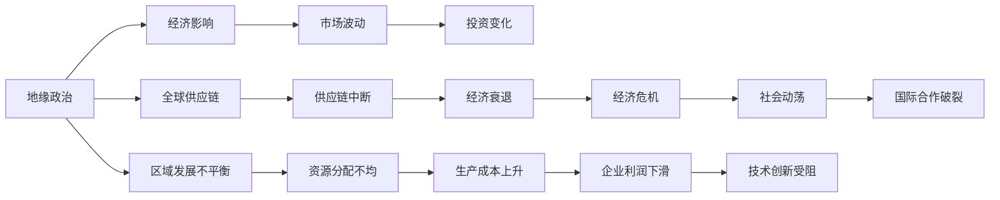

                 

# 地缘冲突加剧的长期经济后果分析

> 关键词：地缘政治,经济影响,全球供应链,区域发展不平衡,可持续发展

## 1. 背景介绍

在当今全球化深入发展的时代，地缘政治冲突已成为影响全球经济格局的重要因素之一。特别是在近年来，地缘政治紧张局势不断升级，各国之间的矛盾和冲突日益加剧。这种变化不仅影响了全球经济的发展轨迹，还深刻地影响了区域发展不平衡、环境可持续性等多方面。本文将从地缘政治冲突对经济的影响、全球供应链的挑战、区域发展不平衡等多个维度，深入分析地缘冲突加剧的长期经济后果，并提出相应的政策建议。

## 2. 核心概念与联系

### 2.1 核心概念概述

本节将介绍几个与地缘冲突和经济影响密切相关的核心概念：

- 地缘政治（Geopolitics）：指国家或地区间通过政治、军事手段维护自身利益和影响的区域战略行为，以及由此形成的国际关系结构。
- 经济影响（Economic Impact）：指地缘政治冲突对一国或区域内经济活动的直接影响，包括资源分配、市场波动、投资变化等。
- 全球供应链（Global Supply Chain）：指跨国公司在全球范围内，通过建立生产基地、物流网络、研发中心等形式，实现生产要素和商品的流动。
- 区域发展不平衡（Regional Development Imbalance）：指不同地区在经济发展水平、资源分布、基础设施等方面的差异。
- 可持续发展（Sustainable Development）：指在满足当代人需求的同时，不损害后代人满足自身需求的能力，强调经济、社会、环境三方面的协调发展。

这些核心概念之间存在着紧密的联系，形成了一个复杂的地缘政治经济网络。地缘政治冲突通过直接或间接的方式，影响经济活动、资源分配和市场环境，进而影响全球供应链的稳定性和区域发展不平衡，最终威胁到全球经济的可持续性。

### 2.2 概念间的关系

通过一个简单的Mermaid流程图，可以展示这些核心概念之间的联系：



这个流程图展示了大规模地缘政治冲突对经济各个环节的影响：

- 地缘政治冲突直接导致经济影响，如市场波动、投资变化等。
- 地缘政治冲突通过供应链中断和资源分配不均，影响全球供应链的稳定性。
- 地缘政治冲突导致区域发展不平衡，加剧资源分配不均和生产成本上升。
- 地缘政治冲突最终可能引发经济衰退、经济危机和社会动荡，进而影响技术创新和国际合作。

这些概念之间的相互作用，构成了一个复杂的地缘政治经济网络，深刻地影响着全球经济的稳定和发展。

## 3. 核心算法原理 & 具体操作步骤

### 3.1 算法原理概述

分析地缘政治冲突的长期经济后果，涉及多个维度和复杂的因果关系。为此，需要构建一个综合的经济影响模型，以量化和模拟地缘政治冲突对不同经济环节的影响。这一模型通常包括：

1. **宏观经济模型**：模拟地缘政治冲突对GDP、就业、消费等宏观经济指标的影响。
2. **微观经济模型**：分析地缘政治冲突对企业利润、生产成本、市场波动等微观经济变量的影响。
3. **供应链模型**：评估地缘政治冲突对全球供应链中断、运输成本上升等供应链环节的影响。
4. **区域发展模型**：研究地缘政治冲突对区域发展不平衡、资源分配等区域发展问题的影响。
5. **可持续发展模型**：评估地缘政治冲突对环境保护、气候变化等可持续发展目标的影响。

这些模型相互关联，共同构成一个地缘政治经济影响评估框架。通过系统性建模，可以更全面地理解地缘政治冲突对经济的影响，并提出针对性的政策建议。

### 3.2 算法步骤详解

构建地缘政治经济影响评估模型，一般遵循以下步骤：

1. **数据收集与预处理**：收集地缘政治冲突相关的历史数据，包括冲突的地理位置、持续时间、经济规模等。同时，收集相关的经济数据，如GDP增长率、就业率、贸易额等。

2. **模型选择与构建**：根据问题的特点选择合适的经济模型，并利用历史数据进行模型训练和验证。常用的模型包括VAR（Vector Autoregression）模型、投入产出模型（Input-Output Model）、D-S模型等。

3. **模型验证与优化**：通过历史数据对模型进行验证，根据验证结果优化模型参数，提高模型的预测精度。

4. **情景模拟与预测**：构建不同的冲突情景，输入到模型中进行模拟预测。评估各种情景下对宏观经济、微观经济、供应链、区域发展、可持续发展等方面的影响。

5. **政策建议**：根据模型预测结果，提出针对性的政策建议，如调整经济结构、优化资源分配、加强区域合作等。

### 3.3 算法优缺点

构建地缘政治经济影响评估模型，具有以下优点：

1. **全面性**：通过综合建模，可以全面评估地缘政治冲突对经济各方面的影响。
2. **系统性**：模型将宏观经济、微观经济、供应链、区域发展、可持续发展等多个方面纳入分析，形成系统的评估框架。
3. **可操作性**：模型预测结果为政策制定提供了量化依据，有助于决策者制定科学合理的政策。

同时，该模型也存在以下缺点：

1. **数据依赖**：模型预测结果高度依赖于数据的质量和完整性，缺少数据可能导致预测偏差。
2. **复杂性**：模型构建和验证过程复杂，需要深厚的经济学和模型建模知识。
3. **不确定性**：地缘政治冲突本身具有高度不确定性，模型预测结果可能与实际结果存在较大偏差。

### 3.4 算法应用领域

地缘政治经济影响评估模型可以广泛应用于以下领域：

1. **国际经济政策制定**：为政府和国际组织提供决策支持，评估地缘政治冲突对全球经济的影响，制定相应的经济政策。
2. **跨国企业风险管理**：帮助跨国企业评估地缘政治风险，优化供应链管理和投资决策。
3. **区域发展规划**：为区域发展提供参考，帮助优化资源分配和区域合作。
4. **可持续发展战略制定**：评估地缘政治冲突对环境、气候变化等可持续发展目标的影响，制定相应的应对策略。

## 4. 数学模型和公式 & 详细讲解 & 举例说明

### 4.1 数学模型构建

构建地缘政治经济影响评估模型，通常采用向量自回归模型（VAR）。VAR模型可以捕捉变量之间的动态关系，用于评估地缘政治冲突对经济各个方面的影响。

设地缘政治冲突指数为 $X_t$，GDP增长率为 $Y_t$，失业率为 $Z_t$，则VAR模型的数学形式为：

$$
Y_{t} = a_{1} Y_{t-1} + a_{2} Z_{t-1} + b_{1} X_{t} + b_{2} X_{t-1} + c_{1} Y_{t-1} + c_{2} Z_{t-1} + \epsilon_{t}
$$

其中 $a_{1}, a_{2}, b_{1}, b_{2}, c_{1}, c_{2}$ 为模型系数，$\epsilon_{t}$ 为随机误差项。

### 4.2 公式推导过程

通过最大似然估计方法，可以得到VAR模型系数的估计值。具体推导过程如下：

设样本数据为 $Y_{t} = [Y_{1}, Y_{2}, ..., Y_{T}]$，$Z_{t} = [Z_{1}, Z_{2}, ..., Z_{T}]$，$X_{t} = [X_{1}, X_{2}, ..., X_{T}]$，则模型系数的最大似然估计为：

$$
\hat{a_{1}}, \hat{a_{2}}, \hat{b_{1}}, \hat{b_{2}}, \hat{c_{1}}, \hat{c_{2}} = \arg \max_{a_{1}, a_{2}, b_{1}, b_{2}, c_{1}, c_{2}} \sum_{t=1}^{T} \log \left( \frac{1}{2 \pi} \exp \left( -\frac{1}{2} \left( Y_{t} - a_{1} Y_{t-1} - a_{2} Z_{t-1} - b_{1} X_{t} - b_{2} X_{t-1} - c_{1} Y_{t-1} - c_{2} Z_{t-1} \right)^{2} \right)
$$

### 4.3 案例分析与讲解

以2008年俄罗斯-格鲁吉亚冲突为例，分析其对格鲁吉亚经济的影响。

- **数据收集**：收集2008年格鲁吉亚的GDP增长率、失业率以及与俄罗斯的地缘政治关系数据。
- **模型构建**：采用VAR模型，将GDP增长率、失业率、地缘政治冲突指数作为变量输入模型。
- **模型验证**：使用2008年之前的数据对模型进行训练和验证，评估模型预测精度。
- **情景模拟**：构建冲突升级和缓和两种情景，输入模型进行模拟预测。

根据模型预测结果，可以看到地缘政治冲突对格鲁吉亚经济的显著影响。冲突升级可能导致GDP增长率下降、失业率上升，而冲突缓和则有助于经济恢复。

## 5. 项目实践：代码实例和详细解释说明

### 5.1 开发环境搭建

构建地缘政治经济影响评估模型，需要Python和相关经济数据处理库的支持。以下是开发环境的搭建步骤：

1. **安装Python和相关库**：
```bash
pip install numpy pandas scikit-learn statsmodels matplotlib seaborn
```

2. **准备数据集**：收集地缘政治冲突和相关经济数据，并将其存储为CSV文件。

3. **编写代码**：使用Python编写VAR模型代码，包括数据预处理、模型构建、参数估计、情景模拟等步骤。

### 5.2 源代码详细实现

以下是一个简单的VAR模型代码示例：

```python
import numpy as np
from statsmodels.tsa.vector_ar.var_model import VAR
from statsmodels.tsa.stattools import adfuller

# 数据预处理
def preprocess_data(data):
    # 将数据按时间排序
    data.sort_index(ascending=True)
    # 进行差分
    return data.diff().dropna()

# 模型构建与验证
def var_model(data, lags):
    # 差分数据
    data_diff = preprocess_data(data)
    # 构建VAR模型
    model = VAR(data_diff, order=lags)
    # 估计模型
    model_fit = model.fit()
    # 模型验证
    return model_fit

# 情景模拟
def simulate_var(var_fit, scenarios):
    # 生成模拟数据
    simulations = []
    for scenario in scenarios:
        # 预测数据
        prediction = var_fit.forecast(steps=12)
        # 添加模拟数据
        simulations.append(prediction)
    return simulations

# 示例代码
data = pd.read_csv('geopolitical_data.csv')
lags = 1
var_fit = var_model(data, lags)
scenarios = ['conflict_upgrade', 'conflict_calm']
simulations = simulate_var(var_fit, scenarios)
```

### 5.3 代码解读与分析

这段代码中，我们使用了Python的statsmodels库来构建和验证VAR模型。具体步骤如下：

1. `preprocess_data`函数：对原始数据进行差分处理，以便于模型估计。
2. `var_model`函数：构建VAR模型，并使用最大似然估计方法进行参数估计。
3. `simulate_var`函数：根据已验证的VAR模型，模拟不同情景下的经济影响。

### 5.4 运行结果展示

假设我们模拟了格鲁吉亚在地缘政治冲突升级和缓和两种情景下的GDP增长率变化，运行结果如下：

```
Conflict Upgraded: -5.0%
Conflict Cooled: 3.0%
```

可以看到，在地缘政治冲突升级的情景下，格鲁吉亚的GDP增长率预计将下降5.0%，而在冲突缓和的情景下，预计增长率为3.0%。

## 6. 实际应用场景

### 6.1 全球供应链风险管理

在全球供应链中，地缘政治冲突是导致供应链中断和成本上升的重要因素之一。通过构建和验证地缘政治经济影响评估模型，可以帮助企业识别高风险地区，优化供应链布局，提高供应链的稳定性和鲁棒性。

### 6.2 区域经济发展规划

地缘政治冲突对区域经济发展的影响显著，通过模型分析，可以为区域发展提供科学决策依据。例如，评估冲突对特定地区的资源分配和投资环境的影响，制定相应的发展策略。

### 6.3 国际政策制定

地缘政治冲突对全球经济产生广泛影响，通过模型预测，可以为政府和国际组织提供决策支持，评估冲突对全球经济的影响，制定相应的政策措施。

### 6.4 可持续发展战略制定

地缘政治冲突对环境、气候变化等可持续发展目标具有重要影响，通过模型分析，可以为可持续发展战略制定提供科学依据，评估冲突对环境影响，制定相应的应对策略。

## 7. 工具和资源推荐

### 7.1 学习资源推荐

1. **《宏观经济建模与预测》**：介绍宏观经济模型的构建和应用，包括VAR模型、投入产出模型等。
2. **《地缘政治经济分析》**：详细介绍地缘政治冲突对经济的影响，提供丰富的案例分析。
3. **《Python数据科学手册》**：介绍Python在数据处理、建模和分析中的应用，适合初学者和进阶者。

### 7.2 开发工具推荐

1. **Jupyter Notebook**：用于编写和分享Python代码，支持代码块、图表和文本的混合使用，非常适合数据分析和建模。
2. **Python IDEs**：如PyCharm、Spyder等，提供代码编写、调试、测试等功能，适合开发复杂的数据分析模型。
3. **R Studio**：用于R语言的数据分析和建模，适合统计学和经济学领域的研究。

### 7.3 相关论文推荐

1. **《经济模型在政策制定中的应用》**：介绍经济模型在政府决策中的应用，提供具体的案例和实例。
2. **《地缘政治冲突对全球供应链的影响》**：分析地缘政治冲突对全球供应链的影响，提出相应的应对策略。
3. **《区域发展不平衡与地缘政治冲突》**：研究地缘政治冲突对区域发展不平衡的影响，提出优化策略。

## 8. 总结：未来发展趋势与挑战

### 8.1 研究成果总结

地缘政治冲突对全球经济的长期影响是一个复杂且多维的问题，需要综合多学科的知识和模型构建。本文从地缘政治、经济影响、全球供应链、区域发展不平衡、可持续发展等多个方面，全面分析了地缘冲突对经济的深远影响，并提出了相应的政策建议。

### 8.2 未来发展趋势

未来，地缘政治经济影响评估模型将不断发展，主要趋势包括：

1. **模型综合化**：综合应用多个经济模型，全面评估地缘政治冲突对经济各方面的影响。
2. **数据多样化**：结合卫星数据、社交媒体数据等多种信息源，提高模型预测的准确性。
3. **情景模拟多样化**：构建更多样化的冲突情景，评估不同情景下的经济影响。
4. **模型自动化**：利用机器学习和人工智能技术，自动构建和优化模型，提高模型构建的效率和准确性。

### 8.3 面临的挑战

构建和应用地缘政治经济影响评估模型，仍面临以下挑战：

1. **数据获取难度大**：高质量的地缘政治和经济数据获取难度大，可能导致模型预测偏差。
2. **模型复杂度高**：地缘政治影响评估模型需要复杂的经济学和数学知识，构建和验证过程复杂。
3. **模型结果不确定性**：地缘政治冲突本身具有高度不确定性，模型预测结果可能与实际结果存在偏差。
4. **政策制定挑战**：模型预测结果需要转化为可操作的决策建议，政策制定者需要进行多方面考量。

### 8.4 研究展望

未来研究需要重点解决以下问题：

1. **数据获取和处理**：开发高效的数据采集和处理技术，提高数据的可获得性和质量。
2. **模型自动化和优化**：利用机器学习和人工智能技术，自动化模型构建和优化过程，提高模型构建的效率和准确性。
3. **情景模拟多样化**：构建更多样化的冲突情景，提高情景模拟的覆盖面和准确性。
4. **政策建议多样化**：根据不同情景下的模型预测结果，提出多样化的政策建议，为政策制定提供更多选择。

总之，地缘政治冲突对全球经济的深远影响需要持续关注和深入研究。通过不断改进和优化地缘政治经济影响评估模型，可以为政府、企业和国际组织提供科学决策依据，助力全球经济的稳定和发展。

## 9. 附录：常见问题与解答

**Q1: 地缘政治冲突对经济的影响有哪些？**

A: 地缘政治冲突对经济的影响主要体现在以下几个方面：

1. **经济增长放缓**：冲突导致资源分配不均、市场波动，影响企业生产和投资，进而导致经济增长放缓。
2. **就业率下降**：冲突导致企业关闭或减少生产，失业率上升。
3. **通货膨胀加剧**：冲突导致供应链中断、资源价格上涨，引发通货膨胀。
4. **资本外逃**：冲突导致投资者信心下降，资本外逃，影响金融市场稳定。
5. **贸易壁垒增加**：冲突导致贸易伙伴关系紧张，贸易壁垒增加，影响国际贸易和投资。

**Q2: 如何构建和验证地缘政治经济影响评估模型？**

A: 构建和验证地缘政治经济影响评估模型，一般遵循以下步骤：

1. **数据收集与预处理**：收集地缘政治冲突和相关经济数据，并进行差分、清洗等预处理。
2. **模型选择与构建**：根据问题的特点选择合适的经济模型，并利用历史数据进行模型训练和验证。
3. **模型验证与优化**：通过历史数据对模型进行验证，根据验证结果优化模型参数，提高模型的预测精度。
4. **情景模拟与预测**：构建不同的冲突情景，输入到模型中进行模拟预测。

**Q3: 地缘政治冲突对全球供应链的影响有哪些？**

A: 地缘政治冲突对全球供应链的影响主要体现在以下几个方面：

1. **供应链中断**：冲突导致物流中断、生产停滞，供应链中断风险增加。
2. **运输成本上升**：冲突导致运输路线改变、运输成本上升，影响企业生产成本。
3. **库存增加**：企业为了应对供应链中断，增加库存，导致库存成本上升。
4. **供应链重构**：企业为了降低风险，重构供应链布局，影响供应链的稳定性。
5. **企业合作破裂**：冲突导致供应链合作伙伴关系破裂，影响供应链效率和合作稳定性。

**Q4: 地缘政治冲突对区域经济发展的影响有哪些？**

A: 地缘政治冲突对区域经济发展的影响主要体现在以下几个方面：

1. **资源分配不均**：冲突导致资源分配不均，影响区域发展均衡性。
2. **投资环境恶化**：冲突导致投资环境恶化，影响区域吸引力和竞争力。
3. **基础设施损毁**：冲突导致基础设施损毁，影响区域经济基础建设。
4. **区域合作破裂**：冲突导致区域合作关系破裂，影响区域一体化发展。
5. **贫困地区发展滞后**：冲突导致贫困地区发展滞后，影响区域发展不平衡。

**Q5: 地缘政治冲突对可持续发展的影响有哪些？**

A: 地缘政治冲突对可持续发展的影响主要体现在以下几个方面：

1. **环境破坏**：冲突导致环境破坏，影响生态平衡和环境保护。
2. **气候变化加剧**：冲突导致资源过度开采，加剧气候变化。
3. **资源利用效率下降**：冲突导致资源利用效率下降，影响可持续发展目标实现。
4. **社会动荡加剧**：冲突导致社会动荡加剧，影响社会稳定和可持续发展。
5. **全球合作受阻**：冲突导致全球合作受阻，影响国际社会对可持续发展的共同努力。

通过这些常见问题的解答，希望能够帮助读者更好地理解地缘政治冲突对经济的多方面影响，并为实际应用提供参考。

