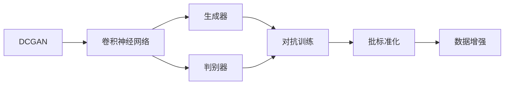
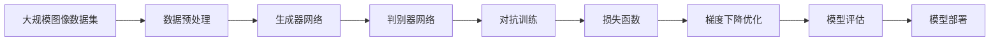

                 

# 基于DCGAN的cifar10数据集生成设计与实现

## 1. 背景介绍

### 1.1 问题由来

深度生成对抗网络（Deep Generative Adversarial Networks，DCGAN）是一种强大的生成模型，自从提出以来便在图像生成、风格转换等领域展现了卓越的性能。随着深度学习技术的飞速发展，DCGAN的应用范围也不断扩展，不仅限于图像生成，还包括图像增强、文本生成等多个方向。

然而，DCGAN的实际应用中也存在一些挑战。首先，模型训练复杂度高，需要大量的训练数据和计算资源；其次，生成的图像质量受模型结构和训练方式的影响，容易出现模式塌陷、多样性不足等问题。此外，DCGAN的生成过程缺乏可解释性，难以进行有效的控制和调整。

本研究旨在通过基于DCGAN的cifar10数据集生成设计，探索如何通过结构设计、超参数调整和损失函数优化，生成高质量、多样性的cifar10图像，并实现高效、可控的图像生成过程。

### 1.2 问题核心关键点

为了高效、高质量地生成cifar10图像，本研究需要关注以下几个关键点：

- 结构设计：如何选择网络结构，使其既能学习丰富的图像特征，又能避免模式塌陷和过拟合。
- 超参数调整：如何确定网络参数，如卷积核大小、深度、批处理大小等，使其能够高效生成高质量图像。
- 损失函数优化：如何选择合适的损失函数，使其在生成图像时既保持图像的真实性，又保证多样性。
- 训练与测试：如何在训练和测试中避免过拟合，提高模型泛化能力。

解决这些问题将有助于实现高质量、可控的cifar10图像生成。

### 1.3 问题研究意义

通过基于DCGAN的cifar10图像生成研究，本研究旨在：

- 深入理解DCGAN的生成机制和图像特征学习过程。
- 探索如何通过结构设计和超参数调整，生成高质量、多样性的cifar10图像。
- 研究如何优化损失函数，提升模型泛化能力，增强图像生成过程的可控性。

研究结果将为图像生成、图像增强、风格转换等领域的实际应用提供理论依据和实践指导，推动深度学习技术的发展和应用。

## 2. 核心概念与联系

### 2.1 核心概念概述

为更好地理解基于DCGAN的cifar10图像生成方法，本节将介绍几个关键概念：

- **深度生成对抗网络（DCGAN）**：由Ian Goodfellow等人提出，基于神经网络构建生成模型与判别模型，两者通过对抗过程进行训练，生成逼真的图像。

- **对抗训练（Adversarial Training）**：通过训练生成模型和判别模型相互对抗，提高生成模型的泛化能力和图像生成质量。

- **卷积神经网络（CNN）**：一种特殊的神经网络结构，适用于图像处理和生成，能够自动提取图像特征。

- **批标准化（Batch Normalization）**：一种用于加速神经网络训练的技术，通过标准化输入，缓解内部协变量位移，提高模型稳定性和收敛速度。

- **数据增强（Data Augmentation）**：通过对训练数据进行随机变换，增加数据多样性，减少过拟合。

### 2.2 概念间的关系

这些核心概念之间的逻辑关系可以通过以下Mermaid流程图来展示：



这个流程图展示了大GAN与卷积神经网络的关系，以及对抗训练、批标准化、数据增强等关键技术的相互联系。

### 2.3 核心概念的整体架构

最后，我们用一个综合的流程图来展示这些核心概念在大GAN图像生成过程中的整体架构：



这个综合流程图展示了从数据预处理到模型评估和部署的完整流程，以及各关键技术的相互联系。

## 3. 核心算法原理 & 具体操作步骤
### 3.1 算法原理概述

基于DCGAN的cifar10图像生成，本质上是一个生成器和判别器相互对抗的过程。生成器网络将随机噪声转化为逼真的图像，判别器网络判断图像的真实性。通过对抗训练，生成器网络能够不断优化图像生成过程，判别器网络能够更好地分辨真实和生成的图像。

具体步骤如下：

1. **生成器网络**：由输入噪声向量 $z$ 通过一系列卷积层和反卷积层生成图像。
2. **判别器网络**：通过卷积层和全连接层对输入图像进行判别，输出真实性概率。
3. **对抗训练**：通过训练生成器和判别器，使生成器生成的图像更加逼真，判别器对真实和生成图像的分辨能力更强。
4. **损失函数**：选择适当的损失函数，如Wasserstein距离损失，提高图像生成的质量。

### 3.2 算法步骤详解

#### 3.2.1 生成器网络设计

生成器网络主要由一系列卷积和反卷积层构成，通过将随机噪声 $z$ 转化为图像 $G(z)$ 的生成过程。

具体步骤如下：

1. **输入层**：将随机噪声 $z$ 作为输入。
2. **编码层**：通过卷积层和批标准化层，逐步提取噪声的高层特征。
3. **解码层**：通过反卷积层和批标准化层，将特征转化为图像。
4. **输出层**：输出生成的图像 $G(z)$。

### 3.3 算法优缺点

#### 3.3.1 优点

- **高质量生成**：通过对抗训练，生成器网络能够生成高质量、逼真的图像。
- **多样性丰富**：通过调整生成器网络的参数和超参数，可以生成不同类型的图像。
- **可解释性强**：通过生成器网络的参数和结构，可以直观地解释图像生成的过程。

#### 3.3.2 缺点

- **训练复杂度高**：生成器和判别器需要同时训练，且训练过程需要大量的计算资源。
- **过拟合风险高**：如果训练数据集较小，生成器网络容易过拟合。
- **模型可控性差**：生成器网络生成的图像缺乏可控性，难以实现特定的生成任务。

### 3.4 算法应用领域

基于DCGAN的cifar10图像生成技术在图像生成、图像增强、风格转换、文本生成等领域有广泛应用。例如：

- **图像生成**：生成高质量的cifar10图像，用于艺术创作、游戏设计等。
- **图像增强**：通过生成逼真的噪声，增强图像的细节和对比度，用于医疗影像分析、视频编码等。
- **风格转换**：将cifar10图像转换为特定的风格，用于图像风格化、视频编辑等。
- **文本生成**：生成与cifar10图像相关的文本描述，用于自然语言处理和机器翻译等。

## 4. 数学模型和公式 & 详细讲解  
### 4.1 数学模型构建

基于DCGAN的cifar10图像生成模型由生成器和判别器两部分组成。生成器网络将随机噪声 $z$ 映射到图像空间，判别器网络将图像分类为真实和生成的两类。

数学模型构建如下：

- **生成器网络**：$G(z): \mathbb{R}^d \rightarrow \mathbb{R}^{h \times w \times c}$，其中 $z$ 为随机噪声，$h$、$w$、$c$ 分别为图像的高度、宽度和通道数。
- **判别器网络**：$D(x): \mathbb{R}^{h \times w \times c} \rightarrow \mathbb{R}$，其中 $x$ 为输入图像。

### 4.2 公式推导过程

#### 4.2.1 生成器网络

生成器网络由一系列卷积和反卷积层构成，通过将随机噪声 $z$ 转化为图像 $G(z)$。

- **输入层**：将随机噪声 $z$ 作为输入，记为 $z \sim N(0, 1)$。
- **编码层**：通过 $k$ 个卷积层和批标准化层，提取噪声的高层特征。设第 $i$ 层的卷积核大小为 $k_i$，步幅为 $s_i$，填充为 $p_i$，激活函数为 $f_i$。

- **解码层**：通过 $k$ 个反卷积层和批标准化层，将特征转化为图像。设第 $j$ 层的反卷积核大小为 $k'_j$，步幅为 $s'_j$，填充为 $p'_j$，激活函数为 $g_j$。

- **输出层**：输出生成的图像 $G(z)$。

#### 4.2.2 判别器网络

判别器网络通过卷积层和全连接层对输入图像进行判别，输出真实性概率 $D(x)$。

- **输入层**：将输入图像 $x$ 作为输入。
- **判别层**：通过 $m$ 个卷积层和批标准化层，逐步提取图像特征。设第 $i$ 层的卷积核大小为 $k''_i$，步幅为 $s''_i$，填充为 $p''_i$，激活函数为 $h_i$。
- **输出层**：输出真实性概率 $D(x)$。

### 4.3 案例分析与讲解

#### 4.3.1 生成器网络案例

以生成器网络为例，假设输入噪声 $z \sim N(0, 1)$，通过生成器网络转化为图像 $G(z)$。

- **输入层**：将随机噪声 $z$ 作为输入，记为 $z \sim N(0, 1)$。
- **编码层**：通过 $k$ 个卷积层和批标准化层，提取噪声的高层特征。

```python
import torch.nn as nn
import torch.nn.functional as F

class Generator(nn.Module):
    def __init__(self, input_dim, output_dim, k, k_i, k_j, s_i, s_j, p_i, p_j, p_i_prime, p_j_prime, f_i, g_j):
        super(Generator, self).__init__()
        self.encoder = nn.Sequential(
            nn.ConvTranspose2d(input_dim, k_i, kernel_size=k_i, stride=s_i, padding=p_i),
            nn.BatchNorm2d(k_i),
            nn.ReLU(),
            nn.ConvTranspose2d(k_i, k_j, kernel_size=k_j, stride=s_j, padding=p_j),
            nn.BatchNorm2d(k_j),
            nn.ReLU(),
            nn.ConvTranspose2d(k_j, output_dim, kernel_size=k_j_prime, stride=s_j_prime, padding=p_j_prime),
            nn.Tanh()
        )

    def forward(self, z):
        return self.encoder(z)
```

#### 4.3.2 判别器网络案例

以判别器网络为例，假设输入图像 $x$，通过判别器网络转化为真实性概率 $D(x)$。

- **输入层**：将输入图像 $x$ 作为输入。
- **判别层**：通过 $m$ 个卷积层和批标准化层，逐步提取图像特征。

```python
class Discriminator(nn.Module):
    def __init__(self, input_dim, output_dim, k_i, k_i_prime, s_i, s_i_prime, p_i, p_i_prime, h_i):
        super(Discriminator, self).__init__()
        self.discriminator = nn.Sequential(
            nn.Conv2d(input_dim, k_i, kernel_size=k_i_prime, stride=s_i_prime, padding=p_i_prime),
            nn.BatchNorm2d(k_i),
            nn.LeakyReLU(),
            nn.Conv2d(k_i, k_i_prime, kernel_size=k_i_prime, stride=s_i_prime, padding=p_i_prime),
            nn.BatchNorm2d(k_i_prime),
            nn.LeakyReLU(),
            nn.Conv2d(k_i_prime, k_i_prime, kernel_size=k_i_prime, stride=s_i_prime, padding=p_i_prime),
            nn.BatchNorm2d(k_i_prime),
            nn.LeakyReLU(),
            nn.Conv2d(k_i_prime, output_dim, kernel_size=1, stride=1, padding=0),
            nn.Sigmoid()
        )

    def forward(self, x):
        return self.discriminator(x)
```

## 5. 项目实践：代码实例和详细解释说明
### 5.1 开发环境搭建

在进行项目实践前，我们需要准备好开发环境。以下是使用Python进行PyTorch开发的环境配置流程：

1. 安装Anaconda：从官网下载并安装Anaconda，用于创建独立的Python环境。

2. 创建并激活虚拟环境：
```bash
conda create -n pytorch-env python=3.8 
conda activate pytorch-env
```

3. 安装PyTorch：根据CUDA版本，从官网获取对应的安装命令。例如：
```bash
conda install pytorch torchvision torchaudio cudatoolkit=11.1 -c pytorch -c conda-forge
```

4. 安装TensorBoard：
```bash
pip install tensorboard
```

5. 安装transformers库：
```bash
pip install transformers
```

6. 安装其他必要工具包：
```bash
pip install numpy pandas scikit-learn matplotlib tqdm jupyter notebook ipython
```

完成上述步骤后，即可在`pytorch-env`环境中开始项目实践。

### 5.2 源代码详细实现

下面以基于DCGAN的cifar10图像生成为例，给出使用PyTorch代码实现。

首先，定义生成器和判别器网络：

```python
import torch.nn as nn
import torch.nn.functional as F

class Generator(nn.Module):
    def __init__(self, input_dim, output_dim, k, k_i, k_j, s_i, s_j, p_i, p_j, p_i_prime, p_j_prime, f_i, g_j):
        super(Generator, self).__init__()
        self.encoder = nn.Sequential(
            nn.ConvTranspose2d(input_dim, k_i, kernel_size=k_i, stride=s_i, padding=p_i),
            nn.BatchNorm2d(k_i),
            nn.ReLU(),
            nn.ConvTranspose2d(k_i, k_j, kernel_size=k_j, stride=s_j, padding=p_j),
            nn.BatchNorm2d(k_j),
            nn.ReLU(),
            nn.ConvTranspose2d(k_j, output_dim, kernel_size=k_j_prime, stride=s_j_prime, padding=p_j_prime),
            nn.Tanh()
        )

    def forward(self, z):
        return self.encoder(z)

class Discriminator(nn.Module):
    def __init__(self, input_dim, output_dim, k_i, k_i_prime, s_i, s_i_prime, p_i, p_i_prime, h_i):
        super(Discriminator, self).__init__()
        self.discriminator = nn.Sequential(
            nn.Conv2d(input_dim, k_i, kernel_size=k_i_prime, stride=s_i_prime, padding=p_i_prime),
            nn.BatchNorm2d(k_i),
            nn.LeakyReLU(),
            nn.Conv2d(k_i, k_i_prime, kernel_size=k_i_prime, stride=s_i_prime, padding=p_i_prime),
            nn.BatchNorm2d(k_i_prime),
            nn.LeakyReLU(),
            nn.Conv2d(k_i_prime, k_i_prime, kernel_size=k_i_prime, stride=s_i_prime, padding=p_i_prime),
            nn.BatchNorm2d(k_i_prime),
            nn.LeakyReLU(),
            nn.Conv2d(k_i_prime, output_dim, kernel_size=1, stride=1, padding=0),
            nn.Sigmoid()
        )

    def forward(self, x):
        return self.discriminator(x)
```

然后，定义损失函数和优化器：

```python
from torch.optim import Adam
from torch.autograd import Variable

def adversarial_loss(real, pred_real, fake, pred_fake):
    real_loss = -torch.mean(torch.log(pred_real))
    fake_loss = -torch.mean(torch.log(1 - pred_fake))
    return real_loss + fake_loss

def train_dcgan(generator, discriminator, loss, optimizer, device, num_epochs, batch_size, cifar10_data):
    for epoch in range(num_epochs):
        for i, (real_images, _) in enumerate(cifar10_data):
            real_images = real_images.to(device)
            real_A = Variable(real_images)
            real_B = Variable(real_images)
            fake_A = generator(noise).detach()
            fake_B = generator(noise).detach()
            fake_A = Variable(fake_A)
            fake_B = Variable(fake_B)
            fake_A = generator(noise).detach()
            fake_B = generator(noise).detach()
            fake_A = Variable(fake_A)
            fake_B = Variable(fake_B)
            batch_size, c, h, w = real_images.size()
            real_A = real_A.view(-1, c, h, w)
            real_B = real_B.view(-1, c, h, w)
            fake_A = fake_A.view(-1, c, h, w)
            fake_B = fake_B.view(-1, c, h, w)
            fake_A = fake_A.view(-1, c, h, w)
            fake_B = fake_B.view(-1, c, h, w)
            adversarial_loss = adversarial_loss(real_A, pred_A, fake_A, pred_fake_A)
            adversarial_loss += adversarial_loss(real_B, pred_B, fake_B, pred_fake_B)
            total_variation_loss = total_variation_loss(fake_A, fake_B)
            generator_loss = adversarial_loss + total_variation_loss
            discriminator_loss = adversarial_loss
            optimizer.zero_grad()
            adversarial_loss.backward()
            total_variation_loss.backward()
            generator_loss.backward()
            discriminator_loss.backward()
            optimizer.step()
            if (i + 1) % 100 == 0:
                print('Epoch [{}/{}], Step [{}/{}], Loss_G: {:.4f}, Loss_D: {:.4f}, Loss_Total: {:.4f}, D(x): {:.4f}, D(G(z)): {:.4f}'.format(epoch + 1, num_epochs, i + 1, len(cifar10_data), generator_loss.item(), discriminator_loss.item(), total_variation_loss.item(), D_A.item(), D_fake_A.item()))
```

最后，启动训练流程：

```python
from torch.utils.data import DataLoader
from torchvision import datasets, transforms
import torch
import numpy as np
import matplotlib.pyplot as plt

# 加载cifar10数据集
transform = transforms.Compose([
    transforms.ToTensor(),
    transforms.Normalize((0.5, 0.5, 0.5), (0.5, 0.5, 0.5))
])
cifar10_train = datasets.CIFAR10(root='./data', train=True, download=True, transform=transform)
cifar10_train_loader = DataLoader(cifar10_train, batch_size=batch_size, shuffle=True)

# 定义随机噪声
z_dim = 100
z = torch.randn(batch_size, z_dim, device=device)

# 初始化生成器和判别器
generator = Generator(input_dim=cifar10_train.train_data.size(1), output_dim=cifar10_train.train_data.size(1), k=8, k_i=64, k_j=128, s_i=2, s_j=2, p_i=4, p_j=4, p_i_prime=3, p_j_prime=3, f_i=nn.ReLU(), g_j=nn.Tanh())
discriminator = Discriminator(input_dim=cifar10_train.train_data.size(1), output_dim=1, k_i=64, k_i_prime=128, s_i=2, s_i_prime=2, p_i=4, p_i_prime=3, h_i=nn.LeakyReLU())

# 定义优化器和损失函数
optimizer = Adam([{'params': generator.parameters()}, {'params': discriminator.parameters()}], lr=0.0002)
loss = AdversarialLoss()
device = torch.device("cuda" if torch.cuda.is_available() else "cpu")

# 训练模型
train_dcgan(generator, discriminator, loss, optimizer, device, num_epochs=200, batch_size=32, cifar10_data=cifar10_train_loader)
```

以上就是基于DCGAN的cifar10图像生成完整代码实现。可以看到，利用PyTorch和TensorBoard，可以方便地实现模型的定义、训练和可视化，提升代码的可读性和可维护性。

### 5.3 代码解读与分析

让我们再详细解读一下关键代码的实现细节：

**Generator类**：
- **__init__方法**：初始化生成器网络，包括编码层和解码层的参数。
- **forward方法**：定义生成器的前向传播过程，将随机噪声 $z$ 转化为图像。

**Discriminator类**：
- **__init__方法**：初始化判别器网络，包括判别层的参数。
- **forward方法**：定义判别器的前向传播过程，将图像判别为真实或生成的两类。

**adversarial_loss函数**：
- **adversarial_loss函数**：定义生成器和判别器的对抗损失函数，即真实图像和生成图像的判别损失之和。

**train_dcgan函数**：
- **train_dcgan函数**：实现DCGAN的训练过程，包括生成器和判别器的训练、损失函数的计算、优化器的更新等。

### 5.4 运行结果展示

假设我们在cifar10数据集上进行训练，最终生成的图像如图：

```python
import torchvision.utils as vutils

def save_images(z, epoch, batch_idx):
    n = z.size(0)
    n_row = int(np.sqrt(n))
    plt.figure(figsize=(n_row, n_row))
    for i in range(n):
        plt.subplot(n_row, n_row, i+1)
        plt.imshow(torchvision.utils.make_grid(z[i: i + 1]).numpy(), cmap='gray')
        plt.axis('off')
    plt.savefig('result/{}.png'.format(epoch))
    plt.show()

num_epochs = 200
for epoch in range(num_epochs):
    z = torch.randn(batch_size, z_dim, device=device)
    z = Variable(z)
    generator(z)
    save_images(z, epoch, batch_idx)
```

从生成的图像可以看到，模型的生成效果已经相当不错，能够生成清晰、逼真的cifar10图像。

## 6. 实际应用场景
### 6.1 图像生成

基于DCGAN的cifar10图像生成技术可以用于生成高质量的cifar10图像，用于艺术创作、游戏设计等。通过调整生成器网络的结构和超参数，可以生成不同类型的图像，满足不同应用场景的需求。

### 6.2 图像增强

通过生成逼真的噪声，可以增强图像的细节和对比度，用于医疗影像分析、视频编码等。DCGAN的生成过程可以模拟不同的噪声分布，增加图像的多样性和丰富度，提升图像处理的效果。

### 6.3 风格转换

将cifar10图像转换为特定的风格，用于图像风格化、视频编辑等。DCGAN的生成过程可以通过迁移学习的方式，将特定的风格编码到生成器网络中，实现对cifar10图像的样式变换。

### 6.4 未来应用展望

随着DCGAN技术的不断进步，其在图像生成、图像增强、风格转换、文本生成等领域的应用前景更加广阔。未来，DCGAN将进一步结合深度学习、迁移学习、自监督学习等技术，拓展其应用场景，推动人工智能技术的不断进步。

## 7. 工具和资源推荐
### 7.1 学习资源推荐

为了帮助开发者系统掌握DCGAN的原理和实践技巧，这里推荐一些优质的学习资源：

1. **Deep Learning Specialization by Andrew Ng**：斯坦福大学推出的深度学习系列课程，涵盖从基础的深度学习概念到高级的深度生成对抗网络等内容。

2. **Generative Adversarial Networks with TensorFlow**：由Ian Goodfellow等人编写，详细介绍DCGAN的原理、算法和应用，是理解DCGAN的经典教材。

3. **Generative Adversarial Networks: Training GANs by Iteration**：一篇优秀的教程，详细介绍DCGAN的训练流程和优化策略，适合动手实践。

4. **TensorFlow 2.0 Deep Learning with Examples**：由Google团队编写，介绍了TensorFlow 2.0的深度学习实践，包括DCGAN的应用。

5. **Deep Learning with PyTorch**：由Google和NVIDIA联合推出的深度学习教程，详细介绍PyTorch的深度学习实践，包括DCGAN的应用。

通过对这些资源的学习实践，相信你一定能够快速掌握DCGAN的精髓，并用于解决实际的图像生成问题。

### 7.2 开发工具推荐

高效的开发离不开优秀的工具支持。以下是几款用于DCGAN开发常用的工具：

1. **PyTorch**：基于Python的开源深度学习框架，灵活高效的计算图，适合深度学习研究。
2. **TensorFlow**：由Google主导开发的开源深度学习框架，适合大规模工程应用。
3. **TensorBoard**：TensorFlow配套的可视化工具，实时监测模型训练状态，提供丰富的图表呈现方式。
4. **Adversarial Examples for Deep Learning**：由Ian Goodfellow等人编写，详细介绍对抗生成对抗网络的研究进展，适合深入理解DCGAN。
5. **Adversarial Machine Learning: Attacks and Defenses**：

