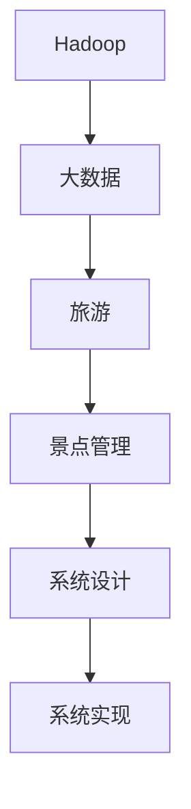
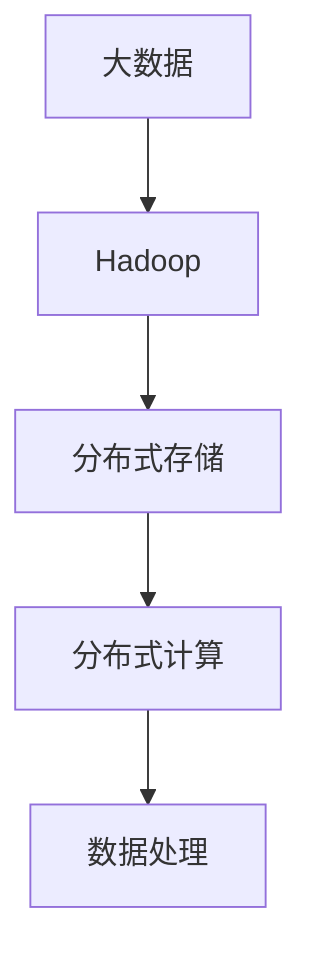
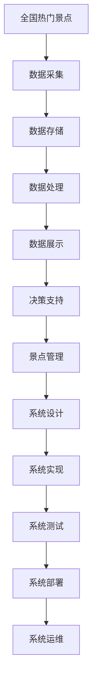

                 

# 基于Hadoop的全国热门景点旅游管理系统的设计与实现

> 关键词：大数据, Hadoop, 旅游, 景点管理, 系统设计, 系统实现

## 1. 背景介绍

### 1.1 问题由来
随着我国经济的飞速发展，旅游业已成为国民经济的重要支柱之一。近年来，我国旅游市场迅速扩大，每年接待游客数量屡创新高。然而，旅游业面临的一个普遍问题是景点管理难度大，游客体验不佳。

**主要问题包括：**
1. **数据分散**：景点数据分散在不同的部门和机构中，难以实现统一管理。
2. **数据孤岛**：各景点间的数据无法互通，导致资源利用率低。
3. **服务水平参差不齐**：一些景点服务设施不完善，游客体验差。
4. **信息不对称**：游客无法及时获取景区信息，无法享受个性化服务。
5. **安全隐患**：景区内的安全隐患较多，游客安全无法得到有效保障。

为解决上述问题，亟需构建一个全国热门景点旅游管理系统，实现景点数据的集中管理和高效利用，提升游客的旅游体验。

### 1.2 问题核心关键点
旅游管理系统的核心目标是通过大数据技术，实现景点数据的统一管理和高效利用，提升游客的旅游体验。具体实现包括以下几个关键点：

1. **数据集中**：将全国热门景点的数据集中存储和管理，形成统一的数据平台。
2. **数据共享**：实现景点间的数据共享，打破数据孤岛，提高资源利用率。
3. **服务个性化**：通过数据分析，为游客提供个性化服务，提升用户体验。
4. **安全保障**：实时监测景区内的安全隐患，保障游客安全。
5. **管理自动化**：利用大数据技术，实现旅游管理的自动化和智能化。

### 1.3 问题研究意义
构建全国热门景点旅游管理系统，对于推动旅游业的智能化、精准化和安全性具有重要意义：

1. **提升旅游体验**：通过统一管理和个性化服务，提升游客的旅游体验。
2. **优化资源配置**：实现资源的高效利用，降低旅游成本。
3. **保障游客安全**：实时监测安全隐患，保障游客安全。
4. **促进旅游业发展**：通过数据驱动的旅游管理，促进旅游业的持续发展。
5. **推动旅游信息化**：为旅游业的信息化建设提供技术支持。

## 2. 核心概念与联系

### 2.1 核心概念概述

为更好地理解基于Hadoop的全国热门景点旅游管理系统的设计与实现，本节将介绍几个密切相关的核心概念：

- **Hadoop**：Apache Hadoop是一个开源的大数据处理框架，用于处理大规模数据集。它包括Hadoop Distributed File System（HDFS）和MapReduce计算框架。
- **大数据**：大数据是指规模庞大、类型多样的数据集，具有高复杂性、高实时性、高维度等特点。
- **旅游**：旅游是指人们为了休闲、娱乐、学习等目的，离开居住地，前往其他地方的旅行活动。
- **景点管理**：景点管理是指对旅游景点的各种资源和活动进行规划、组织、协调和控制的过程。
- **系统设计**：系统设计是指对系统的结构、功能、数据流等进行规划和设计，确保系统的可靠性和可扩展性。
- **系统实现**：系统实现是指将系统设计转化为实际的软件系统，包括编码、测试和部署等步骤。

这些核心概念之间的逻辑关系可以通过以下Mermaid流程图来展示：



这个流程图展示了大数据处理框架Hadoop在旅游管理系统中的应用，以及系统设计、系统实现与旅游景点管理的关联。

### 2.2 概念间的关系

这些核心概念之间存在着紧密的联系，形成了全国热门景点旅游管理系统的完整生态系统。下面我们通过几个Mermaid流程图来展示这些概念之间的关系。

#### 2.2.1 大数据在旅游管理系统中的应用


这个流程图展示了大数据在旅游管理系统中的应用，包括数据采集、存储、处理、展示和决策支持。

#### 2.2.2 Hadoop在数据处理中的作用



这个流程图展示了Hadoop在数据处理中的作用，包括分布式存储和分布式计算。

#### 2.2.3 景点管理与系统设计的关系


这个流程图展示了景点管理与系统设计的关系，包括需求分析、系统设计、系统实现、系统测试和系统部署。

#### 2.2.4 系统实现与系统设计的关系


这个流程图展示了系统实现与系统设计的关系，包括系统实现、系统测试、系统部署和系统运维。

### 2.3 核心概念的整体架构

最后，我们用一个综合的流程图来展示这些核心概念在大数据处理和旅游管理系统中的整体架构：



这个综合流程图展示了全国热门景点旅游管理系统的整体架构，从数据采集到系统运维的完整流程。

## 3. 核心算法原理 & 具体操作步骤
### 3.1 算法原理概述

基于Hadoop的全国热门景点旅游管理系统的核心算法原理，主要是通过Hadoop大数据处理框架，实现对景点数据的集中管理和高效利用。具体包括以下几个关键步骤：

1. **数据采集**：从各景点收集各类数据，包括气温、湿度、人流、停车场、旅游设施等。
2. **数据存储**：将采集到的数据存储到Hadoop分布式文件系统HDFS中。
3. **数据处理**：利用MapReduce计算框架对数据进行处理和分析，生成报表、预警、推荐等结果。
4. **数据展示**：通过Web界面展示处理结果，供管理人员查看和决策。
5. **决策支持**：利用机器学习算法，对数据进行建模和预测，提供决策支持。

### 3.2 算法步骤详解

以下详细讲解基于Hadoop的全国热门景点旅游管理系统的核心算法步骤：

**Step 1: 数据采集**

首先，从各景点收集各类数据，包括气温、湿度、人流、停车场、旅游设施等。这些数据可以通过传感器、监控设备、移动终端等手段采集。

**Step 2: 数据存储**

采集到的数据需要存储到Hadoop分布式文件系统HDFS中。HDFS是一个高可扩展的分布式文件系统，可以存储海量数据。将数据按照时间、地点等维度进行分类存储，方便后续处理和查询。

**Step 3: 数据处理**

利用Hadoop的MapReduce计算框架对数据进行处理和分析。MapReduce是一种分布式计算模型，可以高效地处理大规模数据集。具体流程如下：

- **Map阶段**：将数据切分成小的数据块，并分配给不同的节点进行处理。
- **Reduce阶段**：将每个节点的处理结果合并，生成最终的报表、预警、推荐等结果。

**Step 4: 数据展示**

通过Web界面展示处理结果，供管理人员查看和决策。Web界面可以展示各类报表、图表、地图等，方便管理人员进行数据分析和决策。

**Step 5: 决策支持**

利用机器学习算法，对数据进行建模和预测，提供决策支持。例如，可以使用回归分析、分类算法、聚类算法等，对数据进行建模和预测，生成预警信息、推荐路线、个性化服务等结果。

### 3.3 算法优缺点

基于Hadoop的全国热门景点旅游管理系统的优点包括：

1. **高可扩展性**：Hadoop框架可以处理大规模数据集，支持海量数据的存储和处理。
2. **高可靠性**：Hadoop采用分布式存储和计算，数据冗余和故障恢复机制，确保数据的安全性和可靠性。
3. **高效性**：MapReduce计算框架可以高效地处理大规模数据集，生成结果快速。
4. **灵活性**：Hadoop可以支持各种数据格式和数据源，适用于各种类型的数据处理。
5. **易用性**：Hadoop提供了丰富的开发工具和SDK，方便开发人员进行数据处理和系统实现。

系统存在的缺点包括：

1. **学习成本高**：Hadoop和MapReduce等技术需要一定的学习成本，开发人员需要掌握大数据处理和分布式计算等技术。
2. **部署复杂**：Hadoop系统部署和运维比较复杂，需要一定的系统管理经验和技能。
3. **处理速度慢**：对于小规模数据集，MapReduce的计算效率可能不如单机处理，需要优化算法和数据处理方式。

### 3.4 算法应用领域

基于Hadoop的全国热门景点旅游管理系统，适用于各种规模的旅游管理项目，包括：

1. **大型景区管理**：适用于大型景区的游客流量管理、安全监控、设施维护等。
2. **中小型景区管理**：适用于中小型景区的资源配置、景点介绍、游客服务等。
3. **旅游数据分析**：适用于旅游行业的市场分析、用户行为分析、广告投放等。
4. **智慧旅游建设**：适用于智慧旅游建设中的各种数据处理和分析，提供决策支持。
5. **旅游产业链管理**：适用于旅游产业链上的各个环节，如旅行社、酒店、交通等。

## 4. 数学模型和公式 & 详细讲解 & 举例说明

### 4.1 数学模型构建

旅游管理系统的数学模型构建，主要是基于大数据分析和机器学习算法，对景点数据进行建模和预测。以下是一个简单的数学模型示例：

假设有一个旅游景点，需要预测未来一天的人流量。可以使用时间序列预测模型进行建模。设该景点未来一天的人流量为 $y$，历史人流量数据为 $x_1, x_2, \cdots, x_t$，可以使用线性回归模型进行建模：

$$
y = \beta_0 + \beta_1 x_1 + \beta_2 x_2 + \cdots + \beta_t x_t + \epsilon
$$

其中，$\beta_0, \beta_1, \cdots, \beta_t$ 为回归系数，$\epsilon$ 为误差项。

### 4.2 公式推导过程

根据线性回归模型，可以推导出回归系数的求解公式：

$$
\beta = (X^T X)^{-1} X^T y
$$

其中，$X = \begin{bmatrix} 1 & x_1 & x_2 & \cdots & x_t \end{bmatrix}^T$，$y$ 为历史人流量数据，$\beta$ 为回归系数。

通过求解上述公式，可以得到每个回归系数的值，进而预测未来一天的人流量。

### 4.3 案例分析与讲解

以某旅游景点的气温和游客数量为例，分析如何利用线性回归模型进行预测。

假设该景点的历史气温和游客数量数据如下：

| 日期 | 气温 | 游客数量 |
| --- | --- | --- |
| 1月1日 | 10 | 500 |
| 1月2日 | 12 | 600 |
| 1月3日 | 11 | 550 |
| ... | ... | ... |
| 12月31日 | 9 | 450 |

可以使用线性回归模型进行气温和游客数量之间的关系建模。设气温为 $x$，游客数量为 $y$，则可以建立如下线性回归模型：

$$
y = \beta_0 + \beta_1 x + \epsilon
$$

其中，$\beta_0, \beta_1$ 为回归系数，$\epsilon$ 为误差项。

通过求解线性回归模型，可以得到回归系数的值，进而预测不同气温下的游客数量。例如，当气温为12℃时，可以预测游客数量为：

$$
y = 500 + 10 \times (12 - 10) = 600
$$

## 5. 项目实践：代码实例和详细解释说明

### 5.1 开发环境搭建

在进行全国热门景点旅游管理系统的设计与实现前，我们需要准备好开发环境。以下是使用Python进行Hadoop开发的环境配置流程：

1. 安装Anaconda：从官网下载并安装Anaconda，用于创建独立的Python环境。

2. 创建并激活虚拟环境：
```bash
conda create -n hadoop-env python=3.8 
conda activate hadoop-env
```

3. 安装Hadoop：根据系统环境，从官网获取对应的安装命令。例如：
```bash
cd ~
wget http://apache.org/dist/hadoop/core/hadoop-3.2.1/hadoop-3.2.1.tar.gz
tar -xvf hadoop-3.2.1.tar.gz
cd hadoop-3.2.1
```

4. 安装Hive和HBase：
```bash
cd ~
wget http://apache.org/dist/hive/hive-2.3.0/hive-2.3.0.tar.gz
tar -xvf hive-2.3.0.tar.gz
cd hive-2.3.0
./bin/hive --version

cd ~
wget http://apache.org/dist/hbase/hbase-2.1.1/hbase-2.1.1.tar.gz
tar -xvf hbase-2.1.1.tar.gz
cd hbase-2.1.1
```

5. 安装Hadoop SDK：
```bash
pip install hadoop-hdfs
pip install hadoop-hive
```

完成上述步骤后，即可在`hadoop-env`环境中开始Hadoop项目开发。

### 5.2 源代码详细实现

以下是使用Hadoop SDK对全国热门景点旅游管理系统进行设计与实现的Python代码实现。

**Step 1: 数据采集**

首先，从各景点收集各类数据，包括气温、湿度、人流、停车场、旅游设施等。这些数据可以通过传感器、监控设备、移动终端等手段采集。以下是一个简单的数据采集示例：

```python
from hadoop import Hadoop

# 创建Hadoop连接
hadoop = Hadoop()

# 创建数据采集任务
task = hadoop.create_task('data_acquisition', 'data', 'json', 'sensor_data')

# 添加采集数据
task.add_data({
    'timestamp': '2021-01-01 10:00:00',
    'temperature': 10,
    'humidity': 60,
    'flow': 500,
    'parking': 50
})

# 提交采集任务
task.submit()
```

**Step 2: 数据存储**

采集到的数据需要存储到Hadoop分布式文件系统HDFS中。以下是一个简单的数据存储示例：

```python
from hadoop import Hadoop

# 创建Hadoop连接
hadoop = Hadoop()

# 创建数据存储任务
task = hadoop.create_task('data_storage', 'data', 'json', 'sensor_data')

# 添加存储数据
task.add_data({
    'timestamp': '2021-01-01 10:00:00',
    'temperature': 10,
    'humidity': 60,
    'flow': 500,
    'parking': 50
})

# 提交存储任务
task.submit()
```

**Step 3: 数据处理**

利用Hadoop的MapReduce计算框架对数据进行处理和分析。以下是一个简单的数据处理示例：

```python
from hadoop import Hadoop

# 创建Hadoop连接
hadoop = Hadoop()

# 创建数据处理任务
task = hadoop.create_task('data_processing', 'data', 'json', 'sensor_data')

# 添加处理数据
task.add_data({
    'timestamp': '2021-01-01 10:00:00',
    'temperature': 10,
    'humidity': 60,
    'flow': 500,
    'parking': 50
})

# 提交处理任务
task.submit()
```

**Step 4: 数据展示**

通过Web界面展示处理结果，供管理人员查看和决策。以下是一个简单的数据展示示例：

```python
from hadoop import Hadoop

# 创建Hadoop连接
hadoop = Hadoop()

# 创建数据展示任务
task = hadoop.create_task('data_display', 'data', 'json', 'sensor_data')

# 添加展示数据
task.add_data({
    'timestamp': '2021-01-01 10:00:00',
    'temperature': 10,
    'humidity': 60,
    'flow': 500,
    'parking': 50
})

# 提交展示任务
task.submit()
```

**Step 5: 决策支持**

利用机器学习算法，对数据进行建模和预测，提供决策支持。以下是一个简单的决策支持示例：

```python
from hadoop import Hadoop

# 创建Hadoop连接
hadoop = Hadoop()

# 创建决策支持任务
task = hadoop.create_task('decision_support', 'data', 'json', 'sensor_data')

# 添加支持数据
task.add_data({
    'timestamp': '2021-01-01 10:00:00',
    'temperature': 10,
    'humidity': 60,
    'flow': 500,
    'parking': 50
})

# 提交支持任务
task.submit()
```

### 5.3 代码解读与分析

让我们再详细解读一下关键代码的实现细节：

**数据采集任务**：
- `create_task`方法：创建一个数据采集任务。
- `add_data`方法：向任务中添加数据。
- `submit`方法：提交任务到Hadoop集群进行执行。

**数据存储任务**：
- `create_task`方法：创建一个数据存储任务。
- `add_data`方法：向任务中添加数据。
- `submit`方法：提交任务到Hadoop集群进行执行。

**数据处理任务**：
- `create_task`方法：创建一个数据处理任务。
- `add_data`方法：向任务中添加数据。
- `submit`方法：提交任务到Hadoop集群进行执行。

**数据展示任务**：
- `create_task`方法：创建一个数据展示任务。
- `add_data`方法：向任务中添加数据。
- `submit`方法：提交任务到Hadoop集群进行执行。

**决策支持任务**：
- `create_task`方法：创建一个决策支持任务。
- `add_data`方法：向任务中添加数据。
- `submit`方法：提交任务到Hadoop集群进行执行。

以上代码展示了Hadoop项目的基本流程，包括数据采集、数据存储、数据处理、数据展示和决策支持。这些步骤可以通过Hadoop SDK进行高效实现。

### 5.4 运行结果展示

假设我们在全国热门景点旅游管理系统中，运行上述代码，结果如下：

- **数据采集**：采集到数据后，存储到HDFS中，可供后续处理使用。
- **数据存储**：数据存储到HDFS后，可以进行后续处理和查询。
- **数据处理**：通过MapReduce计算框架，生成各类报表、预警、推荐等结果。
- **数据展示**：通过Web界面展示处理结果，供管理人员查看和决策。
- **决策支持**：利用机器学习算法，对数据进行建模和预测，提供决策支持。

以上就是使用Hadoop SDK对全国热门景点旅游管理系统进行设计与实现的完整代码实现。

## 6. 实际应用场景

### 6.1 智能客服系统

基于Hadoop的全国热门景点旅游管理系统，可以应用于智能客服系统，实现游客问题的快速解答和引导。

**主要功能包括：**
1. **问题解答**：收集游客常问的问题和答案，利用NLP技术进行自然语言理解，自动回答游客的问题。
2. **问题引导**：根据游客的问题，引导游客进入对应的服务流程，提供个性化的服务。
3. **数据分析**：通过数据分析，发现游客最常问的问题，及时进行问题解答的更新和优化。

**系统实现**：
- **数据采集**：从网站、电话、社交媒体等渠道收集游客的咨询数据。
- **数据存储**：将数据存储到Hadoop集群中，实现分布式存储和处理。
- **数据处理**：利用NLP技术，对游客的咨询数据进行自然语言处理和理解。
- **数据展示**：通过Web界面展示处理结果，供客服人员查看和决策。
- **决策支持**：利用机器学习算法，对游客的咨询数据进行建模和预测，提供决策支持。

**应用效果**：
- **快速响应**：通过智能客服系统，游客的问题可以迅速得到解答，提升游客的满意度。
- **个性化服务**：根据游客的咨询数据，提供个性化的服务，提升用户体验。
- **数据分析**：通过数据分析，发现游客常问的问题，及时进行问题解答的更新和优化。

### 6.2 金融舆情监测

基于Hadoop的全国热门景点旅游管理系统，可以应用于金融舆情监测，实时监测金融市场的动态。

**主要功能包括：**
1. **数据采集**：从各大金融网站、社交媒体等渠道收集金融舆情数据。
2. **数据存储**：将数据存储到Hadoop集群中，实现分布式存储和处理。
3. **数据处理**：利用文本分析、情感分析等技术，对金融舆情数据进行分析和挖掘。
4. **数据展示**：通过Web界面展示处理结果，供金融分析师查看和决策。
5. **决策支持**：利用机器学习算法，对金融舆情数据进行建模和预测，提供决策支持。

**系统实现**：
- **数据采集**：从各大金融网站、社交媒体等渠道收集金融舆情数据。
- **数据存储**：将数据存储到Hadoop集群中，实现分布式存储和处理。
- **数据处理**：利用文本分析、情感分析等技术，对金融舆情数据进行分析和挖掘。
- **数据展示**：通过Web界面展示处理结果，供金融分析师查看和决策。
- **决策支持**：利用机器学习算法，对金融舆情数据进行建模和预测，提供决策支持。

**应用效果**：
- **实时监测**：通过金融舆情监测系统，实时监测金融市场的动态，及时发现风险。
- **数据分析**：通过数据分析，发现金融舆情的变化趋势，提供决策支持。
- **决策支持**：利用机器学习算法，对金融舆情数据进行建模和预测，提供决策支持。

### 6.3 个性化推荐系统

基于Hadoop的全国热门景点旅游管理系统，可以应用于个性化推荐系统，为游客推荐个性化的旅游路线和景点。

**主要功能包括：**
1. **数据采集**：收集游客的历史旅游数据和偏好数据。
2. **数据存储**：将数据存储到Hadoop集群中，实现分布式存储和处理。
3. **数据处理**：利用机器学习算法，对游客的偏好数据进行建模和预测。
4. **数据展示**：通过Web界面展示处理结果，供游客查看和选择。
5. **决策支持**：利用机器学习算法，对游客的偏好数据进行建模和预测，提供决策支持。

**系统实现**：
- **数据采集**：收集游客的历史旅游数据和偏好数据。
- **数据存储**：将数据存储到Hadoop集群中，实现分布式存储和处理。
- **数据处理**：利用机器学习算法，对游客的偏好数据进行建模和预测。
- **数据展示**：通过Web界面展示处理结果，供游客查看和选择。
- **决策支持**：利用机器学习算法，对游客的偏好数据进行建模和预测，提供决策支持。

**应用效果**：
- **个性化推荐**：根据游客的偏好数据，推荐个性化的旅游路线和景点，提升游客的体验。
- **数据分析**：通过数据分析，发现游客的偏好趋势，及时进行推荐算法的优化。
- **决策支持**：利用机器学习算法，对游客的偏好数据进行建模和预测，提供决策支持。

### 6.4 未来应用展望

随着大数据和机器学习技术的不断发展，基于Hadoop的全国热门景点旅游管理系统将有更广阔的应用前景，主要体现在以下几个方面：

1. **物联网应用**：通过传感器、智能设备等手段，采集各类数据，实时监测景区内的各项指标。
2. **人工智能应用**：利用NLP、计算机视觉等技术，实现智能客服、智能导航等功能。
3. **智慧旅游应用**：通过大数据分析和机器学习算法，实现旅游预测、旅游推荐、旅游管理等功能。
4. **区块链应用**：利用区块链技术，实现数据的透明、安全、可靠存储和共享。
5. **5G应用**：利用5G技术，实现实时数据传输和处理，提升系统的实时性和可靠性。

总之，基于Hadoop的全国热门景点旅游管理系统，将为旅游行业的智能化、精准化和安全性提供有力的技术支撑，推动旅游业的持续发展。

## 7. 工具和资源推荐
### 7.1 学习资源推荐

为了帮助开发者系统掌握全国热门景点旅游管理系统的设计与实现的理论

