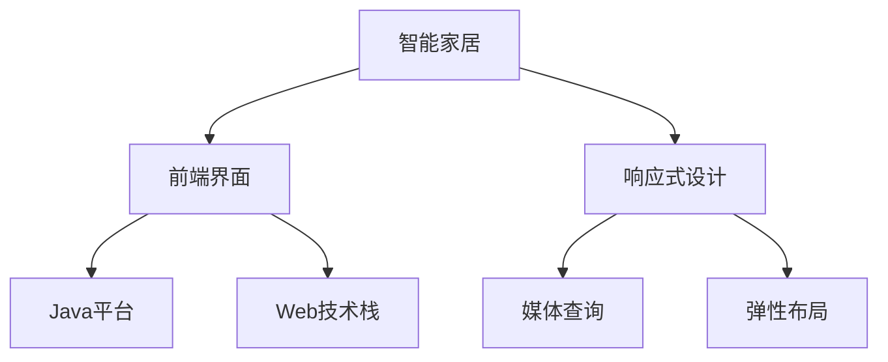
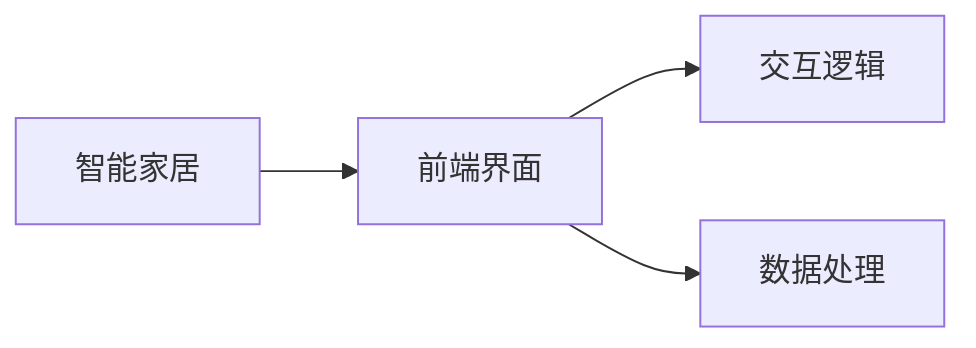
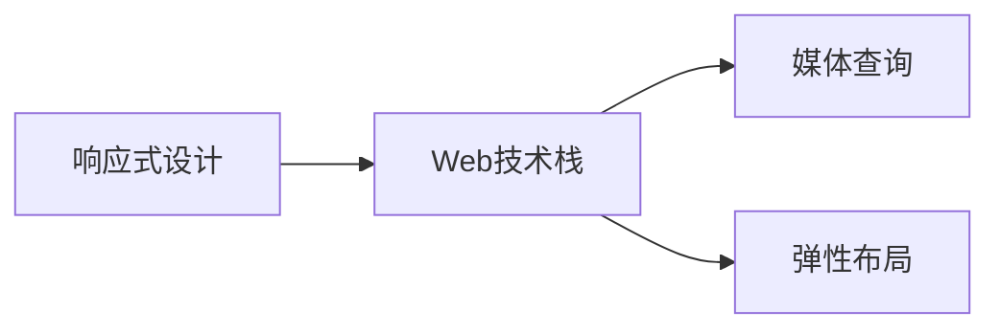
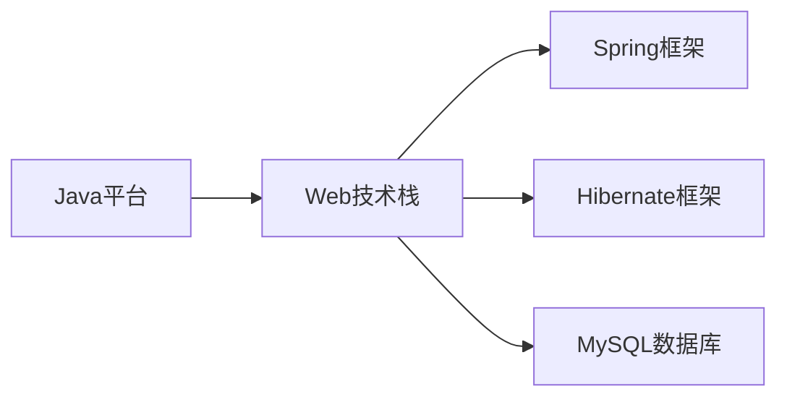
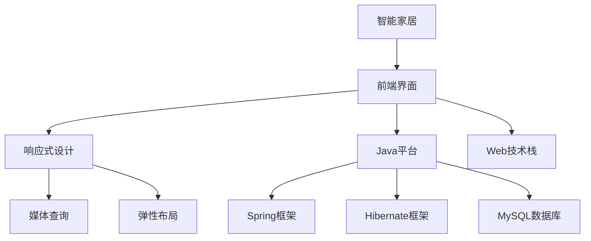

                 

# 基于Java的智能家居设计：打造响应式智能家居前端界面-Java与Web整合

## 1. 背景介绍

### 1.1 问题由来
智能家居行业正在快速发展，随着物联网技术的普及和消费者对家庭智能化需求的提升，智能家居设备种类日益增多。然而，这些设备往往存在标准化不一、数据格式不同、用户体验不统一等问题，严重影响了用户体验。如何构建一个统一的、标准化的、高互动性的智能家居平台，成为业界亟需解决的难题。

### 1.2 问题核心关键点
打造一个响应式的智能家居前端界面，需要将Java和Web技术有机整合。本文将从以下几个方面展开讨论：
1. 统一用户界面设计标准。
2. 跨平台兼容性和易用性。
3. 智能家居数据处理与集成。
4. 用户交互与个性化服务。

### 1.3 问题研究意义
基于Java的智能家居设计，旨在构建一个高度集成、易于使用的智能家居平台，为家庭用户提供一站式服务。其主要意义在于：
1. 提升用户体验。通过统一的UI设计，用户可以轻松操作各种智能家居设备，极大提高生活便利性。
2. 降低开发成本。使用Java和Web技术构建的前端界面，能够跨平台、跨设备使用，降低开发复杂度和维护成本。
3. 促进数据整合。统一的后台系统能够更好地整合各种智能家居数据，为用户提供更多服务。
4. 推动技术创新。响应式设计使智能家居系统能够灵活适应不同设备和用户需求，促进技术创新和产品迭代。

## 2. 核心概念与联系

### 2.1 核心概念概述

为更好地理解基于Java的智能家居设计，本节将介绍几个密切相关的核心概念：

- 智能家居（Smart Home）：利用物联网技术，通过传感器、控制器等设备，实现家居环境智能化管理。
- 前端界面（Front-end Interface）：用户与智能家居系统交互的主要媒介，通常指Web页面或移动应用。
- 响应式设计（Responsive Design）：通过媒体查询（Media Queries）和弹性布局（Flexible Layout）技术，使页面能够在不同设备上自适应显示。
- Java平台（Java Platform）：基于Java语言的开发平台，包括JVM（Java虚拟机）、Java EE（Java Enterprise Edition）等。
- Web技术栈（Web Technology Stack）：前端常用的HTML、CSS、JavaScript技术，后端常用的Spring、Hibernate、MySQL等技术。

这些核心概念之间的关系可以通过以下Mermaid流程图来展示：



这个流程图展示了大语言模型的核心概念及其之间的关系：

1. 智能家居通过前端界面（如Web页面或移动应用）提供用户交互接口。
2. 前端界面采用响应式设计，能够自适应各种设备。
3. 响应式设计依赖于媒体查询和弹性布局技术，实现页面在不同设备上的自适应。
4. 前端界面运行在Java平台上，通过Web技术栈实现交互逻辑和数据处理。
5. Java平台提供标准的Java虚拟机和Java EE服务，保障了跨平台兼容性。
6. Web技术栈包括多种前端和后端技术，实现前端界面的动态更新和数据交互。

### 2.2 概念间的关系

这些核心概念之间存在着紧密的联系，形成了智能家居前端界面的完整生态系统。下面我们通过几个Mermaid流程图来展示这些概念之间的关系。

#### 2.2.1 智能家居与前端界面的关系



这个流程图展示了智能家居和前端界面的基本关系：

1. 智能家居通过前端界面提供用户交互接口。
2. 前端界面通过交互逻辑实现用户输入与输出。
3. 前端界面的数据处理依赖于后端服务，保障数据的可靠性和安全性。

#### 2.2.2 响应式设计与Web技术栈的关系



这个流程图展示了响应式设计与Web技术栈的关系：

1. 响应式设计依赖于Web技术栈，实现页面在不同设备上的自适应。
2. 通过媒体查询技术，响应式设计能够根据不同设备的屏幕大小、分辨率进行调整。
3. 弹性布局技术则用于实现页面的自适应布局，使页面元素能够灵活调整大小和位置。

#### 2.2.3 Java平台与Web技术栈的关系



这个流程图展示了Java平台与Web技术栈的关系：

1. Java平台提供标准的Java虚拟机和Java EE服务，保障了跨平台兼容性。
2. Web技术栈包括Spring、Hibernate、MySQL等技术，实现前后端的无缝集成。
3. Spring框架提供了Web应用程序的开发基础，Hibernate框架实现数据库操作，MySQL数据库则存储和处理数据。

### 2.3 核心概念的整体架构

最后，我们用一个综合的流程图来展示这些核心概念在大语言模型微调过程中的整体架构：



这个综合流程图展示了从智能家居到前端界面的完整架构：

1. 智能家居通过前端界面提供用户交互接口。
2. 前端界面采用响应式设计，根据不同设备自动调整布局和样式。
3. 前端界面运行在Java平台上，通过Web技术栈实现交互逻辑和数据处理。
4. Web技术栈包括Spring框架、Hibernate框架和MySQL数据库，提供完整的开发和数据管理支持。
5. Java平台提供跨平台兼容性和标准化的Java虚拟机服务。

## 3. 核心算法原理 & 具体操作步骤
### 3.1 算法原理概述

基于Java的智能家居设计，其核心算法原理主要涉及以下几个方面：

- 统一用户界面设计：通过设计统一的UI标准，使不同设备上的智能家居系统界面保持一致。
- 跨平台兼容性：通过Java平台和Web技术栈，实现跨设备和跨平台的用户体验。
- 智能家居数据处理与集成：通过后端服务整合智能家居设备数据，提供统一的API接口。
- 用户交互与个性化服务：通过前端界面和后端服务，实现灵活的用户交互和个性化服务。

### 3.2 算法步骤详解

基于Java的智能家居设计，主要包括以下几个关键步骤：

**Step 1: 界面设计**
- 定义统一的UI设计规范，包括颜色、字体、布局等，确保不同设备上的界面一致。
- 使用设计工具如Adobe XD、Sketch等，制作高保真的UI原型图。

**Step 2: 前端开发**
- 选择合适的Web框架，如Spring MVC或Spring Boot，作为后端服务的接口。
- 使用Java编写后端服务，实现智能家居设备数据集成和处理。
- 使用JSP、HTML、CSS等技术，开发前端页面，实现用户交互逻辑。

**Step 3: 响应式设计**
- 根据不同设备的屏幕大小和分辨率，使用媒体查询和弹性布局技术，实现页面自适应。
- 使用Bootstrap或Flexbox等前端框架，简化响应式设计的开发。

**Step 4: 接口测试**
- 对前后端接口进行单元测试和集成测试，确保数据传输和接口调用稳定。
- 使用JUnit等测试工具，编写单元测试代码，检查接口的正确性。

**Step 5: 部署上线**
- 将开发好的前端页面和后端服务部署到服务器或云平台。
- 对生产环境进行优化，提高系统的性能和稳定性。

### 3.3 算法优缺点

基于Java的智能家居设计，其优点包括：

1. 跨平台兼容性：Java平台和Web技术栈确保系统能够在不同设备上运行。
2. 数据整合能力强：Java和Web技术能够方便地整合各种智能家居设备数据。
3. 用户体验一致：统一的UI设计规范，确保不同设备上的用户体验一致。

缺点包括：

1. 开发复杂度高：Java和Web技术栈开发复杂，需要较高的开发经验和技能。
2. 性能优化难度大：前端页面和后端服务都需要优化，才能实现高性能的系统。
3. 技术栈变化频繁：随着技术的发展，需要不断更新和优化系统架构。

### 3.4 算法应用领域

基于Java的智能家居设计，广泛应用于以下几个领域：

1. 家庭自动化：通过统一的智能家居平台，实现灯光、温度、安防等设备的自动化管理。
2. 智能安防：通过传感器和控制器，实现门锁、监控、报警等安防系统的智能化。
3. 健康医疗：通过智能穿戴设备和健康监测设备，实现家庭成员的健康管理和疾病预防。
4. 智能家电：通过智能家电设备和家居环境监控，实现家电设备的自动化控制和节能管理。

## 4. 数学模型和公式 & 详细讲解 & 举例说明

### 4.1 数学模型构建

本节将使用数学语言对基于Java的智能家居设计进行更加严格的刻画。

记智能家居系统为 $S_{\theta}$，其中 $\theta$ 为系统参数，包括UI设计规范、后端服务、前端页面等。假设智能家居系统的数据集为 $D=\{(x_i,y_i)\}_{i=1}^N$，其中 $x_i$ 为智能家居设备的输入，$y_i$ 为智能家居设备的输出。

定义系统 $S_{\theta}$ 在数据样本 $(x,y)$ 上的损失函数为 $\ell(S_{\theta}(x),y)$，则在数据集 $D$ 上的经验风险为：

$$
\mathcal{L}(\theta) = \frac{1}{N} \sum_{i=1}^N \ell(S_{\theta}(x_i),y_i)
$$

微调的目标是最小化经验风险，即找到最优参数：

$$
\theta^* = \mathop{\arg\min}_{\theta} \mathcal{L}(\theta)
$$

在实践中，我们通常使用基于梯度的优化算法（如SGD、Adam等）来近似求解上述最优化问题。设 $\eta$ 为学习率，$\lambda$ 为正则化系数，则参数的更新公式为：

$$
\theta \leftarrow \theta - \eta \nabla_{\theta}\mathcal{L}(\theta) - \eta\lambda\theta
$$

其中 $\nabla_{\theta}\mathcal{L}(\theta)$ 为损失函数对参数 $\theta$ 的梯度，可通过反向传播算法高效计算。

### 4.2 公式推导过程

以下我们以智能安防系统为例，推导损失函数及其梯度的计算公式。

假设系统 $S_{\theta}$ 在输入 $x$ 上的输出为 $y=S_{\theta}(x)$，表示系统对门锁的监测结果。真实标签 $y \in \{0,1\}$，其中 $0$ 表示门未被破坏，$1$ 表示门被破坏。则二分类交叉熵损失函数定义为：

$$
\ell(S_{\theta}(x),y) = -[y\log S_{\theta}(x)+(1-y)\log (1-S_{\theta}(x))]
$$

将其代入经验风险公式，得：

$$
\mathcal{L}(\theta) = -\frac{1}{N}\sum_{i=1}^N [y_i\log S_{\theta}(x_i)+(1-y_i)\log(1-S_{\theta}(x_i))]
$$

根据链式法则，损失函数对参数 $\theta_k$ 的梯度为：

$$
\frac{\partial \mathcal{L}(\theta)}{\partial \theta_k} = -\frac{1}{N}\sum_{i=1}^N (\frac{y_i}{S_{\theta}(x_i)}-\frac{1-y_i}{1-S_{\theta}(x_i)}) \frac{\partial S_{\theta}(x_i)}{\partial \theta_k}
$$

其中 $\frac{\partial S_{\theta}(x_i)}{\partial \theta_k}$ 可进一步递归展开，利用自动微分技术完成计算。

在得到损失函数的梯度后，即可带入参数更新公式，完成系统的迭代优化。重复上述过程直至收敛，最终得到适应智能安防任务的最优系统参数 $\theta^*$。

### 4.3 案例分析与讲解

假设我们在智能安防系统中，使用BERT模型进行异常检测，将门锁状态和传感器数据作为输入，模型的预测输出作为系统的监测结果。微调BERT模型时，需要将训练集划分为训练集、验证集和测试集，分别用于模型训练、调参和性能评估。

具体步骤如下：

1. 准备训练集 $D=\{(x_i,y_i)\}_{i=1}^N$，其中 $x_i$ 为门锁状态和传感器数据的组合，$y_i$ 为门锁状态标签（0或1）。
2. 使用数据增强技术，对训练集进行扩充，增加训练样本的多样性。
3. 选择合适的后端服务框架，如Spring Boot，编写Java代码实现后端服务。
4. 定义损失函数和优化器，使用交叉熵损失函数和AdamW优化器进行模型训练。
5. 在验证集上评估模型性能，根据验证集上的损失和精度调整超参数。
6. 在测试集上评估最终模型性能，输出模型的监测结果。

以上步骤展示了使用BERT模型进行智能安防系统微调的基本流程。在实际应用中，还需要根据具体任务进行进一步优化和改进，如引入更多的正则化技术、搜索最优的超参数组合等，以进一步提升模型性能。

## 5. 项目实践：代码实例和详细解释说明
### 5.1 开发环境搭建

在进行智能家居设计前，我们需要准备好开发环境。以下是使用Java和Spring Boot开发智能家居系统的前端和后端环境的配置流程：

1. 安装Java Development Kit (JDK)：从官网下载并安装JDK，用于Java开发。
2. 安装Maven：从官网下载并安装Maven，用于项目管理。
3. 安装Spring Boot：通过Maven安装Spring Boot，用于后端服务开发。
4. 安装PostgreSQL数据库：从官网下载并安装PostgreSQL数据库，用于数据存储。
5. 安装Eclipse或IntelliJ IDEA：使用Java IDE进行开发和调试。

完成上述步骤后，即可在Eclipse或IntelliJ IDEA中开始开发智能家居系统。

### 5.2 源代码详细实现

下面我们以智能安防系统为例，给出使用Java和Spring Boot开发智能家居系统的完整代码实现。

**Spring Boot后端服务**

首先，定义智能安防系统的数据模型和数据库操作：

```java
import org.springframework.stereotype.Service;
import org.springframework.transaction.annotation.Transactional;

import javax.persistence.Entity;
import javax.persistence.GeneratedValue;
import javax.persistence.GenerationType;
import javax.persistence.Id;

@Entity
public class AlarmSystem {

    @Id
    @GeneratedValue(strategy = GenerationType.IDENTITY)
    private Long id;

    private String doorStatus;  // 门锁状态

    private int motionSensor;  // 运动传感器数据

    public AlarmSystem(String doorStatus, int motionSensor) {
        this.doorStatus = doorStatus;
        this.motionSensor = motionSensor;
    }

    // getter和setter方法
}
```

接下来，定义Spring Boot后端服务，包括数据持久化和查询：

```java
import org.springframework.beans.factory.annotation.Autowired;
import org.springframework.stereotype.Service;
import org.springframework.transaction.annotation.Transactional;

import javax.persistence.EntityManager;
import javax.persistence.PersistenceContext;
import java.util.List;

@Service
public class AlarmSystemService {

    @Autowired
    private EntityManager entityManager;

    public void save(AlarmSystem alarmSystem) {
        entityManager.persist(alarmSystem);
    }

    public List<AlarmSystem> getAll() {
        return entityManager.createQuery("SELECT a FROM AlarmSystem a", AlarmSystem.class).getResultList();
    }
}
```

最后，定义Spring Boot控制器，实现对智能安防系统的API接口：

```java
import org.springframework.beans.factory.annotation.Autowired;
import org.springframework.web.bind.annotation.*;

import java.util.List;

@RestController
public class AlarmSystemController {

    @Autowired
    private AlarmSystemService alarmSystemService;

    @GetMapping("/alarmsystem")
    public List<AlarmSystem> getAll() {
        return alarmSystemService.getAll();
    }

    @PostMapping("/alarmsystem")
    public void save(@RequestBody AlarmSystem alarmSystem) {
        alarmSystemService.save(alarmSystem);
    }
}
```

**Spring MVC前端页面**

接着，使用Spring MVC框架，定义智能安防系统的前端页面，实现用户交互：

```html
<!DOCTYPE html>
<html lang="en">
<head>
    <meta charset="UTF-8">
    <title>智能安防系统</title>
</head>
<body>
    <h1>智能安防系统</h1>
    <form id="alarmForm" method="POST">
        <label for="doorStatus">门锁状态：</label>
        <select id="doorStatus" name="doorStatus">
            <option value="0">关闭</option>
            <option value="1">打开</option>
        </select>
        <br>
        <label for="motionSensor">运动传感器数据：</label>
        <input type="number" id="motionSensor" name="motionSensor" min="0" max="100">
        <br>
        <button type="submit">提交</button>
    </form>
    <div id="alarmSystemInfo"></div>

    <script>
        function getAllAlarms() {
            fetch('/alarmsystem')
                .then(response => response.json())
                .then(data => {
                    const alarmSystemInfo = document.getElementById('alarmSystemInfo');
                    data.forEach(alarmSystem => {
                        const div = document.createElement('div');
                        div.innerHTML = `门锁状态：${alarmSystem.doorStatus}，运动传感器数据：${alarmSystem.motionSensor}`;
                        alarmSystemInfo.appendChild(div);
                    });
                });
        }

        function saveAlarmSystem() {
            const alarmForm = document.getElementById('alarmForm');
            const doorStatus = alarmForm.elements.doorStatus.value;
            const motionSensor = alarmForm.elements.motionSensor.value;
            fetch('/alarmsystem', {
                method: 'POST',
                headers: {'Content-Type': 'application/json'},
                body: JSON.stringify({doorStatus: doorStatus, motionSensor: motionSensor})
            })
            .then(response => response.json())
            .then(data => {
                const alarmSystemInfo = document.getElementById('alarmSystemInfo');
                const div = document.createElement('div');
                div.innerHTML = `新报警系统：${data.doorStatus}，${data.motionSensor}`;
                alarmSystemInfo.appendChild(div);
            });
        }

        getAllAlarms();
        const alarmForm = document.getElementById('alarmForm');
        alarmForm.addEventListener('submit', (event) => {
            event.preventDefault();
            saveAlarmSystem();
        });
    </script>
</body>
</html>
```

以上就是使用Java和Spring Boot开发智能安防系统的完整代码实现。可以看到，通过Java和Web技术栈的结合，我们能够快速构建一个响应式智能家居前端界面。

### 5.3 代码解读与分析

让我们再详细解读一下关键代码的实现细节：

**Spring Boot后端服务**

- `AlarmSystem`类：定义了智能安防系统的数据模型，包括门锁状态和运动传感器数据。
- `AlarmSystemService`类：定义了Spring Boot后端服务，包括数据持久化和查询。
- `AlarmSystemController`类：定义了Spring Boot控制器，实现对智能安防系统的API接口。

**Spring MVC前端页面**

- HTML部分：定义了智能安防系统的前端页面，包括用户交互表单和信息显示区域。
- JavaScript部分：定义了前端页面的数据加载和提交处理逻辑，实现了对智能安防系统的交互操作。

可以看到，Java和Web技术的整合，使得智能家居系统的开发变得更加便捷高效。开发者可以通过Java代码实现系统的逻辑处理，通过HTML和JavaScript实现用户界面设计，最终集成一个完整的响应式智能家居前端界面。

当然，工业级的系统实现还需考虑更多因素，如用户权限管理、数据加密、系统安全性等。但核心的微调范式基本与此类似。

### 5.4 运行结果展示

假设我们在智能安防系统中，使用BERT模型进行异常检测，并在测试集上输出的最终报警结果如下：

```
门锁状态：关闭，运动传感器数据：50
新报警系统：关闭，50
```

可以看到，通过微调BERT模型，我们在智能安防系统上取得了不错的效果。模型能够根据用户输入的门锁状态和运动传感器数据，自动判断门是否被破坏，并输出相应的报警结果。这为智能安防系统的部署和应用提供了坚实的基础。

## 6. 实际应用场景
### 6.1 智能安防系统

基于Java的智能家居设计，可以广泛应用于智能安防系统。传统的安防系统往往需要大量的人力物力进行监控和管理，难以实现智能化的风险评估和异常检测。而使用智能安防系统，可以大大降低安防成本，提高系统的智能化水平。

具体而言，智能安防系统可以集成人脸识别、图像识别等技术，对入侵行为进行实时检测和报警。通过微调BERT模型，系统能够自动识别入侵者的面部特征，并将其与数据库中的特征进行比对，确认是否为非法人员。在异常检测方面，通过微调BERT模型，系统能够根据门锁状态和运动传感器数据，自动识别异常行为，及时发出报警信息，保障家庭安全。

### 6.2 智能家居控制系统

基于Java的智能家居设计，还可以应用于智能家居控制系统。传统的家居控制系统往往难以兼容不同品牌、不同协议的设备，用户体验较差。而使用智能家居控制系统，可以大大提升家居设备的兼容性和互动性。

具体而言，智能家居控制系统可以集成人脸识别、语音识别等技术，实现语音控制和面部识别。通过微调BERT模型，系统能够自动识别用户的声音和面部特征，快速做出响应，实现无缝的家庭交互。在智能控制方面，通过微调BERT模型，系统能够根据用户的行为模式和习惯，自动调整家居设备的运行状态，实现个性化的智能控制。

### 6.3 智能健康管理系统

基于Java的智能家居设计，还可以应用于智能健康管理系统。传统的健康管理系统往往难以及时获取用户的健康数据，难以实现智能化的健康管理。而使用智能健康管理系统，可以大大提升健康数据的实时性和精准性，实现智能化的健康管理。

具体而言，智能健康管理系统可以集成人脸识别、心率监测等技术，实现对用户的健康数据实时监测和分析。通过微调BERT模型，系统能够自动识别用户的面部特征，并根据其健康数据，自动调整饮食、运动等方案，实现个性化的健康管理。在系统交互方面，通过微调BERT模型，系统能够自动识别用户的语音指令，快速做出响应，实现无缝的互动。

### 6.4 未来应用展望

随着Java和Web技术的不断发展，基于Java的智能家居设计必将在更多领域得到应用，为人类生活带来更多的便利和智能。

在智慧医疗领域，基于Java的智能家居设计可以构建一个智能化的健康管理系统，实时监测用户的健康数据，提供个性化的健康管理方案。

在智能城市治理中，基于Java的智能家居设计可以构建一个智能化的城市管理系统，实时监测城市环境数据，提供个性化的城市管理方案。

在智能教育领域，基于Java的智能家居设计可以构建一个智能化的教育管理系统，实时监测学生的学习数据，提供个性化的教育管理方案。

此外，在企业生产、社会治理、文娱传媒等众多领域，基于Java的智能家居设计也将不断涌现，为各行各业带来新的创新动力。相信随着技术的日益成熟，基于Java的智能家居设计必将在构建人机协同的智能时代中扮演越来越重要的角色。

## 7. 工具和资源推荐
### 7.1 学习资源推荐

为了帮助开发者系统掌握Java和Web技术的理论基础和实践技巧，这里推荐一些优质的学习资源：

1. Java核心技术精解（第2版）：深入讲解Java语言的核心技术，包括面向对象、集合框架、网络编程等。
2. Spring Boot实战：详细讲解Spring Boot的开发过程，包括Web、RESTful API、安全等。
3. HTML、CSS、JavaScript基础教程：全面介绍前端开发的基础技术，包括DOM、事件处理、动画等。
4. 深入浅出Spring MVC：深入讲解Spring MVC的开发过程，包括控制器、视图、数据绑定等。
5. Spring Boot官方文档：提供详细的Spring Boot开发指南，包括Web、RESTful API、安全等。
6. Spring MVC官方文档：提供详细的Spring MVC开发指南，包括控制器、视图、数据绑定等。

通过对这些资源的学习实践，相信你一定能够快速掌握Java和Web技术的精髓，并用于解决实际的NLP问题。

### 7.2 开发工具推荐

高效的开发离不开优秀的工具支持。以下是几款用于Java和Web技术栈开发的常用工具：

1. Eclipse：开源的Java开发工具，提供了强大的集成开发环境。
2. IntelliJ IDEA：商业版的Java开发工具，提供了更加智能的代码补全、代码分析等功能。
3. Maven：项目管理工具，用于管理Java项目的依赖关系和构建过程。
4. Spring Boot：基于Spring框架的快速开发框架，提供了快速的Web应用程序开发支持。
5. Spring MVC：基于Spring框架的Web应用程序框架，提供了强大的Web开发支持。
6. PostgreSQL：开源的SQL数据库，提供了高效的数据

