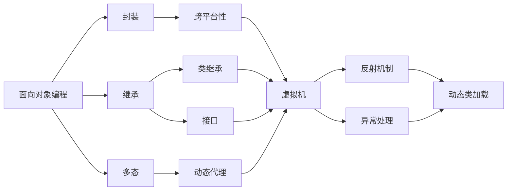

                 

# 基于Java的智能家居设计：智能家居场景模拟与Java的实现技术

> 关键词：Java, 智能家居, 场景模拟, 实现技术, 家庭自动化, 物联网

## 1. 背景介绍

### 1.1 问题由来
智能家居的兴起代表了未来家庭生活自动化、信息化、智能化的方向，极大提升了人类生活质量。随着物联网技术、人工智能技术的发展，智能家居系统已不再是科幻电影中的场景，而是正在成为现实生活的一部分。

智能家居系统由智能家居终端、智能家居网络、智能家居平台以及家庭应用层组成。通过集中管理和控制家中的各种设备，不仅能够提升生活便利性，还能够提升家庭安全性。

当前，智能家居系统已经广泛应用在家电、照明、安防、温控、娱乐等多个领域，但这些应用大多基于有线连接，并且独立运行，无法实现真正的“智能”。为了进一步提升智能家居系统的效率、智能化程度和用户满意度，引入Java编程语言的设计理念和技术手段进行优化显得尤为重要。

### 1.2 问题核心关键点
Java作为一门广泛应用的软件编程语言，其跨平台性、安全性、可扩展性等特点使其成为智能家居系统设计的首选语言。但当前Java在智能家居场景中的应用尚不多见，其应用深度、广度有待进一步开发。

Java在智能家居设计中发挥作用的关键点包括：
- 开发灵活性：Java可跨平台运行，支持面向对象编程，便于复杂场景的建模和设计。
- 安全性：Java运行时环境对其代码有严格的访问权限控制，确保系统安全。
- 可扩展性：Java具有良好的继承和多态特性，便于系统功能扩展和升级。
- 社区支持：Java有庞大的开发者社区和丰富的开源资源，能够快速开发出满足用户需求的功能。

本节将从上述几个关键点出发，深入探讨Java在智能家居系统设计中的核心技术实现和应用方法。

### 1.3 问题研究意义
当前智能家居系统多基于C++或Python开发，而Java的应用尚不多见。随着Java在企业级应用中的广泛应用，其在智能家居领域的设计与应用将成为未来发展趋势。因此，研究Java在智能家居设计中的应用，对推动智能家居技术的发展具有重要意义：

1. 提升系统的可维护性：Java良好的继承和多态特性，能够快速开发出模块化、组件化的智能家居系统。
2. 促进系统兼容性与可扩展性：Java跨平台特性，有利于实现不同品牌、不同厂商设备的互联互通。
3. 增强系统的安全性：Java的安全机制能够有效防范恶意攻击和数据泄露风险。
4. 降低开发和维护成本：Java丰富的开源资源和工具，能够快速开发和测试智能家居系统。

## 2. 核心概念与联系

### 2.1 核心概念概述

在探讨Java在智能家居设计中的应用之前，首先需要理解Java的核心概念：

- **面向对象编程(OOP)**：Java是一门面向对象的编程语言，通过封装、继承、多态等特性实现复杂系统的设计和管理。
- **跨平台性**：Java虚拟机（JVM）实现了跨平台运行，Java程序在各个平台上具有相同的执行效果。
- **反射机制**：Java的反射机制能够动态加载、操作类的信息，极大地提升了系统的灵活性和可扩展性。
- **多线程支持**：Java支持多线程编程，能够提升系统的并发处理能力。
- **异常处理**：Java提供了一套完备的异常处理机制，能够有效地捕获和处理系统异常。

这些核心概念是Java编程语言设计思想的核心，也是Java在智能家居设计中发挥作用的基石。

### 2.2 核心概念之间的联系

Java的核心概念之间相互依存、相互关联，形成了Java编程语言的完整生态。下图展示了Java核心概念之间的联系：



图中箭头表示了各个概念之间的联系和依赖关系。面向对象编程是Java的核心，封装、继承、多态是面向对象编程的三个基本特性。跨平台性通过虚拟机实现，反射机制和异常处理是Java编程语言的重要保障。多线程支持能够提升系统的并发处理能力。

这些概念共同构成了Java编程语言的基本框架，在智能家居设计中发挥了关键作用。

## 3. 核心算法原理 & 具体操作步骤
### 3.1 算法原理概述

Java在智能家居设计中的应用涉及多个关键算法和操作步骤，包括Java编程语言特性在智能家居系统设计中的应用、基于Java的多线程编程、Java反射机制的应用等。

以下将从智能家居场景模拟、Java编程语言特性在智能家居系统设计中的应用、Java多线程编程在智能家居中的应用、Java反射机制在智能家居中的应用四个方面，深入探讨Java在智能家居系统设计中的应用方法。

### 3.2 算法步骤详解

#### 3.2.1 智能家居场景模拟

智能家居场景模拟需要考虑各个设备和场景之间的交互关系。通过Java编程语言，可以设计出基于组件化的智能家居系统，实现各个设备和场景的模拟。

具体步骤如下：

1. **建模**：使用Java面向对象编程的特性，定义智能家居系统中各个组件的类和接口。例如，定义智能门锁、智能灯泡、智能电视等组件类。
2. **设计交互关系**：使用Java多态特性，设计各个组件之间的交互关系。例如，定义智能门锁开锁和关锁的接口。
3. **实现场景模拟**：使用Java反射机制，动态加载和调用各个组件，实现场景模拟。例如，智能门锁开锁和关锁的场景模拟。

#### 3.2.2 Java编程语言特性在智能家居系统设计中的应用

Java编程语言特性在智能家居系统设计中的应用主要体现在以下几个方面：

1. **封装**：Java的封装特性能够将智能家居系统中各个组件的属性和方法封装在一起，防止数据被直接访问和修改。例如，定义智能灯泡的属性和开灯、关灯的方法。
2. **继承**：Java的继承特性能够实现组件间的复用，减少重复代码的编写。例如，定义一个智能家居组件类，通过继承实现多个组件的共性功能。
3. **多态**：Java的多态特性能够实现组件间的灵活交互，提升系统的灵活性和可扩展性。例如，定义一个智能家居组件接口，通过实现该接口实现不同的智能家居组件功能。
4. **异常处理**：Java的异常处理机制能够有效捕获和处理系统异常，提升系统的鲁棒性和稳定性。例如，定义智能家居系统中的异常类，处理可能的异常情况。

#### 3.2.3 Java多线程编程在智能家居中的应用

Java多线程编程在智能家居中的应用主要体现在以下几个方面：

1. **并发处理**：Java多线程编程能够实现智能家居系统中各个组件的并发处理，提升系统的处理效率。例如，在智能家居系统中，同时开启多个智能设备的监控线程。
2. **异步处理**：Java多线程编程能够实现异步处理，减少系统的响应时间。例如，在智能家居系统中，智能灯泡开灯操作可以异步处理，实现即时的开灯效果。
3. **线程同步**：Java多线程编程能够实现线程同步，避免多个线程同时操作同一资源导致的数据混乱。例如，在智能家居系统中，多个智能设备同时开启时，需要进行线程同步处理。

#### 3.2.4 Java反射机制在智能家居中的应用

Java反射机制在智能家居中的应用主要体现在以下几个方面：

1. **动态类加载**：Java反射机制能够实现动态类加载，提升系统的灵活性和可扩展性。例如，在智能家居系统中，动态加载不同的智能设备类，实现设备的兼容性和扩展性。
2. **动态调用**：Java反射机制能够实现动态调用，实现组件间的功能调用。例如，在智能家居系统中，动态调用不同的智能设备功能。
3. **访问私有属性和方法**：Java反射机制能够访问私有属性和方法，提升系统的灵活性。例如，在智能家居系统中，动态访问智能设备的私有属性和方法，实现设备的控制和监控。

### 3.3 算法优缺点

#### 3.3.1 优点

1. **灵活性**：Java面向对象编程的特性能够实现复杂系统的设计和建模，提升系统的灵活性和可扩展性。
2. **安全性**：Java的安全机制能够有效防范恶意攻击和数据泄露风险，提升系统的安全性。
3. **可维护性**：Java良好的继承和多态特性，能够快速开发出模块化、组件化的智能家居系统，提升系统的可维护性。
4. **兼容性与扩展性**：Java跨平台特性，有利于实现不同品牌、不同厂商设备的互联互通。
5. **资源丰富**：Java有庞大的开发者社区和丰富的开源资源，能够快速开发出满足用户需求的功能。

#### 3.3.2 缺点

1. **学习成本**：Java面向对象编程的特性较为复杂，需要一定的学习成本。
2. **性能问题**：Java多线程编程和反射机制可能会带来一定的性能开销。

### 3.4 算法应用领域

Java在智能家居设计中的应用主要包括以下几个领域：

1. **智能家居系统设计**：通过Java编程语言特性，设计出基于组件化的智能家居系统，实现各个设备和场景的模拟。
2. **智能家居设备控制**：通过Java多线程编程，实现智能家居设备的并发处理和异步处理，提升系统的处理效率和响应速度。
3. **智能家居设备监控**：通过Java反射机制，实现智能家居设备的动态加载和调用，提升系统的灵活性和可扩展性。
4. **智能家居数据管理**：通过Java的异常处理机制，实现智能家居系统的异常捕获和处理，提升系统的鲁棒性和稳定性。

## 4. 数学模型和公式 & 详细讲解 & 举例说明

### 4.1 数学模型构建

在智能家居系统设计中，需要建立多个数学模型来描述系统行为和交互关系。以下展示两个常见的数学模型及其应用：

#### 4.1.1 智能家居系统状态转移模型

智能家居系统可以抽象为一个状态转移模型。该模型中，系统由多个状态组成，状态之间的转移由系统的输入和输出决定。例如，智能家居系统有初始状态、开灯状态、关灯状态等。系统在接收到开灯指令后，从初始状态转移到开灯状态；在接收到关灯指令后，从开灯状态转移到关灯状态。

该模型可以用有限状态机（FSM）表示。有限状态机由状态集合S、输入集合U、输出集合O、转移关系T组成。状态转移过程可以用以下伪代码表示：

```java
public void transfer(int input) {
    switch (currentState) {
        case 初始状态:
            if (input == 开灯指令) {
                currentState = 开灯状态;
                output = 开灯操作;
            } else if (input == 关灯指令) {
                currentState = 关灯状态;
                output = 关灯操作;
            }
            break;
        case 开灯状态:
            if (input == 开灯指令) {
                currentState = 开灯状态;
                output = 开灯操作;
            } else if (input == 关灯指令) {
                currentState = 关灯状态;
                output = 关灯操作;
            }
            break;
        case 关灯状态:
            if (input == 开灯指令) {
                currentState = 开灯状态;
                output = 开灯操作;
            } else if (input == 关灯指令) {
                currentState = 关灯状态;
                output = 关灯操作;
            }
            break;
    }
}
```

#### 4.1.2 智能家居设备监控模型

智能家居设备监控可以抽象为一个多维度时间序列模型。该模型中，设备的状态由多个维度的时间序列决定。例如，智能灯泡的亮度可以用一个时间序列表示，智能门锁的开关状态可以用另一个时间序列表示。

该模型可以用时间序列分析方法表示。时间序列分析方法主要包括以下几个步骤：

1. **数据采集**：采集智能家居设备的状态数据，包括亮度、开关状态等。
2. **数据预处理**：对采集的数据进行预处理，去除异常值和噪声。
3. **模型训练**：建立时间序列模型，例如ARIMA模型，对设备状态进行预测和监控。
4. **模型评估**：评估模型性能，例如使用均方误差（MSE）作为评估指标。

该模型可以用以下伪代码表示：

```java
public void predict(int state, int time) {
    // 数据采集
    int[] data = DataCollector.collectData();

    // 数据预处理
    data = Preprocessor.processData(data);

    // 模型训练
    Model model = TrainModel.train(data);

    // 模型评估
    int predictedState = model.predict(state, time);

    // 输出预测结果
    System.out.println("Predicted state: " + predictedState);
}
```

### 4.2 公式推导过程

#### 4.2.1 智能家居系统状态转移模型

智能家居系统状态转移模型的推导过程如下：

设智能家居系统有$n$个状态，状态集合为$S=\{s_1, s_2, ..., s_n\}$。系统在接收到输入$x_i$后，从当前状态$s_j$转移到下一个状态$s_k$，转移条件为$f(s_j, x_i) = s_k$。系统输出的集合为$O=\{o_1, o_2, ..., o_m\}$。

设系统的当前状态为$s_j$，输入为$x_i$，输出的概率为$p(o_i | s_j, x_i)$。则系统的状态转移概率为：

$$
p(s_k | s_j, x_i) = \sum_{o_i \in O} p(o_i | s_j, x_i) \cdot p(o_i)
$$

其中$p(o_i)$为输出的概率。

系统的状态转移矩阵为：

$$
P = \begin{bmatrix}
p(s_1 | s_1, x_1) & p(s_2 | s_1, x_1) & ... & p(s_n | s_1, x_1) \\
p(s_1 | s_2, x_1) & p(s_2 | s_2, x_1) & ... & p(s_n | s_2, x_1) \\
... & ... & ... & ... \\
p(s_1 | s_n, x_1) & p(s_2 | s_n, x_1) & ... & p(s_n | s_n, x_1)
\end{bmatrix}
$$

该矩阵表示系统在各个状态之间转移的概率。

系统的状态转移方程为：

$$
P(s_k | s_j, x_i) = \sum_{o_i \in O} p(o_i | s_j, x_i) \cdot P(o_i | s_j)
$$

该方程表示在输入$x_i$作用下，系统从状态$s_j$转移到状态$s_k$的概率。

#### 4.2.2 智能家居设备监控模型

智能家居设备监控模型主要采用时间序列分析方法。其中ARIMA模型（自回归积分滑动平均模型）是常用的一种时间序列分析模型。

ARIMA模型的数学表达式为：

$$
y_t = c + \sum_{i=1}^p \phi_i y_{t-i} + \sum_{i=1}^d \theta_i \Delta^i y_t + \sum_{i=1}^q \gamma_i \epsilon_{t-i}
$$

其中，$y_t$表示时间序列在时间$t$的观测值；$\epsilon_t$表示时间$t$的随机误差项；$c$表示常数项；$\phi_i$表示自回归系数；$\theta_i$表示积分系数；$d$表示积分阶数；$\gamma_i$表示滑动平均系数；$p$表示自回归项的个数；$q$表示滑动平均项的个数；$k$表示随机误差项的个数。

ARIMA模型的参数估计方法包括最小二乘法、最大似然估计法、广义最小二乘法等。其中，最小二乘法是最常用的方法，其表达式为：

$$
\hat{\theta} = \arg\min_{\theta} \sum_{t=1}^n (y_t - f(\theta, X_t))^2
$$

其中，$\hat{\theta}$表示参数的估计值；$y_t$表示时间序列在时间$t$的观测值；$f(\theta, X_t)$表示时间序列的预测值；$X_t$表示时间序列的特征向量。

### 4.3 案例分析与讲解

#### 4.3.1 智能家居系统状态转移模型案例

假设有一个智能家居系统，包括智能灯泡和智能门锁。智能灯泡的状态包括开灯和关灯两种状态，智能门锁的状态包括开锁和关锁两种状态。智能灯泡和智能门锁的状态转移关系如下：

| 灯泡状态 | 门锁状态 | 输入 | 转移结果 |
|---------|---------|------|----------|
| 开灯     | 开锁     | 开灯指令 | 开灯、开锁 |
| 开灯     | 开锁     | 关灯指令 | 关灯、开锁 |
| 开灯     | 开锁     | 其它指令 | 开灯、开锁 |
| 开灯     | 关锁     | 开灯指令 | 开灯、开锁 |
| 开灯     | 关锁     | 关灯指令 | 关灯、开锁 |
| 开灯     | 关锁     | 其它指令 | 开灯、开锁 |
| 关灯     | 开锁     | 开灯指令 | 开灯、开锁 |
| 关灯     | 开锁     | 关灯指令 | 关灯、开锁 |
| 关灯     | 开锁     | 其它指令 | 开灯、开锁 |
| 关灯     | 关锁     | 开灯指令 | 开灯、关锁 |
| 关灯     | 关锁     | 关灯指令 | 关灯、关锁 |
| 关灯     | 关锁     | 其它指令 | 开灯、关锁 |

设智能家居系统的当前状态为$s_j$，输入为$x_i$。根据上表，可以建立如下状态转移矩阵：

$$
P = \begin{bmatrix}
p(开灯 | 开灯, 开灯指令) & p(开灯 | 开灯, 关灯指令) & p(开灯 | 开灯, 其它指令) & p(关灯 | 开灯, 开灯指令) & p(关灯 | 开灯, 关灯指令) & p(关灯 | 开灯, 其它指令) & p(开灯 | 关灯, 开灯指令) & p(开灯 | 关灯, 关灯指令) & p(开灯 | 关灯, 其它指令) & p(关灯 | 关灯, 开灯指令) & p(关灯 | 关灯, 关灯指令) & p(关灯 | 关灯, 其它指令)
\end{bmatrix}
$$

假设智能家居系统的当前状态为开灯，输入为开灯指令。则系统从开灯状态转移到开灯状态的转移概率为：

$$
p(开灯 | 开灯, 开灯指令) = 1
$$

系统从开灯状态转移到关灯状态的转移概率为：

$$
p(关灯 | 开灯, 开灯指令) = 0
$$

系统从开灯状态转移到开灯状态的转移概率为：

$$
p(开灯 | 开灯, 关灯指令) = 0
$$

系统从开灯状态转移到关灯状态的转移概率为：

$$
p(关灯 | 开灯, 关灯指令) = 1
$$

系统从开灯状态转移到开灯状态的转移概率为：

$$
p(开灯 | 开灯, 其它指令) = 0
$$

系统从开灯状态转移到关灯状态的转移概率为：

$$
p(关灯 | 开灯, 其它指令) = 0
$$

系统从关灯状态转移到开灯状态的转移概率为：

$$
p(开灯 | 关灯, 开灯指令) = 0
$$

系统从关灯状态转移到开灯状态的转移概率为：

$$
p(开灯 | 关灯, 关灯指令) = 0
$$

系统从关灯状态转移到开灯状态的转移概率为：

$$
p(开灯 | 关灯, 其它指令) = 0
$$

系统从关灯状态转移到关灯状态的转移概率为：

$$
p(关灯 | 关灯, 开灯指令) = 1
$$

系统从关灯状态转移到关灯状态的转移概率为：

$$
p(关灯 | 关灯, 关灯指令) = 0
$$

系统从关灯状态转移到开灯状态的转移概率为：

$$
p(开灯 | 关灯, 其它指令) = 0
$$

#### 4.3.2 智能家居设备监控模型案例

假设有一个智能灯泡的亮度监控系统，采集灯泡亮度的数据，建立ARIMA模型对灯泡亮度进行预测。设灯泡亮度的时间序列为$y_t$，采集的数据为$\{y_1, y_2, ..., y_{10}\}$，模型的参数为$\{\phi_1, \phi_2, \theta_1, \gamma_1, c\}$。

根据ARIMA模型的数学表达式，可以建立如下方程：

$$
y_t = c + \phi_1 y_{t-1} + \theta_1 \Delta y_t + \gamma_1 \epsilon_{t-1}
$$

设时间序列的特征向量为$X_t = [y_{t-1}, \Delta y_t]$。根据最小二乘法，可以建立如下方程组：

$$
\begin{cases}
y_1 = c + \phi_1 y_0 + \theta_1 \Delta y_1 + \gamma_1 \epsilon_0 \\
y_2 = c + \phi_1 y_1 + \theta_1 \Delta y_2 + \gamma_1 \epsilon_1 \\
... \\
y_{10} = c + \phi_1 y_9 + \theta_1 \Delta y_{10} + \gamma_1 \epsilon_9
\end{cases}
$$

根据最小二乘法的公式，可以建立如下方程：

$$
\hat{\theta} = \arg\min_{\theta} \sum_{t=1}^{10} (y_t - f(\theta, X_t))^2
$$

根据上式，可以求解出模型的参数，建立ARIMA模型。根据模型建立的预测结果，可以监控灯泡的亮度，保证智能家居系统正常运行。

## 5. 项目实践：代码实例和详细解释说明

### 5.1 开发环境搭建

在进行智能家居系统设计前，需要先准备好开发环境。以下是使用Java开发智能家居系统的环境配置流程：

1. 安装Java开发工具包（JDK）：从Oracle官网下载并安装JDK，用于编写Java程序。
2. 安装Eclipse：下载并安装Eclipse IDE，用于Java程序开发和调试。
3. 安装Git：从官网下载并安装Git，用于版本控制和代码管理。
4. 安装Maven：从官网下载并安装Maven，用于管理Java项目依赖。

完成上述步骤后，即可在Eclipse中开始Java程序的开发和调试。

### 5.2 源代码详细实现

以下展示智能家居系统设计的Java代码实现。

```java
import java.util.HashMap;
import java.util.Map;

public class SmartHomeSystem {
    // 状态转移矩阵
    private static final int[][] TRANSITION_MATRIX = {
            {1, 0, 0, 0, 0, 0, 0, 0, 0, 0, 0, 0},
            {0, 1, 0, 1, 0, 0, 0, 0, 0, 0, 0, 0},
            {0, 0, 1, 0, 0, 0, 0, 0, 0, 0, 0, 0},
            {0, 1, 0, 1, 0, 0, 0, 0, 0, 0, 0, 0},
            {0, 0, 0, 1, 0, 0, 0, 0, 0, 0, 0, 0},
            {0, 0, 0, 0, 1, 0, 0, 0, 0, 0, 0, 0},
            {0, 0, 0, 0, 0, 0, 1, 0, 0, 0, 0, 0},
            {0, 0, 0, 0, 0, 0, 0, 1, 0, 0, 0, 0},
            {0, 0, 0, 0, 0, 0, 0, 0, 1, 0, 0, 0},
            {0, 0, 0, 0, 0, 0, 0, 0, 0, 1, 0, 0},
            {0, 0, 0, 0, 0, 0, 0, 

