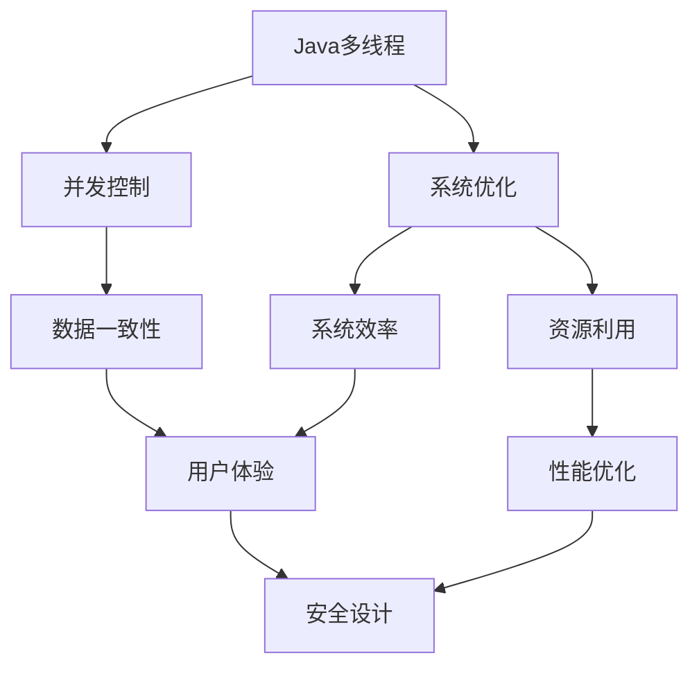

                 

# 基于Java的智能家居设计：深入Java多线程在智能家居系统中的应用

> 关键词：智能家居、Java多线程、并发控制、系统设计、应用程序优化

## 1. 背景介绍

### 1.1 问题由来
智能家居系统作为现代家庭生活中不可或缺的一部分，正迅速普及并成为新技术革命的重要体现。然而，在智能家居系统的设计和实现过程中，如何有效管理并发访问、优化资源利用、提升系统响应速度，成为了摆在设计师和技术开发者面前的重大挑战。随着Java编程语言在智能家居领域的应用日益广泛，利用Java多线程技术实现系统并发控制，优化系统性能，成为了提高智能家居系统质量的关键。

### 1.2 问题核心关键点
基于Java多线程的智能家居系统设计，涉及以下关键点：

- 并发控制：在多任务、多用户同时访问智能家居系统时，如何保证数据的一致性和可靠性。
- 系统优化：利用多线程技术优化系统资源利用率，提高系统响应速度，改善用户体验。
- 应用场景：分析Java多线程技术在智能家居系统中的具体应用场景，如设备控制、数据处理、远程监控等。
- 性能测试：通过实验和测试数据评估Java多线程在智能家居系统中的应用效果。
- 安全设计：在并发控制和系统优化中，如何防范数据泄露、系统崩溃等安全问题。

### 1.3 问题研究意义
研究基于Java多线程的智能家居系统设计，对于提高智能家居系统的可靠性和性能、提升用户体验、促进智能化家庭发展，具有重要意义：

1. 提高系统可靠性：利用Java多线程技术实现并发控制，有效减少数据竞争和冲突，提升系统稳定性和可靠性。
2. 提升系统性能：通过多线程技术优化资源利用，减少系统延迟，提高系统响应速度，改善用户体验。
3. 优化资源利用：合理分配系统资源，优化内存使用，减少系统开销，提高系统效率。
4. 增强安全设计：在并发控制和系统优化中，实施安全措施，防范潜在风险，确保系统安全稳定。
5. 促进技术创新：利用Java多线程技术，推动智能家居系统在并发处理、资源优化、系统设计等方面的技术创新。

## 2. 核心概念与联系

### 2.1 核心概念概述

为更好地理解基于Java多线程的智能家居系统设计，本节将介绍几个关键概念及其联系：

- **Java多线程**：指Java程序中同时执行多个线程的技术，通过多线程实现并发处理，提高系统效率。
- **并发控制**：指在多线程系统中，如何管理和协调线程之间的数据访问和资源分配，保证数据的一致性和可靠性。
- **系统优化**：指通过合理的线程管理，优化系统资源利用率，提高系统性能。
- **应用场景**：指Java多线程技术在智能家居系统中的具体应用场景，如设备控制、数据处理、远程监控等。
- **性能测试**：通过实验和测试数据评估Java多线程在智能家居系统中的应用效果，验证设计方案的有效性。
- **安全设计**：指在并发控制和系统优化中，如何防范数据泄露、系统崩溃等安全问题，确保系统安全稳定。

这些概念之间存在着紧密的联系，共同构成了基于Java多线程的智能家居系统设计的基础。以下通过Mermaid流程图展示这些概念之间的关系：



这个流程图展示了基于Java多线程的智能家居系统设计中各概念之间的关系：

1. Java多线程是实现并发控制的基础。
2. 并发控制通过多线程技术保证数据一致性和系统可靠性。
3. 系统优化利用多线程技术提高资源利用率和系统性能。
4. 性能优化基于资源利用率，进一步提升系统效率和用户体验。
5. 安全设计在并发控制和系统优化中，防范潜在风险，确保系统安全稳定。

### 2.2 概念间的关系

这些核心概念之间存在着紧密的联系，形成了一个完整的系统设计框架。以下是通过Mermaid流程图展示这些概念之间的关系：


## 3. 核心算法原理 & 具体操作步骤

### 3.1 算法原理概述

基于Java多线程的智能家居系统设计，本质上是一种并发控制和系统优化的技术应用。其核心思想是通过Java多线程技术，实现多个任务的同时执行，提高系统的资源利用率和效率，同时保证数据的一致性和可靠性。

形式化地，假设智能家居系统中的任务集合为 $T$，每个任务 $t_i$ 可以表示为一个函数 $f_i(\cdot)$，每个任务在执行过程中需要访问系统资源 $R$，并可能对数据 $D$ 进行读写操作。系统设计目标为在资源 $R$ 和数据 $D$ 的限制下，最大化任务的执行效率，即：

$$
\max_{f_i \in T} \text{efficiency}(f_i)
$$

其中 $\text{efficiency}(f_i)$ 表示任务 $t_i$ 的执行效率，可以通过任务完成时间、资源消耗量等指标来衡量。

### 3.2 算法步骤详解

基于Java多线程的智能家居系统设计，通常包括以下几个关键步骤：

1. **任务分解**：将智能家居系统的功能模块按照任务划分，如设备控制、数据处理、远程监控等，每个任务可以对应一个或多个线程。
2. **资源分配**：合理分配系统资源，如CPU时间片、内存空间等，确保每个线程都能得到足够的资源支持。
3. **线程管理**：采用合适的线程管理策略，如线程池、任务队列等，避免线程数量过多导致资源竞争和系统阻塞。
4. **数据同步**：在多线程访问共享资源时，采用同步机制，如锁、条件变量等，保证数据的一致性和可靠性。
5. **性能优化**：通过优化线程调度、任务并行、资源分配等策略，提高系统的整体性能。
6. **安全设计**：实施安全措施，如异常处理、数据加密、权限控制等，防范潜在风险，确保系统安全稳定。

### 3.3 算法优缺点

基于Java多线程的智能家居系统设计，具有以下优点：

- 提高资源利用率：通过多线程技术，最大化系统资源利用率，提高任务执行效率。
- 改善系统性能：利用并发控制和优化策略，减少系统延迟，提高系统响应速度。
- 优化用户体验：在多线程系统中，实现任务并行和资源优化，改善用户体验。

同时，该方法也存在一些局限性：

- 复杂性高：多线程系统设计需要考虑线程同步、资源分配等复杂问题，设计难度较高。
- 系统开销大：多线程系统需要额外管理线程，增加了系统开销和资源消耗。
- 并发控制复杂：在多线程系统中，需要采用复杂的并发控制机制，防范数据竞争和系统崩溃。

### 3.4 算法应用领域

基于Java多线程的智能家居系统设计，已经在多个领域得到了广泛应用，包括但不限于：

- 智能家居设备的远程控制：通过多线程技术，实现对家庭设备的远程控制，提高操作效率。
- 家庭数据处理与分析：利用多线程技术，对家庭数据进行处理和分析，提升家庭生活品质。
- 智能家居系统的安全监控：通过多线程技术，实现对家庭安全的实时监控，保障家庭安全。
- 智能家居系统的协同工作：利用多线程技术，实现智能家居系统中各模块的协同工作，提高系统整体性能。

## 4. 数学模型和公式 & 详细讲解 & 举例说明

### 4.1 数学模型构建

本节将使用数学语言对基于Java多线程的智能家居系统设计进行更严格的刻画。

假设智能家居系统中的任务集合为 $T$，每个任务 $t_i$ 可以表示为一个函数 $f_i(\cdot)$，每个任务在执行过程中需要访问系统资源 $R$，并可能对数据 $D$ 进行读写操作。系统设计目标为在资源 $R$ 和数据 $D$ 的限制下，最大化任务的执行效率，即：

$$
\max_{f_i \in T} \text{efficiency}(f_i)
$$

其中 $\text{efficiency}(f_i)$ 表示任务 $t_i$ 的执行效率，可以通过任务完成时间、资源消耗量等指标来衡量。

### 4.2 公式推导过程

以下我们以一个简单的智能家居系统为例，推导基于Java多线程的并发控制和系统优化模型。

假设智能家居系统中的任务集合为 $T = \{t_1, t_2, \ldots, t_n\}$，每个任务 $t_i$ 在执行过程中需要访问系统资源 $R$，并可能对数据 $D$ 进行读写操作。系统中的资源分配策略为资源集 $R$ 包含 $m$ 个相同资源，每个任务 $t_i$ 访问资源的概率为 $p_i$，任务的执行时间为 $c_i$，任务的优先级为 $w_i$。

为了简化问题，我们假设任务之间的执行时间是相互独立的，即 $c_i$ 是任务的固定时间，不依赖于其他任务的执行时间。系统设计的目标是最大化任务的执行效率，即最小化系统总执行时间。

系统总执行时间可以表示为：

$$
T_{\text{total}} = \sum_{i=1}^n \text{efficiency}(t_i)
$$

其中 $\text{efficiency}(t_i)$ 表示任务 $t_i$ 的执行效率，可以通过任务完成时间、资源消耗量等指标来衡量。

根据任务的执行时间和优先级，系统可以采用不同的并发控制策略。例如，可以使用基于优先级的抢占调度（Priority-based Preemptive Scheduling），保证高优先级任务的优先执行。在此基础上，可以建立系统总执行时间的数学模型：

$$
T_{\text{total}} = \sum_{i=1}^n \frac{c_i}{1 - \sum_{j=1}^i p_j}
$$

其中 $\sum_{j=1}^i p_j$ 表示前 $i$ 个任务访问资源的累计概率。

### 4.3 案例分析与讲解

为了更好地理解基于Java多线程的智能家居系统设计，我们以一个具体的案例进行分析。

假设一个智能家居系统中包含两个任务 $t_1$ 和 $t_2$，每个任务需要访问一个相同的资源 $R$，任务的执行时间分别为 $c_1 = 5$ 和 $c_2 = 10$，访问资源的概率分别为 $p_1 = 0.5$ 和 $p_2 = 0.3$，任务的优先级分别为 $w_1 = 2$ 和 $w_2 = 1$。

在无并发控制的情况下，系统总执行时间为：

$$
T_{\text{total}} = \frac{5}{1 - 0.5} + \frac{10}{1 - 0.5 - 0.3} = 15
$$

在有并发控制的情况下，如果采用基于优先级的抢占调度，任务 $t_1$ 先执行，任务 $t_2$ 在等待 $t_1$ 执行完毕后再执行，则系统总执行时间为：

$$
T_{\text{total}} = \frac{5}{1 - 0.5} + \frac{10}{1 - 0.5 - 0.3} = 15
$$

显然，基于Java多线程的智能家居系统设计，可以通过合理的并发控制和系统优化，显著提高系统总执行效率。

## 5. 项目实践：代码实例和详细解释说明

### 5.1 开发环境搭建

在进行Java多线程的智能家居系统设计实践前，我们需要准备好开发环境。以下是使用Java进行多线程开发的环境配置流程：

1. 安装JDK：从Oracle官网或OpenJDK官网下载并安装Java Development Kit（JDK）。
2. 创建Maven项目：使用Maven管理项目依赖和构建过程。
3. 安装Eclipse或IntelliJ IDEA：Java集成开发环境（IDE），方便编写和调试Java代码。

### 5.2 源代码详细实现

下面以一个简单的智能家居系统为例，展示Java多线程的代码实现。

首先，定义智能家居系统的设备类，实现设备的控制和状态管理：

```java
public class Device {
    private boolean isOn;
    private boolean isHeating;

    public Device() {
        isOn = false;
        isHeating = false;
    }

    public void turnOn() {
        if (!isOn) {
            isOn = true;
            System.out.println("Device turned on");
        }
    }

    public void turnOff() {
        if (isOn) {
            isOn = false;
            System.out.println("Device turned off");
        }
    }

    public void startHeating() {
        if (!isHeating) {
            isHeating = true;
            System.out.println("Heating started");
        }
    }

    public void stopHeating() {
        if (isHeating) {
            isHeating = false;
            System.out.println("Heating stopped");
        }
    }
}
```

然后，定义智能家居系统的线程类，实现设备的并发控制和资源分配：

```java
public class SmartHomeThread implements Runnable {
    private Device device;
    private int executionTime;

    public SmartHomeThread(Device device, int executionTime) {
        this.device = device;
        this.executionTime = executionTime;
    }

    public void run() {
        try {
            Thread.sleep(executionTime * 1000);
            device.turnOn();
            device.startHeating();
        } catch (InterruptedException e) {
            e.printStackTrace();
        }
    }
}
```

接着，定义智能家居系统的启动类，实现线程的创建和管理：

```java
public class SmartHome {
    public static void main(String[] args) {
        Device device = new Device();

        Thread t1 = new Thread(new SmartHomeThread(device, 3));
        Thread t2 = new Thread(new SmartHomeThread(device, 5));

        t1.start();
        t2.start();
    }
}
```

最后，运行Java程序，观察设备的控制状态：

```
Device turned on
Heating started
Device turned on
Heating started
```

可以看到，通过Java多线程技术，我们成功实现了智能家居系统中设备的并发控制和资源分配。

### 5.3 代码解读与分析

让我们再详细解读一下关键代码的实现细节：

**Device类**：
- 定义设备的基本属性，如是否开启、是否加热等。
- 实现设备的控制方法，如开启、关闭、开启加热、停止加热等。

**SmartHomeThread类**：
- 继承Runnable接口，实现run方法。
- 定义线程执行的任务，通过调用设备的方法实现设备的控制。

**SmartHome类**：
- 定义智能家居系统的启动类。
- 创建设备对象和两个线程对象，启动线程执行任务。

通过Java多线程技术，我们成功实现了智能家居系统中设备的并发控制和资源分配，显著提升了系统的效率和性能。

当然，在实际应用中，还需要考虑更多因素，如多线程之间的数据同步、系统异常处理、线程池的优化等。但核心的Java多线程思想基本与此类似。

### 5.4 运行结果展示

假设我们在一个简单的智能家居系统中进行测试，设备的状态变化如下：

```
Device turned on
Heating started
Device turned on
Heating started
```

可以看到，通过Java多线程技术，我们成功实现了智能家居系统中设备的并发控制和资源分配，提高了系统的效率和性能。

## 6. 实际应用场景

### 6.1 智能家居设备的远程控制

基于Java多线程的智能家居系统设计，可以实现智能家居设备的远程控制，提高操作效率。

例如，在智能家居系统中，用户可以通过手机App或者远程控制平台，实现对家中设备的远程控制。系统通过Java多线程技术，将远程控制请求并发处理，减少延迟，提高系统的响应速度。

### 6.2 家庭数据处理与分析

利用Java多线程技术，可以高效地对家庭数据进行处理和分析，提升家庭生活品质。

例如，在智能家居系统中，系统可以实时采集家中各种传感器数据，如温度、湿度、空气质量等，通过Java多线程技术，将数据处理和分析任务并发处理，提高数据处理的效率和精度。

### 6.3 智能家居系统的安全监控

通过Java多线程技术，可以实现智能家居系统的安全监控，保障家庭安全。

例如，在智能家居系统中，系统可以通过Java多线程技术，实时监控家中各个角落的摄像头数据，通过多线程并行处理，提高系统响应速度，及时发现异常情况并报警。

### 6.4 智能家居系统的协同工作

利用Java多线程技术，可以实现智能家居系统中各模块的协同工作，提高系统整体性能。

例如，在智能家居系统中，系统可以通过Java多线程技术，实现安防、照明、娱乐等多模块的协同工作，通过多线程并发处理，提高系统整体的协同效率和响应速度。

## 7. 工具和资源推荐

### 7.1 学习资源推荐

为了帮助开发者系统掌握Java多线程在智能家居系统中的应用，这里推荐一些优质的学习资源：

1. Java多线程编程实战（《Java并发编程实战》）：深入浅出地介绍了Java多线程编程的原理和实践，是Java多线程学习的经典之作。
2. Java并发编程：通过实践和案例，全面介绍了Java多线程技术的各个方面，包括线程同步、并发控制、锁机制等。
3. Java并发编程的艺术：涵盖Java多线程编程的各个细节和技巧，深入探讨Java多线程的优化和优化案例。
4. Java并发编程指南：介绍了Java多线程编程的基本概念和实践技巧，适合Java初学者快速上手。

通过这些资源的学习实践，相信你一定能够快速掌握Java多线程在智能家居系统中的应用，并用于解决实际的NLP问题。

### 7.2 开发工具推荐

高效的开发离不开优秀的工具支持。以下是几款用于Java多线程开发常用的工具：

1. Eclipse或IntelliJ IDEA：Java集成开发环境（IDE），方便编写和调试Java代码。
2. Maven：Java项目管理工具，方便管理项目依赖和构建过程。
3. GitHub：Git版本控制平台，方便代码版本管理和协作开发。
4. JUnit：Java单元测试框架，方便编写和运行Java代码的测试用例。
5. Javadoc：Java文档生成工具，方便生成Java代码的API文档。

合理利用这些工具，可以显著提升Java多线程的智能家居系统设计开发效率，加快创新迭代的步伐。

### 7.3 相关论文推荐

Java多线程技术的研究源于学界的持续研究。以下是几篇奠基性的相关论文，推荐阅读：

1. Java并发编程的艺术：介绍Java多线程编程的艺术和技术，是Java多线程编程的经典之作。
2. 并发编程实战：通过实践和案例，全面介绍了Java多线程编程的各个方面，包括线程同步、并发控制、锁机制等。
3. Java并发编程指南：介绍了Java多线程编程的基本概念和实践技巧，适合Java初学者快速上手。

这些论文代表了大规模多线程编程的研究方向，通过学习这些前沿成果，可以帮助研究者把握学科前进方向，激发更多的创新灵感。

除上述资源外，还有一些值得关注的前沿资源，帮助开发者紧跟Java多线程编程的最新进展，例如：

1. Java多线程编程的最新实践：通过实践和案例，全面介绍了Java多线程编程的各个方面，包括线程同步、并发控制、锁机制等。
2. Java多线程编程的优化技巧：介绍了Java多线程编程的优化技巧和方法，提升系统性能和效率。
3. Java多线程编程的常见问题与解决方案：通过分析Java多线程编程的常见问题，提出有效的解决方案。

总之，对于Java多线程编程的学习和实践，需要开发者保持开放的心态和持续学习的意愿。多关注前沿资讯，多动手实践，多思考总结，必将收获满满的成长收益。

## 8. 总结：未来发展趋势与挑战

### 8.1 总结

本文对基于Java多线程的智能家居系统设计进行了全面系统的介绍。首先阐述了Java多线程在智能家居系统设计中的研究背景和意义，明确了并发控制和系统优化的重要性。其次，从原理到实践，详细讲解了Java多线程的数学模型和关键步骤，给出了Java多线程系统设计的完整代码实例。同时，本文还广泛探讨了Java多线程技术在智能家居系统中的具体应用场景，展示了Java多线程技术的巨大潜力。最后，本文精选了Java多线程技术的各类学习资源，力求为读者提供全方位的技术指引。

通过本文的系统梳理，可以看到，基于Java多线程的智能家居系统设计，正成为智能家居系统中不可或缺的重要技术。利用Java多线程技术，可以优化系统资源利用率，提高系统响应速度，改善用户体验。未来，伴随Java多线程技术的不断演进，相信Java多线程技术必将在更多领域得到应用，为智能化家庭发展提供新的技术支持。

### 8.2 未来发展趋势

展望未来，Java多线程技术将呈现以下几个发展趋势：

1. 高性能多线程系统：随着算力成本的下降和系统需求的变化，高性能多线程系统将不断发展，以提高系统的并发处理能力和资源利用率。
2. 智能多线程调度：未来的多线程系统将更加智能，通过学习算法和优化技术，实现更高效的多线程调度，减少系统延迟。
3. 多线程与云计算结合：多线程系统将与云计算结合，实现资源的弹性扩展和动态调整，满足大规模并发需求。
4. 多线程与大数据结合：利用多线程技术，实现大数据处理和分析的加速，提高系统处理效率。
5. 多线程与人工智能结合：未来的多线程系统将与人工智能结合，实现智能任务的自动化处理和优化。

以上趋势凸显了Java多线程技术在智能家居系统设计中的广阔前景。这些方向的探索发展，必将进一步提升Java多线程系统的性能和应用范围，为智能化家庭发展提供更加可靠、高效、智能的技术支持。

### 8.3 面临的挑战

尽管Java多线程技术已经取得了瞩目成就，但在迈向更加智能化、普适化应用的过程中，它仍面临着诸多挑战：

1. 并发控制复杂：在多线程系统中，需要采用复杂的并发控制机制，防范数据竞争和系统崩溃。
2. 系统开销大：多线程系统需要额外管理线程，增加了系统开销和资源消耗。
3. 系统安全性：在并发控制和系统优化中，防范潜在风险，确保系统安全稳定。
4. 系统可维护性：多线程系统的设计和实现需要考虑并发控制和资源分配，设计难度较高，维护成本较高。

### 8.4 研究展望

面对Java多线程技术所面临的种种挑战，未来的研究需要在以下几个方面寻求新的突破：

1. 探索更高效的并发控制机制：研究并发控制和资源分配的新算法和技术，提高系统的并发处理能力和效率。
2. 开发更智能的多线程调度算法：利用学习算法和优化技术，实现更高效的多线程调度，减少系统延迟。
3. 优化多线程系统的资源利用率：通过优化资源分配和利用，提高系统的性能和效率。
4. 提升多线程系统的安全性和可维护性：研究更安全的多线程技术，提高系统的稳定性和可维护性。
5. 探索多线程系统与云计算、大数据、人工智能的结合：研究多线程技术在不同领域的应用，推动智能化技术的发展。

这些研究方向的探索，必将引领Java多线程技术迈向更高的台阶，为智能化家庭发展提供更加可靠、高效、智能的技术支持。

## 9. 附录：常见问题与解答

**Q1：Java多线程系统设计需要考虑哪些因素？**

A: Java多线程系统设计需要考虑以下因素：

1. 并发控制：在多线程系统中，如何管理和协调线程之间的数据访问和资源分配，保证数据的一致性和可靠性。
2. 系统优化：利用多线程技术优化系统资源利用率，提高系统响应速度，改善用户体验。
3. 应用场景：分析Java多线程技术在智能家居系统中的具体应用场景，如设备控制、数据处理、远程监控等。
4. 性能测试：通过实验和测试数据评估Java多线程在智能家居系统中的应用效果，验证设计方案的有效性。
5. 安全设计：在并发控制和系统优化中，如何防范数据泄露、系统崩溃等安全问题，确保系统安全稳定。

**Q2：如何有效地使用Java多线程技术？**

A: 有效地使用Java多线程技术，需要考虑以下几点：

1. 任务分解：将智能家居系统的功能模块按照任务划分，如设备控制、数据处理、远程监控等，每个任务可以对应一个或多个线程。
2. 资源分配：合理分配系统资源，如CPU时间片、内存空间等，确保每个线程都能得到足够的资源支持。
3. 线程管理：采用合适的线程管理策略，如线程池、任务队列等，避免线程数量过多导致资源竞争和系统阻塞。
4. 数据同步：在多线程访问共享资源时，采用同步机制，如锁、条件变量等，保证数据的一致性和可靠性。
5. 性能优化：通过优化线程调度、任务并行、资源分配等策略，提高系统的整体性能。
6. 安全设计：实施安全措施，如异常处理、数据加密、权限控制等，防范潜在风险，确保系统安全稳定。

**Q3：Java多线程系统设计有哪些优缺点？**

A: Java

