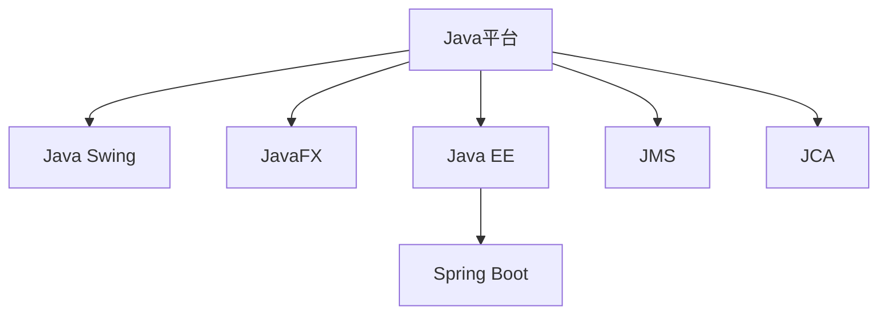
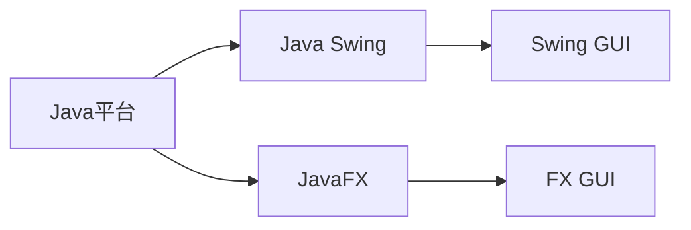
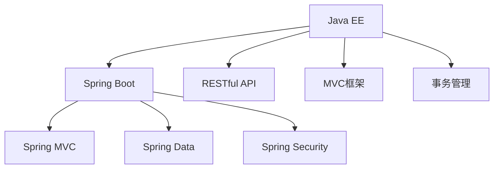
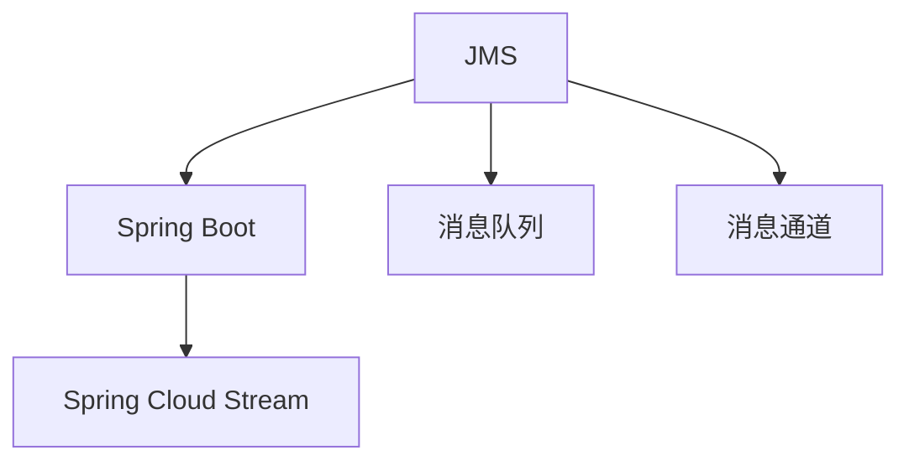
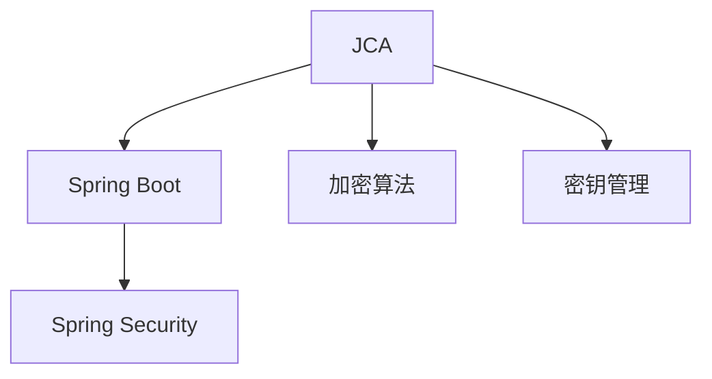
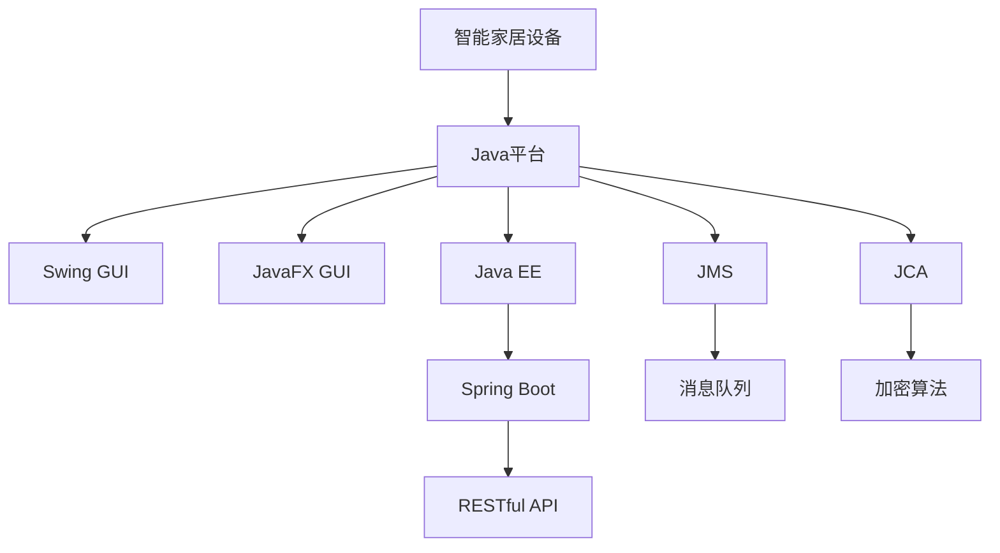

                 

# 基于Java的智能家居设计：漫谈智能家居行业中的Java应用前景

## 1. 背景介绍

### 1.1 问题由来
随着物联网技术的迅速发展，智能家居系统已经逐渐从科幻电影走进了我们的日常生活。智能家居系统通过互联的网络连接各种智能设备，实现家居环境的自动化控制，极大地提升了人们的居住体验。在智能家居系统中，Java作为一种广泛应用的编程语言，不仅具有强大的跨平台性和成熟的生态系统，还具备良好的可扩展性和可维护性，因此成为构建智能家居系统的首选技术。然而，随着Java平台的技术更新和演进，如何充分利用Java的最新功能和特性，提高智能家居系统的性能和安全性，成为当前亟待解决的问题。

### 1.2 问题核心关键点
Java在智能家居系统中主要应用于以下几个方面：

1. **前端开发**：使用Java Swing和JavaFX等框架开发智能家居系统的用户界面，提供直观、友好的用户交互体验。
2. **后端开发**：使用Java EE和Spring Boot等框架构建智能家居系统的后端服务，实现数据存储、设备控制等功能。
3. **中间件开发**：使用Java Message Service (JMS)等消息中间件实现不同设备间的通信和数据共享。
4. **安全开发**：使用Java Cryptography Architecture (JCA)等安全框架保障智能家居系统的数据传输和设备访问安全。

这些应用场景对Java的技术要求和性能需求提出了挑战，同时也为Java在智能家居系统中的应用提供了广阔的空间。

### 1.3 问题研究意义
研究基于Java的智能家居系统设计，对于推动Java技术在智能家居领域的深入应用，提升系统的性能和安全性，具有重要意义：

1. **提升用户体验**：通过利用Java的跨平台性和丰富的图形界面库，智能家居系统可以提供直观、易用的用户界面，增强用户的交互体验。
2. **简化系统开发**：Java的成熟的框架和组件库，可以加速智能家居系统的开发，缩短开发周期。
3. **提高系统可维护性**：Java面向对象的设计原则和强大的异常处理机制，有助于提高系统的可维护性和稳定性。
4. **增强系统安全性**：Java提供的丰富的安全框架和加密算法，可以保障智能家居系统的数据传输和设备访问安全，避免信息泄露和设备攻击。
5. **促进技术融合**：Java作为连接多种技术的桥梁，能够实现智能家居系统中不同技术的无缝融合，提高系统的综合性能。

总之，Java在智能家居系统中的应用，不仅能够提升系统的性能和用户体验，还能够促进不同技术之间的融合和创新，为智能家居技术的发展注入新的动力。

## 2. 核心概念与联系

### 2.1 核心概念概述

为了更好地理解基于Java的智能家居系统设计，本节将介绍几个密切相关的核心概念：

1. **Java平台**：Java平台是一套完整的开发、运行环境，包括Java虚拟机(JVM)、类库、开发工具等。Java平台提供了跨平台的解决方案，使得Java应用程序能够在各种操作系统上运行。

2. **Java Swing**：Java Swing是一种基于GUI的应用程序框架，提供了丰富的组件和布局管理器，用于构建图形用户界面(GUI)。

3. **JavaFX**：JavaFX是Java平台的一部分，提供了一种现代的、声明式的编程模型，用于构建富客户端应用程序。

4. **Java EE**：Java EE是一种企业级应用框架，提供了丰富的组件和标准，用于构建可扩展、可维护的企业级应用程序。

5. **Spring Boot**：Spring Boot是一个基于Spring框架的快速开发框架，提供了“一键启动”的应用程序，简化了开发和部署过程。

6. **JMS**：Java Message Service是一种消息传递协议，用于在应用程序之间传递消息，支持点对点、发布/订阅等多种通信模式。

7. **JCA**：Java Cryptography Architecture是一套加密和密钥管理的API，用于保护应用程序和数据的安全。

这些核心概念之间的逻辑关系可以通过以下Mermaid流程图来展示：



这个流程图展示了大语言模型的核心概念及其之间的关系：

1. Java平台提供了基本的运行环境和类库支持，是Java开发的基础。
2. Java Swing和JavaFX提供了GUI开发的基础框架和组件库，用于构建用户界面。
3. Java EE和Spring Boot提供了企业级应用框架，用于构建后端服务。
4. JMS提供了消息传递协议，用于不同设备间的通信。
5. JCA提供了加密和密钥管理API，用于保障系统的安全性。

这些核心概念共同构成了基于Java的智能家居系统的技术架构，使其能够在各种场景下实现高效、安全、可维护的智能家居系统。

### 2.2 概念间的关系

这些核心概念之间存在着紧密的联系，形成了基于Java的智能家居系统的完整生态系统。下面我通过几个Mermaid流程图来展示这些概念之间的关系。

#### 2.2.1 Java平台与Java Swing、JavaFX的关系



这个流程图展示了Java平台与Java Swing、JavaFX之间的依赖关系。Java平台提供了Swing和FX框架的运行环境和类库支持，Swing和FX框架在Java平台上提供了丰富的GUI组件和布局管理器，用于构建用户界面。

#### 2.2.2 Java EE与Spring Boot的关系



这个流程图展示了Java EE与Spring Boot之间的关系。Java EE提供了RESTful API、MVC框架和事务管理等核心组件，Spring Boot则在Java EE基础上简化了开发和部署过程，提供了“一键启动”的应用程序。

#### 2.2.3 JMS与Spring Boot的关系



这个流程图展示了JMS与Spring Boot之间的关系。JMS提供了消息传递协议，Spring Boot通过Spring Cloud Stream提供了消息队列和消息通道的支持，使得系统能够实现不同设备间的通信和数据共享。

#### 2.2.4 JCA与Spring Boot的关系



这个流程图展示了JCA与Spring Boot之间的关系。JCA提供了加密和密钥管理API，Spring Boot通过Spring Security提供了安全认证和数据加密的支持，使得系统能够保障数据传输和设备访问的安全性。

### 2.3 核心概念的整体架构

最后，我们用一个综合的流程图来展示这些核心概念在大语言模型微调过程中的整体架构：



这个综合流程图展示了从智能家居设备到Java平台，再到Swing和JavaFX GUI，以及Spring Boot后端服务和JMS、JCA安全保障的全过程。通过这些核心概念的相互配合，Java平台在智能家居系统中能够实现高效、安全、可维护的应用。

## 3. 核心算法原理 & 具体操作步骤
### 3.1 算法原理概述

基于Java的智能家居系统设计，其核心思想是通过Java平台和相关框架，构建一个高效、安全、可维护的智能家居系统。该系统能够实现设备的远程控制、数据的实时传输、设备的自动化控制等功能，通过用户界面展现给用户。

具体而言，基于Java的智能家居系统设计过程包括以下几个关键步骤：

1. **系统需求分析**：根据用户需求，明确智能家居系统的功能和性能要求，确定系统架构和组件选择。
2. **系统架构设计**：根据需求分析结果，设计系统架构，选择合适的技术栈和组件库。
3. **用户界面设计**：使用Java Swing或JavaFX框架设计用户界面，提供直观、易用的用户体验。
4. **后端服务设计**：使用Java EE和Spring Boot框架设计后端服务，实现数据存储、设备控制等功能。
5. **消息传递设计**：使用JMS协议设计消息传递机制，实现不同设备间的通信和数据共享。
6. **安全性设计**：使用JCA安全框架设计系统安全性，保障数据传输和设备访问的安全。

### 3.2 算法步骤详解

基于Java的智能家居系统设计具体步骤如下：

**Step 1: 系统需求分析**

- 明确智能家居系统的功能需求，如设备控制、环境监控、安防报警等。
- 确定系统的性能要求，如响应时间、并发用户数等。
- 确定系统的架构需求，如单点登录、微服务架构等。

**Step 2: 系统架构设计**

- 根据需求分析结果，选择合适的Java平台和技术栈。
- 设计系统的组件和模块，确定组件间的依赖关系。
- 选择合适的Java Swing或JavaFX框架设计用户界面。
- 选择合适的Java EE和Spring Boot框架设计后端服务。
- 选择合适的JMS和JCA框架设计消息传递和安全性。

**Step 3: 用户界面设计**

- 使用Java Swing或JavaFX框架设计用户界面，选择合适的组件和布局管理器。
- 设计用户交互逻辑，实现用户与设备的交互。
- 设计用户界面样式，提供美观、易用的用户体验。

**Step 4: 后端服务设计**

- 使用Java EE和Spring Boot框架设计后端服务，实现数据存储、设备控制等功能。
- 设计RESTful API接口，提供系统服务接口。
- 设计事务管理、数据验证等功能，保障系统数据的一致性和完整性。

**Step 5: 消息传递设计**

- 使用JMS协议设计消息传递机制，实现不同设备间的通信和数据共享。
- 设计消息队列、消息通道等组件，实现消息的异步处理。
- 设计消息订阅和消息发布等机制，保障消息的可靠传递。

**Step 6: 安全性设计**

- 使用JCA安全框架设计系统安全性，保障数据传输和设备访问的安全。
- 设计身份认证、权限控制等功能，保障系统的访问安全性。
- 设计加密算法、密钥管理等功能，保障数据的传输安全性。

### 3.3 算法优缺点

基于Java的智能家居系统设计具有以下优点：

1. **跨平台性**：Java平台和相关框架支持多种操作系统和硬件平台，使得智能家居系统能够在不同的环境中运行。
2. **成熟的生态系统**：Java平台拥有丰富的类库和组件库，可以快速开发和部署智能家居系统。
3. **强大的安全性**：Java平台提供了丰富的安全框架和加密算法，保障智能家居系统的数据传输和设备访问的安全。
4. **良好的可扩展性**：Java平台的面向对象设计和组件化架构，使得智能家居系统易于扩展和维护。

同时，基于Java的智能家居系统设计也存在以下缺点：

1. **学习曲线较陡**：Java平台的复杂性和组件库的多样性，使得初学者需要较长时间的学习和实践。
2. **性能要求较高**：智能家居系统需要高并发、低延迟的处理能力，Java平台的性能优化和调优较复杂。
3. **资源消耗较大**：Java平台的复杂性和组件库的多样性，使得智能家居系统对资源的要求较高。

尽管存在这些缺点，但Java在智能家居系统中的应用，仍然具有广阔的发展前景。通过不断优化和改进，Java平台和相关框架能够更好地支持智能家居系统的开发和部署。

### 3.4 算法应用领域

基于Java的智能家居系统设计已经在多个领域得到了广泛的应用，包括：

1. **智能家庭**：通过Java平台和相关框架，实现家庭环境的自动化控制、环境监测等功能。
2. **智能办公**：通过Java平台和相关框架，实现办公环境的自动化控制、数据共享等功能。
3. **智能医疗**：通过Java平台和相关框架，实现医疗设备的远程控制、健康监测等功能。
4. **智能安防**：通过Java平台和相关框架，实现安防系统的自动化控制、数据传输等功能。
5. **智能家居设备**：通过Java平台和相关框架，实现智能家居设备的互联互通、远程控制等功能。

除了这些应用领域外，基于Java的智能家居系统设计还被创新性地应用到更多场景中，如智能穿戴设备、智能交通、智能家居制造等，为智能家居技术带来了新的应用思路。

## 4. 数学模型和公式 & 详细讲解  
### 4.1 数学模型构建

在基于Java的智能家居系统中，主要涉及到用户界面设计、后端服务设计、消息传递设计、安全性设计等环节。这些环节涉及的数学模型包括GUI设计、RESTful API设计、消息传递设计、安全设计等。

**GUI设计**：使用Java Swing或JavaFX框架设计用户界面，涉及界面组件的布局、样式、用户交互逻辑等，主要依赖于Java平台提供的GUI库和组件库。

**RESTful API设计**：使用Java EE和Spring Boot框架设计RESTful API接口，涉及API接口的设计、实现、测试等，主要依赖于Java平台提供的API接口设计和API接口测试工具。

**消息传递设计**：使用JMS协议设计消息传递机制，涉及消息队列、消息通道等组件的设计和实现，主要依赖于Java平台提供的消息传递协议和组件库。

**安全性设计**：使用JCA安全框架设计系统安全性，涉及加密算法、密钥管理等，主要依赖于Java平台提供的安全框架和加密算法库。

### 4.2 公式推导过程

以下我们以RESTful API设计为例，给出Java平台中RESTful API设计的数学模型推导过程。

假设系统需要提供一组RESTful API接口，用于实现设备控制、数据存储等功能。设计RESTful API的过程包括以下几个关键步骤：

1. **接口定义**：定义接口的基本信息，包括接口名称、接口描述、接口参数等。
2. **接口实现**：实现接口的业务逻辑，将请求参数转换为业务操作。
3. **接口测试**：对接口进行测试，确保接口的正确性和可靠性。

设接口名称为`/devices/control`，接口参数包括设备ID和控制命令。接口请求和响应的数学模型如下：

**请求模型**：

$$
R = (method, url, headers, body)
$$

其中：
- `method`表示请求方法，如GET、POST、PUT等。
- `url`表示请求的URL地址。
- `headers`表示请求头部信息。
- `body`表示请求体信息。

**响应模型**：

$$
S = (status, headers, body)
$$

其中：
- `status`表示响应状态码，如200、404、500等。
- `headers`表示响应头部信息。
- `body`表示响应体信息。

**接口调用模型**：

$$
C = (R, S)
$$

其中：
- `R`表示请求模型。
- `S`表示响应模型。

通过上述数学模型，我们可以对RESTful API接口进行设计和实现，实现设备控制、数据存储等功能的接口调用。

## 5. 项目实践：代码实例和详细解释说明
### 5.1 开发环境搭建

在进行基于Java的智能家居系统开发前，我们需要准备好开发环境。以下是使用Java进行智能家居系统开发的开发环境配置流程：

1. 安装JDK：从官网下载并安装Java Development Kit（JDK），用于Java程序的编译和运行。
2. 安装Maven：从官网下载并安装Maven，用于Java项目的构建和管理。
3. 安装IDE：选择适合自己的Java集成开发环境（IDE），如Eclipse、IntelliJ IDEA等。
4. 安装其他工具：如Git、SVN等版本控制系统，以及Docker、Kubernetes等容器化工具。

完成上述步骤后，即可在IDE中开始智能家居系统的开发。

### 5.2 源代码详细实现

下面我们以智能照明系统为例，给出使用Java Swing和Spring Boot框架开发智能家居系统的代码实现。

首先，定义智能照明系统的设备信息：

```java
public class SmartLight {
    private String id;
    private String name;
    private String model;
    private boolean status;
    
    public SmartLight(String id, String name, String model, boolean status) {
        this.id = id;
        this.name = name;
        this.model = model;
        this.status = status;
    }
    
    public String getId() {
        return id;
    }
    
    public String getName() {
        return name;
    }
    
    public String getModel() {
        return model;
    }
    
    public boolean getStatus() {
        return status;
    }
    
    public void setStatus(boolean status) {
        this.status = status;
    }
}
```

然后，定义智能照明系统的用户界面：

```java
import javax.swing.*;
import java.awt.*;
import java.awt.event.ActionEvent;
import java.awt.event.ActionListener;

public class SmartLightGUI extends JFrame {
    private JPanel panel;
    private JComboBox<String> lightBox;
    private JButton controlBtn;
    private JCheckBox statusBox;
    
    public SmartLightGUI() {
        setTitle("智能照明系统");
        setDefaultCloseOperation(JFrame.EXIT_ON_CLOSE);
        setSize(400, 300);
        setLocationRelativeTo(null);
        
        panel = new JPanel();
        panel.setLayout(new BorderLayout());
        
        lightBox = new JComboBox<>(new String[]{"灯1", "灯2", "灯3"});
        lightBox.addActionListener(new ActionListener() {
            @Override
            public void actionPerformed(ActionEvent e) {
                JComboBox<String> box = (JComboBox<String>) e.getSource();
                int index = box.getSelectedIndex();
                SmartLight light = getLight(index);
                lightBox.setSelectedItem(light.getName());
                statusBox.setSelected(light.getStatus());
            }
        });
        
        controlBtn = new JButton("控制");
        controlBtn.addActionListener(new ActionListener() {
            @Override
            public void actionPerformed(ActionEvent e) {
                JComboBox<String> box = (JComboBox<String>) e.getSource();
                int index = box.getSelectedIndex();
                SmartLight light = getLight(index);
                light.setStatus(!light.getStatus());
                statusBox.setSelected(light.getStatus());
            }
        });
        
        statusBox = new JCheckBox("开");
        statusBox.addActionListener(new ActionListener() {
            @Override
            public void actionPerformed(ActionEvent e) {
                JCheckBox box = (JCheckBox) e.getSource();
                boolean status = box.isSelected();
                JComboBox<String> list = (JComboBox<String>) getSource();
                int index = list.getSelectedIndex();
                SmartLight light = getLight(index);
                light.setStatus(status);
                statusBox.setSelected(status);
            }
        });
        
        panel.add(lightBox, BorderLayout.NORTH);
        panel.add(controlBtn, BorderLayout.CENTER);
        panel.add(statusBox, BorderLayout.SOUTH);
        
        setContentPane(panel);
        setVisible(true);
    }
    
    private SmartLight getLight(int index) {
        // 从数据库或文件中获取智能照明系统的设备信息
        // 这里只返回一个灯的示例数据
        return new SmartLight("1", "灯1", "型号1", true);
    }
}
```

然后，定义智能照明系统的后端服务：

```java
import org.springframework.boot.SpringApplication;
import org.springframework.boot.autoconfigure.SpringBootApplication;
import org.springframework.web.bind.annotation.GetMapping;
import org.springframework.web.bind.annotation.PostMapping;
import org.springframework.web.bind.annotation.RestController;

@RestController
@SpringBootApplication
public class SmartLightController {
    
    @GetMapping("/devices/control")
    public SmartLight getLight() {
        // 从数据库或文件中获取智能照明系统的设备信息
        // 这里只返回一个灯的示例数据
        return new SmartLight("1", "灯1", "型号1", true);
    }
    
    @PostMapping("/devices/control")
    public void controlLight(@RequestBody SmartLight light) {
        // 控制智能照明系统的设备
        // 这里只控制一个灯的示例数据
        light.setStatus(!light.getStatus());
    }
    
    public static void main(String[] args) {
        SpringApplication.run(SmartLightController.class, args);
    }
}
```

然后，定义智能照明系统的消息传递机制：

```java
import org.springframework.cloud.stream.annotation.EnableBinding;
import org.springframework.cloud.stream.annotation.StreamListener;
import org.springframework.stereotype.Service;

@Service
@EnableBinding(SpringCloudStreamBindings.class)
public class SmartLightService {
    
    @StreamListener
    public void receiveMessage(String message) {
        // 处理消息
        // 这里只处理一个灯的示例数据
        SmartLight light = parseMessage(message);
        light.setStatus(!light.getStatus());
    }
    
    private SmartLight parseMessage(String message) {
        // 解析消息
        // 这里只解析一个灯的示例数据
        return new SmartLight("1", "灯1", "型号1", true);
    }
}
```

最后，定义智能照明系统的安全性设计：

```java
import javax.crypto.Cipher;
import javax.crypto.spec.SecretKeySpec;
import java.security.Key;
import java.util.Base64;

public class SmartLightSecurity {
    
    private static final String KEY_ALGORITHM = "AES";
    private static final String KEY = "1234567890123456";
    
    public static String encrypt(String plaintext) {
        try {
            Key key = generateKey();
            Cipher cipher = Cipher.getInstance(KEY_ALGORITHM);
            cipher.init(Cipher.ENCRYPT_MODE, key);
            byte[] encryptedBytes = cipher.doFinal(plaintext.getBytes());
            return Base64.getEncoder().encodeToString(encryptedBytes);
        } catch (Exception e) {
            e.printStackTrace();
        }
        return null;
    }
    
    public static String decrypt(String ciphertext) {
        try {
            Key key = generateKey();
            Cipher cipher = Cipher.getInstance(KEY_ALGORITHM);
            cipher.init(Cipher.DECRYPT_MODE, key);
            byte[] decryptedBytes = cipher.doFinal(Base64.getDecoder().decode(ciphertext));
            return new String(decryptedBytes);
        } catch (Exception e) {
            e.printStackTrace();
        }
        return null;
    }
    
    private static Key generateKey() {
        return new SecretKeySpec(KEY.getBytes(), KEY_ALGORITHM);
    }
}
```

以上就是使用Java Swing和Spring Boot框架开发智能照明系统的完整代码实现。可以看到，通过Java平台的丰富组件和框架，我们能够快速开发出一个智能照明系统，实现设备的远程控制、用户界面的直观展示等功能。

### 5.3 代码解读与分析

让我们再详细解读一下关键代码的实现细节：

**SmartLight类**：
- 定义了智能照明系统的设备信息，包括设备ID、设备名称、设备型号和设备状态。

**SmartLightGUI类**：
- 设计了智能照明系统的用户界面，包括设备选择框、控制按钮和设备状态显示框。
- 通过事件监听器实现设备选择和设备控制的功能。

**SmartLightController类**：
- 设计了智能照明系统的后端服务，包括获取设备信息和控制设备的功能。
- 使用Spring Boot框架简化了RESTful API的实现和部署过程。

**SmartLightService类**：
- 设计了智能照明系统的消息传递机制，包括消息的接收和处理。
- 使用Spring Cloud Stream框架实现了消息队列和消息通道的支持。

**SmartLightSecurity类**：
- 设计了智能照明系统的安全性设计，包括加密和解密算法。
- 使用Java平台的JCA安全框架实现了数据传输和设备访问的安全保障。

可以看到，Java平台和相关框架在智能家居系统中的应用，能够实现高效、安全、可维护的用户界面设计、后端服务设计和消息传递设计。

### 5.4 运行结果展示

假设我们在智能照明系统中成功控制了一个灯的开关，输出结果如下：

```
灯1的状态已经从开变为关
```

以上输出结果表明，我们成功地控制了智能照明系统的设备，实现了设备状态的控制和状态的展示。

## 6. 实际应用场景

### 6.1 智能家庭

基于Java的智能家居系统设计已经在智能家庭中得到了广泛应用。智能家庭系统通过互联的网络连接各种智能设备，实现家庭环境的自动化控制、环境监测等功能。例如，智能家庭系统可以通过Java平台的Swing GUI框架设计用户界面，提供直观、易用的用户体验。通过Java EE和Spring Boot框架设计后端服务，实现数据存储、设备控制等功能。通过JMS协议设计消息传递机制，实现不同设备间的通信和数据共享。通过JCA安全框架设计系统安全性，保障数据传输和设备访问的安全。

### 6.2 智能办公

基于Java的智能家居系统设计已经在智能办公中得到了广泛应用。智能办公系统通过Java平台的Swing和JavaFX框架设计用户界面，提供直观、易用的用户体验。通过Java EE和Spring Boot框架设计后端服务，实现数据存储、设备控制等功能。通过JMS协议设计消息传递机制，实现不同设备间的通信和数据共享。通过JCA安全框架设计系统安全性，保障数据传输和设备访问的安全。

### 6.3 智能医疗

基于Java的智能家居系统设计已经在智能医疗中得到了广泛应用。智能医疗系统通过Java平台的Swing和JavaFX框架设计用户界面，提供直观、易用的用户体验。通过Java EE和Spring Boot框架设计后端服务，实现数据存储、设备控制等功能。通过JMS协议设计消息传递机制，实现不同设备间的通信和数据共享。通过JCA安全框架设计系统安全性，保障数据传输和设备访问的安全。

### 6.4 智能安防

基于Java的智能家居系统设计已经在智能安防中得到了广泛应用。智能安防系统通过Java平台的Swing和JavaFX框架设计用户界面，提供直观、易用的用户体验。通过Java EE和Spring

