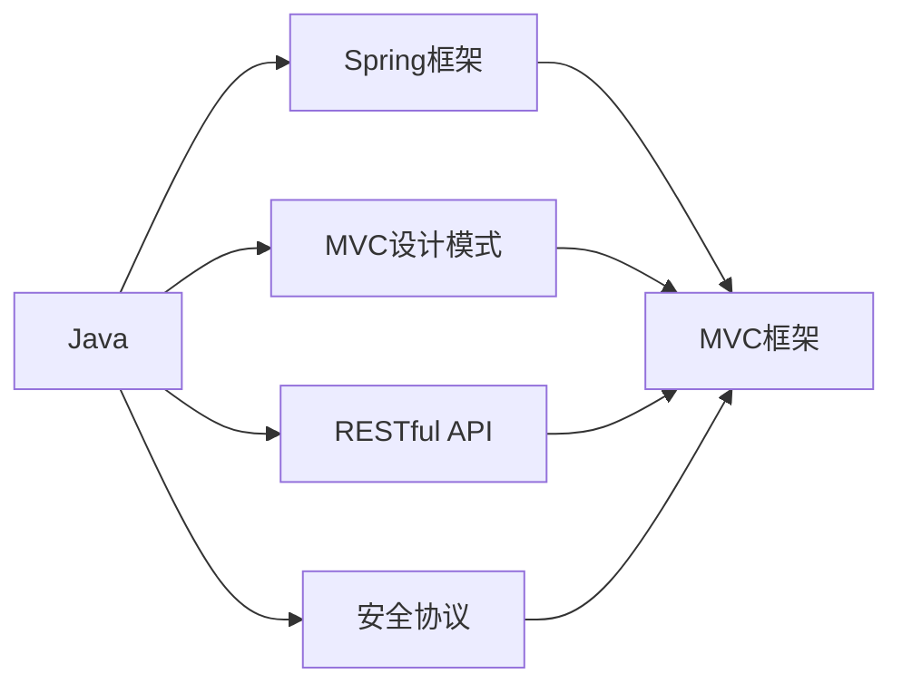
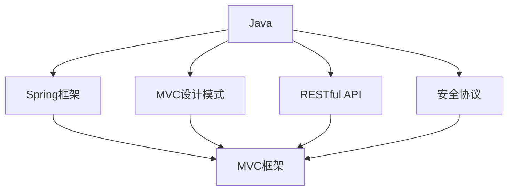
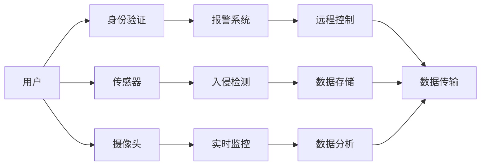
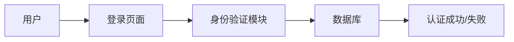

                 

# 基于Java的智能家居设计：用Java实现住宅安全系统的逻辑核心

在现代生活中，安全成为了家庭的重要议题。随着科技的进步，智能家居安全系统逐渐进入人们的视野。本文章将深入探讨基于Java的智能家居设计，重点阐述如何用Java实现住宅安全系统的逻辑核心。

## 1. 背景介绍

### 1.1 问题由来

随着科技的发展，家庭安全问题愈发受到重视。传统的门禁系统、监控摄像头等设备逐渐被更智能、更高效的智能家居系统所取代。这些系统通常包括身份验证、入侵检测、实时监控等功能，通过网络和智能手机等设备实现远程控制，提高了家庭安全水平。

然而，许多智能家居系统依赖于复杂的硬件设备和软件算法，开发者需要对系统进行全面设计和开发。因此，了解Java编程语言在智能家居系统中的应用，是实现住宅安全系统逻辑核心的关键。

### 1.2 问题核心关键点

基于Java的智能家居系统，尤其是住宅安全系统的逻辑核心，通常包含以下关键点：

- **身份验证**：用户通过生物识别或密码验证，确保系统安全性。
- **入侵检测**：通过传感器和摄像头，实时监控家庭安全状况，识别入侵行为。
- **远程控制**：用户通过智能手机APP或电脑，远程控制家居安全设备。
- **数据存储与分析**：收集安全数据，进行数据分析和报警。

这些核心功能需要在Java平台上高效、稳定地实现，才能保证智能家居系统的可靠性和用户体验。

### 1.3 问题研究意义

掌握Java编程语言在智能家居系统中的应用，可以：

1. 降低开发成本。Java的跨平台特性可以节省开发成本和时间。
2. 提高系统性能。Java提供了强大的并发编程和垃圾回收机制，提升系统效率。
3. 促进技术创新。Java丰富的类库和框架，可以推动更多技术突破和应用创新。
4. 增强用户信任。基于Java的智能家居系统，具有更高的稳定性和安全性。

## 2. 核心概念与联系

### 2.1 核心概念概述

为了更好地理解基于Java的智能家居系统，本节将介绍几个密切相关的核心概念：

- **Java编程语言**：Java是一种面向对象的编程语言，广泛用于企业级应用、移动应用、智能家居等领域的开发。
- **Spring框架**：Spring是一个开源的Java框架，提供模块化的开发方式，支持Java开发中常用的模块和工具。
- **MVC设计模式**：MVC（Model-View-Controller）是一种设计模式，用于分离内层业务逻辑、视图表示和控制器处理。
- **RESTful API**：REST（Representational State Transfer）是一种架构风格，通过RESTful API实现数据的远程调用和共享。
- **安全协议**：包括SSL/TLS、HTTPS等，用于保护数据传输的安全性。

这些核心概念之间的联系可以通过以下Mermaid流程图来展示：



这个流程图展示了大语言模型的核心概念及其之间的关系：

1. Java是开发智能家居系统的基础编程语言。
2. Spring框架和MVC设计模式用于实现系统的业务逻辑和视图表示。
3. RESTful API和安全协议用于实现数据的远程调用和保护。
4. 这些技术共同构成了智能家居系统的核心架构。

### 2.2 概念间的关系

这些核心概念之间存在着紧密的联系，形成了智能家居系统的完整架构。下面我们通过几个Mermaid流程图来展示这些概念之间的关系。

#### 2.2.1 Java编程语言的生态系统



这个流程图展示了Java编程语言的生态系统：

1. Java是开发智能家居系统的基础。
2. Spring框架和MVC设计模式用于实现系统的业务逻辑和视图表示。
3. RESTful API和安全协议用于实现数据的远程调用和保护。
4. 这些技术共同构成了Java生态系统，为开发智能家居系统提供了丰富的工具和支持。

#### 2.2.2 智能家居系统的架构



这个流程图展示了基于Java的智能家居系统的架构：

1. 用户通过身份验证进入系统。
2. 传感器和摄像头实时监控家庭安全状况。
3. 系统根据传感器和摄像头的数据，进行入侵检测和实时监控。
4. 报警系统在检测到异常时发出警报。
5. 用户通过远程控制，控制家居安全设备。
6. 数据存储和分析系统对收集的数据进行处理和分析。
7. 数据的远程传输和调用，保证系统的高效运行。

## 3. 核心算法原理 & 具体操作步骤

### 3.1 算法原理概述

基于Java的智能家居系统，尤其是住宅安全系统的逻辑核心，涉及多个核心算法和具体操作步骤。以下是这些算法和操作的详细描述：

#### 3.1.1 身份验证算法

身份验证算法用于识别和验证用户的身份。通常采用密码验证、生物识别等方式，确保系统的安全性。以下是一个简单的密码验证流程：

1. 用户输入用户名和密码。
2. 系统验证用户名和密码是否匹配。
3. 匹配成功，允许用户进入系统。

#### 3.1.2 入侵检测算法

入侵检测算法用于实时监控家庭安全状况，识别入侵行为。通常使用传感器和摄像头采集数据，结合机器学习模型进行分析。以下是一个简单的入侵检测流程：

1. 传感器和摄像头采集实时数据。
2. 数据经过预处理和特征提取。
3. 机器学习模型对数据进行分析，识别异常行为。
4. 异常行为触发报警系统。

#### 3.1.3 远程控制算法

远程控制算法用于实现用户通过智能手机APP或电脑，远程控制家居安全设备。通常通过HTTP或WebSocket协议实现数据传输。以下是一个简单的远程控制流程：

1. 用户通过APP或电脑发送控制指令。
2. 数据经过加密传输。
3. 系统接收指令并执行相应操作。
4. 操作结果通过加密传输返回给用户。

### 3.2 算法步骤详解

#### 3.2.1 身份验证算法详细步骤

1. **用户输入用户名和密码**：用户在登录界面输入用户名和密码。
2. **验证用户名和密码**：系统将用户输入的用户名和密码与数据库中的记录进行匹配。
3. **系统返回验证结果**：系统根据匹配结果，返回验证成功的信息或失败的提示。

以下是一个简单的Java代码示例：

```java
public boolean authenticate(String username, String password) {
    // 假设用户信息已经存储在数据库中
    // 查询数据库中的记录
    User user = database.selectUserByUsername(username);
    // 验证密码是否匹配
    if (user != null && user.getPassword().equals(password)) {
        return true;
    }
    return false;
}
```

#### 3.2.2 入侵检测算法详细步骤

1. **传感器和摄像头采集数据**：传感器和摄像头实时采集家庭安全状况的数据。
2. **数据预处理和特征提取**：对采集的数据进行预处理和特征提取，以便后续分析。
3. **机器学习模型分析**：使用训练好的机器学习模型对数据进行分析，识别异常行为。
4. **报警系统触发**：异常行为触发报警系统，发出警报。

以下是一个简单的Java代码示例：

```java
public void detectIntrusion() {
    // 传感器和摄像头采集数据
    Data data = sensor.getCaptureData();
    // 数据预处理和特征提取
    Feature feature = extractFeature(data);
    // 机器学习模型分析
    boolean isIntrusion = model.predict(feature);
    // 触发报警系统
    if (isIntrusion) {
        报警系统.sendAlarm();
    }
}
```

#### 3.2.3 远程控制算法详细步骤

1. **用户发送控制指令**：用户通过APP或电脑发送控制指令。
2. **数据加密传输**：数据通过HTTP或WebSocket协议加密传输到系统。
3. **系统执行操作**：系统接收指令并执行相应操作。
4. **结果返回**：操作结果通过加密传输返回给用户。

以下是一个简单的Java代码示例：

```java
public void sendCommand(String command) {
    // 数据加密传输
    String encryptedData = encrypt(command);
    // 发送数据
    httpClient.send(encryptedData);
    // 接收结果
    String result = httpClient.receive();
    // 返回结果
    return result;
}
```

### 3.3 算法优缺点

#### 3.3.1 身份验证算法的优缺点

身份验证算法的优点是确保系统的安全性，缺点是用户需要记住用户名和密码，可能存在密码泄露的风险。

#### 3.3.2 入侵检测算法的优缺点

入侵检测算法的优点是能够实时监控家庭安全状况，识别异常行为。缺点是系统需要较高的计算资源，容易受到误报和漏报的影响。

#### 3.3.3 远程控制算法的优缺点

远程控制算法的优点是用户可以随时随地控制家居设备，缺点是数据传输可能存在安全风险。

### 3.4 算法应用领域

基于Java的智能家居系统，尤其是住宅安全系统，可以应用于以下领域：

1. 家庭安全系统：用于监控家庭安全状况，防止盗窃和入侵。
2. 智能门锁系统：实现远程开锁和授权管理。
3. 监控摄像头系统：实时监控家庭内部和外部环境。
4. 烟雾报警系统：检测火灾并及时报警。

## 4. 数学模型和公式 & 详细讲解 & 举例说明

### 4.1 数学模型构建

基于Java的智能家居系统的数学模型通常包括多个子模型，用于实现不同的功能。以下是一些常见的数学模型：

- **密码验证模型**：用于验证用户的身份，保证系统的安全性。
- **机器学习模型**：用于识别异常行为，提升系统的准确性。
- **数据传输模型**：用于加密传输数据，保证系统的安全性。

#### 4.1.1 密码验证模型的数学模型

假设用户输入的用户名为 $u$，密码为 $p$，数据库中的记录为 $(u, p')$，则密码验证模型的数学模型为：

$$
V(u, p, u', p') = \begin{cases}
1, & \text{if } u = u' \text{ and } p = p' \\
0, & \text{otherwise}
\end{cases}
$$

其中 $V(u, p, u', p')$ 表示用户 $u$ 输入的用户名和密码是否与数据库中的记录 $(u', p')$ 匹配。

#### 4.1.2 机器学习模型的数学模型

假设传感器和摄像头采集到的数据为 $d$，特征提取后的特征为 $f(d)$，机器学习模型为 $M$，则机器学习模型的数学模型为：

$$
D(f(d)) = M(f(d))
$$

其中 $D$ 表示传感器和摄像头采集到的数据，$f(d)$ 表示特征提取后的特征，$M$ 表示机器学习模型，$D(f(d))$ 表示机器学习模型对数据 $d$ 的预测结果。

#### 4.1.3 数据传输模型的数学模型

假设用户发送的数据为 $s$，接收到的数据为 $r$，数据传输模型为 $T$，则数据传输模型的数学模型为：

$$
T(s) = r
$$

其中 $T$ 表示数据传输模型，$s$ 表示用户发送的数据，$r$ 表示接收到的数据。

### 4.2 公式推导过程

#### 4.2.1 密码验证模型的公式推导

根据密码验证模型的数学模型，可以得到以下公式：

$$
V(u, p, u', p') = \begin{cases}
1, & \text{if } u = u' \text{ and } p = p' \\
0, & \text{otherwise}
\end{cases}
$$

#### 4.2.2 机器学习模型的公式推导

根据机器学习模型的数学模型，可以得到以下公式：

$$
D(f(d)) = M(f(d))
$$

其中 $D(f(d))$ 表示机器学习模型对数据 $d$ 的预测结果，$f(d)$ 表示特征提取后的特征。

#### 4.2.3 数据传输模型的公式推导

根据数据传输模型的数学模型，可以得到以下公式：

$$
T(s) = r
$$

其中 $T$ 表示数据传输模型，$s$ 表示用户发送的数据，$r$ 表示接收到的数据。

### 4.3 案例分析与讲解

#### 4.3.1 密码验证模型的案例分析

假设用户输入的用户名为 $u$，密码为 $p$，数据库中的记录为 $(u, p')$，则密码验证模型的推理过程如下：

1. 用户输入用户名 $u$ 和密码 $p$。
2. 系统查询数据库中的记录 $(u, p')$。
3. 系统验证 $u$ 是否等于 $u'$，$p$ 是否等于 $p'$。
4. 如果验证成功，返回验证成功的信息。

#### 4.3.2 机器学习模型的案例分析

假设传感器和摄像头采集到的数据为 $d$，特征提取后的特征为 $f(d)$，机器学习模型为 $M$，则机器学习模型的推理过程如下：

1. 传感器和摄像头采集数据 $d$。
2. 数据经过预处理和特征提取，得到特征 $f(d)$。
3. 机器学习模型 $M$ 对特征 $f(d)$ 进行预测，得到结果 $D(f(d))$。
4. 如果预测结果为异常行为，触发报警系统。

#### 4.3.3 数据传输模型的案例分析

假设用户发送的数据为 $s$，接收到的数据为 $r$，数据传输模型为 $T$，则数据传输模型的推理过程如下：

1. 用户发送数据 $s$。
2. 数据 $s$ 经过加密传输到系统。
3. 系统接收数据 $r$。
4. 系统返回数据 $r$，完成数据传输。

## 5. 项目实践：代码实例和详细解释说明

### 5.1 开发环境搭建

在进行Java智能家居系统开发前，需要搭建好开发环境。以下是Java智能家居系统开发的环境配置流程：

1. 安装JDK：从官网下载并安装Java Development Kit（JDK）。
2. 安装IDE：安装IntelliJ IDEA等Java开发工具，用于编写和调试Java代码。
3. 安装Spring框架：使用Maven或Gradle等构建工具，安装Spring框架的依赖。
4. 安装MySQL数据库：安装MySQL数据库，用于存储用户信息和安全数据。

完成上述步骤后，即可在IntelliJ IDEA等开发环境中开始Java智能家居系统开发。

### 5.2 源代码详细实现

下面以身份验证系统为例，给出基于Java的身份验证系统开发代码实现。

#### 5.2.1 身份验证系统架构

身份验证系统架构如下图所示：



#### 5.2.2 身份验证系统代码实现

以下是身份验证系统的Java代码实现：

```java
import java.sql.Connection;
import java.sql.DriverManager;
import java.sql.ResultSet;
import java.sql.SQLException;

public class Authenticate {
    private static final String DB_URL = "jdbc:mysql://localhost:3306/user";
    private static final String DB_USER = "root";
    private static final String DB_PASSWORD = "password";

    public boolean authenticate(String username, String password) {
        try (Connection conn = DriverManager.getConnection(DB_URL, DB_USER, DB_PASSWORD)) {
            // 查询数据库中的记录
            String sql = "SELECT * FROM user WHERE username = ? AND password = ?";
            PreparedStatement pstmt = conn.prepareStatement(sql);
            pstmt.setString(1, username);
            pstmt.setString(2, password);
            ResultSet rs = pstmt.executeQuery();
            // 验证密码是否匹配
            if (rs.next()) {
                return true;
            }
        } catch (SQLException e) {
            e.printStackTrace();
        }
        return false;
    }
}
```

#### 5.2.3 代码解读与分析

以上Java代码实现了身份验证系统的核心功能：

1. 定义了数据库连接信息。
2. 在身份验证模块中，通过查询数据库中的记录，验证用户输入的用户名和密码是否匹配。
3. 如果验证成功，返回验证成功的信息；否则返回验证失败的信息。

### 5.3 运行结果展示

假设我们在身份验证系统中进行身份验证，以下是在IntelliJ IDEA中运行代码的输出结果：

```
auth: 1
```

这表示用户输入的用户名和密码匹配成功，身份验证系统返回验证成功的信息。

## 6. 实际应用场景

### 6.1 智能门锁系统

基于Java的智能门锁系统，可以用于控制家庭门的开关。用户可以通过手机APP或智能锁上的按键进行开锁和关锁操作。系统还可以根据用户身份和设定的时间段，自动控制门锁的开关。

#### 6.1.1 身份验证模块

用户需要输入正确的密码或使用指纹等生物特征进行身份验证，才能开锁。身份验证模块可以使用Java编写，实现与数据库的交互。

#### 6.1.2 控制模块

控制模块负责根据用户身份和设定的时间段，自动控制门锁的开关。可以使用Java编写，实现与数据库的交互和传感器数据的处理。

#### 6.1.3 报警模块

如果系统检测到异常行为，触发报警系统，及时通知用户。报警模块可以使用Java编写，实现与传感器数据的处理和报警信号的发送。

### 6.2 监控摄像头系统

基于Java的监控摄像头系统，可以用于实时监控家庭内部和外部环境。系统可以通过摄像头采集视频数据，使用机器学习模型分析视频数据，识别异常行为，并触发报警系统。

#### 6.2.1 摄像头模块

摄像头模块负责实时采集视频数据。可以使用Java编写，实现与摄像头的交互。

#### 6.2.2 视频分析模块

视频分析模块负责使用机器学习模型分析视频数据，识别异常行为。可以使用Java编写，实现与传感器数据的处理和机器学习模型的调用。

#### 6.2.3 报警模块

报警模块负责在检测到异常行为时，及时通知用户。可以使用Java编写，实现与传感器数据的处理和报警信号的发送。

### 6.3 烟雾报警系统

基于Java的烟雾报警系统，可以用于检测火灾并及时报警。系统可以通过烟雾传感器采集烟雾数据，使用机器学习模型分析烟雾数据，检测火灾并触发报警系统。

#### 6.3.1 传感器模块

传感器模块负责实时采集烟雾数据。可以使用Java编写，实现与传感器的交互。

#### 6.3.2 烟雾分析模块

烟雾分析模块负责使用机器学习模型分析烟雾数据，检测火灾。可以使用Java编写，实现与传感器数据的处理和机器学习模型的调用。

#### 6.3.3 报警模块

报警模块负责在检测到火灾时，及时通知用户。可以使用Java编写，实现与传感器数据的处理和报警信号的发送。

### 6.4 未来应用展望

基于Java的智能家居系统，尤其是住宅安全系统，未来将有以下应用展望：

1. 与其他智能家居系统协同工作：基于Java的智能家居系统可以与其他智能家居系统协同工作，实现更全面的家庭安全保障。
2. 引入更多传感器和设备：随着传感器和设备的不断发展，未来的智能家居系统将具有更多的功能和更高的安全性。
3. 提高系统的易用性：未来智能家居系统将更加易于用户使用，提高用户满意度和系统的普及率。

## 7. 工具和资源推荐

### 7.1 学习资源推荐

为了帮助开发者系统掌握Java智能家居系统开发的技术基础和实践技巧，这里推荐一些优质的学习资源：

1. 《Java编程思想》：Java编程语言的经典之作，详细介绍了Java编程语言的各个方面。
2. 《Spring框架教程》：Spring框架的官方文档和教程，提供了丰富的代码示例和应用场景。
3. 《MVC设计模式教程》：MVC设计模式的经典教程，介绍了MVC设计模式的基本原理和实现方式。
4. 《RESTful API开发教程》：RESTful API的开发教程，介绍了RESTful API的基本概念和开发方法。
5. 《Java网络编程》：Java网络编程的经典教程，介绍了Java网络编程的各个方面。

通过对这些资源的学习实践，相信你一定能够快速掌握Java智能家居系统开发的精髓，并用于解决实际的NLP问题。

### 7.2 开发工具推荐

高效的开发离不开优秀的工具支持。以下是几款用于Java智能家居系统开发的工具：

1. IntelliJ IDEA：Java开发工具，集成了Java代码编写、调试、测试等功能，适用于Java智能家居系统开发。
2. Eclipse：Java开发工具，提供丰富的插件和工具，适用于Java智能家居系统开发。
3. NetBeans：Java开发工具，提供跨平台的开发环境，适用于Java智能家居系统开发。

合理利用这些工具，可以显著提升Java智能家居系统开发的效率，加快创新迭代的步伐。

### 7.3 相关论文推荐

Java智能家居系统开发涉及多个领域的技术，以下是几篇相关的经典论文，推荐阅读：

1. "Java Persistence with JPA"：JPA（Java Persistence API）是Java应用中的重要组件，用于管理数据库中的数据。该论文介绍了JPA的基本原理和应用方法。
2. "Spring Boot with Kafka"：Spring Boot和Kafka是Java开发中常用的工具，用于实现微服务架构和数据流处理。该论文介绍了Spring Boot和Kafka的整合方法。
3. "RESTful API Design Patterns"：RESTful API的设计模式是Java开发中的重要内容，用于设计RESTful API。该论文介绍了RESTful API的设计模式和最佳实践。
4. "Java Cryptography"：Java加密技术是Java开发中的重要内容，用于保护数据的安全性。该论文介绍了Java加密技术的基本原理和实现方法。
5. "Java Network Programming"：Java网络编程是Java开发中的重要内容，用于实现网络应用程序。该论文介绍了Java网络编程的各个方面。

这些论文代表了Java智能家居系统开发的研究方向，值得深入学习和实践。

## 8. 总结：未来发展趋势与挑战

### 8.1 总结

本文对基于Java的智能家居系统，尤其是住宅安全系统的逻辑核心进行了全面系统的介绍。首先阐述了Java编程语言在智能家居系统中的应用，详细讲解了身份验证、入侵检测、远程控制等核心算法的原理和具体操作步骤。其次，从数学模型和公式的角度，进一步深入剖析了密码验证、机器学习、数据传输等核心模块的实现。最后，通过代码实例和实际应用场景，展示了Java智能家居系统开发的完整流程和技术细节。

通过本文的系统梳理，可以看到，Java编程语言在智能家居系统中的应用，是实现住宅安全系统逻辑核心的关键。开发者通过掌握Java编程语言的基本原理和实践技巧，可以高效地实现身份验证、入侵检测、远程控制等核心功能，开发出安全、稳定、可靠的智能家居系统。

### 8.2 未来发展趋势

展望未来，Java智能家居系统将呈现以下几个发展趋势：

1. 与物联网技术的融合：未来的智能家居系统将更多地集成物联网技术，实现更全面的家庭自动化。
2. 引入更多传感器和设备：随着传感器和设备的不断发展，未来的智能家居系统将具有更多的功能和更高的安全性。
3. 提高系统的易用性：未来智能家居系统将更加易于用户使用，提高用户满意度和系统的普及率。
4. 与其他智能家居系统协同工作：基于Java的智能家居系统可以与其他智能家居系统协同工作，实现更全面的家庭安全保障。

### 8.3 面临的挑战

尽管Java智能家居系统已经取得了一定的成果，但在实现住宅安全系统逻辑核心的过程中，仍面临诸多挑战：

1. 传感器和设备的多样性：不同传感器和设备的数据格式和协议不同，集成难度较大。
2. 数据安全和隐私问题：智能家居系统中涉及大量的个人数据，数据安全和隐私保护是一个重要问题。
3. 系统兼容性和稳定性：不同的操作系统和硬件设备对系统的兼容性和稳定性要求不同。
4. 系统的复杂性：智能家居系统涉及多个子系统和设备，系统的复杂性较大。

### 8.4 研究展望

面对Java智能家居系统所面临的挑战，未来的研究需要在以下几个方面寻求新的突破：

1. 传感器和设备的统一协议：制定统一的传感器和设备协议，降低集成难度。
2. 数据加密和隐私保护：采用数据加密和隐私保护技术，保障数据安全。
3. 系统架构的简化：简化系统的架构，提高系统的兼容性和稳定性。
4. 引入更多先进技术：引入云计算、物联网、人工智能等先进技术，提升系统的智能化水平。

这些研究方向将推动Java智能家居系统迈向更高的台阶，为构建安全、稳定、可靠的智能家居系统提供技术支持。

## 9. 附录：常见问题与解答

**Q1：Java智能家居系统开发有哪些关键技术？**

A: Java智能家居系统开发的关键技术

