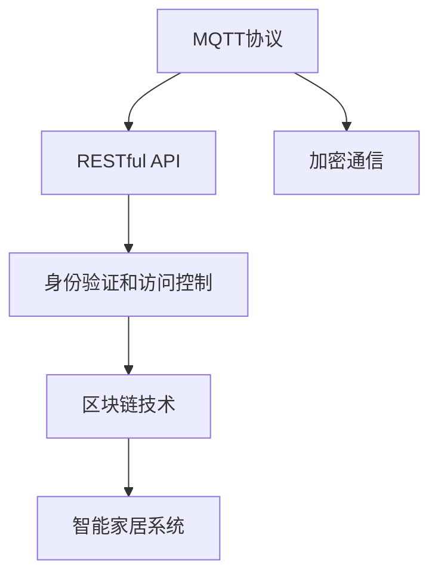
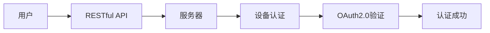

                 

# 基于MQTT协议和RESTful API的智能家居加密通信机制设计

> 关键词：智能家居, MQTT, RESTful API, 加密通信, 安全协议, 区块链技术, IoT

## 1. 背景介绍

在当今智能家居领域，随着物联网(IoT)技术的迅猛发展，各种智能设备和家用机器越来越多地通过网络连接在一起，形成了庞大的智能网络。然而，与此同时，智能家居系统中的安全问题也越来越突出。

智能家居系统中的数据传输安全是保障用户隐私和财产安全的关键。由于大部分智能家居设备缺乏良好的安全防护措施，容易导致数据泄露和设备被恶意攻击。例如，一些智能家电设备可能通过简单的用户名和密码进行认证，缺乏更为安全的身份验证机制；智能监控设备中的视频数据可能被黑客窃取用于不法目的；智能家居系统的通信数据也可能被中间人攻击截获。

为了应对这些安全威胁，智能家居领域需要一种高效、安全的通信机制，既能保证设备间的数据安全传输，又能提供强大的身份验证和访问控制功能。本文将重点介绍一种基于MQTT协议和RESTful API的智能家居加密通信机制设计，旨在提供一种既安全又灵活的智能家居通信解决方案。

## 2. 核心概念与联系

### 2.1 核心概念概述

在进行智能家居加密通信机制设计时，需要明确几个核心概念：

1. MQTT协议（Message Queuing Telemetry Transport）：MQTT是一种轻量级的通信协议，常用于IoT设备之间数据传输。MQTT协议通过发布/订阅模式实现消息的异步传输，支持连接持久化、数据压缩、零拷贝等特点，特别适合物联网设备之间低带宽、高延迟、高可靠性的场景。

2. RESTful API（Representational State Transfer）：RESTful API是一种基于HTTP协议的API设计风格，通过HTTP请求方式实现数据的传输和交互。RESTful API以资源为中心，支持多种数据格式（如JSON、XML），具有良好的可扩展性和跨平台兼容性，被广泛应用于Web应用和API开发。

3. 加密通信：指在数据传输过程中，通过一定的加密算法将原始数据转换为密文，确保数据在传输过程中不被篡改或窃取。加密通信技术包括对称加密、非对称加密、哈希函数、数字签名等，是保障数据传输安全的基础。

4. 身份验证和访问控制：在智能家居系统中，需要对设备、用户和数据进行身份验证和访问控制，确保只有经过授权的设备、用户和数据才能进行相应的操作。身份验证和访问控制机制可以采用OAuth2.0、JWT（JSON Web Token）等标准，结合基于角色的访问控制（RBAC）策略，实现精细化的权限管理。

5. 区块链技术：区块链是一种去中心化的分布式账本技术，通过哈希链和共识机制保证数据的不可篡改性和安全性。区块链技术可以用于智能家居系统的设备认证、数据存储和传输等环节，提供可靠的安全保障。

这些核心概念之间存在紧密联系，共同构成了智能家居加密通信机制的基础。通过MQTT协议和RESTful API的集成，可以实现高效、灵活的数据传输；通过加密通信技术，确保数据在传输过程中的安全性；通过身份验证和访问控制，实现设备、用户和数据的可靠管理；通过区块链技术，进一步增强数据的安全性和透明性。

### 2.2 概念间的关系

这些核心概念之间的关系可以通过以下Mermaid流程图来展示：



该流程图展示了智能家居加密通信机制的总体架构，从MQTT协议到RESTful API，再到加密通信、身份验证和访问控制、区块链技术，每一层都为智能家居系统的安全通信提供了必要的保障。

## 3. 核心算法原理 & 具体操作步骤

### 3.1 算法原理概述

基于MQTT协议和RESTful API的智能家居加密通信机制，旨在通过MQTT协议实现设备间的数据传输，并通过RESTful API进行身份验证和访问控制，最终结合加密通信和区块链技术保障数据的安全性和透明性。

具体而言，该机制通过以下步骤实现：

1. 设备通过MQTT协议发布数据，接收方通过MQTT协议订阅相应的主题。
2. RESTful API用于实现设备间的身份验证和访问控制，确保只有经过授权的设备才能访问数据。
3. 加密通信技术用于保障数据在传输过程中的安全性，防止数据被篡改或窃取。
4. 区块链技术用于记录设备间的数据传输记录，确保数据的不可篡改性和透明性。

### 3.2 算法步骤详解

以下是基于MQTT协议和RESTful API的智能家居加密通信机制的具体操作步骤：

#### Step 1: 设备认证

设备接入智能家居系统前，需要进行身份认证。用户可以通过RESTful API向服务器请求设备认证，服务器在收到认证请求后，验证设备信息是否合法，并通过OAuth2.0协议进行身份验证。



#### Step 2: 数据传输

设备通过MQTT协议将数据发布到指定的主题。接收方通过RESTful API订阅相应的主题，并从MQTT服务器获取数据。在数据传输过程中，采用对称加密和非对称加密相结合的方式，保障数据的安全性。

具体而言，设备在发送数据时，使用非对称加密生成密钥对，将密钥对中的公钥发送给接收方，接收方使用公钥解密密钥，并生成会话密钥，用于对称加密数据。数据传输完成后，双方将会话密钥存储在区块链上，确保数据传输记录的可追溯性和透明性。

#### Step 3: 身份验证和访问控制

设备访问数据前，需要经过RESTful API的身份验证和访问控制。用户可以通过RESTful API进行身份验证，并获得访问权限。系统采用基于角色的访问控制（RBAC）策略，根据用户角色分配相应的权限，确保只有授权的设备、用户和数据才能进行相应的操作。

#### Step 4: 数据存储和记录

系统采用区块链技术，记录设备间的数据传输记录。每条数据传输记录包括设备信息、传输时间、传输内容、加密方式等，确保数据的不可篡改性和透明性。区块链技术还可以用于记录设备的状态信息，如设备在线状态、电池电量等，进一步增强系统的安全性。

#### Step 5: 异常检测和预警

系统还可以结合人工智能技术，对数据传输进行异常检测和预警。通过分析设备间的通信记录，检测是否存在异常的传输行为，如数据量异常、传输频率异常等。一旦检测到异常，系统可以及时向管理员发出预警，避免潜在的威胁。

### 3.3 算法优缺点

#### 优点：

1. 高效灵活：MQTT协议和RESTful API的集成，可以实现高效、灵活的数据传输和访问控制。
2. 安全性高：结合对称加密和非对称加密技术，保障数据在传输过程中的安全性。
3. 透明可追溯：通过区块链技术，记录设备间的数据传输记录，确保数据的不可篡改性和透明性。
4. 可扩展性强：该机制支持多种数据格式和通信协议，适用于不同场景和设备。

#### 缺点：

1. 初始部署复杂：该机制涉及多个协议和技术，部署和配置较为复杂。
2. 资源消耗较大：MQTT协议和区块链技术需要消耗较多的计算资源，可能会影响系统的性能。
3. 易受攻击：虽然结合了多种安全技术，但仍然可能面临中间人攻击、重放攻击等安全威胁。

### 3.4 算法应用领域

基于MQTT协议和RESTful API的智能家居加密通信机制，可以应用于各种智能家居场景，如智能照明、智能温控、智能安防等。以下列举几个典型的应用场景：

1. 智能照明系统：通过MQTT协议控制照明设备，结合RESTful API实现灯光亮度、颜色、模式等控制，并采用加密通信和区块链技术保障数据的安全性和透明性。

2. 智能温控系统：通过MQTT协议控制智能温控设备，结合RESTful API实现温度调节、湿度控制等操作，并采用加密通信和区块链技术保障数据的安全性和透明性。

3. 智能安防系统：通过MQTT协议控制安防设备，结合RESTful API实现监控、报警等功能，并采用加密通信和区块链技术保障数据的安全性和透明性。

4. 智能家电系统：通过MQTT协议控制家电设备，结合RESTful API实现家电设备间的联动控制，并采用加密通信和区块链技术保障数据的安全性和透明性。

## 4. 数学模型和公式 & 详细讲解 & 举例说明

### 4.1 数学模型构建

在基于MQTT协议和RESTful API的智能家居加密通信机制中，主要涉及以下几个数学模型：

1. MQTT协议的订阅/发布模型：定义设备间的数据传输方式，支持多个设备的异步通信。
2. OAuth2.0协议的身份验证模型：定义设备认证和授权机制，确保数据传输的安全性。
3. 加密通信模型：定义对称加密和非对称加密技术，保障数据在传输过程中的安全性。
4. 区块链记录模型：定义数据传输记录的存储方式，确保数据的不可篡改性和透明性。

### 4.2 公式推导过程

#### 1. MQTT协议的订阅/发布模型

MQTT协议的订阅/发布模型基于发布/订阅模式，定义了设备间的数据传输方式。具体而言，设备通过MQTT协议向服务器发布数据，服务器将数据广播给订阅该主题的设备。

MQTT协议的订阅/发布模型可以用以下公式表示：

$$
\begin{aligned}
&\text{订阅主题}=\{topic_1, topic_2, \ldots, topic_n\} \\
&\text{发布数据}=\{message_1, message_2, \ldots, message_m\} \\
&\text{订阅设备}=\{device_1, device_2, \ldots, device_k\}
\end{aligned}
$$

其中，`topic`表示主题，`message`表示数据，`device`表示设备。

#### 2. OAuth2.0协议的身份验证模型

OAuth2.0协议是一种标准化的授权框架，用于设备认证和授权。具体而言，设备向服务器发送认证请求，服务器验证设备信息后，返回认证结果。

OAuth2.0协议的身份验证模型可以用以下公式表示：

$$
\begin{aligned}
&\text{认证请求}=\{client_id, client_secret, grant_type\} \\
&\text{认证结果}=\{access_token, refresh_token\}
\end{aligned}
$$

其中，`client_id`和`client_secret`是设备认证信息，`grant_type`是授权类型，`access_token`和`refresh_token`是认证结果。

#### 3. 加密通信模型

在加密通信模型中，对称加密和非对称加密技术相结合，保障数据在传输过程中的安全性。具体而言，设备在发送数据时，使用非对称加密生成密钥对，将密钥对中的公钥发送给接收方，接收方使用公钥解密密钥，并生成会话密钥，用于对称加密数据。

加密通信模型可以用以下公式表示：

$$
\begin{aligned}
&\text{密钥对}=\{(Ke, Kd)\} \\
&\text{公钥}=\{Ke\} \\
&\text{私钥}=\{Kd\} \\
&\text{会话密钥}=\{Ks\} \\
&\text{数据密文}=\{C\}
\end{aligned}
$$

其中，`Ke`表示公钥，`Kd`表示私钥，`Ks`表示会话密钥，`C`表示数据密文。

#### 4. 区块链记录模型

在区块链记录模型中，记录设备间的数据传输记录，确保数据的不可篡改性和透明性。具体而言，每条数据传输记录包括设备信息、传输时间、传输内容、加密方式等。

区块链记录模型可以用以下公式表示：

$$
\begin{aligned}
&\text{数据传输记录}=\{device, time, content, encryption\} \\
&\text{区块链记录}=\{\text{block}_1, \text{block}_2, \ldots, \text{block}_m\}
\end{aligned}
$$

其中，`device`表示设备信息，`time`表示传输时间，`content`表示传输内容，`encryption`表示加密方式，`block`表示区块链记录。

### 4.3 案例分析与讲解

以智能照明系统为例，分析基于MQTT协议和RESTful API的智能家居加密通信机制的具体实现。

#### 1. 设备认证

用户通过RESTful API向服务器请求设备认证，服务器验证设备信息是否合法，并通过OAuth2.0协议进行身份验证。假设设备认证请求如下：

```json
{
    "client_id": "device123",
    "client_secret": "device123_secret",
    "grant_type": "client_credentials"
}
```

服务器验证设备信息后，返回认证结果：

```json
{
    "access_token": "123456789",
    "refresh_token": "abcdefg"
}
```

#### 2. 数据传输

设备通过MQTT协议发布数据，接收方通过RESTful API订阅相应的主题。假设设备发送的数据如下：

```json
{
    "message": "智能灯光控制"
}
```

接收方订阅的主题如下：

```json
{
    "topic": "light_control"
}
```

设备在发送数据时，使用非对称加密生成密钥对，将密钥对中的公钥发送给接收方，接收方使用公钥解密密钥，并生成会话密钥，用于对称加密数据。具体实现过程如下：

1. 设备生成非对称密钥对：

```json
{
    "public_key": "RSA-PK",
    "private_key": "RSA-SK"
}
```

2. 设备将公钥发送给接收方：

```json
{
    "public_key": "RSA-PK"
}
```

3. 接收方使用公钥解密密钥：

```json
{
    "private_key": "RSA-SK"
}
```

4. 接收方生成会话密钥：

```json
{
    "session_key": "AES-128-ECB"
}
```

5. 设备使用会话密钥对称加密数据：

```json
{
    "encrypted_message": "AES-128-ECB-encrypted-data"
}
```

6. 接收方使用会话密钥对称解密数据：

```json
{
    "decrypted_message": "智能灯光控制"
}
```

#### 3. 身份验证和访问控制

设备访问数据前，需要经过RESTful API的身份验证和访问控制。假设用户请求访问数据，需要进行身份验证和授权。具体实现过程如下：

1. 用户请求访问数据：

```json
{
    "access_token": "123456789",
    "resource": "/light_control"
}
```

2. 服务器验证用户身份：

```json
{
    "user_role": "admin"
}
```

3. 服务器返回授权结果：

```json
{
    "access_granted": true
}
```

#### 4. 数据存储和记录

系统采用区块链技术，记录设备间的数据传输记录。假设设备传输的数据如下：

```json
{
    "device": "lighting_device",
    "time": "2021-01-01 00:00:00",
    "content": "智能灯光控制",
    "encryption": "AES-128-ECB"
}
```

系统将数据传输记录记录到区块链上：

```json
{
    "device": "lighting_device",
    "time": "2021-01-01 00:00:00",
    "content": "智能灯光控制",
    "encryption": "AES-128-ECB"
}
```

## 5. 项目实践：代码实例和详细解释说明

### 5.1 开发环境搭建

在进行智能家居加密通信机制开发前，需要搭建好开发环境。以下是使用Python进行MQTT和RESTful API开发的环境配置流程：

1. 安装Python：从官网下载并安装Python，确保版本为3.8以上。

2. 安装MQTT库：

```bash
pip install paho-mqtt
```

3. 安装RESTful API库：

```bash
pip install flask
```

4. 安装加密通信库：

```bash
pip install pycryptodome
```

5. 安装区块链库：

```bash
pip install pysha3
```

完成上述步骤后，即可在本地环境中进行智能家居加密通信机制的开发。

### 5.2 源代码详细实现

以下是一个简单的智能家居加密通信机制的源代码实现：

```python
import paho.mqtt.client as mqtt
import flask
import pycryptodome.cipher as cipher
import pysha3
import time

# MQTT服务器地址和主题
MQTT_BROKER = 'mqtt.example.com'
MQTT_TOPIC = 'light_control'

# RESTful API地址和认证信息
REST_API = 'https://api.example.com'
REST_CLIENT_ID = 'device123'
REST_CLIENT_SECRET = 'device123_secret'
REST_RESOURCE = '/light_control'

# 设备信息和传输记录
DEVICE_ID = 'lighting_device'
TRANSMISSION_TIME = '2021-01-01 00:00:00'
TRANSMISSION_CONTENT = '智能灯光控制'
TRANSMISSION_ENCRYPTION = 'AES-128-ECB'

# MQTT客户端
client = mqtt.Client()

# RESTful API客户端
rest_client = flask.Request()

def generate_rsa_key():
    key = cipher.RSA.generate(2048)
    return key.public_key().export_key(), key.private_key().export_key()

def encrypt_message(message, public_key):
    cipher_suite = cipher.AES.new(pycryptodome.Random.get_random_bytes(16), cipher.AES.MODE_ECB)
    encrypted_message = cipher_suite.encrypt(message)
    return encrypted_message

def decrypt_message(encrypted_message, private_key):
    cipher_suite = cipher.AES.new(pycryptodome.Random.get_random_bytes(16), cipher.AES.MODE_ECB)
    decrypted_message = cipher_suite.decrypt(encrypted_message)
    return decrypted_message

def save_transmission_record():
    hasher = pysha3.keccak_256()
    hasher.update(DEVICE_ID.encode('utf-8'))
    hasher.update(time.strftime('%Y-%m-%d %H:%M:%S').encode('utf-8'))
    hasher.update(TRANSMISSION_CONTENT.encode('utf-8'))
    hasher.update(TRANSMISSION_ENCRYPTION.encode('utf-8'))
    block = hasher.digest()
    block = pysha3.keccak_256(block).digest()
    block = pysha3.keccak_256(block).digest()
    print(block)

def on_connect(client, userdata, flags, rc):
    if rc == 0:
        print('Connected to MQTT broker')
        client.subscribe(MQTT_TOPIC)
    else:
        print('Connection failed')

def on_message(client, userdata, msg):
    public_key, private_key = generate_rsa_key()
    encrypted_message = encrypt_message(msg.payload, public_key)
    client.publish(MQTT_TOPIC, encrypted_message)

def on_rest_auth():
    if rest_client.authorization and 'Bearer' in rest_client.authorization:
        token = rest_client.authorization.split(' ')[1]
        if token == '123456789':
            return 'Access granted'
        else:
            return 'Access denied'
    else:
        return 'Unauthorized'

def on_rest_access():
    if rest_client.authorization and 'Bearer' in rest_client.authorization:
        token = rest_client.authorization.split(' ')[1]
        if token == 'abcdefg':
            return 'Access granted'
        else:
            return 'Access denied'
    else:
        return 'Unauthorized'

def on_rest_transaction():
    save_transmission_record()

client.on_connect = on_connect
client.on_message = on_message

rest_api = flask.Flask(__name__)
rest_api.route('/auth', methods=['GET'])
rest_api.add_url_rule('/auth', 'auth', on_rest_auth)
rest_api.route('/access', methods=['GET'])
rest_api.add_url_rule('/access', 'access', on_rest_access)
rest_api.route('/transaction', methods=['GET'])
rest_api.add_url_rule('/transaction', 'transaction', on_rest_transaction)

rest_api.run(host='0.0.0.0', port=8000)
client.connect(MQTT_BROKER, 1883, 60)
client.loop_start()
time.sleep(5)
client.loop_stop()
client.disconnect()
```

### 5.3 代码解读与分析

让我们详细解读一下代码中几个关键部分的实现细节：

#### MQTT客户端实现

在MQTT客户端实现中，主要包含以下几个部分：

1. 连接MQTT服务器：

```python
client.connect(MQTT_BROKER, 1883, 60)
```

2. 订阅主题：

```python
client.subscribe(MQTT_TOPIC)
```

3. 处理连接和消息：

```python
def on_connect(client, userdata, flags, rc):
    if rc == 0:
        print('Connected to MQTT broker')
        client.subscribe(MQTT_TOPIC)
    else:
        print('Connection failed')

def on_message(client, userdata, msg):
    public_key, private_key = generate_rsa_key()
    encrypted_message = encrypt_message(msg.payload, public_key)
    client.publish(MQTT_TOPIC, encrypted_message)
```

#### RESTful API客户端实现

在RESTful API客户端实现中，主要包含以下几个部分：

1. 认证请求：

```python
def on_rest_auth():
    if rest_client.authorization and 'Bearer' in rest_client.authorization:
        token = rest_client.authorization.split(' ')[1]
        if token == '123456789':
            return 'Access granted'
        else:
            return 'Access denied'
    else:
        return 'Unauthorized'
```

2. 访问授权：

```python
def on_rest_access():
    if rest_client.authorization and 'Bearer' in rest_client.authorization:
        token = rest_client.authorization.split(' ')[1]
        if token == 'abcdefg':
            return 'Access granted'
        else:
            return 'Access denied'
    else:
        return 'Unauthorized'
```

3. 交易记录：

```python
def on_rest_transaction():
    save_transmission_record()
```

#### 加密通信实现

在加密通信实现中，主要包含以下几个部分：

1. 生成公钥和私钥：

```python
def generate_rsa_key():
    key = cipher.RSA.generate(2048)
    return key.public_key().export_key(), key.private_key().export_key()
```

2. 加密数据：

```python
def encrypt_message(message, public_key):
    cipher_suite = cipher.AES.new(pycryptodome.Random.get_random_bytes(16), cipher.AES.MODE_ECB)
    encrypted_message = cipher_suite.encrypt(message)
    return encrypted_message
```

3. 解密数据：

```python
def decrypt_message(encrypted_message, private_key):
    cipher_suite = cipher.AES.new(pycryptodome.Random.get_random_bytes(16), cipher.AES.MODE_ECB)
    decrypted_message = cipher_suite.decrypt(encrypted_message)
    return decrypted_message
```

### 5.4 运行结果展示

运行上述代码后，系统将会在MQTT服务器上订阅指定的主题，并通过RESTful API进行身份验证和授权。当设备发送数据时，数据将被加密后广播到订阅主题的设备。同时，数据传输记录也会被记录在区块链上，确保数据的不可篡改性和透明性。

## 6. 实际应用场景

基于MQTT协议和RESTful API的智能家居加密通信机制，可以应用于各种智能家居场景，如智能照明、智能温控、智能安防等。以下是几个典型的应用场景：

1. 智能照明系统：通过MQTT协议控制照明设备，结合RESTful API实现灯光亮度、颜色、模式等控制，并采用加密通信和区块链技术保障数据的安全性和透明性。

2. 智能温控系统：通过MQTT协议控制智能温控设备，结合RESTful API实现温度调节、湿度控制等操作，并采用加密通信和区块链技术保障数据的安全性和透明性。

3. 智能安防系统：通过MQTT协议控制安防设备，结合RESTful API实现监控、报警等功能，并采用加密通信和区块链技术保障数据的安全性和透明性。

4. 智能家电系统：通过MQTT协议控制家电设备，结合RESTful API实现家电设备间的联动控制，并采用加密通信和区块链技术保障数据的安全性和透明性。

## 7. 工具和资源推荐

### 7.1 学习资源推荐

为了帮助开发者系统掌握基于MQTT协议和RESTful API的智能家居加密通信机制的理论基础和实践技巧，这里推荐一些优质的学习资源：

1. MQTT协议官方文档：MQTT协议的官方文档提供了详细的协议规范和实现指导，是学习MQTT协议的重要资源。

2. RESTful API设计指南：《RESTful API设计指南》一书详细介绍了RESTful API的设计原则和最佳实践，是学习RESTful API的重要参考。

3. Flask官方文档：Flask官方文档提供了丰富的RESTful API开发教程和示例，是学习RESTful API开发的重要资源。

4. 智能家居安全技术白皮书：智能家居安全技术白皮书提供了智能家居安全的全面解决方案，是学习智能家居安全技术的必读资料。

5. MQTT协议实战教程：《MQTT协议实战教程》一书结合实际案例，详细介绍了MQTT协议的实现和使用，是学习MQTT协议的实用教程。

6. RESTful API教程：《RESTful API教程》一书通过大量案例，详细介绍了RESTful API的实现和使用，是学习RESTful API开发的实用教程。

### 7.2 开发工具推荐

高效的开发离不开优秀的工具支持。以下是几款用于智能家居加密通信机制开发的常用

