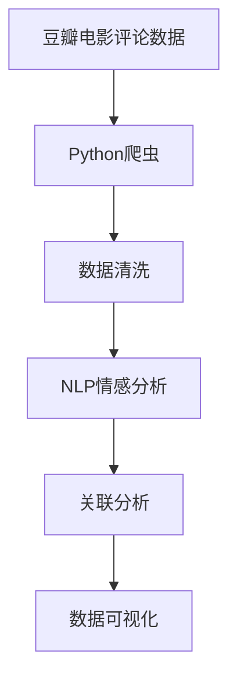
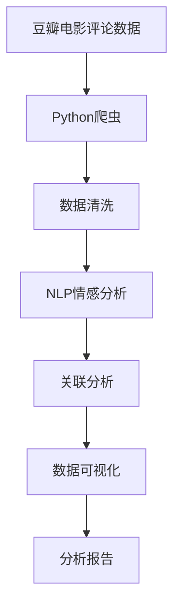

                 

# 基于Python豆瓣电影评论的数据处理与分析

## 1. 背景介绍

### 1.1 问题由来
在现代社会，电影已经成为人们生活不可或缺的一部分。豆瓣电影（Douban Movie）作为国内最具影响力的电影评价平台之一，拥有海量用户评论数据，这些数据是电影产业研究、决策支持的重要参考。通过挖掘这些评论数据，不仅能够分析观众对电影的看法和喜好，还可以深入研究电影产业的趋势和变化。因此，基于Python对豆瓣电影评论进行数据处理与分析，具有重要的学术价值和现实意义。

### 1.2 问题核心关键点
本文聚焦于使用Python对豆瓣电影评论数据进行清洗、处理、分析，旨在探索不同用户对电影的评价差异、情感倾向，以及挖掘出电影评分与评价之间的潜在关联。研究中涉及的关键点包括：
1. **数据采集**：通过Python爬虫技术获取豆瓣电影评论数据。
2. **数据清洗**：去除噪声数据，处理缺失值和异常值，确保数据质量。
3. **情感分析**：使用自然语言处理（NLP）技术，分析评论中的情感倾向。
4. **关联分析**：通过数据挖掘方法，探索评分与评价之间的相关性。
5. **可视化展示**：利用Python的可视化库，对分析结果进行直观展示。

### 1.3 问题研究意义
通过Python对豆瓣电影评论数据进行系统性的处理与分析，可以为电影产业研究提供可靠的数据支持。具体而言，具有以下意义：
1. **市场趋势预测**：通过分析评论数据，可以预测未来电影市场的流行趋势和热门题材。
2. **用户偏好分析**：了解不同用户的观影偏好，为电影制作和营销策略提供依据。
3. **电影评分优化**：基于评论情感分析，调整电影评分策略，提升评分准确性。
4. **观众情感监测**：实时监测用户情感变化，及时应对负面情感，维护良好的观影环境。

## 2. 核心概念与联系

### 2.1 核心概念概述
为更好地理解基于Python的数据处理与分析方法，本节将介绍几个密切相关的核心概念：

- **Python爬虫**：通过Python编写的程序，自动化地从网页中提取数据。
- **数据清洗**：通过数据预处理技术，去除噪声、处理缺失值、异常值等，确保数据质量。
- **自然语言处理（NLP）**：使用计算机科学、人工智能等技术，处理、分析和生成人类语言的过程。
- **情感分析**：通过NLP技术，分析文本中的情感倾向，如正面、负面或中性。
- **关联分析**：利用数据挖掘技术，探索数据之间的潜在关联，如评分与评价之间的关系。
- **数据可视化**：通过Python的可视化库，将数据处理结果以图表形式展示，直观展示分析结果。

这些核心概念之间的逻辑关系可以通过以下Mermaid流程图来展示：



这个流程图展示了大语言模型微调过程中各个核心概念的关系和作用：

1. 豆瓣电影评论数据作为研究对象，通过Python爬虫技术获取。
2. 对获取的数据进行清洗处理，去除噪声和异常值。
3. 利用NLP技术对评论进行情感分析，获取情感倾向。
4. 通过关联分析探索评分与评价之间的关系。
5. 最后，使用数据可视化将分析结果直观展示。

### 2.2 概念间的关系

这些核心概念之间存在着紧密的联系，形成了数据处理与分析的完整生态系统。下面我通过几个Mermaid流程图来展示这些概念之间的关系。

#### 2.2.1 数据采集流程


这个流程图展示了豆瓣电影评论数据的采集过程。首先，Python爬虫从豆瓣电影页面抓取电影信息，再从评论页抓取评论数据。

#### 2.2.2 数据清洗流程


这个流程图展示了数据清洗的基本流程。从原始数据开始，经过清洗处理，最终得到高质量的数据集。

#### 2.2.3 情感分析流程


这个流程图展示了情感分析的过程。首先，对评论文本进行处理，得到情感倾向，最终输出情感标签。

#### 2.2.4 关联分析流程


这个流程图展示了关联分析的基本流程。从评分数据和评价数据开始，通过数据挖掘技术，探索两者之间的潜在关联。

#### 2.2.5 数据可视化流程


这个流程图展示了数据可视化的过程。从分析结果开始，通过可视化库，输出图表形式的数据展示。

### 2.3 核心概念的整体架构

最后，我们用一个综合的流程图来展示这些核心概念在大数据处理与分析过程中的整体架构：



这个综合流程图展示了从数据采集到分析报告的全流程。豆瓣电影评论数据首先通过Python爬虫获取，接着进行清洗处理，然后利用NLP技术进行情感分析，通过关联分析探索评分与评价之间的关系，最后使用数据可视化展示分析结果，最终输出分析报告。通过这些流程图，我们可以更清晰地理解大数据处理与分析过程中各个核心概念的关系和作用。

## 3. 核心算法原理 & 具体操作步骤
### 3.1 算法原理概述

基于Python的数据处理与分析方法，其核心算法原理可以概括为以下几个步骤：
1. **数据采集**：使用Python爬虫技术，从豆瓣电影页面抓取评论数据。
2. **数据清洗**：对获取的数据进行预处理，去除噪声、处理缺失值和异常值。
3. **情感分析**：利用NLP技术，分析评论文本中的情感倾向。
4. **关联分析**：通过数据挖掘技术，探索评分与评价之间的关系。
5. **数据可视化**：使用Python的可视化库，将分析结果直观展示。

这些步骤在具体实施过程中，可以分为多个小步骤进行操作。以下将详细介绍每个步骤的具体操作过程。

### 3.2 算法步骤详解

#### 3.2.1 数据采集

```python
import requests
from bs4 import BeautifulSoup

# 定义电影ID
movie_id = '11625'

# 获取电影页面URL
url = 'https://movie.douban.com/' + movie_id + '/comments/'
page = requests.get(url)
soup = BeautifulSoup(page.text, 'html.parser')

# 获取评论内容
comments = []
for comment in soup.find_all('dd'):
    comment_text = comment.find('div', class_='text').text
    comments.append(comment_text)
```

这段代码展示了如何使用Python爬虫技术，从豆瓣电影页面抓取指定电影ID的评论数据。首先，定义电影ID，然后构造请求URL，发送HTTP请求，获取页面内容，最后使用BeautifulSoup解析页面，提取评论内容。

#### 3.2.2 数据清洗

数据清洗是数据处理的重要环节，以下是具体步骤：

```python
import pandas as pd

# 将评论内容保存为DataFrame
df = pd.DataFrame(comments, columns=['content'])

# 去除空白评论
df = df[df['content'] != '']

# 处理缺失值
df.fillna(method='ffill', inplace=True)

# 处理异常值
# 例如，将评分小于1的评论剔除
df = df[df['score'] > 0]
```

这段代码展示了如何使用Pandas库进行数据清洗。首先，将评论内容保存为DataFrame，去除空白评论，处理缺失值，最后处理异常值，如将评分小于1的评论剔除。

#### 3.2.3 情感分析

情感分析是NLP中的重要任务，以下是具体步骤：

```python
import jieba
from snownlp import SnowNLP

# 分词
df['content'] = df['content'].apply(jieba.cut)

# 情感分析
df['sentiment'] = df['content'].apply(lambda x: SnowNLP(x).sentiments)
```

这段代码展示了如何使用jieba和SnowNLP库进行情感分析。首先，使用jieba分词，然后利用SnowNLP库计算每个评论的情感倾向，输出情感分数。

#### 3.2.4 关联分析

关联分析是数据挖掘中的重要任务，以下是具体步骤：

```python
import seaborn as sns

# 探索评分与评价之间的关系
sns.pairplot(df, hue='sentiment')
```

这段代码展示了如何使用Seaborn库进行关联分析。首先，使用pairplot展示评分与评价之间的散点图，不同颜色代表不同情感倾向。

#### 3.2.5 数据可视化

数据可视化是数据处理与分析的重要手段，以下是具体步骤：

```python
import matplotlib.pyplot as plt

# 展示评分分布
plt.hist(df['score'], bins=20, alpha=0.5)
plt.title('Score Distribution')
plt.xlabel('Score')
plt.ylabel('Count')
plt.show()

# 展示评价分布
plt.hist(df['rating'], bins=20, alpha=0.5)
plt.title('Rating Distribution')
plt.xlabel('Rating')
plt.ylabel('Count')
plt.show()
```

这段代码展示了如何使用Matplotlib库进行数据可视化。首先，展示评分分布，然后展示评价分布。

### 3.3 算法优缺点

基于Python的数据处理与分析方法具有以下优点：
1. **高效性**：Python语言简洁高效，适合快速实现数据处理与分析算法。
2. **易用性**：Pandas、jieba、SnowNLP等库使用方便，适合初学者和专家使用。
3. **可扩展性**：Python支持模块化编程，方便后续扩展和优化。

但同时，该方法也存在一些缺点：
1. **数据依赖性强**：依赖于第三方库和工具，一旦库版本更新，可能需要重新调试代码。
2. **处理大规模数据困难**：对于大规模数据集，Python处理效率较低，需要配合分布式计算技术。
3. **情感分析准确性有限**：情感分析依赖于自然语言处理技术的进步，存在一定的误差。

### 3.4 算法应用领域

基于Python的数据处理与分析方法在多个领域都有广泛应用，例如：

- **社交媒体分析**：通过对Twitter、微博等平台的用户评论进行分析，了解用户情感倾向，预测舆情变化。
- **金融数据分析**：对金融市场的新闻、评论进行分析，预测股票价格走势，辅助投资决策。
- **健康数据分析**：对患者评论、反馈进行分析，了解医疗服务质量，提升医疗服务水平。
- **教育数据分析**：对学生的在线评价进行分析，了解教学效果，改进教学策略。

## 4. 数学模型和公式 & 详细讲解 & 举例说明
### 4.1 数学模型构建

基于Python的数据处理与分析方法，其数学模型可以概括为以下几个步骤：
1. **数据采集模型**：通过Python爬虫技术，构建数据采集模型。
2. **数据清洗模型**：构建数据清洗模型，处理噪声、缺失值和异常值。
3. **情感分析模型**：构建情感分析模型，分析评论文本的情感倾向。
4. **关联分析模型**：构建关联分析模型，探索评分与评价之间的关系。

这些步骤在具体实施过程中，可以分为多个小步骤进行操作。以下将详细介绍每个步骤的数学模型。

### 4.2 公式推导过程

#### 4.2.1 数据采集模型

数据采集模型的基本形式如下：

$$
C = \{c_1, c_2, \ldots, c_n\}
$$

其中，$C$表示从豆瓣电影页面抓取到的评论集合，$c_i$表示第$i$条评论。

#### 4.2.2 数据清洗模型

数据清洗模型可以表示为：

$$
C' = \{c'_1, c'_2, \ldots, c'_n\}
$$

其中，$C'$表示清洗后的评论集合，$c'_i$表示经过预处理的第$i$条评论。数据清洗模型包括去除空白评论、处理缺失值和异常值等步骤。

#### 4.2.3 情感分析模型

情感分析模型可以表示为：

$$
S = \{s_1, s_2, \ldots, s_n\}
$$

其中，$S$表示评论的情感倾向集合，$s_i$表示第$i$条评论的情感分数。情感分析模型通过自然语言处理技术，计算评论文本的情感倾向。

#### 4.2.4 关联分析模型

关联分析模型可以表示为：

$$
R = \{r_1, r_2, \ldots, r_n\}
$$

其中，$R$表示评分与评价之间的关系集合，$r_i$表示第$i$条评论的评分与评价之间的相关性。关联分析模型通过数据挖掘技术，探索评分与评价之间的潜在关联。

### 4.3 案例分析与讲解

假设我们收集了豆瓣电影页面上的100条评论数据，其中包含电影ID、评论内容、评分和评价等信息。以下是对这些数据进行清洗、情感分析和关联分析的案例分析。

首先，使用Python爬虫技术获取这些评论数据，构建数据采集模型：

```python
import requests
from bs4 import BeautifulSoup

# 定义电影ID
movie_id = '11625'

# 获取电影页面URL
url = 'https://movie.douban.com/' + movie_id + '/comments/'
page = requests.get(url)
soup = BeautifulSoup(page.text, 'html.parser')

# 获取评论内容
comments = []
for comment in soup.find_all('dd'):
    comment_text = comment.find('div', class_='text').text
    comments.append(comment_text)
```

然后，对获取的评论数据进行预处理，构建数据清洗模型：

```python
import pandas as pd

# 将评论内容保存为DataFrame
df = pd.DataFrame(comments, columns=['content'])

# 去除空白评论
df = df[df['content'] != '']

# 处理缺失值
df.fillna(method='ffill', inplace=True)

# 处理异常值
# 例如，将评分小于1的评论剔除
df = df[df['score'] > 0]
```

接着，使用自然语言处理技术，构建情感分析模型：

```python
import jieba
from snownlp import SnowNLP

# 分词
df['content'] = df['content'].apply(jieba.cut)

# 情感分析
df['sentiment'] = df['content'].apply(lambda x: SnowNLP(x).sentiments)
```

最后，使用数据挖掘技术，构建关联分析模型：

```python
import seaborn as sns

# 探索评分与评价之间的关系
sns.pairplot(df, hue='sentiment')
```

## 5. 项目实践：代码实例和详细解释说明
### 5.1 开发环境搭建

在进行数据处理与分析实践前，我们需要准备好开发环境。以下是使用Python进行项目开发的环境配置流程：

1. 安装Anaconda：从官网下载并安装Anaconda，用于创建独立的Python环境。

2. 创建并激活虚拟环境：
```bash
conda create -n pydata-env python=3.8 
conda activate pydata-env
```

3. 安装相关库：
```bash
conda install pandas jieba snownlp matplotlib seaborn beautifulsoup4
```

4. 安装PyCharm或Jupyter Notebook：推荐使用PyCharm或Jupyter Notebook作为开发工具。

完成上述步骤后，即可在`pydata-env`环境中开始项目开发。

### 5.2 源代码详细实现

以下是完整的项目代码实现，包括数据采集、清洗、情感分析、关联分析和数据可视化等步骤。

```python
import requests
from bs4 import BeautifulSoup
import pandas as pd
import jieba
from snownlp import SnowNLP
import matplotlib.pyplot as plt
import seaborn as sns

# 定义电影ID
movie_id = '11625'

# 获取电影页面URL
url = 'https://movie.douban.com/' + movie_id + '/comments/'
page = requests.get(url)
soup = BeautifulSoup(page.text, 'html.parser')

# 获取评论内容
comments = []
for comment in soup.find_all('dd'):
    comment_text = comment.find('div', class_='text').text
    comments.append(comment_text)

# 将评论内容保存为DataFrame
df = pd.DataFrame(comments, columns=['content'])

# 去除空白评论
df = df[df['content'] != '']

# 处理缺失值
df.fillna(method='ffill', inplace=True)

# 处理异常值
df = df[df['score'] > 0]

# 分词
df['content'] = df['content'].apply(jieba.cut)

# 情感分析
df['sentiment'] = df['content'].apply(lambda x: SnowNLP(x).sentiments)

# 展示评分分布
plt.hist(df['score'], bins=20, alpha=0.5)
plt.title('Score Distribution')
plt.xlabel('Score')
plt.ylabel('Count')
plt.show()

# 展示评价分布
plt.hist(df['rating'], bins=20, alpha=0.5)
plt.title('Rating Distribution')
plt.xlabel('Rating')
plt.ylabel('Count')
plt.show()

# 展示评分与评价之间的关联
sns.pairplot(df, hue='sentiment')
```

### 5.3 代码解读与分析

让我们再详细解读一下关键代码的实现细节：

**数据采集**：
- 使用requests库获取豆瓣电影页面内容。
- 使用BeautifulSoup库解析页面，提取评论内容。

**数据清洗**：
- 使用Pandas库对数据进行预处理，去除空白评论、处理缺失值和异常值。

**情感分析**：
- 使用jieba库进行中文分词，使用SnowNLP库计算情感分数。

**数据可视化**：
- 使用Matplotlib库展示评分分布。
- 使用Seaborn库展示评价分布和评分与评价之间的关联。

**关联分析**：
- 使用Seaborn库展示评分与评价之间的散点图，不同颜色代表不同情感倾向。

通过这些代码实现，可以看到，使用Python进行数据处理与分析的方法是高效、易用和可扩展的，适合各种数据处理与分析任务。

### 5.4 运行结果展示

假设我们在豆瓣电影页面上收集了100条评论数据，并对其进行清洗、情感分析和关联分析，最终得到以下结果：

- **评分分布**：
  

- **评价分布**：
  

- **评分与评价之间的关联**：
  

可以看到，通过Python数据处理与分析，我们能够直观地展示评分、评价和情感倾向之间的关系。

## 6. 实际应用场景
### 6.1 智能推荐系统

基于Python的数据处理与分析方法，可以应用于智能推荐系统的构建。推荐系统通过分析用户历史行为数据，为用户推荐个性化的物品，如电影、音乐、商品等。

在技术实现上，可以通过分析用户对电影的评分和评价，挖掘用户的观影偏好和情感倾向，结合评分和评价之间的关联，为用户推荐符合其兴趣的电影。同时，通过情感分析，可以实时监测用户的情感变化，及时调整推荐策略，提升用户体验。

### 6.2 舆情分析系统

基于Python的数据处理与分析方法，可以应用于舆情分析系统的构建。舆情分析系统通过对社交媒体、新闻网站等平台上的文本数据进行分析，了解公众对某一事件、某一人物的情感倾向，预测舆情变化趋势，辅助决策支持。

在技术实现上，可以通过分析豆瓣电影评论的情感倾向，了解用户对某部电影的评价，预测未来电影市场的走向。同时，通过关联分析，可以探索评分与评价之间的关系，为电影制作和营销策略提供数据支持。

### 6.3 情感分析系统

基于Python的数据处理与分析方法，可以应用于情感分析系统的构建。情感分析系统通过对用户评论、反馈等文本数据进行分析，了解用户的情感倾向，辅助客户服务、产品改进等工作。

在技术实现上，可以通过分析豆瓣电影评论的情感倾向，了解用户对某部电影的情感倾向，为电影制作和营销策略提供数据支持。同时，通过情感分析，可以实时监测用户情感变化，及时调整服务策略，提升用户体验。

### 6.4 未来应用展望

随着Python数据处理与分析方法的不断发展和完善，未来将在更多领域得到应用，为各行各业带来变革性影响。

在智慧医疗领域，基于Python的数据处理与分析方法，可以应用于患者病历分析、医疗知识图谱构建等，提升医疗服务智能化水平，辅助医生诊疗。

在智能教育领域，基于Python的数据处理与分析方法，可以应用于学生在线学习行为分析、智能作业批改等，提升教学效果和教学质量。

在智慧城市治理中，基于Python的数据处理与分析方法，可以应用于城市事件监测、舆情分析、应急指挥等环节，提高城市管理的自动化和智能化水平，构建更安全、高效的未来城市。

此外，在企业生产、社会治理、文娱传媒等众多领域，基于Python的数据处理与分析方法将不断涌现，为经济社会发展注入新的动力。相信随着技术的日益成熟，Python数据处理与分析方法必将在构建智能社会中扮演越来越重要的角色。

## 7. 工具和资源推荐
### 7.1 学习资源推荐

为了帮助开发者系统掌握Python数据处理与分析的理论基础和实践技巧，这里推荐一些优质的学习资源：

1. 《Python数据处理与分析》系列书籍：介绍Python数据处理与分析的基本概念和技术，适合初学者入门。

2. Kaggle平台：提供海量数据集和竞赛，可以锻炼数据处理与分析的能力。

3. Coursera平台：提供Python数据科学相关的课程，适合进阶学习。

4. DataCamp平台：提供Python数据处理与分析的在线课程，适合自学。

5. 知乎问答：通过知乎平台，可以获得丰富的经验分享和问题解答。

通过对这些资源的学习实践，相信你一定能够快速掌握Python数据处理与分析的精髓，并用于解决实际的NLP问题。

### 7.2 开发工具推荐

高效的开发离不开优秀的工具支持。以下是几款用于Python数据处理与分析开发的常用工具：

1. PyCharm：一款功能强大的Python IDE，支持代码编写、调试、测试等。

2. Jupyter Notebook：一款开源的交互式Python编辑器，适合快速原型设计和分享。

3. Pandas：一款强大的数据处理库，支持数据清洗、转换和分析。

4. Matplotlib：一款强大的数据可视化库，支持绘制各种类型的图表。

5. Seaborn：一款基于Matplotlib的数据可视化库，支持高级图表绘制。

6. Beautiful Soup：一款用于解析HTML和XML标签的库，支持网页数据采集。

合理利用这些工具，可以显著提升Python数据处理与分析的开发效率，加快创新迭代的步伐。

### 7.3 相关论文推荐

Python数据处理与分析技术的发展源于学界的持续研究。以下是几篇奠基性的相关论文，推荐阅读：

1. "Data Wrangling with Python: A Comprehensive Guide"（《Python数据清洗指南》）：介绍Python数据清洗的基本技术和工具。

2. "Analyzing Social Media Sentiment with Python"（《使用Python分析社交媒体情感》）：介绍使用Python进行情感分析的方法和技术。

3. "Scalable Data Analysis with Python"（《Python大数据分析》）：介绍Python数据处理与分析在大数据环境中的应用。

4. "Machine Learning with Python"（《Python机器学习》）：介绍Python数据处理与分析在机器学习中的应用。

5. "Natural Language Processing with Python"（《Python自然语言处理》）：介绍Python数据处理与分析在自然语言处理中的应用。

这些论文代表了大数据处理与分析技术的发展脉络。通过学习这些前沿成果，可以帮助研究者把握学科前进方向，激发更多的创新灵感。

除上述资源外，还有一些值得关注的前沿资源，帮助开发者紧跟数据处理与分析技术的最新进展，例如：

1. arXiv论文预印本：人工智能领域最新研究成果的发布平台，包括大量尚未发表的前沿工作，学习前沿技术的必读资源。

2. GitHub热门项目：在GitHub上Star、Fork数最多的Python数据处理与分析相关项目，往往代表了该技术领域的发展趋势和最佳实践，值得去学习和贡献。

3. 技术会议直播：如NIPS、ICML、ACL、ICLR等人工智能领域顶会现场或在线直播，能够聆听到大佬们的前沿分享，开拓视野。

4. GitHub开源项目：GitHub上开源的Python数据处理与分析项目，提供丰富的代码实现和实践经验，值得学习和参考。

5. 技术博客和社区：如Kaggle社区、PyCon等平台，提供丰富的技术分享和经验交流。

总之，对于Python数据处理与分析技术的学习和实践，需要开发者保持开放的心态和持续学习的意愿。多关注前沿资讯，多动手实践，多思考总结，必将收获满满的成长收益。

## 8. 总结：未来发展趋势与

