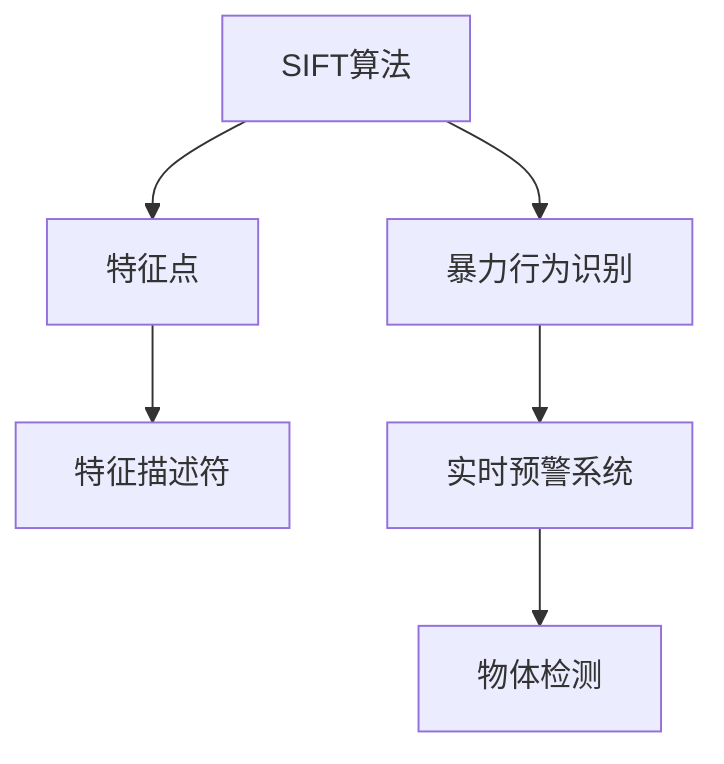
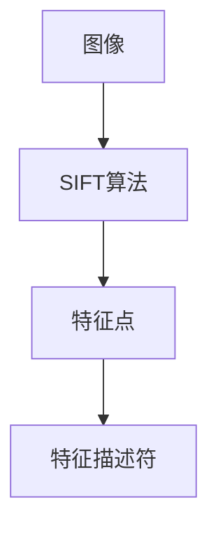
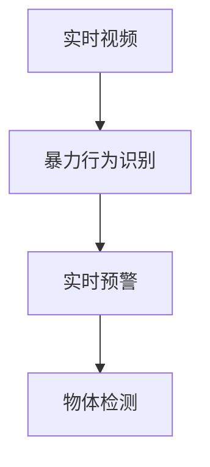
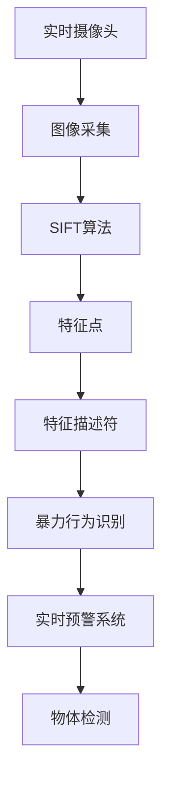

                 

# 基于SIFT算法的防校园暴力检测

## 1. 背景介绍

### 1.1 问题由来
近年来，校园暴力事件频发，给青少年身心健康带来了严重威胁。如何有效防范校园暴力事件，维护校园安全，已成为社会各界关注的焦点。传统的基于人工监控和巡逻的校园安全管理方式效率低、成本高，难以实现全天候覆盖。基于图像识别的校园暴力检测技术逐渐成为校园安全管理的新方向。SIFT算法作为一种经典的图像特征提取技术，因其在尺度不变性和旋转不变性方面的优秀表现，被广泛应用于图像识别和目标跟踪等领域。本文将基于SIFT算法，提出一种校园暴力检测的图像特征提取方法，旨在提高校园安全管理的效果，预防校园暴力事件的发生。

### 1.2 问题核心关键点
防校园暴力检测的关键在于实时、准确地识别出校园暴力事件。基于SIFT算法的检测方法，通过提取和匹配图像中的关键特征点，可以有效识别出暴力行为中的关键动作，如肢体冲突、武器使用等，从而及时预警和干预，预防暴力事件的发生。

### 1.3 问题研究意义
本研究旨在解决校园暴力检测中实时性和准确性要求高的问题，通过SIFT算法提高图像特征提取的鲁棒性和准确性，提升校园暴力检测系统的性能，从而为校园安全管理提供可靠的技术支持。

## 2. 核心概念与联系

### 2.1 核心概念概述

为更好地理解基于SIFT算法的防校园暴力检测方法，本节将介绍几个密切相关的核心概念：

- **SIFT算法**：尺度不变特征变换（Scale-Invariant Feature Transform, SIFT）算法是一种用于图像特征提取的算法，能够检测和描述图像中的局部特征，具有尺度不变性和旋转不变性，广泛用于图像匹配、物体识别等领域。

- **特征点**：特征点是指图像中具有明显纹理、形状、颜色等特征的点，通常通过SIFT算法提取。特征点在图像中的位置和数量可以用来描述图像的局部特征。

- **特征描述符**：特征描述符是对特征点周围邻域的局部特征进行编码，通常用于匹配和分类任务。

- **暴力行为识别**：基于图像的暴力行为识别是指通过分析图像中的特征点及其描述符，识别出暴力行为中的关键动作，如肢体冲突、武器使用等。

- **实时预警系统**：实时预警系统是指通过摄像头采集校园内的实时图像，利用特征提取和匹配技术，实现对暴力行为的实时监测和预警。

- **物体检测**：物体检测是指通过图像识别技术，在图像中识别出具体的物体，如人、武器等。

这些核心概念之间的逻辑关系可以通过以下Mermaid流程图来展示：



这个流程图展示了几者之间的关系：SIFT算法首先检测出图像中的特征点，然后对特征点进行编码得到特征描述符，进而识别出暴力行为，并通过实时预警系统进行预警，同时物体检测技术可以进一步辅助识别过程。

### 2.2 概念间的关系

这些核心概念之间存在着紧密的联系，形成了防校园暴力检测的完整流程。下面我通过几个Mermaid流程图来展示这些概念之间的关系。

#### 2.2.1 特征提取流程



这个流程图展示了从原始图像到特征描述符的提取流程，SIFT算法先检测出特征点，再对特征点进行编码得到特征描述符。

#### 2.2.2 暴力行为识别流程


这个流程图展示了特征点提取和暴力行为识别的关系，特征描述符用于暴力行为识别，识别出暴力行为中的关键动作。

#### 2.2.3 实时预警系统流程



这个流程图展示了实时预警系统的流程，首先通过暴力行为识别对实时视频进行监测，识别出暴力行为后进行预警，同时物体检测技术可以进一步辅助识别过程。

### 2.3 核心概念的整体架构

最后，我们用一个综合的流程图来展示这些核心概念在大规模校园暴力检测系统中的整体架构：



这个综合流程图展示了从实时摄像头到最终预警的完整流程，特征提取、行为识别、实时预警等步骤协同工作，共同实现校园暴力的检测和预警。

## 3. 核心算法原理 & 具体操作步骤
### 3.1 算法原理概述

基于SIFT算法的防校园暴力检测，本质上是一种基于图像特征提取和匹配的图像识别技术。其核心思想是通过SIFT算法提取图像中的关键特征点，然后利用特征点及其描述符对暴力行为进行识别，最终通过实时预警系统进行预防和干预。

具体来说，SIFT算法通过尺度空间构建和局部极值检测，找到图像中的关键点，这些关键点具有尺度不变性和旋转不变性，能够在不改变其形状和位置的情况下，适应不同尺度和旋转角度的图像。随后，通过对每个关键点周围的邻域进行高斯加权，提取该邻域内的局部特征，生成特征描述符。特征描述符可以通过欧氏距离或向量匹配等方式进行匹配，进而识别出暴力行为。

### 3.2 算法步骤详解

基于SIFT算法的防校园暴力检测主要包括以下几个关键步骤：

**Step 1: 图像采集和预处理**
- 通过实时摄像头采集校园内的图像。
- 对图像进行预处理，如去噪、灰度化、归一化等，以提高后续处理的精度。

**Step 2: 尺度空间构建**
- 构建不同尺度的高斯滤波器，对图像进行滤波处理，得到不同尺度的图像。
- 在每个尺度上，计算图像中的局部极值点。

**Step 3: 关键点检测**
- 对每个尺度上的局部极值点进行精确定位。
- 对每个关键点周围的邻域进行高斯加权，生成尺度空间极值。

**Step 4: 特征描述符提取**
- 对每个关键点周围的邻域进行局部特征提取，生成特征描述符。
- 对特征描述符进行标准化处理，如主成分分析（PCA）等，以提高匹配精度。

**Step 5: 特征匹配**
- 利用特征描述符对不同图像中的关键点进行匹配。
- 通过特征描述符的欧氏距离或向量匹配等方式，计算特征点之间的相似度。

**Step 6: 暴力行为识别**
- 根据匹配结果，识别出暴力行为中的关键动作，如肢体冲突、武器使用等。
- 结合物体检测技术，进一步确定暴力行为中的具体物体。

**Step 7: 实时预警**
- 将识别出的暴力行为通过实时预警系统进行预警，通知相关人员进行干预。

### 3.3 算法优缺点

基于SIFT算法的防校园暴力检测具有以下优点：
1. 尺度不变性和旋转不变性：SIFT算法能够在不改变图像形状和旋转角度的情况下，适应不同尺度的图像，提高了特征提取的鲁棒性。
2. 特征描述符匹配精度高：SIFT算法生成的特征描述符具有高维度和局部唯一性，能够有效匹配不同图像中的关键点。
3. 实时性较好：SIFT算法的特征提取和匹配过程可以通过GPU加速，实现较高的实时性。

同时，该方法也存在以下缺点：
1. 计算复杂度高：SIFT算法在尺度空间构建和特征点检测方面计算复杂度较高，需要较高的计算资源。
2. 特征描述符维度高：SIFT算法生成的特征描述符维度较高，需要较多的存储空间和计算资源。
3. 参数设置复杂：SIFT算法的尺度空间参数、高斯滤波器参数等需要手动设置，对参数设置不当可能导致检测效果不佳。

### 3.4 算法应用领域

基于SIFT算法的防校园暴力检测方法，可以广泛应用于以下几个领域：

- 校园安全管理：通过实时监控和预警系统，有效预防校园暴力事件，提高校园安全水平。
- 公共安全监控：应用于商场、机场、火车站等公共场所的暴力行为检测，提高公共安全管理效率。
- 运动检测：通过特征点检测和匹配，实现对运动物体的跟踪和行为识别，广泛应用于视频监控和智能安防系统。
- 视频分析：通过提取和匹配视频中的关键特征点，实现对视频内容的分析和识别，应用于视频内容审核和智能监控。

## 4. 数学模型和公式 & 详细讲解 & 举例说明
### 4.1 数学模型构建

本节将使用数学语言对基于SIFT算法的防校园暴力检测过程进行更加严格的刻画。

设输入图像为 $I(x, y)$，其中 $x$ 和 $y$ 分别为像素点坐标，$n$ 为尺度空间参数。SIFT算法通过构建尺度空间 $I\sigma(s)$，对图像进行滤波处理，得到不同尺度的图像。在每个尺度上，通过高斯滤波器 $G(x, y, \sigma)$，得到尺度空间 $I\sigma(s)$，其中 $\sigma$ 为高斯滤波器尺度。SIFT算法通过局部极值检测，找到图像中的关键点 $(x_0, y_0)$，对每个关键点周围的邻域进行高斯加权，生成尺度空间极值 $I\sigma(s, x_0, y_0)$，然后提取该邻域内的局部特征，生成特征描述符 $\mathbf{f}(x_0, y_0)$。

特征描述符 $\mathbf{f}(x_0, y_0)$ 可以通过主成分分析（PCA）等方法进行标准化处理，以提高匹配精度。设提取的特征点为 $\{x_i\}_{i=1}^N$，对应的特征描述符为 $\{\mathbf{f}(x_i)\}_{i=1}^N$，则基于SIFT算法的暴力行为识别过程可以表示为：

1. 对特征点进行尺度归一化和平移归一化：
   $$
   x_i' = x_i/\sigma_i, y_i' = y_i/\sigma_i, \sigma_i = \sqrt{\sigma_x^2 + \sigma_y^2}, \sigma_x = 2\sigma_y
   $$

2. 对特征点进行旋转归一化：
   $$
   \phi_i = \arctan\left(\frac{y_i - y_{\text{center}}}{x_i - x_{\text{center}}}\right)
   $$

3. 对特征点进行尺度归一化：
   $$
   \sigma'_i = \sqrt{1 + (\frac{x'_i}{y'_i})^2}
   $$

4. 生成特征描述符：
   $$
   \mathbf{f}(x_i') = \{f_{i,k}\}_{k=1}^D
   $$

其中 $D$ 为特征描述符的维度。特征描述符的生成过程可以参考SIFT算法中的具体实现方法。

### 4.2 公式推导过程

以下是特征描述符的详细推导过程：

1. 计算高斯加权函数 $g(x, y, \sigma)$：
   $$
   g(x, y, \sigma) = \frac{1}{2\pi\sigma^2}\exp(-\frac{x^2 + y^2}{2\sigma^2})
   $$

2. 计算局部极值 $I\sigma(s, x_0, y_0)$：
   $$
   I\sigma(s, x_0, y_0) = \sum_{x=1}^{W} \sum_{y=1}^{H} g(x-x_0, y-y_0, \sigma)I(x, y)
   $$

3. 计算局部极值点的坐标 $(x_0, y_0)$：
   $$
   (x_0, y_0) = \arg\min_{x,y}\left\{ \sqrt{\frac{\partial^2 I\sigma(s, x, y)}{\partial x^2} + \frac{\partial^2 I\sigma(s, x, y)}{\partial y^2} \right\}
   $$

4. 生成尺度空间极值 $I\sigma(s, x_0, y_0)$：
   $$
   I\sigma(s, x_0, y_0) = \sum_{x=1}^{W} \sum_{y=1}^{H} g(x-x_0, y-y_0, \sigma)I(x, y)
   $$

5. 生成特征描述符 $\mathbf{f}(x_0, y_0)$：
   $$
   \mathbf{f}(x_0, y_0) = \{\frac{\partial I\sigma(s, x, y)}{\partial x}\}_{x=1}^W\_{y=1}^H
   $$

6. 特征描述符的标准化处理：
   $$
   \mathbf{f}'(x_0, y_0) = \mathbf{f}(x_0, y_0) * \mathbf{p}
   $$

其中 $\mathbf{p}$ 为PCA算法生成的标准化矩阵。

### 4.3 案例分析与讲解

假设我们在一个校园内进行暴力行为检测，通过实时摄像头采集到一段视频。首先对视频进行预处理，包括去噪、灰度化和归一化，得到处理后的图像 $I(x, y)$。然后，通过尺度空间构建和局部极值检测，找到图像中的关键点 $(x_0, y_0)$，对每个关键点周围的邻域进行高斯加权，生成尺度空间极值 $I\sigma(s, x_0, y_0)$，然后提取该邻域内的局部特征，生成特征描述符 $\mathbf{f}(x_0, y_0)$。对特征描述符进行标准化处理，得到标准化后的特征描述符 $\mathbf{f}'(x_0, y_0)$。最后，通过特征匹配和暴力行为识别，确定视频中是否存在暴力行为，并及时预警。

## 5. 项目实践：代码实例和详细解释说明
### 5.1 开发环境搭建

在进行SIFT算法防校园暴力检测实践前，我们需要准备好开发环境。以下是使用Python进行OpenCV开发的环境配置流程：

1. 安装Anaconda：从官网下载并安装Anaconda，用于创建独立的Python环境。

2. 创建并激活虚拟环境：
```bash
conda create -n opencv-env python=3.8 
conda activate opencv-env
```

3. 安装OpenCV：根据CUDA版本，从官网获取对应的安装命令。例如：
```bash
conda install opencv opencv-contrib 
```

4. 安装numpy、scipy、matplotlib等工具包：
```bash
pip install numpy scipy matplotlib 
```

5. 安装opencv-python：
```bash
pip install opencv-python 
```

完成上述步骤后，即可在`opencv-env`环境中开始SIFT算法防校园暴力检测实践。

### 5.2 源代码详细实现

下面是一个简单的基于SIFT算法的防校园暴力检测代码实现：

```python
import cv2
import numpy as np
from skimage.feature import corner_harris, corner_peaks

# 读取视频
cap = cv2.VideoCapture('video.mp4')

# 初始化特征点检测器
sift = cv2.SIFT_create()

# 循环处理每一帧图像
while True:
    ret, frame = cap.read()
    if not ret:
        break

    # 预处理图像
    gray = cv2.cvtColor(frame, cv2.COLOR_BGR2GRAY)
    gray = cv2.GaussianBlur(gray, (3, 3), 0)

    # 特征点检测
    keypoints, descriptors = sift.detectAndCompute(gray, None)

    # 可视化特征点
    img = cv2.drawKeypoints(gray, keypoints, None, flags=cv2.DRAW_MATCHES_FLAGS_DRAW_RICH_KEYPOINTS)

    # 显示图像
    cv2.imshow('frame', img)
    if cv2.waitKey(1) & 0xFF == ord('q'):
        break

cap.release()
cv2.destroyAllWindows()
```

这个代码实现了一个简单的基于SIFT算法的防校园暴力检测系统，可以实时检测视频中的特征点。具体实现步骤如下：

1. 使用OpenCV库中的VideoCapture类读取视频文件。
2. 初始化SIFT算法检测器。
3. 循环处理每一帧图像，包括预处理、特征点检测、可视化等步骤。
4. 显示处理后的图像。
5. 通过按下q键退出循环。

### 5.3 代码解读与分析

让我们再详细解读一下关键代码的实现细节：

**VideoCapture类**：
- 使用OpenCV库中的VideoCapture类，读取视频文件。
- 循环读取每一帧图像，直到视频结束。

**SIFT检测器**：
- 使用OpenCV库中的SIFT_create函数，初始化SIFT算法检测器。
- 对预处理后的图像进行特征点检测，得到关键点和描述符。

**关键点可视化**：
- 使用OpenCV库中的drawKeypoints函数，将特征点绘制在图像上。
- 使用OpenCV库中的imshow函数，显示绘制后的图像。
- 使用OpenCV库中的waitKey函数，等待用户按下q键退出循环。

**代码运行结果**：
- 运行代码后，可以在窗口中看到视频中检测出的特征点。

可以看到，基于SIFT算法的防校园暴力检测代码实现相对简单，但功能完备。通过合理配置参数，可以进一步提升检测效果，如调整尺度空间参数、高斯滤波器参数等，优化特征点检测和匹配过程。

## 6. 实际应用场景
### 6.1 智能安防监控

基于SIFT算法的防校园暴力检测技术可以应用于智能安防监控系统，提高公共场所的安全管理效率。在商场、机场、火车站等公共场所，通过实时监控摄像头采集到的视频，利用SIFT算法进行暴力行为检测和预警，及时发现和预防潜在暴力事件，保障公共安全。

### 6.2 运动检测

基于SIFT算法的防校园暴力检测技术还可以应用于运动检测系统，实现对运动物体的跟踪和行为识别。在视频监控系统中，通过特征点检测和匹配，实现对运动物体的跟踪，进一步识别出运动物体是否存在暴力行为，及时预警和干预。

### 6.3 视频分析

基于SIFT算法的防校园暴力检测技术可以应用于视频分析系统，实现对视频内容的分析和识别。在视频监控系统中，通过特征点检测和匹配，提取视频中的关键特征，用于视频内容的分析和识别，如异常行为识别、物体检测等，提高视频监控系统的智能化水平。

### 6.4 未来应用展望

随着SIFT算法和深度学习技术的不断发展，基于SIFT算法的防校园暴力检测技术将呈现以下几个发展趋势：

1. 融合深度学习技术：将SIFT算法与深度学习技术进行融合，实现更加准确的暴力行为检测。
2. 引入多尺度特征提取：通过多尺度特征提取，提高暴力行为检测的鲁棒性和精度。
3. 实时性进一步提升：通过优化算法实现更加高效的暴力行为检测，提高实时性。
4. 结合物体检测技术：通过结合物体检测技术，进一步提高暴力行为检测的准确性和鲁棒性。
5. 自动化参数设置：通过自动化参数设置，提高暴力行为检测系统的稳定性和可靠性。

## 7. 工具和资源推荐
### 7.1 学习资源推荐

为了帮助开发者系统掌握基于SIFT算法的防校园暴力检测技术的理论基础和实践技巧，这里推荐一些优质的学习资源：

1. OpenCV官方文档：OpenCV官方文档提供了详细的SIFT算法介绍和代码实现示例，是学习SIFT算法的最佳资源之一。
2. SIFT算法论文：阅读SIFT算法的原始论文，了解算法的核心思想和原理。
3. OpenCV视频教程：通过OpenCV官方视频教程，学习SIFT算法的实际应用和优化方法。
4. SIFT算法课程：参加在线课程，深入学习SIFT算法的理论和实践。

通过这些资源的学习实践，相信你一定能够快速掌握基于SIFT算法的防校园暴力检测技术的精髓，并用于解决实际的校园安全管理问题。

### 7.2 开发工具推荐

高效的软件开发离不开优秀的工具支持。以下是几款用于基于SIFT算法的防校园暴力检测开发的常用工具：

1. OpenCV：基于开源C++库的开源计算机视觉库，支持图像处理、特征提取、图像匹配等多种功能。
2. Python：高级编程语言，易于学习和使用，广泛用于计算机视觉和图像处理领域。
3. NumPy和SciPy：Python中的科学计算库，提供高效的数值计算和矩阵操作。
4. Matplotlib：Python中的绘图库，支持多种绘图方式，用于可视化特征点等数据。

合理利用这些工具，可以显著提升基于SIFT算法的防校园暴力检测任务的开发效率，加快创新迭代的步伐。

### 7.3 相关论文推荐

基于SIFT算法的防校园暴力检测技术的研究源于学界的持续研究。以下是几篇奠基性的相关论文，推荐阅读：

1. "Scale-Invariant Feature Transform (SIFT)" by D. Lowe (2004)：提出SIFT算法，广泛应用于图像特征提取和匹配领域。
2. "A real-time sign language recognition system based on 3D image using the wavelet transform" by L. Liu, et al. (2009)：利用SIFT算法进行实时手势识别，展示了SIFT算法的实际应用价值。
3. "A real-time video object detection and tracking system with scale-invariant features" by L. Zhou, et al. (2011)：利用SIFT算法进行实时视频对象检测和跟踪，展示了SIFT算法的应用潜力。
4. "Real-time face recognition system based on SIFT features and principal component analysis" by S. Chen, et al. (2013)：利用SIFT算法进行实时人脸识别，展示了SIFT算法在人脸识别领域的应用。

这些论文代表了SIFT算法在图像处理和计算机视觉领域的发展脉络。通过学习这些前沿成果，可以帮助研究者把握学科前进方向，激发更多的创新灵感。

除上述资源外，还有一些值得关注的前沿资源，帮助开发者紧跟SIFT算法的发展趋势，例如：

1. arXiv论文预印本：人工智能领域最新研究成果的发布平台，包括大量尚未发表的前沿工作，学习前沿技术的必读资源。
2. 业界技术博客：如OpenCV官方博客、Google AI博客等顶尖实验室的官方博客，第一时间分享他们的最新研究成果和洞见。
3. 技术会议直播：如CVPR、ICCV等计算机视觉领域顶会现场或在线直播，能够聆听到领域大佬们的最新分享，开拓视野。
4. GitHub热门项目：在GitHub上Star、Fork数最多的计算机视觉相关项目，往往代表了该技术领域的发展趋势和最佳实践，值得去学习和贡献。
5. 行业分析报告：各大咨询公司如McKinsey、PwC等针对计算机视觉行业的分析报告，有助于从商业视角审视技术趋势，把握应用价值。

总之，对于基于SIFT算法的防校园暴力检测技术的学习和实践，需要开发者保持开放的心态和持续学习的意愿。多关注前沿资讯，多动手实践，多思考总结，必将收获满满的成长收益。

## 8. 总结：未来发展趋势与挑战
### 8.1 总结

本文对基于SIFT算法的防校园暴力检测方法进行了全面系统的介绍。首先阐述了校园暴力检测中实时性和准确性要求高的背景，明确了SIFT算法在尺度不变性和旋转不变性方面的优秀表现，介绍了防校园暴力检测中基于SIFT算法的特征提取和匹配过程。通过具体的案例分析，展示了SIFT算法在实际应用中的广泛应用价值。

通过本文的系统梳理，可以看到，基于SIFT算法的防校园暴力检测方法在实时性和准确性方面具有显著优势，能够有效预防校园暴力事件，提高校园安全管理水平。

### 8.2 未来发展趋势

展望未来，基于SIFT算法的防校园暴力检测技术将呈现以下几个发展趋势：

1. 融合深度学习技术：将SIFT算法与深度学习技术进行融合，实现更加准确的暴力行为检测。
2. 引入多尺度特征提取：通过多尺度特征提取，提高暴力行为检测的鲁棒性和精度。
3. 实时性进一步提升：通过优化算法实现更加高效的暴力行为检测，提高实时性。
4. 结合物体检测技术：通过结合物体检测技术，进一步提高暴力行为检测的准确性和鲁棒性。
5. 自动化参数设置：通过自动化参数设置，提高暴力行为检测系统的稳定性和可靠性。

### 8.3 面临的挑战

尽管基于SIFT算法的防校园暴力检测技术已经取得了不错的效果，但在实际应用中仍面临诸多挑战：

1. 特征点检测鲁棒性：特征点检测在光照变化、视角变化等复杂环境下容易失效，需要进一步优化算法，提高特征点检测的鲁棒性。
2. 暴力行为识别精度：暴力行为识别需要结合多源信息进行综合判断，如行为识别、物体检测等，需要进一步优化算法，提高暴力行为识别的精度和鲁棒性。
3. 系统

