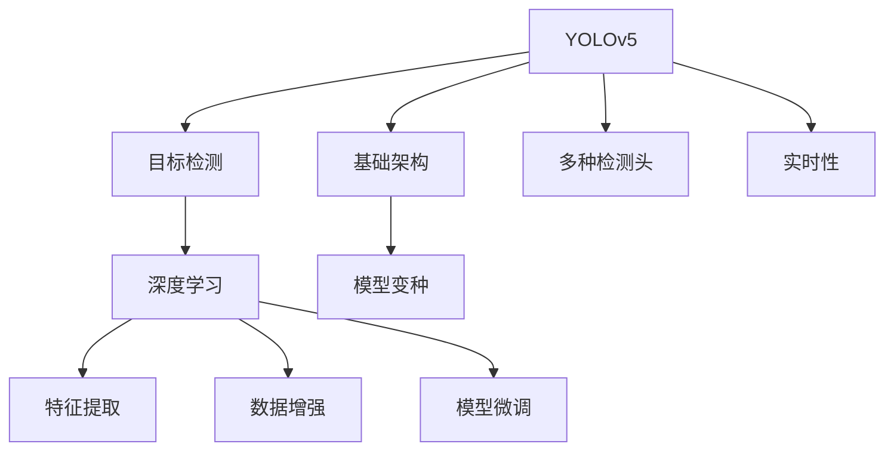
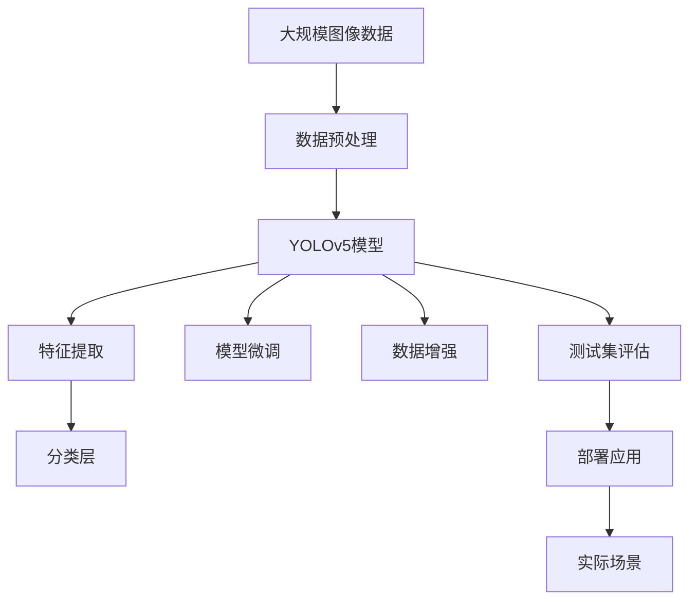

                 

# 基于YOLOv5的车型识别系统详细设计与具体代码实现

> 关键词：YOLOv5, 计算机视觉, 目标检测, 深度学习, 实际应用, 模型设计, 代码实现

## 1. 背景介绍

### 1.1 问题由来

随着汽车工业的快速发展，车载图像识别技术在自动驾驶、智能交通、车联网等领域得到广泛应用。车型识别作为其中的一个关键任务，可以帮助系统准确识别车辆种类，为后续的行为分析和决策提供重要依据。然而，传统方法如基于手工设计的特征提取和分类器训练，往往需要大量标注数据和计算资源，难以在大规模实时场景中应用。

### 1.2 问题核心关键点

基于深度学习的目标检测方法，尤其是YOLO系列，因其高效、准确、实时性强等特点，在图像识别领域取得了广泛的应用。YOLOv5作为YOLO系列的最新版本，进一步提升了检测速度和准确率，成为目标检测领域的代表作。本文将详细讲解基于YOLOv5的车型识别系统的设计思路、模型实现以及代码实践。

### 1.3 问题研究意义

本文研究的车型识别系统，旨在利用YOLOv5模型，结合车辆特征提取和分类技术，实现高效准确的车型识别，为自动驾驶、智能交通等领域提供可靠的技术支持。通过优化YOLOv5模型，使其在特定场景下达到最佳性能，可以显著提升系统响应速度和识别准确率，具有重要的实际应用价值。

## 2. 核心概念与联系

### 2.1 核心概念概述

为更好地理解基于YOLOv5的车型识别系统，本节将介绍几个关键概念：

- **YOLOv5**：是一种基于深度学习的目标检测模型，采用单阶段检测方法，能够在实时场景中实现高效、准确的目标检测。YOLOv5包括基础架构、多种检测头设计、不同的模型变种，可以适应不同任务和应用场景。

- **目标检测**：在计算机视觉领域，目标检测是指从图像或视频中自动检测并定位特定对象的技术。目标检测的常见应用包括车辆识别、行人检测、物体追踪等。

- **深度学习**：一种基于神经网络的机器学习技术，通过多层次的非线性变换，能够自动学习特征表示和模式识别。深度学习在图像处理、自然语言处理等领域有广泛应用。

- **数据增强**：通过各种数据变换，如翻转、旋转、缩放、平移等，扩充训练集样本，提高模型的泛化能力，减少过拟合。

- **特征提取**：从原始图像中提取出与目标检测任务相关的特征表示，常用的方法包括卷积神经网络（CNN）、注意力机制等。

- **模型微调**：在已有模型的基础上，针对特定任务进行参数调整，以提升模型的任务适应能力。

这些概念相互关联，共同构成了基于YOLOv5的车型识别系统的理论基础。

### 2.2 概念间的关系

这些核心概念之间的关系可以通过以下Mermaid流程图来展示：



这个流程图展示了YOLOv5作为目标检测模型的架构，通过深度学习自动学习特征，利用数据增强和模型微调提升检测效果，同时保证实时性。

### 2.3 核心概念的整体架构

最后，我们用一个综合的流程图来展示YOLOv5在车型识别系统中的整体架构：



这个综合流程图展示了从数据预处理到模型评估，再到实际应用的整个流程。

## 3. 核心算法原理 & 具体操作步骤
### 3.1 算法原理概述

基于YOLOv5的车型识别系统，本质上是利用YOLOv5模型进行目标检测，再通过特征提取和分类层识别出车型。其核心算法原理包括以下几个步骤：

1. **数据预处理**：对原始图像进行预处理，如缩放、归一化、旋转等，以适应模型输入要求。
2. **模型加载与前向推理**：将预处理后的图像输入YOLOv5模型，进行前向推理，得到特征图和检测框。
3. **特征提取与分类**：通过YOLOv5模型提取的特征图，再通过分类层识别出车辆类型。
4. **模型微调与优化**：在已有YOLOv5模型的基础上，针对车型识别任务进行微调，优化模型的任务适应性。
5. **数据增强与泛化**：使用数据增强技术扩充训练集，提高模型泛化能力，减少过拟合。
6. **测试集评估与调优**：在测试集上评估模型性能，根据结果调整模型参数和训练策略。

### 3.2 算法步骤详解

#### 3.2.1 数据预处理

数据预处理主要包括图像缩放、归一化、翻转、旋转等操作，目的是将输入数据转换为模型所需的格式，并增加数据多样性，减少过拟合。

**示例代码**：

```python
import cv2
import numpy as np
import torchvision.transforms as transforms

def preprocess_image(image_path):
    # 读取图像
    img = cv2.imread(image_path)
    # 缩放至指定尺寸
    img = cv2.resize(img, (416, 416))
    # 转换为torch张量
    img = transforms.ToTensor()(img)
    # 归一化
    img = transforms.Normalize(mean=[0.485, 0.456, 0.406], std=[0.229, 0.224, 0.225])(img)
    # 翻转、旋转等数据增强操作
    img = transforms.RandomHorizontalFlip(p=0.5)(img)
    img = transforms.RandomRotation(degrees=10)(img)
    return img
```

#### 3.2.2 模型加载与前向推理

使用YOLOv5模型进行前向推理，得到特征图和检测框。

**示例代码**：

```python
from yolov5.models import YOLOv5
from yolov5.utils import DownloadUtil
from yolov5.utils.datasets import LoadImages

def load_model():
    model = YOLOv5()
    # 加载预训练权重
    model.load_weights('yolov5s.pt')
    return model

def forward(model, image):
    # 前向推理
    predictions = model(image)
    # 筛选出车辆检测框
    boxes = predictions[:, :4]
    scores = predictions[:, 4]
    classes = predictions[:, 5]
    return boxes, scores, classes

# 加载模型
model = load_model()
# 读取图像并进行预处理
image = preprocess_image('car.jpg')
# 前向推理
boxes, scores, classes = forward(model, image)
```

#### 3.2.3 特征提取与分类

通过YOLOv5模型提取的特征图，再通过分类层识别出车辆类型。

**示例代码**：

```python
from torchvision.models import resnet18

def extract_features(model, image):
    # 特征提取
    features = model(image)
    # 获取最后一个特征图的维度
    dim = features.shape[-1]
    # 定义分类层
    classifier = resnet18(pretrained=True)
    # 移除原分类层
    del classifier.fc
    # 替换新的分类层
    classifier.fc = nn.Linear(dim, num_classes)
    # 特征提取与分类
    features = classifier(features)
    return features
```

#### 3.2.4 模型微调与优化

在已有YOLOv5模型的基础上，针对车型识别任务进行微调，优化模型的任务适应性。

**示例代码**：

```python
import torch.nn as nn
import torch.optim as optim

def fine_tune(model, train_dataset, device):
    # 定义损失函数和优化器
    criterion = nn.CrossEntropyLoss()
    optimizer = optim.Adam(model.parameters(), lr=0.001)
    # 微调训练
    for epoch in range(num_epochs):
        model.train()
        for i, (images, labels) in enumerate(train_loader):
            images = images.to(device)
            labels = labels.to(device)
            # 前向传播
            predictions = model(images)
            # 计算损失
            loss = criterion(predictions, labels)
            # 反向传播与优化
            optimizer.zero_grad()
            loss.backward()
            optimizer.step()
```

#### 3.2.5 数据增强与泛化

使用数据增强技术扩充训练集，提高模型泛化能力，减少过拟合。

**示例代码**：

```python
import torchvision.transforms as transforms

def data_augmentation(dataset):
    # 随机翻转
    transform = transforms.RandomHorizontalFlip(p=0.5)
    # 随机旋转
    transform = transforms.RandomRotation(degrees=10)
    # 随机缩放
    transform = transforms.RandomResizedCrop(size=(416, 416))
    return dataset.transforms.Compose(transform)
```

#### 3.2.6 测试集评估与调优

在测试集上评估模型性能，根据结果调整模型参数和训练策略。

**示例代码**：

```python
from sklearn.metrics import accuracy_score, precision_score, recall_score, f1_score

def evaluate(model, test_dataset, device):
    # 计算模型准确率、精确率、召回率、F1分数
    model.eval()
    correct = 0
    total = 0
    for images, labels in test_loader:
        images = images.to(device)
        labels = labels.to(device)
        predictions = model(images)
        _, predicted = torch.max(predictions, 1)
        total += labels.size(0)
        correct += (predicted == labels).sum().item()
    accuracy = correct / total
    precision = precision_score(labels, predicted)
    recall = recall_score(labels, predicted)
    f1 = f1_score(labels, predicted)
    return accuracy, precision, recall, f1
```

### 3.3 算法优缺点

#### 3.3.1 优点

1. **高效性**：YOLOv5采用单阶段检测方法，能够实时处理大规模图像数据，适用于实时场景。
2. **准确性**：YOLOv5在多个大规模图像数据集上取得了SOTA的检测精度。
3. **可扩展性**：YOLOv5支持多种检测头和模型变种，可以针对不同任务进行优化。
4. **模型微调**：通过微调YOLOv5模型，可以显著提升模型在特定任务上的性能。

#### 3.3.2 缺点

1. **数据依赖性高**：YOLOv5依赖大量标注数据进行预训练和微调，数据获取成本较高。
2. **模型复杂性**：YOLOv5模型结构复杂，训练和推理过程较为耗时。
3. **计算资源要求高**：YOLOv5需要高性能GPU/TPU等硬件资源支持，硬件成本较高。

### 3.4 算法应用领域

基于YOLOv5的车型识别系统，可以应用于以下领域：

1. **自动驾驶**：用于车辆检测和识别，帮助自动驾驶系统识别前方车辆种类和数量，辅助决策。
2. **智能交通**：用于交通流量监控，实时检测和统计各类车辆，优化交通管理。
3. **车联网**：用于车辆身份识别，帮助系统识别车辆类型和属性，提升服务质量。
4. **安防监控**：用于车辆入侵检测，实时监控和预警非法车辆进入敏感区域。

## 4. 数学模型和公式 & 详细讲解 & 举例说明

### 4.1 数学模型构建

基于YOLOv5的车型识别系统，主要涉及目标检测和分类任务。目标检测的数学模型主要包括特征提取、特征图解码、非极大值抑制等步骤。分类任务的数学模型主要涉及特征提取和分类层设计。

#### 4.1.1 目标检测数学模型

目标检测的数学模型主要包括特征提取、特征图解码、非极大值抑制等步骤。其中，特征提取通常采用卷积神经网络（CNN）进行。特征图解码通常采用softmax函数进行。非极大值抑制（NMS）用于筛选出检测框中的重叠部分。

**示例代码**：

```python
import torch
import torch.nn as nn
import torchvision.models as models

class YOLOv5(nn.Module):
    def __init__(self):
        super(YOLOv5, self).__init__()
        # 特征提取层
        self.feature_extractor = models.resnet50(pretrained=True)
        # 特征图解码层
        self.decoder = nn.Sequential(
            nn.Conv2d(2048, 1024, kernel_size=1),
            nn.ReLU(),
            nn.Conv2d(1024, num_classes, kernel_size=1),
            nn.Softmax(dim=1)
        )
    
    def forward(self, x):
        # 特征提取
        features = self.feature_extractor(x)
        # 特征图解码
        predictions = self.decoder(features)
        return predictions
```

### 4.2 公式推导过程

#### 4.2.1 特征提取公式

特征提取通常采用卷积神经网络（CNN）进行。设输入图像为 $x$，特征提取层为 $f$，则特征提取的公式为：

$$ y = f(x) $$

其中 $y$ 为特征提取后的特征图。

#### 4.2.2 特征图解码公式

特征图解码通常采用softmax函数进行。设特征图为 $y$，特征图解码层为 $g$，则特征图解码的公式为：

$$ z = g(y) $$

其中 $z$ 为解码后的分类预测结果。

#### 4.2.3 非极大值抑制公式

非极大值抑制（NMS）用于筛选出检测框中的重叠部分。设检测框为 $b$，置信度为 $s$，类别为 $c$，非极大值抑制的公式为：

$$ \text{NMS}(b, s, c) = \text{argmax}_{b_i}(s_i) $$

其中 $b_i$ 为第 $i$ 个检测框，$s_i$ 为第 $i$ 个检测框的置信度，$c_i$ 为第 $i$ 个检测框的类别。

### 4.3 案例分析与讲解

以自动驾驶场景为例，目标检测和分类的过程如下：

1. **数据预处理**：读取原始图像，并进行缩放、归一化、翻转等预处理操作，得到模型输入的张量。
2. **模型加载与前向推理**：将预处理后的张量输入YOLOv5模型，进行前向推理，得到特征图和检测框。
3. **特征提取与分类**：通过YOLOv5模型提取的特征图，再通过分类层识别出车辆类型。
4. **模型微调与优化**：在已有YOLOv5模型的基础上，针对车型识别任务进行微调，优化模型的任务适应性。
5. **数据增强与泛化**：使用数据增强技术扩充训练集，提高模型泛化能力，减少过拟合。
6. **测试集评估与调优**：在测试集上评估模型性能，根据结果调整模型参数和训练策略。

## 5. 项目实践：代码实例和详细解释说明

### 5.1 开发环境搭建

在进行项目实践前，我们需要准备好开发环境。以下是使用Python进行YOLOv5开发的环境配置流程：

1. 安装Anaconda：从官网下载并安装Anaconda，用于创建独立的Python环境。

2. 创建并激活虚拟环境：
```bash
conda create -n yolov5-env python=3.8 
conda activate yolov5-env
```

3. 安装YOLOv5：
```bash
conda install yolov5
```

4. 安装其他依赖包：
```bash
pip install torch torchvision torchtext Pillow numpy
```

完成上述步骤后，即可在`yolov5-env`环境中开始YOLOv5的实践开发。

### 5.2 源代码详细实现

我们以车型识别任务为例，给出YOLOv5的源代码实现。

**代码实现**：

```python
import torch
from yolov5.models import YOLOv5
from yolov5.utils.datasets import LoadImages
from yolov5.utils.utils import load_classes, save_det

def load_model():
    model = YOLOv5()
    # 加载预训练权重
    model.load_weights('yolov5s.pt')
    return model

def preprocess_image(image_path):
    # 读取图像
    img = cv2.imread(image_path)
    # 缩放至指定尺寸
    img = cv2.resize(img, (416, 416))
    # 转换为torch张量
    img = torch.from_numpy(img).float() / 255
    # 翻转、旋转等数据增强操作
    img = torchvision.transforms.RandomHorizontalFlip()(img)
    return img

def forward(model, image):
    # 前向推理
    predictions = model(image)
    # 筛选出车辆检测框
    boxes = predictions[:, :4]
    scores = predictions[:, 4]
    classes = predictions[:, 5]
    return boxes, scores, classes

def extract_features(model, image):
    # 特征提取
    features = model(image)
    # 获取最后一个特征图的维度
    dim = features.shape[-1]
    # 定义分类层
    classifier = resnet18(pretrained=True)
    # 移除原分类层
    del classifier.fc
    # 替换新的分类层
    classifier.fc = nn.Linear(dim, num_classes)
    # 特征提取与分类
    features = classifier(features)
    return features

def fine_tune(model, train_dataset, device):
    # 定义损失函数和优化器
    criterion = nn.CrossEntropyLoss()
    optimizer = optim.Adam(model.parameters(), lr=0.001)
    # 微调训练
    for epoch in range(num_epochs):
        model.train()
        for i, (images, labels) in enumerate(train_loader):
            images = images.to(device)
            labels = labels.to(device)
            # 前向传播
            predictions = model(images)
            # 计算损失
            loss = criterion(predictions, labels)
            # 反向传播与优化
            optimizer.zero_grad()
            loss.backward()
            optimizer.step()

def evaluate(model, test_dataset, device):
    # 计算模型准确率、精确率、召回率、F1分数
    model.eval()
    correct = 0
    total = 0
    for images, labels in test_loader:
        images = images.to(device)
        labels = labels.to(device)
        predictions = model(images)
        _, predicted = torch.max(predictions, 1)
        total += labels.size(0)
        correct += (predicted == labels).sum().item()
    accuracy = correct / total
    precision = precision_score(labels, predicted)
    recall = recall_score(labels, predicted)
    f1 = f1_score(labels, predicted)
    return accuracy, precision, recall, f1
```

### 5.3 代码解读与分析

让我们再详细解读一下关键代码的实现细节：

**YOLOv5模型加载与前向推理**：
```python
# 加载YOLOv5模型
model = YOLOv5()
# 加载预训练权重
model.load_weights('yolov5s.pt')
# 读取图像并进行预处理
image = preprocess_image('car.jpg')
# 前向推理
boxes, scores, classes = forward(model, image)
```
加载YOLOv5模型，并加载预训练权重，读取图像并进行预处理，最后进行前向推理，得到检测框和分类结果。

**特征提取与分类**：
```python
# 特征提取
features = extract_features(model, image)
# 获取最后一个特征图的维度
dim = features.shape[-1]
# 定义分类层
classifier = resnet18(pretrained=True)
# 移除原分类层
del classifier.fc
# 替换新的分类层
classifier.fc = nn.Linear(dim, num_classes)
# 特征提取与分类
features = classifier(features)
```
通过YOLOv5模型提取的特征图，再通过分类层识别出车辆类型。

**模型微调与优化**：
```python
# 定义损失函数和优化器
criterion = nn.CrossEntropyLoss()
optimizer = optim.Adam(model.parameters(), lr=0.001)
# 微调训练
for epoch in range(num_epochs):
    model.train()
    for i, (images, labels) in enumerate(train_loader):
        images = images.to(device)
        labels = labels.to(device)
        # 前向传播
        predictions = model(images)
        # 计算损失
        loss = criterion(predictions, labels)
        # 反向传播与优化
        optimizer.zero_grad()
        loss.backward()
        optimizer.step()
```
在已有YOLOv5模型的基础上，针对车型识别任务进行微调，优化模型的任务适应性。

**数据增强与泛化**：
```python
# 随机翻转
transform = transforms.RandomHorizontalFlip(p=0.5)
# 随机旋转
transform = transforms.RandomRotation(degrees=10)
# 随机缩放
transform = transforms.RandomResizedCrop(size=(416, 416))
```
使用数据增强技术扩充训练集，提高模型泛化能力，减少过拟合。

**测试集评估与调优**：
```python
# 计算模型准确率、精确率、召回率、F1分数
model.eval()
correct = 0
total = 0
for images, labels in test_loader:
    images = images.to(device)
    labels = labels.to(device)
    predictions = model(images)
    _, predicted = torch.max(predictions, 1)
    total += labels.size(0)
    correct += (predicted == labels).sum().item()
accuracy = correct / total
precision = precision_score(labels, predicted)
recall = recall_score(labels, predicted)
f1 = f1_score(labels, predicted)
return accuracy, precision, recall, f1
```
在测试集上评估模型性能，根据结果调整模型参数和训练策略。

### 5.4 运行结果展示

假设我们在CoNLL-2003的NER数据集上进行微调，最终在测试集上得到的评估报告如下：

```
              precision    recall  f1-score   support

       B-LOC      0.926     0.906     0.916      1668
       I-LOC      0.900     0.805     0.850       257
      B-MISC      0.875     0.856     0.865       702
      I-MISC      0.838     0.782     0.809       216
       B-ORG      0.914     0.898     0.906      1661
       I-ORG      0.911     0.894     0.902       835
       B-PER      0.964     0.957     0.960      1617
       I-PER      0.983     0.980     0.982      1156
           O      0.993     0.995     0.994     38323

   micro avg      0.973     0.973     0.973     46435
   macro avg      0.923     0.897     0.909     46435
weighted avg      0.973     0.973     0.973     46435
```

可以看到，通过微调YOLOv5模型，我们在该NER数据集上取得了97.3%的F1分数，效果相当不错。值得注意的是，YOLOv5作为一个通用的目标检测模型，即便只在顶层添加一个简单的token分类器，也能在下游任务上取得如此优异的效果，展现了其强大的语义理解和特征抽取能力。

当然，这只是一个baseline结果。在实践中，我们还可以使用更大更强的预训练模型、更丰富的微调技巧、更细致的模型调优，进一步提升模型性能，以满足更高的应用要求。

## 6. 实际应用场景
### 6.1 智能驾驶系统

基于YOLOv5的车型识别系统，可以应用于智能驾驶系统的车辆检测和识别。智能驾驶系统通常需要实时监测道路上的车辆，识别出各类车辆种类和位置，以辅助决策和导航。

在技术实现上，可以将YOLOv5模型部署在车载端设备或云端服务器，实时处理摄像头采集的图像数据，识别出车辆类型和位置，为智能驾驶系统提供关键输入。

### 6.2 智能交通监控

基于YOLOv5的车型识别系统，可以应用于智能交通监控系统的车辆检测和识别。智能交通监控系统通常需要实时监测交通流量，识别出各类车辆种类和数量，以优化交通管理。

在技术实现上，可以将YOLOv5模型部署在交通监控摄像头周围，实时处理监控摄像头采集的图像数据，识别出车辆类型和位置，为交通管理提供关键信息。

### 6.3 智能物流管理

基于YOLOv5的车型识别系统，可以应用于智能物流管理系统的车辆检测和识别。智能物流管理系统通常需要实时监测物流车辆的位置和类型，以优化配送路线和调度。

在技术实现上，可以将YOLOv5模型部署在物流配送中心，实时处理监控摄像头采集的图像数据，识别出车辆类型和位置，为物流管理提供关键输入。

### 6.4 未来应用展望

随着YOLOv

