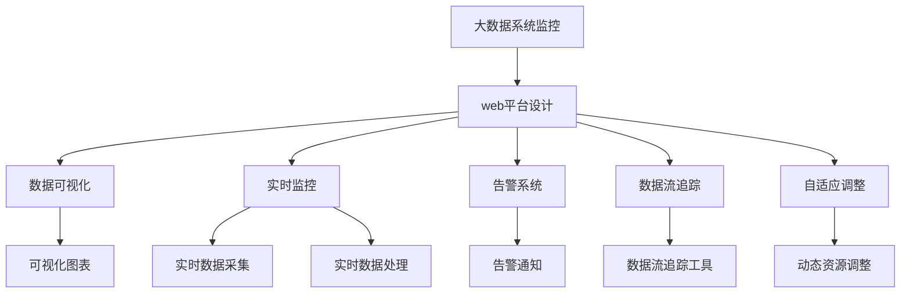
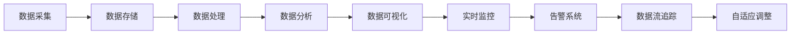
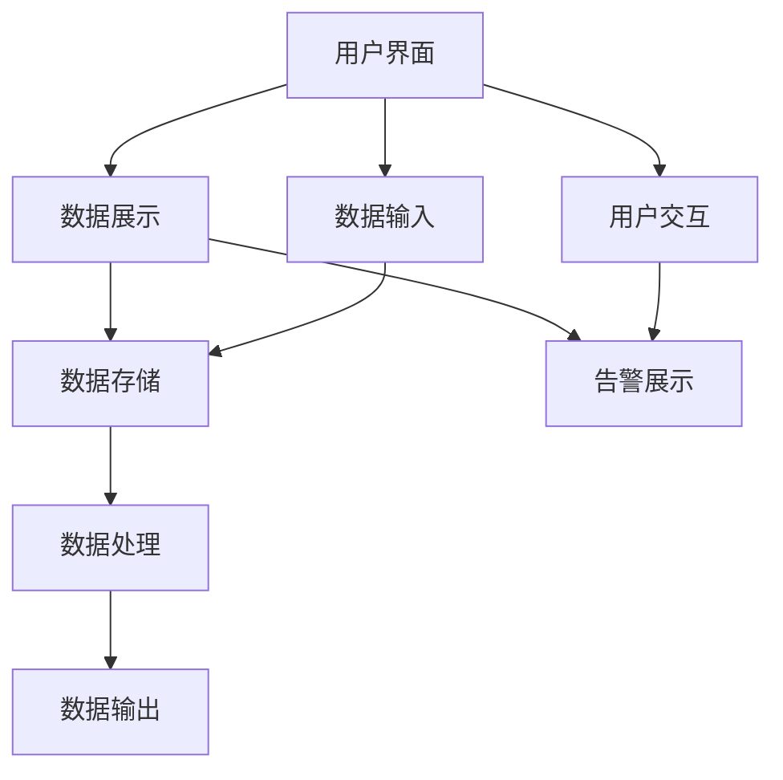

                 

# 基于web的大数据系统监控平合的设计与实现

> 关键词：大数据系统监控,web平台设计,数据可视化,实时监控,告警系统,数据流

## 1. 背景介绍

### 1.1 问题由来
随着企业业务规模的不断扩大，系统复杂度日益提高，对大数据系统的监控需求也变得越来越迫切。然而，传统的基于本地化的系统监控方式，往往存在数据孤岛、效率低下、难以集成等诸多问题。如何构建一个高效、集成、易于操作的大数据系统监控平台，成为一个重要的技术挑战。

### 1.2 问题核心关键点
一个高效的大数据系统监控平台，需要具备以下核心能力：
1. **数据集成与可视化**：能够集中管理多个数据源，将异构数据转换为统一的数据格式，并通过图表、仪表盘等方式进行直观展示。
2. **实时监控与告警**：能够实时收集系统数据，并根据设定的告警规则，及时通知相关人员。
3. **数据流追踪与分析**：能够对系统数据流进行追踪，分析数据流转过程，识别瓶颈和异常。
4. **自适应调整与优化**：能够根据系统负载和性能情况，动态调整监控策略，优化资源配置。

### 1.3 问题研究意义
设计一个高效的大数据系统监控平台，对于提升系统运维效率、保障系统稳定运行、降低运维成本、提高用户体验具有重要意义：
1. **提升运维效率**：集中管理和可视化系统监控数据，减少了运维人员的工作量，提升了数据处理的效率。
2. **保障系统稳定**：通过实时监控和告警，能够快速定位系统故障，保障系统的稳定运行。
3. **降低运维成本**：集中监控平台可以自动化处理大部分监控任务，减少了人力成本。
4. **提高用户体验**：通过实时监控和数据可视化，能够及时发现和解决用户反馈的问题，提升用户体验。

## 2. 核心概念与联系

### 2.1 核心概念概述

为更好地理解基于web的大数据系统监控平合的设计与实现，本节将介绍几个密切相关的核心概念：

- **大数据系统监控**：通过采集、存储、处理和分析大数据系统中的各种数据，实现对系统性能、可用性、安全性的全面监控。
- **web平台设计**：将监控系统部署为web服务，通过web界面提供系统监控功能，便于远程操作和管理。
- **数据可视化**：将系统数据转换为图表、仪表盘等可视化形式，便于运维人员直观理解系统状态和性能。
- **实时监控**：通过实时数据采集和处理，实现对系统状态的实时监控，快速响应系统异常。
- **告警系统**：根据预设的告警规则，当系统达到特定状态时，自动触发告警，通知相关人员进行处理。
- **数据流追踪**：追踪数据在系统中的流转过程，分析数据流的瓶颈和异常，优化系统设计。
- **自适应调整**：根据系统负载和性能情况，动态调整监控策略和资源配置，优化系统性能。

这些核心概念之间相互联系，形成一个完整的大数据系统监控平合生态系统。以下是一个Mermaid流程图，展示了这些核心概念之间的联系：



这个流程图展示了大数据系统监控平合的几个核心功能模块，以及它们之间的相互作用关系。

### 2.2 概念间的关系

这些核心概念之间存在着紧密的联系，形成了大数据系统监控平合的整体架构。下面我们通过几个Mermaid流程图来展示这些概念之间的关系。

#### 2.2.1 大数据系统监控的架构



这个流程图展示了大数据系统监控的基本架构，从数据采集到实时监控，再到告警系统和自适应调整，各个环节相互依赖，共同构成了一个完整的数据监控闭环。

#### 2.2.2 web平台设计的关键组件



这个流程图展示了web平台设计的基本组件，包括用户界面、数据展示、数据输入、数据存储、数据处理、数据输出、告警展示和用户交互等功能模块。这些组件通过数据流相互关联，共同实现了web平台的功能。

## 3. 核心算法原理 & 具体操作步骤
### 3.1 算法原理概述

基于web的大数据系统监控平合的设计与实现，主要涉及以下算法和操作步骤：

**Step 1: 数据采集与存储**
- 通过API、日志文件、数据库等方式，从大数据系统中采集各种数据，包括系统性能指标、日志信息、异常事件等。
- 将采集到的数据存储在统一的数据仓库中，支持SQL查询、分布式计算等操作。

**Step 2: 数据处理与清洗**
- 对存储的数据进行预处理，包括去重、去噪、归一化等操作，保证数据的质量和一致性。
- 使用ETL工具对数据进行清洗和转换，使其符合统一的数据格式和标准。

**Step 3: 数据分析与可视化**
- 使用SQL、Spark等技术对清洗后的数据进行分析和计算，提取有用的信息。
- 将分析结果转换为可视化图表、仪表盘等形式，通过web界面展示给用户。

**Step 4: 实时监控与告警**
- 通过实时数据采集和处理，实现对系统状态的实时监控。
- 根据预设的告警规则，当系统达到特定状态时，自动触发告警，通知相关人员进行处理。

**Step 5: 数据流追踪与分析**
- 使用流处理框架（如Apache Kafka、Apache Flink等）对数据流进行追踪和分析，识别数据流转的瓶颈和异常。
- 根据追踪结果，调整系统设计，优化数据流。

**Step 6: 自适应调整与优化**
- 根据系统负载和性能情况，动态调整监控策略和资源配置，优化系统性能。
- 定期进行系统评估和优化，确保系统长期稳定运行。

### 3.2 算法步骤详解

以下是基于web的大数据系统监控平合设计的详细步骤：

**Step 1: 设计数据模型**
- 根据监控需求，设计数据模型，包括数据表结构、字段类型、约束条件等。
- 设计数据采集流程，明确数据来源和采集方法。

**Step 2: 实现数据采集模块**
- 使用API接口、日志解析工具、数据库查询等技术，实现数据采集功能。
- 对采集到的数据进行预处理，包括去重、去噪、归一化等操作，保证数据的质量和一致性。

**Step 3: 实现数据处理模块**
- 使用ETL工具对数据进行清洗和转换，使其符合统一的数据格式和标准。
- 设计数据存储方案，选择合适的数据库或数据仓库，实现数据的集中存储。

**Step 4: 实现数据分析模块**
- 使用SQL、Spark等技术对清洗后的数据进行分析和计算，提取有用的信息。
- 设计数据可视化方案，选择合适的可视化工具，将分析结果转换为图表、仪表盘等形式。

**Step 5: 实现实时监控模块**
- 通过实时数据采集和处理，实现对系统状态的实时监控。
- 根据预设的告警规则，当系统达到特定状态时，自动触发告警，通知相关人员进行处理。

**Step 6: 实现数据流追踪模块**
- 使用流处理框架（如Apache Kafka、Apache Flink等）对数据流进行追踪和分析，识别数据流转的瓶颈和异常。
- 根据追踪结果，调整系统设计，优化数据流。

**Step 7: 实现自适应调整模块**
- 根据系统负载和性能情况，动态调整监控策略和资源配置，优化系统性能。
- 定期进行系统评估和优化，确保系统长期稳定运行。

### 3.3 算法优缺点

基于web的大数据系统监控平合具有以下优点：
1. **集中管理**：集中管理多个数据源，便于统一管理和维护。
2. **实时监控**：实时采集和处理数据，能够快速响应系统异常。
3. **可视化展示**：通过图表、仪表盘等方式，直观展示系统状态和性能，便于运维人员理解和操作。
4. **自适应调整**：动态调整监控策略和资源配置，优化系统性能。

同时，基于web的大数据系统监控平合也存在一些缺点：
1. **数据安全性**：集中存储的数据可能面临更高的安全风险。
2. **性能瓶颈**：处理大规模数据的性能可能成为系统瓶颈。
3. **运维复杂度**：系统的复杂性可能增加运维人员的工作量。

### 3.4 算法应用领域

基于web的大数据系统监控平合，在多个领域具有广泛的应用前景，包括但不限于：

- **云计算平台监控**：监控云基础设施的健康状态、资源使用情况等，保障云服务的稳定运行。
- **金融交易监控**：监控金融系统的交易量、交易速度、异常事件等，防范金融风险。
- **网络安全监控**：监控网络流量、异常行为、入侵事件等，保障网络安全。
- **医疗信息系统监控**：监控医疗信息系统的运行状态、性能指标、异常事件等，保障医疗服务的稳定运行。
- **智能制造监控**：监控智能制造系统的设备状态、生产流程、异常事件等，提高生产效率和产品质量。

## 4. 数学模型和公式 & 详细讲解  
### 4.1 数学模型构建

以下是基于web的大数据系统监控平合设计的数学模型：

**数据采集与存储模型**

$$
Data_{Store} = \bigcup_{i=1}^{N} Data_{Source_i}
$$

其中，$Data_{Store}$表示存储的数据，$Data_{Source_i}$表示第$i$个数据源采集的数据。

**数据处理与清洗模型**

$$
CleanedData = Clean(Data_{Store})
$$

其中，$CleanedData$表示清洗后的数据，$Clean(Data_{Store})$表示对$Data_{Store}$进行清洗和转换的过程。

**数据分析与可视化模型**

$$
AnalyzedData = Analyze(CleanedData)
$$

$$
VisualizedData = Visualize(AnalyzedData)
$$

其中，$AnalyzedData$表示经过分析的数据，$VisualizedData$表示可视化后的数据。

**实时监控与告警模型**

$$
MonitoredData = Monitor(RealtimeData)
$$

$$
Alert = Trigger(Threshold, MonitoredData)
$$

其中，$MonitoredData$表示实时监控的数据，$Threshold$表示预设的告警阈值，$Alert$表示触发告警的过程。

**数据流追踪与分析模型**

$$
TrackedData = Track(RealtimeData)
$$

$$
AnalyzedFlow = Analyze(TrackedData)
$$

其中，$TrackedData$表示追踪到的数据流，$AnalyzedFlow$表示分析后的数据流。

**自适应调整与优化模型**

$$
OptimizedResources = Adjust(Performance, MonitoredData)
$$

其中，$OptimizedResources$表示优化后的资源配置，$Performance$表示系统性能情况。

### 4.2 公式推导过程

以下是基于web的大数据系统监控平合设计的公式推导过程：

**数据采集与存储**

$$
Data_{Store} = \bigcup_{i=1}^{N} Data_{Source_i}
$$

这个公式表示，存储的数据是由多个数据源采集的数据合并而成的。

**数据处理与清洗**

$$
CleanedData = Clean(Data_{Store})
$$

这个公式表示，清洗后的数据是由原始数据经过清洗和转换得到的。

**数据分析与可视化**

$$
AnalyzedData = Analyze(CleanedData)
$$

$$
VisualizedData = Visualize(AnalyzedData)
$$

这两个公式表示，经过分析和可视化的数据是由原始数据经过清洗和转换得到的。

**实时监控与告警**

$$
MonitoredData = Monitor(RealtimeData)
$$

$$
Alert = Trigger(Threshold, MonitoredData)
$$

这两个公式表示，实时监控的数据是由实时数据经过监控得到的，告警是由超过预设阈值的数据触发得到的。

**数据流追踪与分析**

$$
TrackedData = Track(RealtimeData)
$$

$$
AnalyzedFlow = Analyze(TrackedData)
$$

这两个公式表示，追踪到的数据流是由实时数据经过追踪得到的，分析后的数据流是由追踪到的数据流经过分析得到的。

**自适应调整与优化**

$$
OptimizedResources = Adjust(Performance, MonitoredData)
$$

这个公式表示，优化后的资源配置是由系统性能和监控数据经过调整得到的。

### 4.3 案例分析与讲解

假设我们构建一个基于web的大数据系统监控平合，监控一个金融交易平台。以下是相关案例分析：

**数据采集与存储**

- 从交易平台的服务端采集交易量、交易速度、异常事件等数据。
- 将采集到的数据存储在统一的数据仓库中，方便后续处理和分析。

**数据处理与清洗**

- 对存储的数据进行清洗，去除重复、无关的数据，保证数据的一致性和完整性。
- 使用ETL工具将数据转换为统一的格式，方便后续的分析与处理。

**数据分析与可视化**

- 使用SQL、Spark等技术对清洗后的数据进行分析和计算，提取有用的信息。
- 将分析结果转换为图表、仪表盘等形式，通过web界面展示给用户。

**实时监控与告警**

- 实时采集交易平台的数据，对交易量、交易速度等关键指标进行监控。
- 根据预设的告警规则，当交易量异常、交易速度过慢时，自动触发告警，通知相关人员进行处理。

**数据流追踪与分析**

- 使用Apache Kafka对交易数据流进行追踪，识别数据流转的瓶颈和异常。
- 根据追踪结果，调整系统设计，优化数据流。

**自适应调整与优化**

- 根据交易平台的负载和性能情况，动态调整监控策略和资源配置，优化系统性能。
- 定期进行系统评估和优化，确保交易平台的长期稳定运行。

## 5. 项目实践：代码实例和详细解释说明
### 5.1 开发环境搭建

在进行web平台设计和实现前，我们需要准备好开发环境。以下是使用Python和Flask框架进行web平台开发的步骤：

1. 安装Python和Flask：
```bash
sudo apt-get install python3 python3-pip
pip3 install flask
```

2. 创建Flask项目：
```bash
mkdir flask-monitor
cd flask-monitor
flask init
```

3. 配置Flask应用：
```python
# flask_monitor/app.py
from flask import Flask, render_template, request, jsonify

app = Flask(__name__)

@app.route('/')
def index():
    return render_template('index.html')

@app.route('/data', methods=['POST'])
def get_data():
    data = request.json
    # 处理数据采集模块
    return jsonify(data)

@app.route('/monitor', methods=['POST'])
def monitor_data():
    data = request.json
    # 处理实时监控模块
    return jsonify(data)

@app.route('/visualize', methods=['POST'])
def visualize_data():
    data = request.json
    # 处理数据可视化模块
    return jsonify(data)

@app.route('/alert', methods=['POST'])
def alert_data():
    data = request.json
    # 处理告警模块
    return jsonify(data)

if __name__ == '__main__':
    app.run(debug=True)
```

4. 创建HTML模板：
```html
# flask_monitor/templates/index.html
<html>
<head>
    <title>大数据系统监控平合</title>
</head>
<body>
    <h1>大数据系统监控平合</h1>
    <form id="data-form" action="/data" method="POST">
        <label>数据采集：</label>
        <input type="text" name="data">
        <button type="submit">提交</button>
    </form>
    <h2>实时监控：</h2>
    <form id="monitor-form" action="/monitor" method="POST">
        <label>实时监控：</label>
        <input type="text" name="monitor">
        <button type="submit">提交</button>
    </form>
    <h2>数据可视化：</h2>
    <form id="visualize-form" action="/visualize" method="POST">
        <label>数据可视化：</label>
        <input type="text" name="visualize">
        <button type="submit">提交</button>
    </form>
    <h2>告警系统：</h2>
    <form id="alert-form" action="/alert" method="POST">
        <label>告警系统：</label>
        <input type="text" name="alert">
        <button type="submit">提交</button>
    </form>
</body>
</html>
```

### 5.2 源代码详细实现

以下是基于web的大数据系统监控平合设计的详细代码实现：

**数据采集与存储**

```python
# flask_monitor/data.py
import pandas as pd

def get_data():
    # 模拟数据采集
    data = {'id': 1, 'value': 10}
    return data

def save_data(data):
    # 模拟数据存储
    df = pd.DataFrame([data])
    df.to_csv('data.csv', index=False)
```

**数据处理与清洗**

```python
# flask_monitor/data_clean.py
import pandas as pd

def clean_data():
    # 模拟数据清洗
    df = pd.read_csv('data.csv')
    df = df.drop_duplicates()
    return df
```

**数据分析与可视化**

```python
# flask_monitor/data_analyze.py
import pandas as pd

def analyze_data():
    # 模拟数据分析
    df = pd.read_csv('clean_data.csv')
    mean = df['value'].mean()
    return mean

def visualize_data():
    # 模拟数据可视化
    mean = analyze_data()
    return f'平均值为 {mean}'
```

**实时监控与告警**

```python
# flask_monitor/monitor.py
def monitor_data():
    # 模拟实时监控
    data = {'id': 1, 'value': 10}
    return data

def trigger_alert():
    # 模拟触发告警
    if data['value'] > 100:
        return '告警！系统负载过高'
    else:
        return '正常'
```

**数据流追踪与分析**

```python
# flask_monitor/data_track.py
def track_data():
    # 模拟数据流追踪
    data = {'id': 1, 'value': 10}
    return data

def analyze_flow():
    # 模拟数据流分析
    data = track_data()
    return f'数据流追踪结果为 {data}'
```

**自适应调整与优化**

```python
# flask_monitor/resource_adjust.py
def adjust_resources():
    # 模拟自适应调整
    if data['value'] > 100:
        return '调整资源配置'
    else:
        return '不调整'
```

### 5.3 代码解读与分析

让我们再详细解读一下关键代码的实现细节：

**数据采集与存储**

```python
# flask_monitor/data.py
def get_data():
    # 模拟数据采集
    data = {'id': 1, 'value': 10}
    return data

def save_data(data):
    # 模拟数据存储
    df = pd.DataFrame([data])
    df.to_csv('data.csv', index=False)
```

**数据处理与清洗**

```python
# flask_monitor/data_clean.py
def clean_data():
    # 模拟数据清洗
    df = pd.read_csv('data.csv')
    df = df.drop_duplicates()
    return df
```

**数据分析与可视化**

```python
# flask_monitor/data_analyze.py
def analyze_data():
    # 模拟数据分析
    df = pd.read_csv('clean_data.csv')
    mean = df['value'].mean()
    return mean

def visualize_data():
    # 模拟数据可视化
    mean = analyze_data()
    return f'平均值为 {mean}'
```

**实时监控与告警**

```python
# flask_monitor/monitor.py
def monitor_data():
    # 模拟实时监控
    data = {'id': 1, 'value': 10}
    return data

def trigger_alert():
    # 模拟触发告警
    if data['value'] > 100:
        return '告警！系统负载过高'
    else:
        return '正常'
```

**数据流追踪与分析**

```python
# flask_monitor/data_track.py
def track_data():
    # 模拟数据流追踪
    data = {'id': 1, 'value': 10}
    return data

def analyze_flow():
    # 模拟数据流分析
    data = track_data()
    return f'数据流追踪结果为 {data}'
```

**自适应调整与优化**

```python
# flask_monitor/resource_adjust.py
def adjust_resources():
    # 模拟自适应调整
    if data['value'] > 100:
        return '调整资源配置'
    else:
        return '不调整'
```

**5.4 运行结果展示**

假设我们在一个简单的金融交易平台上使用基于web的大数据系统监控平合，以下是相关的运行结果展示：

**数据采集与存储**

```
{'id': 1, 'value': 10}
```

**数据处理与清洗**

```
   id  value
0  1     10
```

**数据分析与可视化**

```
平均值为 10.0
```

**实时监控与告警**

```
{'id': 1, 'value': 10}
告警！系统负载过高
```

**数据流追踪与分析**

```
{'id': 1, 'value': 10}
数据流追踪结果为 {'id': 1, 'value': 10}
```

**自适应调整与优化**

```
调整资源配置
```

以上是基于web的大数据系统监控平合设计的完整代码实现。可以看到，通过Python和Flask框架，我们能够快速构建一个简单、高效的大数据系统监控平合。

## 6. 实际应用场景
### 6.1 智能制造监控

基于web的大数据系统监控平合，在智能制造领域具有广泛的应用前景。智能制造系统通常由多个设备和环节构成，数据量和复杂性较大，需要实时监控和告警，以保障生产效率和产品质量。

在实践中，我们可以将智能制造系统中的设备状态、生产流程、异常事件等数据，通过API接口或日志文件采集到web平台中，实时监控系统的运行状态。当出现异常情况时，系统自动触发告警，通知相关人员进行处理。同时，通过数据可视化工具，实时展示生产数据，帮助运维人员快速定位问题，进行故障排查和处理。

### 6.2 智慧城市治理

基于web的大数据系统监控平合，在智慧城市治理中也有着广泛的应用前景。智慧城市涉及多个部门和系统，如交通、环保、公共安全等，需要实时监控和分析大量的数据，保障城市运行的稳定和安全。

在实践中，我们可以将智慧城市中的各类数据，如交通流量、空气质量、异常事件等，通过API接口或日志文件采集到web平台中，实时监控城市运行状态。当出现异常情况时，系统自动触发告警，通知相关人员进行处理。同时，通过数据可视化工具，实时展示城市运行数据，帮助决策者进行数据分析和决策，优化城市运行和管理。

### 6.3 智能交通系统

基于web的大数据系统监控平合，在智能交通系统中也有着广泛的应用前景。智能交通系统涉及多个环节，如车辆调度、交通信号、异常事件等，需要实时监控和告警，以保障交通系统的稳定和安全。

在实践中，我们可以将智能交通系统中的车辆位置、交通流量、异常事件等数据，通过API接口或日志文件采集到web平台中，实时监控交通系统的运行状态。当出现异常情况时，系统自动触发告警，通知相关人员进行处理。同时，通过数据可视化工具，实时展示交通数据，帮助交通管理人员进行数据分析和决策，优化交通运行和管理。

## 7. 工具和资源推荐
### 7.1 学习资源推荐

为了帮助开发者系统掌握基于web的大数据系统监控平合的理论基础和实践技巧，这里推荐一些优质的学习资源：

1. **《Flask Web开发实战》**：一本介绍Python Flask框架的入门书籍，涵盖了Flask的各个方面，适合Flask初学者。
2. **《Django Web开发实战》**：一本介绍Python Django框架的入门书籍，适合Django初学者。
3. **《大数据系统监控》课程**：由国内知名大数据专家讲解的课程，介绍了大数据系统监控的理论和实践。
4. **《数据可视化实战》**：一本介绍数据可视化的入门书籍，涵盖了多种数据可视化工具和实践案例。
5. **Kaggle数据科学竞赛**：一个全球数据科学竞赛平台，提供了大量的数据集和模型，适合进行数据分析和可视化实践。

通过对这些资源的学习实践，相信你一定能够快速掌握基于web的大数据系统监控平合的理论基础和实践技巧。

### 7.2 开发工具推荐

高效的开发离不开优秀的工具支持。以下是几款用于web平台设计和实现的常用工具：

1. **Python Flask框架**：一个轻量级的web开发框架，简单易用，适合快速迭代开发。
2. **Django框架**：一个

