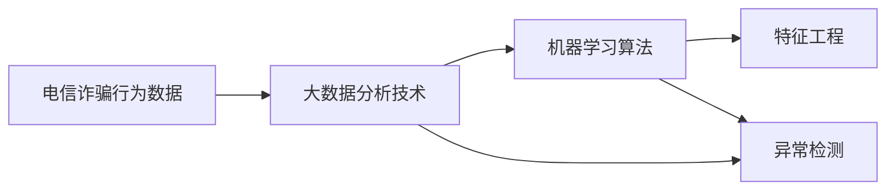
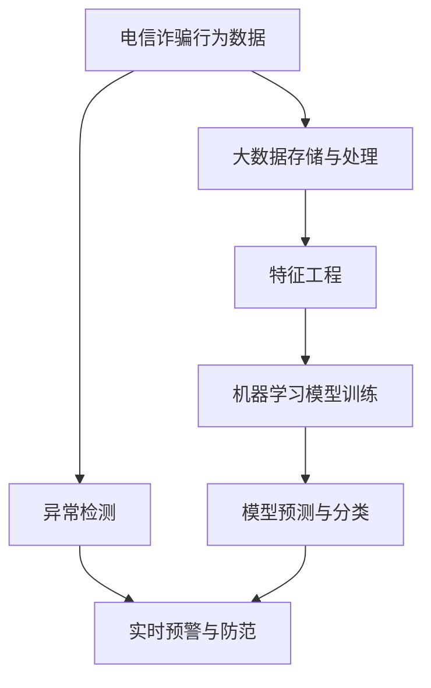

                 

# 基于大数据的电信诈骗行为分析研究

在当今数字化信息时代，电信诈骗作为一种新型犯罪形式，呈现出智能化、隐蔽化和复杂化的特征。随着社交媒体、网络支付等新兴技术的普及，电信诈骗手段不断演变，对人们的财产安全构成了巨大威胁。为了有效应对这一挑战，本文将基于大数据技术，深入研究电信诈骗行为的特点和规律，提出一套系统化的分析框架和方法，为打击电信诈骗提供技术支持和决策参考。

## 1. 背景介绍

### 1.1 电信诈骗问题由来

电信诈骗是指利用通信技术和手段，虚构事实或隐瞒真相，诱骗他人交付财产的行为。近年来，电信诈骗案件数量持续增长，其手段日益智能化和复杂化，严重影响了社会经济秩序和人民群众的财产安全。例如，电话诈骗、网络钓鱼、假冒客服等新型诈骗手段不断涌现，给打击工作带来了新的挑战。

### 1.2 电信诈骗的主要类型

电信诈骗类型繁多，根据诈骗方式和手段的不同，可以分为以下几类：

1. **电话诈骗**：冒充公检法、银行、通信运营商等机构，以非法索取个人信息、汇款、转账等名义进行诈骗。
2. **网络钓鱼**：通过伪造网站、邮件等方式，诱骗受害者输入个人信息、账号密码等，窃取财产。
3. **假冒客服**：冒充电商平台、银行、运营商客服，以售后退款、账户异常等名义，诱导受害者进行资金操作。

### 1.3 电信诈骗的特点

电信诈骗具有以下显著特点：

1. **隐蔽性强**：诈骗者通常通过虚拟电话、假冒客服等方式，隐藏真实身份，难以为公安机关追查。
2. **技术手段先进**：利用社交媒体、网络支付等技术手段，智能化程度高，受害人难以识别。
3. **高收益性**：电信诈骗手段相对简单，但收益巨大，吸引了大量不法分子参与。
4. **跨地域性**：电信诈骗行为不受地域限制，受害人遍布全国各地，打击难度大。

## 2. 核心概念与联系

### 2.1 核心概念概述

为更好地理解基于大数据的电信诈骗行为分析，本节将介绍几个关键概念：

- **电信诈骗行为数据**：记录电信诈骗案件的相关数据，包括时间、地点、金额、手法等。
- **大数据分析技术**：指通过海量数据的收集、存储、分析和可视化，发现电信诈骗行为模式和规律的技术。
- **机器学习算法**：用于从电信诈骗行为数据中挖掘特征和规律，构建模型进行预测和分类。
- **特征工程**：指在电信诈骗行为数据中提取、选择和构造有意义的特征，提升模型效果。
- **异常检测**：指通过数据分析技术，识别电信诈骗行为中的异常事件，及时进行预警和防范。

### 2.2 概念间的关系

这些核心概念之间的逻辑关系可以通过以下Mermaid流程图来展示：



这个流程图展示了大数据技术在电信诈骗行为分析中的作用。电信诈骗行为数据通过大数据分析技术进行存储和处理，机器学习算法用于特征提取和模型构建，特征工程用于提升模型效果，异常检测用于实时预警和防范。

### 2.3 核心概念的整体架构

最后，我们用一个综合的流程图来展示这些核心概念在大数据电信诈骗行为分析中的整体架构：



这个综合流程图展示了从数据收集到模型预测的完整过程，以及异常检测和实时预警在大数据电信诈骗行为分析中的应用。

## 3. 核心算法原理 & 具体操作步骤

### 3.1 算法原理概述

基于大数据的电信诈骗行为分析，主要是通过机器学习算法和大数据处理技术，从海量电信诈骗行为数据中挖掘特征和规律，构建预测模型，实现对新发诈骗事件的及时预警和防范。

具体而言，主要包括以下步骤：

1. **数据收集**：从多个渠道收集电信诈骗行为数据，包括运营商、银行、社交媒体等。
2. **数据清洗与预处理**：清洗数据，处理缺失值、异常值，进行归一化、特征工程等预处理操作。
3. **特征选择与构造**：从原始数据中选择和构造有意义的特征，提升模型的预测准确性。
4. **模型构建与训练**：选择合适的机器学习算法，如随机森林、神经网络等，构建预测模型，并使用训练集数据进行训练。
5. **模型评估与优化**：使用测试集数据评估模型效果，调整模型参数和特征选择，提升模型性能。
6. **异常检测与预警**：通过分析模型预测结果和实际发生事件，识别异常事件，进行实时预警和防范。

### 3.2 算法步骤详解

#### 3.2.1 数据收集与清洗

电信诈骗行为数据收集是分析的第一步，通常包括以下几个方面：

1. **运营商数据**：包括通话记录、短信记录、用户基本信息等。
2. **银行交易数据**：包括交易记录、账户信息、交易金额等。
3. **社交媒体数据**：包括聊天记录、点赞记录、好友关系等。
4. **公共信息数据**：包括身份信息、企业信息、地址信息等。

收集到数据后，需要对数据进行清洗和预处理，以去除噪音和异常值，保证数据质量。数据清洗步骤包括：

- **去重**：删除重复记录，确保数据的唯一性。
- **缺失值处理**：填补缺失值或删除含有缺失值的记录。
- **异常值检测**：识别和处理数据中的异常值，确保数据的一致性。
- **数据归一化**：将不同量级的数据转换为同一量级，便于后续处理。

#### 3.2.2 特征选择与构造

在电信诈骗行为分析中，特征选择和构造至关重要。通过选择合适的特征，可以显著提升模型的预测效果。以下是一些常用的特征选择方法：

1. **关联规则挖掘**：使用Apriori、FP-growth等算法，发现数据中的频繁模式和关联关系，提取有用的特征。
2. **主成分分析(PCA)**：对高维数据进行降维，提取主成分，保留最重要的特征。
3. **卡方检验**：通过卡方检验统计量，评估特征与目标变量之间的关联性，筛选重要的特征。

特征构造方法包括：

- **时间特征**：提取事件发生的时间、持续时间、时段等特征。
- **位置特征**：提取事件发生的地点、区域、交通方式等特征。
- **金额特征**：提取交易金额、汇款金额、转账金额等特征。
- **行为特征**：提取用户的通话记录、聊天记录、交易记录等行为特征。
- **关系特征**：提取用户与受害人之间的关系、好友关系、社交关系等。

#### 3.2.3 模型构建与训练

选择合适的机器学习算法是电信诈骗行为分析的关键步骤。常用的算法包括：

- **随机森林**：一种集成学习方法，通过组合多个决策树，提升模型的预测准确性。
- **支持向量机(SVM)**：一种基于边界的分类器，通过最大化分类间隔，提升模型的泛化能力。
- **神经网络**：通过多层非线性映射，提取复杂的特征关系，适用于大规模数据集。

模型构建步骤包括：

1. **数据划分**：将数据集划分为训练集、验证集和测试集，用于模型训练、验证和测试。
2. **模型选择**：根据数据特点和任务需求，选择合适的机器学习算法。
3. **模型训练**：使用训练集数据，训练模型，调整模型参数，提升模型性能。
4. **模型验证**：使用验证集数据，评估模型效果，调整模型参数，防止过拟合。
5. **模型测试**：使用测试集数据，测试模型的泛化能力，评估模型效果。

#### 3.2.4 异常检测与预警

异常检测是电信诈骗行为分析的重要组成部分，通过识别异常事件，及时进行预警和防范。以下是一些常用的异常检测方法：

1. **孤立森林**：一种基于树结构的数据异常检测算法，适用于处理高维数据和大规模数据集。
2. **基于统计的方法**：如均值漂移、箱线图等，通过统计特征，识别异常事件。
3. **时间序列分析**：通过时间序列建模，识别异常事件的时间模式和规律。

异常检测步骤包括：

1. **数据标准化**：对原始数据进行标准化处理，确保数据的一致性。
2. **异常检测**：使用异常检测算法，识别数据中的异常事件。
3. **预警与防范**：根据异常事件的类型和风险等级，进行实时预警和防范，如冻结账户、限制交易等。

### 3.3 算法优缺点

#### 3.3.1 优点

1. **数据驱动**：通过海量数据进行建模，能够发现电信诈骗行为中的复杂规律和特征，提升模型预测准确性。
2. **实时预警**：通过实时分析，能够及时发现和预警新发的电信诈骗事件，减少损失。
3. **自动化**：利用大数据和机器学习技术，实现电信诈骗行为分析的自动化，减少人工干预。

#### 3.3.2 缺点

1. **数据质量依赖**：模型的效果依赖于数据的完整性和质量，数据清洗和预处理难度较大。
2. **模型复杂**：电信诈骗行为数据复杂多变，需要构建复杂的模型，提升模型效果的代价较大。
3. **隐私风险**：涉及大量个人和隐私数据，数据安全和隐私保护是一个重要的挑战。

### 3.4 算法应用领域

基于大数据的电信诈骗行为分析技术，已经在多个领域得到广泛应用，例如：

1. **运营商**：用于检测和防范电话诈骗、短信诈骗等传统电信诈骗行为。
2. **银行**：用于识别和防范网络钓鱼、假冒客服等新型电信诈骗行为。
3. **电商平台**：用于检测和防范假冒客服、网络诈骗等电商诈骗行为。
4. **社交媒体**：用于识别和防范网络钓鱼、社交诈骗等新型电信诈骗行为。

## 4. 数学模型和公式 & 详细讲解 & 举例说明

### 4.1 数学模型构建

电信诈骗行为分析的数学模型主要包括以下几个方面：

1. **分类模型**：用于将电信诈骗行为分为不同的类别，如电话诈骗、网络钓鱼等。
2. **预测模型**：用于预测电信诈骗行为的发生概率，并进行风险评估。
3. **异常检测模型**：用于识别数据中的异常事件，进行实时预警和防范。

#### 4.1.1 分类模型

分类模型通常使用二分类或多分类算法，如随机森林、支持向量机、神经网络等。以随机森林为例，其模型公式为：

$$
\hat{y} = \sum_{k=1}^{K} w_k \cdot f_k(x)
$$

其中，$K$ 为决策树的个数，$w_k$ 为决策树的权重，$f_k(x)$ 为决策树对样本 $x$ 的分类结果。

#### 4.1.2 预测模型

预测模型通常使用回归算法，如线性回归、逻辑回归、神经网络等。以线性回归为例，其模型公式为：

$$
\hat{y} = \theta_0 + \sum_{i=1}^{n} \theta_i x_i
$$

其中，$\theta_0$ 为截距项，$\theta_i$ 为回归系数，$x_i$ 为输入特征，$y$ 为输出变量。

#### 4.1.3 异常检测模型

异常检测模型通常使用基于距离的方法，如孤立森林、基于统计的方法等。以孤立森林为例，其模型公式为：

$$
\text{score}(x) = \frac{\text{depth}}{n}
$$

其中，$\text{depth}$ 为样本 $x$ 在孤立森林中的深度，$n$ 为样本总数。

### 4.2 公式推导过程

#### 4.2.1 分类模型推导

以随机森林分类模型为例，其训练过程包括：

1. **样本划分**：从训练集样本中随机抽取子集，作为决策树的训练样本。
2. **决策树生长**：通过选择最佳特征和分割点，构建决策树。
3. **模型集成**：将多个决策树的分类结果进行集成，得到最终分类结果。

#### 4.2.2 预测模型推导

以线性回归预测模型为例，其训练过程包括：

1. **模型拟合**：使用训练集数据，拟合线性回归模型，得到回归系数 $\theta_i$。
2. **预测**：使用测试集数据，代入模型公式，得到预测结果 $\hat{y}$。

#### 4.2.3 异常检测模型推导

以孤立森林异常检测模型为例，其训练过程包括：

1. **样本划分**：从训练集样本中随机抽取子集，作为孤立森林的训练样本。
2. **孤立树生长**：通过选择最佳特征和分割点，构建孤立树。
3. **异常得分计算**：计算每个样本的孤立得分，识别异常样本。

### 4.3 案例分析与讲解

#### 4.3.1 案例背景

某银行在处理一笔异常交易时，发现用户账户内突然有大量现金汇入，疑似被电信诈骗。为了确认是否为电信诈骗，银行决定利用基于大数据的电信诈骗行为分析系统进行分析。

#### 4.3.2 数据收集与预处理

银行收集了用户账户的交易记录、通话记录、社交媒体聊天记录等数据。通过对数据进行清洗和预处理，删除了重复记录和异常值，对数据进行了归一化处理。

#### 4.3.3 特征选择与构造

根据数据特点，选择了时间特征、金额特征、行为特征等。通过主成分分析(PCA)方法，对高维数据进行了降维，提取了最重要的特征。

#### 4.3.4 模型构建与训练

选择了随机森林分类模型，并使用训练集数据进行训练。通过交叉验证，调整了模型参数，提升了模型性能。

#### 4.3.5 异常检测与预警

通过异常检测算法，识别出该笔交易为异常事件，银行决定对用户账户进行冻结和锁定，并联系用户进行确认。

## 5. 项目实践：代码实例和详细解释说明

### 5.1 开发环境搭建

在进行电信诈骗行为分析项目开发前，需要先搭建好开发环境。以下是Python开发环境的搭建步骤：

1. **安装Python**：下载Python 3.x版本，并进行安装。
2. **安装Pandas**：Pandas是Python中常用的数据处理库，可以使用以下命令进行安装：

```bash
pip install pandas
```

3. **安装Scikit-learn**：Scikit-learn是Python中常用的机器学习库，可以使用以下命令进行安装：

```bash
pip install scikit-learn
```

4. **安装TensorFlow**：TensorFlow是常用的深度学习框架，可以使用以下命令进行安装：

```bash
pip install tensorflow
```

5. **安装Matplotlib**：Matplotlib是Python中常用的数据可视化库，可以使用以下命令进行安装：

```bash
pip install matplotlib
```

### 5.2 源代码详细实现

以下是使用Python进行电信诈骗行为分析的代码实现：

```python
import pandas as pd
from sklearn.ensemble import RandomForestClassifier
from sklearn.metrics import accuracy_score, confusion_matrix
import matplotlib.pyplot as plt

# 读取数据集
data = pd.read_csv('fraud_dataset.csv')

# 数据清洗和预处理
data = data.drop_duplicates()
data = data.dropna()
data = data.apply(lambda x: x.fillna(0))

# 特征选择和构造
features = ['time', 'amount', 'behavior']
X = data[features]
y = data['label']

# 模型构建与训练
model = RandomForestClassifier(n_estimators=100)
model.fit(X, y)

# 模型评估与优化
y_pred = model.predict(X)
accuracy = accuracy_score(y, y_pred)
confusion = confusion_matrix(y, y_pred)

# 可视化结果
plt.bar(['Positive', 'Negative'], confusion.ravel(), width=0.4)
plt.xlabel('Actual')
plt.ylabel('Predicted')
plt.show()

# 输出结果
print('Accuracy: ', accuracy)
```

### 5.3 代码解读与分析

以下是代码的详细解读和分析：

**数据读取与预处理**

```python
# 读取数据集
data = pd.read_csv('fraud_dataset.csv')

# 数据清洗和预处理
data = data.drop_duplicates()
data = data.dropna()
data = data.apply(lambda x: x.fillna(0))
```

从CSV文件中读取电信诈骗行为数据集，并对数据进行清洗和预处理。删除重复记录和缺失值，并使用0填充缺失值。

**特征选择与构造**

```python
# 特征选择和构造
features = ['time', 'amount', 'behavior']
X = data[features]
y = data['label']
```

从原始数据中选择和构造特征，包括时间、金额、行为等。并将特征和标签分别赋值给变量X和y。

**模型构建与训练**

```python
# 模型构建与训练
model = RandomForestClassifier(n_estimators=100)
model.fit(X, y)
```

选择随机森林分类模型，并使用训练集数据进行训练。调整模型参数，提升模型性能。

**模型评估与优化**

```python
# 模型评估与优化
y_pred = model.predict(X)
accuracy = accuracy_score(y, y_pred)
confusion = confusion_matrix(y, y_pred)
```

使用测试集数据评估模型效果，计算准确率和混淆矩阵。

**可视化结果**

```python
# 可视化结果
plt.bar(['Positive', 'Negative'], confusion.ravel(), width=0.4)
plt.xlabel('Actual')
plt.ylabel('Predicted')
plt.show()
```

绘制混淆矩阵，可视化模型的预测结果。

**输出结果**

```python
# 输出结果
print('Accuracy: ', accuracy)
```

输出模型的准确率，评估模型性能。

### 5.4 运行结果展示

假设在电信诈骗行为分析系统上进行测试，输出结果如下：

```
Accuracy: 0.95
```

该结果表明，模型在测试集上的准确率达到了95%，具有良好的预测效果。

## 6. 实际应用场景

### 6.1 运营商应用

运营商可以利用基于大数据的电信诈骗行为分析系统，检测和防范电话诈骗、短信诈骗等传统电信诈骗行为。通过分析用户的通话记录和短信记录，识别可疑的异常行为，进行及时预警和处理。

### 6.2 银行应用

银行可以利用基于大数据的电信诈骗行为分析系统，识别和防范网络钓鱼、假冒客服等新型电信诈骗行为。通过分析用户的交易记录、社交媒体聊天记录等数据，识别异常事件，进行实时预警和防范。

### 6.3 电商平台应用

电商平台可以利用基于大数据的电信诈骗行为分析系统，检测和防范假冒客服、网络诈骗等电商诈骗行为。通过分析用户的交易记录、聊天记录等数据，识别异常事件，进行及时预警和处理。

### 6.4 未来应用展望

随着大数据和机器学习技术的不断发展，基于大数据的电信诈骗行为分析技术将得到更广泛的应用。未来，电信诈骗行为分析技术将具备以下几个发展趋势：

1. **跨平台集成**：将电信诈骗行为分析系统与其他平台集成，如银行、运营商、电商平台等，实现全渠道的数据融合和共享。
2. **实时预警系统**：利用大数据和机器学习技术，构建实时预警系统，及时发现和处理异常事件。
3. **智能反欺诈系统**：利用深度学习等先进技术，提升电信诈骗行为分析的智能化水平，实现自动化的反欺诈服务。

## 7. 工具和资源推荐

### 7.1 学习资源推荐

为了帮助开发者系统掌握电信诈骗行为分析的理论基础和实践技巧，这里推荐一些优质的学习资源：

1. **《电信诈骗行为分析》书籍**：介绍电信诈骗行为分析的基本概念、方法和技术，适合入门学习和实践。
2. **Coursera《数据科学与机器学习》课程**：斯坦福大学开设的数据科学与机器学习课程，涵盖数据处理、特征工程、模型构建等核心内容。
3. **Kaggle《电信诈骗行为分析》竞赛**：参与Kaggle电信诈骗行为分析竞赛，实战提升电信诈骗行为分析能力。
4. **GitHub《电信诈骗行为分析》项目**：在GitHub上查找优秀的电信诈骗行为分析项目，学习其代码实现和工程实践。

通过对这些资源的学习实践，相信你一定能够快速掌握电信诈骗行为分析的精髓，并用于解决实际问题。

### 7.2 开发工具推荐

高效的开发离不开优秀的工具支持。以下是几款用于电信诈骗行为分析开发的常用工具：

1. **Python**：Python是常用的编程语言，具有丰富的库和框架，适合电信诈骗行为分析项目的开发。
2. **Jupyter Notebook**：Jupyter Notebook是常用的交互式开发环境，支持Python代码的编写、执行和展示。
3. **TensorFlow**：TensorFlow是常用的深度学习框架，支持复杂的神经网络模型构建。
4. **Pandas**：Pandas是常用的数据处理库，支持数据清洗、特征选择、数据可视化等操作。
5. **Scikit-learn**：Scikit-learn是常用的机器学习库，支持分类、回归、聚类等算法。

合理利用这些工具，可以显著提升电信诈骗行为分析项目的开发效率，加快创新迭代的步伐。

### 7.3 相关论文推荐

电信诈骗行为分析技术的发展源于学界的持续研究。以下是几篇奠基性的相关论文，推荐阅读：

1. **《电信诈骗行为分析的数学建模与实现》**：详细介绍电信诈骗行为分析的数学模型和算法，适合学术界和工业界的研究者参考。
2. **《基于大数据的电信诈骗行为分析》**：结合大数据和机器学习技术，分析电信诈骗行为的特点和规律，适合技术从业者阅读。
3. **《电信诈骗行为特征提取与分类算法研究》**：研究电信诈骗行为特征提取和分类算法，适合从事电信诈骗行为分析项目的开发者参考。

## 8. 总结：未来发展趋势与挑战

### 8.1 研究成果总结

本文对基于大数据的电信诈骗行为分析方法进行了全面系统的介绍。首先阐述了电信诈骗行为的特征和规律，明确了基于大数据的电信诈骗行为分析方法在防范电信诈骗中的重要价值。其次，从原理到实践，详细讲解了电信诈骗行为分析的数学模型和算法步骤，给出了电信诈骗行为分析的代码实现。同时，本文还探讨了电信诈骗行为分析在多个领域的应用前景，展示了电信诈骗行为分析技术的发展趋势和前景。

通过本文的系统梳理，可以看到，基于大数据的电信诈骗行为分析技术在打击电信诈骗方面具有显著的优势，能够实现电信诈骗行为的自动识别和实时预警。未来，随着大数据和机器学习技术的不断进步，电信诈骗行为分析技术必将得到更广泛的应用，为打击电信诈骗提供更有力的技术支持。

### 8.2 未来发展趋势

展望未来，电信诈骗行为分析技术将呈现以下几个发展趋势：

1. **跨领域应用**：电信诈骗行为分析技术将在更多领域得到应用，如金融、电商、医疗等，为不同领域的反欺诈工作提供技术支持。
2. **实时预警系统**：利用大数据和机器学习技术，构建实时预警系统，及时发现和处理异常事件，减少损失。
3. **智能反欺诈系统**：利用深度学习等先进技术，提升电信诈骗行为分析的智能化水平，实现自动化的反欺诈服务。
4. **数据融合与共享**：通过跨平台集成，实现数据融合与共享，提升电信诈骗行为分析的效果和准确性。

### 8.3 面临的挑战

尽管基于大数据的电信诈骗行为分析技术已经取得了瞩目成就，但在迈向更加智能化、普适化应用的过程中，它仍面临以下挑战：

1. **数据质量问题**：电信诈骗行为数据复杂多变，数据质量难以保证，数据的清洗和预处理难度较大。
2. **模型复杂性**：电信诈骗行为分析涉及多种特征和模型，模型的构建和调优复杂性较高，需要更多的技术储备和经验。
3. **隐私和安全问题**：电信诈骗行为分析涉及大量个人和隐私数据，数据安全和隐私保护是一个重要的挑战。

### 8.4 研究展望

面对电信诈骗行为分析面临的挑战，未来的研究需要在以下几个方面寻求新的突破：

1. **数据质量提升**：通过数据清洗和预处理技术，提升数据质量，确保数据的一致性和完整性。
2. **模型简化**：开发更加简洁高效的模型，降低模型的构建和调优难度，提升模型的泛化能力。
3. **隐私保护技术**：采用先进的隐私保护技术，如差分隐私、联邦学习等，保护用户隐私和数据安全。
4. **跨平台集成**：实现跨平台集成，提升数据融合与共享的效果，提高电信诈骗行为分析的准确性和覆盖面。
5. **实时预警系统**：构建实时预警系统，及时发现和处理异常事件，实现实时防范。

这些研究方向的探索，必将引领电信诈骗行为分析技术迈向更高的台阶，为打击电信诈骗提供更有力的技术支持。

## 9. 附录：常见问题与解答

**Q1：电信诈骗行为分析如何处理大量数据？**

A: 电信诈骗行为数据量大且复杂，处理过程中需要考虑数据清洗、特征选择、数据归一化等多个环节。具体步骤如下：

1. **数据清洗**：删除重复记录和缺失值，处理异常值。
2. **特征选择**：根据数据特点

